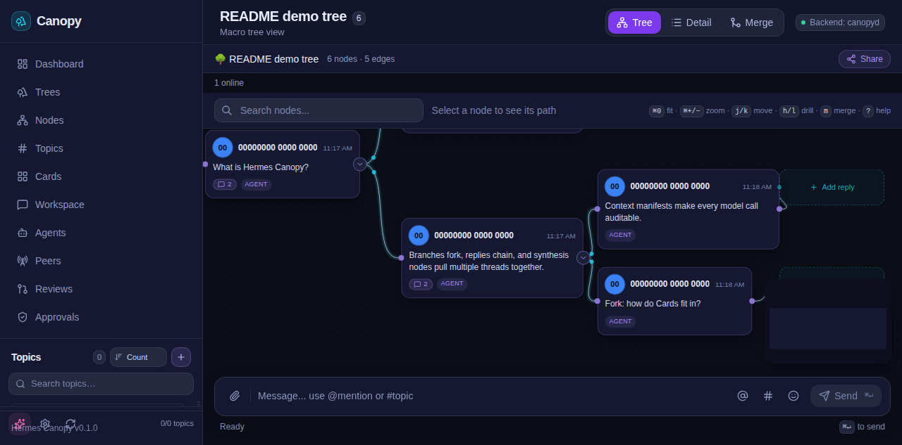
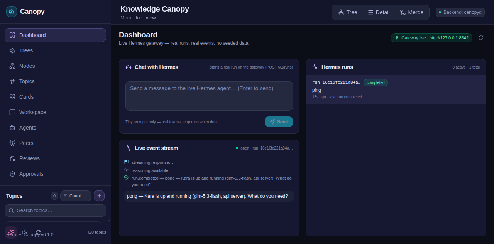

# Hermes Canopy

Canopy OS — graph-native collaboration surface for human-agent work.

Messages are nodes in a DAG. Every model call has a visible context manifest.
Every Card is a graph node with structured data.

<p align="center">
  
</p>

## Screenshots

<p align="center">
  
  <br>
  <em>Conversations render as a live DAG — branch, fork, and synthesize messages as graph nodes.</em>
</p>

<p align="center">
  
  <br>
  <em>Chat with a live Hermes gateway from inside Canopy — real runs, real events, no seeded data.</em>
</p>

## Quick Start

```bash
# Prerequisites
PostgreSQL 16+
Node.js 22+ (for frontend development)
Go 1.25+ (for build-from-source)

# Clone and build
git clone https://github.com/coding-hermes/hermes-canopy.git
cd hermes-canopy
make build

# Cards are stored in per-type SQLite databases (modernc.org/sqlite), pure Go.
# internal/card/duckdb (go-duckdb) is ARCHIVED: cgo-only, build-tagged
# `//go:build cgo`, zero importers repo-wide, no shipped build selects it.

# Start PostgreSQL (Docker) — standalone option.
# Already running the compose stack? Skip this block: `docker compose up -d`
# (docs/INTEGRATION.md §2) already starts a postgres service publishing host
# port 5437, and this command would fail on the port. The standalone container
# uses a DISTINCT name (`canopy-pg-standalone`) so it never collides with
# compose's `canopy-pg`. Host port 5437 matches docker-compose.yml (which maps
# 5437:5432) so the same DB_PORT works on either path.
if docker ps --format '{{.Ports}}' | grep -q ':5437->'; then
  echo "PostgreSQL already running on :5437 (compose stack) — skipping standalone Postgres (docs/INTEGRATION.md §2)."
else
  # Skip this step after `docker compose up -d` (it already runs `canopy-pg`), or use a distinct container name.
  docker run -d --name canopy-pg-standalone \
    -e POSTGRES_USER=canopy -e POSTGRES_PASSWORD=canopy \
    -e POSTGRES_DB=canopy -p 5437:5432 postgres:16
fi

# Run (dev: backend on :8091 to match the Vite dev proxy target)
DB_HOST=localhost DB_PORT=5437 DB_USER=canopy DB_PASSWORD=canopy DB_NAME=canopy \
  HTTP_ADDR=:8091 ./bin/canopyd

# Frontend (dev mode)
cd frontend
npm install
npm run dev

# CLI (separate terminal) — the CLI is an HTTP CLIENT of an already-running
# canopyd, so it is configured with a URL, not with server settings:
#   CANOPY_SERVER_URL  → the API base URL the CLI talks to (client setting)
#   HTTP_ADDR / DB_*   → listen address + PostgreSQL of a SERVER process; they
#                        never redirect the CLI.
# Without CANOPY_SERVER_URL the CLI targets http://localhost:8091, and it
# REFUSES to run when HTTP_ADDR/DB_* are set without an explicit URL: `tree
# create` is a write, and the CLI will not guess which instance to write into.
export CANOPY_SERVER_URL=http://localhost:8091   # the API you mean to change
export CANOPY_TOKEN=your-jwt-token               # see "Authentication (dev mode)"
./bin/canopyd tree create "My Tree" --content 'Hello from the CLI'
./bin/canopyd tree list

# Troubleshooting: "STALE BUILD" at startup
# If canopyd refuses to start with `STALE BUILD: database schema is newer than
# this binary's embedded migrations`, your database was created by a NEWER
# canopyd than the one you just ran (common after `git pull` without rebuild,
# or a compose image built from older HEAD). Fix: `make build` (or rebuild the
# docker image) and run again. `/health` reports both versions for comparison:
#   curl http://localhost:8091/health
#   -> {"status":"ok","service":"canopyd","schema_version":N,"embedded_migrations":N,"relay":{"mode":"air_gapped","status":"disabled","sessions":0}}
#      (the two schema numbers are what the guard compares and they must match:
#      they are what THIS binary reports at runtime, so read them from the
#      binary you are running, never from a count quoted here. The embedded
#      set itself is `migrations/` — numbered .up.sql/.down.sql pairs compiled
#      in by `migrations/embed.go` — which is authoritative and grows as new
#      migrations land. `relay` reflects the relay configuration this host runs.)

# Open the frontend
open http://localhost:5173  # dev mode (Vite dev server)
# The canopyd binary is API-only in MVP — the PWA is served separately, and a
# production build needs a same-origin reverse proxy, NOT "any static server":
# see the Note under "Production (Manual)" below, or deploy/reference-proxy.py.
```

## First 10 minutes (GAP-093)

Start here if this is your first time opening the PWA. No demo data is seeded
into your instance by default — what you see is only what you (or your agents)
create.

1. **Empty trees list = onboarding card.** With zero trees, `/trees` shows a
   "Welcome to Canopy" card with three real actions:
   - **Create your first tree** → the standard Create Tree dialog (title +
     root message are required; it POSTs to `/api/v1/trees`).
   - **Import a tree from an export file…** → pick a Canopy tree export JSON
     (produced by `GET /api/v1/trees/{id}/export`, e.g. from another instance
     or a backup). It POSTs to `/api/v1/trees/import` and opens the imported
     tree. Malformed files are rejected locally with the reason — nothing
     reaches the server.
   - **Hermes session import** is a command-line step today: run
     `./bin/canopyd session import` from the repo root against the running
     server (see [Hermes session source (GAP-077)](#hermes-session-source-gap-077)
     for what it reads and `--dry-run` to preview). There is no in-browser
     session import yet.
2. **First node.** Open the new tree — the Tree View canvas has a message
   composer at the bottom (`button[aria-label="Send message"]`). Type and
   send: your message appears on the canvas immediately.
3. **First agent run (optional).** The Dashboard (`/`) posts to the live
   Hermes gateway when one is reachable (`/api/v1/gateway/status`). Without a
   gateway it says so — nothing is faked.

Isolated throwaway instance (own DB, port, HOME, file root — nothing shared
with a live instance): `scripts/scratch-instance.sh` — recipe in
[docs/SCRATCH_INSTANCE.md](docs/SCRATCH_INSTANCE.md). Full integration guide:
[docs/INTEGRATION.md](docs/INTEGRATION.md).

## Authentication (dev mode)

Canopy uses HS256 JWT Bearer tokens for authentication. In development you **never
need to create a token manually** — but there are no `/api/v1/auth/register|login`
endpoints (multi-user auth is deferred post-MVP per AGENTS.md).

### Frontend (`npm run dev`)

The Vite dev proxy (`frontend/vite.config.ts`) auto-injects a pre-generated dev JWT
on every `/api` request. The token is HS256-signed with the backend's default secret
`dev-secret-change-me`, with `sub=00000000-0000-0000-0000-000000000001` and a
365-day expiry. This means `npm run dev` → instant authenticated access, zero
manual auth.

Override the token with `VITE_DEV_JWT` if you need a different subject or expiry.

### Direct API access (curl, scripts, etc.)

Sign your own HS256 JWT with `JWT_SECRET` (default `dev-secret-change-me`), then
send it as a Bearer token:

```bash
# Using node (quick one-liner)
node -e "
const crypto = require('crypto');
const header = Buffer.from(JSON.stringify({alg:'HS256',typ:'JWT'})).toString('base64url');
const payload = Buffer.from(JSON.stringify({
  sub:'00000000-0000-0000-0000-000000000001',
  iat:Math.floor(Date.now()/1000),
  exp:Math.floor(Date.now()/1000)+86400
})).toString('base64url');
const sig = crypto.createHmac('sha256','dev-secret-change-me').update(header+'.'+payload).digest('base64url');
console.log(header+'.'+payload+'.'+sig);
"
```

Then:

```bash
curl -H "Authorization: Bearer <token>" http://localhost:8091/api/v1/trees
```

### Public paths (no auth)

`/health`, `/healthz`, `/version` — no token required (`isPublicPath()` in
`internal/handler/auth.go`). Everything else under `/api/v1` needs the
`Authorization: Bearer <jwt>` header — including the SSE feeds, which is why the
frontend streams them with `fetch` rather than native `EventSource` (see
[SSE and authentication](#sse-and-authentication)).

### Dev-mode provisioning (fresh database)

When canopyd starts with the **default** dev secret it provisions the dev
identity itself, so a fresh database needs no manual SQL (the previously
required `scripts/seed-demo-data.sql` is optional again):

| Row | Value |
|-----|-------|
| `users` | `00000000-0000-0000-0000-000000000001` (`dev@canopy.dev`) — GAP-064 |
| `workspaces` | `00000000-0000-0000-0000-000000000010` (`Dev Workspace`, slug `dev`) — GAP-071 |
| `profiles` | `dev-hermes` (`Dev Hermes`), owned by the dev user — the file-viewer acting profile |
| `profile_route` | the dev workspace → `dev-hermes`, active |

Every insert is idempotent (a second boot inserts nothing) and the whole block
is skipped when `JWT_SECRET` is set to anything else — a production server
never mints users, workspaces or profiles. Provisioning is what makes the
[File viewers](#file-viewers-spec-pl-02) routes and
`POST /api/v1/workspaces/{ws}/profiles` work on a brand-new database.

### Production

**MUST** set a real `JWT_SECRET` environment variable. The dev secret
`dev-secret-change-me` must never leave the dev environment (see the comment in
`frontend/vite.config.ts`).

**The PWA has no login flow** (multi-user auth is deferred post-MVP — there is no
`/api/v1/auth/register|login` endpoint), and the Vite **dev** proxy is the only
component that injects a JWT today. A production static build therefore
authenticates in exactly one of these ways:

1. **The browser carries the token.** Build the PWA with
   `VITE_API_TOKEN=<jwt>`, or paste a token into the browser's
   `localStorage['canopy.token']`. **Every** call site in `frontend/src` then
   sends `Authorization: Bearer <jwt>`: REST through the shared helpers in
   `frontend/src/lib/api.ts` (`apiUrl` + `authInit`/`authHeaders`), and the four
   SSE feeds through the fetch-based client in `frontend/src/lib/sse.ts` (see
   README §"Production (Manual)" for the full recipe, and §"SSE and
   authentication" below for why streaming needs its own client).
2. **The reverse proxy injects the token** — `deploy/reference-proxy.py --token`,
   or the commented block in `deploy/nginx.canopy.conf` / `deploy/Caddyfile`.
   Only ever behind explicit authentication (HTTP Basic / auth gate): injecting a
   JWT on an open route hands a live canopyd credential to every anonymous
   caller, and the reference proxy refuses to start in that configuration.

Either way the JWT is minted by you (below) — deployment is **single-user** in
MVP.

### SSE and authentication

The streaming routes — `GET /api/v1/trees/{id}/events`,
`GET /api/v1/workspace/channels/{id}/feed`, `GET /api/v1/gateway/runs/{id}/events`
and `GET /api/v1/plugins/{id}/events` — are auth-gated exactly like the REST
routes (`AuthMiddleware` in `internal/handler/auth.go` reads the bearer token
from the `Authorization` header only). Native `EventSource` **cannot set request
headers**, so it has no authentication story in a static build: it returns
`TOKEN_MISSING` no matter which token the build carries. That is why
`frontend/src/lib/sse.ts` exists:

- **a token resolves** (production) → the feed is read with `fetch`, which does
  send `Authorization: Bearer <jwt>`; the `text/event-stream` wire format is
  parsed by that module;
- **no token resolves** (the `vite dev` proxy case, where the dev server injects
  the JWT) → it falls back to native `EventSource`, so dev behaviour is
  unchanged.

Two consequences worth knowing:

- A deployment that lets the **proxy** inject the token needs no frontend
  support for streaming at all — the proxy adds the header to the feed request
  too ("authenticate the proxy, not the browser").
- The file-stream hand-off follows the same rule: `resolveStreamUrl(fileId)`
  (`frontend/src/lib/fileApi.ts`) is what the viewer host hands to the DOM for
  `GET /api/v1/files/{id}/stream` — `<a href download>`, the sandboxed iframe's
  `canopy.__bootstrap.streamUrl` (the `img`/`video`/pdf.js source) and
  `viewer.get_stream_url`. Those loads are issued by the browser itself and
  cannot carry a bearer header, so **when a token resolves** the host fetches
  the bytes through the authenticated `fetch` path first and hands the DOM a
  `blob:` object URL instead — the viewer sandbox CSP already admits `blob:`
  (`img-src`, `media-src`, `worker-src`), and the host revokes the object URL on
  file change or unmount. With **no** token (the `vite dev` proxy case) the bare
  URL is retained unchanged. That path therefore works from a build whose only
  token lives in `VITE_API_TOKEN` / `localStorage['canopy.token']` too, with no
  proxy required.

For full auth details (claims, error codes, middleware), see [docs/API.md](docs/API.md) §Auth.

## Architecture

### Backend (canopyd)

```
┌─────────────────────────────────────────────────────┐
│                   HTTP Server (:8091)                │
│  ┌──────────────┐  ┌──────────┐  ┌───────────────┐  │
│  │   Handlers   │  │   SSE    │  │   Telemetry   │  │
│  │  (REST API)  │  │   Hub    │  │  (Prometheus) │  │
│  └──────┬───────┘  └────┬─────┘  └───────┬───────┘  │
│         │               │                │          │
│  ┌──────┴────────────────┴────────────────┴───────┐  │
│  │              Services Layer                      │  │
│  │  Tree | Node | Edge | Topic | Card | Graph     │  │
│  │  Approval | Sync | Profile | MLS               │  │
│  └─────────────────────┬──────────────────────────┘  │
│                        │                             │
│  ┌─────────────────────┴──────────────────────────┐  │
│  │              Data Layer (db/)                    │  │
│  │  Repositories | Migrations | Models            │  │
│  │  PostgreSQL (primary) + SQLite (cards)         │  │
│  └────────────────────────────────────────────────┘  │
└─────────────────────────────────────────────────────┘
```

### Frontend (React + TypeScript + Vite)

```
┌─────────────────────────────────────────────────────┐
│                   PWA (Service Worker)               │
│  ┌──────────┐  ┌──────────┐  ┌──────────────────┐  │
│  │  React   │  │  React   │  │  Yjs CRDT        │  │
│  │  Router  │  │  Flow    │  │  (Local replica)  │  │
│  └────┬─────┘  └────┬─────┘  └────────┬─────────┘  │
│       │             │                 │            │
│  ┌────┴─────────────┴─────────────────┴─────────┐  │
│  │            Data Stores                        │  │
│  │  treeStore | yjsProvider | usePresence       │  │
│  │  y-indexeddb (offline persistence)           │  │
│  └─────────────────────┬────────────────────────┘  │
│                        │                            │
│  ┌─────────────────────┴────────────────────────┐  │
│  │            SSE Sync Provider                   │  │
│  │     (Server-sent Events → Yjs updates)        │  │
│  └────────────────────────────────────────────────┘  │
└─────────────────────────────────────────────────────┘
```

### Data Model

| Entity | Storage | Description |
|--------|---------|-------------|
| Tree | PostgreSQL | Root container for a graph of nodes |
| Node | PostgreSQL + Yjs | A message or entity in the DAG; CRDT content in Yjs |
| Edge | PostgreSQL | Directed relationship between nodes (reply, fork, synthesis) |
| Topic | PostgreSQL | Named, searchable subgraph with #references |
| Approval | PostgreSQL | Multi-step approval workflow for merge operations |
| MLS Group | PostgreSQL | MLS group encryption for workspace collaboration (SPEC-FTR-03) — SHIPPED, mounted at `/api/v1/workspaces/{workspace_id}/mls`; local node/edge/card data at rest is still unencrypted |
| Snapshot | PostgreSQL | Point-in-time tree state for recovery |
| Event | PostgreSQL | Audit trail of all operations |
| Profile | PostgreSQL | User profiles and routing |
| Card | Per-type SQLite | Structured data nodes with interactive behavior |
| Transport | PostgreSQL | Multi-transport connection management (SSE, WebSocket, NATS) |

> 2026-09-20 amendment: the MLS surface is an interim server-side group-key model (persistent rotated epoch secret). It is NOT RFC 9420 MLS: no forward secrecy within an epoch, no post-compromise security, no ratchet tree. Cross-member encrypt/decrypt works; the real RFC 9420 implementation remains a future dependency decision (SPEC-FTR-03 D2).

**Storage reality.** Graph data (trees, nodes, edges, topics, profiles, approvals,
events, snapshots) lives in **PostgreSQL** today. **Cards do not use DuckDB:** they
ship on **per-type SQLite databases** (`modernc.org/sqlite`, CGo-free, pure Go)
under `~/.hermes/canopy/cards/`, overridable with `CANOPY_CARD_DATA_DIR`
(`internal/card/database.go`). `internal/card/duckdb/` still exists but is cgo-only
and has **zero importers repo-wide** — it is archived, not a shipped card backend.

**2026-09-16 storage ruling.** PostgreSQL contradicts the product vision (single
binary, no Docker, no PostgreSQL, no external dependencies) and the SQLite-native
Hermes ecosystem. The owner ruling is **SQLite-first** — `modernc.org/sqlite`
(pure Go, WAL) as the authoritative graph store inside one
zero-external-dependency binary. **Status: declared direction only.** It is tracked
as board row **GAP-076** and has **not landed**; PostgreSQL remains the authoritative
graph store until it does.

## API Reference

> **Canonical reference: [docs/API.md](docs/API.md)** — this table is a
> quick-reference of the primary endpoints, generated from
> `internal/server/server.go` + handler `Routes()` (verified live, GAP-032).
> All paths are under `/api/v1` and require a JWT Bearer token unless noted.
> Success **envelopes differ per route** — tree/topic/card create answer with a
> bare object, node create/reply/fork with `{"node":…,"edge":…}`, and
> `GET /files/recents` with a bare array. See
> [docs/API.md § Response envelopes](docs/API.md#response-envelopes-per-route).

### Trees

| Method | Path | Description |
|--------|------|-------------|
| `GET` | `/api/v1/trees` | List all trees |
| `POST` | `/api/v1/trees` | Create a tree |
| `GET` | `/api/v1/trees/{tree_id}` | Get tree details |
| `PATCH` | `/api/v1/trees/{tree_id}` | Update tree metadata |
| `DELETE` | `/api/v1/trees/{tree_id}` | Soft-delete a tree |
| `POST` | `/api/v1/trees/{tree_id}/share` | Share a tree with a user |
| `POST` | `/api/v1/trees/{tree_id}/presence` | Push presence heartbeat |
| `POST` | `/api/v1/trees/{tree_id}/presence/leave` | Leave presence session |
| `POST` | `/api/v1/trees/{tree_id}/merge` | Create a synthesis node from 2–100 source nodes (SPEC-API-04 §3) |

### Nodes

Tree-scoped (primary, membership-gated):

| Method | Path | Description |
|--------|------|-------------|
| `GET` | `/api/v1/trees/{tree_id}/nodes` | List nodes in a tree |
| `POST` | `/api/v1/trees/{tree_id}/nodes` | Create a node |
| `GET` | `/api/v1/trees/{tree_id}/nodes/{node_id}` | Get node details |
| `POST` | `/api/v1/trees/{tree_id}/nodes/{node_id}/fork` | Fork a node (create child branch; source must already have ≥1 child) |

Reference context (SPEC-PL-06 §9.3) — flat surface, bare node id, membership
resolved per node:

| Method | Path | Description |
|--------|------|-------------|
| `GET` | `/api/v1/nodes/{node_id}/reference-context` | Stored provenance of a multi-reference reply — `include_content`, `max_source_tokens` (max 2048), `verify_hash`; `404 REFERENCE_CONTEXT_NOT_FOUND` for a node that is not a multi-reference reply |

> **Merge endpoint:** `POST /api/v1/trees/{tree_id}/merge` is **implemented**
> (SPEC-API-04 §3; mounted in `internal/server/server.go` behind the
> authenticated tree-membership middleware). It creates one `synthesis` node
> with a `reply` edge from the placement target plus one `synthesis` edge per
> source, and is the **only** way to create a synthesis node. See
> [docs/API.md § Merge Tree (Create Synthesis Node)](docs/API.md#merge-tree-create-synthesis-node)
> for the canonical request/response contract, error codes and SSE events.
> Merging multiple sources into a **`message`** node is a distinct capability
> that ships as **multi-reference replies**:
> `POST /api/v1/trees/{tree_id}/reference-selections` (preflight) then
> `POST /api/v1/trees/{tree_id}/multi-reference-replies` (create), SPEC-PL-06.

> Edges are managed **implicitly** through node operations (reply/fork/synthesis)
> — there is no standalone edge API.

### Graph

| Method | Path | Description |
|--------|------|-------------|
| `GET` | `/api/v1/graph/trees/{tree_id}/subtree/{node_id}` | Get subtree (all descendants) |
| `GET` | `/api/v1/graph/trees/{tree_id}/ancestors/{node_id}` | Get ancestor chain |
| `GET` | `/api/v1/graph/trees/{tree_id}/stats` | Graph statistics |

### Sync (Yjs)

| Method | Path | Description |
|--------|------|-------------|
| `GET` | `/api/v1/trees/{tree_id}/sync` | Fetch Yjs snapshot |
| `POST` | `/api/v1/trees/{tree_id}/sync` | Push Yjs update |
| `POST` | `/api/v1/trees/{tree_id}/sync/snapshot` | Trigger a snapshot |

### Topics

| Method | Path | Description |
|--------|------|-------------|
| `GET` | `/api/v1/topics?tree_id={tree_id}` | List topics — `tree_id` required; optional `status`, `limit`, `offset` |
| `POST` | `/api/v1/topics` | Create a topic — body: `treeId`, `rootNodeId`, `title` (required), `description` (optional) |
| `GET` | `/api/v1/topics/{topic_id}` | Get topic details |
| `PATCH` | `/api/v1/topics/{topic_id}` | Update topic |
| `DELETE` | `/api/v1/topics/{topic_id}` | Delete a topic |

> GET requires the `tree_id` query parameter; the create body uses camelCase
> keys. Full request/response contract: docs/API.md § Topics.

### Cards

| Method | Path | Description |
|--------|------|-------------|
| `GET` | `/api/v1/cards` | List cards |
| `POST` | `/api/v1/cards` | Create a card |
| `GET` | `/api/v1/cards/{card_id}` | Get card details |
| `PATCH` | `/api/v1/cards/{card_id}` | Update card |
| `DELETE` | `/api/v1/cards/{card_id}` | Delete a card |

### Approvals

| Method | Path | Description |
|--------|------|-------------|
| `GET` | `/api/v1/approvals` | List approvals |
| `GET` | `/api/v1/approvals/pending` | List pending approvals |
| `GET` | `/api/v1/approvals/history` | List approval history |
| `GET` | `/api/v1/approvals/{approval_id}` | Get approval details |
| `POST` | `/api/v1/approvals/{approval_id}/approve` | Approve |
| `POST` | `/api/v1/approvals/{approval_id}/deny` | Deny |

> Approval requests are created internally by merge operations — there is no
> public create endpoint.

### File viewers (SPEC-PL-02)

| Method | Path | Description |
|--------|------|-------------|
| `POST` | `/api/v1/files/upload` | Upload bytes (multipart `file` part) — content-addressed by `sha256`, dedup-aware (`was_deduped`) |
| `POST` | `/api/v1/files/resolve` | Resolve a file by `hash_ref` (JSON) |
| `POST` | `/api/v1/files/resolve/batch` | Resolve up to 200 `hash_ref` entries in one call |
| `GET` | `/api/v1/files` | List files — `sort` (`created_desc` default), `mimeFilter`, `extensionFilter`, `viewableOnly`, `excludeQuarantined`, `limit` (1–200), `cursor` |
| `GET` | `/api/v1/files/recents` | Recently accessed files — `limit` (1–200, default 50) |
| `GET` | `/api/v1/files/{id}` | File metadata |
| `GET` | `/api/v1/files/{id}/stream` | File bytes — `Range` supported (206, `Content-Range`), `If-None-Match` → 304 |
| `GET` | `/api/v1/files/{id}/access` | Access-log entries (append-only table) |
| `POST` | `/api/v1/files/{id}/access` | Append one access entry — `action` + `viewer_slug` required |
| `DELETE` | `/api/v1/files/{id}` | Soft-delete a file |
| `GET` | `/api/v1/viewers` | List registered viewers (`audio_video`, `code`, `csv`, `image`, `json`, `markdown`, `pdf`) |
| `GET` | `/api/v1/viewers/{slug}` | One viewer registration |
| `POST` | `/api/v1/viewers/dispatch` | Resolve the viewer for `{file_id}` without opening it |

> The `/files` routes and `/viewers/dispatch` act as the **acting profile** of
> the JWT `sub`. On a fresh database started with the default dev secret,
> canopyd provisions that profile (plus a dev workspace) at startup — see
> § Authentication (dev mode) below. Full request/response contracts and error
> codes: [docs/API.md](docs/API.md) § File Viewers; runnable walkthrough:
> [docs/INTEGRATION.md](docs/INTEGRATION.md) § 6.

### SSE (Server-Sent Events)

| Method | Path | Description |
|--------|------|-------------|
| `GET` | `/api/v1/trees/{tree_id}/events` | Tree event stream (SSE) |

### Health (no auth)

| Method | Path | Description |
|--------|------|-------------|
| `GET` | `/health` | Health check |
| `GET` | `/metrics` | Prometheus metrics (if METRICS_ENABLED=true) |

### MCP (Model Context Protocol)

| Method | Path | Description |
|--------|------|-------------|
| `POST` | `/api/v1/mcp` | JSON-RPC 2.0 MCP endpoint — `initialize`, notifications, `ping`, `tools/list`, `tools/call` |

The MCP endpoint speaks JSON-RPC 2.0 over HTTP POST at
`POST /api/v1/mcp` (a trailing slash is accepted too). It requires the **same
JWT Bearer token as every other `/api/v1` route** (`Authorization: Bearer
<jwt>`) — it is mounted inside the authenticated group, not public. The
endpoint is **stateless**: it issues no session id, `initialize` is not
required before `tools/list`, and a client may reconnect without
re-initializing.

Handshake (`$TOKEN` is a dev JWT you sign yourself — see § Authentication
(dev mode); nothing prints a token at startup, so mint one with the snippet there
and `export CANOPY_TOKEN=<token>`):

```bash
# 1. initialize — negotiate a protocol revision
curl -s -X POST http://localhost:8080/api/v1/mcp \
  -H "Authorization: Bearer $TOKEN" -H 'Content-Type: application/json' \
  -d '{"jsonrpc":"2.0","id":1,"method":"initialize","params":{"protocolVersion":"2025-06-18","capabilities":{},"clientInfo":{"name":"curl","version":"0"}}}'
# 200 {"jsonrpc":"2.0","id":1,"result":{
#        "protocolVersion":"2025-06-18",
#        "capabilities":{"tools":{"listChanged":false}},
#        "serverInfo":{"name":"canopyd-canopy","version":"<build version>"}}}

# 2. notifications/initialized — a notification: HTTP 202 with an EMPTY body
curl -s -i -X POST http://localhost:8080/api/v1/mcp \
  -H "Authorization: Bearer $TOKEN" -H 'Content-Type: application/json' \
  -d '{"jsonrpc":"2.0","method":"notifications/initialized"}'
# HTTP/1.1 202 Accepted   (no body — a notification never gets an error object)

# 3. tools/list — the 7 tools this server implements
curl -s -X POST http://localhost:8080/api/v1/mcp \
  -H "Authorization: Bearer $TOKEN" -H 'Content-Type: application/json' \
  -d '{"jsonrpc":"2.0","id":2,"method":"tools/list"}'
```

Protocol revision negotiation: `protocolVersion` echoes the client's request
when the server supports it (`2025-06-18`, `2025-03-26`, `2024-11-05`);
anything else is answered with the server's **newest** supported revision and
the client decides whether it can continue. `ping` answers `{}`; any method
this endpoint does not implement answers `-32601` (for example
`resources/list`); a non-object `params` answers `-32602`.

Tools: `list_trees`, `get_tree`, `create_node`, `list_topics`,
`get_graph_stats`, `list_approvals`, `list_cards` — invoked with
`{"method":"tools/call","params":{"name":"<tool>","arguments":{…}}}`.
The revision reported by the handshake is the MCP spec revision, not the build
version; `serverInfo.version` is the binary's build version, identical to
`canopyd -version`.

Full request/response contract: [docs/API.md § MCP](docs/API.md#mcp-model-context-protocol).

## Deployment

### Stale deployments: hourly check + operator recovery

The live service is the systemd user unit `canopy-canopyd.service`, which runs
`/home/kara/bin/canopyd` — a plain `make build` never updates what systemd
executes. The systemd user timer `canopy-deploy-check.timer` re-checks the
deployed binary **every hour** (`OnBootSec=10min`, `OnUnitActiveSec=1h`,
`Persistent=true`) and auto-deploys it when it is stale and the worktree is
clean.

If a check reports `STALE_BLOCKED` (exit 2) the artifact is stale but the
worktree has tracked/untracked changes, so the auto-deploy was refused **on
purpose**: half-written worker code must never ship. The recovery path is:

```bash
git status --short              # see what is dirty
git commit …  # or: git stash push -m "deploy-check"
make deploy                     # atomic: build → install → restart → health → smoke
```

…or simply wait: the next hourly tick deploys automatically once the tree is
clean again. Two consecutive refusals raise a `deploy_stale_blocked_alert`
event in `.coding-hermes/board/events.jsonl` (one dirty tick is normal worker
traffic; two in a row is an operator problem), and its `severity` field tells
the two situations apart:

| `severity` | Meaning |
|------------|---------|
| `stale_but_serving` | the unit is up, so a stale binary is at least still serving traffic — degraded, not an outage |
| `stale_refused_to_start` | the unit is **not** up while the artifact is stale — **outage class**, escalate |

Full reference (exit codes, thresholds, systemd units): see
[Deploying → Automated staleness detection](#automated-staleness-detection-gap-067).

### Docker (Recommended)

> **Rootless / per-user Docker:** If `docker info` or `docker compose` fails with `permission denied ... /var/run/docker.sock`, the host may expose Docker through a per-user socket such as `/run/bunker/<agent>/docker.sock`. Point the Docker CLI at that socket with `export DOCKER_HOST=unix:///run/bunker/<agent>/docker.sock` (replace `<agent>` with your agent name).

```bash
# Optional but recommended: copy the env template (API_SERVER_KEY etc.)
cp .env.example .env

# Build the API image from THIS checkout, then start it. The image is compiled
# from your working tree and carries its own embedded migrations, so (re)build it
# after every pull or schema change: `docker compose up -d` on its own can reuse a
# cached image built from older HEAD, and that stale binary refuses to start
# against a newer database with
#   STALE BUILD: database schema is newer than this binary's embedded migrations
# The schema guard is deliberate — rebuild the image, never bypass it.
docker compose build canopyd
docker compose up -d

# This starts:
#   - canopyd on :8092 (host) → :8080 (container) — :8091 belongs to the host
#     systemd `canopy-canopyd.service` primary instance; compose is the
#     containerized alternative and must not fight it for the port
#   - PostgreSQL on :5437 (host) → :5432 (container) — note the non-standard host port!
#   - Health-gated startup (canopyd waits for PG)

# Verify (compose answers on :8092 — NOT the :8091 quick-start port)
curl http://localhost:8092/health

# View logs
docker compose logs -f canopyd
```

> **Compose is not isolated by `-p`.** `docker-compose.yml` hard-codes the
> container names (`canopy-server`, `canopy-pg`), the host port (`8092`) and the
> `pgdata` volume, so `docker compose -p <name>` collides with the running stack
> instead of forking it. For a throwaway instance beside the live one, use the
> native recipe in [docs/SCRATCH_INSTANCE.md](docs/SCRATCH_INSTANCE.md).

### Production (Manual)

```bash
# Build the static binary
make build

# Run with production configuration
HTTP_ADDR=:8091 \
DB_HOST=your-pg-host DB_PORT=5432 \
DB_USER=canopy DB_PASSWORD=$(cat /etc/secrets/db-password) \
DB_NAME=canopy \
LOG_LEVEL=warn \
METRICS_ENABLED=true \
  ./bin/canopyd
```

> **Note:** `canopyd` is **API-only** in MVP — it does not serve the PWA.
> The binary exposes the REST/SSE API on `HTTP_ADDR` (`:8091` via `make run`
> and compose; the raw binary defaults to `:8080`);
> the frontend must be served separately, and it must be served by a SAME-ORIGIN
> reverse proxy — **not** by "any static server":
>
> ```bash
> cd frontend && npm ci && npm run build   # produces frontend/dist/ (NOT frontend/frontend/dist)
> cd ..                                    # run the proxy from the repo root
> python3 deploy/reference-proxy.py --dist frontend/dist --port 3000 \
>     --api http://127.0.0.1:8091
> # → http://localhost:3000
> ```
>
> **Why a plain static server does not work.** An SPA fallback (`npx serve -s`,
> CDN "SPA mode") answers *every* unknown path with `index.html` — including
> `GET /api/v1/trees`. The app then runs `res.json()` over `<!doctype html>` and
> fails with `Unexpected token '<', "<!doctype "... is not valid JSON` while the
> UI reports "Backend: unreachable". The fallback is only for app routes
> (`/trees`, `/tree/<id>`, so `BrowserRouter` deep links survive a refresh);
> `/api/` and `/health` must always reach canopyd. For a real deployment use
> `deploy/nginx.canopy.conf` (`proxy_buffering off`) or `deploy/Caddyfile`
> (`flush_interval -1`) — both implement that split plus SSE-safe streaming.
>
> **The example port is not reserved.** `:3000` is a convention, not a
> guarantee — it is occupied on plenty of hosts. Set `--port` (or the nginx/Caddy
> listener) to something free; `deploy/reference-proxy.py` refuses to start on a
> busy port.
>
> **Pointing the PWA at the API.** The frontend reads `VITE_API_BASE_URL`
> (`frontend/src/lib/api.ts`), **not** `VITE_API_URL` — that name is only the
> Vite **dev** proxy target (`frontend/vite.config.ts`). Leaving
> `VITE_API_BASE_URL` unset is correct for the same-origin proxy above: the app
> calls the relative `/api/v1`. See docs/INTEGRATION.md §5 for details.
>
> **Production auth is single-user in MVP.** There are no
> `/api/v1/auth/register|login` endpoints, and the Vite **dev** proxy is the only
> thing that injects a JWT today, so a static build authenticates in one of two
> ways: bake a token at build time (`VITE_API_TOKEN=<jwt>`, or paste one into
> `localStorage['canopy.token']` in the browser), or let the reverse proxy inject
> `Authorization: Bearer <jwt>` — which `deploy/reference-proxy.py` and the nginx
> configs only do **behind explicit authentication** (HTTP Basic / auth gate).
> Either way the header reaches **every** call site, REST and SSE alike (the
> streaming feeds use the fetch-based client in `frontend/src/lib/sse.ts`,
> because native `EventSource` cannot set headers — see
> [SSE and authentication](#sse-and-authentication)). Only `/health`, `/healthz`
> and `/version` are public.
> Mint the JWT yourself with `JWT_SECRET` (see
> [Authentication (dev mode)](#authentication-dev-mode) → "Direct API access").

### Environment Variables

| Variable | Default | Description |
|----------|---------|-------------|
| `HTTP_ADDR` | `:8080` | HTTP listen address |
| `DB_HOST` | `localhost` | PostgreSQL host |
| `DB_PORT` | `5432` | PostgreSQL port |
| `DB_USER` | `canopy` | Database user |
| `DB_PASSWORD` | `canopy` | Database password |
| `DB_NAME` | `canopy` | Database name |
| `DB_SCHEMA` | `public` | Database schema |
| `DB_SSLMODE` | `disable` | PostgreSQL SSL mode |
| `LOG_LEVEL` | `info` | Log level (debug, info, warn, error) |
| `LOG_FORMAT` | `text` | Log format (text, json) |
| `METRICS_ENABLED` | `false` | Enable Prometheus metrics |
| `CORS_ORIGIN` | `*` | CORS allowed origins |
| `JWT_SECRET` | `dev-secret-change-me` | HS256 signing secret (set a real value in production) |
| `CANOPY_DB_URL` | *(unset)* | Override DSN; takes priority over all `DB_*` fields |
| `CONTEXT_MAX_ANCESTORS` | `50` | Max ancestors in context compilation |
| `CONTEXT_MAX_REFS` | `5` | Max topic references (soft; hard cap is 2×) |
| `CONTEXT_DEFAULT_BUDGET` | `8000` | Default token budget for context compilation. Also the fallback for every failure mode of `CONTEXT_BUDGET_PERCENT` below |
| `CONTEXT_BUDGET_PERCENT` | `60` | Percent of the **selected model's** context window used as the default compilation budget (GAP-080). The request names the model (`model` on `POST /api/v1/gateway/runs`, `?model=` on `GET /api/v1/context/{node_id}`) and the default becomes `floor(window × percent / 100)`. `0` **disables** the window-derived path, so `CONTEXT_DEFAULT_BUDGET` always applies. Falls back to `CONTEXT_DEFAULT_BUDGET` — never to an error — when no model is named, the model is unknown to the gateway's model catalog (its `GET /v1/models` list is read from a bare array, a `models` key, or the OpenAI-style `data` key, so an entry carrying no context window counts as unknown), or that catalog is unreachable. An explicit `token_budget`/`budget` always wins over the derived default; the two surfaces then differ on purpose — `GET /api/v1/context/{node_id}` caps an explicit `budget` at the model's context window when the catalog knows it (else at 10× `CONTEXT_DEFAULT_BUDGET`), while `POST /api/v1/gateway/runs` applies `token_budget` verbatim. `GET /api/v1/gateway/models` exposes this catalog to clients (per model: `context_window` and the `desired_budget` it would get), which is what the context manifest panel's model choice reads |
| `CONTEXT_MODEL_WINDOWS` | *(empty)* | Context windows **declared locally** for models the gateway reports none for (GAP-080 phase 2a), as comma-separated `model=window` pairs: `CONTEXT_MODEL_WINDOWS="Hermes Agent=200000,probe-big=128000"`. Whitespace around a pair, the name and the number is ignored, and the **last** `=` of a pair separates the two, so a model id may itself contain `=` (`weird=model=1000` declares `weird=model`); a later pair for the same model replaces an earlier one. Precedence per model is **live catalog window → declared window → neither**: a window the gateway reports always wins, so a declaration only ever fills a gap. Empty/unset means no overrides and leaves every answer byte-identical to the pre-knob behaviour. The knob exists because the live Hermes gateway answers `GET /v1/models` with an OpenAI-style `data` envelope carrying no `context_length` (measured on this deployment 2026-09-17: one entry, `{"id": "Hermes Agent", "object": "model", "owned_by": "hermes", …}`, and the endpoint requires a credential — an unauthenticated call is `401`), which leaves `CONTEXT_BUDGET_PERCENT` inert and every default at `CONTEXT_DEFAULT_BUDGET` (8000). Declare the window and the derivation activates — measured A/B on a scratch canopyd against this live gateway (2026-09-17), same route, same model: with `CONTEXT_MODEL_WINDOWS="Hermes Agent=200000"` the route answers `{"models":[{"id":"Hermes Agent","context_window":200000,"desired_budget":120000}],"percent":60,"default_budget":8000,"source":"configured_window"}` (and a run naming that model compiles `floor(200000 × 60/100)` = 120000 tokens), while without the knob the same route answers `context_window` 0 / `desired_budget` 8000 / `source` `unknown_model` (the route ENRICHES the gateway's own list — it never invents a model the gateway did not list, and a catalog failure still answers `200` with `"models":[]`). A malformed pair (no `=`, a blank model name, a non-integer window, a window ≤ 0, an empty entry from a stray comma) **fails startup**: `Validate()` returns the error and the process exits non-zero, rather than silently leaving the derivation inert |
| `PLUGIN_MAX_SIZE` | `1048576` | Max plugin source size in bytes (1 MB) |
| `CANOPY_FILE_ROOT` | `~/.canopy/files` | Uploaded file bytes (file viewer storage root). Returned **verbatim** — nothing is joined onto it |
| `CANOPY_CARD_DATA_DIR` | `~/.hermes/canopy/cards` | Card store directory (one SQLite DB per card type). Returned **verbatim**; set it to keep a scratch instance off the shared store without a scratch `HOME` |
| `CANOPY_GATEWAY_STATE_FILE` | `~/.hermes/canopy/gateway/runs.jsonl` | Gateway run registry. Returned **verbatim**, and it names the **file**, not a directory |
| `CANOPY_SERVER_URL` | `http://localhost:8091` | **CLI only** — API base URL the `tree`/`topic` subcommands call; an explicit value wins over `DB_*`/`HTTP_ADDR`, and a malformed one fails before any request (see "CLI") |
| `CANOPY_TOKEN` | *(unset)* | **CLI only** — Bearer token sent with each CLI request |

## Development

### Prerequisites

- go 1.25+ (required for build-from-source)
- PostgreSQL 16+ (Docker recommended)
- Node.js 22+ (for frontend development)
- Make

### Setup

```bash
# Install Go dependencies
go mod download

# Install frontend dependencies
cd frontend && npm install

# Start dev database
docker compose up -d postgres

# Run backend (make run defaults to :8091 to match the Vite dev proxy)
make run

# Run frontend (separate terminal)
cd frontend && npm run dev
```

> `make run` uses `HTTP_ADDR=:8091` and `DB_PORT=5437` by default so it matches
> the Vite dev proxy target (`frontend/vite.config.ts`) and the compose PG host
> port. Override the defaults as needed (e.g. `export DB_PORT=5432`).

### Testing

```bash
# All tests
make test

# Unit tests only (skip integration)
make test-short

# Frontend tests
cd frontend && npm test

# E2E / integration tests (requires PostgreSQL on :5437, canopyd,
# and the vite dev server on :5173)
cd frontend && npm run test:integration
```

### Deploying

The live service is the systemd user unit `canopy-canopyd.service`, which
executes `/home/kara/bin/canopyd` — a plain `make build` alone never updates
what systemd runs:

```bash
# Build from HEAD → atomic install → systemctl --user restart → /health poll
# → gateway surface smoke test (scripts/smoke-gateway.sh)
make deploy
```

#### Automated staleness detection (GAP-067)

A deployed binary can silently lag repo HEAD (the live 2026-09-02 artifact was
768,617s behind when this shipped). `scripts/check-deploy-staleness.sh`
compares the installed binary's mtime against the newest commit touching
`internal/`, `cmd/`, `migrations/`, `go.mod`, or `go.sum`:

| Exit | Meaning | Notes |
|------|---------|-------|
| `0` | `CURRENT` | artifact within threshold |
| `1` | `STALE` | over threshold, or binary missing |
| `2` | `STALE_BLOCKED` | stale + `--deploy`, but the worktree has tracked/untracked changes — auto-deploy refused so half-written worker code is never shipped |
| `3` | `ERROR` | operational failure (bad repo, unreadable paths, still stale after deploy) |

Overrides: `CANOPYD_STALE_REPO_ROOT`, `CANOPYD_STALE_PATH`
(default `/home/kara/bin/canopyd`), `CANOPYD_STALE_THRESHOLD_S`
(default `86400`), `CANOPYD_DEPLOY_CMD` (default `make deploy`),
`CANOPYD_DEPLOY_DIR`. `--deploy` only invokes the existing atomic
`make deploy` path when stale, then re-checks and fails if still stale —
manual `make deploy` behavior is unchanged.

#### Recovering from `STALE_BLOCKED`

Exit `2` is a deliberate refusal, not a failure: the deployed binary is stale
and the worktree has tracked/untracked changes, so auto-deploy is skipped —
deploying a half-written worker tree is worse than running one commit behind.
The operator path is to make the tree deployable again, then deploy:

```bash
git status --short                 # what is dirty?
git commit -am "…"                 # commit it…
git stash push -m "deploy-check"   # …or park it
make deploy                        # atomic install + restart + health + smoke
```

Waiting is also valid — the next hourly tick deploys by itself once the tree is
clean. Confirm afterwards with `bash scripts/check-deploy-staleness.sh`
(exit `0`, `CURRENT`).

#### Board alerts (GAP-069 / GAP-070)

The checker never leaves an outage-class condition to a raw exit code:

| Board event | Raised when | Threshold |
|-------------|-------------|-----------|
| `deploy_stale_alert` | every stale run (`STALE` / `STALE_BLOCKED`) | none — one event per stale run |
| `deploy_crashloop_alert` | the unit's `NRestarts` counter climbed between two runs | `CANOPYD_CRASHLOOP_THRESHOLD` (default `50`) |
| `deploy_stale_blocked_alert` | consecutive runs ended with a stale artifact left **un-remediated** — deploy refused on a dirty worktree, the deploy command failed, or the artifact was still stale after a deploy | `CANOPYD_STALE_BLOCKED_THRESHOLD` (default `2`) |

The stale-blocked alert is edge-triggered: it fires once as the streak crosses
the threshold (not once per hourly run, which would be a drumbeat) and re-arms
when a run comes back `CURRENT`. Its `detail` carries a `severity` field that
separates the two operator situations:

* `stale_but_serving` — the unit is up, so the stale binary is at least serving
  traffic. Degraded, fix it on your schedule.
* `stale_refused_to_start` — the unit is **not** up (or its state cannot be
  proven) while the artifact is stale. **Outage class**: this is the shape of
  the 2026-09-12 crash-loop, where a stale build met a newer schema and nothing
  watched the exits.

All three events are appended (never rewritten) to
`.coding-hermes/board/events.jsonl` by the checker itself; counters live in the
git-ignored `.coding-hermes/deploy-check-state.json`, so the checker can never
dirty the worktree its own gate then refuses.

Install the hourly systemd user timer (concrete unit names
`canopy-deploy-check.service` / `canopy-deploy-check.timer` — templates cannot
be enabled against `timers.target`; renders this checkout's path into
`~/.config/systemd/user`, `daemon-reload`, `enable --now`):

```bash
make install-deploy-timer
```

The timer runs the checker with `--deploy` once per **hour** (`OnBootSec=10min`,
`OnUnitActiveSec=1h`, `Persistent=true`, units tracked under
`deploy/systemd/`; GAP-070 moved this off `24h`, which left a refusal invisible
for a full day). It never deploys from a dirty worktree. Pre-flight
verification without touching the live session:

```bash
tmp=$(mktemp -d); CANOPYD_UNIT_INSTALL_DIR="$tmp" bash scripts/install-deploy-timer.sh
systemd-analyze --user verify "$tmp"/canopy-deploy-check.{service,timer}
systemctl --user enable --dry-run "$tmp/canopy-deploy-check.timer"   # rc 0 required
```

### Makefile Targets

| Target | Description |
|--------|-------------|
| `build` | Build the canopyd binary |
| `deploy` | Build, install to `/home/kara/bin/canopyd`, restart `canopy-canopyd`, run the gateway smoke test |
| `install-deploy-timer` | Install + enable the hourly deployed-binary staleness check timer (GAP-067) |
| `run` | Build and run with dev defaults (`:8091`, DB `:5437`) |
| `test` | Run all tests |
| `test-short` | Run tests (skip integration) |
| `test-chaos-disconnect` | QA chaos-disconnect probe — bounded window; runs the `test-short` suite (see `docs/E2E-EVIDENCE.md`) |
| `vet` | Run go vet |
| `lint` | Run golangci-lint |
| `clean` | Remove build artifacts |
| `docker` | Build Docker image |

### Code Quality

- **GitReins guards:** secrets scan, build, lint, tests on every commit
- **gitleaks:** secrets detection with spec/docs allowlist
- **Go vet:** zero-warning policy
- **golangci-lint:** configured in CI workflow
- **TypeScript:** strict mode, tsc --noEmit clean
- **Hilo:** dependency graph tracking for architecture drift detection. Its local cache lives in `.vfs/` (`.gitignore`d, fully rebuildable); regenerate the dependency graph after a fresh clone with `hilo graph warm`.

### Project Structure

```
├── cmd/canopyd/              — Entry point
│   ├── cli.go               — CLI command tree
│   └── main.go              — Server startup
├── deploy/                   — Deployment configs
│   ├── Dockerfile           — Multi-stage production build
│   └── grafana/             — Grafana dashboard config
├── docker-compose.yml       — Local development stack
├── frontend/                — React + TypeScript PWA
│   ├── src/
│   │   ├── components/      — React components
│   │   ├── pages/           — Route pages
│   │   ├── stores/          — State management (Yjs)
│   │   └── hooks/           — Custom hooks
│   └── tests/               — Playwright E2E tests
├── internal/
│   ├── card/                — Card subsystem (per-type SQLite)
│   ├── config/              — Configuration loading
│   ├── db/                  — Data layer
│   │   ├── migrations.go    — Embedded SQL migrations
│   │   ├── models.go        — Domain models
│   │   └── *_repo.go        — Repository implementations
│   ├── handler/             — HTTP handlers (REST API)
│   ├── hermes/              — Hermes integration
│   ├── mls/                 — MLS encryption service
│   ├── server/              — HTTP server
│   ├── service/             — Business logic layer
│   ├── sse/                 — SSE hub & connections
│   ├── sync/                — Sync engine
│   ├── telemetry/           — Prometheus metrics
│   ├── testutil/            — Test helpers
│   └── transport/           — Multi-transport adapters
├── migrations/              — SQL migration files
├── specs/                   — Architecture specifications
└── .vfs/                    — Local Hilo metadata (generated, rebuildable — not tracked; see Development)
```

## Configuration

### CLI

The `canopyd` binary doubles as an API client: the `tree` and `topic`
subcommands operate on a **running** canopyd over HTTP. Keep the two kinds of
settings apart — a client setting names the API to talk to, a server setting
configures a canopyd process:

| Setting | Kind | Meaning |
|---------|------|---------|
| `CANOPY_SERVER_URL` | client | API base URL the CLI talks to (default `http://localhost:8091`) |
| `CANOPY_TOKEN` | client | Bearer token sent with each request |
| `HTTP_ADDR` | server | listen address of a `canopyd serve` process — never a CLI destination |
| `DB_*`, `CANOPY_DB_URL` | server | PostgreSQL connection of a `canopyd serve` process — never a CLI destination |

The CLI enforces four rules (DF-HERMES-CANOPY-6):

1. An explicit `CANOPY_SERVER_URL` always wins — including while `DB_*` and
   `HTTP_ADDR` are set. That is the supported way to point the CLI at a scratch
   instance. It must be an absolute `http://` or `https://` URL with a host.
2. A malformed explicit value fails **before any request is sent**; the CLI never
   falls back to the default target.
3. With no `CANOPY_SERVER_URL` but any `HTTP_ADDR` / `DB_*` / `CANOPY_DB_URL` set,
   the CLI refuses to run and tells you to set `CANOPY_SERVER_URL`. `tree create`
   is a write and `tree list` reads a specific instance — guessing the destination
   is how a "scratch" run ends up writing into the live instance. `HTTP_ADDR` is a
   *listen* address, not an API URL, and `DB_PORT` says nothing about where the API
   is, so neither can be used to derive one.
4. With nothing configured, the historical default `http://localhost:8091` still
   applies. `-h` / `--help` never validates the target and never touches the network.

```bash
# Against the dev server from the Quick Start (API on :8091)
export CANOPY_SERVER_URL=http://localhost:8091
export CANOPY_TOKEN=your-jwt-token

./bin/canopyd tree create "My Tree" --content 'Hello from the CLI'
./bin/canopyd tree list
./bin/canopyd tree navigate <tree-id>
./bin/canopyd tree delete <tree-id>
```

```bash
# Scratch instance: a SECOND canopyd next to the one on :8091, with its own
# database, its own API port, its own HOME (cards + gateway registry) and its own
# file root. All four are required — a fresh database alone still shares the card
# store, the gateway run registry and uploaded files. The runnable recipe does the
# whole loop (preflight → build → start → auth → create/list → cleanup) and proves
# the live instance was untouched:
#   scripts/scratch-instance.sh
# Full walkthrough and the by-hand version: docs/SCRATCH_INSTANCE.md.
# The shape of it:
HTTP_ADDR=127.0.0.1:8093 DB_HOST=127.0.0.1 DB_PORT=5437 \
  DB_USER=canopy DB_PASSWORD=canopy DB_NAME=canopy_scratch_$(date +%s) \
  HOME=/tmp/canopy-scratch/home CANOPY_FILE_ROOT=/tmp/canopy-scratch/files \
  ./bin/canopyd serve &

# Then point the CLI at THAT API explicitly:
CANOPY_SERVER_URL=http://127.0.0.1:8093 CANOPY_TOKEN=$TOKEN \
  ./bin/canopyd tree create "Scratch tree" --content 'write target check'
```

> Setting `CANOPY_SERVER_URL` selects **which running instance** the CLI talks to;
> it does not create, reset, or otherwise isolate that instance's data — start the
> scratch server/database you want to target yourself
> ([docs/SCRATCH_INSTANCE.md](docs/SCRATCH_INSTANCE.md)). Do not use `:8091`
> (the native/live default) or `:8092` (the compose API) for a scratch server.

> `session import` and `session associations-backfill` are the exception: they run
> in-process against PostgreSQL (they read `DB_*` / `CANOPY_DB_URL` directly), so
> they are configured like a server rather than like an HTTP client. See
> [Hermes session source](#hermes-session-source-gap-077) for what they read.
>
> `card export` is the other exception: it reads the local per-type card stores
> directly (`CANOPY_CARD_DATA_DIR`, default `~/.hermes/canopy/cards`) and never
> touches the API or PostgreSQL — see [docs/CARD_EXPORT.md](docs/CARD_EXPORT.md).

### Hermes session source (GAP-077)

`canopyd session browse`, `session import` and `session associations-backfill`
read Hermes session history from the **6-hourly state snapshot**, not from the
live `~/.hermes/state.db`:

- **Location:** `$HOME/.hermes/state-backups/` (override: `--snapshot-dir`).
- **Names:** `state_<YYYYMMDD>-<HHMMSS>.db` with an optional `.zst` (current
  producer) or `.gz` (legacy) suffix. Nothing else in that directory is ever
  considered — the selection never leaves the directory and never follows a
  symlink.
- **Selection:** the newest file by its embedded timestamp (host-local, as
  `date +%Y%m%d-%H%M%S` writes it), then mtime, then name. Snapshots are written
  every 6 hours, so the newest is at most ~6h behind the gateway.
- **Recency bound:** a newest snapshot older than `--max-snapshot-age`
  (default `24h`) is refused instead of imported. `--max-snapshot-age 0`
  disables the bound.
- **Failure is loud, never a fallback.** A missing snapshot directory, no
  matching file, or a stale newest file exits non-zero naming the path — Canopy
  does not fall back to the live database. To read one specific database
  (bypassing snapshots entirely) pass `--db <path>`; that file is opened
  read-only too.
- **Read-only, zero contention.** Compressed snapshots are decompressed into a
  private `0444` copy under `$TMPDIR` (removed when the command ends) and opened
  with a read-only `ATTACH DATABASE 'file:<copy>?mode=ro&immutable=1'`; every
  query runs against that attached schema with `PRAGMA query_only(1)` set as a
  second guard. Plain `.db` snapshots are read in place, read-only. The live
  `state.db` is never opened, so no Canopy read can take a lock on, or write to,
  the file the gateway holds open.
- **Disk cost:** decompressing a current snapshot needs roughly 3× its
  compressed size free under `$TMPDIR` (~17 GB for a ~5.4 GB `.zst`). Point
  `TMPDIR` at a roomy filesystem if `/tmp` is small.

```bash
./bin/canopyd session browse                      # newest snapshot: session list
./bin/canopyd session browse --session <id>       # one session's messages
./bin/canopyd session import --limit 5 --dry-run  # what an import would add
./bin/canopyd session import --db /path/state.db  # explicit file, read-only
```

## Monitoring

When `METRICS_ENABLED=true`, the `/metrics` endpoint exposes:

- `request_total` — Request count by method, path, status
- `request_duration_seconds` — Request duration histogram
- `active_connections` — Concurrent request gauge
- `tree_count` — Number of trees in the database
- `node_count` — Number of nodes in the database
- `resume_duration_seconds` — Seconds between a user's first tree-scoped read
  (GET/HEAD) after an idle gap and the compiled context they resume with
  (histogram; the buckets include the 30 second SLO line)
- `resume_started_total` — Resume windows opened

`resume_duration_seconds` carries the resume metric behind the product's
"resume work in <30 seconds" claim. Semantics: a resume window **opens** on a
user's first successful (HTTP 2xx) tree-scoped read (GET/HEAD) after at least 5
minutes with no tree-scoped read by that user, and **completes** when that same
user's next successful `GET /api/v1/context/{node_id}` returns — the compiled
context, i.e. the point where the server has handed the user back their working
context. Only reads count: the tree-scoped routes include writes (PATCH/DELETE
`/api/v1/trees/{tree_id}` and the `POST` routes under it), and those never open,
refresh or complete a window.
`resume_started_total` counts windows opened, so a resume that never reaches a
context compile is visible as started-but-never-observed.

> This is the **server-observable** part of the claim, and nothing more: browser
> render time is not included, and a resume a user performs entirely from their
> local cache never reaches the server, so it is invisible here. It is not
> user-perceived latency.

Import `deploy/grafana/dashboard.json` into Grafana for a pre-built monitoring dashboard.

## Contributing

1. Read the specs in `specs/` directory
2. Check `.coding-hermes/board/tasks.jsonl` for active tasks
3. Every commit must include `Co-authored-by: Alexis Okuwa <wojonstech@gmail.com>`
4. Run `make test && make vet && make lint` before pushing
5. Never commit secrets, tokens, or passwords

## License

MIT License — see [LICENSE](LICENSE). Copyright (c) 2026 Alexis Okuwa and Hermes Canopy contributors.
