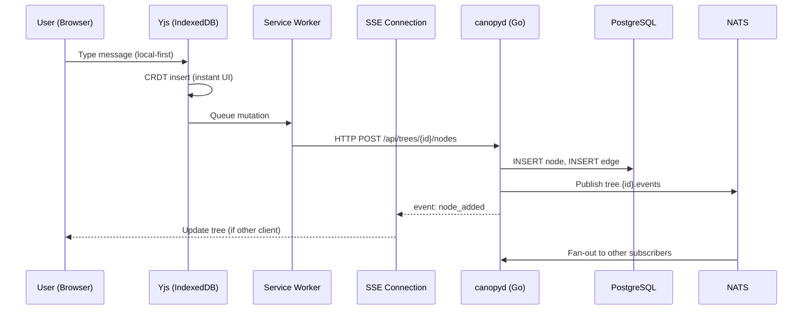
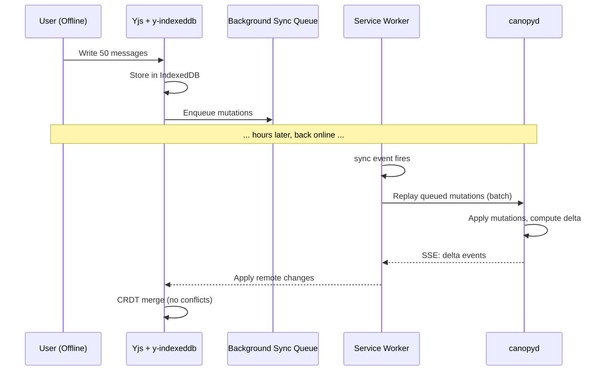
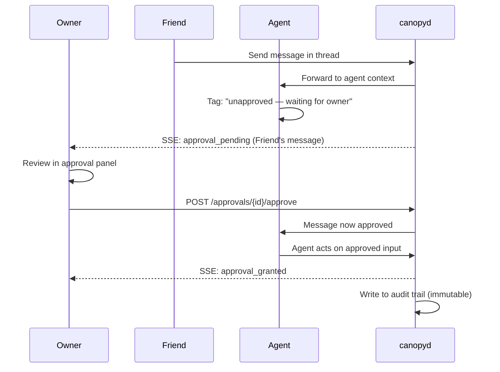

# Hermes Canopy — Architecture Document

> **Status:** Confirmed | **Date:** 2026-07-20 | **Phase:** 1 — Architecture & Research
> **Synthesizes:** T1.1–T1.8 research specs
> **Blocks:** Phase 2 (Data Model Specs)

---

## 1. Executive Summary

Hermes Canopy is a **graph-native collaboration surface for human-agent work**. Every message is a node in a DAG. Every model call has a visible context manifest. The agent's memory IS the interface — they are the same thing.

**Core value proposition:** Technical power users working with AI agents across multi-session projects can resume work in <30 seconds without manually reconstructing context.

Canopy replaces the linear chat log with a navigable conversation tree. Users drill into branches, pop back to macro view, merge alternatives, and compare paths. Multi-user with approval gates: friends join threads, agents listen to all input but only act on owner-approved input. Multi-profile: different Hermes profiles (coding, creative, research) participate in the same tree with independent context windows.

**First customer:** Bane/Kara — Hermes power user running the coding-hermes fleet. Daily multi-session agent work across 38+ projects. Needs context continuity without manual reconstruction.

---

## 2. Stack Decisions

### 2.1 Backend (Go)

| Component | Technology | Version | Rationale | Source |
|-----------|-----------|---------|-----------|--------|
| Language | Go | 1.24+ | Single binary, no runtime dependency, hermetic builds | AGENTS.md |
| HTTP Router | chi or net/http | Go 1.22+ stdlib | Pattern mux in stdlib is sufficient; chi for middleware chain | T1.1 |
| HTTP/2 | golang.org/x/net/http2 | latest | Required for SSE multiplexing (>6 connections) | T1.1 §1 |
| Database driver | pgx v5 | 5.7+ | PostgreSQL native, connection pooling, COPY protocol | Phase 2 |
| Migrations | golang-migrate | 4.18+ | File-based, CLI + library, PostgreSQL native | Phase 2 |
| MLS encryption | mls-rs (Rust) via CGo | latest | RFC 9420 implementation, single dependency | T1.7 |
| WebRTC | pion/webrtc | v4+ | Pure Go WebRTC stack, no CGo | T1.8 |
| NATS | nats.go | 1.38+ | Pub/sub message queue for reliable delivery | T1.1, T1.8 |

### 2.2 Frontend (TypeScript/React)

| Component | Technology | Version | Rationale | Source |
|-----------|-----------|---------|-----------|--------|
| Language | TypeScript | 5.7+ | Type safety across tree data model | AGENTS.md |
| Framework | React | 19+ | Concurrent features, Server Components (optional) | T1.3 |
| Build | Vite | 6+ | Fast HMR, PWA plugin, tree-shaking | AGENTS.md |
| Tree renderer | @xyflow/react | v12 | DOM-based nodes = rich chat messages, keyboard nav, 45KB | T1.3 |
| Layout engine | d3-hierarchy | 3.x | Tree/cluster/treemap algorithms, 25KB | T1.3 |
| CRDT | yjs | 13.6.x | 18KB gzipped, pure JS, Y.Map for nodes/edges | T1.2 |
| Offline persistence | y-indexeddb | ^9.0 | Yjs-native IndexedDB provider, 3KB | T1.4 |
| Service Worker | Workbox | v7 | Cache strategies, Background Sync, 8KB | T1.4 |
| Canvas fallback | Custom Canvas 2D | N/A | For >2000 node trees, manual renderer | T1.3 |
| PWA | vite-plugin-pwa | latest | Manifest, SW, install prompt | AGENTS.md |

### 2.3 Infrastructure

| Component | Technology | Version | Rationale | Source |
|-----------|-----------|---------|-----------|--------|
| Authoritative DB | PostgreSQL | 17+ | Tree nodes, edges, approvals, audit trail | AGENTS.md |
| Local replica | IndexedDB (browser) | N/A | Via y-indexeddb — no server dependency for offline | T1.4 |
| Card DB | DuckDB | 1.2+ | In-process, per-card-type SQLite files | AGENTS.md |
| Message queue | NATS | 2.10+ | Reliable delivery, offline queue, pub/sub | T1.1 |
| Relay server | canopyd binary | N/A | Single Go binary, self-hosted | T1.8 |
| Native packaging | Wails v3 | post-MVP | Go-native, 28K stars, WebView2/WKWebView/WebKitGTK | T1.6 |

### 2.4 Bundle Budget (Frontend)

| Component | Size (gzipped) | Notes |
|-----------|---------------|-------|
| React 19 | ~12KB | Production build |
| React Flow v12 | ~45KB | With dagre layout |
| d3-hierarchy | ~25KB | Tree/cluster algorithms |
| Yjs 13.6.x | ~18KB | Core CRDT |
| y-indexeddb | ~3KB | Offline persistence |
| Workbox v7 | ~8KB | Service Worker |
| **Total framework** | **~111KB** | **Well under 500KB target** |

---

## 3. Data Architecture

### 3.1 DAG vs Tree Distinction

Canopy's **data model** is a DAG (Directed Acyclic Graph). Every message is a node. Edges represent reply, fork, or synthesis relationships. Multi-parent nodes synthesize from multiple sources.

Canopy's **UI metaphor** is a tree. Users navigate branches, drill into sub-threads, pop back to macro view. The tree is how the DAG is visualized — not how it's stored.

```
Data model: DAG (nodes + typed edges)
UI metaphor: Tree (hierarchical navigation)
Context compiler: Traverses DAG, assembles budgeted window
```

### 3.2 Storage Layers

```
┌─────────────────────────────────────────────────┐
│                  PostgreSQL                       │
│  Authoritative: nodes, edges, snapshots,         │
│  approvals, audit_trail, profiles, memberships   │
├─────────────────────────────────────────────────┤
│              Yjs + IndexedDB                      │
│  Local-first replica: CRDT Y.Map, Y.Array       │
│  Offline writes via y-indexeddb                  │
│  Sync via custom SSE Yjs provider                │
├─────────────────────────────────────────────────┤
│                   DuckDB                          │
│  Card database: per-card-type SQLite files       │
│  Files, Tasks, Code cards                        │
│  Agent writes events, UI reads via SSE           │
└─────────────────────────────────────────────────┘
```

### 3.3 CRDT Model

**Decision: Yjs 13.6.x** (T1.2)

- Y.Map for nodes: `{ [nodeId]: { id, content, parentId, authorId, createdAt, ... } }`
- Y.Map for edges: `{ [edgeId]: { id, sourceId, targetId, type, createdAt } }`
- Y.Array for child ordering within a branch
- Conflict resolution: Yjs CRDT merge — no conflicts by design for tree structures where branching naturally avoids contention

### 3.4 Snapshot & Delta Model

Tree snapshots are SHA256-hashed point-in-time representations. Deltas are computed between any two snapshots:

```
TreeSnapshot { id, treeId, hash SHA256, nodeCount, edgeCount, createdAt }
Delta { fromHash, toHash, addedNodes[], removedNodes[], changedNodes[], addedEdges[], removedEdges[] }
```

Server streams only deltas since client's last-known hash. Full tree sync only on hash mismatch.

---

## 4. Transport Architecture

**Decision: SSE (HTTP/2) primary + protocol-agnostic adapter with 5 transports** (T1.1, T1.8)

### 4.1 Transport Adapter Interface (Go)

```go
type TransportAdapter interface {
    Connect(ctx context.Context, opts ConnectOptions) (*Connection, error)
    Send(ctx context.Context, msg *Message) error
    Receive(ctx context.Context) (<-chan *Message, error)
    Disconnect(ctx context.Context) error
    Health(ctx context.Context) error
}
```

### 4.2 Transport Implementations

| Transport | Direction | Use Case | Protocol |
|-----------|-----------|----------|----------|
| **SSE** | Server→Client | Primary real-time tree sync | HTTP/2, EventSource API |
| **HTTP POST** | Client→Server | Client mutations | REST API |
| **WebRTC** | P2P Bidirectional | P2P/LAN direct sync | DataChannel (CBOR) |
| **NATS** | Pub/Sub | Reliable message delivery, offline queuing | nats.go |
| **Redis Streams** | Pub/Sub | Alternative queue backend | Consumer groups |
| **Custom Relay** | Bidirectional | Self-hosted relay, air-gapped | TCP/TLS + CBOR |

### 4.3 Relay Protocol — 13 Opcodes

All transports speak the same opcode protocol. Opaque to transport:

```
NODE_ADDED, NODE_UPDATED, NODE_REMOVED, NODE_MOVED,
EDGE_ADDED, EDGE_REMOVED,
SNAPSHOT_CREATED, DELTA_COMPUTED,
APPROVAL_PENDING, APPROVAL_GRANTED, APPROVAL_DENIED, APPROVAL_EXPIRED,
HEARTBEAT
```

### 4.4 Deployment Mode → Transport Matrix

| Deployment Mode | Primary Transport | Fallback | Notes |
|----------------|-------------------|----------|-------|
| **Local** | localhost HTTP/2 + SSE | None | Zero network overhead |
| **LAN** | WebRTC P2P | SSE via LAN IP | mDNS discovery |
| **Self-hosted** | SSE via home server | NATS relay | Through home NAT |
| **SaaS** | SSE (HTTP/2 cloud) | NATS backend | Multi-tenant |
| **P2P** | WebRTC DataChannel | STUN/TURN relay | No server in data path |
| **Federated** | SSE + Cross-server NATS | Custom relay | Profile routing |
| **Air-gapped** | Custom relay (local) | File-based sync | No external network |

### 4.5 SSE Reconnection

- Browser EventSource auto-reconnects (3s initial, exponential backoff)
- Last-Event-ID header sent automatically on reconnect
- Server replays missed events from event log
- Server controls backoff via `retry:` field
- HTTP/2 multiplexing: 100+ streams per connection

---

## 5. Security Model

**Decision: MLS-only (RFC 9420). No Signal Protocol.** (T1.7)

### 5.1 Why MLS-Only

- Every Canopy conversation is inherently multi-participant (user + agent + profiles + friends)
- MLS handles groups of 2 with minimal overhead — no special 1:1 path
- Single dependency (mls-rs via CGo) halves attack surface
- Industry trajectory: MLS is RFC 9420, WhatsApp adopting
- Signal is the gold standard for phone-to-phone messaging — Canopy is an agent collaboration OS, not a messaging app

### 5.2 Encryption Architecture

```
Per-tree MLS group       → all tree members share one group
Per-topic subgroup       → restricted topics get their own MLS group
Key rotation             → on member join/leave, forward secrecy enforced
Server-side agent        → authorized decrypting participant (visible to all members)
Search over encrypted    → agent decrypts → indexes → re-encrypts
```

### 5.3 Go Implementation

```go
// CGo binding to mls-rs (Rust)
type MLSGroup struct {
    groupID    uuid.UUID
    treeID     uuid.UUID
    members    []uuid.UUID
    state      *mlsrs.Group
}

func NewMLSGroup(treeID uuid.UUID, members []uuid.UUID) (*MLSGroup, error)
func (g *MLSGroup) Encrypt(plaintext []byte) ([]byte, error)
func (g *MLSGroup) Decrypt(ciphertext []byte) ([]byte, error)
func (g *MLSGroup) AddMember(memberID uuid.UUID) error
func (g *MLSGroup) RemoveMember(memberID uuid.UUID) error
func (g *MLSGroup) RotateKeys() error
```

### 5.4 What Transport Sees

Transport sees: opcode type, tree UUID, sequence number, timestamp.  
Transport does NOT see: node content, author identity, card data, approval decisions.

### 5.5 Auth

- JWT tokens from existing Hermes auth system
- Tree membership enforced via middleware
- Profile tokens for cross-server federation (post-MVP)

---

## 6. Data Flow Diagrams

### 6.1 Primary Flow: User → Browser → SSE → canopyd → PostgreSQL



### 6.2 Offline → Reconnect → Sync



### 6.3 Multi-User Approval Flow



---

## 7. Frontend Architecture

### 7.1 Rendering Stack

```
React 19 + TypeScript 5.7
├── @xyflow/react v12 (tree nodes as React components)
│   ├── ChatMessageNode (avatar, markdown, code blocks, actions)
│   ├── BranchPointNode (expand/collapse, branch count badge)
│   └── SynthesisNode (multi-parent, merge indicator)
├── d3-hierarchy 3.x (layout algorithms)
│   ├── tree() for hierarchical layout
│   ├── cluster() for grouped branches
│   └── Custom spacing for branch visual connectors
└── Canvas fallback (for >2000 node trees)
    └── Parallel DOM for accessibility (ARIA tree roles)
```

### 7.2 Three View Modes

| Mode | What It Shows | When Used | Performance |
|------|--------------|-----------|-------------|
| **Macro** | Full tree at a glance. Collapsed branches with titles. | Navigating context, finding threads | <100 visible nodes, React Flow DOM |
| **Branch** | Single thread, full context chain. Linear within branch. | Deep reading, composing replies | <200 nodes, viewport-virtualized |
| **Merge** | Side-by-side or unified view of multiple branches. | Comparing alternatives, synthesis | 2–4 branches side-by-side |

### 7.3 Navigation

- **j/k:** Navigate between sibling nodes (up/down)
- **h/l:** Drill into branch / pop back to parent
- **m:** Merge selected branches
- **Enter:** Reply to selected node
- **Ctrl+K:** Search topics
- **Ctrl+Shift+N:** New topic

### 7.4 Offline Support

```
Service Worker (Workbox v7)
├── CacheFirst: static assets (JS, CSS, fonts)
├── NetworkFirst: tree data (fresh when online, cached when offline)
├── StaleWhileRevalidate: app shell (fast load, background update)
└── Background Sync: queued mutations replayed on reconnect

y-indexeddb: CRDT persistence (automatic — Yjs-native provider)
Custom SSE Provider: maps Canopy SSE events to Yjs updates
```

### 7.5 Context Compiler

The context compiler transparently assembles a budgeted, auditable context for every model call:

```
1. Identify the current node's ancestry chain
2. Resolve #references (fetch referenced topics)
3. Apply token budget (configurable per profile)
4. Assemble context manifest:
   - Direct ancestry nodes (most recent first)
   - Referenced topic summaries
   - Card data (Files, Tasks, Code)
   - Truncation markers: "3 messages omitted"
5. Send to model with manifest visible to user
```

---

## 8. Multi-User & Approval

### 8.1 Permission Model

| Role | Can Read | Can Write | Can Invite | Can Approve Agent Actions |
|------|----------|-----------|------------|--------------------------|
| **Owner** | All | All | Yes | Yes |
| **Admin** | All | All | Yes | Yes (delegated) |
| **Member** | Authorized threads | Authorized threads | No | No |
| **Viewer** | Authorized threads | No | No | No |

### 8.2 Approval Architecture

Agent listens to ALL messages in authorized threads. Every input is tagged:
- "Owner message — auto-approved"
- "Admin message — auto-approved (if delegated)"
- "Member message — pending owner approval"
- "Viewer message — read-only, no action possible"

### 8.3 Approval Panel UX

- **Pending count badge:** Visible in sidebar at all times
- **Each pending approval shows:** Sender avatar + name, full message body (not hidden), context chain, approve/deny/reply-first buttons
- **Approval granularity:** Per-message, per-thread ("approve everything from Jane in #database-schema"), per-user ("Jane is trusted")
- **Audit trail:** Immutable log of all approval actions, searchable, exportable

### 8.4 Auto-Approval Rules

```
Rule: { id, owner_id, target_user_id, target_thread_id, target_profile_id, action: approve|deny }
Conflict: two rules match → most specific wins (thread > user > profile)
```

---

## 9. Native App Strategy

**MVP:** Go `embed` + localhost HTTP server. Single binary: `canopyd serve` serves everything. PWA in browser. Ships immediately with zero native-packaging investment. (T1.6)

**Post-MVP:** Wails v3. Go-native framework (28K stars, MIT). Embeds system WebView (WebView2 on Windows, WKWebView on macOS, WebKitGTK on Linux). True native window, multi-window support for Canopy's panel architecture, native menus, tray icon. (T1.6)

| Component | MVP (Go embed) | Wails v3 (Post-MVP) |
|-----------|---------------|---------------------|
| Window | Browser tab | Native window |
| Build | `go build` | `wails build` |
| IPC | HTTP REST + SSE | Wails IPC + HTTP fallback |
| Multi-window | Browser tabs | Wails multi-window API |
| Backend reuse | N/A | 100% (same Go code) |
| Frontend reuse | N/A | 100% (same React code) |
| Binary size | ~15MB (Go) | ~25MB (Go + WebView) |
| Startup time | <100ms | <500ms |

---

## 10. Cost Estimates

### 10.1 Single-User (MVP)

| Resource | Monthly Cost | Notes |
|----------|-------------|-------|
| Local PostgreSQL | $0 | Runs on user's machine |
| canopyd binary | $0 | Single Go binary |
| Bandwidth (local) | $0 | Loopback |
| **Total MVP** | **$0/mo** | Fully local |

### 10.2 Self-Hosted (Post-MVP)

| Resource | Monthly Cost | Notes |
|----------|-------------|-------|
| Hetzner CX22 (2 vCPU, 4GB) | ~$5 | canopyd + PostgreSQL |
| NATS (embedded) | $0 | Runs in canopyd process |
| STUN/TURN (metered.ca) | $0 | Free tier (500GB/mo) |
| Backup storage (Hetzner Storage Box) | ~$3 | 1TB |
| **Total Self-Hosted** | **~$8/mo** | Per instance |

### 10.3 SaaS (Per Tenant)

| Resource | Monthly Cost | Notes |
|----------|-------------|-------|
| PostgreSQL (shared) | ~$20 | Multi-tenant, schema-per-tenant |
| Compute (canopyd) | ~$15 | 2 vCPU, 4GB |
| NATS cluster | ~$10 | 3-node for HA |
| Bandwidth | ~$5 | 100GB egress |
| **Per-tenant cost** | **~$5/mo** | At 10 tenants on shared infra |

### 10.4 Storage Estimates

| Tree Size | Nodes | Edges | PostgreSQL | IndexedDB |
|-----------|-------|-------|------------|-----------|
| Small project | 1,000 | 1,050 | ~2MB | ~1MB |
| Medium project | 10,000 | 10,500 | ~20MB | ~10MB |
| Large project | 100,000 | 105,000 | ~200MB | ~100MB |
| Canopy (card DB) | N/A | N/A | ~5MB/card type | DuckDB in-process |

---

## 11. Phase Roadmap

### MVP (Phases 1–6)

| Phase | Name | Scope | Status |
|-------|------|-------|--------|
| **1** | Architecture & Research | 8 research specs, stack decisions | ✅ Complete |
| **2** | Data Model Specs | DDL, Go structs, TypeScript types, CRDT schema | Pending |
| **3** | API Specs | REST + SSE endpoints, error catalog, auth | Pending |
| **3b** | Topic Management Specs | Auto-detection, #references, search, sidebar | Pending |
| **3c** | Plugin & App Card Specs | JS plugins, file viewers, card system, calendar | Pending |
| **3d** | Post-MVP Architecture Specs | Multi-user, federation, MLS, multi-transport, relay | Pending |
| **4** | Backend (Go Gateway) | SSE + REST, PostgreSQL, sync engine, auth | Pending |
| **5** | Frontend (React PWA) | Tree UI, CRDT, SSE sync, navigation, approval panel | Pending |
| **6** | Integration & Wiring | E2E flows, multi-user tests, CLI wiring, perf baseline | Pending |

### Post-MVP (Phases 7–10)

| Phase | Deliverable |
|-------|------------|
| **7** | Testing & Hardening — 80% coverage, chaos engineering, security audit |
| **8** | Production Deployment — Docker, Wails, observability, CI/CD, docs |
| **9** | Distribution & Multi-Tenant — SaaS, self-host guide, open source |
| **10** | Continuous Improvement — Never-done audit, user feedback loop |

### Deferred (Intentionally Post-MVP)

- Multi-user collaboration (data model designed, implementation deferred)
- MLS encryption (Go interface spec'd, CGo binding deferred)
- Multi-agent federation (cross-server profile routing deferred)
- Arbitrary JS plugins (sandbox designed, execution deferred)
- All 7 non-local deployment modes (transport adapter spec'd, adapters deferred)

---

## 12. Decision Registry

Every architectural decision with its provenance:

| Decision | Choice | Rejected Alternatives | Source |
|----------|--------|----------------------|--------|
| Transport | SSE (HTTP/2) | WebSocket (sticky sessions), NATS-only (no browser) | T1.1 |
| CRDT library | Yjs 13.6.x | Automerge (320KB WASM, 50ms startup) | T1.2 |
| Tree renderer | React Flow v12 + d3-hierarchy | D3.js SVG (DOM ceiling), Custom Canvas (no a11y) | T1.3 |
| Offline stack | Workbox v7 + y-indexeddb | SQLite WASM (320KB+ payload), Delta Chat (30s–5min latency) | T1.4 |
| Approval UX | GitHub triage + Linear notification + Google Docs granularity | Slack reactions (too simple), Jira workflow (too complex) | T1.5 |
| Native packaging | Go embed (MVP) → Wails v3 (post-MVP) | WebUI (4.1K stars, conflicting philosophy), Electron (150MB+), Tauri (Rust) | T1.6 |
| Encryption | MLS-only (RFC 9420) | Signal Protocol (phone-to-phone, not multi-participant), hybrid (doubled attack surface) | T1.7 |
| Transport adapter | 5 adapters behind Go interface | Single-transport lock-in, no P2P path | T1.8 |

---

## Appendix A: Repository Map

```
hermes-canopy/
├── AGENTS.md                  # Project identity + architecture overview
├── vision-brief.html          # Product Vision & Architecture Brief v2.0
├── .coding-hermes/
│   └── tasks.md               # Task board (this doc's source of truth)
├── specs/
│   ├── T1.1-transport-research.md          (228 lines)
│   ├── T1.2-crdt-evaluation.md             (446 lines)
│   ├── T1.3-tree-visualization-research.md (224 lines)
│   ├── T1.4-offline-stack-research.md      (332 lines)
│   ├── T1.5-approval-ux-research.md        (462 lines)
│   ├── T1.6-webui-evaluation.md            (281 lines)
│   ├── T1.7-mls-encryption.md              (294 lines)
│   ├── T1.8-multi-transport-architecture.md(1254 lines)
│   └── ARCHITECTURE.md                     (this file)
└── (Phase 2+: cmd/canopyd, internal/, pkg/, web/, Dockerfile, Makefile)
```

## Appendix B: Key External References

| Reference | URL | Relevance |
|-----------|-----|-----------|
| MLS RFC 9420 | datatracker.ietf.org/doc/rfc9420/ | Encryption protocol standard |
| Yjs | github.com/yjs/yjs | CRDT library (17K stars) |
| React Flow | reactflow.dev | Tree node renderer (30K stars) |
| Wails | wails.io | Go native app framework (28K stars) |
| Workbox | developer.chrome.com/docs/workbox | Service Worker library |
| mls-rs | github.com/openmls/mls-rs | Rust MLS implementation |
| pion/webrtc | github.com/pion/webrtc | Go WebRTC stack |
| NATS | nats.io | Cloud-native messaging |
