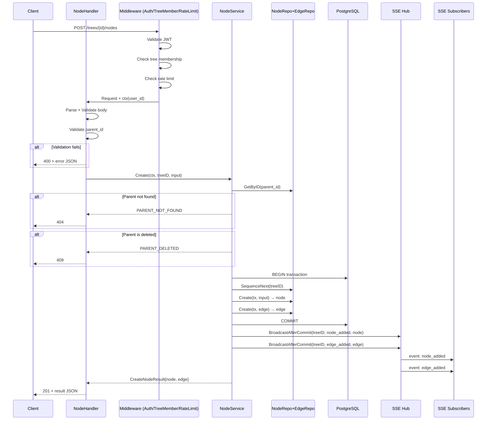

# SPEC-API-03 — Node CRUD Endpoints

> **Status:** Spec | **Blocks:** SPEC-API-04, SPEC-API-07, BE-04 (Node Service), BE-11 (HTTP Router), BE-12 (Integration Tests), FE-03 (Tree Rendering), FE-05 (Message Composer)
> **References:** SPEC-DM-01, SPEC-DM-02, SPEC-DM-04, SPEC-API-01, SPEC-API-02, ARCHITECTURE.md §3, ARCHITECTURE.md §5

---

## 1. Purpose

Define the exact REST endpoint contracts for Canopy node lifecycle operations: create, update, soft-delete, reply, and fork. Nodes are messages in the conversation DAG — this is the primary interaction surface for both human users and Hermes profiles. A Go worker reading this spec must produce a correct `NodeService` and `NodeHandler` implementation with zero clarifying questions. A TypeScript worker reading this spec must produce a correct API client with Zod-validated types.

Nodes are the atomic unit of conversation in Canopy. Every message typed by a user, every response from an agent, every system event — all are nodes. The node CRUD endpoints are the write path for everything that happens in a tree. The read path is the SSE event stream (SPEC-API-01).

---

## 2. Design Decisions (from ARCHITECTURE.md)

| Decision | Choice | Source |
|----------|--------|--------|
| HTTP Router | chi or Go 1.22+ stdlib pattern mux | ARCHITECTURE.md §2.1 |
| Serialization | JSON (application/json) | ARCHITECTURE.md §5 |
| Auth | JWT Bearer token validated on every request | ARCHITECTURE.md §5.5, SPEC-API-01 §8 |
| IDs | UUIDv7 (time-ordered, RFC 9562) on server | SPEC-DM-01 §3.1 |
| Soft-delete | `deleted_at` column, permanent purge after 30 days | SPEC-DM-01 §3.4 |
| Content max | 64KB for `content` field, 1MB total request body | This spec §12 |
| Single-parent | Default. Multi-parent only on synthesis nodes | ARCHITECTURE.md §3.1, SPEC-DM-01 §3.3 |
| Node ordering | `sequence_num` BIGINT monotonic within tree_id | SPEC-DM-01 §3.3 |
| Timestamps | `clock_timestamp()` server-side, immutable | SPEC-DM-01 §3 |
| Parent validation | Parent must exist, must be in same tree, must not be soft-deleted | This spec §3 |
| Computed fields | `depth` and `child_count` computed at query time, not stored | This spec §3 |
| SSE broadcast | Every node mutation broadcasts via SSE Hub (SPEC-API-01) | SPEC-API-01 §4 |

---

## 3. POST /trees/{tree_id}/nodes — Create Node

### 3.1 Route

```
POST /trees/{tree_id}/nodes
```

| Field | Value |
|-------|-------|
| Method | POST |
| Path | `/trees/{tree_id}/nodes` |
| tree_id | UUIDv7 |
| Auth | Required (Bearer token) |
| Content-Type (request) | `application/json; charset=utf-8` |
| Content-Type (response) | `application/json; charset=utf-8` |
| Request body max | 1 MB |

### 3.2 Request Body

```json
{
  "parent_id": "0191a8b2-7fff-7000-9000-000000000101",
  "content": "What do you think about using PostgreSQL for the tree storage?",
  "content_format": "markdown",
  "node_type": "message",
  "edge_type": "reply",
  "metadata": {
    "attachments": [],
    "mentions": ["0191a8b2-7fff-7000-9000-000000000042"]
  }
}
```

| Field | Type | Required | Default | Description |
|-------|------|----------|---------|-------------|
| `parent_id` | UUIDv7 string | Yes | — | Parent node ID. Must exist in same tree. Must not be soft-deleted. Use tree's `root_node_id` for top-level messages. |
| `content` | string | Yes | — | Message content. 1–65536 characters. Empty string is valid (attachment-only messages). |
| `content_format` | string | No | `"markdown"` | Format: `markdown`, `plain`, or `rich` (HTML subset). |
| `node_type` | string | No | `"message"` | Node type: `message`, `synthesis`, or `system`. Only `message` for standard user/agent nodes. `synthesis` reserved for merge nodes (SPEC-API-04). `system` reserved for server events. |
| `edge_type` | string | No | `"reply"` | Edge relationship: `reply` (extends parent linearly), `fork` (branches from parent). |
| `metadata` | object | No | `{}` | Arbitrary JSON key-value pairs. Max 16KB serialized. |

### 3.3 Request Validation

| Check | Error Code | HTTP Status |
|-------|-----------|-------------|
| `parent_id` is not a valid UUIDv7 | `INVALID_PARENT_ID` | 400 |
| `parent_id` does not exist in `trees/{tree_id}` | `PARENT_NOT_FOUND` | 404 |
| `parent_id` is soft-deleted (`deleted_at IS NOT NULL`) | `PARENT_DELETED` | 409 |
| `content` exceeds 65536 characters | `CONTENT_TOO_LONG` | 400 |
| `content_format` not in `markdown`, `plain`, `rich` | `INVALID_CONTENT_FORMAT` | 400 |
| `node_type` not in `message`, `synthesis`, `system` | `INVALID_NODE_TYPE` | 400 |
| `node_type` is `synthesis` — use merge endpoint (SPEC-API-04) | `SYNTHESIS_VIA_MERGE_ONLY` | 400 |
| `node_type` is `system` — forbidden (system nodes are server-generated) | `SYSTEM_NODE_FORBIDDEN` | 403 |
| `edge_type` not in `reply`, `fork` | `INVALID_EDGE_TYPE` | 400 |
| `metadata` exceeds 16KB serialized | `METADATA_TOO_LARGE` | 400 |
| Request body > 1MB | `REQUEST_TOO_LARGE` | 413 |
| User is not a tree member | `NOT_TREE_MEMBER` | 403 |
| Tree is soft-deleted | `TREE_DELETED` | 410 |

### 3.4 Server-Side Computations

The server computes the following fields at insertion time:

| Field | Computation |
|-------|-------------|
| `id` | `uuidv7()` — generated by PostgreSQL |
| `tree_id` | From URL path parameter |
| `author_id` | From JWT subject claim |
| `sequence_num` | `SELECT COALESCE(MAX(sequence_num), 0) + 1 FROM nodes WHERE tree_id = $1` |
| `created_at` | `clock_timestamp()` |
| `edited_at` | `NULL` (set to `created_at` after first edit) |
| `deleted_at` | `NULL` |
| `depth` | `parent.depth + 1` (root node depth = 0) |
| `child_count` | `0` (new nodes have no children) |

These fields are returned in the response but are never accepted from the client.

### 3.5 Edge Creation

Every node creation also creates an edge from `parent_id` to the new node:

```sql
INSERT INTO edges (id, tree_id, source_node_id, target_node_id, edge_type, created_at)
VALUES (uuidv7(), $tree_id, $parent_id, $new_node_id, $edge_type, clock_timestamp())
```

The edge is created in the same transaction as the node. If edge creation fails, the node is rolled back.

### 3.6 Response — 201 Created

```json
{
  "node": {
    "id": "0191a8b2-7fff-7000-9000-000000000201",
    "tree_id": "0191a8b2-7fff-7000-9000-000000000001",
    "parent_id": "0191a8b2-7fff-7000-9000-000000000101",
    "author_id": "0191a8b2-7fff-7000-9000-000000000042",
    "author_display_name": "Bane",
    "content": "What do you think about using PostgreSQL for the tree storage?",
    "content_format": "markdown",
    "node_type": "message",
    "sequence_num": 248,
    "metadata": {
      "attachments": [],
      "mentions": ["0191a8b2-7fff-7000-9000-000000000042"]
    },
    "depth": 3,
    "child_count": 0,
    "created_at": "2026-07-20T23:15:00Z",
    "edited_at": null,
    "deleted_at": null
  },
  "edge": {
    "id": "0191a8b2-7fff-7000-9000-000000000301",
    "tree_id": "0191a8b2-7fff-7000-9000-000000000001",
    "source_node_id": "0191a8b2-7fff-7000-9000-000000000101",
    "target_node_id": "0191a8b2-7fff-7000-9000-000000000201",
    "edge_type": "reply",
    "created_at": "2026-07-20T23:15:00Z"
  }
}
```

### 3.7 Response Fields

| Field | Type | Source | Description |
|-------|------|--------|-------------|
| `id` | UUIDv7 | `nodes.id` | Server-generated node ID |
| `tree_id` | UUIDv7 | `nodes.tree_id` | Owning tree |
| `parent_id` | UUIDv7 \| null | `nodes.parent_id` | Parent node (null for root) |
| `author_id` | UUIDv7 | `nodes.author_id` | Author from JWT subject |
| `author_display_name` | string | JOIN profiles | Cached display name |
| `content` | string | `nodes.content` | Message body |
| `content_format` | string | `nodes.content_format` | Rendering format |
| `node_type` | string | `nodes.node_type` | Node classification |
| `sequence_num` | integer | `nodes.sequence_num` | Monotonic position in tree |
| `metadata` | object | `nodes.metadata` | Arbitrary metadata |
| `depth` | integer | Computed | Distance from root (root=0) |
| `child_count` | integer | Computed | Number of direct children (via edges WHERE source_node_id = id) |
| `created_at` | ISO 8601 | `nodes.created_at` | Creation timestamp |
| `edited_at` | ISO 8601 \| null | `nodes.edited_at` | Last edit (null if never edited) |
| `deleted_at` | ISO 8601 \| null | `nodes.deleted_at` | Soft-delete timestamp (null = active) |

### 3.8 SSE Events Emitted

On successful node creation, the SSE hub broadcasts:

```
event: node_added
data: {full node JSON as above}

event: edge_added
data: {full edge JSON as above}
```

These are broadcast to all clients subscribed to `trees/{tree_id}/events`. The creating client receives them like everyone else — the SSE stream is the source of truth for tree state.

---

## 4. PATCH /nodes/{node_id} — Update Node

### 4.1 Route

```
PATCH /nodes/{node_id}
```

| Field | Value |
|-------|-------|
| Method | PATCH |
| Path | `/nodes/{node_id}` |
| node_id | UUIDv7 |
| Auth | Required (Bearer token) |
| Content-Type (request) | `application/json; charset=utf-8` |
| Content-Type (response) | `application/json; charset=utf-8` |

### 4.2 Request Body

```json
{
  "content": "What do you think about using PostgreSQL for the tree storage? Updated with schema example.",
  "content_format": "markdown",
  "metadata": {
    "attachments": [],
    "mentions": ["0191a8b2-7fff-7000-9000-000000000042", "0191a8b2-7fff-7000-9000-000000000105"]
  }
}
```

All fields are optional. Only provided fields are updated (partial update / PATCH semantics).

| Field | Type | Required | Description |
|-------|------|----------|-------------|
| `content` | string | No | Updated message content. Same limits as create (1–65536 chars). |
| `content_format` | string | No | Updated format. Same allowed values. |
| `metadata` | object | No | **Replaces** metadata entirely (not merged). To add/remove keys, client sends complete desired state. |

### 4.3 Validation

| Check | Error Code | HTTP Status |
|-------|-----------|-------------|
| `node_id` is not a valid UUIDv7 | `INVALID_NODE_ID` | 400 |
| Node does not exist | `NODE_NOT_FOUND` | 404 |
| Node is soft-deleted | `NODE_DELETED` | 410 |
| `content` exceeds 65536 characters | `CONTENT_TOO_LONG` | 400 |
| `content_format` not in `markdown`, `plain`, `rich` | `INVALID_CONTENT_FORMAT` | 400 |
| `metadata` exceeds 16KB serialized | `METADATA_TOO_LARGE` | 400 |
| User is not the author of the node | `NOT_NODE_AUTHOR` | 403 |
| Request body is empty (no fields provided) | `NO_UPDATE_FIELDS` | 400 |

Note: Only the original author can edit a node. Tree owners/admins cannot edit other users' messages — this is by design. The collaboration model is: users own their messages. If something needs changing, request it via approval or add a correction reply.

### 4.4 Service-Side State

On successful update:

```sql
UPDATE nodes
SET content = COALESCE($content, content),
    content_format = COALESCE($content_format, content_format),
    metadata = COALESCE($metadata, metadata),
    edited_at = clock_timestamp()
WHERE id = $node_id
  AND deleted_at IS NULL
RETURNING *
```

The `edited_at` timestamp is set on every PATCH regardless of which fields changed. This ensures the "last modified" time is always accurate for sync delta computation (SPEC-DM-02).

### 4.5 Response — 200 OK

Returns the full updated node object (same shape as §3.6 `node` field, with `edited_at` now set).

```json
{
  "node": {
    "id": "0191a8b2-7fff-7000-9000-000000000201",
    "tree_id": "0191a8b2-7fff-7000-9000-000000000001",
    "parent_id": "0191a8b2-7fff-7000-9000-000000000101",
    "author_id": "0191a8b2-7fff-7000-9000-000000000042",
    "author_display_name": "Bane",
    "content": "What do you think about using PostgreSQL for the tree storage? Updated with schema example.",
    "content_format": "markdown",
    "node_type": "message",
    "sequence_num": 248,
    "metadata": {
      "attachments": [],
      "mentions": ["0191a8b2-7fff-7000-9000-000000000042", "0191a8b2-7fff-7000-9000-000000000105"]
    },
    "depth": 3,
    "child_count": 2,
    "created_at": "2026-07-20T23:15:00Z",
    "edited_at": "2026-07-20T23:30:00Z",
    "deleted_at": null
  }
}
```

### 4.6 SSE Events Emitted

```
event: node_updated
data: {full updated node JSON}
```

---

## 5. DELETE /nodes/{node_id} — Soft-Delete Node

### 5.1 Route

```
DELETE /nodes/{node_id}
```

| Field | Value |
|-------|-------|
| Method | DELETE |
| Path | `/nodes/{node_id}` |
| node_id | UUIDv7 |
| Auth | Required (Bearer token) |

### 5.2 Behavior

Soft-delete only — the node remains in the database with `deleted_at` set. Hard deletes are performed by a background job after 30-day retention (see §12).

```sql
UPDATE nodes
SET deleted_at = clock_timestamp(),
    content = '',          -- erase content for privacy
    metadata = '{}'::jsonb -- erase metadata
WHERE id = $node_id
  AND deleted_at IS NULL
  AND author_id = $user_id
RETURNING id, tree_id, parent_id, author_id, deleted_at
```

**Content erasure:** On soft-delete, `content` is set to empty string and `metadata` to `{}`. This ensures that even if a database dump leaks, deleted messages don't expose their original content. The node structure (tree topology) is preserved — only the content is wiped.

**Cascade:** Children of the soft-deleted node are NOT deleted. They remain accessible through tree navigation. The deleted node appears as `[deleted]` in the UI with its children intact underneath. This preserves conversation structure — replies to a deleted message remain visible and part of the tree.

### 5.3 Validation

| Check | Error Code | HTTP Status |
|-------|-----------|-------------|
| `node_id` is not a valid UUIDv7 | `INVALID_NODE_ID` | 400 |
| Node does not exist | `NODE_NOT_FOUND` | 404 |
| Node is already soft-deleted | `NODE_ALREADY_DELETED` | 410 |
| User is not the author | `NOT_NODE_AUTHOR` | 403 |
| Node has been approved and the approver is not the author | `CANNOT_DELETE_APPROVED_NODE` | 409 |

The last rule prevents deleting approved messages (see SPEC-DM-03 approval model). Once a message is approved, it's part of the immutable audit trail.

### 5.4 Response — 200 OK

```json
{
  "node": {
    "id": "0191a8b2-7fff-7000-9000-000000000201",
    "tree_id": "0191a8b2-7fff-7000-9000-000000000001",
    "deleted_at": "2026-07-20T23:45:00Z"
  }
}
```

### 5.5 SSE Events Emitted

```
event: node_removed
data: { "id": "0191a8b2-7fff-7000-9000-000000000201", "tree_id": "0191a8b2-7fff-7000-9000-000000000001", "deleted_at": "2026-07-20T23:45:00Z" }
```

Clients remove the node content from display and replace with `[deleted]` placeholder. The node remains in the tree structure.

---

## 6. POST /nodes/{node_id}/reply — Create Reply

### 6.1 Route

```
POST /nodes/{node_id}/reply
```

A convenience endpoint that is semantically identical to `POST /trees/{tree_id}/nodes` with `parent_id` = the node being replied to and `edge_type` = `"reply"`. The `tree_id` is resolved from the parent node.

### 6.2 Request Body

Identical to §3.2 except `parent_id`, `edge_type`, and `tree_id` are derived from the URL path:

| Field | Value |
|-------|-------|
| `parent_id` | From `{node_id}` in URL path |
| `edge_type` | `"reply"` (forced) |
| `tree_id` | Resolved from `nodes.tree_id WHERE id = {node_id}` |

The client only sends `content`, `content_format`, `node_type`, and `metadata`.

### 6.3 Response — 201 Created

Identical to §3.6.

### 6.4 Edge Case: Replying to a Deleted Node

This is allowed. The reply attaches to the deleted parent normally. The parent appears as `[deleted]` in the UI but its children are fully visible. This preserves conversation continuity — "I disagree with what the deleted message said, here's my counterpoint" is a valid interaction.

---

## 7. POST /nodes/{node_id}/fork — Create Fork (Branch)

### 7.1 Route

```
POST /nodes/{node_id}/fork
```

A convenience endpoint semantically identical to `POST /trees/{tree_id}/nodes` with `parent_id` = the fork point and `edge_type` = `"fork"`. Branches the conversation from any node that already has at least one child.

### 7.2 Request Body

Identical to §3.2 except `parent_id` and `edge_type` are derived:

| Field | Value |
|-------|-------|
| `parent_id` | From `{node_id}` in URL path |
| `edge_type` | `"fork"` (forced) |
| `tree_id` | Resolved from `nodes.tree_id WHERE id = {node_id}` |

### 7.3 Validation

All checks from §3.3 apply. Additional fork-specific checks:

| Check | Error Code | HTTP Status |
|-------|-----------|-------------|
| Node has zero children — use reply instead | `FORK_REQUIRES_CHILDREN` | 400 |
| Node is soft-deleted | `PARENT_DELETED` | 409 |

A fork is semantically a branch — an alternative path from a node that already has a reply chain. Forking from a leaf node (zero children) is indistinguishable from a reply; clients should use `/reply` in that case. The server enforces this: "you only fork when there's already a path; if there's no path, you're just replying."

### 7.4 Response — 201 Created

Identical to §3.6. The `edge_type` in the response is `"fork"`.

---

## 8. Go Interfaces

### 8.1 NodeRepo Interface

```go
// NodeRepo defines the data access layer for node and edge operations.
// All methods accept context.Context for cancellation and tracing.
type NodeRepo interface {
    // Create creates a new node and its parent→child edge in a single transaction.
    // Returns the created node with server-computed fields (id, sequence_num, timestamps).
    // Returns the created edge.
    Create(ctx context.Context, tx pgx.Tx, input CreateNodeInput) (*Node, *Edge, error)

    // GetByID retrieves a node by its ID. Returns computed depth and child_count.
    // Returns nil, nil if not found (distinguishes "not found" from "DB error").
    GetByID(ctx context.Context, nodeID uuid.UUID) (*Node, error)

    // GetByIDWithTree retrieves a node and its tree_id — used for authorization checks
    // where the tree membership must be verified before allowing the operation.
    GetByIDWithTree(ctx context.Context, nodeID uuid.UUID) (*Node, error)

    // GetChildren retrieves direct children of a node, ordered by sequence_num.
    // limit: max children per page (default 100, max 500).
    // cursor: sequence_num to start after (for pagination).
    GetChildren(ctx context.Context, nodeID uuid.UUID, cursor int64, limit int) ([]*Node, error)

    // GetPath retrieves the ancestor chain from root to the given node.
    // Returns nodes in order: [root, ..., parent, node].
    GetPath(ctx context.Context, nodeID uuid.UUID) ([]*Node, error)

    // Update applies a partial update to a node. Only non-nil fields in input are applied.
    // Sets edited_at = clock_timestamp() unconditionally.
    Update(ctx context.Context, tx pgx.Tx, nodeID uuid.UUID, input UpdateNodeInput) (*Node, error)

    // SoftDelete marks a node as deleted and erases content/metadata.
    // Returns the minimal node info (id, tree_id, deleted_at).
    SoftDelete(ctx context.Context, tx pgx.Tx, nodeID uuid.UUID) (*Node, error)

    // GetDepth computes the node's depth (distance from root). Root depth = 0.
    // Uses recursive CTE: WITH RECURSIVE ancestors AS (...)
    GetDepth(ctx context.Context, nodeID uuid.UUID) (int, error)

    // GetChildCount counts direct children (active edges WHERE source_node_id = nodeID
    // AND target node's deleted_at IS NULL).
    GetChildCount(ctx context.Context, nodeID uuid.UUID) (int, error)

    // SequenceNext returns the next sequence_num for a tree.
    // SELECT COALESCE(MAX(sequence_num), 0) + 1 FROM nodes WHERE tree_id = $1
    SequenceNext(ctx context.Context, tx pgx.Tx, treeID uuid.UUID) (int64, error)
}
```

### 8.2 EdgeRepo Interface

```go
// EdgeRepo defines the data access layer for edge operations.
type EdgeRepo interface {
    // Create inserts an edge between two nodes.
    Create(ctx context.Context, tx pgx.Tx, input CreateEdgeInput) (*Edge, error)

    // GetBySource retrieves all edges originating from a node.
    GetBySource(ctx context.Context, nodeID uuid.UUID) ([]*Edge, error)

    // GetByTarget retrieves all edges pointing to a node.
    GetByTarget(ctx context.Context, nodeID uuid.UUID) ([]*Edge, error)

    // GetByType retrieves edges filtered by type for a given tree.
    GetByType(ctx context.Context, treeID uuid.UUID, edgeType EdgeType) ([]*Edge, error)

    // Delete removes an edge (used for edge_type changes, not soft-delete — edges have no deleted_at).
    Delete(ctx context.Context, tx pgx.Tx, edgeID uuid.UUID) error
}
```

### 8.3 NodeService Interface

```go
// NodeService implements business logic for node operations.
// Orchestrates between NodeRepo, EdgeRepo, auth checks, validation, and SSE broadcasting.
type NodeService interface {
    // Create validates, creates node+edge, broadcasts SSE events.
    Create(ctx context.Context, treeID uuid.UUID, input CreateNodeInput) (*CreateNodeResult, error)

    // Update validates authorship, applies partial update, broadcasts SSE event.
    Update(ctx context.Context, nodeID uuid.UUID, input UpdateNodeInput) (*Node, error)

    // SoftDelete validates authorship, marks deleted, erases content, broadcasts SSE event.
    SoftDelete(ctx context.Context, nodeID uuid.UUID) (*Node, error)

    // Reply is a convenience wrapper around Create with edge_type="reply".
    Reply(ctx context.Context, parentNodeID uuid.UUID, input ReplyInput) (*CreateNodeResult, error)

    // Fork is a convenience wrapper around Create with edge_type="fork".
    // Validates that the parent already has at least one child.
    Fork(ctx context.Context, parentNodeID uuid.UUID, input ForkInput) (*CreateNodeResult, error)

    // GetByID retrieves a node with computed fields.
    GetByID(ctx context.Context, nodeID uuid.UUID) (*Node, error)
}
```

### 8.4 NodeHandler Interface (HTTP)

```go
// NodeHandler registers node CRUD routes on the HTTP mux.
type NodeHandler struct {
    svc     NodeService
    authMW  AuthMiddleware
    treeMW  TreeMembershipMiddleware
}

// Register mounts all node routes under the provided mux.
func (h *NodeHandler) Register(r chi.Router) {
    r.Post("/trees/{treeID}/nodes", h.handleCreate)
    r.Patch("/nodes/{nodeID}", h.handleUpdate)
    r.Delete("/nodes/{nodeID}", h.handleDelete)
    r.Post("/nodes/{nodeID}/reply", h.handleReply)
    r.Post("/nodes/{nodeID}/fork", h.handleFork)
}
```

### 8.5 Input/Output Types

```go
// CreateNodeInput is the request body for POST /trees/{tree_id}/nodes.
type CreateNodeInput struct {
    ParentID      uuid.UUID       `json:"parent_id"`
    Content       string          `json:"content"`
    ContentFormat string          `json:"content_format"` // default: "markdown"
    NodeType      string          `json:"node_type"`      // default: "message"
    EdgeType      string          `json:"edge_type"`      // default: "reply"
    Metadata      json.RawMessage `json:"metadata"`       // default: {}
}

// Validate returns nil if all fields are valid, or a ValidationError.
func (i *CreateNodeInput) Validate() error

// UpdateNodeInput is the request body for PATCH /nodes/{node_id}.
// All fields are optional — only provided fields are applied.
type UpdateNodeInput struct {
    Content       *string          `json:"content,omitempty"`
    ContentFormat *string          `json:"content_format,omitempty"`
    Metadata      *json.RawMessage `json:"metadata,omitempty"`
}

// Validate returns nil if at least one field is provided and all provided fields are valid.
// Returns NO_UPDATE_FIELDS if all fields are nil.
func (i *UpdateNodeInput) Validate() error

// CreateEdgeInput for edge creation.
type CreateEdgeInput struct {
    TreeID       uuid.UUID `json:"tree_id"`
    SourceNodeID uuid.UUID `json:"source_node_id"`
    TargetNodeID uuid.UUID `json:"target_node_id"`
    EdgeType     string    `json:"edge_type"`
}

// CreateNodeResult wraps the node + edge returned from creation.
type CreateNodeResult struct {
    Node *Node `json:"node"`
    Edge *Edge `json:"edge"`
}

// ReplyInput is the request body for POST /nodes/{node_id}/reply.
type ReplyInput struct {
    Content       string          `json:"content"`
    ContentFormat string          `json:"content_format"`
    NodeType      string          `json:"node_type"`
    Metadata      json.RawMessage `json:"metadata"`
}

// ForkInput is the request body for POST /nodes/{node_id}/fork.
type ForkInput struct {
    Content       string          `json:"content"`
    ContentFormat string          `json:"content_format"`
    NodeType      string          `json:"node_type"`
    Metadata      json.RawMessage `json:"metadata"`
}
```

---

## 9. TypeScript Types + Zod Schemas

### 9.1 Node Type

```typescript
import { z } from 'zod'

export const NodeSchema = z.object({
  id: z.string().uuid(),
  tree_id: z.string().uuid(),
  parent_id: z.string().uuid().nullable(),
  author_id: z.string().uuid(),
  author_display_name: z.string(),
  content: z.string(),
  content_format: z.enum(['markdown', 'plain', 'rich']),
  node_type: z.enum(['message', 'synthesis', 'system']),
  sequence_num: z.number().int().nonnegative(),
  metadata: z.record(z.unknown()),
  depth: z.number().int().nonnegative(),
  child_count: z.number().int().nonnegative(),
  created_at: z.string().datetime(),
  edited_at: z.string().datetime().nullable(),
  deleted_at: z.string().datetime().nullable(),
})

export type Node = z.infer<typeof NodeSchema>
```

### 9.2 Edge Type

```typescript
export const EdgeSchema = z.object({
  id: z.string().uuid(),
  tree_id: z.string().uuid(),
  source_node_id: z.string().uuid(),
  target_node_id: z.string().uuid(),
  edge_type: z.enum(['reply', 'fork', 'synthesis', 'reference']),
  created_at: z.string().datetime(),
})

export type Edge = z.infer<typeof EdgeSchema>
```

### 9.3 Request Schemas

```typescript
export const CreateNodeRequestSchema = z.object({
  parent_id: z.string().uuid(),
  content: z.string().min(1).max(65536),
  content_format: z.enum(['markdown', 'plain', 'rich']).default('markdown'),
  node_type: z.enum(['message', 'synthesis', 'system']).default('message')
    .refine(t => t !== 'synthesis', { message: 'Use merge endpoint for synthesis nodes' })
    .refine(t => t !== 'system', { message: 'System nodes are server-generated' }),
  edge_type: z.enum(['reply', 'fork']).default('reply'),
  metadata: z.record(z.unknown()).default({}),
}).refine(
  data => JSON.stringify(data.metadata).length <= 16384,
  { message: 'Metadata exceeds 16KB limit', path: ['metadata'] }
)

export type CreateNodeRequest = z.infer<typeof CreateNodeRequestSchema>

export const UpdateNodeRequestSchema = z.object({
  content: z.string().min(1).max(65536).optional(),
  content_format: z.enum(['markdown', 'plain', 'rich']).optional(),
  metadata: z.record(z.unknown()).optional(),
}).refine(
  data => data.content !== undefined || data.content_format !== undefined || data.metadata !== undefined,
  { message: 'At least one field must be provided for update' }
).refine(
  data => {
    if (data.metadata !== undefined) {
      return JSON.stringify(data.metadata).length <= 16384
    }
    return true
  },
  { message: 'Metadata exceeds 16KB limit', path: ['metadata'] }
)

export type UpdateNodeRequest = z.infer<typeof UpdateNodeRequestSchema>

export const ReplyRequestSchema = z.object({
  content: z.string().min(1).max(65536),
  content_format: z.enum(['markdown', 'plain', 'rich']).default('markdown'),
  node_type: z.enum(['message', 'synthesis', 'system']).default('message')
    .refine(t => t !== 'synthesis' && t !== 'system'),
  metadata: z.record(z.unknown()).default({}),
}).refine(
  data => JSON.stringify(data.metadata).length <= 16384,
  { message: 'Metadata exceeds 16KB limit' }
)

export type ReplyRequest = z.infer<typeof ReplyRequestSchema>

export const ForkRequestSchema = ReplyRequestSchema
export type ForkRequest = z.infer<typeof ForkRequestSchema>
```

### 9.4 Response Schemas

```typescript
export const CreateNodeResponseSchema = z.object({
  node: NodeSchema,
  edge: EdgeSchema,
})

export type CreateNodeResponse = z.infer<typeof CreateNodeResponseSchema>

export const UpdateNodeResponseSchema = z.object({
  node: NodeSchema,
})

export type UpdateNodeResponse = z.infer<typeof UpdateNodeResponseSchema>

export const DeleteNodeResponseSchema = z.object({
  node: z.object({
    id: z.string().uuid(),
    tree_id: z.string().uuid(),
    deleted_at: z.string().datetime(),
  }),
})

export type DeleteNodeResponse = z.infer<typeof DeleteNodeResponseSchema>
```

### 9.5 API Client

```typescript
// nodes.ts — Canopy API client for node endpoints
import type { CreateNodeRequest, CreateNodeResponse, UpdateNodeRequest, UpdateNodeResponse, DeleteNodeResponse } from './types'

const BASE = '/api'

export async function createNode(treeId: string, input: CreateNodeRequest): Promise<CreateNodeResponse> {
  const res = await fetch(`${BASE}/trees/${treeId}/nodes`, {
    method: 'POST',
    headers: { 'Content-Type': 'application/json', 'Authorization': `Bearer ${getToken()}` },
    body: JSON.stringify(input),
  })
  if (!res.ok) throw await res.json()
  return res.json()
}

export async function updateNode(nodeId: string, input: UpdateNodeRequest): Promise<UpdateNodeResponse> {
  const res = await fetch(`${BASE}/nodes/${nodeId}`, {
    method: 'PATCH',
    headers: { 'Content-Type': 'application/json', 'Authorization': `Bearer ${getToken()}` },
    body: JSON.stringify(input),
  })
  if (!res.ok) throw await res.json()
  return res.json()
}

export async function deleteNode(nodeId: string): Promise<DeleteNodeResponse> {
  const res = await fetch(`${BASE}/nodes/${nodeId}`, {
    method: 'DELETE',
    headers: { 'Authorization': `Bearer ${getToken()}` },
  })
  if (!res.ok) throw await res.json()
  return res.json()
}

export async function replyToNode(nodeId: string, input: Omit<CreateNodeRequest, 'parent_id' | 'edge_type'>): Promise<CreateNodeResponse> {
  const res = await fetch(`${BASE}/nodes/${nodeId}/reply`, {
    method: 'POST',
    headers: { 'Content-Type': 'application/json', 'Authorization': `Bearer ${getToken()}` },
    body: JSON.stringify(input),
  })
  if (!res.ok) throw await res.json()
  return res.json()
}

export async function forkFromNode(nodeId: string, input: Omit<CreateNodeRequest, 'parent_id' | 'edge_type'>): Promise<CreateNodeResponse> {
  const res = await fetch(`${BASE}/nodes/${nodeId}/fork`, {
    method: 'POST',
    headers: { 'Content-Type': 'application/json', 'Authorization': `Bearer ${getToken()}` },
    body: JSON.stringify(input),
  })
  if (!res.ok) throw await res.json()
  return res.json()
}
```

---

## 10. SSE Events Emitted — Summary

Every node mutation emits SSE events via the SSE Hub (SPEC-API-01). This is the mechanism by which all connected clients stay in sync.

| Operation | SSE Event | Data |
|-----------|-----------|------|
| Create node | `node_added` | Full node object (§3.6) |
| Create edge | `edge_added` | Full edge object (§3.6) |
| Update node | `node_updated` | Full updated node object (§4.5) |
| Soft-delete | `node_removed` | `{id, tree_id, deleted_at}` (§5.5) |

The SSE Hub broadcasts to all connected clients subscribed to `trees/{tree_id}/events`. The creating client receives the event like everyone else — the SSE stream is the single source of truth for tree state. A client that just created a node optimistically renders it locally (via Yjs) and uses the SSE event as confirmation, not as the initial render.

**Event ordering guarantee:** Events for a given tree are broadcast in the order the database transactions committed. The SSE Hub uses a per-tree broadcast channel (Go channel) that preserves insertion order. Concurrent mutations to the same tree are serialized by PostgreSQL row-level locks, so event order === commit order.

---

## 11. Error Catalog

All errors follow the standard format from SPEC-API-02 §12:

```json
{
  "error": "Human-readable description",
  "code": "MACHINE_READABLE_CODE",
  "details": {}
}
```

| Code | HTTP Status | Trigger | Details |
|------|------------|---------|---------|
| `INVALID_PARENT_ID` | 400 | `parent_id` is not a valid UUIDv7 | `{ "field": "parent_id", "value": "<bad value>" }` |
| `PARENT_NOT_FOUND` | 404 | `parent_id` does not exist in the tree | `{ "tree_id": "<tree_id>", "parent_id": "<parent_id>" }` |
| `PARENT_DELETED` | 409 | `parent_id` is soft-deleted | `{ "parent_id": "<parent_id>", "deleted_at": "<iso8601>" }` |
| `CONTENT_TOO_LONG` | 400 | `content` exceeds 65536 characters | `{ "max": 65536, "actual": <length> }` |
| `INVALID_CONTENT_FORMAT` | 400 | `content_format` not in allowed set | `{ "allowed": ["markdown", "plain", "rich"], "received": "<bad>" }` |
| `INVALID_NODE_TYPE` | 400 | `node_type` not in allowed set | `{ "allowed": ["message", "synthesis", "system"], "received": "<bad>" }` |
| `SYNTHESIS_VIA_MERGE_ONLY` | 400 | `node_type` is `synthesis` — use merge endpoint | `{}` |
| `SYSTEM_NODE_FORBIDDEN` | 403 | `node_type` is `system` — reserved for server | `{}` |
| `INVALID_EDGE_TYPE` | 400 | `edge_type` not `reply` or `fork` | `{ "allowed": ["reply", "fork"], "received": "<bad>" }` |
| `METADATA_TOO_LARGE` | 400 | `metadata` exceeds 16KB serialized | `{ "max_bytes": 16384, "actual": <bytes> }` |
| `REQUEST_TOO_LARGE` | 413 | Request body exceeds 1MB | `{ "max_bytes": 1048576, "actual": <bytes> }` |
| `NO_UPDATE_FIELDS` | 400 | PATCH body has no fields | `{}` |
| `INVALID_NODE_ID` | 400 | `node_id` path param is not a valid UUIDv7 | `{ "node_id": "<bad value>" }` |
| `NODE_NOT_FOUND` | 404 | Node does not exist | `{ "node_id": "<node_id>" }` |
| `NODE_DELETED` | 410 | Node is soft-deleted | `{ "node_id": "<node_id>", "deleted_at": "<iso8601>" }` |
| `NODE_ALREADY_DELETED` | 410 | Attempting to delete an already-deleted node | `{ "node_id": "<node_id>" }` |
| `NOT_NODE_AUTHOR` | 403 | User is not the node author (edit/delete) | `{ "user_id": "<user_id>", "author_id": "<author_id>" }` |
| `CANNOT_DELETE_APPROVED_NODE` | 409 | Node has been approved | `{ "node_id": "<node_id>", "approval_id": "<approval_id>" }` |
| `NOT_TREE_MEMBER` | 403 | User is not a member of the tree | `{ "tree_id": "<tree_id>", "user_id": "<user_id>" }` |
| `TREE_DELETED` | 410 | Tree is soft-deleted | `{ "tree_id": "<tree_id>", "deleted_at": "<iso8601>" }` |
| `FORK_REQUIRES_CHILDREN` | 400 | Fork target has zero children — use reply | `{ "node_id": "<node_id>" }` |
| `RATE_LIMITED` | 429 | User exceeded rate limit | `{ "retry_after_seconds": 30 }` |

---

## 12. Edge Cases

1. **Create node with parent_id = tree's root_node_id.** Valid. This creates a top-level sibling to the root message. The root node has depth 0, so the new node has depth 1.

2. **Create node with empty content.** Valid. Use case: attachment-only messages where file metadata is in `metadata.attachments`. Content may be `""` with content_format `"plain"`.

3. **Replying to a deleted node.** Allowed. The reply attaches normally. The parent appears as `[deleted]` in the UI but children remain visible.

4. **Forking from a deleted node.** Allowed (same logic as reply). The fork point appears as `[deleted]` but branch structure is intact.

5. **Creating a node with a parent that has 5 children already.** Allowed. No limit on children per parent. If we need to paginate children display, the `GetChildren` API handles it via cursor pagination.

6. **Creating a node that makes depth > 500.** Allowed at the database level (no CHECK constraint on depth). The UI may warn but the server does not enforce a depth limit. CTE depth queries use a MAX_RECURSION limit of 1000 for safety.

7. **Concurrent node creation under the same parent.** Both transactions get unique `sequence_num` values because `SequenceNext` uses `SELECT ... FOR UPDATE` inside the transaction. PostgreSQL serializes concurrent writes. Both nodes succeed with sequential sequence_nums.

8. **Updating metadata to a deeply nested object that's just under 16KB.** Valid. The serialized JSON length is checked, not the number of keys.

9. **Updating a node that was just deleted by another client.** The UPDATE query includes `AND deleted_at IS NULL`, so the update silently returns zero rows. The service layer returns `NODE_DELETED` error, not `NODE_NOT_FOUND`.

10. **Deleting the root node of a tree.** The root node's parent_id is NULL. Deleting it soft-deletes the root but children remain. The tree is still navigable — the root just appears as `[deleted]`. To fully remove a tree, use `DELETE /trees/{tree_id}` (SPEC-API-02 §5).

11. **Node creation triggers SSE event before transaction commit.** Must NOT happen. SSE broadcast fires AFTER `tx.Commit()` succeeds. The SSE Hub's `BroadcastAfterCommit` method registers a post-commit hook.

12. **Malformed UTF-8 in content.** PostgreSQL rejects invalid UTF-8 at the database level (`character varying` columns enforce UTF-8). The Go handler validates UTF-8 before the DB call: `utf8.ValidString(input.Content)`. Invalid UTF-8 → HTTP 400 `INVALID_UTF8`.

13. **XSS payloads in content.** Content is stored as-is. Sanitization happens at render time (frontend). The server does NOT strip HTML — this lets users share code snippets and formatted text. The frontend must sanitize with DOMPurify before rendering `rich` format content.

14. **Creating a node in a tree that doesn't exist.** The tree membership middleware catches this before the handler runs. Returns `TREE_NOT_FOUND` (404) from the middleware, not from the node handler.

15. **Creating a node as a profile (non-human author).** Profiles create nodes with `author_id` = profile UUID. The `author_display_name` comes from the profiles table. Profiles have the same CREATE/UPDATE/DELETE permissions as human users in trees they're members of.

---

## 13. Middleware Chain

Every node endpoint passes through this middleware stack (in order):

```
Request
  → Recovery (panic → 500)
  → RequestID (X-Request-ID header)
  → Logger (structured JSON logging)
  → CORS
  → Auth (JWT validation → ctx.Set("user_id", claims.Subject))
  → TreeMembership (for POST /trees/{tree_id}/... paths: verify user is tree member)
  → RateLimit (per-user, per-endpoint)
  → BodySizeLimit (1MB max)
  → Handler (NodeHandler method)
```

For `/nodes/{node_id}` paths (PATCH, DELETE, reply, fork):
- Auth middleware extracts `user_id`
- Handler resolves `tree_id` from the node and calls `TreeMembership.Check(treeID, userID)` inline
- This avoids duplicating the membership check URL pattern

---

## 14. Performance Constraints

| Constraint | Value | Rationale |
|-----------|-------|-----------|
| Max content length | 65536 chars (64KB) | Single message; longer content uses file attachments |
| Max metadata size | 16384 bytes (16KB) | Arbitrary JSON; keeps node rows compact |
| Max request body | 1 MB | Accommodates large metadata + content edge case |
| Node create latency | < 50ms p99 | Two INSERTs (node + edge) + sequence_next query |
| Node update latency | < 30ms p99 | Single UPDATE |
| SSE broadcast latency | < 100ms p99 | From commit to client receive |
| Concurrent creates per tree | 100/sec sustained | Sequence number generation serializes per tree |
| Depth CTE recursion limit | 1000 | Safety limit on recursive GetPath/GetDepth queries |
| Rate limit — create | 30 req/min/user | Prevent spam |
| Rate limit — update/delete | 60 req/min/user | Higher limit for edits |
| Rate limit — reply/fork | 30 req/min/user | Same as create |

---

## 15. Security Model

### 15.1 Authorization

- **Create node:** Must be a member of the tree (owner, admin, member, or viewer). Viewers can create nodes (conversation participants), but their messages go through the approval pipeline (SPEC-DM-03).
- **Update node:** Must be the original author. No exceptions — not even tree owners can edit others' messages.
- **Delete node:** Must be the original author AND the node must not have been approved. Approved nodes are immutable.
- **Reply/Fork:** Same as create — tree membership required.

### 15.2 Input Sanitization

- **UTF-8:** Validated by Go handler before DB call.
- **Content:** Stored as-is. No server-side HTML stripping. Frontend sanitizes at render time.
- **Metadata:** Validated as valid JSON (not just syntactically — the Go `json.RawMessage` type ensures valid JSON). No key restrictions.
- **SQL Injection:** All queries use parameterized statements via pgx. No string concatenation.

### 15.3 Rate Limiting

Per-user, per-endpoint rate limits (see §14). 429 responses include `Retry-After` header and `RATE_LIMITED` error code with `retry_after_seconds` in details. Rate limit counters are stored in Redis (or in-memory for single-server deployment).

---

## 16. Test Scenarios

### 16.1 Backend Tests (Go)

| # | Test | Expected |
|---|------|----------|
| 1 | Create node with valid input | 201, node returned with server-computed fields (id, sequence_num, depth=parent.depth+1, child_count=0) |
| 2 | Create node returns edge | 201, edge has correct source_node_id=parent_id, target_node_id=new_node_id, edge_type="reply" |
| 3 | Create node with edge_type="fork" | 201, edge has edge_type="fork" |
| 4 | Create node — invalid parent_id (not UUID) | 400, INVALID_PARENT_ID |
| 5 | Create node — parent not found in tree | 404, PARENT_NOT_FOUND |
| 6 | Create node — parent is soft-deleted | 409, PARENT_DELETED |
| 7 | Create node — content too long (65537 chars) | 400, CONTENT_TOO_LONG |
| 8 | Create node — empty content valid | 201, content="" accepted |
| 9 | Create node — content_format "invalid" | 400, INVALID_CONTENT_FORMAT |
| 10 | Create node — node_type "synthesis" blocked | 400, SYNTHESIS_VIA_MERGE_ONLY |
| 11 | Create node — node_type "system" blocked | 403, SYSTEM_NODE_FORBIDDEN |
| 12 | Create node — metadata > 16KB | 400, METADATA_TOO_LARGE |
| 13 | Create node — user is not tree member | 403, NOT_TREE_MEMBER |
| 14 | Create node — tree is soft-deleted | 410, TREE_DELETED |
| 15 | Create node — SSE events broadcast to subscribers | SSE client receives node_added + edge_added events |
| 16 | Update node — valid partial update (content only) | 200, content changed, edited_at set |
| 17 | Update node — valid partial update (metadata only) | 200, metadata replaced, edited_at set |
| 18 | Update node — no fields provided | 400, NO_UPDATE_FIELDS |
| 19 | Update node — not the author | 403, NOT_NODE_AUTHOR |
| 20 | Update node — node is soft-deleted | 410, NODE_DELETED |
| 21 | Update node — node not found | 404, NODE_NOT_FOUND |
| 22 | Update node — SSE event broadcast | SSE client receives node_updated with full node |
| 23 | Soft-delete node — author | 200, content="", metadata={}, deleted_at set |
| 24 | Soft-delete node — not the author | 403, NOT_NODE_AUTHOR |
| 25 | Soft-delete node — already deleted | 410, NODE_ALREADY_DELETED |
| 26 | Soft-delete node — content erased in DB | SELECT shows content="" and metadata='{}' |
| 27 | Soft-delete node — children preserved | Children of deleted node still accessible |
| 28 | Reply to node | 201, parent_id=URL node, edge_type="reply" |
| 29 | Reply to deleted node | 201, succeeds normally |
| 30 | Fork from node with children | 201, edge_type="fork" |
| 31 | Fork from node with zero children | 400, FORK_REQUIRES_CHILDREN |
| 32 | Fork from deleted node with children | 201, succeeds |
| 33 | Sequence numbers increment monotonically | Create 10 nodes → sequence_num 1..10 |
| 34 | Concurrent creates get unique sequence_nums | Two goroutines create concurrently → unique seq nums |
| 35 | Depth computed correctly | Root parent → depth 1. Child of that → depth 2. CTE returns correct path. |
| 36 | Child count computed correctly | Create 3 children → child_count=3 |
| 37 | UUIDv7 time-ordering | Two nodes created 1ms apart have id[0:8] hex values that differ |
| 38 | Transaction rollback on edge insert failure | Node not committed if edge insert fails |
| 39 | Content too long in update | 400, CONTENT_TOO_LONG |
| 40 | Metadata too large in update | 400, METADATA_TOO_LARGE |
| 41 | Invalid UTF-8 in content | 400, INVALID_UTF8 |
| 42 | Rate limit exceeded | 429, RATE_LIMITED |
| 43 | Request body > 1MB | 413, REQUEST_TOO_LARGE |
| 44 | Reply convenience — content validation | Same as create validation |
| 45 | Fork convenience — content validation | Same as create validation |

### 16.2 Frontend Tests (TypeScript/Vitest)

| # | Test | Expected |
|---|------|----------|
| 1 | `createNode` sends correct POST body | Fetch called with `POST /api/trees/{id}/nodes` + JSON body |
| 2 | `createNode` parses 201 response correctly | Returns typed `CreateNodeResponse` |
| 3 | `createNode` throws on 400 error | Throws error object with `code` field |
| 4 | `updateNode` sends PATCH with partial fields | Request body only includes provided fields |
| 5 | `deleteNode` sends DELETE | Fetch called with `DELETE /api/nodes/{id}` |
| 6 | `replyToNode` sends POST to correct URL | `POST /api/nodes/{id}/reply` |
| 7 | `forkFromNode` sends POST to correct URL | `POST /api/nodes/{id}/fork` |
| 8 | Zod schema rejects content > 64KB | `CreateNodeRequestSchema.parse` throws |
| 9 | Zod schema rejects empty content on create | `CreateNodeRequestSchema.parse` throws (min 1) |
| 10 | Zod schema accepts empty content on update | `UpdateNodeRequestSchema.parse({content: ""})` ok |
| 11 | Zod schema rejects synthesis node_type | `CreateNodeRequestSchema.parse` throws on node_type="synthesis" |
| 12 | Zod schema rejects system node_type | `CreateNodeRequestSchema.parse` throws on node_type="system" |
| 13 | Zod schema rejects update with no fields | `UpdateNodeRequestSchema.parse({})` throws |
| 14 | Zod schema validates metadata size | Rejects if JSON.stringify(metadata).length > 16384 |
| 15 | Zod schema parses valid create request | All defaults applied correctly |

---

## 17. Architecture Cascade — Traceability

Every spec decision in this file traces to an architecture decision:

| Spec Decision | Architecture Source |
|---------------|-------------------|
| UUIDv7 server-generated (not client) | ARCHITECTURE.md §2.1, SPEC-DM-01 §3.1 |
| JWT auth on every endpoint | ARCHITECTURE.md §5.5 |
| SSE broadcast after commit | ARCHITECTURE.md §4.1, SPEC-API-01 §3 |
| Soft-delete with content erasure | ARCHITECTURE.md §3.1, SPEC-DM-01 §3.4 |
| Single-parent per node (except synthesis) | ARCHITECTURE.md §3.1 (DAG model) |
| Tree membership check middleware | ARCHITECTURE.md §5.5 (permission model) |
| Nodes have `author_id` from MVP day one | SPEC-FTR-01 pattern (ARCHITECTURE.md §8) |
| Depth and child_count computed at query time | SPEC-DM-01 §3.3 (no redundant storage) |
| Sequence numbers monotonic within tree | SPEC-DM-01 §3.3 (node ordering) |
| Reply/fork convenience endpoints | ARCHITECTURE.md §3.1 (tree-building mechanic from DuckBrain /tree-building) |
| Metadata as jsonb (flexible, schemaless) | SPEC-DM-01 §3.3 |
| Frontend sanitizes HTML (not server) | ARCHITECTURE.md §5 (separation of concerns) |
| Rate limiting at middleware layer | ARCHITECTURE.md §5.5 |
| Content format enum (markdown/plain/rich) | SPEC-DM-01 §3.3 |

---

## 18. Hilo Impact

**Hilo status: N/A.** This is a spec file in a pre-code project. No Go source code exists yet. When backend implementation begins (Phase 4), the `NodeHandler`, `NodeService`, and `NodeRepo` packages will be graph-parseable. At that point:

- `pkg/node/` will have edges to `pkg/tree/` (parent tree resolution), `pkg/sse/` (event broadcasting), `pkg/auth/` (membership checks), and `pkg/db/` (pgx pool)
- Tests in `pkg/node/` will map to `pkg/node/*.go` implementation files
- Classification: `NodeHandler` = entrypoint, `NodeService` = library, `NodeRepo` = library, `*_test.go` = test

---

## 19. Mermaid — Create Node Sequence



---

## 20. Compliance Checklist

Per coding-hermes-specs quality gate: "A worker reading this spec must produce correct, compilable code without asking a single clarifying question."

- [x] Every interface has exact signatures (NodeRepo 13 methods, EdgeRepo 5, NodeService 6, NodeHandler.Register)
- [x] Every function lists its error conditions (§3.3, §4.3, §5.3, §6, §7.3)
- [x] Every DB query has exact SQL or parameterized form (§3.4, §3.5, §4.4, §5.2, §8.1)
- [x] Every config value has exact env var name + type + default (rate limits in §14)
- [x] Every edge case is documented (15 edge cases, §12)
- [x] Wiring section connects to HTTP routes (§8.4), middleware chain (§13)
- [x] No "TBD", "Phase 2", "future", "consider"
- [x] Testing section lists exact test scenarios (45 backend + 15 frontend, §16)
- [x] Mermaid diagram shows complete flow (§19)
- [x] Architecture cascade traces every decision to source (§17)
- [x] TypeScript types include Zod validation with field-level refinements (§9)
- [x] Go types include Validate methods and exact pgx signatures (§8)
