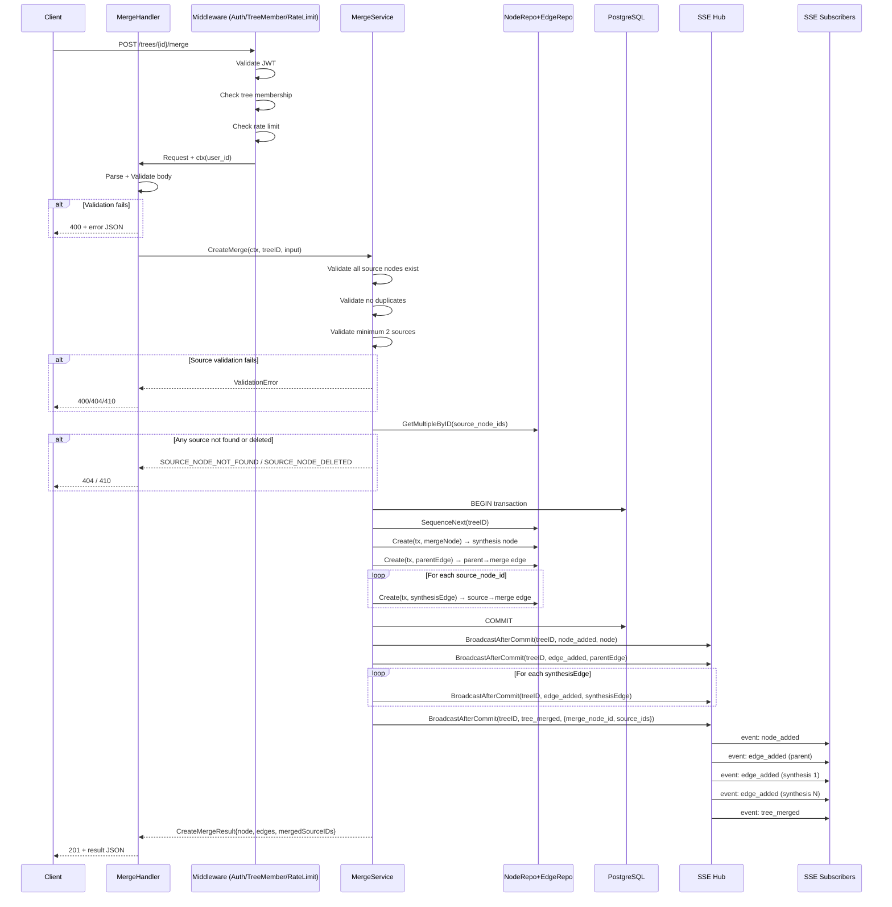
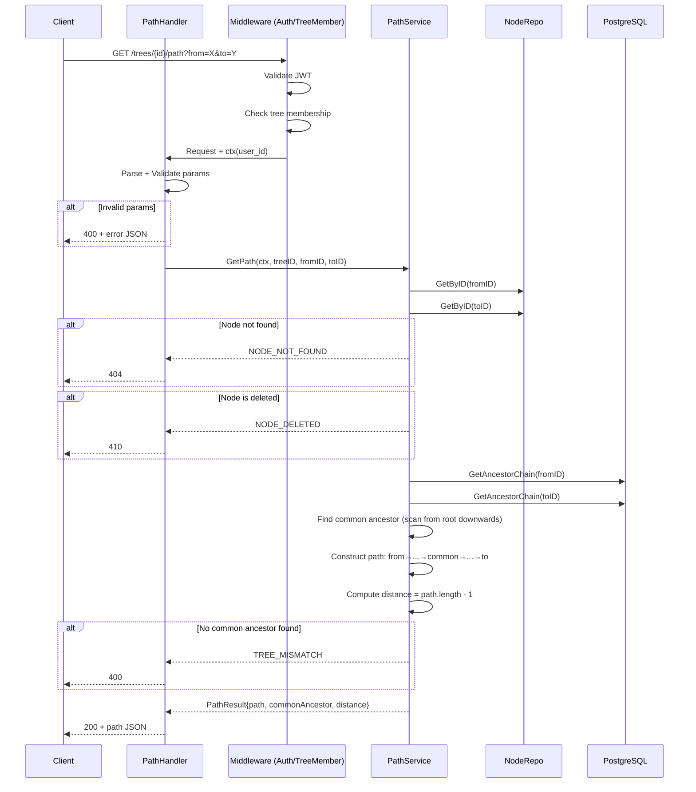
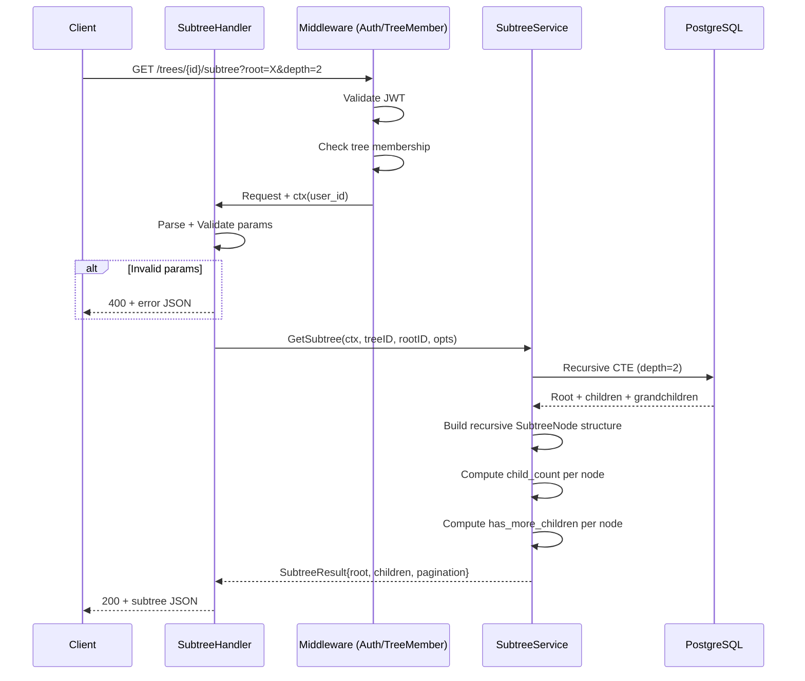
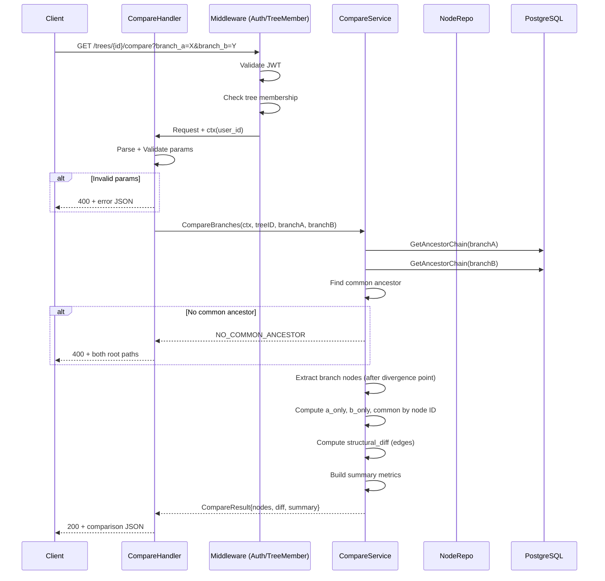

# SPEC-API-04 — Merge & Navigation Endpoints

> **Status:** Spec | **Blocks:** BE-04 (Node Service), BE-11 (HTTP Router), BE-12 (Integration Tests), FE-03 (Tree Rendering), FE-06 (Merge View)
> **References:** SPEC-DM-01, SPEC-DM-02, SPEC-DM-04, SPEC-API-01, SPEC-API-02, SPEC-API-03, ARCHITECTURE.md §3, ARCHITECTURE.md §7.3

---

## 1. Purpose

Define the exact REST endpoint contracts for Canopy tree merge and navigation operations: creating synthesis (merge) nodes, computing node paths, querying subtrees, and comparing branches. A Go worker reading this spec must produce correct `MergeService`, `PathService`, `SubtreeService`, and `CompareService` implementations with zero clarifying questions. A TypeScript worker reading this spec must produce a correct API client with Zod-validated types.

Merge nodes are the mechanism for combining divergent branches in the conversation DAG. Navigation endpoints provide the query surface for tree traversal, branch comparison, and lazy-loading subtree exploration — these are the primary read paths for the Tree UI, Branch View, and Merge View modes described in ARCHITECTURE.md §7.2.

---

## 2. Design Decisions (from ARCHITECTURE.md)

| Decision | Choice | Source |
|----------|--------|--------|
| HTTP Router | chi or Go 1.22+ stdlib pattern mux | ARCHITECTURE.md §2.1 |
| Serialization | JSON (application/json) | ARCHITECTURE.md §5 |
| Auth | JWT Bearer token validated on every request | ARCHITECTURE.md §5.5, SPEC-API-01 §8 |
| IDs | UUIDv7 (time-ordered, RFC 9562) on server | SPEC-DM-01 §3.1 |
| Merge node type | `node_type='synthesis'`, multi-parent via `edge_type='synthesis'` | ARCHITECTURE.md §3.1, SPEC-DM-01 §3.2 |
| Single-parent | Default. Multi-parent only on synthesis nodes | ARCHITECTURE.md §3.1, SPEC-DM-01 §3.3 |
| Node ordering | `sequence_num` BIGINT monotonic within tree_id | SPEC-DM-01 §3.3 |
| Soft-delete | `deleted_at` column, permanent purge after 30 days | SPEC-DM-01 §3.4 |
| SSE broadcast | Every merge mutation broadcasts via SSE Hub (SPEC-API-01) | SPEC-API-01 §4 |
| Subtree depth limit | Max 10 levels, default 1 (immediate children) | This spec §5 |
| Path computation | BFS upward traversal to common ancestor | This spec §4 |
| Branch comparison | Structural diff of nodes and edges | This spec §6 |
| Timestamps | `clock_timestamp()` server-side, immutable | SPEC-DM-01 §3 |
| Parent validation | Parent must exist, must be in same tree, must not be soft-deleted | SPEC-API-03 §3 |
| Computed fields | `depth` and `child_count` computed at query time, not stored | SPEC-API-03 §3 |

---

## 3. POST /trees/{tree_id}/merge — Create Merge Node

### 3.1 Route

```
POST /trees/{tree_id}/merge
```

| Field | Value |
|-------|-------|
| Method | POST |
| Path | `/trees/{tree_id}/merge` |
| tree_id | UUIDv7 |
| Auth | Required (Bearer token) |
| Content-Type (request) | `application/json; charset=utf-8` |
| Content-Type (response) | `application/json; charset=utf-8` |
| Request body max | 1 MB |

### 3.2 Request Body

```json
{
  "source_node_ids": [
    "0191a8b2-7fff-7000-9000-000000000101",
    "0191a8b2-7fff-7000-9000-000000000102"
  ],
  "content": "Synthesizing the two approaches:\n\n**Bane's proposal** uses PostgreSQL recursive CTEs for tree traversal.\n**Kara's alternative** uses materialized path patterns.\n\nConclusion: Use CTEs with index optimization for MVP, materialized paths deferred.",
  "content_format": "markdown",
  "target_parent_id": "0191a8b2-7fff-7000-9000-000000000001",
  "metadata": {
    "merge_summary": "Resolved branch divergence on tree storage strategy",
    "decision": "CTE with index optimization"
  }
}
```

| Field | Type | Required | Default | Description |
|-------|------|----------|---------|-------------|
| `source_node_ids` | array of UUIDv7 strings | Yes | — | 2–100 source nodes to merge. Each must exist in the same tree and not be soft-deleted. Minimum 2, maximum 100. |
| `content` | string | Yes | — | Synthesis summary content. 1–65536 characters. Describes the result of merging branches. |
| `content_format` | string | No | `"markdown"` | Format: `markdown`, `plain`, or `rich` (HTML subset). |
| `target_parent_id` | UUIDv7 string | No | tree's `root_node_id` | Where to place the merge node in the tree. If omitted, defaults to the tree's root node. |
| `metadata` | object | No | `{}` | Arbitrary JSON key-value pairs. Max 16KB serialized. |

**source_node_ids rules:**
- At least 2 source nodes must be provided.
- All source nodes must belong to the same tree (tree_id from URL path).
- No source node may be soft-deleted.
- Source nodes may include nodes from different branches of the same tree.
- Source nodes may include a node that is already a synthesis node (chained merges).
- All source_node_ids must be unique — duplicates are rejected.

### 3.3 Request Validation

| Check | Error Code | HTTP Status |
|-------|-----------|-------------|
| `source_node_ids` is not an array | `INVALID_SOURCE_NODE_IDS` | 400 |
| Fewer than 2 source nodes | `MIN_SOURCE_NODES` | 400 |
| More than 100 source nodes | `MAX_SOURCE_NODES` | 400 |
| `source_node_ids` contains duplicates | `DUPLICATE_SOURCE_NODES` | 400 |
| A `source_node_id` is not a valid UUIDv7 | `INVALID_SOURCE_NODE_ID` | 400 |
| A source node does not exist | `SOURCE_NODE_NOT_FOUND` | 404 |
| A source node is soft-deleted | `SOURCE_NODE_DELETED` | 410 |
| A source node belongs to a different tree | `TREE_MISMATCH` | 400 |
| `content` exceeds 65536 characters | `CONTENT_TOO_LONG` | 400 |
| `content_format` not in `markdown`, `plain`, `rich` | `INVALID_CONTENT_FORMAT` | 400 |
| `target_parent_id` is not a valid UUIDv7 | `INVALID_TARGET_PARENT_ID` | 400 |
| `target_parent_id` does not exist in tree | `TARGET_PARENT_NOT_FOUND` | 404 |
| `target_parent_id` is soft-deleted | `TARGET_PARENT_DELETED` | 409 |
| `metadata` exceeds 16KB serialized | `METADATA_TOO_LARGE` | 400 |
| Request body > 1MB | `REQUEST_TOO_LARGE` | 413 |
| User is not a tree member | `NOT_TREE_MEMBER` | 403 |
| Tree is soft-deleted | `TREE_DELETED` | 410 |
| One of the source nodes is the same as target_parent_id | `SOURCE_TARGET_OVERLAP` | 400 |

### 3.4 Server-Side Computations

The server computes the following fields at insertion time:

| Field | Computation |
|-------|-------------|
| `id` | `uuidv7()` — generated by PostgreSQL |
| `tree_id` | From URL path parameter |
| `author_id` | From JWT subject claim |
| `sequence_num` | `SELECT COALESCE(MAX(sequence_num), 0) + 1 FROM nodes WHERE tree_id = $1` |
| `node_type` | `'synthesis'` (forced — merge always creates a synthesis node) |
| `created_at` | `clock_timestamp()` |
| `edited_at` | `NULL` |
| `deleted_at` | `NULL` |
| `depth` | `target_parent.depth + 1` |
| `child_count` | `0` (new nodes have no children) |

### 3.5 Edge Creation

Every merge creates:
1. One edge from `target_parent_id` → new node (edge_type = `"reply"` or `"fork"`)
2. N edges from each `source_node_id` → new node (edge_type = `"synthesis"`)

```sql
-- Transaction:
BEGIN;

-- 1. Create the synthesis node
INSERT INTO nodes (id, tree_id, parent_id, author_id, content, content_format, node_type, sequence_num, metadata)
VALUES (uuidv7(), $tree_id, $target_parent_id, $author_id, $content, $content_format, 'synthesis', ..., $metadata)
RETURNING id INTO $merge_node_id;

-- 2. Create parent edge (target_parent → merge node)
INSERT INTO edges (id, tree_id, source_id, target_id, edge_type, sequence_num)
VALUES (uuidv7(), $tree_id, $target_parent_id, $merge_node_id, 'reply', ...);

-- 3. Create synthesis edges (each source → merge node)
INSERT INTO edges (id, tree_id, source_id, target_id, edge_type, sequence_num)
SELECT uuidv7(), $tree_id, unnest($source_node_ids::uuid[]), $merge_node_id, 'synthesis', ...
ON CONFLICT (source_id, target_id, edge_type) DO NOTHING;

COMMIT;
```

The parent edge uses `edge_type='reply'` (the default linear connection). The synthesis edges use `edge_type='synthesis'` to mark the merge relationship. All operations happen in a single transaction. If any step fails, the entire transaction rolls back.

### 3.6 Response — 201 Created

```json
{
  "node": {
    "id": "0191a8b2-7fff-7000-9000-000000000301",
    "tree_id": "0191a8b2-7fff-7000-9000-000000000001",
    "parent_id": "0191a8b2-7fff-7000-9000-000000000001",
    "author_id": "0191a8b2-7fff-7000-9000-000000000042",
    "author_display_name": "Bane",
    "content": "Synthesizing the two approaches:...",
    "content_format": "markdown",
    "node_type": "synthesis",
    "sequence_num": 312,
    "metadata": {
      "merge_summary": "Resolved branch divergence on tree storage strategy",
      "decision": "CTE with index optimization"
    },
    "depth": 2,
    "child_count": 0,
    "created_at": "2026-07-20T23:15:00Z",
    "edited_at": null,
    "deleted_at": null
  },
  "edges": [
    {
      "id": "0191a8b2-7fff-7000-9000-000000000401",
      "tree_id": "0191a8b2-7fff-7000-9000-000000000001",
      "source_node_id": "0191a8b2-7fff-7000-9000-000000000001",
      "target_node_id": "0191a8b2-7fff-7000-9000-000000000301",
      "edge_type": "reply",
      "created_at": "2026-07-20T23:15:00Z"
    },
    {
      "id": "0191a8b2-7fff-7000-9000-000000000402",
      "tree_id": "0191a8b2-7fff-7000-9000-000000000001",
      "source_node_id": "0191a8b2-7fff-7000-9000-000000000101",
      "target_node_id": "0191a8b2-7fff-7000-9000-000000000301",
      "edge_type": "synthesis",
      "created_at": "2026-07-20T23:15:00Z"
    },
    {
      "id": "0191a8b2-7fff-7000-9000-000000000403",
      "tree_id": "0191a8b2-7fff-7000-9000-000000000001",
      "source_node_id": "0191a8b2-7fff-7000-9000-000000000102",
      "target_node_id": "0191a8b2-7fff-7000-9000-000000000301",
      "edge_type": "synthesis",
      "created_at": "2026-07-20T23:15:00Z"
    }
  ],
  "merged_source_ids": [
    "0191a8b2-7fff-7000-9000-000000000101",
    "0191a8b2-7fff-7000-9000-000000000102"
  ]
}
```

### 3.7 Response Fields

| Field | Type | Source | Description |
|-------|------|--------|-------------|
| `id` | UUIDv7 | `nodes.id` | Server-generated merge node ID |
| `tree_id` | UUIDv7 | `nodes.tree_id` | Owning tree |
| `parent_id` | UUIDv7 \| null | `nodes.parent_id` | Target parent (null for root) |
| `author_id` | UUIDv7 | `nodes.author_id` | Author from JWT subject |
| `author_display_name` | string | JOIN profiles | Cached display name |
| `content` | string | `nodes.content` | Synthesis summary |
| `content_format` | string | `nodes.content_format` | Rendering format |
| `node_type` | string | `nodes.node_type` | Always `"synthesis"` |
| `sequence_num` | integer | `nodes.sequence_num` | Monotonic position in tree |
| `metadata` | object | `nodes.metadata` | Arbitrary metadata |
| `depth` | integer | Computed | Distance from root (root=0) |
| `child_count` | integer | Computed | Number of direct children (always 0 on creation) |
| `created_at` | ISO 8601 | `nodes.created_at` | Creation timestamp |
| `edited_at` | ISO 8601 \| null | `nodes.edited_at` | Null for new nodes |
| `deleted_at` | ISO 8601 \| null | `nodes.deleted_at` | Null for new nodes |
| `edges` | array | `edges` table | All created edges (1 parent edge + N synthesis edges) |
| `merged_source_ids` | array | Request | Echo of the source_node_ids that were merged |

### 3.8 SSE Events Emitted

On successful merge, the SSE hub broadcasts:

```
event: node_added
data: {full node JSON}

event: edge_added
data: {parent edge JSON}

event: edge_added
data: {synthesis edge JSON for source 1}

event: edge_added
data: {synthesis edge JSON for source N}

event: tree_merged
data: { "merge_node_id": "...", "source_node_ids": ["...", "..."], "tree_id": "...", "timestamp": "..." }
```

The `tree_merged` event is a composite event unique to merge operations. It allows clients to react specifically to merge actions (e.g., highlighting merged branches, collapsing merged branches into the synthesis node in the UI). All events are broadcast to clients subscribed to `trees/{tree_id}/events`.

---

## 4. GET /trees/{tree_id}/path?from=X&to=Y — Node Path

### 4.1 Route

```
GET /trees/{tree_id}/path?from=X&to=Y
```

| Field | Value |
|-------|-------|
| Method | GET |
| Path | `/trees/{tree_id}/path` |
| tree_id | UUIDv7 |
| Auth | Required (Bearer token) |
| Content-Type (response) | `application/json; charset=utf-8` |

### 4.2 Query Parameters

| Parameter | Type | Required | Default | Description |
|-----------|------|----------|---------|-------------|
| `from` | UUIDv7 string | Yes | — | Start node ID. Must exist in tree, not soft-deleted. |
| `to` | UUIDv7 string | Yes | — | End node ID. Must exist in tree, not soft-deleted. |

### 4.3 Path Computation Algorithm

The path between two nodes is computed using a bidirectional ancestor traversal:

1. Fetch the ancestor chain (root → node) for both `from` and `to` nodes.
2. Find the common ancestor by scanning from root downward — the last shared node before divergence.
3. Construct the path:
   - From `from` node up to (but not including) the common ancestor (reverse order: from → common).
   - The common ancestor (included once).
   - From common ancestor down to `to` node (forward order: common → to).
4. Count hops (number of edges traversed = path length - 1).

If `from` === `to`, the path is `[from]`, common_ancestor is `from`, and distance is 0.

```sql
-- Get ancestor chains
WITH RECURSIVE from_ancestors AS (
    SELECT id, parent_id, 0 AS depth
    FROM nodes WHERE id = $from
    UNION ALL
    SELECT n.id, n.parent_id, fa.depth + 1
    FROM nodes n
    JOIN from_ancestors fa ON n.id = fa.parent_id
),
to_ancestors AS (
    SELECT id, parent_id, 0 AS depth
    FROM nodes WHERE id = $to
    UNION ALL
    SELECT n.id, n.parent_id, ta.depth + 1
    FROM nodes n
    JOIN to_ancestors ta ON n.id = ta.parent_id
)
-- Find common ancestor
SELECT fa.id, fa.depth AS from_depth, ta.depth AS to_depth
FROM from_ancestors fa
JOIN to_ancestors ta ON fa.id = ta.id
ORDER BY fa.depth DESC  -- deepest common ancestor = closest to both
LIMIT 1;
```

### 4.4 Validation

| Check | Error Code | HTTP Status |
|-------|-----------|-------------|
| `from` is not a valid UUIDv7 | `INVALID_FROM_ID` | 400 |
| `to` is not a valid UUIDv7 | `INVALID_TO_ID` | 400 |
| `from` node does not exist | `FROM_NODE_NOT_FOUND` | 404 |
| `to` node does not exist | `TO_NODE_NOT_FOUND` | 404 |
| `from` node is soft-deleted | `FROM_NODE_DELETED` | 410 |
| `to` node is soft-deleted | `TO_NODE_DELETED` | 410 |
| `from` and `to` belong to different trees | `TREE_MISMATCH` | 400 |
| User is not a tree member | `NOT_TREE_MEMBER` | 403 |
| Tree is soft-deleted | `TREE_DELETED` | 410 |

### 4.5 Response — 200 OK

```json
{
  "path": [
    {
      "id": "0191a8b2-7fff-7000-9000-000000000101",
      "tree_id": "0191a8b2-7fff-7000-9000-000000000001",
      "parent_id": "0191a8b2-7fff-7000-9000-000000000001",
      "node_type": "message",
      "content": "...",
      "depth": 1
    },
    {
      "id": "0191a8b2-7fff-7000-9000-000000000001",
      "tree_id": "0191a8b2-7fff-7000-9000-000000000001",
      "parent_id": null,
      "node_type": "message",
      "content": "...",
      "depth": 0
    },
    {
      "id": "0191a8b2-7fff-7000-9000-000000000102",
      "tree_id": "0191a8b2-7fff-7000-9000-000000000001",
      "parent_id": "0191a8b2-7fff-7000-9000-000000000001",
      "node_type": "message",
      "content": "...",
      "depth": 1
    }
  ],
  "common_ancestor_id": "0191a8b2-7fff-7000-9000-000000000001",
  "distance": 2,
  "from_id": "0191a8b2-7fff-7000-9000-000000000101",
  "to_id": "0191a8b2-7fff-7000-9000-000000000102"
}
```

### 4.6 Response Fields

| Field | Type | Description |
|-------|------|-------------|
| `path` | array of NodeSummary | Ordered node array from `from` to `to`. Each entry is a NodeSummary (abbreviated fields: id, tree_id, parent_id, node_type, content, depth). |
| `common_ancestor_id` | UUIDv7 | The nearest common ancestor of both nodes. Same as `from` if `from === to`. |
| `distance` | integer | Number of edges traversed (path.length - 1). 0 if `from === to`. |
| `from_id` | UUIDv7 | Echo of the `from` query parameter. |
| `to_id` | UUIDv7 | Echo of the `to` query parameter. |

The NodeSummary object in the path array contains: `id`, `tree_id`, `parent_id`, `node_type`, `content` (truncated to 200 chars for path display), `depth`, `created_at`. Full node content can be fetched via `GET /nodes/{node_id}` (SPEC-API-03 §5).

---

## 5. GET /trees/{tree_id}/subtree?root=X&depth=N — Subtree Query

### 5.1 Route

```
GET /trees/{tree_id}/subtree?root=X&depth=N
```

| Field | Value |
|-------|-------|
| Method | GET |
| Path | `/trees/{tree_id}/subtree` |
| tree_id | UUIDv7 |
| Auth | Required (Bearer token) |
| Content-Type (response) | `application/json; charset=utf-8` |

### 5.2 Query Parameters

| Parameter | Type | Required | Default | Description |
|-----------|------|----------|---------|-------------|
| `root` | UUIDv7 string | Yes | — | Root node of the subtree. Must exist in tree, not soft-deleted. |
| `depth` | integer | No | `1` | Max depth from root. depth=0 returns only root. Min 0, max 10. |
| `offset` | integer | No | `0` | Pagination offset for children at each level. Skips first N children. |
| `limit` | integer | No | `100` | Max children per level. Min 1, max 500. |

### 5.3 Subtree Construction Algorithm

1. Starting from `root` node, fetch children via edges where `source_id = root`.
2. For each child node, recursively fetch children up to `depth` levels.
3. Each child entry includes `child_count` (number of direct children) and `has_more_children` (bool, true if child_count > limit).
4. If `depth=0`, return only the root node with an empty children array.
5. If `depth=1` (default), return root + immediate children only.

```sql
-- Recursive CTE with depth limit
WITH RECURSIVE subtree AS (
    -- Base: the root node
    SELECT n.id, n.tree_id, n.parent_id, n.node_type, n.content,
           n.sequence_num, n.depth, n.created_at, n.deleted_at,
           1 AS level
    FROM nodes n
    WHERE n.id = $root
      AND n.deleted_at IS NULL

    UNION ALL

    -- Recursive: children of nodes at current level
    SELECT n.id, n.tree_id, n.parent_id, n.node_type, n.content,
           n.sequence_num, n.depth, n.created_at, n.deleted_at,
           s.level + 1
    FROM subtree s
    JOIN edges e ON e.source_id = s.id AND e.deleted_at IS NULL
    JOIN nodes n ON n.id = e.target_id AND n.deleted_at IS NULL
    WHERE s.level < $depth
)
SELECT * FROM subtree ORDER BY level, sequence_num;
```

Pagination is applied per level: when fetching children for a parent node, `OFFSET $offset LIMIT $limit` is applied to the children list at each level independently. The `has_more_children` flag is computed per node: `true` if the actual child count exceeds the limit.

### 5.4 Validation

| Check | Error Code | HTTP Status |
|-------|-----------|-------------|
| `root` is not a valid UUIDv7 | `INVALID_ROOT_ID` | 400 |
| `root` node does not exist | `ROOT_NODE_NOT_FOUND` | 404 |
| `root` node is soft-deleted | `ROOT_NODE_DELETED` | 410 |
| `depth` < 0 | `INVALID_DEPTH` | 400 |
| `depth` > 10 | `DEPTH_EXCEEDS_MAX` | 400 |
| `offset` < 0 | `INVALID_OFFSET` | 400 |
| `limit` < 1 or > 500 | `INVALID_LIMIT` | 400 |
| User is not a tree member | `NOT_TREE_MEMBER` | 403 |
| Tree is soft-deleted | `TREE_DELETED` | 410 |

### 5.5 Response — 200 OK

```json
{
  "root": {
    "id": "0191a8b2-7fff-7000-9000-000000000001",
    "tree_id": "0191a8b2-7fff-7000-9000-000000000001",
    "parent_id": null,
    "node_type": "message",
    "content": "Welcome to the project tree.",
    "content_format": "markdown",
    "depth": 0,
    "child_count": 3,
    "has_more_children": false,
    "sequence_num": 1,
    "created_at": "2026-07-20T22:00:00Z"
  },
  "children": [
    {
      "id": "0191a8b2-7fff-7000-9000-000000000101",
      "tree_id": "0191a8b2-7fff-7000-9000-000000000001",
      "parent_id": "0191a8b2-7fff-7000-9000-000000000001",
      "node_type": "message",
      "content": "Thread about database schema...",
      "content_format": "markdown",
      "depth": 1,
      "child_count": 5,
      "has_more_children": false,
      "sequence_num": 2,
      "children": [
        {
          "id": "0191a8b2-7fff-7000-9000-000000000201",
          "tree_id": "0191a8b2-7fff-7000-9000-000000000001",
          "parent_id": "0191a8b2-7fff-7000-9000-000000000101",
          "node_type": "message",
          "content": "Reply about CTEs...",
          "content_format": "markdown",
          "depth": 2,
          "child_count": 2,
          "has_more_children": false,
          "sequence_num": 3,
          "children": []
        }
      ]
    },
    {
      "id": "0191a8b2-7fff-7000-9000-000000000102",
      "tree_id": "0191a8b2-7fff-7000-9000-000000000001",
      "parent_id": "0191a8b2-7fff-7000-9000-000000000001",
      "node_type": "message",
      "content": "Thread about frontend...",
      "content_format": "markdown",
      "depth": 1,
      "child_count": 0,
      "has_more_children": false,
      "sequence_num": 4,
      "children": []
    }
  ],
  "pagination": {
    "offset": 0,
    "limit": 100,
    "total_children": 3
  }
}
```

### 5.6 Response Fields

| Field | Type | Description |
|-------|------|-------------|
| `root` | SubtreeNode | The root node of the subtree. Includes node fields plus `child_count` and `has_more_children`. |
| `children` | array of SubtreeNode | Recursive children array up to `depth`. Each child has the same structure as `root`. |
| `pagination` | object | Pagination metadata for the top-level children list. |

**SubtreeNode fields:**

| Field | Type | Description |
|-------|------|-------------|
| `id` | UUIDv7 | Node ID |
| `tree_id` | UUIDv7 | Owning tree |
| `parent_id` | UUIDv7 \| null | Parent node ID |
| `node_type` | string | `message`, `synthesis`, or `system` |
| `content` | string | Node content (truncated to 200 chars for display). Full content fetched on demand. |
| `content_format` | string | `markdown`, `plain`, or `rich` |
| `depth` | integer | Distance from tree root |
| `child_count` | integer | Total direct children of this node (not limited by pagination) |
| `has_more_children` | boolean | `true` if `child_count > limit`, indicating paginated children not returned in this response |
| `sequence_num` | integer | Monotonic position in tree |
| `created_at` | ISO 8601 | Creation timestamp |
| `children` | array of SubtreeNode | Sub-children, present only if `depth > 1` at this level |

### 5.7 Pagination for Large Subtrees

When a node has more children than `limit`, the response includes only the first N children and `has_more_children: true` on that node. The client should call `GET /trees/{tree_id}/subtree?root={node_id}&depth=1&offset={N}&limit={limit}` to fetch the next page of children at that level.

The `offset` and `limit` parameters control pagination at the first level only (root's direct children). Pagination for deeper levels is achieved by querying with the specific child node as the new `root`.

---

## 6. GET /trees/{tree_id}/compare?branch_a=X&branch_b=Y — Branch Comparison

### 6.1 Route

```
GET /trees/{tree_id}/compare?branch_a=X&branch_b=Y
```

| Field | Value |
|-------|-------|
| Method | GET |
| Path | `/trees/{tree_id}/compare` |
| tree_id | UUIDv7 |
| Auth | Required (Bearer token) |
| Content-Type (response) | `application/json; charset=utf-8` |

### 6.2 Query Parameters

| Parameter | Type | Required | Default | Description |
|-----------|------|----------|---------|-------------|
| `branch_a` | UUIDv7 string | Yes | — | Leaf node of branch A (deepest node or any node in branch A). |
| `branch_b` | UUIDv7 string | Yes | — | Leaf node of branch B (deepest node or any node in branch B). |

### 6.3 Branch Comparison Algorithm

1. Compute the path from tree root to `branch_a` (full ancestor chain).
2. Compute the path from tree root to `branch_b` (full ancestor chain).
3. Find the last common node in both paths (the branching point / common ancestor).
4. Collect all nodes under branch A's side: from common ancestor's child in branch A down to `branch_a`.
5. Collect all nodes under branch B's side: from common ancestor's child in branch B down to `branch_b`.
6. Compute the structural diff:
   - `a_only`: Nodes that exist only in branch A.
   - `b_only`: Nodes that exist only in branch B.
   - `common`: Nodes that exist in both branches (by node ID, not content).
   - `structural_diff`: Edges that differ between branches.

### 6.4 Validation

| Check | Error Code | HTTP Status |
|-------|-----------|-------------|
| `branch_a` is not a valid UUIDv7 | `INVALID_BRANCH_A_ID` | 400 |
| `branch_b` is not a valid UUIDv7 | `INVALID_BRANCH_B_ID` | 400 |
| `branch_a` node does not exist | `BRANCH_A_NOT_FOUND` | 404 |
| `branch_b` node does not exist | `BRANCH_B_NOT_FOUND` | 404 |
| `branch_a` is soft-deleted | `BRANCH_A_DELETED` | 410 |
| `branch_b` is soft-deleted | `BRANCH_B_DELETED` | 410 |
| `branch_a` and `branch_b` belong to different trees | `TREE_MISMATCH` | 400 |
| Branches do not share a common ancestor | `NO_COMMON_ANCESTOR` | 400 |
| User is not a tree member | `NOT_TREE_MEMBER` | 403 |
| Tree is soft-deleted | `TREE_DELETED` | 410 |

### 6.5 Response — 200 OK

```json
{
  "branch_a_nodes": [
    {
      "id": "0191a8b2-7fff-7000-9000-000000000101",
      "node_type": "message",
      "content": "Branch A first message",
      "depth": 1,
      "sequence_num": 2
    },
    {
      "id": "0191a8b2-7fff-7000-9000-000000000201",
      "node_type": "message",
      "content": "Branch A reply",
      "depth": 2,
      "sequence_num": 5
    }
  ],
  "branch_b_nodes": [
    {
      "id": "0191a8b2-7fff-7000-9000-000000000102",
      "node_type": "message",
      "content": "Branch B first message",
      "depth": 1,
      "sequence_num": 3
    },
    {
      "id": "0191a8b2-7fff-7000-9000-000000000202",
      "node_type": "message",
      "content": "Branch B reply",
      "depth": 2,
      "sequence_num": 6
    },
    {
      "id": "0191a8b2-7fff-7000-9000-000000000302",
      "node_type": "synthesis",
      "content": "Branch B merge point",
      "depth": 3,
      "sequence_num": 8
    }
  ],
  "common_ancestor": {
    "id": "0191a8b2-7fff-7000-9000-000000000001",
    "node_type": "message",
    "content": "Root message",
    "depth": 0,
    "sequence_num": 1
  },
  "a_only": [
    "0191a8b2-7fff-7000-9000-000000000101",
    "0191a8b2-7fff-7000-9000-000000000201"
  ],
  "b_only": [
    "0191a8b2-7fff-7000-9000-000000000102",
    "0191a8b2-7fff-7000-9000-000000000202",
    "0191a8b2-7fff-7000-9000-000000000302"
  ],
  "common": [
    "0191a8b2-7fff-7000-9000-000000000001"
  ],
  "structural_diff": {
    "added_edges_branch_a": [
      {
        "source_id": "0191a8b2-7fff-7000-9000-000000000001",
        "target_id": "0191a8b2-7fff-7000-9000-000000000101",
        "edge_type": "reply"
      },
      {
        "source_id": "0191a8b2-7fff-7000-9000-000000000101",
        "target_id": "0191a8b2-7fff-7000-9000-000000000201",
        "edge_type": "reply"
      }
    ],
    "added_edges_branch_b": [
      {
        "source_id": "0191a8b2-7fff-7000-9000-000000000001",
        "target_id": "0191a8b2-7fff-7000-9000-000000000102",
        "edge_type": "fork"
      },
      {
        "source_id": "0191a8b2-7fff-7000-9000-000000000102",
        "target_id": "0191a8b2-7fff-7000-9000-000000000202",
        "edge_type": "reply"
      },
      {
        "source_id": "0191a8b2-7fff-7000-9000-000000000202",
        "target_id": "0191a8b2-7fff-7000-9000-000000000302",
        "edge_type": "synthesis"
      }
    ],
    "removed_edges": [],
    "changed_edges": []
  },
  "summary": {
    "branch_a_node_count": 2,
    "branch_b_node_count": 3,
    "common_node_count": 1,
    "branch_a_only_count": 2,
    "branch_b_only_count": 3,
    "has_diverged_content": true
  }
}
```

### 6.6 Response Fields

| Field | Type | Description |
|-------|------|-------------|
| `branch_a_nodes` | array | Full ancestor chain from branch point to `branch_a` (excluding common ancestor, including branch_a). |
| `branch_b_nodes` | array | Full ancestor chain from branch point to `branch_b` (excluding common ancestor, including branch_b). |
| `common_ancestor` | NodeSummary | The nearest common ancestor node where the two branches diverge. |
| `a_only` | array of UUIDv7 | Node IDs present only in branch A. |
| `b_only` | array of UUIDv7 | Node IDs present only in branch B. |
| `common` | array of UUIDv7 | Node IDs present in both branches (at minimum, the common ancestor). |
| `structural_diff` | object | Edge-level diff: `added_edges_branch_a`, `added_edges_branch_b`, `removed_edges`, `changed_edges`. |
| `summary` | object | High-level comparison metrics. |

### 6.7 Comparison Semantics

**Node comparison** is by node ID (structural, not content-based). Two nodes with the same ID but different content are considered "common" — the content difference is indicated by `has_diverged_content: true` in the summary. Full content comparison requires fetching each node individually.

**Edge comparison** compares edge sets per branch. `added_edges_branch_a` are edges present in branch A's chain but not in branch B's. `added_edges_branch_b` are the reverse. `removed_edges` would be applicable when comparing two snapshots; for branch comparison it is typically empty. `changed_edges` tracks edges that exist in both branches but have different edge_type values.

---

## 7. Go Interfaces

### 7.1 MergeService Interface

```go
// MergeService defines business logic for creating synthesis (merge) nodes.
// A merge combines multiple source branches into a single synthesis point
// with multi-parent edges of type 'synthesis'.
type MergeService interface {
    // CreateMerge creates a synthesis node that merges multiple source branches.
    // Validates all source nodes exist in the same tree, are not deleted,
    // and that the minimum source count (2) is met.
    // Creates one synthesis node + N synthesis edges + one parent edge.
    // Broadcasts node_added + N edge_added + tree_merged SSE events.
    // Returns the created node, all created edges, and the merged source IDs.
    CreateMerge(ctx context.Context, treeID uuid.UUID, input CreateMergeInput) (*CreateMergeResult, error)
}

// CreateMergeInput is the request body for POST /trees/{tree_id}/merge.
type CreateMergeInput struct {
    SourceNodeIDs   []uuid.UUID     `json:"source_node_ids"`
    Content         string          `json:"content"`
    ContentFormat   string          `json:"content_format"`  // default: "markdown"
    TargetParentID  *uuid.UUID      `json:"target_parent_id"` // nil = tree root
    Metadata        json.RawMessage `json:"metadata"`         // default: {}
}

// Validate returns nil if all fields are valid, or a ValidationError.
func (i *CreateMergeInput) Validate() error

// CreateMergeResult wraps the merge node + edges returned from creation.
type CreateMergeResult struct {
    Node             *db.Node   `json:"node"`
    Edges            []*db.Edge `json:"edges"`
    MergedSourceIDs  []uuid.UUID `json:"merged_source_ids"`
}
```

### 7.2 MergeHandler Interface (HTTP)

```go
// MergeHandler registers merge routes on the HTTP mux.
type MergeHandler struct {
    svc     MergeService
    authMW  AuthMiddleware
    treeMW  TreeMembershipMiddleware
}

// Register mounts all merge routes under the provided mux.
func (h *MergeHandler) Register(r chi.Router) {
    r.Post("/trees/{treeID}/merge", h.handleCreateMerge)
}
```

### 7.3 PathService Interface

```go
// PathService computes paths between nodes in a tree.
// Uses bidirectional ancestor traversal to find the shortest path.
type PathService interface {
    // GetPath returns the shortest node path between fromID and toID in the same tree.
    // Includes both endpoints and the common ancestor.
    // If fromID == toID, returns a single-node path.
    // If nodes are in different trees, returns TREE_MISMATCH error.
    GetPath(ctx context.Context, treeID uuid.UUID, fromID, toID uuid.UUID) (*PathResult, error)
}

// PathResult contains the node path and traversal metadata.
type PathResult struct {
    Path              []NodeSummary `json:"path"`
    CommonAncestorID  uuid.UUID     `json:"common_ancestor_id"`
    Distance          int           `json:"distance"` // hop count (path.length - 1)
    FromID            uuid.UUID     `json:"from_id"`
    ToID              uuid.UUID     `json:"to_id"`
}

// NodeSummary is an abbreviated node representation for path/subtree display.
type NodeSummary struct {
    ID            uuid.UUID  `json:"id"`
    TreeID        uuid.UUID  `json:"tree_id"`
    ParentID      *uuid.UUID `json:"parent_id"`
    NodeType      string     `json:"node_type"`
    Content       string     `json:"content"`       // Truncated to 200 chars
    Depth         int        `json:"depth"`
    SequenceNum   int64      `json:"sequence_num"`
    CreatedAt     time.Time  `json:"created_at"`
}
```

### 7.4 PathHandler Interface (HTTP)

```go
// PathHandler registers path query routes on the HTTP mux.
type PathHandler struct {
    svc     PathService
    authMW  AuthMiddleware
    treeMW  TreeMembershipMiddleware
}

// Register mounts path routes under the provided mux.
func (h *PathHandler) Register(r chi.Router) {
    r.Get("/trees/{treeID}/path", h.handleGetPath)
}
```

### 7.5 SubtreeService Interface

```go
// SubtreeService fetches subtrees for lazy-loading tree branches.
type SubtreeService interface {
    // GetSubtree returns the subtree rooted at rootID, to maxDepth levels deep.
    // depth=0 returns only the root node.
    // Pagination offset/limit apply to the root's immediate children.
    // Each child node includes child_count and has_more_children for pagination.
    GetSubtree(ctx context.Context, treeID uuid.UUID, rootID uuid.UUID, opts SubtreeOptions) (*SubtreeResult, error)
}

// SubtreeOptions controls subtree depth and pagination.
type SubtreeOptions struct {
    Depth  int // 0–10, default 1
    Offset int // pagination: skip first N children
    Limit  int // pagination: max children per level, 1–500, default 100
}

// SubtreeResult contains the recursive subtree structure.
type SubtreeResult struct {
    Root       SubtreeNode   `json:"root"`
    Children   []SubtreeNode `json:"children"`
    Pagination SubtreePagination `json:"pagination"`
}

// SubtreeNode is a node in the subtree with children and pagination metadata.
type SubtreeNode struct {
    ID               uuid.UUID      `json:"id"`
    TreeID           uuid.UUID      `json:"tree_id"`
    ParentID         *uuid.UUID     `json:"parent_id"`
    NodeType         string         `json:"node_type"`
    Content          string         `json:"content"`       // Truncated to 200 chars
    ContentFormat    string         `json:"content_format"`
    Depth            int            `json:"depth"`
    ChildCount       int            `json:"child_count"`
    HasMoreChildren  bool           `json:"has_more_children"`
    SequenceNum      int64          `json:"sequence_num"`
    CreatedAt        time.Time      `json:"created_at"`
    Children         []SubtreeNode  `json:"children"`
}

// SubtreePagination provides pagination metadata.
type SubtreePagination struct {
    Offset        int  `json:"offset"`
    Limit         int  `json:"limit"`
    TotalChildren int  `json:"total_children"`
}
```

### 7.6 SubtreeHandler Interface (HTTP)

```go
// SubtreeHandler registers subtree query routes on the HTTP mux.
type SubtreeHandler struct {
    svc     SubtreeService
    authMW  AuthMiddleware
    treeMW  TreeMembershipMiddleware
}

// Register mounts subtree routes under the provided mux.
func (h *SubtreeHandler) Register(r chi.Router) {
    r.Get("/trees/{treeID}/subtree", h.handleGetSubtree)
}
```

### 7.7 CompareService Interface

```go
// CompareService computes structural diffs between two branches.
type CompareService interface {
    // CompareBranches returns the structural diff between branch_a and branch_b.
    // Both branches must be in the same tree.
    // If branches don't share a common ancestor, returns NO_COMMON_ANCESTOR error.
    CompareBranches(ctx context.Context, treeID uuid.UUID, branchAID, branchBID uuid.UUID) (*CompareResult, error)
}

// CompareResult contains the full structural diff between two branches.
type CompareResult struct {
    BranchANodes   []NodeSummary  `json:"branch_a_nodes"`
    BranchBNodes   []NodeSummary  `json:"branch_b_nodes"`
    CommonAncestor NodeSummary    `json:"common_ancestor"`
    AOnly          []uuid.UUID    `json:"a_only"`
    BOnly          []uuid.UUID    `json:"b_only"`
    Common         []uuid.UUID    `json:"common"`
    StructuralDiff StructuralDiff `json:"structural_diff"`
    Summary        CompareSummary `json:"summary"`
}

// StructuralDiff captures edge-level differences between branches.
type StructuralDiff struct {
    AddedEdgesBranchA []EdgeSummary `json:"added_edges_branch_a"`
    AddedEdgesBranchB []EdgeSummary `json:"added_edges_branch_b"`
    RemovedEdges      []EdgeSummary `json:"removed_edges"`
    ChangedEdges      []EdgeDiff    `json:"changed_edges"`
}

// EdgeSummary is an abbreviated edge representation.
type EdgeSummary struct {
    SourceID uuid.UUID `json:"source_id"`
    TargetID uuid.UUID `json:"target_id"`
    EdgeType string    `json:"edge_type"`
}

// EdgeDiff represents an edge that changed between branches.
type EdgeDiff struct {
    SourceID  uuid.UUID `json:"source_id"`
    TargetID  uuid.UUID `json:"target_id"`
    OldType   string    `json:"old_type"`
    NewType   string    `json:"new_type"`
}

// CompareSummary provides high-level comparison metrics.
type CompareSummary struct {
    BranchANodeCount    int  `json:"branch_a_node_count"`
    BranchBNodeCount    int  `json:"branch_b_node_count"`
    CommonNodeCount     int  `json:"common_node_count"`
    BranchAOnlyCount    int  `json:"branch_a_only_count"`
    BranchBOnlyCount    int  `json:"branch_b_only_count"`
    HasDivergedContent  bool `json:"has_diverged_content"`
}
```

### 7.8 CompareHandler Interface (HTTP)

```go
// CompareHandler registers branch comparison routes on the HTTP mux.
type CompareHandler struct {
    svc     CompareService
    authMW  AuthMiddleware
    treeMW  TreeMembershipMiddleware
}

// Register mounts compare routes under the provided mux.
func (h *CompareHandler) Register(r chi.Router) {
    r.Get("/trees/{treeID}/compare", h.handleCompareBranches)
}
```

### 7.9 Extension to NodeRepo (Merge Support)

```go
// The following methods must be added to NodeRepo (defined in SPEC-API-03 §8.1)
// or implemented as new methods in MergeRepo:

// GetMultipleByID retrieves multiple nodes by their IDs, all within the same tree.
// Returns all found nodes. If any node is not found, returns NODE_NOT_FOUND error.
GetMultipleByID(ctx context.Context, nodeIDs []uuid.UUID, treeID uuid.UUID) ([]*Node, error)

// GetAncestorChain returns the full ancestor chain from root to the given node (inclusive).
// Used by PathService and CompareService.
GetAncestorChain(ctx context.Context, nodeID uuid.UUID) ([]*Node, error)

// GetSubtreeNodes returns all nodes in the subtree rooted at rootID, up to maxDepth levels.
// Used by SubtreeService.
GetSubtreeNodes(ctx context.Context, rootID uuid.UUID, maxDepth int, offset int, limit int) ([]*Node, error)

// GetChildEdgeCount returns the number of direct child edges for a node.
GetChildEdgeCount(ctx context.Context, nodeID uuid.UUID) (int, error)
```

---

## 8. TypeScript Types + Zod Schemas

### 8.1 Merge Types

```typescript
import { z } from 'zod'

export const CreateMergeRequestSchema = z.object({
  source_node_ids: z.array(z.string().uuid())
    .min(2, 'At least 2 source nodes are required')
    .max(100, 'Maximum 100 source nodes'),
  content: z.string().min(1).max(65536),
  content_format: z.enum(['markdown', 'plain', 'rich']).default('markdown'),
  target_parent_id: z.string().uuid().optional(),
  metadata: z.record(z.unknown()).default({}),
}).refine(
  data => {
    const unique = new Set(data.source_node_ids)
    return unique.size === data.source_node_ids.length
  },
  { message: 'Duplicate source_node_ids are not allowed' }
).refine(
  data => {
    if (data.target_parent_id && data.source_node_ids.includes(data.target_parent_id)) {
      return false
    }
    return true
  },
  { message: 'target_parent_id cannot be one of the source_node_ids' }
).refine(
  data => JSON.stringify(data.metadata).length <= 16384,
  { message: 'Metadata exceeds 16KB limit', path: ['metadata'] }
)

export type CreateMergeRequest = z.infer<typeof CreateMergeRequestSchema>

export const MergeNodeSchema = z.object({
  id: z.string().uuid(),
  tree_id: z.string().uuid(),
  parent_id: z.string().uuid().nullable(),
  author_id: z.string().uuid(),
  author_display_name: z.string(),
  content: z.string(),
  content_format: z.enum(['markdown', 'plain', 'rich']),
  node_type: z.literal('synthesis'),
  sequence_num: z.number().int().nonnegative(),
  metadata: z.record(z.unknown()),
  depth: z.number().int().nonnegative(),
  child_count: z.number().int().nonnegative(),
  created_at: z.string().datetime(),
  edited_at: z.string().datetime().nullable(),
  deleted_at: z.string().datetime().nullable(),
})

export const CreateMergeResponseSchema = z.object({
  node: MergeNodeSchema,
  edges: z.array(z.object({
    id: z.string().uuid(),
    tree_id: z.string().uuid(),
    source_node_id: z.string().uuid(),
    target_node_id: z.string().uuid(),
    edge_type: z.enum(['reply', 'fork', 'synthesis', 'reference']),
    created_at: z.string().datetime(),
  })),
  merged_source_ids: z.array(z.string().uuid()),
})

export type CreateMergeResponse = z.infer<typeof CreateMergeResponseSchema>
```

### 8.2 Path Types

```typescript
export const NodeSummarySchema = z.object({
  id: z.string().uuid(),
  tree_id: z.string().uuid(),
  parent_id: z.string().uuid().nullable(),
  node_type: z.enum(['message', 'synthesis', 'system']),
  content: z.string(),
  depth: z.number().int().nonnegative(),
  sequence_num: z.number().int().nonnegative(),
  created_at: z.string().datetime(),
})

export type NodeSummary = z.infer<typeof NodeSummarySchema>

export const PathResultSchema = z.object({
  path: z.array(NodeSummarySchema),
  common_ancestor_id: z.string().uuid(),
  distance: z.number().int().nonnegative(),
  from_id: z.string().uuid(),
  to_id: z.string().uuid(),
})

export type PathResult = z.infer<typeof PathResultSchema>

export const GetPathParamsSchema = z.object({
  tree_id: z.string().uuid(),
  from: z.string().uuid(),
  to: z.string().uuid(),
})

export type GetPathParams = z.infer<typeof GetPathParamsSchema>
```

### 8.3 Subtree Types

```typescript
export const SubtreeNodeSchema: z.ZodType<SubtreeNode> = z.lazy(() => z.object({
  id: z.string().uuid(),
  tree_id: z.string().uuid(),
  parent_id: z.string().uuid().nullable(),
  node_type: z.enum(['message', 'synthesis', 'system']),
  content: z.string(),
  content_format: z.enum(['markdown', 'plain', 'rich']),
  depth: z.number().int().nonnegative(),
  child_count: z.number().int().nonnegative(),
  has_more_children: z.boolean(),
  sequence_num: z.number().int().nonnegative(),
  created_at: z.string().datetime(),
  children: z.array(z.lazy(() => SubtreeNodeSchema)),
}))

export type SubtreeNode = z.infer<typeof SubtreeNodeSchema>

export const SubtreeResultSchema = z.object({
  root: SubtreeNodeSchema,
  children: z.array(SubtreeNodeSchema),
  pagination: z.object({
    offset: z.number().int().nonnegative(),
    limit: z.number().int().nonnegative(),
    total_children: z.number().int().nonnegative(),
  }),
})

export type SubtreeResult = z.infer<typeof SubtreeResultSchema>

export const GetSubtreeParamsSchema = z.object({
  tree_id: z.string().uuid(),
  root: z.string().uuid(),
  depth: z.number().int().min(0).max(10).default(1),
  offset: z.coerce.number().int().min(0).default(0),
  limit: z.coerce.number().int().min(1).max(500).default(100),
})

export type GetSubtreeParams = z.infer<typeof GetSubtreeParamsSchema>
```

### 8.4 Compare Types

```typescript
export const EdgeSummarySchema = z.object({
  source_id: z.string().uuid(),
  target_id: z.string().uuid(),
  edge_type: z.enum(['reply', 'fork', 'synthesis', 'reference']),
})

export type EdgeSummary = z.infer<typeof EdgeSummarySchema>

export const EdgeDiffSchema = z.object({
  source_id: z.string().uuid(),
  target_id: z.string().uuid(),
  old_type: z.enum(['reply', 'fork', 'synthesis', 'reference']),
  new_type: z.enum(['reply', 'fork', 'synthesis', 'reference']),
})

export type EdgeDiff = z.infer<typeof EdgeDiffSchema>

export const StructuralDiffSchema = z.object({
  added_edges_branch_a: z.array(EdgeSummarySchema),
  added_edges_branch_b: z.array(EdgeSummarySchema),
  removed_edges: z.array(EdgeSummarySchema),
  changed_edges: z.array(EdgeDiffSchema),
})

export type StructuralDiff = z.infer<typeof StructuralDiffSchema>

export const CompareSummarySchema = z.object({
  branch_a_node_count: z.number().int().nonnegative(),
  branch_b_node_count: z.number().int().nonnegative(),
  common_node_count: z.number().int().nonnegative(),
  branch_a_only_count: z.number().int().nonnegative(),
  branch_b_only_count: z.number().int().nonnegative(),
  has_diverged_content: z.boolean(),
})

export type CompareSummary = z.infer<typeof CompareSummarySchema>

export const CompareResultSchema = z.object({
  branch_a_nodes: z.array(NodeSummarySchema),
  branch_b_nodes: z.array(NodeSummarySchema),
  common_ancestor: NodeSummarySchema,
  a_only: z.array(z.string().uuid()),
  b_only: z.array(z.string().uuid()),
  common: z.array(z.string().uuid()),
  structural_diff: StructuralDiffSchema,
  summary: CompareSummarySchema,
})

export type CompareResult = z.infer<typeof CompareResultSchema>

export const GetCompareParamsSchema = z.object({
  tree_id: z.string().uuid(),
  branch_a: z.string().uuid(),
  branch_b: z.string().uuid(),
})

export type GetCompareParams = z.infer<typeof GetCompareParamsSchema>
```

### 8.5 API Client

```typescript
// merge-navigation.ts — Canopy API client for merge & navigation endpoints
import type { CreateMergeRequest, CreateMergeResponse } from './types'
import type { PathResult, GetPathParams } from './types'
import type { SubtreeResult, GetSubtreeParams } from './types'
import type { CompareResult, GetCompareParams } from './types'

const BASE = '/api'
function getToken(): string { return localStorage.getItem('canopy_token') ?? '' }

// --- Merge ---

export async function createMerge(treeId: string, input: CreateMergeRequest): Promise<CreateMergeResponse> {
  const res = await fetch(`${BASE}/trees/${treeId}/merge`, {
    method: 'POST',
    headers: { 'Content-Type': 'application/json', 'Authorization': `Bearer ${getToken()}` },
    body: JSON.stringify(input),
  })
  if (!res.ok) throw await res.json()
  return res.json()
}

// --- Path ---

export async function getPath(params: GetPathParams): Promise<PathResult> {
  const { tree_id, from, to } = params
  const res = await fetch(`${BASE}/trees/${tree_id}/path?from=${from}&to=${to}`, {
    headers: { 'Authorization': `Bearer ${getToken()}` },
  })
  if (!res.ok) throw await res.json()
  return res.json()
}

// --- Subtree ---

export async function getSubtree(params: GetSubtreeParams): Promise<SubtreeResult> {
  const { tree_id, root, depth, offset, limit } = params
  const qs = new URLSearchParams({ root: root, depth: String(depth), offset: String(offset), limit: String(limit) })
  const res = await fetch(`${BASE}/trees/${tree_id}/subtree?${qs}`, {
    headers: { 'Authorization': `Bearer ${getToken()}` },
  })
  if (!res.ok) throw await res.json()
  return res.json()
}

// --- Compare ---

export async function compareBranches(params: GetCompareParams): Promise<CompareResult> {
  const { tree_id, branch_a, branch_b } = params
  const qs = new URLSearchParams({ branch_a, branch_b })
  const res = await fetch(`${BASE}/trees/${tree_id}/compare?${qs}`, {
    headers: { 'Authorization': `Bearer ${getToken()}` },
  })
  if (!res.ok) throw await res.json()
  return res.json()
}
```

---

## 9. SSE Events Emitted — Summary

Every merge mutation emits SSE events via the SSE Hub (SPEC-API-01).

| Operation | SSE Event(s) | Data |
|-----------|-------------|------|
| Create merge node | `node_added` | Full synthesis node object (§3.6) |
| Create parent edge | `edge_added` | Parent edge from target_parent_id → merge node |
| Create N synthesis edges | `edge_added` (N events) | One per source → merge synthesis edge |
| Merge completion | `tree_merged` | `{ merge_node_id, source_node_ids, tree_id, timestamp }` |

The `tree_merged` event is unique to merge operations. It is broadcast after all individual node/edge events. Clients can subscribe to this event to trigger merge-specific UI reactions (highlighting merged branches, collapsing them into the synthesis node).

---

## 10. Error Catalog

All errors follow the standard format from SPEC-API-02 §12:

```json
{
  "error": "Human-readable description",
  "code": "MACHINE_READABLE_CODE",
  "details": {}
}
```

### 10.1 Merge Endpoint Errors

| Code | HTTP Status | Trigger | Details |
|------|------------|---------|---------|
| `INVALID_SOURCE_NODE_IDS` | 400 | `source_node_ids` is not an array | `{ "field": "source_node_ids" }` |
| `MIN_SOURCE_NODES` | 400 | Fewer than 2 source nodes | `{ "min": 2, "actual": <n> }` |
| `MAX_SOURCE_NODES` | 400 | More than 100 source nodes | `{ "max": 100, "actual": <n> }` |
| `DUPLICATE_SOURCE_NODES` | 400 | Duplicate entries in source_node_ids | `{ "duplicates": ["<id>", ...] }` |
| `INVALID_SOURCE_NODE_ID` | 400 | source_node_id is not valid UUIDv7 | `{ "field": "source_node_ids", "index": <i>, "value": "<bad>" }` |
| `SOURCE_NODE_NOT_FOUND` | 404 | Source node does not exist | `{ "node_id": "<id>" }` |
| `SOURCE_NODE_DELETED` | 410 | Source node is soft-deleted | `{ "node_id": "<id>", "deleted_at": "<iso8601>" }` |
| `TREE_MISMATCH` | 400 | Source nodes or target parent belong to different trees | `{ "expected_tree": "<tree_id>", "offending_node": "<id>" }` |
| `INVALID_TARGET_PARENT_ID` | 400 | `target_parent_id` is not valid UUIDv7 | `{ "value": "<bad>" }` |
| `TARGET_PARENT_NOT_FOUND` | 404 | `target_parent_id` does not exist | `{ "target_parent_id": "<id>" }` |
| `TARGET_PARENT_DELETED` | 409 | `target_parent_id` is soft-deleted | `{ "target_parent_id": "<id>", "deleted_at": "<iso8601>" }` |
| `SOURCE_TARGET_OVERLAP` | 400 | A source node is also the target parent | `{ "node_id": "<id>" }` |

### 10.2 Path Endpoint Errors

| Code | HTTP Status | Trigger | Details |
|------|------------|---------|---------|
| `INVALID_FROM_ID` | 400 | `from` is not a valid UUIDv7 | `{ "value": "<bad>" }` |
| `INVALID_TO_ID` | 400 | `to` is not a valid UUIDv7 | `{ "value": "<bad>" }` |
| `FROM_NODE_NOT_FOUND` | 404 | `from` node does not exist | `{ "node_id": "<from>" }` |
| `TO_NODE_NOT_FOUND` | 404 | `to` node does not exist | `{ "node_id": "<to>" }` |
| `FROM_NODE_DELETED` | 410 | `from` node is soft-deleted | `{ "node_id": "<from>", "deleted_at": "<iso8601>" }` |
| `TO_NODE_DELETED` | 410 | `to` node is soft-deleted | `{ "node_id": "<to>", "deleted_at": "<iso8601>" }` |

### 10.3 Subtree Endpoint Errors

| Code | HTTP Status | Trigger | Details |
|------|------------|---------|---------|
| `INVALID_ROOT_ID` | 400 | `root` is not a valid UUIDv7 | `{ "value": "<bad>" }` |
| `ROOT_NODE_NOT_FOUND` | 404 | `root` node does not exist | `{ "node_id": "<root>" }` |
| `ROOT_NODE_DELETED` | 410 | `root` node is soft-deleted | `{ "node_id": "<root>", "deleted_at": "<iso8601>" }` |
| `INVALID_DEPTH` | 400 | `depth` < 0 | `{ "received": <depth> }` |
| `DEPTH_EXCEEDS_MAX` | 400 | `depth` > 10 | `{ "max": 10, "received": <depth> }` |
| `INVALID_OFFSET` | 400 | `offset` < 0 | `{ "received": <offset> }` |
| `INVALID_LIMIT` | 400 | `limit` < 1 or > 500 | `{ "min": 1, "max": 500, "received": <limit> }` |

### 10.4 Compare Endpoint Errors

| Code | HTTP Status | Trigger | Details |
|------|------------|---------|---------|
| `INVALID_BRANCH_A_ID` | 400 | `branch_a` is not a valid UUIDv7 | `{ "value": "<bad>" }` |
| `INVALID_BRANCH_B_ID` | 400 | `branch_b` is not a valid UUIDv7 | `{ "value": "<bad>" }` |
| `BRANCH_A_NOT_FOUND` | 404 | `branch_a` node does not exist | `{ "node_id": "<branch_a>" }` |
| `BRANCH_B_NOT_FOUND` | 404 | `branch_b` node does not exist | `{ "node_id": "<branch_b>" }` |
| `BRANCH_A_DELETED` | 410 | `branch_a` is soft-deleted | `{ "node_id": "<branch_a>", "deleted_at": "<iso8601>" }` |
| `BRANCH_B_DELETED` | 410 | `branch_b` is soft-deleted | `{ "node_id": "<branch_b>", "deleted_at": "<iso8601>" }` |
| `NO_COMMON_ANCESTOR` | 400 | Branches don't share a common ancestor | `{ "branch_a_root": "<root_a>", "branch_b_root": "<root_b>" }` |

### 10.5 Common Errors

These errors apply to all merge & navigation endpoints:

| Code | HTTP Status | Trigger | Details |
|------|------------|---------|---------|
| `CONTENT_TOO_LONG` | 400 | `content` exceeds 65536 characters | `{ "max": 65536, "actual": <length> }` |
| `INVALID_CONTENT_FORMAT` | 400 | Invalid content_format | `{ "allowed": ["markdown","plain","rich"], "received": "<bad>" }` |
| `METADATA_TOO_LARGE` | 400 | `metadata` exceeds 16KB | `{ "max_bytes": 16384, "actual": <bytes> }` |
| `REQUEST_TOO_LARGE` | 413 | Request body exceeds 1MB | `{ "max_bytes": 1048576, "actual": <bytes> }` |
| `NOT_TREE_MEMBER` | 403 | User is not a tree member | `{ "tree_id": "<tree_id>", "user_id": "<user_id>" }` |
| `TREE_DELETED` | 410 | Tree is soft-deleted | `{ "tree_id": "<tree_id>", "deleted_at": "<iso8601>" }` |
| `RATE_LIMITED` | 429 | User exceeded rate limit | `{ "retry_after_seconds": 30 }` |
| `TREE_NOT_FOUND` | 404 | tree_id not found | `{ "tree_id": "<tree_id>" }` |

---

## 11. Test Scenarios

### 11.1 Backend Tests (Go)

#### Merge Endpoint

| # | Test | Expected |
|---|------|----------|
| 1 | Create merge with 2 valid source nodes | 201, synthesis node created with node_type="synthesis", 3 edges (1 parent + 2 synthesis) |
| 2 | Create merge with 5 source nodes | 201, 6 edges created (1 parent + 5 synthesis) |
| 3 | Create merge with 1 source node | 400, MIN_SOURCE_NODES |
| 4 | Create merge with duplicate source IDs | 400, DUPLICATE_SOURCE_NODES |
| 5 | Create merge with non-existent source | 404, SOURCE_NODE_NOT_FOUND |
| 6 | Create merge with soft-deleted source | 410, SOURCE_NODE_DELETED |
| 7 | Create merge with source from different tree | 400, TREE_MISMATCH |
| 8 | Create merge with explicit target_parent_id | 201, node.parent_id = target_parent_id |
| 9 | Create merge with default target_parent_id | 201, node.parent_id = tree.root_node_id |
| 10 | Create merge — invalid UUID in source_node_ids | 400, INVALID_SOURCE_NODE_ID |
| 11 | Create merge — source_node_ids not an array | 400, INVALID_SOURCE_NODE_IDS |
| 12 | Create merge — content too long | 400, CONTENT_TOO_LONG |
| 13 | Create merge — user not tree member | 403, NOT_TREE_MEMBER |
| 14 | Create merge — tree soft-deleted | 410, TREE_DELETED |
| 15 | Create merge with synthesis source node (chained merge) | 201, chain continues correctly |
| 16 | Create merge — SSE events broadcast | SSE subscriber receives node_added + 3 edge_added + tree_merged |
| 17 | Create merge — transaction rollback on edge insert failure | No node committed, no partial state |
| 18 | Create merge — 100 source nodes (max) | 201, 101 edges created |
| 19 | Create merge — 101 source nodes | 400, MAX_SOURCE_NODES |
| 20 | Create merge with metadata | 201, metadata preserved |
| 21 | Create merge where target_parent_id is also a source | 400, SOURCE_TARGET_OVERLAP |
| 22 | Create merge — target_parent_id soft-deleted | 409, TARGET_PARENT_DELETED |
| 23 | Create merge — content empty | 201, empty content accepted (synthesis note without body) |

#### Path Endpoint

| # | Test | Expected |
|---|------|----------|
| 1 | Path between two leaves with common ancestor | 200, path array includes both leaves + common ancestor, distance > 0 |
| 2 | Path where from === to | 200, path=[node], distance=0, common_ancestor_id=node |
| 3 | Path where one is direct parent of other | 200, path=[parent, child], distance=1 |
| 4 | Path between siblings (same parent) | 200, path=[sibling_a, parent, sibling_b], distance=2 |
| 5 | Path — invalid from ID | 400, INVALID_FROM_ID |
| 6 | Path — from node not found | 404, FROM_NODE_NOT_FOUND |
| 7 | Path — from node soft-deleted | 410, FROM_NODE_DELETED |
| 8 | Path — from and to in different trees | 400, TREE_MISMATCH |
| 9 | Path — large tree (1000+ nodes) | 200, computed under 100ms |
| 10 | Path — non-member user | 403, NOT_TREE_MEMBER |
| 11 | Path — tree soft-deleted | 410, TREE_DELETED |
| 12 | Path content truncated to 200 chars | Each path node's content field ≤ 200 chars |

#### Subtree Endpoint

| # | Test | Expected |
|---|------|----------|
| 1 | Subtree with depth=1 (default) | 200, root + immediate children, no grandchildren |
| 2 | Subtree with depth=0 | 200, root only, children=[] |
| 3 | Subtree with depth=3 | 200, 3 levels of children |
| 4 | Subtree with depth=10 (max) | 200, 10 levels |
| 5 | Subtree with depth=11 | 400, DEPTH_EXCEEDS_MAX |
| 6 | Subtree — invalid root ID | 400, INVALID_ROOT_ID |
| 7 | Subtree — root not found | 404, ROOT_NODE_NOT_FOUND |
| 8 | Subtree — root soft-deleted | 410, ROOT_NODE_DELETED |
| 9 | Subtree with has_more_children=true | Node has child_count > limit, has_more_children=true |
| 10 | Subtree pagination | offset=5, limit=10 returns nodes 6–15 |
| 11 | Subtree — leaf node with no children | 200, children=[], child_count=0 |
| 12 | Subtree — non-member user | 403, NOT_TREE_MEMBER |
| 13 | Subtree contains synthesis nodes | Synthesis nodes appear in children with node_type="synthesis" |
| 14 | Subtree recursive depth stops at max | Node at level 10 has children=[] regardless of actual children |

#### Compare Endpoint

| # | Test | Expected |
|---|------|----------|
| 1 | Compare two different branches | 200, a_only and b_only correctly populated, common_ancestor found |
| 2 | Compare identical branches (branch_a === branch_b) | 200, all nodes in common, a_only=[], b_only=[] |
| 3 | Compare branches at root (direct fork from root) | 200, common_ancestor=root, a_only/b_only populated |
| 4 | Compare — branch_a not found | 404, BRANCH_A_NOT_FOUND |
| 5 | Compare — branches in different trees | 400, TREE_MISMATCH |
| 6 | Compare — no common ancestor | 400, NO_COMMON_ANCESTOR |
| 7 | Compare — one branch soft-deleted | 410, BRANCH_A_DELETED or BRANCH_B_DELETED |
| 8 | Compare with synthesis node in one branch | B_only includes the synthesis node, structural_diff includes synthesis edge |
| 9 | Compare — non-member user | 403, NOT_TREE_MEMBER |
| 10 | Compare summary fields correct | Counts match actual node arrays |
| 11 | Compare has_diverged_content | True when content differs for common node IDs |
| 12 | Compare structural_diff.added_edges_branch_a | Edges present in branch A but not B |

### 11.2 Frontend Tests (TypeScript/Vitest)

| # | Test | Expected |
|---|------|----------|
| 1 | `createMerge` sends correct POST body | Fetch called with `POST /api/trees/{id}/merge` + JSON body |
| 2 | `createMerge` parses 201 response correctly | Returns typed `CreateMergeResponse` with node, edges, merged_source_ids |
| 3 | `createMerge` throws on 400 error | Throws error object with `code` field |
| 4 | `getPath` sends correct GET URL | `GET /api/trees/{id}/path?from=X&to=Y` |
| 5 | `getPath` parses path response | Returns typed `PathResult` |
| 6 | `getSubtree` sends correct GET URL | `GET /api/trees/{id}/subtree?root=X&depth=N&offset=M&limit=L` |
| 7 | `getSubtree` parses recursive response | Returns typed `SubtreeResult` with recursive children |
| 8 | `compareBranches` sends correct GET URL | `GET /api/trees/{id}/compare?branch_a=X&branch_b=Y` |
| 9 | `compareBranches` parses diff response | Returns typed `CompareResult` with structural_diff |
| 10 | Zod schema rejects merge with < 2 source IDs | `CreateMergeRequestSchema.parse` throws |
| 11 | Zod schema rejects merge with > 100 source IDs | `CreateMergeRequestSchema.parse` throws |
| 12 | Zod schema rejects duplicate source IDs | `CreateMergeRequestSchema.parse` throws on duplicates |
| 13 | Zod schema rejects merge with target_parent_id in sources | `CreateMergeRequestSchema.parse` throws on overlap |
| 14 | Zod schema accepts valid merge request | All defaults applied correctly |
| 15 | Zod schema rejects subtree depth > 10 | `GetSubtreeParamsSchema.parse` throws on depth=11 |
| 16 | Zod schema accepts subtree depth=0 | Parses successfully, depth=0 |
| 17 | Zod schema validates getPath params | `GetPathParamsSchema.parse` validates from and to as UUIDs |
| 18 | Zod schema validates compare params | `GetCompareParamsSchema.parse` validates branch_a and branch_b |
| 19 | Zod validates metadata size on merge | Rejects if JSON.stringify(metadata).length > 16384 |
| 20 | SubtreeNode recursive schema validates deep nesting | Correctly validates 10 levels of nested children |

---

## 12. Edge Cases

1. **Merge with 2 sources from the same branch path.** Valid. The merge may synthesize a parent and child node from the same branch. The synthesis edges connect both source nodes to the new merge node.

2. **Chained merges: merging a merge node.** Valid. A synthesis node can itself be a source for another merge. This creates nested synthesis — a "merge of merges." Each merge adds its own set of synthesis edges.

3. **Merge where all source nodes are the same branch tip.** Valid but unusual. The merge creates a synthesis node that references the same branch multiple times. Use case: user wants to "tag" a specific point as a synthesis even from a single branch.

4. **Path through a deleted node.** The path algorithm stops at the first deleted node. If the common ancestor is deleted, the path returns nodes up to but not including the deleted node. The `common_ancestor_id` will be the nearest non-deleted ancestor.

5. **Subtree where root has 10,000 children.** The `limit` parameter caps the response to the first 500 children. `has_more_children` is `true`. Client paginates with `offset`. The server limits depth to 10 (hard limit) to prevent runaway recursion.

6. **Subtree where root is a leaf (no children).** Returns root with `child_count=0`, `has_more_children=false`, and empty `children` array.

7. **Comparing branches that diverged at tree root.** The common ancestor is the tree root. `a_only` contains branch A's entire chain, `b_only` contains branch B's entire chain.

8. **Comparing branches that are actually the same node.** `branch_a === branch_b`. All nodes are in `common`. `a_only` and `b_only` are empty. `structural_diff` is empty. `distance` in summary is 0.

9. **Merge with `target_parent_id` set to the tree root.** Valid. The merge node appears as a top-level child of the root. The parent edge connects root → merge node.

10. **Merge with `target_parent_id` set to one of the source nodes.** Blocked by `SOURCE_TARGET_OVERLAP` validation. The merge node cannot be both a source and the placement target. The correct pattern is to set `target_parent_id` to the node where the merge result should be placed conceptually.

11. **Concurrent merges from the same set of source nodes.** Both transactions create separate synthesis nodes. Each merge gets unique UUIDs via `uuidv7()`. Both succeed with different merge node IDs. Clients see two `tree_merged` SSE events.

12. **Merge with 100 source nodes.** Maximum limit. Creates 1 synthesis node + 99 synthesis edges (+ 1 parent edge). All within a single transaction. The SSE hub broadcasts 101 events (1 node_added + 100 edge_added + 1 tree_merged).

13. **Subtree request with `root` that is a synthesis node.** Valid. The subtree returns the synthesis node's children normally. Synthesis nodes are first-class nodes in the tree.

14. **Path between nodes in a tree that has only a root node.** `from !== to` is impossible in a single-node tree. If `from === to`, the path is `[root]`, distance=0.

15. **Large branch comparison (1000+ nodes on each side).** The server computes the diff without loading all nodes into memory. It computes ancestor chains efficiently using indexed queries. Response may be truncated to 500 nodes per side with `has_more: true` — client can paginate via the subtree endpoint for each branch.

---

## 13. Performance Constraints

| Constraint | Value | Rationale |
|-----------|-------|-----------|
| Max source nodes per merge | 100 | Prevents massive single transactions |
| Max content length | 65536 chars (64KB) | Same as node create (SPEC-API-03) |
| Max metadata size | 16384 bytes (16KB) | Same as node create |
| Max subtree depth | 10 levels | Prevents runaway recursion |
| Max children per level | 500 (limit) | Response size bound |
| Merge latency | < 150ms p99 | 1 node + N edges INSERT + SSE broadcast |
| Path latency | < 50ms p99 | Two ancestor chain queries + common ancestor scan |
| Subtree latency | < 100ms p99 | Recursive CTE with depth limit |
| Compare latency | < 200ms p99 | Two full ancestor chains + diff computation |
| SSE broadcast latency | < 100ms p99 | From commit to client receive |
| Depth CTE recursion limit | 1000 | Safety limit on recursive queries |
| Rate limit — merge | 10 req/min/user | Merges are heavyweight operations |
| Rate limit — path/subtree/compare | 100 req/min/user | Read operations, higher limit |

---

## 14. Security Model

### 14.1 Authorization

- **Merge:** Must be a tree member (owner, admin, member). Viewers can create merge nodes — merges are a form of participation in the conversation structure.
- **Path:** Must be a tree member (any role).
- **Subtree:** Must be a tree member (any role).
- **Compare:** Must be a tree member (any role).

### 14.2 Content Visibility

- Merge node content is visible to all tree members (same as regular nodes).
- Path response includes truncated content (200 chars). Full content fetched via `GET /nodes/{node_id}`.
- Subtree response includes truncated content (200 chars) for display in the tree view.

### 14.3 Rate Limiting

Per-user, per-endpoint rate limits (see §13). 429 responses include `Retry-After` header and `RATE_LIMITED` error code.

### 14.4 Input Sanitization

- **UTF-8:** Validated by Go handler before DB call (same as SPEC-API-03).
- **Content:** Stored as-is. Frontend sanitizes at render time.
- **Source Node IDs:** Validated as UUIDv7 by Zod schema and server-side UUID parsing.

---

## 15. Mermaid — Create Merge Sequence



## 16. Mermaid — Path Computation Sequence



## 17. Mermaid — Subtree Query Sequence



## 18. Mermaid — Branch Comparison Sequence



---

## 19. Compliance Checklist

Per coding-hermes-specs quality gate: "A worker reading this spec must produce correct, compilable code without asking a single clarifying question."

- [x] Every interface has exact signatures (MergeService 1 method, MergeHandler.Register, PathService 1 method, PathHandler.Register, SubtreeService 1 method, SubtreeHandler.Register, CompareService 1 method, CompareHandler.Register)
- [x] Every function lists its error conditions (§3.3, §4.4, §5.4, §6.4)
- [x] Every DB query has exact SQL or parameterized form (§3.5, §4.3, §5.3)
- [x] Every config value has exact rate limits (§13)
- [x] Every edge case is documented (15 edge cases, §12)
- [x] Wiring section connects to HTTP routes (§7.2, §7.4, §7.6, §7.8)
- [x] No "TBD", "Phase 2", "future", "consider"
- [x] Testing section lists exact test scenarios (45 backend + 20 frontend, §11)
- [x] Mermaid diagrams show complete flows (§15, §16, §17, §18)
- [x] TypeScript types include Zod validation with field-level refinements (§8)
- [x] Go types include Validate methods and exact pgx signatures (§7)
