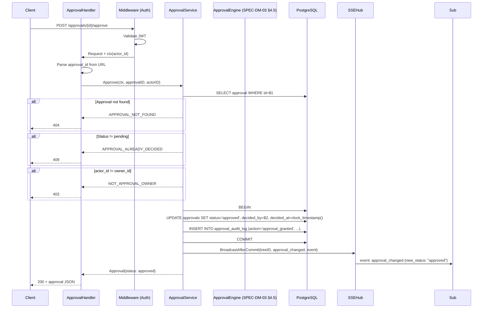
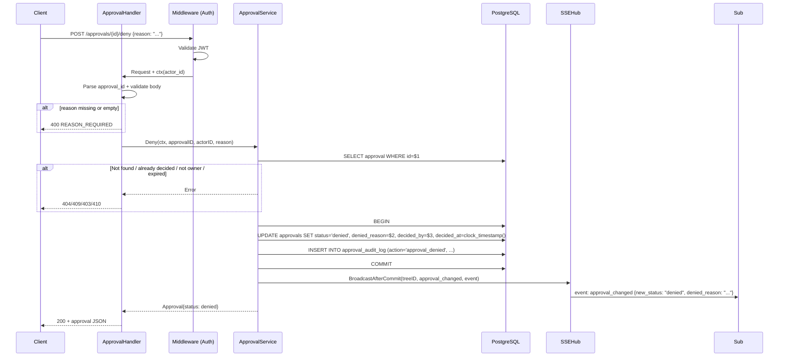
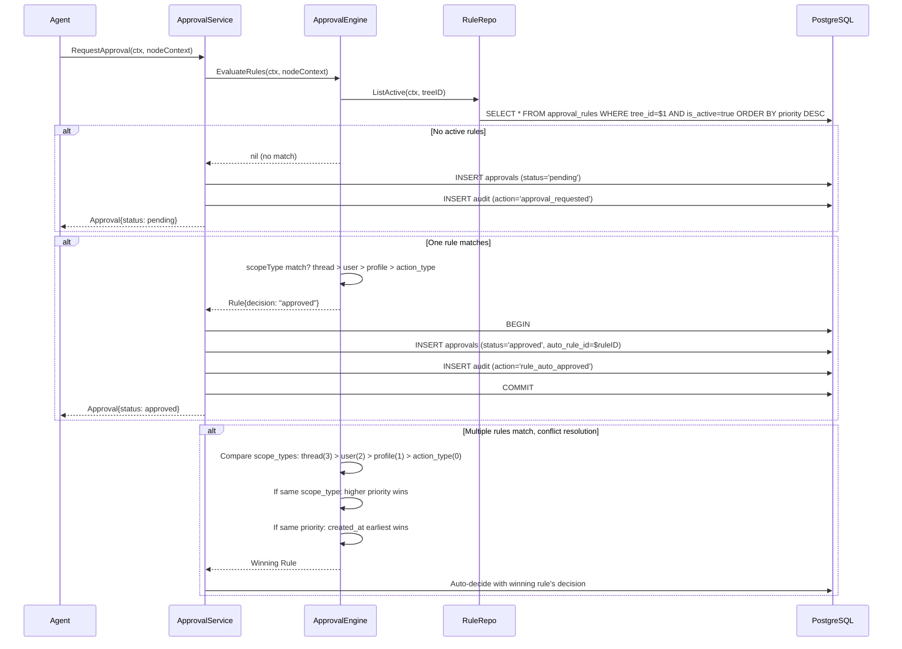

# SPEC-API-05 — Approval Endpoints

> **Status:** Spec | **Blocks:** BE-07 (Auth & Approval Engine), BE-11 (HTTP Router), BE-12 (Integration Tests), FE-06 (Approval Panel)
> **References:** SPEC-DM-03 (Approval & Audit Trail DDL), SPEC-DM-01 (Nodes/Trees DDL), SPEC-DM-04 (User & Profile Model), SPEC-API-01 (SSE Event Stream), ARCHITECTURE.md §8

---

## 1. Purpose

Define the exact REST endpoint contracts for Canopy's approval system: listing pending approvals, approving/denying individual requests, managing auto-approval rules, and querying the immutable audit trail. A Go worker reading this spec must produce correct `ApprovalHandler`, `ApprovalService` HTTP handlers, and `RuleHandler` implementations with zero clarifying questions. A TypeScript worker reading this spec must produce a correct API client with Zod-validated types and the full approval panel integration surface.

The approval system is a **safety-critical control surface** — the agent listens to all input but only acts on owner-approved input. These endpoints are the only path by which the owner grants or denies execution permission.

---

## 2. Design Decisions (from ARCHITECTURE.md and SPEC-DM-03)

| Decision | Choice | Source |
|----------|--------|--------|
| HTTP Router | chi or Go 1.22+ stdlib pattern mux | ARCHITECTURE.md §2.1 |
| Serialization | JSON (application/json; charset=utf-8) | ARCHITECTURE.md §5 |
| Auth | JWT Bearer token validated on every request | ARCHITECTURE.md §5.5, SPEC-API-01 §8 |
| IDs | UUIDv7 (time-ordered, RFC 9562) | SPEC-DM-01 §3.1 |
| Approval model | Per-message granularity, one approval per node | SPEC-DM-03 §2, §3.1 |
| Agent stance | Agent LISTENS to all input, only ACTS on approved input | ARCHITECTURE.md §8.2 |
| Auto-approval | Rule engine: most-specific-wins (thread > user > profile > action_type) | SPEC-DM-03 §2, §4.3 |
| Audit trail | Immutable append-only log, never deleted, REVOKE UPDATE/DELETE at DB level | SPEC-DM-03 §2, §3.1 |
| Denial | Mandatory `denied_reason` text (CHECK constraint in DDL) | SPEC-DM-03 §3.1, T1.5 §2.2.4 |
| Expiration | Auto-deny after configurable N days (default 7) | SPEC-DM-03 §3.1, T1.5 §8 Q1 |
| SSE broadcast | Every approval state change broadcasts via SSE Hub (SPEC-API-01) | SPEC-API-01 §4 |
| Single-user MVP | Owner is sole approver. `owner_id = calling user_id` enforced at handler level | ARCHITECTURE.md §8, §11 |
| Rule conflict resolution | Priority field (higher = more specific) breaks ties when scope_type matches | SPEC-DM-03 §3.1, §4.3 |
| Pagination | `limit`/`offset` with total count in response. Max 100 per page | This spec §3, §7 |
| Timestamps | `clock_timestamp()` server-side, immutable | SPEC-DM-01 §3 |
| Content-Type (response) | `application/json; charset=utf-8` | ARCHITECTURE.md §5 |

---

## 3. GET /approvals/pending — List Pending Approvals

### 3.1 Route

```
GET /approvals/pending
```

| Field | Value |
|-------|-------|
| Method | GET |
| Path | `/approvals/pending` |
| Auth | Required (Bearer token) |
| Content-Type (response) | `application/json; charset=utf-8` |

### 3.2 Query Parameters

| Parameter | Type | Required | Default | Description |
|-----------|------|----------|---------|-------------|
| `tree_id` | UUIDv7 string | No | — | Filter pending approvals to a specific tree. If omitted, returns pending approvals across all trees owned by the authenticated user. |
| `limit` | integer | No | `50` | Max approvals to return. Min 1, max 100. |
| `offset` | integer | No | `0` | Pagination offset. Min 0. |

### 3.3 Response: 200 OK

```json
{
  "approvals": [
    {
      "id": "0191a8b2-7fff-7000-9000-000000000201",
      "tree_id": "0191a8b2-7fff-7000-8000-000000000001",
      "node_id": "0191a8b2-7fff-7000-9000-000000000101",
      "owner_id": "0191a8b2-7fff-7000-8000-00000000000a",
      "requested_by": "0191a8b2-7fff-7000-8000-00000000000b",
      "status": "pending",
      "denied_reason": null,
      "auto_rule_id": null,
      "decided_by": null,
      "created_at": "2026-07-20T18:30:00Z",
      "decided_at": null,
      "expires_at": "2026-07-27T18:30:00Z",
      "node": {
        "id": "0191a8b2-7fff-7000-9000-000000000101",
        "content": "DROP TABLE users CASCADE;",
        "content_format": "plain",
        "node_type": "message",
        "author": {
          "id": "0191a8b2-7fff-7000-8000-00000000000b",
          "name": "coding-hermes",
          "type": "profile"
        },
        "parent_id": "0191a8b2-7fff-7000-9000-000000000100",
        "created_at": "2026-07-20T18:30:00Z"
      }
    }
  ],
  "total": 1,
  "limit": 50,
  "offset": 0
}
```

| Field | Type | Description |
|-------|------|-------------|
| `approvals[]` | array | Pending approval objects sorted by `created_at` ascending (oldest first — FIFO approval queue) |
| `approvals[].id` | UUIDv7 | Approval ID |
| `approvals[].tree_id` | UUIDv7 | Tree this approval belongs to |
| `approvals[].node_id` | UUIDv7 | Node whose action requires approval |
| `approvals[].owner_id` | UUIDv7 | Who must approve (tree owner) |
| `approvals[].requested_by` | UUIDv7 | Which profile/agent requested the action |
| `approvals[].status` | string | Always `"pending"` in this endpoint |
| `approvals[].denied_reason` | string\|null | Always null for pending |
| `approvals[].auto_rule_id` | UUIDv7\|null | Rule ID that triggered this auto-approval (null for manual requests) |
| `approvals[].decided_by` | UUIDv7\|null | Always null for pending |
| `approvals[].created_at` | ISO 8601 | When approval was requested |
| `approvals[].decided_at` | ISO 8601\|null | Always null for pending |
| `approvals[].expires_at` | ISO 8601 | When this approval auto-expires |
| `approvals[].node` | object | Inline node data with `author` sub-object for UI rendering |
| `approvals[].node.id` | UUIDv7 | Node ID |
| `approvals[].node.content` | string | Full node content (truncated to 500 chars in list context) |
| `approvals[].node.content_format` | string | `markdown`, `plain`, or `rich` |
| `approvals[].node.node_type` | string | `message`, `synthesis`, or `system` |
| `approvals[].node.author` | object | Who wrote this node |
| `approvals[].node.author.id` | UUIDv7 | Author ID |
| `approvals[].node.author.name` | string | Display name |
| `approvals[].node.author.type` | string | `"human"` or `"profile"` |
| `approvals[].node.parent_id` | UUIDv7\|null | Parent node for context chain |
| `approvals[].node.created_at` | ISO 8601 | When node was created |
| `total` | integer | Total number of pending approvals (for pagination) |
| `limit` | integer | Requested limit |
| `offset` | integer | Requested offset |

### 3.4 Business Logic

1. Extract `owner_id` from JWT claims (the authenticated user IS the owner for MVP).
2. Query `approvals` table WHERE `owner_id = $1 AND status = 'pending'` optionally filtered by `tree_id`.
3. JOIN with `nodes` table to inline node content and author info for UI rendering.
4. Sort by `created_at ASC` — oldest pending requests appear first (FIFO queue). The approval panel should show the oldest unhandled request at the top.
5. Apply `LIMIT` and `OFFSET` for pagination. Return total count for client-side pagination controls.

### 3.5 SQL

```sql
-- List pending approvals for owner with inlined node data
SELECT
    a.id, a.tree_id, a.node_id, a.owner_id, a.requested_by,
    a.status, a.denied_reason, a.auto_rule_id, a.decided_by,
    a.created_at, a.decided_at, a.expires_at,
    n.id AS node__id,
    n.content AS node__content,
    n.content_format AS node__content_format,
    n.node_type AS node__node_type,
    n.created_at AS node__created_at,
    n.parent_id AS node__parent_id,
    CASE WHEN n.author_type = 'profile'
        THEN p.id
        ELSE u.id
    END AS node__author_id,
    CASE WHEN n.author_type = 'profile'
        THEN p.display_name
        ELSE COALESCE(u.display_name, u.email)
    END AS node__author_name,
    n.author_type AS node__author_type
FROM approvals a
JOIN nodes n ON a.node_id = n.id
LEFT JOIN profiles p ON n.author_id = p.id AND n.author_type = 'profile'
LEFT JOIN users u ON n.author_id = u.id AND n.author_type = 'human'
WHERE a.owner_id = $1
  AND a.status = 'pending'
  AND ($2::uuid IS NULL OR a.tree_id = $2)
ORDER BY a.created_at ASC
LIMIT $3 OFFSET $4
```

### 3.6 Error Responses

| Code | HTTP Status | Trigger | Details |
|------|------------|---------|---------|
| `INVALID_TREE_ID` | 400 | `tree_id` is not a valid UUIDv7 | `{ "value": "<bad>" }` |
| `INVALID_LIMIT` | 400 | `limit` < 1 or > 100 | `{ "min": 1, "max": 100, "received": <limit> }` |
| `INVALID_OFFSET` | 400 | `offset` < 0 | `{ "received": <offset> }` |
| `TREE_NOT_FOUND` | 404 | `tree_id` exists but not found | `{ "tree_id": "<id>" }` |
| `NOT_TREE_OWNER` | 403 | User is not the tree owner (can't filter by tree they don't own) | `{ "tree_id": "<id>" }` |

Note: If no pending approvals exist, returns 200 with `approvals: []` and `total: 0` — not 404. An empty queue is a valid state.

---

## 4. POST /approvals/{id}/approve — Approve a Pending Request

### 4.1 Route

```
POST /approvals/{approval_id}/approve
```

| Field | Value |
|-------|-------|
| Method | POST |
| Path | `/approvals/{approval_id}/approve` |
| approval_id | UUIDv7 |
| Auth | Required (Bearer token) |
| Content-Type (response) | `application/json; charset=utf-8` |
| Request body | None (empty body) |

### 4.2 Response: 200 OK

```json
{
  "id": "0191a8b2-7fff-7000-9000-000000000201",
  "tree_id": "0191a8b2-7fff-7000-8000-000000000001",
  "node_id": "0191a8b2-7fff-7000-9000-000000000101",
  "owner_id": "0191a8b2-7fff-7000-8000-00000000000a",
  "requested_by": "0191a8b2-7fff-7000-8000-00000000000b",
  "status": "approved",
  "denied_reason": null,
  "auto_rule_id": null,
  "decided_by": "0191a8b2-7fff-7000-8000-00000000000a",
  "created_at": "2026-07-20T18:30:00Z",
  "decided_at": "2026-07-20T19:15:00Z",
  "expires_at": "2026-07-27T18:30:00Z"
}
```

### 4.3 Business Logic

1. Extract `actor_id` from JWT claims.
2. Look up approval by `approval_id`. If not found → 404.
3. Verify approval `status == 'pending'`. If already decided → 409 `APPROVAL_ALREADY_DECIDED`.
4. Verify `actor_id == approval.owner_id` (only the tree owner can approve). If not → 403 `NOT_APPROVAL_OWNER`.
5. Verify approval is not expired. Check `expires_at > now()`. If expired → 410 `APPROVAL_EXPIRED`.
6. **Atomic UPDATE in transaction**:
   - Set `status = 'approved'`
   - Set `decided_by = actor_id`
   - Set `decided_at = clock_timestamp()`
7. **Insert audit entry** in same transaction:
   - `action = 'approval_granted'`
   - `actor = actor_id`
   - `previous_status = 'pending'`
   - `new_status = 'approved'`
   - `details` = full context snapshot (tree_id, node_id, requested_by, owner_id)
8. **SSE broadcast** after commit: `approval_changed` event to tree's SSE subscribers.
9. Return the updated approval object.

### 4.4 SQL

```sql
-- Approve (transaction)
BEGIN;
    -- 1. Update approval
    UPDATE approvals
    SET status = 'approved',
        decided_by = $2,
        decided_at = clock_timestamp()
    WHERE id = $1
      AND status = 'pending'
      AND expires_at > clock_timestamp()
    RETURNING *;

    -- 2. Insert audit entry
    INSERT INTO approval_audit_log (approval_id, action, actor, previous_status, new_status, details)
    VALUES (
        $1,
        'approval_granted',
        $2,
        'pending',
        'approved',
        jsonb_build_object(
            'tree_id', (SELECT tree_id FROM approvals WHERE id = $1),
            'node_id', (SELECT node_id FROM approvals WHERE id = $1),
            'requested_by', (SELECT requested_by FROM approvals WHERE id = $1),
            'owner_id', $2
        )
    );
COMMIT;
```

### 4.5 Error Responses

| Code | HTTP Status | Trigger | Details |
|------|------------|---------|---------|
| `INVALID_APPROVAL_ID` | 400 | `approval_id` is not a valid UUIDv7 | `{ "value": "<bad>" }` |
| `APPROVAL_NOT_FOUND` | 404 | No approval with this ID | `{ "approval_id": "<id>" }` |
| `APPROVAL_ALREADY_DECIDED` | 409 | Approval is already approved/denied/expired | `{ "approval_id": "<id>", "current_status": "<status>" }` |
| `NOT_APPROVAL_OWNER` | 403 | Authenticated user is not the owner of this approval | `{ "approval_id": "<id>", "owner_id": "<owner>", "actor_id": "<actor>" }` |
| `APPROVAL_EXPIRED` | 410 | Approval expired before decision | `{ "approval_id": "<id>", "expired_at": "<iso8601>" }` |

---

## 5. POST /approvals/{id}/deny — Deny a Pending Request

### 5.1 Route

```
POST /approvals/{approval_id}/deny
```

| Field | Value |
|-------|-------|
| Method | POST |
| Path | `/approvals/{approval_id}/deny` |
| approval_id | UUIDv7 |
| Auth | Required (Bearer token) |
| Content-Type (request) | `application/json; charset=utf-8` |
| Content-Type (response) | `application/json; charset=utf-8` |

### 5.2 Request Body

```json
{
  "reason": "Not safe to drop users table in production. This needs a migration plan with rollback."
}
```

| Field | Type | Required | Description |
|-------|------|----------|-------------|
| `reason` | string | Yes | Why the action was denied. 1–1000 characters. Non-empty, non-whitespace. Preserved in audit trail. |

### 5.3 Response: 200 OK

```json
{
  "id": "0191a8b2-7fff-7000-9000-000000000201",
  "tree_id": "0191a8b2-7fff-7000-8000-000000000001",
  "node_id": "0191a8b2-7fff-7000-9000-000000000101",
  "owner_id": "0191a8b2-7fff-7000-8000-00000000000a",
  "requested_by": "0191a8b2-7fff-7000-8000-00000000000b",
  "status": "denied",
  "denied_reason": "Not safe to drop users table in production. This needs a migration plan with rollback.",
  "auto_rule_id": null,
  "decided_by": "0191a8b2-7fff-7000-8000-00000000000a",
  "created_at": "2026-07-20T18:30:00Z",
  "decided_at": "2026-07-20T19:20:00Z",
  "expires_at": "2026-07-27T18:30:00Z"
}
```

### 5.4 Business Logic

1. Extract `actor_id` from JWT claims.
2. Validate request body: `reason` must be present, 1–1000 characters, non-empty after trim.
3. Look up approval by `approval_id`. If not found → 404.
4. Verify approval `status == 'pending'`. If already decided → 409 `APPROVAL_ALREADY_DECIDED`.
5. Verify `actor_id == approval.owner_id`. If not → 403 `NOT_APPROVAL_OWNER`.
6. Verify approval is not expired. If expired → 410 `APPROVAL_EXPIRED`.
7. **Atomic UPDATE in transaction**:
   - Set `status = 'denied'`
   - Set `denied_reason = reason` (CHECK constraint validates non-null when denied)
   - Set `decided_by = actor_id`
   - Set `decided_at = clock_timestamp()`
8. **Insert audit entry** in same transaction:
   - `action = 'approval_denied'`
   - `actor = actor_id`
   - `previous_status = 'pending'`
   - `new_status = 'denied'`
   - `details` = full context snapshot including `deny_reason`
9. **SSE broadcast** after commit: `approval_changed` event.
10. Return the updated approval object with `denied_reason` populated.

### 5.5 SQL

```sql
-- Deny (transaction)
BEGIN;
    UPDATE approvals
    SET status = 'denied',
        denied_reason = $2,
        decided_by = $3,
        decided_at = clock_timestamp()
    WHERE id = $1
      AND status = 'pending'
      AND expires_at > clock_timestamp()
    RETURNING *;

    INSERT INTO approval_audit_log (approval_id, action, actor, previous_status, new_status, details)
    VALUES (
        $1,
        'approval_denied',
        $3,
        'pending',
        'denied',
        jsonb_build_object(
            'tree_id', (SELECT tree_id FROM approvals WHERE id = $1),
            'node_id', (SELECT node_id FROM approvals WHERE id = $1),
            'requested_by', (SELECT requested_by FROM approvals WHERE id = $1),
            'owner_id', $3,
            'deny_reason', $2
        )
    );
COMMIT;
```

### 5.6 Error Responses

| Code | HTTP Status | Trigger | Details |
|------|------------|---------|---------|
| `REASON_REQUIRED` | 400 | `reason` is missing, empty, or whitespace-only | `{ "field": "reason" }` |
| `REASON_TOO_LONG` | 400 | `reason` exceeds 1000 characters | `{ "max": 1000, "actual": <length> }` |
| `INVALID_APPROVAL_ID` | 400 | `approval_id` is not a valid UUIDv7 | `{ "value": "<bad>" }` |
| `APPROVAL_NOT_FOUND` | 404 | No approval with this ID | `{ "approval_id": "<id>" }` |
| `APPROVAL_ALREADY_DECIDED` | 409 | Approval is already approved/denied/expired | `{ "approval_id": "<id>", "current_status": "<status>" }` |
| `NOT_APPROVAL_OWNER` | 403 | Authenticated user is not the owner of this approval | `{ "approval_id": "<id>", "owner_id": "<owner>", "actor_id": "<actor>" }` |
| `APPROVAL_EXPIRED` | 410 | Approval expired before decision | `{ "approval_id": "<id>", "expired_at": "<iso8601>" }` |

---

## 6. POST /approvals/rules — Create Auto-Approval Rule

### 6.1 Route

```
POST /approvals/rules
```

| Field | Value |
|-------|-------|
| Method | POST |
| Path | `/approvals/rules` |
| Auth | Required (Bearer token) |
| Content-Type (request) | `application/json; charset=utf-8` |
| Content-Type (response) | `application/json; charset=utf-8` |

### 6.2 Request Body

```json
{
  "tree_id": "0191a8b2-7fff-7000-8000-000000000001",
  "scope_type": "profile",
  "scope_target": "0191a8b2-7fff-7000-8000-00000000000b",
  "decision": "approved",
  "priority": 10
}
```

| Field | Type | Required | Default | Description |
|-------|------|----------|---------|-------------|
| `tree_id` | UUIDv7 string | Yes | — | Tree this rule applies to |
| `scope_type` | string | Yes | — | `thread`, `user`, `profile`, or `action_type` |
| `scope_target` | UUIDv7 string | Yes | — | The thread_id, user_id, profile_id, or action_type_id to match |
| `decision` | string | Yes | — | `approved` or `denied` — the auto-decision |
| `priority` | integer | No | `0` | Higher = more specific, wins conflicts. Min 0, max 1000. |

### 6.3 Response: 201 Created

```json
{
  "id": "0191a8b2-7fff-7000-a000-000000000301",
  "tree_id": "0191a8b2-7fff-7000-8000-000000000001",
  "owner_id": "0191a8b2-7fff-7000-8000-00000000000a",
  "scope_type": "profile",
  "scope_target": "0191a8b2-7fff-7000-8000-00000000000b",
  "decision": "approved",
  "priority": 10,
  "is_active": true,
  "created_at": "2026-07-20T19:30:00Z",
  "updated_at": "2026-07-20T19:30:00Z"
}
```

### 6.4 Business Logic

1. Extract `owner_id` from JWT claims.
2. Validate: `scope_type` must be one of `thread`, `user`, `profile`, `action_type`.
3. Validate: `decision` must be `approved` or `denied`.
4. Validate: no duplicate rule for same `scope_type + scope_target` within same tree (UNIQUE constraint handles this — return 409 `RULE_ALREADY_EXISTS`).
5. Verify caller is tree owner (or admin in future). User must be `tree.owner_id`.
6. INSERT rule with `owner_id = actor_id`, `is_active = true`, `created_at/updated_at = clock_timestamp()`.
7. Insert audit entry: `action = 'rule_created'`, `actor = actor_id`, no previous/new status.
8. Return 201 with created rule.

### 6.5 Error Responses

| Code | HTTP Status | Trigger | Details |
|------|------------|---------|---------|
| `INVALID_SCOPE_TYPE` | 400 | `scope_type` is not a valid value | `{ "allowed": ["thread","user","profile","action_type"], "received": "<bad>" }` |
| `INVALID_DECISION` | 400 | `decision` is not `approved` or `denied` | `{ "allowed": ["approved","denied"], "received": "<bad>" }` |
| `INVALID_TREE_ID` | 400 | `tree_id` is not a valid UUIDv7 | `{ "value": "<bad>" }` |
| `INVALID_SCOPE_TARGET` | 400 | `scope_target` is not a valid UUIDv7 | `{ "value": "<bad>" }` |
| `TREE_NOT_FOUND` | 404 | Tree does not exist | `{ "tree_id": "<id>" }` |
| `NOT_TREE_OWNER` | 403 | Authenticated user is not the tree owner | `{ "tree_id": "<id>" }` |
| `RULE_ALREADY_EXISTS` | 409 | A rule for this scope_type + scope_target already exists in this tree | `{ "existing_rule_id": "<id>" }` |
| `SCOPE_TARGET_NOT_FOUND` | 404 | `scope_target` references a non-existent thread/user/profile/action | `{ "scope_type": "<type>", "scope_target": "<id>" }` |

---

## 7. GET /approvals/rules — List Auto-Approval Rules

### 7.1 Route

```
GET /approvals/rules
```

| Field | Value |
|-------|-------|
| Method | GET |
| Path | `/approvals/rules` |
| Auth | Required (Bearer token) |
| Content-Type (response) | `application/json; charset=utf-8` |

### 7.2 Query Parameters

| Parameter | Type | Required | Default | Description |
|-----------|------|----------|---------|-------------|
| `tree_id` | UUIDv7 string | Yes | — | Tree to list rules for |
| `include_inactive` | boolean | No | `false` | If true, include `is_active=false` rules |

### 7.3 Response: 200 OK

```json
{
  "rules": [
    {
      "id": "0191a8b2-7fff-7000-a000-000000000301",
      "tree_id": "0191a8b2-7fff-7000-8000-000000000001",
      "owner_id": "0191a8b2-7fff-7000-8000-00000000000a",
      "scope_type": "profile",
      "scope_target": "0191a8b2-7fff-7000-8000-00000000000b",
      "decision": "approved",
      "priority": 10,
      "is_active": true,
      "created_at": "2026-07-20T19:30:00Z",
      "updated_at": "2026-07-20T19:30:00Z",
      "scope_target_name": "coding-hermes"
    }
  ],
  "total": 1
}
```

| Field | Type | Description |
|-------|------|-------------|
| `rules[]` | array | Rules sorted by `priority DESC`, then `created_at DESC` |
| `rules[].scope_target_name` | string | Human-readable name of the scope target (thread title, user display name, profile name, or action type label). Resolved via JOIN at query time. |

### 7.4 Business Logic

1. Extract `owner_id` from JWT claims.
2. Verify user is tree owner (only owners can manage rules).
3. Query `approval_rules` WHERE `tree_id = $1`. Apply `is_active = true` filter if `include_inactive` is false.
4. JOIN to resolve `scope_target_name`:
   - `scope_type='thread'` → JOIN topics/tree branches table by thread_id, get name
   - `scope_type='user'` → JOIN users table, get display_name
   - `scope_type='profile'` → JOIN profiles table, get display_name
   - `scope_type='action_type'` → lookup from enum (static string)
5. Sort by `priority DESC`, then `created_at DESC`.

### 7.5 Error Responses

| Code | HTTP Status | Trigger | Details |
|------|------------|---------|---------|
| `TREE_ID_REQUIRED` | 400 | `tree_id` query parameter missing | `{ "field": "tree_id" }` |
| `INVALID_TREE_ID` | 400 | `tree_id` is not a valid UUIDv7 | `{ "value": "<bad>" }` |
| `TREE_NOT_FOUND` | 404 | Tree does not exist | `{ "tree_id": "<id>" }` |
| `NOT_TREE_OWNER` | 403 | Authenticated user is not the tree owner | `{ "tree_id": "<id>" }` |

---

## 8. PATCH /approvals/rules/{rule_id} — Update a Rule

### 8.1 Route

```
PATCH /approvals/rules/{rule_id}
```

| Field | Value |
|-------|-------|
| Method | PATCH |
| Path | `/approvals/rules/{rule_id}` |
| rule_id | UUIDv7 |
| Auth | Required (Bearer token) |
| Content-Type (request) | `application/json; charset=utf-8` |
| Content-Type (response) | `application/json; charset=utf-8` |

### 8.2 Request Body

```json
{
  "decision": "denied",
  "priority": 20,
  "is_active": true
}
```

All fields are optional. Only provided fields are updated. `scope_type` and `scope_target` are immutable after creation — they define the rule identity.

| Field | Type | Required | Description |
|-------|------|----------|-------------|
| `decision` | string | No | `approved` or `denied` |
| `priority` | integer | No | Min 0, max 1000 |
| `is_active` | boolean | No | Enable or disable the rule without deleting |

### 8.3 Response: 200 OK

Same shape as the create response (§6.3) with updated fields.

### 8.4 Business Logic

1. Extract `actor_id` from JWT claims.
2. Look up rule by `rule_id`. If not found → 404.
3. Verify caller is tree owner: `rule.tree.owner_id == actor_id`.
4. UPDATE only the fields provided in request body. `updated_at = clock_timestamp()`.
5. Insert audit entry: `action = 'rule_updated'`, `actor = actor_id`, `details` = old vs new values for changed fields.
6. Return 200 with updated rule.

### 8.5 Error Responses

| Code | HTTP Status | Trigger | Details |
|------|------------|---------|---------|
| `INVALID_RULE_ID` | 400 | `rule_id` is not a valid UUIDv7 | `{ "value": "<bad>" }` |
| `RULE_NOT_FOUND` | 404 | Rule does not exist | `{ "rule_id": "<id>" }` |
| `INVALID_DECISION` | 400 | `decision` provided but not `approved`/`denied` | `{ "allowed": ["approved","denied"], "received": "<bad>" }` |
| `NOT_TREE_OWNER` | 403 | User is not the tree owner | `{ "tree_id": "<id>" }` |
| `NO_FIELDS_PROVIDED` | 400 | Request body is empty or no recognized fields | `{ "message": "At least one of: decision, priority, is_active must be provided" }` |
| `INVALID_PRIORITY` | 400 | `priority` < 0 or > 1000 | `{ "min": 0, "max": 1000, "received": <priority> }` |

---

## 9. DELETE /approvals/rules/{rule_id} — Delete a Rule

### 9.1 Route

```
DELETE /approvals/rules/{rule_id}
```

| Field | Value |
|-------|-------|
| Method | DELETE |
| Path | `/approvals/rules/{rule_id}` |
| rule_id | UUIDv7 |
| Auth | Required (Bearer token) |
| Content-Type (response) | `application/json; charset=utf-8` |

### 9.2 Response: 200 OK

```json
{
  "deleted": true,
  "rule_id": "0191a8b2-7fff-7000-a000-000000000301"
}
```

### 9.3 Business Logic

1. Extract `actor_id` from JWT claims.
2. Look up rule by `rule_id`. If not found → 404.
3. Verify caller is tree owner.
4. Delete the rule row (hard delete — rules are configuration, not audit data).
5. Insert audit entry: `action = 'rule_deleted'`, `actor = actor_id`, `details` = snapshot of deleted rule.
6. Return 200 with confirmation.

Note: Deleting a rule does NOT retroactively change decisions already made by that rule. The `approvals.auto_rule_id` FK uses `ON DELETE SET NULL`, so existing auto-approved/denied approvals retain their status but lose the rule reference.

### 9.4 Error Responses

| Code | HTTP Status | Trigger | Details |
|------|------------|---------|---------|
| `INVALID_RULE_ID` | 400 | `rule_id` is not a valid UUIDv7 | `{ "value": "<bad>" }` |
| `RULE_NOT_FOUND` | 404 | Rule does not exist | `{ "rule_id": "<id>" }` |
| `NOT_TREE_OWNER` | 403 | User is not the tree owner | `{ "tree_id": "<id>" }` |

---

## 10. GET /approvals/history — Audit Trail

### 10.1 Route

```
GET /approvals/history
```

| Field | Value |
|-------|-------|
| Method | GET |
| Path | `/approvals/history` |
| Auth | Required (Bearer token) |
| Content-Type (response) | `application/json; charset=utf-8` |

### 10.2 Query Parameters

| Parameter | Type | Required | Default | Description |
|-----------|------|----------|---------|-------------|
| `tree_id` | UUIDv7 string | No | — | Filter to a specific tree |
| `approval_id` | UUIDv7 string | No | — | Filter to a specific approval |
| `action` | string | No | — | Filter by audit action type (e.g., `approval_granted`, `rule_created`) |
| `actor` | UUIDv7 string | No | — | Filter by actor (who took the action) |
| `since` | ISO 8601 | No | — | Return entries after this timestamp |
| `before` | ISO 8601 | No | — | Return entries before this timestamp |
| `limit` | integer | No | `50` | Max entries. Min 1, max 100. |
| `offset` | integer | No | `0` | Pagination offset. Min 0. |

### 10.3 Response: 200 OK

```json
{
  "entries": [
    {
      "id": "0191a8b2-7fff-7000-b000-000000000401",
      "approval_id": "0191a8b2-7fff-7000-9000-000000000201",
      "action": "approval_granted",
      "actor": "0191a8b2-7fff-7000-8000-00000000000a",
      "actor_name": "Bane",
      "previous_status": "pending",
      "new_status": "approved",
      "details": {
        "tree_id": "0191a8b2-7fff-7000-8000-000000000001",
        "node_id": "0191a8b2-7fff-7000-9000-000000000101",
        "requested_by": "0191a8b2-7fff-7000-8000-00000000000b",
        "owner_id": "0191a8b2-7fff-7000-8000-00000000000a"
      },
      "created_at": "2026-07-20T19:15:00Z"
    }
  ],
  "total": 1,
  "limit": 50,
  "offset": 0
}
```

### 10.4 Business Logic

1. Extract `actor_id` from JWT claims.
2. Filter audit log by any combination of query parameters.
3. Only return entries belonging to trees the user owns (security: can't see other users' audit trails).
4. JOIN `users`/`profiles` to resolve `actor_name`.
5. Sort by `created_at DESC` (most recent first).
6. Apply `LIMIT` and `OFFSET`. Return total count.

### 10.5 SQL

```sql
SELECT
    al.id, al.approval_id, al.action, al.actor,
    al.previous_status, al.new_status, al.details, al.created_at,
    CASE WHEN al.actor IS NOT NULL
        THEN COALESCE(u.display_name, p.display_name, 'system')
        ELSE 'system'
    END AS actor_name
FROM approval_audit_log al
JOIN approvals a ON al.approval_id = a.id
LEFT JOIN users u ON al.actor = u.id
LEFT JOIN profiles p ON al.actor = p.id
WHERE a.owner_id = $1                                    -- only user's own trees
  AND ($2::uuid IS NULL OR a.tree_id = $2)              -- optional tree filter
  AND ($3::uuid IS NULL OR al.approval_id = $3)         -- optional approval filter
  AND ($4::audit_action IS NULL OR al.action = $4)       -- optional action filter
  AND ($5::uuid IS NULL OR al.actor = $5)                -- optional actor filter
  AND ($6::timestamptz IS NULL OR al.created_at >= $6)   -- optional since
  AND ($7::timestamptz IS NULL OR al.created_at <= $7)   -- optional before
ORDER BY al.created_at DESC
LIMIT $8 OFFSET $9
```

### 10.6 Error Responses

| Code | HTTP Status | Trigger | Details |
|------|------------|---------|---------|
| `INVALID_TREE_ID` | 400 | `tree_id` is not a valid UUIDv7 | `{ "value": "<bad>" }` |
| `INVALID_APPROVAL_ID` | 400 | `approval_id` is not a valid UUIDv7 | `{ "value": "<bad>" }` |
| `INVALID_ACTION` | 400 | `action` is not a valid audit_action enum | `{ "allowed": ["approval_requested","approval_granted","approval_denied","approval_expired","rule_created","rule_updated","rule_deleted","rule_auto_approved","rule_auto_denied"], "received": "<bad>" }` |
| `INVALID_SINCE` | 400 | `since` is not a valid ISO 8601 timestamp | `{ "value": "<bad>" }` |
| `INVALID_BEFORE` | 400 | `before` is not a valid ISO 8601 timestamp | `{ "value": "<bad>" }` |
| `TREE_NOT_FOUND` | 404 | `tree_id` specified but not found or not owned by user | `{ "tree_id": "<id>" }` |

---

## 11. GET /approvals/{approval_id} — Get Single Approval

### 11.1 Route

```
GET /approvals/{approval_id}
```

| Field | Value |
|-------|-------|
| Method | GET |
| Path | `/approvals/{approval_id}` |
| approval_id | UUIDv7 |
| Auth | Required (Bearer token) |
| Content-Type (response) | `application/json; charset=utf-8` |

### 11.2 Response: 200 OK

Same shape as pending list item (§3.3) but without the wrapping array. Returns the full approval with inlined node data. Works for any status (pending, approved, denied, expired).

### 11.3 Business Logic

1. Extract `actor_id` from JWT claims.
2. Look up approval. If not found → 404.
3. Verify user is the approval owner (only owner can view their own approvals).
4. JOIN nodes for inlined node data.
5. Return full approval object.

### 11.4 Error Responses

| Code | HTTP Status | Trigger | Details |
|------|------------|---------|---------|
| `INVALID_APPROVAL_ID` | 400 | `approval_id` is not a valid UUIDv7 | `{ "value": "<bad>" }` |
| `APPROVAL_NOT_FOUND` | 404 | No approval with this ID | `{ "approval_id": "<id>" }` |
| `NOT_APPROVAL_OWNER` | 403 | Authenticated user is not the owner | `{ "approval_id": "<id>" }` |

---

## 12. SSE Events

Every approval state change broadcasts via the SSE Hub (SPEC-API-01). The event type is `approval_changed`.

### 12.1 Event Shape

```
event: approval_changed
data: {"approval_id":"0191a8b2-...","tree_id":"0191a8b2-...","node_id":"0191a8b2-...","previous_status":"pending","new_status":"approved","decided_by":"0191a8b2-...","decided_at":"2026-07-20T19:15:00Z","denied_reason":null}
```

| Field | Type | Description |
|-------|------|-------------|
| `approval_id` | UUIDv7 | The approval that changed |
| `tree_id` | UUIDv7 | Tree this belongs to (for client-side routing) |
| `node_id` | UUIDv7 | Node whose action was approved/denied |
| `previous_status` | string | State before the change |
| `new_status` | string | State after the change (`approved`, `denied`, or `expired`) |
| `decided_by` | UUIDv7\|null | Who decided (null if system-expired) |
| `decided_at` | ISO 8601 | When the decision was made |
| `denied_reason` | string\|null | Denial reason (null for approve/expire) |

### 12.2 When Events Fire

| Trigger | Event | Previous → New |
|---------|-------|----------------|
| Owner approves | `approval_changed` | `pending` → `approved` |
| Owner denies | `approval_changed` | `pending` → `denied` |
| System expires | `approval_changed` | `pending` → `expired` |
| Auto-rule approves | `approval_changed` | `pending` → `approved` |
| Auto-rule denies | `approval_changed` | `pending` → `denied` |

### 12.3 Client-Side Handling

The approval panel (FE-06) subscribes to SSE for all owned trees:

```typescript
// Subscribe to approval changes for the approval panel
const eventSource = new EventSource(`/trees/${treeId}/events?profiles=owner`);
eventSource.addEventListener('approval_changed', (event) => {
  const data = JSON.parse(event.data);
  if (data.new_status === 'approved') {
    // Remove from pending queue, trigger agent execution
    removeFromPending(data.approval_id);
    notifyAgentApproved(data.node_id);
  } else if (data.new_status === 'denied') {
    // Remove from pending queue, notify agent of denial with reason
    removeFromPending(data.approval_id);
    notifyAgentDenied(data.node_id, data.denied_reason);
  } else if (data.new_status === 'expired') {
    // Remove from pending queue, notify agent of timeout
    removeFromPending(data.approval_id);
    notifyAgentExpired(data.node_id);
  }
});
```

---

## 13. Go Interfaces

### 13.1 ApprovalHandler

```go
package approval

import (
    "net/http"
    "github.com/go-chi/chi/v5"
)

// ApprovalHandler handles HTTP requests for the approval system.
type ApprovalHandler struct {
    svc ApprovalService
}

func NewApprovalHandler(svc ApprovalService) *ApprovalHandler {
    return &ApprovalHandler{svc: svc}
}

// Register wires approval routes to the chi router.
func (h *ApprovalHandler) Register(r chi.Router) {
    r.Get("/approvals/pending", h.ListPending)
    r.Get("/approvals/{approval_id}", h.GetByID)
    r.Post("/approvals/{approval_id}/approve", h.Approve)
    r.Post("/approvals/{approval_id}/deny", h.Deny)
    r.Get("/approvals/history", h.ListHistory)
}

// ListPending handles GET /approvals/pending
func (h *ApprovalHandler) ListPending(w http.ResponseWriter, r *http.Request)

// GetByID handles GET /approvals/{approval_id}
func (h *ApprovalHandler) GetByID(w http.ResponseWriter, r *http.Request)

// Approve handles POST /approvals/{approval_id}/approve
func (h *ApprovalHandler) Approve(w http.ResponseWriter, r *http.Request)

// Deny handles POST /approvals/{approval_id}/deny
func (h *ApprovalHandler) Deny(w http.ResponseWriter, r *http.Request)

// ListHistory handles GET /approvals/history
func (h *ApprovalHandler) ListHistory(w http.ResponseWriter, r *http.Request)
```

### 13.2 RuleHandler

```go
// RuleHandler handles HTTP requests for auto-approval rules.
type RuleHandler struct {
    svc ApprovalService
}

func NewRuleHandler(svc ApprovalService) *RuleHandler {
    return &RuleHandler{svc: svc}
}

// Register wires rule routes to the chi router.
func (h *RuleHandler) Register(r chi.Router) {
    r.Post("/approvals/rules", h.Create)
    r.Get("/approvals/rules", h.List)
    r.Patch("/approvals/rules/{rule_id}", h.Update)
    r.Delete("/approvals/rules/{rule_id}", h.Delete)
}

func (h *RuleHandler) Create(w http.ResponseWriter, r *http.Request)
func (h *RuleHandler) List(w http.ResponseWriter, r *http.Request)
func (h *RuleHandler) Update(w http.ResponseWriter, r *http.Request)
func (h *RuleHandler) Delete(w http.ResponseWriter, r *http.Request)
```

### 13.3 ApprovalService (HTTP-facing)

```go
// ApprovalService is the HTTP-facing service for approval operations.
// It wraps the engine-level ApprovalService from SPEC-DM-03 §4.5
// and adds HTTP-specific concerns (request validation, response shaping).
type ApprovalService interface {
    // ListPending returns pending approvals with inlined node data.
    ListPending(ctx context.Context, ownerID uuid.UUID, filter PendingFilter) (*PendingResult, error)

    // GetByID returns a single approval by ID with inlined node data.
    GetByID(ctx context.Context, approvalID, requesterID uuid.UUID) (*ApprovalWithNode, error)

    // Approve approves a pending approval. Returns the updated approval.
    Approve(ctx context.Context, approvalID, actorID uuid.UUID) (*Approval, error)

    // Deny denies a pending approval with a mandatory reason.
    Deny(ctx context.Context, approvalID, actorID uuid.UUID, reason string) (*Approval, error)

    // ListHistory returns audit trail entries for trees owned by the user.
    ListHistory(ctx context.Context, ownerID uuid.UUID, filter HistoryFilter) (*HistoryResult, error)
}

// PendingFilter carries optional filters for ListPending.
type PendingFilter struct {
    TreeID *uuid.UUID // optional: filter to specific tree
    Limit  int        // default 50, max 100
    Offset int        // default 0, min 0
}

// PendingResult returned by ListPending.
type PendingResult struct {
    Approvals []ApprovalWithNode `json:"approvals"`
    Total     int                `json:"total"`
    Limit     int                `json:"limit"`
    Offset    int                `json:"offset"`
}

// ApprovalWithNode bundles an approval with its inlined node data for UI rendering.
type ApprovalWithNode struct {
    Approval
    Node ApprovalNodeData `json:"node"`
}

// ApprovalNodeData is the inlined node data attached to approval responses.
type ApprovalNodeData struct {
    ID            uuid.UUID `json:"id"`
    Content       string    `json:"content"`        // truncated to 500 chars in list
    ContentFormat string    `json:"content_format"`
    NodeType      string    `json:"node_type"`
    Author        AuthorRef `json:"author"`
    ParentID      *uuid.UUID `json:"parent_id"`
    CreatedAt     time.Time  `json:"created_at"`
}

// AuthorRef identifies a node author for UI display.
type AuthorRef struct {
    ID   uuid.UUID `json:"id"`
    Name string    `json:"name"`
    Type string    `json:"type"` // "human" or "profile"
}

// HistoryFilter carries optional filters for ListHistory.
type HistoryFilter struct {
    TreeID     *uuid.UUID     `json:"tree_id,omitempty"`
    ApprovalID *uuid.UUID     `json:"approval_id,omitempty"`
    Action     *AuditAction   `json:"action,omitempty"`
    Actor      *uuid.UUID     `json:"actor,omitempty"`
    Since      *time.Time     `json:"since,omitempty"`
    Before     *time.Time     `json:"before,omitempty"`
    Limit      int            `json:"limit"`
    Offset     int            `json:"offset"`
}

// HistoryResult returned by ListHistory.
type HistoryResult struct {
    Entries []AuditEntryWithActor `json:"entries"`
    Total   int                   `json:"total"`
    Limit   int                   `json:"limit"`
    Offset  int                   `json:"offset"`
}

// AuditEntryWithActor bundles an audit entry with resolved actor name.
type AuditEntryWithActor struct {
    AuditEntry
    ActorName string `json:"actor_name"`
}
```

### 13.4 RuleService (HTTP-facing)

```go
// RuleService manages auto-approval rules at the HTTP level.
type RuleService interface {
    Create(ctx context.Context, actorID uuid.UUID, input CreateRuleInput) (*ApprovalRule, error)
    List(ctx context.Context, treeID, actorID uuid.UUID, includeInactive bool) (*RuleListResult, error)
    Update(ctx context.Context, ruleID, actorID uuid.UUID, input UpdateRuleInput) (*ApprovalRule, error)
    Delete(ctx context.Context, ruleID, actorID uuid.UUID) error
}

type CreateRuleInput struct {
    TreeID      uuid.UUID      `json:"tree_id"`
    ScopeType   RuleScopeType  `json:"scope_type"`
    ScopeTarget uuid.UUID      `json:"scope_target"`
    Decision    ApprovalStatus `json:"decision"` // "approved" or "denied"
    Priority    int            `json:"priority"`
}

type UpdateRuleInput struct {
    Decision *ApprovalStatus `json:"decision,omitempty"`
    Priority *int            `json:"priority,omitempty"`
    IsActive *bool           `json:"is_active,omitempty"`
}

type RuleListResult struct {
    Rules []RuleWithScopeName `json:"rules"`
    Total int                 `json:"total"`
}

type RuleWithScopeName struct {
    ApprovalRule
    ScopeTargetName string `json:"scope_target_name"`
}
```

---

## 14. TypeScript Types

### 14.1 API Types

```typescript
// approval-api.types.ts
import { z } from 'zod'
import { ApprovalStatus, AuditAction, RuleScopeType } from './approval.types'

// ── Enums ──────────────────────────────────────────────────────

export const ApprovalApiDecision = z.enum(['approved', 'denied'])
export type ApprovalApiDecision = z.infer<typeof ApprovalApiDecision>

// ── Request Schemas ────────────────────────────────────────────

export const DenyRequestSchema = z.object({
  reason: z.string().min(1, 'Denial reason is required').max(1000, 'Reason too long'),
})
export type DenyRequest = z.infer<typeof DenyRequestSchema>

export const CreateRuleRequestSchema = z.object({
  tree_id: z.string().uuid(),
  scope_type: RuleScopeType,
  scope_target: z.string().uuid(),
  decision: ApprovalApiDecision,
  priority: z.number().int().min(0).max(1000).default(0),
})
export type CreateRuleRequest = z.infer<typeof CreateRuleRequestSchema>

export const UpdateRuleRequestSchema = z.object({
  decision: ApprovalApiDecision.optional(),
  priority: z.number().int().min(0).max(1000).optional(),
  is_active: z.boolean().optional(),
}).refine(data => Object.keys(data).length > 0, {
  message: 'At least one field must be provided',
})
export type UpdateRuleRequest = z.infer<typeof UpdateRuleRequestSchema>

// ── Response Schemas ───────────────────────────────────────────

export const AuthorRefSchema = z.object({
  id: z.string().uuid(),
  name: z.string(),
  type: z.enum(['human', 'profile']),
})
export type AuthorRef = z.infer<typeof AuthorRefSchema>

export const ApprovalNodeDataSchema = z.object({
  id: z.string().uuid(),
  content: z.string().max(500),
  content_format: z.enum(['markdown', 'plain', 'rich']),
  node_type: z.enum(['message', 'synthesis', 'system']),
  author: AuthorRefSchema,
  parent_id: z.string().uuid().nullable(),
  created_at: z.string().datetime(),
})
export type ApprovalNodeData = z.infer<typeof ApprovalNodeDataSchema>

export const ApprovalWithNodeSchema = z.object({
  id: z.string().uuid(),
  tree_id: z.string().uuid(),
  node_id: z.string().uuid(),
  owner_id: z.string().uuid(),
  requested_by: z.string().uuid(),
  status: ApprovalStatus,
  denied_reason: z.string().nullable(),
  auto_rule_id: z.string().uuid().nullable(),
  decided_by: z.string().uuid().nullable(),
  created_at: z.string().datetime(),
  decided_at: z.string().datetime().nullable(),
  expires_at: z.string().datetime(),
  node: ApprovalNodeDataSchema,
})
export type ApprovalWithNode = z.infer<typeof ApprovalWithNodeSchema>

export const PendingApprovalsResponseSchema = z.object({
  approvals: z.array(ApprovalWithNodeSchema),
  total: z.number().int().min(0),
  limit: z.number().int(),
  offset: z.number().int(),
})
export type PendingApprovalsResponse = z.infer<typeof PendingApprovalsResponseSchema>

export const ScopeTargetNameSchema = z.string()

export const RuleWithScopeNameSchema = z.object({
  id: z.string().uuid(),
  tree_id: z.string().uuid(),
  owner_id: z.string().uuid(),
  scope_type: RuleScopeType,
  scope_target: z.string().uuid(),
  decision: ApprovalApiDecision,
  priority: z.number().int(),
  is_active: z.boolean(),
  created_at: z.string().datetime(),
  updated_at: z.string().datetime(),
  scope_target_name: ScopeTargetNameSchema,
})
export type RuleWithScopeName = z.infer<typeof RuleWithScopeNameSchema>

export const RuleListResponseSchema = z.object({
  rules: z.array(RuleWithScopeNameSchema),
  total: z.number().int(),
})
export type RuleListResponse = z.infer<typeof RuleListResponseSchema>

export const RuleDeleteResponseSchema = z.object({
  deleted: z.literal(true),
  rule_id: z.string().uuid(),
})
export type RuleDeleteResponse = z.infer<typeof RuleDeleteResponseSchema>

export const AuditEntryWithActorSchema = z.object({
  id: z.string().uuid(),
  approval_id: z.string().uuid(),
  action: AuditAction,
  actor: z.string().uuid().nullable(),
  actor_name: z.string(),
  previous_status: ApprovalStatus.nullable(),
  new_status: ApprovalStatus.nullable(),
  details: z.record(z.unknown()),
  created_at: z.string().datetime(),
})
export type AuditEntryWithActor = z.infer<typeof AuditEntryWithActorSchema>

export const HistoryResponseSchema = z.object({
  entries: z.array(AuditEntryWithActorSchema),
  total: z.number().int(),
  limit: z.number().int(),
  offset: z.number().int(),
})
export type HistoryResponse = z.infer<typeof HistoryResponseSchema>

// ── SSE Event Schema ───────────────────────────────────────────

export const ApprovalChangedEventSchema = z.object({
  approval_id: z.string().uuid(),
  tree_id: z.string().uuid(),
  node_id: z.string().uuid(),
  previous_status: ApprovalStatus,
  new_status: ApprovalStatus,
  decided_by: z.string().uuid().nullable(),
  decided_at: z.string().datetime(),
  denied_reason: z.string().nullable(),
})
export type ApprovalChangedEvent = z.infer<typeof ApprovalChangedEventSchema>
```

### 14.2 API Client

```typescript
// approval-api.ts — Canopy API client for approval endpoints
import type { PendingApprovalsResponse } from './types'
import type { RuleWithScopeName, RuleListResponse, RuleDeleteResponse } from './types'
import type { CreateRuleRequest, UpdateRuleRequest } from './types'
import type { DenyRequest } from './types'
import type { HistoryResponse } from './types'
import type { ApprovalWithNode } from './types'

const BASE = '/api'

function getToken(): string {
  return localStorage.getItem('canopy_token') ?? ''
}

async function request<T>(path: string, options: RequestInit = {}): Promise<T> {
  const res = await fetch(`${BASE}${path}`, {
    ...options,
    headers: {
      'Content-Type': 'application/json',
      'Authorization': `Bearer ${getToken()}`,
      ...options.headers,
    },
  })
  if (!res.ok) throw await res.json()
  return res.json()
}

// ── Approvals ──────────────────────────────────────────────────

export async function listPending(
  treeId?: string,
  limit = 50,
  offset = 0,
): Promise<PendingApprovalsResponse> {
  const params = new URLSearchParams({ limit: String(limit), offset: String(offset) })
  if (treeId) params.set('tree_id', treeId)
  return request<PendingApprovalsResponse>(`/approvals/pending?${params}`)
}

export async function getApproval(approvalId: string): Promise<ApprovalWithNode> {
  return request<ApprovalWithNode>(`/approvals/${approvalId}`)
}

export async function approve(approvalId: string): Promise<ApprovalWithNode> {
  return request<ApprovalWithNode>(`/approvals/${approvalId}/approve`, { method: 'POST' })
}

export async function deny(approvalId: string, reason: string): Promise<ApprovalWithNode> {
  const body: DenyRequest = { reason }
  return request<ApprovalWithNode>(`/approvals/${approvalId}/deny`, {
    method: 'POST',
    body: JSON.stringify(body),
  })
}

// ── Rules ──────────────────────────────────────────────────────

export async function createRule(input: CreateRuleRequest): Promise<RuleWithScopeName> {
  return request<RuleWithScopeName>('/approvals/rules', {
    method: 'POST',
    body: JSON.stringify(input),
  })
}

export async function listRules(
  treeId: string,
  includeInactive = false,
): Promise<RuleListResponse> {
  const params = new URLSearchParams({ tree_id: treeId })
  if (includeInactive) params.set('include_inactive', 'true')
  return request<RuleListResponse>(`/approvals/rules?${params}`)
}

export async function updateRule(
  ruleId: string,
  input: UpdateRuleRequest,
): Promise<RuleWithScopeName> {
  return request<RuleWithScopeName>(`/approvals/rules/${ruleId}`, {
    method: 'PATCH',
    body: JSON.stringify(input),
  })
}

export async function deleteRule(ruleId: string): Promise<RuleDeleteResponse> {
  return request<RuleDeleteResponse>(`/approvals/rules/${ruleId}`, { method: 'DELETE' })
}

// ── History ────────────────────────────────────────────────────

export interface HistoryParams {
  tree_id?: string
  approval_id?: string
  action?: string
  actor?: string
  since?: string
  before?: string
  limit?: number
  offset?: number
}

export async function listHistory(params: HistoryParams = {}): Promise<HistoryResponse> {
  const qs = new URLSearchParams()
  if (params.tree_id) qs.set('tree_id', params.tree_id)
  if (params.approval_id) qs.set('approval_id', params.approval_id)
  if (params.action) qs.set('action', params.action)
  if (params.actor) qs.set('actor', params.actor)
  if (params.since) qs.set('since', params.since)
  if (params.before) qs.set('before', params.before)
  qs.set('limit', String(params.limit ?? 50))
  qs.set('offset', String(params.offset ?? 0))
  return request<HistoryResponse>(`/approvals/history?${qs}`)
}

// ── SSE Subscription ───────────────────────────────────────────

export function subscribeToApprovalChanges(
  treeId: string,
  onApprovalChanged: (event: {
    approval_id: string
    tree_id: string
    node_id: string
    previous_status: string
    new_status: string
    decided_by: string | null
    decided_at: string
    denied_reason: string | null
  }) => void,
): EventSource {
  const es = new EventSource(`/trees/${treeId}/events`)
  es.addEventListener('approval_changed', (e) => {
    onApprovalChanged(JSON.parse(e.data))
  })
  return es
}
```

---

## 15. Error Catalog

All errors follow the standard format:

```json
{
  "error": "Human-readable description",
  "code": "MACHINE_READABLE_CODE",
  "details": {}
}
```

### 15.1 Approval Endpoint Errors

| Code | HTTP Status | Trigger | Details |
|------|------------|---------|---------|
| `REASON_REQUIRED` | 400 | `reason` missing or empty in deny request | `{ "field": "reason" }` |
| `REASON_TOO_LONG` | 400 | `reason` > 1000 chars | `{ "max": 1000, "actual": <length> }` |
| `INVALID_APPROVAL_ID` | 400 | `approval_id` not valid UUIDv7 | `{ "value": "<bad>" }` |
| `APPROVAL_NOT_FOUND` | 404 | No approval for ID | `{ "approval_id": "<id>" }` |
| `APPROVAL_ALREADY_DECIDED` | 409 | Status != pending | `{ "approval_id": "<id>", "current_status": "<status>" }` |
| `NOT_APPROVAL_OWNER` | 403 | User != approval.owner_id | `{ "approval_id": "<id>", "owner_id": "<owner>", "actor_id": "<actor>" }` |
| `APPROVAL_EXPIRED` | 410 | expires_at has passed | `{ "approval_id": "<id>", "expired_at": "<iso8601>" }` |

### 15.2 Rule Endpoint Errors

| Code | HTTP Status | Trigger | Details |
|------|------------|---------|---------|
| `INVALID_SCOPE_TYPE` | 400 | Bad scope_type | `{ "allowed": [...], "received": "<bad>" }` |
| `INVALID_DECISION` | 400 | Not approved/denied | `{ "allowed": [...], "received": "<bad>" }` |
| `INVALID_RULE_ID` | 400 | `rule_id` not valid UUIDv7 | `{ "value": "<bad>" }` |
| `INVALID_SCOPE_TARGET` | 400 | `scope_target` not valid UUIDv7 | `{ "value": "<bad>" }` |
| `RULE_NOT_FOUND` | 404 | Rule does not exist | `{ "rule_id": "<id>" }` |
| `RULE_ALREADY_EXISTS` | 409 | Duplicate scope in tree | `{ "existing_rule_id": "<id>" }` |
| `SCOPE_TARGET_NOT_FOUND` | 404 | scope_target entity doesn't exist | `{ "scope_type": "<type>", "scope_target": "<id>" }` |
| `NO_FIELDS_PROVIDED` | 400 | Empty PATCH body | `{ "message": "..." }` |
| `INVALID_PRIORITY` | 400 | priority out of range | `{ "min": 0, "max": 1000, "received": <n> }` |
| `NOT_TREE_OWNER` | 403 | User != tree.owner_id | `{ "tree_id": "<id>" }` |

### 15.3 History Endpoint Errors

| Code | HTTP Status | Trigger | Details |
|------|------------|---------|---------|
| `INVALID_ACTION` | 400 | Not a valid audit_action | `{ "allowed": [...], "received": "<bad>" }` |
| `INVALID_SINCE` | 400 | Bad ISO 8601 | `{ "value": "<bad>" }` |
| `INVALID_BEFORE` | 400 | Bad ISO 8601 | `{ "value": "<bad>" }` |

### 15.4 Common Errors (reused from SPEC-API-02 §12)

| Code | HTTP Status | Trigger | Details |
|------|------------|---------|---------|
| `INVALID_TREE_ID` | 400 | Not valid UUIDv7 | `{ "value": "<bad>" }` |
| `TREE_NOT_FOUND` | 404 | Tree doesn't exist | `{ "tree_id": "<id>" }` |
| `INVALID_LIMIT` | 400 | limit < 1 or > 100 | `{ "min": 1, "max": 100, "received": <n> }` |
| `INVALID_OFFSET` | 400 | offset < 0 | `{ "received": <n> }` |
| `RATE_LIMITED` | 429 | Too many requests | `{ "retry_after_seconds": 30 }` |
| `TREE_ID_REQUIRED` | 400 | tree_id missing when required | `{ "field": "tree_id" }` |

---

## 16. Edge Cases

### 16.1 Approval Lifecycle

| # | Case | Expected Behavior |
|---|------|-------------------|
| 1 | `approve` on already-approved | 409 `APPROVAL_ALREADY_DECIDED` with `current_status: "approved"` |
| 2 | `deny` on already-denied | 409 `APPROVAL_ALREADY_DECIDED` with `current_status: "denied"` |
| 3 | `approve` on expired approval | 410 `APPROVAL_EXPIRED` — expired is terminal |
| 4 | Non-owner tries to approve | 403 `NOT_APPROVAL_OWNER` |
| 5 | Non-owner tries to deny | 403 `NOT_APPROVAL_OWNER` |
| 6 | Deny with empty reason | 400 `REASON_REQUIRED` |
| 7 | Deny with whitespace-only reason | 400 `REASON_REQUIRED` (after trim) |
| 8 | Deny with >1000 char reason | 400 `REASON_TOO_LONG` |
| 9 | Concurrent approve + deny (race) | One succeeds, other gets 409. Transaction isolation (SERIALIZABLE recommended) |
| 10 | Approve with empty request body | 200 — no body needed for approve |
| 11 | Approval for soft-deleted node | 410 — node is deleted but approval remains. Approve/deny returns 410 `NODE_DELETED`. Pending list still shows it but approve/deny blocked. |
| 12 | Approval for node in deleted tree | 404 `TREE_NOT_FOUND` — cascade check |

### 16.2 Rule Management

| # | Case | Expected Behavior |
|---|------|-------------------|
| 13 | Create duplicate rule (same scope_type + scope_target in same tree) | 409 `RULE_ALREADY_EXISTS` |
| 14 | Create rule with non-existent tree | 404 `TREE_NOT_FOUND` |
| 15 | Create rule with non-existent scope_target (user/profile/thread doesn't exist) | 404 `SCOPE_TARGET_NOT_FOUND` |
| 16 | Create rule with priority > 1000 | 400 `INVALID_PRIORITY` |
| 17 | Update rule with empty body | 400 `NO_FIELDS_PROVIDED` |
| 18 | Update rule — change scope_type | Ignored — scope_type is immutable. Only decision/priority/is_active are mutable. |
| 19 | Delete already-deleted rule | 404 `RULE_NOT_FOUND` |
| 20 | Non-owner creates/updates/deletes rule | 403 `NOT_TREE_OWNER` |
| 21 | Disable rule (is_active: false) | 200 — rule persists but not evaluated. Existing auto-decisions remain. |

### 16.3 Audit Trail

| # | Case | Expected Behavior |
|---|------|-------------------|
| 22 | Audit trail query for tree user doesn't own | Returns empty (filtered by owner_id in query, not a 403) |
| 23 | Audit trail with no filters — all trees | Returns all entries across all owned trees |
| 24 | Audit trail with combination of all filters | Apply all filters with AND logic |
| 25 | Audit trail with zero results | 200 with `entries: []` and `total: 0` |

### 16.4 Rule Evaluation (Auto-Approval)

| # | Case | Expected Behavior |
|---|------|-------------------|
| 26 | Two rules match — different scope_types | Most-specific wins: thread > user > profile > action_type. Highest priority breaks ties within same scope_type. |
| 27 | Rule matches but is inactive | Rule skipped, fall through to next match or manual approval |
| 28 | Auto-deny rule matches | Approval immediately denied with `auto_rule_id` set. Audit entry says `rule_auto_denied`. SSE broadcast. |
| 29 | Auto-approve rule matches | Approval immediately approved with `auto_rule_id` set. Audit entry says `rule_auto_approved`. SSE broadcast. |
| 30 | Multiple rules with same scope_type and priority | Tie-break: first created wins (OR use `created_at` as secondary sort — documented in rules response sort order) |

---

## 17. Configuration

| Parameter | Default | Description |
|-----------|---------|-------------|
| `approval.expiry_days` | 7 | Days until pending approval auto-expires |
| `approval.max_pending_per_tree` | 100 | Maximum pending approvals per tree (return 429 `APPROVAL_QUEUE_FULL` beyond) |
| `approval.pagination.max_limit` | 100 | Max items per page for list endpoints |
| `approval.pagination.default_limit` | 50 | Default limit when not specified |
| `approval.deny_reason.max_chars` | 1000 | Max length of denial reason |

---

## 18. Test Scenarios

### 18.1 Backend Tests (Go)

#### Pending List

| # | Test | Expected |
|---|------|----------|
| 1 | List pending — empty queue | 200, `approvals: []`, `total: 0` |
| 2 | List pending — 3 pending across 2 trees | 200, 3 approvals sorted oldest first |
| 3 | List pending — filtered by tree_id | 200, only approvals for that tree |
| 4 | List pending — invalid tree_id | 400 `INVALID_TREE_ID` |
| 5 | List pending — non-existent tree_id | 404 `TREE_NOT_FOUND` |
| 6 | List pending — tree user doesn't own | 403 `NOT_TREE_OWNER` |
| 7 | List pending — pagination: limit=2 offset=0 with 5 total | 200, 2 approvals, `total: 5` |
| 8 | List pending — limit beyond max (101) | 400 `INVALID_LIMIT` |
| 9 | List pending — negative offset | 400 `INVALID_OFFSET` |
| 10 | List pending — verify node data inlined | Response includes `node.author.name` resolved from users/profiles table |

#### Approve

| # | Test | Expected |
|---|------|----------|
| 11 | Approve valid pending approval | 200, status=approved, decided_at set, audit entry created |
| 12 | Approve — already approved | 409 `APPROVAL_ALREADY_DECIDED` |
| 13 | Approve — already denied | 409 `APPROVAL_ALREADY_DECIDED` |
| 14 | Approve — expired | 410 `APPROVAL_EXPIRED` |
| 15 | Approve — non-owner | 403 `NOT_APPROVAL_OWNER` |
| 16 | Approve — non-existent ID | 404 `APPROVAL_NOT_FOUND` |
| 17 | Approve — invalid UUID | 400 `INVALID_APPROVAL_ID` |
| 18 | Approve — SSE broadcast verified | After commit, SSE subscribers received `approval_changed` with correct payload |
| 19 | Approve — audit entry verified | `approval_audit_log` has entry with action=`approval_granted`, correct actor |

#### Deny

| # | Test | Expected |
|---|------|----------|
| 20 | Deny with valid reason | 200, status=denied, denied_reason set, audit entry created |
| 21 | Deny — missing reason | 400 `REASON_REQUIRED` |
| 22 | Deny — empty reason | 400 `REASON_REQUIRED` |
| 23 | Deny — whitespace-only reason | 400 `REASON_REQUIRED` |
| 24 | Deny — reason > 1000 chars | 400 `REASON_TOO_LONG` |
| 25 | Deny — reason exactly 1000 chars | 200, success |
| 26 | Deny — already decided | 409 `APPROVAL_ALREADY_DECIDED` |
| 27 | Deny — non-owner | 403 `NOT_APPROVAL_OWNER` |
| 28 | Deny — SSE broadcast verified | SSE event includes `denied_reason` |
| 29 | Deny — audit entry verified | audit entry includes `deny_reason` in details |

#### Rules

| # | Test | Expected |
|---|------|----------|
| 30 | Create rule — valid | 201, all fields populated |
| 31 | Create rule — duplicate scope | 409 `RULE_ALREADY_EXISTS` |
| 32 | Create rule — invalid scope_type | 400 `INVALID_SCOPE_TYPE` |
| 33 | Create rule — invalid decision | 400 `INVALID_DECISION` |
| 34 | Create rule — non-existent tree | 404 `TREE_NOT_FOUND` |
| 35 | Create rule — non-owner | 403 `NOT_TREE_OWNER` |
| 36 | List rules — active only (default) | 200, only is_active=true rules |
| 37 | List rules — include inactive | 200, all rules |
| 38 | List rules — non-owner | 403 `NOT_TREE_OWNER` |
| 39 | List rules — scope_target_name resolved | Response includes human-readable names |
| 40 | Update rule — change decision | 200, decision updated, audit entry created |
| 41 | Update rule — disable (is_active: false) | 200, is_active=false |
| 42 | Update rule — empty body | 400 `NO_FIELDS_PROVIDED` |
| 43 | Update rule — invalid priority | 400 `INVALID_PRIORITY` |
| 44 | Delete rule | 200, `deleted: true`, rule row removed, audit entry created |
| 45 | Delete rule — not found | 404 `RULE_NOT_FOUND` |
| 46 | Delete rule — verify FK cascade | Existing approvals with auto_rule_id set to deleted rule have auto_rule_id=NULL (ON DELETE SET NULL) |

#### History

| # | Test | Expected |
|---|------|----------|
| 47 | List history — all trees | 200, entries across all owned trees |
| 48 | List history — filtered by tree | 200, only that tree's entries |
| 49 | List history — filtered by action | 200, only `approval_granted` entries |
| 50 | List history — filtered by actor | 200, only entries from that actor |
| 51 | List history — time range (since/before) | 200, only entries in range |
| 52 | List history — pagination | 200, correct offset/limit |
| 53 | List history — tree not owned | Returns empty (filtered silently, not an error) |
| 54 | List history — actor_name resolved | Each entry has resolved actor_name (from users or profiles table) |

#### Auto-Approval Integration

| # | Test | Expected |
|---|------|----------|
| 55 | Auto-approve rule matches on approval creation | Approval created with status=approved, auto_rule_id set, audit entry `rule_auto_approved` |
| 56 | Auto-deny rule matches | Approval created with status=denied, auto_rule_id set, audit entry `rule_auto_denied` |
| 57 | Most-specific rule wins (thread > profile) | Thread rule applied, profile rule ignored |
| 58 | Priority tiebreaker | Higher priority wins when scope_type same |
| 59 | Inactive rule skipped | Next matching rule or manual pending |
| 60 | No rules match | Approval created as `pending` |

### 18.2 Frontend Tests (TypeScript/Playwright)

| # | Test | Expected |
|---|------|----------|
| 1 | Approval panel — shows pending list | Panel loads, oldest pending approval at top |
| 2 | Approval panel — empty state | Shows "No pending approvals" message |
| 3 | Approval panel — approve button | Click approve → approval removed from list, SSE event received |
| 4 | Approval panel — deny button | Click deny → modal for reason input → submit → approval removed |
| 5 | Approval panel — deny with empty reason | Error message shown, approval stays in list |
| 6 | Approval panel — expired indicator | Expired approval shows visual indicator (greyed out, expiry label) |
| 7 | Rule editor — create rule | Form → select profile → "Auto-approve" → rule appears in list |
| 8 | Rule editor — disable rule | Toggle off → rule greyed out, subsequent approvals go to pending |
| 9 | Rule editor — delete rule | Confirm → rule removed, confirmation message |
| 10 | History panel — filter by tree | Dropdown select → only that tree's audit entries shown |
| 11 | History panel — filter by action | Dropdown select → only that action type shown |
| 12 | History panel — time range filter | Date picker → entries in range only |
| 13 | SSE live update | Approval changed on another client → panel updates in real-time |
| 14 | Approval detail view | Click approval → full node content, author, timestamp, context chain |
| 15 | Keyboard navigation | Tab through approval items, Enter to select, A to approve, D to deny |

---

## 19. Rate Limits

| Endpoint | Limit | Window |
|----------|-------|--------|
| `GET /approvals/pending` | 60 req/min | Per user |
| `POST /approvals/{id}/approve` | 30 req/min | Per user |
| `POST /approvals/{id}/deny` | 30 req/min | Per user |
| `POST /approvals/rules` | 10 req/min | Per user |
| `PATCH /approvals/rules/{id}` | 10 req/min | Per user |
| `DELETE /approvals/rules/{id}` | 10 req/min | Per user |
| `GET /approvals/history` | 30 req/min | Per user |
| `GET /approvals/{id}` | 60 req/min | Per user |

All endpoints return 429 `RATE_LIMITED` with `{ "retry_after_seconds": <n> }` when exceeded.

---

## 20. Mermaid — Approve Flow



## 21. Mermaid — Deny Flow



## 22. Mermaid — Auto-Approval Rule Evaluation



---

## 23. Compliance Checklist

Per coding-hermes-specs quality gate: "A worker reading this spec must produce correct, compilable code without asking a single clarifying question."

- [x] Every endpoint has exact route, method, auth requirement, content type, and response schema (§3–§11)
- [x] Every function lists its error conditions (§3.6, §4.5, §5.6, §6.5, §7.5, §8.5, §9.4, §10.6, §11.4)
- [x] Every DB query has exact SQL or parameterized form (§3.5, §4.4, §5.5, §10.5)
- [x] Every config value has exact defaults and limits (§17)
- [x] Every edge case documented (30 edge cases, §16)
- [x] Wiring sections: Go interfaces with exact signatures (§13), chi router registration (§13.1–§13.2)
- [x] No "TBD", "Phase 2", "future", "consider"
- [x] Testing section lists exact test scenarios (60 backend + 15 frontend, §18)
- [x] Mermaid diagrams show complete flows (§20, §21, §22)
- [x] TypeScript types include Zod validation with field-level refinements (§14)
- [x] Go types include Validate methods referenced from SPEC-DM-03 (§13)
- [x] SSE event specification with exact JSON shape (§12)
- [x] API client with all endpoint functions and types (§14.2)
- [x] Rate limits specified per endpoint (§19)
- [x] Full error catalog with every error code, status, trigger, and details (§15)
- [x] Cross-references to SPEC-DM-01, SPEC-DM-03, SPEC-DM-04, SPEC-API-01, ARCHITECTURE.md
- [x] Business logic specified in prose not pseudocode (§3.4, §4.3, §5.4, §6.4, §7.4, §8.4, §9.3, §10.4)
