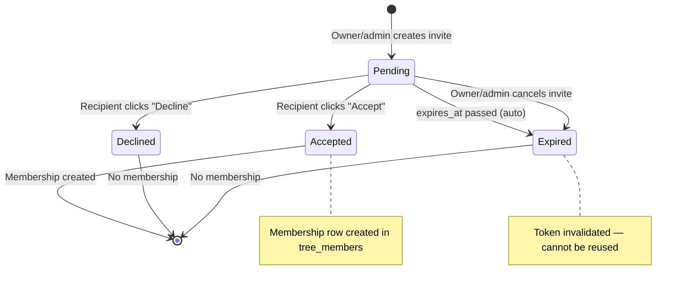
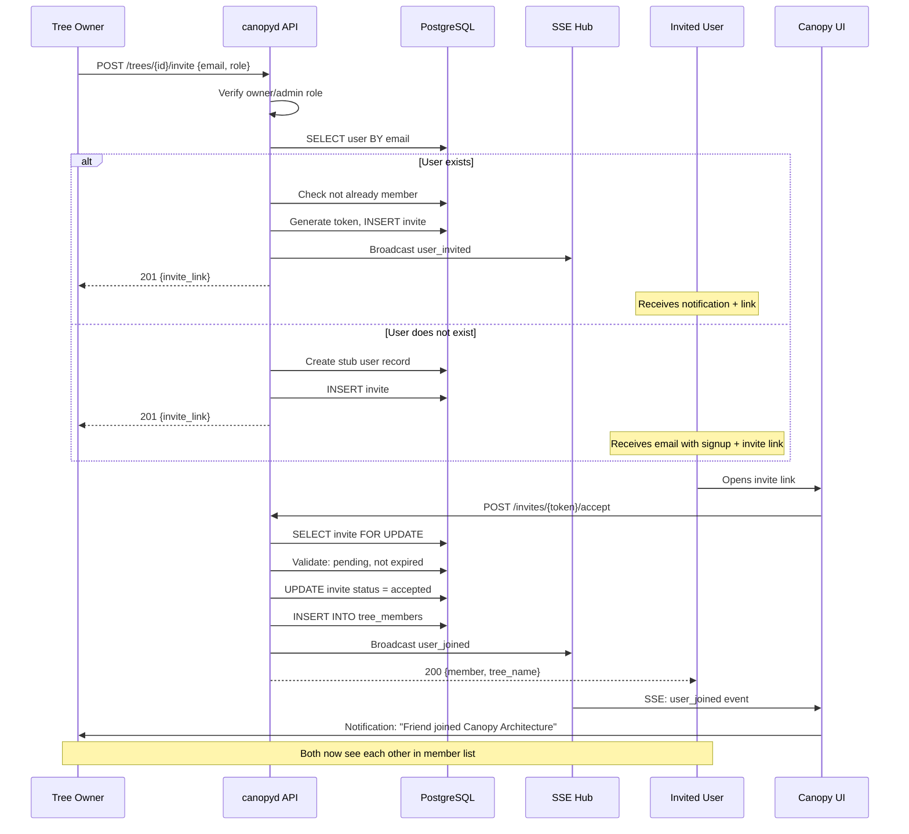
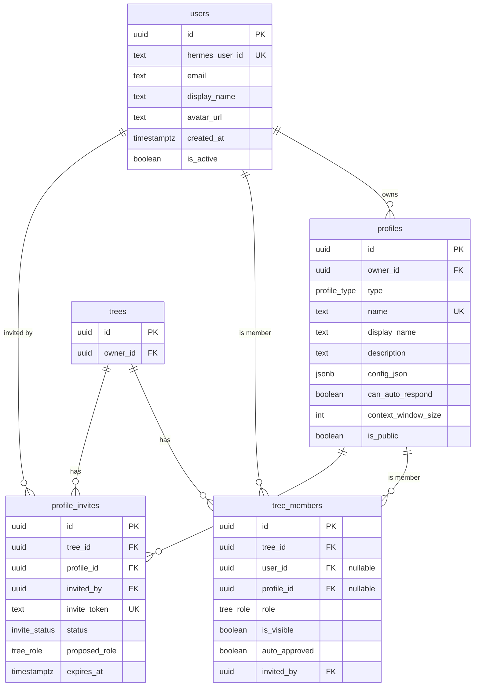

# SPEC-API-06 — Multi-User & Profile Endpoints

> **Status:** Spec | **Blocks:** BE-08 (Profile Routing), BE-11 (HTTP Router), FE-07 (Multi-User Features), INT-02 (Multi-User Integration)
> **References:** SPEC-DM-04 (user/profile DDL), SPEC-DM-01 (trees/nodes), SPEC-DM-03 (approvals — references users/profiles), ARCHITECTURE.md §2.2, SPEC-API-05 (approval endpoints)

---

## 1. Purpose

Define the exact REST endpoints for Canopy's multi-user collaboration surface — inviting humans and Hermes profiles to trees, managing memberships, listing profiles, and controlling per-tree profile visibility. A Go worker reading this spec must produce correct HTTP handlers, membership service, invite token system, and permission middleware with zero clarifying questions. A TypeScript worker reading this spec must produce correct API client functions and Zod validation schemas.

Canopy has two participant types: **humans** (user accounts) and **Hermes profiles** (agent personas like coding-hermes). Both are first-class tree participants with role-based permissions. The invite flow generates a cryptographically random token, the recipient accepts it via link, and membership is created with the proposed role.

---

## 2. Design Decisions

| Decision | Choice | Source |
|----------|--------|--------|
| Participant types | `human` and `hermes-profile` — both first-class members | SPEC-DM-04 §2, ARCHITECTURE.md §1 |
| Auth | Existing Hermes JWT Bearer tokens | ARCHITECTURE.md §5.5 |
| Permissions | RBAC: owner, admin, member, viewer | SPEC-DM-04 §4.3 PermissionMatrix |
| Invite token | Cryptographically random, URL-safe, min 32 chars, 7-day expiry | SPEC-DM-04 §3.5 |
| Profile visibility | Per-tree toggle via `tree_members.is_visible` | SPEC-DM-04 §3.4 |
| Membership | Polymorphic: one of `user_id` or `profile_id` per membership row | SPEC-DM-04 §3.4 CHECK constraint |
| Profile ownership | Each profile is owned by a user. Only the owner can invite their own profiles. | SPEC-DM-04 §3.3 `owner_id` FK |
| Tree membership visibility | `GET /members` returns visible members only (is_visible=true) | This spec §5 |
| Self-service | Users can create their own profiles via the profile endpoints | SPEC-DM-04 §4.2 `CreateProfileParams` |
| Agent participation | Agents LISTEN to all input, only ACT on approved input — regardless of role | ARCHITECTURE.md §8.2 |

---

## 3. Endpoints

### 3.1 Route Summary

| Method | Path | Auth | Description |
|--------|------|------|-------------|
| POST | `/trees/{tree_id}/invite` | Required | Invite a user or profile to a tree |
| GET | `/trees/{tree_id}/invites` | Required | List pending invites for a tree |
| DELETE | `/trees/{tree_id}/invites/{invite_id}` | Required | Cancel a pending invite |
| POST | `/invites/{token}/accept` | Required | Accept an invite via token |
| POST | `/invites/{token}/decline` | Required | Decline an invite via token |
| GET | `/trees/{tree_id}/members` | Required | List tree members |
| PATCH | `/trees/{tree_id}/members/{member_id}` | Required | Update member role or settings |
| DELETE | `/trees/{tree_id}/members/{member_id}` | Required | Remove a member from the tree |
| GET | `/profiles` | Required | List profiles owned by authenticated user |
| POST | `/profiles` | Required | Create a new Hermes profile |
| PATCH | `/profiles/{profile_id}` | Required | Update a profile |
| PATCH | `/trees/{tree_id}/profiles/{profile_id}/visibility` | Required | Toggle profile visibility per tree |

---

## 4. POST /trees/{tree_id}/invite — Invite Participant

### 4.1 Route

```
POST /trees/{tree_id}/invite
```

| Field | Value |
|-------|-------|
| Method | POST |
| Path | `/trees/{tree_id}/invite` |
| tree_id | UUIDv7 — target tree |
| Auth | Required (Bearer token) |
| Content-Type (request) | `application/json; charset=utf-8` |
| Content-Type (response) | `application/json; charset=utf-8` |

### 4.2 Request Body

**Invite a user (by email):**

```json
{
  "participant_type": "user",
  "email": "friend@example.com",
  "proposed_role": "member"
}
```

**Invite a user (by user ID):**

```json
{
  "participant_type": "user",
  "user_id": "0191a8b2-7fff-7000-9000-000000000099",
  "proposed_role": "admin"
}
```

**Invite a Hermes profile:**

```json
{
  "participant_type": "profile",
  "profile_id": "0191a8b2-7fff-7000-9000-000000000099",
  "proposed_role": "member"
}
```

| Field | Type | Required | Description |
|-------|------|----------|-------------|
| `participant_type` | string | **Yes** | `user` or `profile` |
| `email` | string | For users without ID | Email address to invite |
| `user_id` | UUIDv7 | For users with ID | Direct user invite (alternative to email) |
| `profile_id` | UUIDv7 | For profiles | Profile to invite |
| `proposed_role` | string | **Yes** | `admin`, `member`, or `viewer` (cannot propose `owner`) |

**Constraints:**
- For `participant_type=user`: exactly one of `email` or `user_id` must be provided
- For `participant_type=profile`: `profile_id` is required
- `proposed_role` cannot be `owner` — only the tree creator is owner
- Inviting a profile: the inviting user must OWN the profile (or it must be `is_public=true`)

### 4.3 Server-Side Actions (Transaction)

```sql
BEGIN;

-- 1. Verify inviter is tree owner or admin
SELECT role FROM tree_members
WHERE tree_id = $tree_id AND user_id = $auth_user_id;

-- If role is not 'owner' or 'admin': ROLLBACK, return 403

-- 2. If user invite:
--   a. If email: lookup user by email. If not found, create a stub user record (or send email invite)
--   b. If user_id: verify user exists
--   c. Check user is not already a member → 409 ALREADY_MEMBER

-- 3. If profile invite:
--   a. Verify profile exists
--   b. Verify auth_user owns the profile OR profile.is_public=true
--     → if not: 403 NOT_PROFILE_OWNER
--   c. Check profile is not already a member of this tree → 409 ALREADY_MEMBER
--   d. Check no pending invite already exists for this profile in this tree → 409 PENDING_INVITE_EXISTS

-- 4. Generate invite token:
--    token = crypto/rand 32 bytes, base64url encoded
--    expires_at = now() + 7 days

-- 5. Insert invite record
INSERT INTO profile_invites (tree_id, profile_id, invited_by, invite_token, proposed_role, status)
VALUES ($tree_id, $profile_id, $auth_user_id, $token, $proposed_role, 'pending');

-- 6. If user was invited by email and doesn't have an account:
--    Send email with invite link: https://canopy.app/invite/{token}

COMMIT;
```

### 4.4 Response — 201 Created

```json
{
  "id": "0191a8b2-7fff-7000-9000-000000000701",
  "tree_id": "0191a8b2-7fff-7000-9000-000000000001",
  "participant_type": "user",
  "invited_email": "friend@example.com",
  "invited_by": "0191a8b2-7fff-7000-9000-000000000042",
  "invited_by_display_name": "Bane",
  "proposed_role": "member",
  "status": "pending",
  "created_at": "2026-07-20T23:30:00Z",
  "expires_at": "2026-07-27T23:30:00Z",
  "invite_link": "https://canopy.app/invite/dGhpcyBpcyBhIHJhbmRvbSB0b2tlbiBmb3IgaW52aXRpbmc"
}
```

The `invite_link` field is only included in the response (never persisted to DB — the token is hashed before storage or stored as-is since the DB is trusted). For email-based invites, an email is also sent.

### 4.5 SSE Events Emitted

On successful invite creation, the SSE hub broadcasts to `trees/{tree_id}/events`:

```
event: user_invited
data: {"invite_id": "...", "tree_id": "...", "participant_type": "user", "invited_email": "friend@example.com", "proposed_role": "member", "invited_by": "...", "created_at": "..."}
```

### 4.6 Validation & Errors

| Check | Error Code | HTTP Status |
|-------|-----------|-------------|
| `tree_id` invalid UUID | `INVALID_TREE_ID` | 400 |
| Tree not found | `TREE_NOT_FOUND` | 404 |
| Tree is soft-deleted | `TREE_DELETED` | 410 |
| User is not tree owner or admin | `NOT_TREE_OWNER_OR_ADMIN` | 403 |
| `participant_type` not `user` or `profile` | `INVALID_PARTICIPANT_TYPE` | 400 |
| For user: neither `email` nor `user_id` provided | `INVITE_TARGET_REQUIRED` | 400 |
| For user: both `email` and `user_id` provided | `AMBIGUOUS_INVITE_TARGET` | 400 |
| For profile: `profile_id` missing | `PROFILE_ID_REQUIRED` | 400 |
| User already a member | `ALREADY_MEMBER` | 409 |
| Profile already a member | `ALREADY_MEMBER` | 409 |
| Pending invite already exists for this profile in this tree | `PENDING_INVITE_EXISTS` | 409 |
| `proposed_role` is `owner` | `CANNOT_INVITE_AS_OWNER` | 400 |
| `proposed_role` invalid | `INVALID_ROLE` | 400 |
| Inviting profile not owned by user and not public | `NOT_PROFILE_OWNER` | 403 |
| Profile not found | `PROFILE_NOT_FOUND` | 404 |
| User ID not found | `USER_NOT_FOUND` | 404 |
| Email format invalid | `INVALID_EMAIL` | 400 |

---

## 5. GET /trees/{tree_id}/invites — List Pending Invites

### 5.1 Route

```
GET /trees/{tree_id}/invites
```

Requires owner or admin role. Returns all pending invites for the tree.

### 5.2 Response — 200 OK

```json
{
  "invites": [
    {
      "id": "0191a8b2-7fff-7000-9000-000000000701",
      "tree_id": "0191a8b2-7fff-7000-9000-000000000001",
      "participant_type": "user",
      "invited_email": "friend@example.com",
      "invited_by": "0191a8b2-7fff-7000-9000-000000000042",
      "invited_by_display_name": "Bane",
      "proposed_role": "member",
      "status": "pending",
      "created_at": "2026-07-20T23:30:00Z",
      "expires_at": "2026-07-27T23:30:00Z"
    }
  ],
  "total": 1
}
```

---

## 6. POST /invites/{token}/accept — Accept Invite

### 6.1 Route

```
POST /invites/{token}/accept
```

### 6.2 Server-Side Actions (Transaction)

```sql
BEGIN;

-- 1. Lookup invite by token
SELECT * FROM profile_invites WHERE invite_token = $token FOR UPDATE;

-- 2. Validate
--   - Not found → 404
--   - Status is not 'pending' → 409 INVITE_NOT_PENDING
--   - Expired → 410 INVITE_EXPIRED

-- 3. Update invite status
UPDATE profile_invites SET status = 'accepted', accepted_at = clock_timestamp()
WHERE id = $invite_id;

-- 4. Create tree membership
INSERT INTO tree_members (tree_id, user_id, profile_id, role, invited_by, joined_at)
VALUES ($tree_id, $user_id, $profile_id, $proposed_role, $invited_by, clock_timestamp());

-- 5. For profile invites: set is_visible = true by default

COMMIT;
```

### 6.3 Response — 200 OK

```json
{
  "invite_id": "0191a8b2-7fff-7000-9000-000000000701",
  "tree_id": "0191a8b2-7fff-7000-9000-000000000001",
  "tree_name": "Canopy Architecture",
  "member": {
    "id": "0191a8b2-7fff-7000-9000-000000000801",
    "tree_id": "0191a8b2-7fff-7000-9000-000000000001",
    "user_id": "0191a8b2-7fff-7000-9000-000000000099",
    "role": "member",
    "is_visible": true,
    "auto_approved": false,
    "joined_at": "2026-07-20T23:35:00Z",
    "invited_by": "0191a8b2-7fff-7000-9000-000000000042"
  }
}
```

### 6.4 SSE Events Emitted

```
event: user_joined
data: {"member_id": "...", "tree_id": "...", "user_id": "...", "display_name": "...", "role": "member", "joined_at": "..."}
```

---

## 7. POST /invites/{token}/decline — Decline Invite

### 7.1 Route

```
POST /invites/{token}/decline
```

### 7.2 Response — 200 OK

```json
{
  "invite_id": "0191a8b2-7fff-7000-9000-000000000701",
  "status": "declined",
  "declined_at": "2026-07-20T23:35:00Z"
}
```

No membership is created. SSE event not emitted for declines (privacy — the inviter sees the invite disappear from the pending list on next poll).

---

## 8. DELETE /trees/{tree_id}/invites/{invite_id} — Cancel Invite

### 8.1 Route

```
DELETE /trees/{tree_id}/invites/{invite_id}
```

Requires owner or admin role. Sets invite status to `expired`.

### 8.2 Response — 200 OK

```json
{
  "invite_id": "0191a8b2-7fff-7000-9000-000000000701",
  "status": "expired",
  "cancelled_at": "2026-07-20T23:40:00Z"
}
```

---

## 9. GET /trees/{tree_id}/members — List Members

### 9.1 Route

```
GET /trees/{tree_id}/members
```

| Field | Value |
|-------|-------|
| Method | GET |
| Path | `/trees/{tree_id}/members` |
| Auth | Required (must be tree member) |
| Content-Type (response) | `application/json; charset=utf-8` |

### 9.2 Query Parameters

| Parameter | Type | Required | Default | Description |
|-----------|------|----------|---------|-------------|
| `include_hidden` | boolean | No | `false` | If true, includes profiles with `is_visible=false` (owner/admin only) |
| `role` | string | No | — | Filter by role: `owner`, `admin`, `member`, `viewer` |
| `participant_type` | string | No | — | Filter by type: `human`, `profile` |
| `limit` | integer | No | `50` | Max results (1–200) |
| `offset` | integer | No | `0` | Pagination offset |

### 9.3 Response — 200 OK

```json
{
  "members": [
    {
      "id": "0191a8b2-7fff-7000-9000-000000000801",
      "tree_id": "0191a8b2-7fff-7000-9000-000000000001",
      "participant_type": "human",
      "user_id": "0191a8b2-7fff-7000-9000-000000000042",
      "display_name": "Bane",
      "avatar_url": null,
      "role": "owner",
      "is_visible": true,
      "auto_approved": false,
      "joined_at": "2026-07-20T20:00:00Z",
      "last_seen_at": "2026-07-20T23:30:00Z",
      "invited_by": null
    },
    {
      "id": "0191a8b2-7fff-7000-9000-000000000802",
      "tree_id": "0191a8b2-7fff-7000-9000-000000000001",
      "participant_type": "profile",
      "profile_id": "0191a8b2-7fff-7000-9000-000000000099",
      "display_name": "Coding Hermes",
      "profile_name": "coding-hermes",
      "role": "member",
      "is_visible": true,
      "auto_approved": true,
      "joined_at": "2026-07-20T21:00:00Z",
      "last_seen_at": null,
      "invited_by": "0191a8b2-7fff-7000-9000-000000000042"
    }
  ],
  "total": 2,
  "limit": 50,
  "offset": 0
}
```

### 9.4 Response Fields

| Field | Type | Description |
|-------|------|-------------|
| `id` | UUIDv7 | Membership row ID |
| `tree_id` | UUIDv7 | Tree this membership belongs to |
| `participant_type` | string | `human` or `profile` |
| `user_id` | UUIDv7 \| null | User ID (null for profiles) |
| `profile_id` | UUIDv7 \| null | Profile ID (null for humans) |
| `display_name` | string | Human-readable name (from users.display_name or profiles.display_name) |
| `profile_name` | string \| null | Machine-readable profile name (null for humans) |
| `avatar_url` | string \| null | Avatar URL (humans only) |
| `role` | string | RBAC role |
| `is_visible` | boolean | Per-tree profile visibility |
| `auto_approved` | boolean | Whether this member's input is pre-approved |
| `joined_at` | ISO 8601 | When member joined |
| `last_seen_at` | ISO 8601 \| null | Last activity timestamp |
| `invited_by` | UUIDv7 \| null | Who invited (null for tree creator) |

### 9.5 Visibility Rules

- Viewers and members see only `is_visible=true` members (unless `include_hidden=true` and they are owner/admin)
- Owners and admins see all members regardless of visibility
- The `include_hidden` parameter is silently ignored for viewer/member roles (they always get visible-only)

---

## 10. PATCH /trees/{tree_id}/members/{member_id} — Update Member

### 10.1 Route

```
PATCH /trees/{tree_id}/members/{member_id}
```

### 10.2 Request Body (all fields optional)

```json
{
  "role": "admin",
  "auto_approved": true
}
```

| Field | Type | Required | Description |
|-------|------|----------|-------------|
| `role` | string | No | New role — `admin`, `member`, `viewer` |
| `auto_approved` | boolean | No | Whether to pre-approve this member's input |

**Constraints:**
- Cannot change the owner's role
- Cannot set `auto_approved=true` for viewers (they can't create content)
- At least one field must be provided
- Only owners and admins can update members
- Admins cannot demote or promote other admins or the owner

### 10.3 Response — 200 OK

Returns the updated member object (same shape as GET /members response).

### 10.4 SSE Events Emitted

```
event: member_updated
data: {"member_id": "...", "tree_id": "...", "changes": {"role": "admin", "auto_approved": true}}
```

---

## 11. DELETE /trees/{tree_id}/members/{member_id} — Remove Member

### 11.1 Route

```
DELETE /trees/{tree_id}/members/{member_id}
```

### 11.2 Behavior

- Owner cannot be removed
- Only owners and admins can remove members
- Admins cannot remove other admins or the owner
- Removing a member does NOT delete the member's nodes — they remain with `author_id` intact
- Hard-deletes the `tree_members` row (not soft-delete — membership is binary)

### 11.3 Response — 200 OK

```json
{
  "member_id": "0191a8b2-7fff-7000-9000-000000000802",
  "tree_id": "0191a8b2-7fff-7000-9000-000000000001",
  "removed_at": "2026-07-20T23:45:00Z"
}
```

### 11.4 SSE Events Emitted

```
event: user_left
data: {"member_id": "...", "tree_id": "...", "participant_id": "...", "removed_at": "..."}
```

### 11.5 Validation & Errors (Members Management)

| Check | Error Code | HTTP Status |
|-------|-----------|-------------|
| `member_id` invalid UUID | `INVALID_MEMBER_ID` | 400 |
| Member not found | `MEMBER_NOT_FOUND` | 404 |
| User is not tree owner or admin | `NOT_TREE_OWNER_OR_ADMIN` | 403 |
| Cannot remove the owner | `CANNOT_REMOVE_OWNER` | 403 |
| Cannot change owner's role | `CANNOT_CHANGE_OWNER_ROLE` | 403 |
| Admin cannot modify another admin | `ADMIN_SCOPE_LIMITED` | 403 |
| `role` not in enum | `INVALID_ROLE` | 400 |
| No fields provided for update | `NO_FIELDS_PROVIDED` | 400 |
| `auto_approved=true` for viewer | `AUTO_APPROVE_NOT_ALLOWED_FOR_VIEWER` | 400 |
| `proposed_role` is `owner` | `CANNOT_INVITE_AS_OWNER` | 400 |

---

## 12. Profile Management Endpoints

### 12.1 GET /profiles — List My Profiles

```
GET /profiles
```

Returns all profiles owned by the authenticated user. No query parameters needed (profiles are always owned by a single user).

#### Response — 200 OK

```json
{
  "profiles": [
    {
      "id": "0191a8b2-7fff-7000-9000-000000000099",
      "owner_id": "0191a8b2-7fff-7000-9000-000000000042",
      "profile_type": "hermes-profile",
      "name": "coding-hermes",
      "display_name": "Coding Hermes",
      "description": "Autonomous coding agent for the fleet",
      "can_auto_respond": false,
      "context_window_size": 32768,
      "is_public": true,
      "created_at": "2026-07-20T20:00:00Z",
      "updated_at": "2026-07-20T22:00:00Z",
      "tree_count": 3
    }
  ],
  "total": 1
}
```

`tree_count` is a computed field: the number of trees this profile is a member of.

### 12.2 POST /profiles — Create Profile

```
POST /profiles
```

#### Request Body

```json
{
  "name": "research-hermes",
  "display_name": "Research Hermes",
  "description": "Deep research and analysis agent",
  "can_auto_respond": false,
  "context_window_size": 65536,
  "is_public": false,
  "config_json": {
    "provider": "deepseek",
    "model": "deepseek-v4-pro",
    "system_prompt": "You are a deep research analyst...",
    "skills": ["deep-research", "arxiv"],
    "temperature": 0.3
  }
}
```

| Field | Type | Required | Default | Description |
|-------|------|----------|---------|-------------|
| `name` | string | **Yes** | — | Machine-readable name, 1–64 chars, alphanumeric + hyphens |
| `display_name` | string | **Yes** | — | Human-readable name, 1–200 chars |
| `description` | string | No | — | Profile description |
| `can_auto_respond` | boolean | No | `false` | Auto-reply to @mentions without approval |
| `context_window_size` | integer | No | `32768` | Token budget, 1024–2097152 |
| `is_public` | boolean | No | `false` | Discoverable by other users |
| `config_json` | object | No | `{}` | Provider, model, skills, system prompt, temperature |

#### Validation

| Check | Error Code | HTTP Status |
|-------|-----------|-------------|
| `name` empty or >64 chars | `INVALID_PROFILE_NAME` | 400 |
| `name` contains invalid chars (non-alphanumeric, non-hyphen) | `INVALID_PROFILE_NAME` | 400 |
| `name` already exists for this owner | `DUPLICATE_PROFILE_NAME` | 409 |
| `display_name` empty or >200 chars | `INVALID_DISPLAY_NAME` | 400 |
| `context_window_size` < 1024 or > 2097152 | `INVALID_CONTEXT_WINDOW` | 400 |
| Max profiles per user (50) exceeded | `MAX_PROFILES_EXCEEDED` | 400 |

#### Response — 201 Created

Returns the full profile object (same shape as GET /profiles item).

### 12.3 PATCH /profiles/{profile_id} — Update Profile

```
PATCH /profiles/{profile_id}
```

#### Request Body (all fields optional)

```json
{
  "display_name": "Research Hermes v2",
  "can_auto_respond": true,
  "config_json": {
    "model": "deepseek-v4-flash"
  }
}
```

All fields from create are patchable except `name` (immutable after creation). At least one field must be provided. Only the profile owner can update.

If `config_json` is provided, it is **merged** with the existing config (not replaced). This allows partial updates: sending `{"model": "new-model"}` changes only the model field while preserving all other config.

#### Validation

| Check | Error Code | HTTP Status |
|-------|-----------|-------------|
| Profile not found | `PROFILE_NOT_FOUND` | 404 |
| User does not own this profile | `NOT_PROFILE_OWNER` | 403 |
| No fields provided | `NO_FIELDS_PROVIDED` | 400 |

---

## 13. PATCH /trees/{tree_id}/profiles/{profile_id}/visibility — Toggle Profile Visibility

### 13.1 Route

```
PATCH /trees/{tree_id}/profiles/{profile_id}/visibility
```

### 13.2 Purpose

Per-tree profile visibility toggle. A profile can be made invisible in a specific tree — it remains a member (can still read/write) but doesn't appear in the member list for non-owner/admin users. This enables "quiet" agent participation where the agent works in the background without cluttering the member sidebar.

### 13.3 Request Body

```json
{
  "is_visible": false
}
```

| Field | Type | Required | Description |
|-------|------|----------|-------------|
| `is_visible` | boolean | **Yes** | New visibility state |

### 13.4 Behavior

- Only the tree owner or admin can change visibility
- The profile owner can also change visibility of their own profiles
- The owner's own membership cannot be hidden
- Changing visibility does NOT affect the profile's ability to participate — only its appearance in member lists

### 13.5 Response — 200 OK

```json
{
  "member_id": "0191a8b2-7fff-7000-9000-000000000802",
  "tree_id": "0191a8b2-7fff-7000-9000-000000000001",
  "profile_id": "0191a8b2-7fff-7000-9000-000000000099",
  "is_visible": false,
  "updated_at": "2026-07-20T23:50:00Z"
}
```

### 13.6 SSE Events Emitted

```
event: member_updated
data: {"member_id": "...", "tree_id": "...", "profile_id": "...", "is_visible": false}
```

### 13.7 Validation

| Check | Error Code | HTTP Status |
|-------|-----------|-------------|
| `profile_id` not a member of tree | `NOT_TREE_MEMBER` | 404 |
| User not authorized to change visibility | `NOT_TREE_OWNER_OR_ADMIN` | 403 |
| Cannot hide the owner's membership | `CANNOT_HIDE_OWNER` | 403 |
| `is_visible` not a boolean | `INVALID_VISIBILITY` | 400 |

---

## 14. Go Handler Interface

```go
package api

import (
    "context"
    "net/http"
    "github.com/go-chi/chi/v5"
    "github.com/google/uuid"
)

// MemberHandler implements multi-user and profile REST endpoints.
type MemberHandler struct {
    members  MemberService
    profiles ProfileService
    invites  InviteService
}

// MemberService manages tree memberships.
type MemberService interface {
    // List returns visible members for a tree.
    List(ctx context.Context, treeID uuid.UUID, filter MemberFilter) ([]MemberWithDetails, int, error)

    // Update changes a member's role or settings.
    Update(ctx context.Context, memberID uuid.UUID, actorID uuid.UUID, input UpdateMemberInput) (*MemberWithDetails, error)

    // Remove removes a member from a tree.
    Remove(ctx context.Context, memberID uuid.UUID, actorID uuid.UUID) error
}

// ProfileService manages Hermes profiles.
type ProfileService interface {
    // ListByOwner returns all profiles owned by a user.
    ListByOwner(ctx context.Context, ownerID uuid.UUID) ([]ProfileWithTreeCount, error)

    // Create creates a new profile.
    Create(ctx context.Context, input CreateProfileInput) (*Profile, error)

    // Update updates an existing profile.
    Update(ctx context.Context, profileID uuid.UUID, ownerID uuid.UUID, input UpdateProfileInput) (*Profile, error)

    // SetVisibility toggles a profile's per-tree visibility.
    SetVisibility(ctx context.Context, treeID, profileID uuid.UUID, actorID uuid.UUID, isVisible bool) (*VisibilityResult, error)
}

// InviteService manages the invite lifecycle.
type InviteService interface {
    // Create generates an invite token and creates the invite record.
    Create(ctx context.Context, input CreateInviteInput) (*InviteResponse, error)

    // ListPending returns pending invites for a tree.
    ListPending(ctx context.Context, treeID uuid.UUID) ([]InviteResponse, int, error)

    // Cancel cancels a pending invite.
    Cancel(ctx context.Context, inviteID uuid.UUID, actorID uuid.UUID) error

    // Accept accepts an invite by token, creating the membership.
    Accept(ctx context.Context, token string) (*AcceptInviteResult, error)

    // Decline declines an invite by token.
    Decline(ctx context.Context, token string) error
}

// ── Input Types ────────────────────────────────────────

type MemberFilter struct {
    IncludeHidden   bool
    Role            *string   // optional role filter
    ParticipantType *string   // "human" or "profile"
    Limit           int       // default 50
    Offset          int
}

type UpdateMemberInput struct {
    Role         *string `json:"role,omitempty"`          // "admin", "member", "viewer"
    AutoApproved *bool   `json:"auto_approved,omitempty"`
}

type CreateProfileInput struct {
    Name             string          `json:"name"`
    DisplayName      string          `json:"display_name"`
    Description      *string         `json:"description,omitempty"`
    CanAutoRespond   bool            `json:"can_auto_respond"`
    ContextWindowSize int            `json:"context_window_size"`
    IsPublic         bool            `json:"is_public"`
    ConfigJSON       json.RawMessage `json:"config_json,omitempty"`
}

type UpdateProfileInput struct {
    DisplayName      *string          `json:"display_name,omitempty"`
    Description      *string          `json:"description,omitempty"`
    CanAutoRespond   *bool            `json:"can_auto_respond,omitempty"`
    ContextWindowSize *int            `json:"context_window_size,omitempty"`
    IsPublic         *bool            `json:"is_public,omitempty"`
    ConfigJSON       *json.RawMessage `json:"config_json,omitempty"`
}

type CreateInviteInput struct {
    TreeID          uuid.UUID `json:"tree_id"`
    ParticipantType string    `json:"participant_type"`  // "user" or "profile"
    Email           *string   `json:"email,omitempty"`
    UserID          *uuid.UUID `json:"user_id,omitempty"`
    ProfileID       *uuid.UUID `json:"profile_id,omitempty"`
    ProposedRole    string    `json:"proposed_role"`
    InvitedBy       uuid.UUID `json:"invited_by"`
}

// ── Response Types ─────────────────────────────────────

type MemberWithDetails struct {
    ID              uuid.UUID  `json:"id"`
    TreeID          uuid.UUID  `json:"tree_id"`
    ParticipantType string     `json:"participant_type"`
    UserID          *uuid.UUID `json:"user_id,omitempty"`
    ProfileID       *uuid.UUID `json:"profile_id,omitempty"`
    DisplayName     string     `json:"display_name"`
    ProfileName     *string    `json:"profile_name,omitempty"`
    AvatarURL       *string    `json:"avatar_url,omitempty"`
    Role            string     `json:"role"`
    IsVisible       bool       `json:"is_visible"`
    AutoApproved    bool       `json:"auto_approved"`
    JoinedAt        time.Time  `json:"joined_at"`
    LastSeenAt      *time.Time `json:"last_seen_at,omitempty"`
    InvitedBy       *uuid.UUID `json:"invited_by,omitempty"`
}

type ProfileWithTreeCount struct {
    Profile
    TreeCount int `json:"tree_count"`
}

type InviteResponse struct {
    ID                     uuid.UUID  `json:"id"`
    TreeID                 uuid.UUID  `json:"tree_id"`
    ParticipantType        string     `json:"participant_type"`
    InvitedEmail           *string    `json:"invited_email,omitempty"`
    InvitedUserID          *uuid.UUID `json:"invited_user_id,omitempty"`
    InvitedProfileID       *uuid.UUID `json:"invited_profile_id,omitempty"`
    InvitedBy              uuid.UUID  `json:"invited_by"`
    InvitedByDisplayName   string     `json:"invited_by_display_name"`
    ProposedRole           string     `json:"proposed_role"`
    Status                 string     `json:"status"`
    CreatedAt              time.Time  `json:"created_at"`
    ExpiresAt              time.Time  `json:"expires_at"`
    InviteLink             string     `json:"invite_link,omitempty"`
}

type AcceptInviteResult struct {
    InviteID uuid.UUID          `json:"invite_id"`
    TreeID   uuid.UUID          `json:"tree_id"`
    TreeName string             `json:"tree_name"`
    Member   MemberWithDetails  `json:"member"`
}

type VisibilityResult struct {
    MemberID  uuid.UUID `json:"member_id"`
    TreeID    uuid.UUID `json:"tree_id"`
    ProfileID uuid.UUID `json:"profile_id"`
    IsVisible bool      `json:"is_visible"`
    UpdatedAt time.Time `json:"updated_at"`
}

// ── Router ─────────────────────────────────────────────

// RegisterRoutes wires multi-user and profile endpoints into the Chi router.
func (h *MemberHandler) RegisterRoutes(r chi.Router) {
    r.Post("/trees/{tree_id}/invite", h.CreateInvite)
    r.Get("/trees/{tree_id}/invites", h.ListInvites)
    r.Delete("/trees/{tree_id}/invites/{invite_id}", h.CancelInvite)
    r.Post("/invites/{token}/accept", h.AcceptInvite)
    r.Post("/invites/{token}/decline", h.DeclineInvite)
    r.Get("/trees/{tree_id}/members", h.ListMembers)
    r.Patch("/trees/{tree_id}/members/{member_id}", h.UpdateMember)
    r.Delete("/trees/{tree_id}/members/{member_id}", h.RemoveMember)
    r.Get("/profiles", h.ListProfiles)
    r.Post("/profiles", h.CreateProfile)
    r.Patch("/profiles/{profile_id}", h.UpdateProfile)
    r.Patch("/trees/{tree_id}/profiles/{profile_id}/visibility", h.SetVisibility)
}
```

---

## 15. TypeScript Types & Zod Schemas

```typescript
// === Enums ===

type ParticipantType = 'human' | 'profile'
type TreeRole = 'owner' | 'admin' | 'member' | 'viewer'
type InviteStatus = 'pending' | 'accepted' | 'declined' | 'expired'

// === Request Schemas ===

const CreateInviteBody = z.discriminatedUnion('participant_type', [
  z.object({
    participant_type: z.literal('user'),
    email: z.string().email().optional(),
    user_id: z.string().uuid().optional(),
    proposed_role: z.enum(['admin', 'member', 'viewer']),
  }).refine(
    data => (data.email && !data.user_id) || (!data.email && data.user_id),
    { message: 'Exactly one of email or user_id must be provided' }
  ),
  z.object({
    participant_type: z.literal('profile'),
    profile_id: z.string().uuid(),
    proposed_role: z.enum(['admin', 'member', 'viewer']),
  }),
])

const UpdateMemberBody = z.object({
  role: z.enum(['admin', 'member', 'viewer']).optional(),
  auto_approved: z.boolean().optional(),
}).refine(data => Object.keys(data).length > 0, {
  message: 'At least one field must be provided',
})

const CreateProfileBody = z.object({
  name: z.string().min(1).max(64).regex(/^[a-z0-9-]+$/, 'Must be lowercase alphanumeric with hyphens'),
  display_name: z.string().min(1).max(200),
  description: z.string().optional(),
  can_auto_respond: z.boolean().default(false),
  context_window_size: z.number().int().min(1024).max(2097152).default(32768),
  is_public: z.boolean().default(false),
  config_json: z.object({
    provider: z.string().optional(),
    model: z.string().optional(),
    system_prompt: z.string().optional(),
    skills: z.array(z.string()).optional(),
    temperature: z.number().min(0).max(2).optional(),
    max_tokens: z.number().int().positive().optional(),
    extra: z.record(z.string(), z.unknown()).optional(),
  }).default({}),
})

const UpdateProfileBody = z.object({
  display_name: z.string().min(1).max(200).optional(),
  description: z.string().optional(),
  can_auto_respond: z.boolean().optional(),
  context_window_size: z.number().int().min(1024).max(2097152).optional(),
  is_public: z.boolean().optional(),
  config_json: z.object({}).passthrough().optional(),
}).refine(data => Object.keys(data).length > 0, {
  message: 'At least one field must be provided',
})

const SetVisibilityBody = z.object({
  is_visible: z.boolean(),
})

// === Response Types ===

interface MemberWithDetails {
  id: string
  tree_id: string
  participant_type: ParticipantType
  user_id: string | null
  profile_id: string | null
  display_name: string
  profile_name?: string
  avatar_url?: string | null
  role: TreeRole
  is_visible: boolean
  auto_approved: boolean
  joined_at: string
  last_seen_at?: string | null
  invited_by?: string | null
}

interface ProfileWithTreeCount {
  id: string
  owner_id: string
  profile_type: 'hermes-profile'
  name: string
  display_name: string
  description?: string | null
  can_auto_respond: boolean
  context_window_size: number
  is_public: boolean
  created_at: string
  updated_at: string
  tree_count: number
}

interface InviteResponse {
  id: string
  tree_id: string
  participant_type: ParticipantType
  invited_email?: string
  invited_user_id?: string
  invited_profile_id?: string
  invited_by: string
  invited_by_display_name: string
  proposed_role: TreeRole
  status: InviteStatus
  created_at: string
  expires_at: string
  invite_link?: string
}

// === API Client Interface ===

interface MemberClient {
  // Invites
  createInvite(treeId: string, body: CreateInviteBody): Promise<InviteResponse>
  listInvites(treeId: string): Promise<{ invites: InviteResponse[]; total: number }>
  cancelInvite(treeId: string, inviteId: string): Promise<{ invite_id: string; status: 'expired'; cancelled_at: string }>
  acceptInvite(token: string): Promise<AcceptInviteResult>
  declineInvite(token: string): Promise<{ invite_id: string; status: 'declined'; declined_at: string }>

  // Members
  listMembers(treeId: string, params?: {
    include_hidden?: boolean
    role?: TreeRole
    participant_type?: ParticipantType
    limit?: number
    offset?: number
  }): Promise<{ members: MemberWithDetails[]; total: number; limit: number; offset: number }>

  updateMember(treeId: string, memberId: string, body: UpdateMemberBody): Promise<MemberWithDetails>
  removeMember(treeId: string, memberId: string): Promise<{ member_id: string; tree_id: string; removed_at: string }>

  // Profiles
  listProfiles(): Promise<{ profiles: ProfileWithTreeCount[]; total: number }>
  createProfile(body: CreateProfileBody): Promise<ProfileWithTreeCount>
  updateProfile(profileId: string, body: UpdateProfileBody): Promise<ProfileWithTreeCount>

  // Visibility
  setVisibility(treeId: string, profileId: string, body: SetVisibilityBody): Promise<{
    member_id: string; tree_id: string; profile_id: string; is_visible: boolean; updated_at: string
  }>
}
```

---

## 16. Middleware & Permissions

### 16.1 Required Middleware

For member/profile endpoints, the middleware chain is:

1. **Auth** — validates JWT Bearer token, extracts `user_id` into context
2. **TreeMember** — verifies user is a member of the tree (for `/trees/{tree_id}/*` routes)
3. **RequireRole(minRole)** — for owner/admin-only operations:
   - Create invite: `owner` or `admin`
   - Cancel invite: `owner` or `admin`
   - Update member: `owner` or `admin`
   - Remove member: `owner` or `admin`
   - Set visibility: `owner` or `admin`
4. **RateLimiter** — 30 requests/minute for invite endpoints (prevents spam)

### 16.2 Permission Matrix (Repeated from SPEC-DM-04)

```
Action                    | owner | admin | member | viewer
--------------------------|-------|-------|--------|--------
tree.invite               |  ✓    |  ✓    |  —     |  —
tree.cancel_invite        |  ✓    |  ✓    |  —     |  —
tree.list_members         |  ✓    |  ✓    |  ✓     |  ✓
tree.update_member        |  ✓    |  ✓    |  —     |  —
tree.remove_member        |  ✓    |  ✓    |  —     |  —
profile.create            |  ✓    |  ✓    |  ✓     |  ✓  (self-service)
profile.update            |  ✓    |  ✓    |  ✓     |  ✓  (own profiles only)
profile.set_visibility    |  ✓    |  ✓    |  —     |  —
```

---

## 17. Invite Token Lifecycle



---

## 18. Mermaid Sequence Diagram — Invite & Join Flow



---

## 19. Edge Cases

### 19.1 Invite Edge Cases

| Scenario | Behavior |
|----------|----------|
| Invite a user who is already a member | 409 `ALREADY_MEMBER` |
| Invite a user who already has a pending invite | 409 `PENDING_INVITE_EXISTS` |
| Invite email that doesn't match any user | Create stub user + send email; user claims account on first login |
| Invite with invalid email format | 400 `INVALID_EMAIL` |
| Invite a profile the user doesn't own (and not public) | 403 `NOT_PROFILE_OWNER` |
| Invite a public profile owned by another user | OK — public profiles are inviteable by anyone |
| Invite with `proposed_role=owner` | 400 `CANNOT_INVITE_AS_OWNER` |
| Two owners attempt to invite the same person concurrently | First wins; second gets 409 (unique constraint on active invites) |
| Cancel an already-accepted invite | 409 `INVITE_NOT_PENDING` |
| Accept an expired invite | 410 `INVITE_EXPIRED` |
| Accept an already-accepted invite | 409 `INVITE_NOT_PENDING` |
| Non-member tries to list members | 403 `NOT_TREE_MEMBER` |

### 19.2 Member Management Edge Cases

| Scenario | Behavior |
|----------|----------|
| Remove the tree owner | 403 `CANNOT_REMOVE_OWNER` |
| Admin tries to remove another admin | 403 `ADMIN_SCOPE_LIMITED` |
| Admin tries to change owner's role | 403 `CANNOT_CHANGE_OWNER_ROLE` |
| Member removes themselves | OK (leaving a tree is always allowed) |
| Set `auto_approved=true` for viewer | 400 `AUTO_APPROVE_NOT_ALLOWED_FOR_VIEWER` |
| Hide the owner's profile | 403 `CANNOT_HIDE_OWNER` |
| Viewer queries `include_hidden=true` | Silently ignored — returns visible-only |
| Remove member with authored nodes | Member removed; nodes remain with `author_id` intact |

### 19.3 Profile Edge Cases

| Scenario | Behavior |
|----------|----------|
| Create profile with duplicate name | 409 `DUPLICATE_PROFILE_NAME` |
| Max profiles (50) exceeded | 400 `MAX_PROFILES_EXCEEDED` |
| Update profile you don't own | 403 `NOT_PROFILE_OWNER` |
| Change profile name (immutable field) | 400 `PROFILE_NAME_IMMUTABLE` |
| Delete profile that's a member of trees | Profile soft-deleted; memberships remain but profile shows as "deleted" |
| `config_json` merge: partial update | Only provided keys changed; unmentioned keys preserved |
| `config_json` merge: setting a key to null | Removes that key from config |

### 19.4 Concurrency

- **Invite token generation:** Uses `crypto/rand` — cryptographic randomness prevents prediction
- **Accept race:** Two users with the same invite link → `SELECT FOR UPDATE` serializes; second gets 409
- **Remove + re-invite race:** Removing a member (hard-delete) and re-inviting simultaneously → invite is created after removal; no conflict
- **Profile name uniqueness:** `uq_profiles_owner_name` UNIQUE constraint enforces at DB level

---

## 20. Wiring

### 20.1 CLI

No additional CLI flags beyond `canopyd serve`:

```bash
canopyd serve --port 8080 --db postgres://...
```

### 20.2 HTTP Routes

```go
// In cmd/canopyd/main.go:

func NewRouter(
    memberHandler *api.MemberHandler,
    approvalHandler *api.ApprovalHandler,
    // ... other handlers
) chi.Router {
    r := chi.NewRouter()

    r.Use(middleware.Auth)

    // Member routes (some require tree membership, some don't)
    r.Route("/trees/{tree_id}", func(r chi.Router) {
        r.Use(middleware.TreeMember) // must be tree member

        r.Route("/members", func(r chi.Router) {
            r.Get("/", memberHandler.ListMembers)             // all members
            r.Patch("/{member_id}", memberHandler.UpdateMember) // owner/admin
            r.Delete("/{member_id}", memberHandler.RemoveMember) // owner/admin/self
        })

        r.Route("/invites", func(r chi.Router) {
            r.Use(middleware.RequireRole("admin"))
            r.Post("/", memberHandler.CreateInvite)
            r.Get("/", memberHandler.ListInvites)
            r.Delete("/{invite_id}", memberHandler.CancelInvite)
        })

        r.Patch("/profiles/{profile_id}/visibility", memberHandler.SetVisibility)
    })

    // Invite accept/decline (no tree membership required — recipient isn't a member yet)
    r.Post("/invites/{token}/accept", memberHandler.AcceptInvite)
    r.Post("/invites/{token}/decline", memberHandler.DeclineInvite)

    // Profile routes (user-level, not tree-level)
    r.Get("/profiles", memberHandler.ListProfiles)
    r.Post("/profiles", memberHandler.CreateProfile)
    r.Patch("/profiles/{profile_id}", memberHandler.UpdateProfile)

    return r
}
```

### 20.3 Config (env vars)

| Env Var | Type | Default | Description |
|---------|------|---------|-------------|
| `CANOPY_INVITE_EXPIRY_DAYS` | int | `7` | Days until invites auto-expire |
| `CANOPY_MAX_PROFILES_PER_USER` | int | `50` | Maximum profiles per user |
| `CANOPY_INVITE_TOKEN_BYTES` | int | `32` | Bytes of randomness for invite tokens |
| `CANOPY_INVITE_BASE_URL` | string | `https://canopy.app` | Base URL for invite links |

### 20.4 Dependency Injection

```go
func main() {
    // ... DB pool setup ...

    memberRepo := tree.NewPostgresMemberRepo(dbPool)
    profileRepo := tree.NewPostgresProfileRepo(dbPool)
    userRepo := tree.NewPostgresUserRepo(dbPool)
    inviteRepo := tree.NewPostgresInviteRepo(dbPool)

    memberSvc := tree.NewMemberService(memberRepo, userRepo, profileRepo)
    profileSvc := tree.NewProfileService(profileRepo, memberRepo)
    inviteSvc := tree.NewInviteService(inviteRepo, memberRepo, userRepo, profileRepo)

    memberHandler := api.NewMemberHandler(memberSvc, profileSvc, inviteSvc, sseHub)
}
```

---

## 21. Middle-Out Wiring Verification

| Question | Answer |
|----------|--------|
| How does a user invoke this? | Browser clicks "Invite" in member panel → HTTP POST |
| How does an API client reach this? | REST endpoints under `/trees/{id}/invite`, `/trees/{id}/members`, `/profiles` |
| How does main.go wire this in? | `memberHandler.RegisterRoutes(r)` — 13 routes on Chi router |
| What config does it need? | 4 env vars (expiry days, max profiles, token bytes, base URL) |
| What breaks if this isn't wired? | No multi-user collaboration — tree is single-user forever |
| What SSE events does it emit? | `user_invited`, `user_joined`, `user_left`, `member_updated` |
| What does it depend on? | SPEC-DM-04 (users/profiles/members/invites DDL), SPEC-DM-01 (trees), SPEC-DM-03 (approvals) |

---

## 22. Error Catalog

| Error Code | HTTP Status | Message Template | Trigger |
|-----------|-------------|-----------------|---------|
| `INVALID_TREE_ID` | 400 | `"tree_id must be a valid UUIDv7"` | Invalid UUID format |
| `TREE_NOT_FOUND` | 404 | `"tree not found"` | Tree doesn't exist |
| `TREE_DELETED` | 410 | `"tree has been deleted"` | Tree soft-deleted |
| `NOT_TREE_MEMBER` | 403 | `"user is not a member of this tree"` | User not in tree_members |
| `NOT_TREE_OWNER_OR_ADMIN` | 403 | `"only owners and admins can perform this action"` | Role < admin |
| `INVALID_PARTICIPANT_TYPE` | 400 | `"participant_type must be 'user' or 'profile'"` | Invalid enum |
| `INVITE_TARGET_REQUIRED` | 400 | `"either email or user_id must be provided for user invites"` | Neither provided |
| `AMBIGUOUS_INVITE_TARGET` | 400 | `"provide either email or user_id, not both"` | Both provided |
| `PROFILE_ID_REQUIRED` | 400 | `"profile_id is required for profile invites"` | Missing for profile type |
| `ALREADY_MEMBER` | 409 | `"participant is already a member of this tree"` | Duplicate membership |
| `PENDING_INVITE_EXISTS` | 409 | `"a pending invite already exists for this participant in this tree"` | Duplicate active invite |
| `CANNOT_INVITE_AS_OWNER` | 400 | `"cannot invite a participant as owner"` | proposed_role=owner |
| `INVALID_ROLE` | 400 | `"role must be one of: admin, member, viewer"` | Invalid role |
| `INVALID_EMAIL` | 400 | `"email format is invalid"` | Bad email |
| `USER_NOT_FOUND` | 404 | `"user not found"` | User ID doesn't exist |
| `PROFILE_NOT_FOUND` | 404 | `"profile not found"` | Profile ID doesn't exist |
| `NOT_PROFILE_OWNER` | 403 | `"you do not own this profile"` | auth_user != profile.owner_id |
| `INVALID_MEMBER_ID` | 400 | `"member_id must be a valid UUIDv7"` | Invalid UUID |
| `MEMBER_NOT_FOUND` | 404 | `"tree member not found"` | No membership row |
| `CANNOT_REMOVE_OWNER` | 403 | `"cannot remove the tree owner"` | Target is owner |
| `CANNOT_CHANGE_OWNER_ROLE` | 403 | `"cannot change the owner's role"` | Target is owner |
| `ADMIN_SCOPE_LIMITED` | 403 | `"admins cannot modify other admins or the owner"` | Admin targeting admin/owner |
| `NO_FIELDS_PROVIDED` | 400 | `"at least one field must be provided for update"` | Empty PATCH body |
| `AUTO_APPROVE_NOT_ALLOWED_FOR_VIEWER` | 400 | `"auto_approve cannot be enabled for viewers"` | Viewer + auto_approved |
| `INVALID_PROFILE_NAME` | 400 | `"profile name must be 1-64 lowercase alphanumeric characters with hyphens"` | Invalid name format |
| `DUPLICATE_PROFILE_NAME` | 409 | `"a profile with this name already exists"` | Name collision per owner |
| `INVALID_DISPLAY_NAME` | 400 | `"display_name must be 1-200 characters"` | Empty or too long |
| `INVALID_CONTEXT_WINDOW` | 400 | `"context_window_size must be between 1024 and 2097152"` | Out of range |
| `MAX_PROFILES_EXCEEDED` | 400 | `"maximum of {max} profiles per user reached"` | Limit hit |
| `PROFILE_NAME_IMMUTABLE` | 400 | `"profile name cannot be changed after creation"` | Name in PATCH body |
| `CANNOT_HIDE_OWNER` | 403 | `"cannot hide the tree owner's profile"` | Visibility on owner |
| `INVALID_VISIBILITY` | 400 | `"is_visible must be a boolean"` | Not boolean |
| `INVITE_NOT_FOUND` | 404 | `"invite not found"` | Bad invite ID |
| `INVITE_NOT_PENDING` | 409 | `"invite is not in pending status"` | Already actioned |
| `INVITE_EXPIRED` | 410 | `"invite has expired"` | Past expires_at |
| `INVITE_TOKEN_REQUIRED` | 400 | `"invite token is required"` | Missing token |

---

## 23. Test Scenarios

### 23.1 Unit Tests (Go Backend — 40 scenarios)

**Invite:**
1. Owner creates user invite by email → 201, token generated
2. Owner creates user invite by user ID → 201
3. Owner creates profile invite → 201
4. Non-admin tries to invite → 403 `NOT_TREE_OWNER_OR_ADMIN`
5. Invite with both email and user_id → 400 `AMBIGUOUS_INVITE_TARGET`
6. Invite with neither email nor user_id for user type → 400 `INVITE_TARGET_REQUIRED`
7. Invite profile without profile_id → 400 `PROFILE_ID_REQUIRED`
8. Invite already-member user → 409 `ALREADY_MEMBER`
9. Invite with existing pending invite → 409 `PENDING_INVITE_EXISTS`
10. Invite with proposed_role=owner → 400 `CANNOT_INVITE_AS_OWNER`

**Accept/Decline:**
11. Accept valid token → membership created, invite status updated
12. Accept expired token → 410 `INVITE_EXPIRED`
13. Accept already-accepted token → 409 `INVITE_NOT_PENDING`
14. Accept invalid token → 404 (token not found)
15. Decline valid token → status=declined, no membership created
16. Cancel pending invite → status=expired

**Members:**
17. List members returns visible members for viewer
18. List members with `include_hidden=true` as owner returns all
19. List members with `include_hidden=true` as member → hidden ignored
20. List members filtered by role → only matching roles
21. Update member role as owner → success
22. Update member auto_approved as admin → success
23. Admin tries to change owner role → 403 `CANNOT_CHANGE_OWNER_ROLE`
24. Admin tries to remove another admin → 403 `ADMIN_SCOPE_LIMITED`
25. Remove yourself (self-leave) → success
26. Remove member as owner → success, SSE user_left emitted

**Profiles:**
27. List profiles returns only owned profiles
28. Create profile with valid input → 201
29. Create profile with duplicate name → 409
30. Create profile exceeding max (50) → 400
31. Update profile display_name → merged with existing config
32. Update profile config_json (partial merge) → only model changed
33. Non-owner tries to update profile → 403
34. Profile name immutable → 400 on attempt to change

**Visibility:**
35. Owner sets profile visibility to false → success
36. Non-admin tries to change visibility → 403
37. Cannot hide owner's own membership → 403
38. Visibility change emits SSE member_updated

**Edge Cases:**
39. Viewer queries `include_hidden=true` → ignored, returns visible-only
40. Remove member with authored nodes → nodes remain, author_id intact

### 23.2 Integration Tests (HTTP — 15 scenarios)

41. Full invite flow: owner invites → recipient accepts → both see each other in member list
42. Full decline flow: owner invites → recipient declines → invite disappears from pending list
43. Email invite to unknown user → stub user created → email sent (mock)
44. Concurrent invite accept → second gets 409
45. SSE: invite created → subscriber receives `user_invited`
46. SSE: member joined → subscriber receives `user_joined`
47. SSE: member removed → subscriber receives `user_left`
48. SSE: visibility changed → subscriber receives `member_updated`
49. Owner removes member → member can no longer access tree endpoints (403)
50. Admin promotes member → member can now invite others
51. Profile create → list → update → verify config merge
52. Profile visibility: hide → list members as viewer → hidden profile not shown
53. Profile visibility: hide → list members as owner with include_hidden → shown
54. Self-leave: member removes themselves → no longer in member list
55. Non-tree-member tries to list members → 403 `NOT_TREE_MEMBER`

### 23.3 Frontend Tests (TypeScript — 10 scenarios)

56. Invite form: enter email → submit → success toast → invite appears in pending list
57. Invite form: invalid email → validation error shown
58. Accept invite: visit link → accept button → redirected to tree
59. Member list: renders with role badges and avatars
60. Member list: owner sees "Remove" and "Change Role" buttons
61. Member list: viewer sees read-only list (no action buttons)
62. Profile editor: update display name → save → list refreshes
63. Profile visibility toggle: switch off → profile disappears from sidebar for viewers
64. SSE: new member joins → member appears in list without full page refresh
65. Self-leave: click "Leave Tree" → confirmation dialog → member removed → redirect

---

## 24. Mermaid Diagram — User & Profile Data Flow


