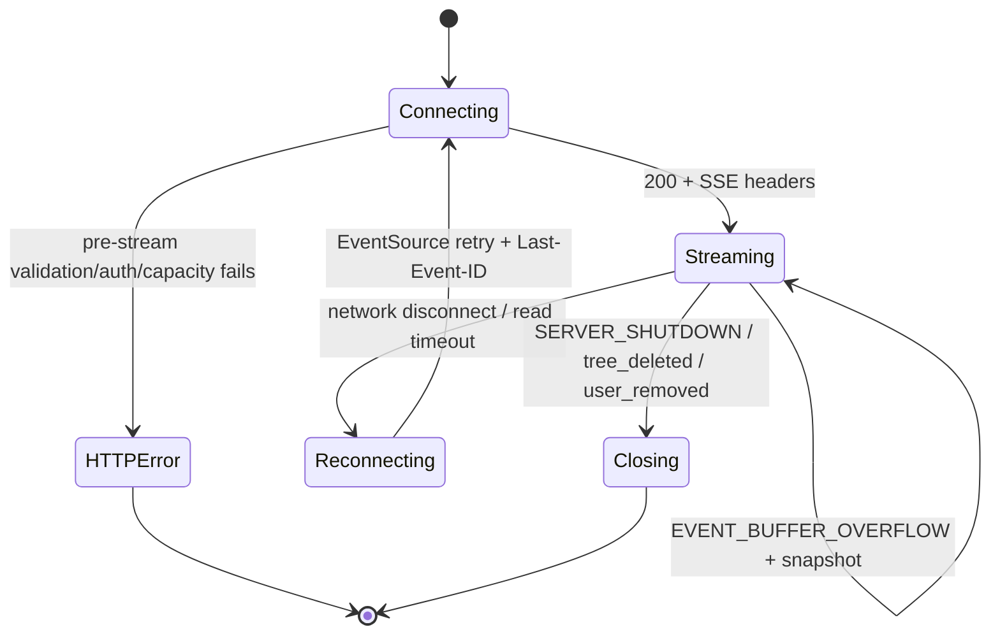

# SPEC-API-07 — Canopy API Error Catalog

> **Status:** Spec | **Blocks:** BE-03 through BE-12, FE API clients, integration tests
> **References:** SPEC-API-01, SPEC-API-02, SPEC-API-03, SPEC-API-04, SPEC-API-05, SPEC-API-06, SPEC-DM-01, SPEC-DM-03, SPEC-DM-04, ARCHITECTURE.md §5

---

## 1. Purpose

This document is the single source of truth for every Canopy API error response. A handler, service, middleware component, and TypeScript client MUST use this document rather than defining endpoint-local error envelopes, codes, HTTP statuses, or messages.

It consolidates the 34 HTTP endpoints defined by SPEC-API-01 through SPEC-API-06:

- SSE: 1 endpoint.
- Tree lifecycle: 4 endpoints.
- Node lifecycle: 5 endpoints.
- Merge and navigation: 4 endpoints.
- Approval and audit operations: 9 endpoints.
- Invitations, membership, profiles, and visibility: 11 endpoints.

A normal HTTP error has exactly one HTTP status, one stable upper-snake-case `code`, one fixed public `error` message, and an optional safe `details` object. An SSE error is either an HTTP error sent before stream headers are written or an explicitly documented in-stream system event.

### 1.1 Precedence and source reconciliation

The source endpoint specs contain two historical inconsistencies. This catalog resolves them without silently dropping any listed code:

| Source inconsistency | Canonical behavior |
|---|---|
| SPEC-API-01 parameter prose uses `code: INVALID_PARAMETER` while naming `INVALID_SINCE_HASH` or `INVALID_PROFILE_ID` in the `error` field. | New implementations emit `INVALID_SINCE_HASH` or `INVALID_PROFILE_ID`; `INVALID_PARAMETER` is retained below as a legacy compatibility code only. |
| SPEC-API-01 §8.2 names `TOO_MANY_CONNECTIONS`, while §10 splits it into user and tree limits. | New implementations emit `TOO_MANY_CONNECTIONS_USER` or `TOO_MANY_CONNECTIONS_TREE`; `TOO_MANY_CONNECTIONS` is retained for compatibility with an already-deployed generic limiter. |
| Earlier tree reads describe `TREE_DELETED` as 404, while node, merge, approval, and multi-user writes define it as 410. | A soft-deleted resource response is 410 when the caller has reached the resource-specific operation; GET tree visibility rules may intentionally return 404 to non-owners. The canonical generic `TREE_DELETED` code is 410. `TREE_ALREADY_DELETED` remains the 404 delete-idempotency outcome specified by SPEC-API-02. |

No handler may invent a code not listed in this document. If a service returns an unknown error, the recovery/classification layer returns `INTERNAL_ERROR` and logs the original cause with its request ID.

---

## 2. Design Decisions

1. **Stable machine contract.** `code` is part of the public API and is the client branching key. The English `error` text is fixed for observability and accessibility but clients MUST NOT branch on it.
2. **One response shape.** All ordinary non-2xx HTTP responses use the envelope in §3. This includes middleware failures. A 204 response has no body; an SSE `event: error` uses the SSE shape in §8 instead.
3. **No internal leakage.** `details` contains only request-safe validation facts and opaque resource IDs. It never contains a JWT, authorization decision internals, SQL text, stack trace, connection string, raw request body, or another user's email unless that email was supplied by the requester.
4. **Specific beats generic.** Return the most specific validation code before generic JSON, authorization, or internal errors. For example, malformed `parent_id` is `INVALID_PARENT_ID`, not `INVALID_PARAMETER`.
5. **Authentication before authorization.** Missing, malformed, and expired credentials are always 401. A valid identity without sufficient permission is 403. Protected-resource existence checks must not bypass authentication.
6. **Validation before mutation.** Decode, media type, body-size, path/query/body validation, authorization, rate limiting, and mutation execution occur in that order except where a router must resolve a node's tree to perform membership authorization.
7. **Retry semantics are explicit.** 429 includes `Retry-After` plus `details.retry_after_seconds`; 503 may include the same fields. 409 and 410 are not automatically retryable. 500 never exposes a retry guarantee.
8. **Request correlation.** Every error response has `X-Request-ID`. The ID is transport metadata and is not included in the JSON body so the body schema remains stable.
9. **SSE gate.** All authentication, authorization, query validation, capacity, and `http.Flusher` checks run before `200 text/event-stream` is written. After headers, only documented `error` or `done` SSE events may communicate failure.
10. **Source coverage.** The catalog tables include codes from endpoint error sections, validation tables, parameter validation prose, edge cases, and limits in SPEC-API-01 through SPEC-API-06.

---

## 3. Error Envelope

### 3.1 HTTP JSON body

All ordinary errors are `application/json; charset=utf-8` and have this exact shape:

```json
{
  "error": "Human-readable fixed message",
  "code": "MACHINE_READABLE_CODE",
  "details": {}
}
```

`details` MAY be omitted when empty. The Go writer omits it rather than serializing `null`. When present, it is a JSON object. The fields listed in the status catalog are the complete permitted stable fields for that code; callers must tolerate future additive fields.

Example:

```http
HTTP/1.1 400 Bad Request
Content-Type: application/json; charset=utf-8
X-Request-ID: 0191a8b2-7fff-7000-9000-000000000001

{"error":"Tree title exceeds 200 characters","code":"TITLE_TOO_LONG","details":{"field":"title","max":200,"actual":201}}
```

### 3.2 Required headers

| Status/category | Required headers |
|---|---|
| Every JSON error | `Content-Type: application/json; charset=utf-8`, `X-Request-ID: <request-id>`, `Cache-Control: no-store` |
| 401 | `WWW-Authenticate: Bearer realm="canopy"` |
| 413 | `Connection: close` when the request body cannot be safely drained |
| 429 | `Retry-After: <whole seconds>` |
| 503 | `Retry-After: <whole seconds>` only when the server knows a retry interval |
| SSE pre-stream error | JSON headers above; do not set `Content-Type: text/event-stream` |

### 3.3 Details conventions

| Detail key | Type | Use |
|---|---|---|
| `field` | string | Invalid request field or query parameter name |
| `value` / `received` | string, number, or boolean | Invalid non-secret received value |
| `allowed` | array | Allowed enum values |
| `min`, `max`, `actual`, `max_bytes` | integer | Bounds failures |
| `tree_id`, `node_id`, `parent_id`, `approval_id`, `rule_id`, `member_id`, `profile_id`, `invite_id` | UUID string | Safe resource correlation |
| `deleted_at`, `expired_at` | ISO 8601 UTC string | Terminal-state timestamp |
| `current_status` | string | Approval/invite terminal state |
| `retry_after_seconds`, `limit`, `current`, `current_connections`, `max_connections` | integer | Rate/capacity feedback |

Details MUST NOT echo credentials, invite tokens, malformed request bodies, HTML content, metadata content, or database errors.

---

## 4. Catalog by Status

The message in this section is the exact value for the response `error` field. Every code in this section is also assigned to one or more endpoints in §5.

### 4.1 400 Bad Request — malformed input and invalid parameters

| Code | Exact message | Condition | Details |
|---|---|---|---|
| `INVALID_PARAMETER` | Invalid parameter | Legacy generic SSE validation code; do not emit for new routes | `field`, `value` |
| `INVALID_JSON` | Malformed JSON in request body | JSON decode fails | `field` optional |
| `INVALID_CURSOR` | Invalid cursor UUID | Tree cursor is not a UUID | `field:"cursor"`, `value` |
| `INVALID_LIMIT` | Invalid limit | Limit is non-integer or outside endpoint bounds when not clamped | `field:"limit"`, `min`, `max`, `received` |
| `INVALID_OFFSET` | Invalid offset | Offset is negative | `field:"offset"`, `received` |
| `INVALID_SORT` | Invalid sort order | `sort` is not a tree sort enum | `field:"sort"`, `allowed`, `received` |
| `INVALID_STATUS` | Invalid status filter | Tree status is not active/deleted/all | `field:"status"`, `allowed`, `received` |
| `INVALID_ROLE` | Invalid role | Role is not valid for the operation | `field:"role"`, `allowed`, `received` |
| `INVALID_SEARCH` | Invalid search query | Search is not valid UTF-8 | `field:"search"` |
| `SEARCH_TOO_SHORT` | Search query must be at least 3 characters | Search has fewer than 3 characters | `field:"search"`, `min:3`, `actual` |
| `INVALID_TREE_ID` | Invalid tree ID | Tree path/query ID is not UUIDv7 | `field:"tree_id"`, `value` |
| `TREE_ID_REQUIRED` | Tree ID is required | Required approval filter tree ID is absent | `field:"tree_id"` |
| `TITLE_REQUIRED` | Tree title is required | Title is empty after trim | `field:"title"` |
| `TITLE_TOO_LONG` | Tree title exceeds 200 characters | Title exceeds 200 chars | `field:"title"`, `max:200`, `actual` |
| `DESCRIPTION_TOO_LONG` | Description exceeds 2000 characters | Description exceeds 2000 chars | `field:"description"`, `max:2000`, `actual` |
| `ROOT_CONTENT_REQUIRED` | Root message content is required | Root content is empty | `field:"root_message.content"` |
| `ROOT_CONTENT_TOO_LARGE` | Root message content exceeds 100000 characters | Root content exceeds 100000 chars | `field:"root_message.content"`, `max:100000`, `actual` |
| `INVALID_CONTENT_FORMAT` | Invalid content format | Format is not allowed for the endpoint | `field:"content_format"`, `allowed`, `received` |
| `INVALID_NODE_TYPE` | Invalid node type | Node type is not allowed for the endpoint | `field:"node_type"`, `allowed`, `received` |
| `INVALID_PARENT_ID` | Invalid parent ID | Node parent ID is not UUIDv7 | `field:"parent_id"`, `value` |
| `CONTENT_TOO_LONG` | Content exceeds 65536 characters | Node or merge content exceeds limit | `field:"content"`, `max:65536`, `actual` |
| `SYNTHESIS_VIA_MERGE_ONLY` | Synthesis nodes must be created through the merge endpoint | Ordinary node create requests `synthesis` | `field:"node_type"` |
| `INVALID_EDGE_TYPE` | Invalid edge type | Edge type is not reply/fork | `field:"edge_type"`, `allowed`, `received` |
| `METADATA_TOO_LARGE` | Metadata exceeds 16384 bytes | Serialized metadata exceeds 16 KiB | `field:"metadata"`, `max_bytes:16384`, `actual` |
| `NO_UPDATE_FIELDS` | At least one update field is required | Node/member/profile PATCH body changes nothing | `fields` optional |
| `NO_FIELDS_PROVIDED` | At least one field must be provided for update | Approval-rule or profile PATCH body changes nothing | `fields` optional |
| `INVALID_NODE_ID` | Invalid node ID | Node path ID is not UUIDv7 | `field:"node_id"`, `value` |
| `FORK_REQUIRES_CHILDREN` | Fork target must already have a child | Fork target has no children | `node_id` |
| `INVALID_UTF8` | Content must be valid UTF-8 | Content fails UTF-8 validation | `field:"content"` |
| `INVALID_SOURCE_NODE_IDS` | Source node IDs must be an array | Merge `source_node_ids` is not an array | `field:"source_node_ids"` |
| `MIN_SOURCE_NODES` | At least 2 source nodes are required | Merge has fewer than two sources | `min:2`, `actual` |
| `MAX_SOURCE_NODES` | At most 100 source nodes are allowed | Merge has more than 100 sources | `max:100`, `actual` |
| `DUPLICATE_SOURCE_NODES` | Source node IDs must be unique | Merge source list contains duplicates | `duplicates` |
| `INVALID_SOURCE_NODE_ID` | Invalid source node ID | One merge source is not UUIDv7 | `field:"source_node_ids"`, `index`, `value` |
| `TREE_MISMATCH` | Nodes must belong to the same tree | Merge sources/target span trees | `expected_tree`, `offending_node` |
| `INVALID_TARGET_PARENT_ID` | Invalid target parent ID | Merge target parent is not UUIDv7 | `field:"target_parent_id"`, `value` |
| `SOURCE_TARGET_OVERLAP` | Source node cannot also be the target parent | Merge target is in sources | `node_id` |
| `INVALID_FROM_ID` | Invalid from node ID | Path `from` is not UUIDv7 | `field:"from"`, `value` |
| `INVALID_TO_ID` | Invalid to node ID | Path `to` is not UUIDv7 | `field:"to"`, `value` |
| `INVALID_ROOT_ID` | Invalid root node ID | Subtree `root` is not UUIDv7 | `field:"root"`, `value` |
| `INVALID_DEPTH` | Invalid depth | Subtree depth is negative/non-integer | `field:"depth"`, `received` |
| `DEPTH_EXCEEDS_MAX` | Depth exceeds maximum of 10 | Subtree depth is above 10 | `field:"depth"`, `max:10`, `received` |
| `INVALID_BRANCH_A_ID` | Invalid branch A ID | Compare `branch_a` is not UUIDv7 | `field:"branch_a"`, `value` |
| `INVALID_BRANCH_B_ID` | Invalid branch B ID | Compare `branch_b` is not UUIDv7 | `field:"branch_b"`, `value` |
| `NO_COMMON_ANCESTOR` | Branches do not share a common ancestor | Compare branches are disjoint | `branch_a_root`, `branch_b_root` |
| `REASON_REQUIRED` | Denial reason is required | Deny reason absent/blank | `field:"reason"` |
| `REASON_TOO_LONG` | Denial reason exceeds 1000 characters | Deny reason exceeds limit | `field:"reason"`, `max:1000`, `actual` |
| `INVALID_APPROVAL_ID` | Invalid approval ID | Approval ID is not UUIDv7 | `field:"approval_id"`, `value` |
| `INVALID_SCOPE_TYPE` | Invalid approval rule scope type | Rule scope enum is invalid | `field:"scope_type"`, `allowed`, `received` |
| `INVALID_DECISION` | Invalid approval decision | Rule decision is not approved/denied | `field:"decision"`, `allowed`, `received` |
| `INVALID_RULE_ID` | Invalid rule ID | Rule ID is not UUIDv7 | `field:"rule_id"`, `value` |
| `INVALID_SCOPE_TARGET` | Invalid approval rule scope target | Scope target is not UUIDv7 | `field:"scope_target"`, `value` |
| `INVALID_PRIORITY` | Invalid approval rule priority | Priority is outside 0..1000 | `field:"priority"`, `min:0`, `max:1000`, `received` |
| `INVALID_ACTION` | Invalid audit action | History action enum invalid | `field:"action"`, `allowed`, `received` |
| `INVALID_SINCE` | Invalid since timestamp | History since is not ISO 8601 | `field:"since"`, `value` |
| `INVALID_BEFORE` | Invalid before timestamp | History before is not ISO 8601 | `field:"before"`, `value` |
| `INVALID_SINCE_HASH` | Invalid since hash | SSE since is not 64 hexadecimal characters | `field:"since"`, `value` |
| `INVALID_PROFILE_ID` | Invalid profile ID | SSE profile filter or profile ID is not UUIDv7 | `field:"profile_id"`, `value` |
| `INVALID_PARTICIPANT_TYPE` | Invalid participant type | Invite type is not user/profile | `field:"participant_type"`, `allowed`, `received` |
| `INVITE_TARGET_REQUIRED` | Invite target is required | User invite has neither email nor user ID | `field:"email_or_user_id"` |
| `AMBIGUOUS_INVITE_TARGET` | Provide either email or user ID, not both | User invite has both targets | `fields:["email","user_id"]` |
| `PROFILE_ID_REQUIRED` | Profile ID is required for profile invites | Profile invite omits ID | `field:"profile_id"` |
| `CANNOT_INVITE_AS_OWNER` | Cannot invite a participant as owner | Proposed invite role is owner | `field:"proposed_role"` |
| `INVALID_EMAIL` | Email format is invalid | Invite email fails validation | `field:"email"` |
| `INVALID_MEMBER_ID` | Invalid member ID | Member ID is not UUIDv7 | `field:"member_id"`, `value` |
| `AUTO_APPROVE_NOT_ALLOWED_FOR_VIEWER` | Auto approval cannot be enabled for viewers | Viewer update enables auto approval | `field:"auto_approved"` |
| `INVALID_PROFILE_NAME` | Profile name must be 1-64 lowercase alphanumeric characters with hyphens | Profile name invalid | `field:"name"`, `max:64` |
| `INVALID_DISPLAY_NAME` | Display name must be 1-200 characters | Display name invalid | `field:"display_name"`, `min:1`, `max:200` |
| `INVALID_CONTEXT_WINDOW` | Context window size must be between 1024 and 2097152 | Profile context window invalid | `field:"context_window_size"`, `min:1024`, `max:2097152`, `received` |
| `MAX_PROFILES_EXCEEDED` | Maximum profiles per user reached | Profile count has reached limit | `max` |
| `PROFILE_NAME_IMMUTABLE` | Profile name cannot be changed after creation | Profile PATCH includes name | `field:"name"` |
| `INVALID_VISIBILITY` | Visibility must be a boolean | `is_visible` is not boolean | `field:"is_visible"`, `received` |
| `INVITE_TOKEN_REQUIRED` | Invite token is required | Token path value is empty | `field:"token"` |

### 4.2 401 Unauthorized — credentials

| Code | Exact message | Condition | Details |
|---|---|---|---|
| `TOKEN_MISSING` | Authorization header required | Missing Bearer authorization | omitted |
| `TOKEN_INVALID` | Invalid or malformed token | JWT cannot be parsed or verified | omitted |
| `TOKEN_EXPIRED` | Token has expired | JWT expiration is in the past | omitted |

### 4.3 403 Forbidden — authenticated but not permitted

| Code | Exact message | Condition | Details |
|---|---|---|---|
| `NOT_TREE_MEMBER` | You are not a member of this tree | Caller has no tree membership | `tree_id`, `user_id` optional |
| `NOT_TREE_OWNER` | Only the tree owner can perform this action | Owner-only tree/rule action | `tree_id` |
| `NOT_TREE_OWNER_OR_ADMIN` | Only owners and admins can perform this action | Invite/member/visibility action lacks role | `tree_id` |
| `NOT_NODE_AUTHOR` | Only the node author can perform this action | Caller edits/deletes another author's node | `user_id`, `author_id` |
| `SYSTEM_NODE_FORBIDDEN` | System nodes are server-generated | Client requests system node type | `field:"node_type"` |
| `NOT_APPROVAL_OWNER` | Only the approval owner can decide this approval | Caller decides someone else's approval | `approval_id`, `owner_id`, `actor_id` |
| `NOT_PROFILE_OWNER` | You do not own this profile | Caller acts on a private profile | `profile_id` |
| `CANNOT_REMOVE_OWNER` | Cannot remove the tree owner | Member target is owner | `member_id`, `tree_id` |
| `CANNOT_CHANGE_OWNER_ROLE` | Cannot change the tree owner's role | Member target is owner | `member_id`, `tree_id` |
| `ADMIN_SCOPE_LIMITED` | Admins cannot modify other admins or the owner | Admin targets admin/owner | `member_id`, `tree_id` |
| `CANNOT_HIDE_OWNER` | Cannot hide the tree owner's profile | Visibility targets owner membership | `member_id`, `tree_id` |

### 4.4 404 Not Found — absent or intentionally undiscoverable resource

| Code | Exact message | Condition | Details |
|---|---|---|---|
| `TREE_NOT_FOUND` | Tree not found | Tree absent or intentionally hidden by endpoint policy | `tree_id` |
| `TREE_ALREADY_DELETED` | This tree has already been deleted | DELETE reaches a previously soft-deleted tree | `tree_id` |
| `PARENT_NOT_FOUND` | Parent node not found | Parent absent from requested tree | `tree_id`, `parent_id` |
| `NODE_NOT_FOUND` | Node not found | Node absent | `node_id` |
| `SOURCE_NODE_NOT_FOUND` | Source node not found | Merge source absent | `node_id` |
| `TARGET_PARENT_NOT_FOUND` | Target parent node not found | Merge target absent | `target_parent_id` |
| `FROM_NODE_NOT_FOUND` | From node not found | Path source absent | `node_id` |
| `TO_NODE_NOT_FOUND` | To node not found | Path destination absent | `node_id` |
| `ROOT_NODE_NOT_FOUND` | Root node not found | Subtree root absent | `node_id` |
| `BRANCH_A_NOT_FOUND` | Branch A node not found | Compare branch A absent | `node_id` |
| `BRANCH_B_NOT_FOUND` | Branch B node not found | Compare branch B absent | `node_id` |
| `APPROVAL_NOT_FOUND` | Approval not found | Approval absent | `approval_id` |
| `RULE_NOT_FOUND` | Approval rule not found | Rule absent | `rule_id` |
| `SCOPE_TARGET_NOT_FOUND` | Approval rule scope target not found | Referenced target absent | `scope_type`, `scope_target` |
| `PROFILE_NOT_FOUND` | Profile not found | Profile absent | `profile_id` |
| `USER_NOT_FOUND` | User not found | User absent | `user_id` |
| `MEMBER_NOT_FOUND` | Tree member not found | Membership row absent | `member_id`, `tree_id` |
| `INVITE_NOT_FOUND` | Invite not found | Invite/token lookup absent | `invite_id` optional |

### 4.5 409 Conflict — valid request conflicts with current state

| Code | Exact message | Condition | Details |
|---|---|---|---|
| `PARENT_DELETED` | Parent node has been deleted | Create/fork parent soft-deleted where endpoint forbids it | `parent_id`, `deleted_at` |
| `TARGET_PARENT_DELETED` | Target parent node has been deleted | Merge target soft-deleted | `target_parent_id`, `deleted_at` |
| `CANNOT_DELETE_APPROVED_NODE` | Approved nodes cannot be deleted | Approved node deletion requested | `node_id`, `approval_id` |
| `APPROVAL_ALREADY_DECIDED` | Approval has already been decided | Approval status is not pending | `approval_id`, `current_status` |
| `RULE_ALREADY_EXISTS` | An approval rule already exists for this scope | Duplicate tree/scope rule | `existing_rule_id` |
| `ALREADY_MEMBER` | Participant is already a member of this tree | Invite target already belongs to tree | `tree_id`, `profile_id` or `user_id` |
| `PENDING_INVITE_EXISTS` | A pending invite already exists for this participant | Active duplicate invite | `tree_id`, `profile_id` or `user_id` |
| `DUPLICATE_PROFILE_NAME` | A profile with this name already exists | Owner has same profile name | `field:"name"` |
| `INVITE_NOT_PENDING` | Invite is not in pending status | Accept/decline/cancel reaches actioned invite | `invite_id`, `current_status` |

### 4.6 410 Gone — terminal deleted or expired state

| Code | Exact message | Condition | Details |
|---|---|---|---|
| `TREE_DELETED` | Tree has been deleted | Operation targets soft-deleted tree | `tree_id`, `deleted_at` |
| `NODE_DELETED` | Node has been deleted | Update/approval targets deleted node | `node_id`, `deleted_at` |
| `NODE_ALREADY_DELETED` | Node has already been deleted | Delete reaches deleted node | `node_id`, `deleted_at` optional |
| `SOURCE_NODE_DELETED` | Source node has been deleted | Merge source deleted | `node_id`, `deleted_at` |
| `FROM_NODE_DELETED` | From node has been deleted | Path source deleted | `node_id`, `deleted_at` |
| `TO_NODE_DELETED` | To node has been deleted | Path destination deleted | `node_id`, `deleted_at` |
| `ROOT_NODE_DELETED` | Root node has been deleted | Subtree root deleted | `node_id`, `deleted_at` |
| `BRANCH_A_DELETED` | Branch A node has been deleted | Compare branch A deleted | `node_id`, `deleted_at` |
| `BRANCH_B_DELETED` | Branch B node has been deleted | Compare branch B deleted | `node_id`, `deleted_at` |
| `APPROVAL_EXPIRED` | Approval has expired | Approval expiration passed | `approval_id`, `expired_at` |
| `INVITE_EXPIRED` | Invite has expired | Invite expiration passed | `invite_id`, `expired_at` |

### 4.7 413 Payload Too Large and 415 Unsupported Media Type

| Code | Status | Exact message | Condition | Details |
|---|---:|---|---|---|
| `REQUEST_TOO_LARGE` | 413 | Request body exceeds maximum size | Body exceeds endpoint 1 MiB limit | `max_bytes:1048576`, `actual` when known |
| `UNSUPPORTED_MEDIA_TYPE` | 415 | Content-Type must be application/json | JSON-body endpoint receives another media type | `expected:"application/json"`, `received` |

### 4.8 429 Too Many Requests — retryable client throttling/capacity

| Code | Exact message | Condition | Details |
|---|---|---|---|
| `RATE_LIMITED` | Too many requests | Per-user/per-endpoint limit exceeded | `retry_after_seconds`, `limit`, `current` optional |
| `CREATE_LIMITED` | Too many tree creations | User exceeds 100 creates/hour | `retry_after_seconds:3600`, `max_per_hour:100` |
| `TOO_MANY_CONNECTIONS` | Too many SSE connections | Legacy generic SSE connection limiter | `retry_after_seconds`, `current_connections`, `max_connections` |
| `TOO_MANY_CONNECTIONS_USER` | Too many concurrent SSE connections | User has more than 10 SSE connections | `current_connections`, `max_connections:10`, `retry_after_seconds` |
| `TOO_MANY_CONNECTIONS_TREE` | Too many concurrent SSE connections for this tree | Tree has more than 100 SSE connections | `current_connections`, `max_connections:100`, `retry_after_seconds` |
| `APPROVAL_QUEUE_FULL` | Approval queue is full | Tree has 100 pending approvals | `tree_id`, `limit:100`, `retry_after_seconds` optional |

### 4.9 500 and 503 — server failures

| Code | Status | Exact message | Condition | Details |
|---|---:|---|---|---|
| `INTERNAL_ERROR` | 500 | Internal server error | Unclassified error or recovered panic | omitted |
| `STREAMING_NOT_SUPPORTED` | 500 | Streaming is not supported by this server | SSE writer does not implement `http.Flusher` | omitted |
| `SUBSCRIPTION_FAILED` | 500 pre-stream; SSE error post-stream | Unable to subscribe to event stream | SSE hub subscription fails | omitted in HTTP; SSE message only after headers |
| `DATABASE_UNAVAILABLE` | 503 | Database is temporarily unavailable | PostgreSQL unavailable or pool exhausted | `retry_after_seconds` optional |

### 4.10 N/A HTTP status — SSE system events

These two catalog codes are never sent as ordinary HTTP JSON after a stream has started. They are nonetheless part of the status catalog so every defined code is represented by both catalog axes.

| Code | HTTP status | Exact message | Condition | Details |
|---|---|---|---|---|
| `EVENT_BUFFER_OVERFLOW` | N/A (SSE `event: error`) | Event buffer overflow — some events may be missing | Client fell beyond the replay buffer; server sends a snapshot and retains the connection | omitted |
| `SERVER_SHUTDOWN` | N/A (SSE `event: done`) | Canopy server is shutting down | Graceful server shutdown; stream closes after drain | `reason:"server_shutdown"` |

---

## 5. Catalog by Endpoint

Every endpoint below must use the common protected-route codes in the final row of this section where applicable: `TOKEN_MISSING`, `TOKEN_INVALID`, `TOKEN_EXPIRED`, `RATE_LIMITED`, `INTERNAL_ERROR`, and `DATABASE_UNAVAILABLE`. JSON-body endpoints also use `INVALID_JSON`, `UNSUPPORTED_MEDIA_TYPE`, and `REQUEST_TOO_LARGE` before handler logic. This is an explicit endpoint assignment, not an implied convention.

| Endpoint | Endpoint-specific codes |
|---|---|
| `GET /trees/{tree_id}/events` | `INVALID_SINCE_HASH`, `INVALID_PROFILE_ID`, `INVALID_PARAMETER` (legacy), `NOT_TREE_MEMBER`, `TREE_NOT_FOUND`, `TOO_MANY_CONNECTIONS`, `TOO_MANY_CONNECTIONS_USER`, `TOO_MANY_CONNECTIONS_TREE`, `STREAMING_NOT_SUPPORTED`, `SUBSCRIPTION_FAILED`, `EVENT_BUFFER_OVERFLOW` (SSE only), `SERVER_SHUTDOWN` (SSE only) |
| `GET /trees` | `INVALID_CURSOR`, `INVALID_LIMIT`, `INVALID_SORT`, `INVALID_STATUS`, `INVALID_ROLE`, `INVALID_SEARCH`, `SEARCH_TOO_SHORT` |
| `POST /trees` | `TITLE_REQUIRED`, `TITLE_TOO_LONG`, `DESCRIPTION_TOO_LONG`, `ROOT_CONTENT_REQUIRED`, `ROOT_CONTENT_TOO_LARGE`, `INVALID_CONTENT_FORMAT`, `INVALID_NODE_TYPE`, `CREATE_LIMITED` |
| `GET /trees/{tree_id}` | `INVALID_TREE_ID`, `TREE_NOT_FOUND`, `TREE_DELETED`, `NOT_TREE_MEMBER` |
| `DELETE /trees/{tree_id}` | `INVALID_TREE_ID`, `TREE_NOT_FOUND`, `TREE_ALREADY_DELETED`, `NOT_TREE_OWNER`, `NOT_TREE_MEMBER` |
| `POST /trees/{tree_id}/nodes` | `INVALID_TREE_ID`, `INVALID_PARENT_ID`, `PARENT_NOT_FOUND`, `PARENT_DELETED`, `CONTENT_TOO_LONG`, `INVALID_CONTENT_FORMAT`, `INVALID_NODE_TYPE`, `SYNTHESIS_VIA_MERGE_ONLY`, `SYSTEM_NODE_FORBIDDEN`, `INVALID_EDGE_TYPE`, `METADATA_TOO_LARGE`, `NOT_TREE_MEMBER`, `TREE_DELETED`, `INVALID_UTF8`, `APPROVAL_QUEUE_FULL` when the created node requires a new pending approval |
| `PATCH /nodes/{node_id}` | `INVALID_NODE_ID`, `NODE_NOT_FOUND`, `NODE_DELETED`, `CONTENT_TOO_LONG`, `INVALID_CONTENT_FORMAT`, `METADATA_TOO_LARGE`, `NO_UPDATE_FIELDS`, `NOT_NODE_AUTHOR` |
| `DELETE /nodes/{node_id}` | `INVALID_NODE_ID`, `NODE_NOT_FOUND`, `NODE_ALREADY_DELETED`, `NOT_NODE_AUTHOR`, `CANNOT_DELETE_APPROVED_NODE` |
| `POST /nodes/{node_id}/reply` | `INVALID_NODE_ID`, `NODE_NOT_FOUND`, `PARENT_DELETED`, `CONTENT_TOO_LONG`, `INVALID_CONTENT_FORMAT`, `INVALID_NODE_TYPE`, `SYNTHESIS_VIA_MERGE_ONLY`, `SYSTEM_NODE_FORBIDDEN`, `METADATA_TOO_LARGE`, `NOT_TREE_MEMBER`, `TREE_DELETED`, `INVALID_UTF8` |
| `POST /nodes/{node_id}/fork` | `INVALID_NODE_ID`, `NODE_NOT_FOUND`, `PARENT_DELETED`, `FORK_REQUIRES_CHILDREN`, `CONTENT_TOO_LONG`, `INVALID_CONTENT_FORMAT`, `INVALID_NODE_TYPE`, `SYNTHESIS_VIA_MERGE_ONLY`, `SYSTEM_NODE_FORBIDDEN`, `METADATA_TOO_LARGE`, `NOT_TREE_MEMBER`, `TREE_DELETED`, `INVALID_UTF8` |
| `POST /trees/{tree_id}/merge` | `INVALID_TREE_ID`, `INVALID_SOURCE_NODE_IDS`, `MIN_SOURCE_NODES`, `MAX_SOURCE_NODES`, `DUPLICATE_SOURCE_NODES`, `INVALID_SOURCE_NODE_ID`, `SOURCE_NODE_NOT_FOUND`, `SOURCE_NODE_DELETED`, `TREE_MISMATCH`, `INVALID_TARGET_PARENT_ID`, `TARGET_PARENT_NOT_FOUND`, `TARGET_PARENT_DELETED`, `SOURCE_TARGET_OVERLAP`, `CONTENT_TOO_LONG`, `INVALID_CONTENT_FORMAT`, `METADATA_TOO_LARGE`, `NOT_TREE_MEMBER`, `TREE_DELETED` |
| `GET /trees/{tree_id}/path` | `INVALID_TREE_ID`, `INVALID_FROM_ID`, `INVALID_TO_ID`, `FROM_NODE_NOT_FOUND`, `TO_NODE_NOT_FOUND`, `FROM_NODE_DELETED`, `TO_NODE_DELETED`, `NOT_TREE_MEMBER`, `TREE_DELETED` |
| `GET /trees/{tree_id}/subtree` | `INVALID_TREE_ID`, `INVALID_ROOT_ID`, `ROOT_NODE_NOT_FOUND`, `ROOT_NODE_DELETED`, `INVALID_DEPTH`, `DEPTH_EXCEEDS_MAX`, `INVALID_OFFSET`, `INVALID_LIMIT`, `NOT_TREE_MEMBER`, `TREE_DELETED` |
| `GET /trees/{tree_id}/compare` | `INVALID_TREE_ID`, `INVALID_BRANCH_A_ID`, `INVALID_BRANCH_B_ID`, `BRANCH_A_NOT_FOUND`, `BRANCH_B_NOT_FOUND`, `BRANCH_A_DELETED`, `BRANCH_B_DELETED`, `NO_COMMON_ANCESTOR`, `NOT_TREE_MEMBER`, `TREE_DELETED` |
| `GET /approvals/pending` | `INVALID_TREE_ID`, `TREE_ID_REQUIRED`, `INVALID_LIMIT`, `INVALID_OFFSET`, `TREE_NOT_FOUND`, `NOT_TREE_OWNER` |
| `POST /approvals/{approval_id}/approve` | `INVALID_APPROVAL_ID`, `APPROVAL_NOT_FOUND`, `APPROVAL_ALREADY_DECIDED`, `NOT_APPROVAL_OWNER`, `APPROVAL_EXPIRED`, `NODE_DELETED`, `TREE_NOT_FOUND` |
| `POST /approvals/{approval_id}/deny` | `INVALID_APPROVAL_ID`, `REASON_REQUIRED`, `REASON_TOO_LONG`, `APPROVAL_NOT_FOUND`, `APPROVAL_ALREADY_DECIDED`, `NOT_APPROVAL_OWNER`, `APPROVAL_EXPIRED`, `NODE_DELETED`, `TREE_NOT_FOUND` |
| `POST /approvals/rules` | `INVALID_TREE_ID`, `INVALID_SCOPE_TYPE`, `INVALID_DECISION`, `INVALID_SCOPE_TARGET`, `INVALID_PRIORITY`, `SCOPE_TARGET_NOT_FOUND`, `RULE_ALREADY_EXISTS`, `NOT_TREE_OWNER` |
| `GET /approvals/rules` | `INVALID_TREE_ID`, `TREE_NOT_FOUND`, `NOT_TREE_OWNER`, `INVALID_LIMIT`, `INVALID_OFFSET` |
| `PATCH /approvals/rules/{rule_id}` | `INVALID_RULE_ID`, `RULE_NOT_FOUND`, `NO_FIELDS_PROVIDED`, `INVALID_DECISION`, `INVALID_PRIORITY`, `NOT_TREE_OWNER` |
| `DELETE /approvals/rules/{rule_id}` | `INVALID_RULE_ID`, `RULE_NOT_FOUND`, `NOT_TREE_OWNER` |
| `GET /approvals/history` | `INVALID_TREE_ID`, `INVALID_LIMIT`, `INVALID_OFFSET`, `INVALID_ACTION`, `INVALID_SINCE`, `INVALID_BEFORE`, `TREE_NOT_FOUND`, `NOT_TREE_OWNER` |
| `GET /approvals/{approval_id}` | `INVALID_APPROVAL_ID`, `APPROVAL_NOT_FOUND`, `NOT_APPROVAL_OWNER` |
| `POST /trees/{tree_id}/invite` | `INVALID_TREE_ID`, `TREE_NOT_FOUND`, `TREE_DELETED`, `NOT_TREE_OWNER_OR_ADMIN`, `INVALID_PARTICIPANT_TYPE`, `INVITE_TARGET_REQUIRED`, `AMBIGUOUS_INVITE_TARGET`, `PROFILE_ID_REQUIRED`, `ALREADY_MEMBER`, `PENDING_INVITE_EXISTS`, `CANNOT_INVITE_AS_OWNER`, `INVALID_ROLE`, `NOT_PROFILE_OWNER`, `PROFILE_NOT_FOUND`, `USER_NOT_FOUND`, `INVALID_EMAIL` |
| `GET /trees/{tree_id}/invites` | `INVALID_TREE_ID`, `TREE_NOT_FOUND`, `TREE_DELETED`, `NOT_TREE_OWNER_OR_ADMIN` |
| `POST /invites/{token}/accept` | `INVITE_TOKEN_REQUIRED`, `INVITE_NOT_FOUND`, `INVITE_NOT_PENDING`, `INVITE_EXPIRED` |
| `POST /invites/{token}/decline` | `INVITE_TOKEN_REQUIRED`, `INVITE_NOT_FOUND`, `INVITE_NOT_PENDING`, `INVITE_EXPIRED` |
| `DELETE /trees/{tree_id}/invites/{invite_id}` | `INVALID_TREE_ID`, `INVITE_NOT_FOUND`, `INVITE_NOT_PENDING`, `NOT_TREE_OWNER_OR_ADMIN` |
| `GET /trees/{tree_id}/members` | `INVALID_TREE_ID`, `TREE_NOT_FOUND`, `TREE_DELETED`, `NOT_TREE_MEMBER`, `INVALID_ROLE`, `INVALID_LIMIT`, `INVALID_OFFSET` |
| `PATCH /trees/{tree_id}/members/{member_id}` | `INVALID_TREE_ID`, `INVALID_MEMBER_ID`, `MEMBER_NOT_FOUND`, `NOT_TREE_OWNER_OR_ADMIN`, `CANNOT_CHANGE_OWNER_ROLE`, `ADMIN_SCOPE_LIMITED`, `INVALID_ROLE`, `NO_UPDATE_FIELDS`, `AUTO_APPROVE_NOT_ALLOWED_FOR_VIEWER` |
| `DELETE /trees/{tree_id}/members/{member_id}` | `INVALID_TREE_ID`, `INVALID_MEMBER_ID`, `MEMBER_NOT_FOUND`, `NOT_TREE_OWNER_OR_ADMIN`, `CANNOT_REMOVE_OWNER`, `ADMIN_SCOPE_LIMITED` |
| `GET /profiles` | no endpoint-specific errors; common protected-route errors only |
| `POST /profiles` | `INVALID_PROFILE_NAME`, `DUPLICATE_PROFILE_NAME`, `INVALID_DISPLAY_NAME`, `INVALID_CONTEXT_WINDOW`, `MAX_PROFILES_EXCEEDED` |
| `PATCH /profiles/{profile_id}` | `INVALID_PROFILE_ID`, `PROFILE_NOT_FOUND`, `NOT_PROFILE_OWNER`, `NO_FIELDS_PROVIDED`, `PROFILE_NAME_IMMUTABLE`, `INVALID_DISPLAY_NAME`, `INVALID_CONTEXT_WINDOW` |
| `PATCH /trees/{tree_id}/profiles/{profile_id}/visibility` | `INVALID_TREE_ID`, `INVALID_PROFILE_ID`, `NOT_TREE_MEMBER` (404 when the profile has no membership), `NOT_TREE_OWNER_OR_ADMIN`, `CANNOT_HIDE_OWNER`, `INVALID_VISIBILITY` |

The following two codes are SSE protocol errors rather than HTTP JSON response codes; they appear in the endpoint assignment above and are defined in §8:

| Code | Transport | Condition |
|---|---|---|
| `EVENT_BUFFER_OVERFLOW` | `event: error`, connection remains open | Client fell beyond the replay/event buffer; server sends a snapshot |
| `SERVER_SHUTDOWN` | `event: done`, connection closes | Graceful canopyd shutdown |

---

## 6. Go Implementation

### 6.1 Package and types

Implement errors in `pkg/apierror` (or the repository's equivalent shared HTTP package). Handlers and middleware import this package; services return sentinel/domain errors that the handler maps to an `*APIError` before writing.

```go
package apierror

import (
    "encoding/json"
    "errors"
    "net/http"
)

// APIError is both the implementation error and the canonical HTTP response model.
// HTTPStatus is deliberately excluded from the JSON body.
type APIError struct {
    Code       string         `json:"code"`
    Message    string         `json:"error"`
    HTTPStatus int            `json:"-"`
    Details    map[string]any `json:"details,omitempty"`
    cause      error
}

func (e *APIError) Error() string { return e.Code + ": " + e.Message }
func (e *APIError) Unwrap() error { return e.cause }

type Response struct {
    Error   string         `json:"error"`
    Code    string         `json:"code"`
    Details map[string]any `json:"details,omitempty"`
}

func (e *APIError) Response() Response {
    return Response{Error: e.Message, Code: e.Code, Details: e.Details}
}

func New(code, message string, status int, details map[string]any) *APIError {
    if len(details) == 0 {
        details = nil
    }
    return &APIError{Code: code, Message: message, HTTPStatus: status, Details: details}
}

func Wrap(cause error, code, message string, status int, details map[string]any) *APIError {
    err := New(code, message, status, details)
    err.cause = cause
    return err
}

func As(err error) (*APIError, bool) {
    var apiErr *APIError
    return apiErr, errors.As(err, &apiErr)
}
```

### 6.2 Category constructors

These constructors are mandatory. Endpoint-specific constructors call the appropriate category constructor with the exact code/message/details from §4; they do not handcraft status values.

```go
func Validation(code, message string, details map[string]any) *APIError {
    return New(code, message, http.StatusBadRequest, details)
}
func Unauthenticated(code, message string) *APIError {
    return New(code, message, http.StatusUnauthorized, nil)
}
func Forbidden(code, message string, details map[string]any) *APIError {
    return New(code, message, http.StatusForbidden, details)
}
func NotFound(code, message string, details map[string]any) *APIError {
    return New(code, message, http.StatusNotFound, details)
}
func Conflict(code, message string, details map[string]any) *APIError {
    return New(code, message, http.StatusConflict, details)
}
func Gone(code, message string, details map[string]any) *APIError {
    return New(code, message, http.StatusGone, details)
}
func TooLarge(details map[string]any) *APIError {
    return New("REQUEST_TOO_LARGE", "Request body exceeds maximum size", http.StatusRequestEntityTooLarge, details)
}
func UnsupportedMediaType(received string) *APIError {
    return New("UNSUPPORTED_MEDIA_TYPE", "Content-Type must be application/json", http.StatusUnsupportedMediaType,
        map[string]any{"expected": "application/json", "received": received})
}
func Limited(code, message string, retryAfter int, details map[string]any) *APIError {
    if details == nil { details = map[string]any{} }
    details["retry_after_seconds"] = retryAfter
    return New(code, message, http.StatusTooManyRequests, details)
}
func Internal(cause error) *APIError {
    return Wrap(cause, "INTERNAL_ERROR", "Internal server error", http.StatusInternalServerError, nil)
}
func Unavailable(cause error, retryAfter int) *APIError {
    details := map[string]any(nil)
    if retryAfter > 0 { details = map[string]any{"retry_after_seconds": retryAfter} }
    return Wrap(cause, "DATABASE_UNAVAILABLE", "Database is temporarily unavailable", http.StatusServiceUnavailable, details)
}
```

Required named endpoint constructors include `InvalidTreeID`, `TreeNotFound`, `TreeDeleted`, `InvalidNodeID`, `NodeNotFound`, `NodeDeleted`, `NotTreeMember`, `NotTreeOwner`, `InvalidApprovalID`, `ApprovalNotFound`, `NotApprovalOwner`, `InvalidProfileID`, `ProfileNotFound`, `InviteNotFound`, `InvalidSinceHash`, `TooManyConnectionsUser`, and `TooManyConnectionsTree`. Each calls the category constructor and uses the exact code/message in §4.

### 6.3 Writer, classifier, and middleware

```go
func Write(w http.ResponseWriter, r *http.Request, err *APIError) {
    requestID, _ := r.Context().Value(RequestIDKey).(string)
    w.Header().Set("Content-Type", "application/json; charset=utf-8")
    w.Header().Set("Cache-Control", "no-store")
    if requestID != "" { w.Header().Set("X-Request-ID", requestID) }
    if err.HTTPStatus == http.StatusUnauthorized {
        w.Header().Set("WWW-Authenticate", `Bearer realm="canopy"`)
    }
    if err.HTTPStatus == http.StatusTooManyRequests {
        if seconds, ok := err.Details["retry_after_seconds"].(int); ok && seconds > 0 {
            w.Header().Set("Retry-After", strconv.Itoa(seconds))
        }
    }
    if err.HTTPStatus == http.StatusRequestEntityTooLarge { w.Header().Set("Connection", "close") }
    w.WriteHeader(err.HTTPStatus)
    _ = json.NewEncoder(w).Encode(err.Response())
}

func Classify(err error) *APIError {
    if apiErr, ok := As(err); ok { return apiErr }
    if errors.Is(err, context.DeadlineExceeded) { return Unavailable(err, 1) }
    return Internal(err)
}

func ErrorMiddleware(next http.Handler) http.Handler {
    return http.HandlerFunc(func(w http.ResponseWriter, r *http.Request) {
        defer func() {
            if recovered := recover(); recovered != nil {
                logger.Error("panic recovered", "request_id", RequestID(r.Context()), "panic", recovered)
                Write(w, r, Internal(fmt.Errorf("panic: %v", recovered)))
            }
        }()
        next.ServeHTTP(w, r)
    })
}
```

`strconv`, `context`, and `fmt` are omitted from the abbreviated import block above and must be imported in the implementation. `Write` must be called exactly once. A handler returns immediately after writing an error.

### 6.4 Required HTTP middleware order

```text
Recovery/Error → Request ID → Structured logger → CORS → Auth → route/resource resolver
→ Tree membership/role → rate limiter → Content-Type → MaxBytesReader/body decode → handler
```

- `Auth` returns `TOKEN_MISSING`, `TOKEN_INVALID`, or `TOKEN_EXPIRED` before a resource lookup.
- `Content-Type` applies only when the endpoint accepts JSON and accepts `application/json` with optional parameters.
- `MaxBytesReader` is set to 1,048,576 bytes for current JSON endpoints. Its decode error maps to `REQUEST_TOO_LARGE`.
- Rate limiter returns `Limited(...)` and must not leak its backing store error; backing-store failure becomes `INTERNAL_ERROR` or `DATABASE_UNAVAILABLE` according to the dependency.
- Domain services must not write HTTP responses. They return errors, and handlers call `Classify`/`Write`.

### 6.5 SSE-specific behavior

Before SSE headers, call `Write` for cataloged HTTP errors. After `200` and stream headers, do not call `Write`; use:

```go
type SSEErrorData struct {
    Error string `json:"error"`
    Code  string `json:"code"`
}

func FormatSSEError(code, message string) ([]byte, error) {
    payload, err := json.Marshal(SSEErrorData{Error: message, Code: code})
    if err != nil { return nil, err }
    return []byte("event: error\ndata: " + string(payload) + "\n\n"), nil
}
```

`EVENT_BUFFER_OVERFLOW` is a warning event followed by a current snapshot. `SUBSCRIPTION_FAILED` after headers is an `event: error` then stream close. `SERVER_SHUTDOWN` uses `event: done` with `data.reason:"server_shutdown"`; it is not an HTTP response.

---

## 7. TypeScript Types

```ts
import { z } from 'zod'

export const ErrorCodeValues = [
  'INVALID_PARAMETER','INVALID_JSON','INVALID_CURSOR','INVALID_LIMIT','INVALID_OFFSET','INVALID_SORT','INVALID_STATUS','INVALID_ROLE','INVALID_SEARCH','SEARCH_TOO_SHORT','INVALID_TREE_ID','TREE_ID_REQUIRED','TITLE_REQUIRED','TITLE_TOO_LONG','DESCRIPTION_TOO_LONG','ROOT_CONTENT_REQUIRED','ROOT_CONTENT_TOO_LARGE','INVALID_CONTENT_FORMAT','INVALID_NODE_TYPE','INVALID_PARENT_ID','CONTENT_TOO_LONG','SYNTHESIS_VIA_MERGE_ONLY','INVALID_EDGE_TYPE','METADATA_TOO_LARGE','NO_UPDATE_FIELDS','NO_FIELDS_PROVIDED','INVALID_NODE_ID','FORK_REQUIRES_CHILDREN','INVALID_UTF8','INVALID_SOURCE_NODE_IDS','MIN_SOURCE_NODES','MAX_SOURCE_NODES','DUPLICATE_SOURCE_NODES','INVALID_SOURCE_NODE_ID','TREE_MISMATCH','INVALID_TARGET_PARENT_ID','SOURCE_TARGET_OVERLAP','INVALID_FROM_ID','INVALID_TO_ID','INVALID_ROOT_ID','INVALID_DEPTH','DEPTH_EXCEEDS_MAX','INVALID_BRANCH_A_ID','INVALID_BRANCH_B_ID','NO_COMMON_ANCESTOR','REASON_REQUIRED','REASON_TOO_LONG','INVALID_APPROVAL_ID','INVALID_SCOPE_TYPE','INVALID_DECISION','INVALID_RULE_ID','INVALID_SCOPE_TARGET','INVALID_PRIORITY','INVALID_ACTION','INVALID_SINCE','INVALID_BEFORE','INVALID_SINCE_HASH','INVALID_PROFILE_ID','INVALID_PARTICIPANT_TYPE','INVITE_TARGET_REQUIRED','AMBIGUOUS_INVITE_TARGET','PROFILE_ID_REQUIRED','CANNOT_INVITE_AS_OWNER','INVALID_EMAIL','INVALID_MEMBER_ID','AUTO_APPROVE_NOT_ALLOWED_FOR_VIEWER','INVALID_PROFILE_NAME','INVALID_DISPLAY_NAME','INVALID_CONTEXT_WINDOW','MAX_PROFILES_EXCEEDED','PROFILE_NAME_IMMUTABLE','INVALID_VISIBILITY','INVITE_TOKEN_REQUIRED',
  'TOKEN_MISSING','TOKEN_INVALID','TOKEN_EXPIRED',
  'NOT_TREE_MEMBER','NOT_TREE_OWNER','NOT_TREE_OWNER_OR_ADMIN','NOT_NODE_AUTHOR','SYSTEM_NODE_FORBIDDEN','NOT_APPROVAL_OWNER','NOT_PROFILE_OWNER','CANNOT_REMOVE_OWNER','CANNOT_CHANGE_OWNER_ROLE','ADMIN_SCOPE_LIMITED','CANNOT_HIDE_OWNER',
  'TREE_NOT_FOUND','TREE_ALREADY_DELETED','PARENT_NOT_FOUND','NODE_NOT_FOUND','SOURCE_NODE_NOT_FOUND','TARGET_PARENT_NOT_FOUND','FROM_NODE_NOT_FOUND','TO_NODE_NOT_FOUND','ROOT_NODE_NOT_FOUND','BRANCH_A_NOT_FOUND','BRANCH_B_NOT_FOUND','APPROVAL_NOT_FOUND','RULE_NOT_FOUND','SCOPE_TARGET_NOT_FOUND','PROFILE_NOT_FOUND','USER_NOT_FOUND','MEMBER_NOT_FOUND','INVITE_NOT_FOUND',
  'PARENT_DELETED','TARGET_PARENT_DELETED','CANNOT_DELETE_APPROVED_NODE','APPROVAL_ALREADY_DECIDED','RULE_ALREADY_EXISTS','ALREADY_MEMBER','PENDING_INVITE_EXISTS','DUPLICATE_PROFILE_NAME','INVITE_NOT_PENDING',
  'TREE_DELETED','NODE_DELETED','NODE_ALREADY_DELETED','SOURCE_NODE_DELETED','FROM_NODE_DELETED','TO_NODE_DELETED','ROOT_NODE_DELETED','BRANCH_A_DELETED','BRANCH_B_DELETED','APPROVAL_EXPIRED','INVITE_EXPIRED',
  'REQUEST_TOO_LARGE','UNSUPPORTED_MEDIA_TYPE','RATE_LIMITED','CREATE_LIMITED','TOO_MANY_CONNECTIONS','TOO_MANY_CONNECTIONS_USER','TOO_MANY_CONNECTIONS_TREE','APPROVAL_QUEUE_FULL','INTERNAL_ERROR','STREAMING_NOT_SUPPORTED','SUBSCRIPTION_FAILED','DATABASE_UNAVAILABLE','EVENT_BUFFER_OVERFLOW','SERVER_SHUTDOWN',
] as const

export const ErrorCodeSchema = z.enum(ErrorCodeValues)
export type ErrorCode = z.infer<typeof ErrorCodeSchema>

export const APIErrorSchema = z.object({
  error: z.string().min(1),
  code: ErrorCodeSchema,
  details: z.record(z.unknown()).optional(),
}).strict()
export type APIError = z.infer<typeof APIErrorSchema>

export const RateLimitedErrorSchema = APIErrorSchema.extend({
  code: z.enum(['RATE_LIMITED','CREATE_LIMITED','TOO_MANY_CONNECTIONS','TOO_MANY_CONNECTIONS_USER','TOO_MANY_CONNECTIONS_TREE','APPROVAL_QUEUE_FULL']),
  details: z.object({ retry_after_seconds: z.number().int().positive() }).passthrough(),
})

export const SSEErrorEventSchema = z.object({
  event_type: z.literal('error'),
  tree_id: z.string().uuid(),
  timestamp: z.string().datetime(),
  sequence_num: z.literal(0),
  actor_id: z.string().uuid(),
  data: z.object({ error: z.string().min(1), code: z.enum(['EVENT_BUFFER_OVERFLOW','SUBSCRIPTION_FAILED']) }),
})

export const SSEDoneEventSchema = z.object({
  event_type: z.literal('done'),
  tree_id: z.string().uuid(),
  timestamp: z.string().datetime(),
  sequence_num: z.literal(0),
  actor_id: z.string().uuid(),
  data: z.object({ reason: z.enum(['server_shutdown','tree_deleted','user_removed','token_expired']), message: z.string() }),
})

export class CanopyAPIError extends Error {
  constructor(
    public readonly body: APIError,
    public readonly status: number,
    public readonly requestId: string | null,
    public readonly retryAfterSeconds: number | null,
  ) { super(body.error); this.name = 'CanopyAPIError' }
}

export async function parseAPIError(response: Response): Promise<CanopyAPIError> {
  const body = APIErrorSchema.parse(await response.json())
  const header = response.headers.get('Retry-After')
  const bodyRetry = typeof body.details?.retry_after_seconds === 'number' ? body.details.retry_after_seconds : null
  return new CanopyAPIError(body, response.status, response.headers.get('X-Request-ID'), header ? Number(header) : bodyRetry)
}
```

Clients must parse every non-OK response with `parseAPIError`, display `body.error`, and branch only on the exhaustive `body.code` union. A client MUST treat a Zod failure for an error response as a protocol violation and surface the request ID, status, and raw-safe diagnostic to telemetry rather than guessing an error code.

---

## 8. Error States

### 8.1 Decision matrix

| State | HTTP status | Client action |
|---|---:|---|
| Invalid input | 400 | Highlight field using `details.field`; do not retry unchanged input |
| Missing/invalid/expired token | 401 | Refresh/re-authenticate; do not repeatedly retry same token |
| Permission denied | 403 | Keep local data; explain permission limitation; do not retry automatically |
| Resource absent | 404 | Remove stale local reference or reload containing list |
| State conflict | 409 | Reload authoritative state; require user action before retry |
| Deleted/expired | 410 | Transition UI to terminal/read-only state; do not retry |
| Too large/media type | 413/415 | Fix request/client configuration before retry |
| Rate limited | 429 | Wait for `Retry-After`; retry only an idempotent read automatically |
| Server error | 500 | Preserve draft and offer manual retry with request ID |
| Dependency unavailable | 503 | Preserve draft; exponential backoff with jitter if request is idempotent |

### 8.2 SSE state machine



`EVENT_BUFFER_OVERFLOW` is recoverable. The client discards only assumptions invalidated by the server snapshot, applies that snapshot, and remains connected. `done` is terminal for that socket; the client may reconnect unless the reason is `tree_deleted` or `user_removed`.

### 8.3 Idempotency and write safety

- A client MUST NOT auto-retry POST/PATCH/DELETE after a network failure unless an idempotency key is added by a future API specification.
- A client MAY retry GET after 429/503 using bounded exponential backoff and server retry hints.
- Services return 409 for a confirmed current-state conflict and 410 for a terminal state; neither may be translated into 500.
- A response may use 404 for resource hiding, but logs record the internal classification without putting it in the client body.

---

## 9. Testing

### 9.1 Go unit tests

Implement at minimum:

1. `TestWrite_EnvelopeOmitsEmptyDetails` — body has `error` and `code`, no `details:null`.
2. `TestWrite_StatusAndHeaders` — each category writes its status, JSON content type, request ID, and cache control.
3. `TestWrite_UnauthorizedSetsBearerChallenge` — all three 401 codes set `WWW-Authenticate`.
4. `TestWrite_RateLimitedSetsRetryAfter` — every 429 code has matching header/details seconds.
5. `TestWrite_NoInternalLeakage` — wrapped PostgreSQL and panic causes never appear in JSON.
6. `TestClassify_PreservesAPIError` and `TestClassify_UnknownIsInternal`.
7. `TestContentTypeMiddleware_RejectsNonJSON` — 415 `UNSUPPORTED_MEDIA_TYPE`.
8. `TestBodyLimitMiddleware_RejectsOversize` — 413 `REQUEST_TOO_LARGE`.
9. `TestAuthMiddleware_AllTokenStates` — missing, malformed, expired map to exact 401 codes.
10. `TestSSEPreflightErrorsAreJSON` — invalid hash/auth/membership/capacity have no SSE headers.
11. `TestSSEPostHeaderErrorIsEvent` — subscription failure is `event: error`, never a second HTTP response.
12. `TestCatalogCodeStatusUniqueness` — table-driven constructor cases cover every code in §4 and assert exact code, message, and status.

### 9.2 Endpoint contract tests

For every row in §5, create at least one test per endpoint-specific code. The test must assert:

```text
status == catalog status
body.code == catalog code
body.error == catalog exact message
body.details contains only catalog-permitted keys
X-Request-ID is present
Retry-After exists and matches body details for 429
```

Reuse the endpoint scenarios already listed in SPEC-API-01 §16, SPEC-API-02 §16, SPEC-API-03 §16, SPEC-API-04 §11, SPEC-API-05 §17, and SPEC-API-06 §23. These endpoint tests must import the shared error package; no test may depend on endpoint-local literal error JSON.

### 9.3 TypeScript tests

1. Parse one valid envelope for every `ErrorCodeValues` member.
2. Reject unknown codes and `details: null` with `APIErrorSchema`.
3. Verify `parseAPIError` preserves status, request ID, and `Retry-After`.
4. Verify `RateLimitedErrorSchema` requires positive retry seconds.
5. Verify SSE `error` and `done` schemas accept only their documented event data.
6. Verify each API client uses the shared parser for non-2xx responses.

### 9.4 Catalog completeness guard

Maintain a table-driven `TestErrorCatalogCoverage` with one fixture per code. CI must verify that all fixture codes are in the Go registry and in `ErrorCodeValues`. A documentation test scans this file's §4 and §5 code cells, then fails if their normalized sets differ, excluding only the two SSE-only codes which must still appear in both sections.

---

## 10. Security

| Threat | Required mitigation |
|---|---|
| Account/token probing | Return only `TOKEN_MISSING`, `TOKEN_INVALID`, or `TOKEN_EXPIRED`; never report JWT parser/issuer details. |
| Resource enumeration | Authenticate before lookup. Use the endpoint-defined 404 policy for hidden/deleted resources; do not disclose membership records in details. |
| Information leakage | Never serialize wrapped errors, stack traces, SQLSTATE, DSNs, raw tokens, raw invite tokens, request content, or authorization internals. |
| Header injection | Set error headers from validated integers and generated request IDs only. Never reflect arbitrary values into `Retry-After`, `WWW-Authenticate`, or `X-Request-ID`. |
| JSON schema confusion | Use strict Zod parsing on clients and a single Go writer on servers. Do not allow arbitrary top-level response fields. |
| Error-body cache persistence | Set `Cache-Control: no-store` on all error responses because details can contain resource IDs and state timestamps. |
| Rate-limit bypass | Derive rate keys from authenticated user ID plus endpoint class, never a client-supplied user ID. Return only safe counter data. |
| SSE partial-response corruption | Validate all preconditions before streaming. Once headers are sent, emit only compact JSON SSE events and close safely after terminal errors. |
| Log injection and secret disclosure | Log structured `code`, status, request ID, and safe IDs. Redact Authorization, cookies, invite tokens, content, metadata, and error causes from user-visible logs. |
| Retry amplification | Clients obey `Retry-After`, use jitter for 503, and do not auto-retry non-idempotent writes without a future idempotency-key contract. |

Implementation checklist:

- [ ] Every HTTP handler and middleware writes errors exclusively through `apierror.Write`.
- [ ] Every service/domain error maps to one catalog code before leaving the HTTP boundary.
- [ ] All 34 endpoint rows in §5 have contract tests.
- [ ] Every code in §4 is registered in Go and `ErrorCodeValues`.
- [ ] SSE errors obey the pre-stream JSON vs post-stream event boundary.
- [ ] Production logging records the request ID and code without exposing sensitive details.
