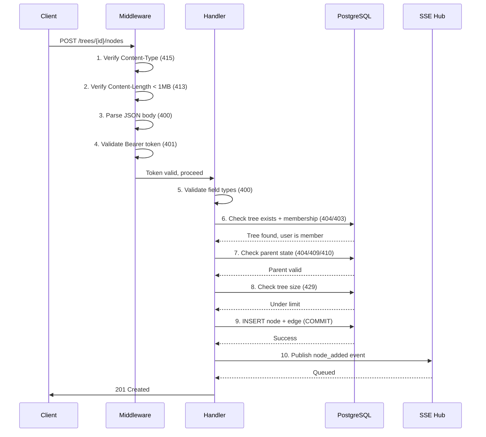

# SPEC-API-07 — Error Catalog

> **Status:** Spec | **Blocks:** BE-03 through BE-11 (all backend tasks), FE-02 through FE-10 (all frontend tasks), TEST-02 (integration test suite)
> **References:** SPEC-API-01 through SPEC-API-06 (error source specs), SPEC-DM-01 through SPEC-DM-04 (DDL constraints), ARCHITECTURE.md §5.5 (auth model)

---

## 1. Purpose

Define every error the Canopy API can return, the exact conditions that trigger each, the canonical HTTP status code, the JSON response body format, and the mapping to source endpoints. A Go worker reading this spec must produce correct error types, middleware, and response helpers with zero clarifying questions. A TypeScript worker reading this spec must produce correct error type unions, Zod schemas, and client-side error handlers. A QA engineer reading this spec must be able to write complete test cases for every error code.

---

## 2. Error Response Format

Every API error response uses a canonical shape:

```json
{
  "error": "<human-readable message>",
  "code": "<MACHINE_READABLE_ERROR_CODE>",
  "details": {}
}
```

| Field | Type | Required | Description |
|-------|------|----------|-------------|
| `error` | string | Yes | Human-readable error message. Stable — UI can display it directly. |
| `code` | string | Yes | Machine-readable error code in `SCREAMING_SNAKE_CASE`. Stable — frontend code branches on this. |
| `details` | object | No | Optional structured payload. Field-level errors include the offending field name and value. Rate-limit errors include `retry_after_seconds`. |

### 2.1 Go Error Type

```go
// APIError is the canonical error response for all Canopy endpoints.
type APIError struct {
    Error   string         `json:"error"`
    Code    string         `json:"code"`
    Details map[string]any `json:"details,omitempty"`
}

func (e *APIError) Error() string {
    return fmt.Sprintf("[%s] %s", e.Code, e.Error)
}

// HTTPStatus maps each error code to its HTTP status.
func (e *APIError) HTTPStatus() int {
    return ErrorCodeToStatus[e.Code]
}

// NewAPIError creates a typed API error with optional details.
func NewAPIError(code, message string, details map[string]any) *APIError {
    return &APIError{Error: message, Code: code, Details: details}
}
```

### 2.2 TypeScript Type

```typescript
type APIErrorCode = 
  | "TREE_NOT_FOUND"
  | "NODE_NOT_FOUND"
  | "INVALID_PARENT_ID"
  // ... all codes

interface APIErrorResponse {
  error: string;
  code: APIErrorCode;
  details?: Record<string, unknown>;
}

// Zod schema for client-side error parsing
const apiErrorSchema = z.object({
  error: z.string(),
  code: z.string(),
  details: z.record(z.unknown()).optional(),
});
```

### 2.3 HTTP Status Code Summary

| Status | Category | Count | Examples |
|--------|----------|-------|----------|
| 400 | Validation / Bad Request | 65+ | `INVALID_TREE_ID`, `TITLE_REQUIRED`, `CONTENT_TOO_LONG` |
| 401 | Authentication | 3 | `TOKEN_MISSING`, `TOKEN_INVALID`, `TOKEN_EXPIRED` |
| 403 | Authorization / Forbidden | 12 | `NOT_TREE_OWNER`, `NOT_TREE_MEMBER`, `SYSTEM_NODE_FORBIDDEN` |
| 404 | Not Found | 14 | `TREE_NOT_FOUND`, `NODE_NOT_FOUND`, `PROFILE_NOT_FOUND` |
| 409 | Conflict | 7 | `ALREADY_MEMBER`, `PENDING_INVITE_EXISTS`, `RULE_ALREADY_EXISTS` |
| 410 | Gone (Soft-Deleted) | 12 | `NODE_DELETED`, `TREE_DELETED`, `APPROVAL_EXPIRED` |
| 413 | Payload Too Large | 1 | `REQUEST_TOO_LARGE` |
| 415 | Unsupported Media Type | 1 | `UNSUPPORTED_MEDIA_TYPE` |
| 429 | Rate Limited | 4 | `RATE_LIMITED`, `TOO_MANY_CONNECTIONS`, `APPROVAL_QUEUE_FULL` |
| 500 | Internal Server Error | 1 | `INTERNAL_ERROR` |
| 503 | Service Unavailable | 1 | `DATABASE_UNAVAILABLE` |

---

## 3. Complete Error Catalog

### 3.1 Authentication Errors (401)

| Code | Status | Message | Trigger Condition | Source Spec(s) |
|------|--------|---------|-------------------|----------------|
| `TOKEN_MISSING` | 401 | `"Authorization header required"` | No `Authorization: Bearer <token>` header present. | API-01 §6.4, API-02 §4.2 |
| `TOKEN_INVALID` | 401 | `"Invalid or malformed token"` | JWT parse error — malformed encoding, wrong algorithm, bad signature. | API-01 §6.4, API-02 §4.2 |
| `TOKEN_EXPIRED` | 401 | `"Token has expired"` | JWT `exp` claim is in the past. | API-01 §6.4, API-02 §4.2 |

### 3.2 Authorization Errors (403)

| Code | Status | Message | Trigger Condition | Source Spec(s) |
|------|--------|---------|-------------------|----------------|
| `NOT_TREE_MEMBER` | 403 | `"You are not a member of this tree"` | User's `user_id` is not in `tree_members` for this tree. Checked by membership middleware. | API-01 §6.4, API-02 §4.4, API-03 §3, API-04 §3, API-06 §3 |
| `NOT_TREE_OWNER` | 403 | `"Only the tree owner can perform this action"` | User is a member but `role != 'owner'`. Tree deletion, approval queue management. | API-02 §3.6, API-05 §2.1 |
| `NOT_TREE_OWNER_OR_ADMIN` | 403 | `"Only owners and admins can perform this action"` | User's role is `member` or `viewer`. Invite management, member role updates. | API-06 §3.1, API-06 §3.7 |
| `NOT_APPROVAL_OWNER` | 403 | `"Only the tree owner can approve or deny"` | `actor_id != approval.owner_id` — only tree owners decide approvals. | API-05 §2.1 |
| `NOT_PROFILE_OWNER` | 403 | `"You do not own this profile"` | Profile's `owner_id != authenticated user_id`. Profiles can only be invited by their owner. | API-06 §3.3 |
| `NOT_NODE_AUTHOR` | 403 | `"You are not the author of this node"` | `node.author_id != authenticated user_id`. Node editing is author-only. | API-03 §3.1 |
| `SYSTEM_NODE_FORBIDDEN` | 403 | `"Cannot create system nodes — these are server-generated"` | `node_type == 'system'` in a POST /nodes request. | API-03 §3.1 |
| `CANNOT_CHANGE_OWNER_ROLE` | 403 | `"Cannot change the owner's role"` | Attempting to PATCH tree owner's role. | API-06 §3.7 |
| `CANNOT_REMOVE_OWNER` | 403 | `"Cannot remove the tree owner"` | DELETE a member where `role == 'owner'`. | API-06 §3.8 |
| `CANNOT_HIDE_OWNER` | 403 | `"Cannot hide the owner's membership"` | PATCH visibility on owner's membership where `is_visible = false`. | API-06 §3.12 |
| `ADMIN_SCOPE_LIMITED` | 403 | `"Admin cannot modify another admin"` | Admin attempting to modify/remove another admin. | API-06 §3.7 |
| `CANNOT_DELETE_APPROVED_NODE` | 403 | `"Cannot delete a node that has been approved"` | Node has an `approved` approval, but the deleter is not the approver. | API-03 §3.2 |
| `PROFILE_OFFLINE` | 403 | `"Profile is offline"` | Attempt to send action to a Hermes profile whose gateway reports offline status. | This spec (cross-cutting, used by SSE event dispatch and profile routing) |

### 3.3 Validation Errors (400)

#### 3.3.1 Common Parameter Errors

| Code | Status | Message | Trigger Condition | Source Spec(s) |
|------|--------|---------|-------------------|----------------|
| `INVALID_TREE_ID` | 400 | `"tree_id is not a valid UUID"` | `tree_id` path/query parameter fails `uuid.Parse()`. | API-02 §4.2, API-05 §3.1, API-06 §3.1 |
| `INVALID_NODE_ID` | 400 | `"node_id is not a valid UUIDv7"` | `node_id` fails UUIDv7 validation. | API-03 §3.2 |
| `INVALID_PARENT_ID` | 400 | `"parent_id is not a valid UUIDv7"` | `parent_id` in POST /nodes body is invalid. | API-03 §3.1 |
| `INVALID_FROM_ID` | 400 | `"from parameter is not a valid UUIDv7"` | `from` query param in GET /path is invalid. | API-04 §4.2 |
| `INVALID_TO_ID` | 400 | `"to parameter is not a valid UUIDv7"` | `to` query param in GET /path is invalid. | API-04 §4.2 |
| `INVALID_ROOT_ID` | 400 | `"root parameter is not a valid UUIDv7"` | `root` query param in GET /subtree is invalid. | API-04 §4.3 |
| `INVALID_CURSOR` | 400 | `"cursor is not a valid UUID"` | `cursor` query param in paginated list endpoints. | API-02 §3.1 |
| `INVALID_MEMBER_ID` | 400 | `"member_id is not a valid UUID"` | `member_id` path param in member endpoints. | API-06 §3.7 |
| `INVALID_APPROVAL_ID` | 400 | `"approval_id is not a valid UUIDv7"` | `approval_id` path param in approve/deny. | API-05 §2.1 |
| `INVALID_RULE_ID` | 400 | `"rule_id is not a valid UUIDv7"` | `rule_id` path param in rule management. | API-05 §3.2 |

#### 3.3.2 List/Query Parameter Errors

| Code | Status | Message | Trigger Condition | Source Spec(s) |
|------|--------|---------|-------------------|----------------|
| `INVALID_LIMIT` | 400 | `"limit must be between 1 and <max>"` | `limit` < 1 or > max (100 for trees/list, 500 for subtree). | API-02 §3.1, API-04 §4.3, API-05 §3.1 |
| `INVALID_OFFSET` | 400 | `"offset must be >= 0"` | `offset` < 0. | API-04 §4.3, API-05 §3.1 |
| `INVALID_SORT` | 400 | `"sort must be one of: <allowed>"` | `sort` not in `[created_at, edited_at, title, activity, members]`. | API-02 §3.1 |
| `INVALID_STATUS` | 400 | `"status must be one of: active, deleted, all"` | `status` filter is invalid. | API-02 §3.1 |
| `INVALID_ROLE` | 400 | `"role must be one of: owner, admin, member, viewer"` | `proposed_role` or filter role is invalid. | API-02 §3.1, API-06 §3.1 |
| `INVALID_SEARCH` | 400 | `"search query must be valid UTF-8"` | Non-UTF8 search string. | API-02 §3.1 |
| `SEARCH_TOO_SHORT` | 400 | `"search query must be at least 3 characters"` | `search` < 3 chars. | API-02 §3.1 |
| `INVALID_SINCE` | 400 | `"since must be a valid ISO 8601 timestamp"` | `since` query param format invalid. | API-05 §3.3 |
| `INVALID_BEFORE` | 400 | `"before must be a valid ISO 8601 timestamp"` | `before` query param format invalid. | API-05 §3.3 |
| `INVALID_DEPTH` | 400 | `"depth must be >= 0"` | `depth` < 0 in subtree query. | API-04 §4.3 |
| `DEPTH_EXCEEDS_MAX` | 400 | `"depth must not exceed 10"` | `depth` > 10. | API-04 §4.3 |
| `INVALID_SINCE_HASH` | 400 | `"since must be a 64-character hex string"` | `since` in SSE connection is not a valid SHA256. | API-01 §3.1 |
| `INVALID_PROFILE_ID` | 400 | `"profiles contains an invalid UUID"` | A UUID in `profiles` CSV list fails parse. | API-01 §3.1 |

#### 3.3.3 Request Body Errors

| Code | Status | Message | Trigger Condition | Source Spec(s) |
|------|--------|---------|-------------------|----------------|
| `INVALID_JSON` | 400 | `"Request body is not valid JSON"` | `json.Unmarshal` fails. | API-02 §3.2 |
| `NO_UPDATE_FIELDS` | 400 | `"No recognized fields provided for update"` | PATCH body is empty or has no valid fields. | API-03 §3.2 |
| `NO_FIELDS_PROVIDED` | 400 | `"At least one field must be provided"` | Empty update body on profile/member PATCH. | API-05 §3.2, API-06 §3.10 |
| `TITLE_REQUIRED` | 400 | `"title is required"` | `title` is empty or whitespace-only in POST /trees. | API-02 §3.2 |
| `TITLE_TOO_LONG` | 400 | `"title must not exceed 200 characters"` | `title` > 200 chars. | API-02 §3.2 |
| `DESCRIPTION_TOO_LONG` | 400 | `"description must not exceed 2000 characters"` | `description` > 2000 chars. | API-02 §3.2 |
| `ROOT_CONTENT_REQUIRED` | 400 | `"root_message.content is required"` | `root_message.content` empty in tree creation. | API-02 §3.2 |
| `ROOT_CONTENT_TOO_LARGE` | 400 | `"root_message.content must not exceed 100,000 characters"` | `root_message.content` > 100K chars. | API-02 §3.2 |
| `CONTENT_TOO_LONG` | 400 | `"content must not exceed 65536 characters"` | `content` > 64KB. | API-03 §3.1, API-04 §3.1 |
| `INVALID_CONTENT_FORMAT` | 400 | `"content_format must be one of: markdown, plain, rich"` | `content_format` not in enum. | API-02 §3.2, API-03 §3.1, API-04 §3.1 |
| `INVALID_NODE_TYPE` | 400 | `"node_type must be one of: message, synthesis, system"` | `node_type` invalid for creation. | API-02 §3.2, API-03 §3.1 |
| `INVALID_EDGE_TYPE` | 400 | `"edge_type must be one of: reply, fork"` | `edge_type` invalid. | API-03 §3.1 |
| `SYNTHESIS_VIA_MERGE_ONLY` | 400 | `"Synthesis nodes must be created via the merge endpoint"` | `node_type == 'synthesis'` on POST /nodes. | API-03 §3.1 |
| `FORK_REQUIRES_CHILDREN` | 400 | `"Fork requires the source node to have children"` | Fork from a leaf node (0 children — use reply instead). | API-03 §3.3 |
| `METADATA_TOO_LARGE` | 400 | `"metadata must not exceed 16KB"` | Serialized `metadata` > 16384 bytes. | API-03 §3.1, API-04 §3.1 |
| `INVALID_SOURCE_NODE_IDS` | 400 | `"source_node_ids must be a non-empty array"` | `source_node_ids` is not an array or is empty. | API-04 §3.1 |
| `MIN_SOURCE_NODES` | 400 | `"Merge requires at least 2 source nodes"` | `len(source_node_ids)` < 2. | API-04 §3.1 |
| `MAX_SOURCE_NODES` | 400 | `"Merge supports at most 100 source nodes"` | `len(source_node_ids)` > 100. | API-04 §3.1 |
| `DUPLICATE_SOURCE_NODES` | 400 | `"source_node_ids contains duplicate entries"` | Duplicate IDs in source array. | API-04 §3.1 |
| `TREE_MISMATCH` | 400 | `"A source node belongs to a different tree"` | Source node's `tree_id != target tree_id`. | API-04 §3.1 |
| `SOURCE_TARGET_OVERLAP` | 400 | `"Target parent is one of the source nodes"` | `target_parent_id` is in `source_node_ids`. | API-04 §3.1 |
| `NO_COMMON_ANCESTOR` | 400 | `"Branches do not share a common ancestor"` | GET /compare nodes have no LCA (different tree roots). | API-04 §4.4 |
| `INVALID_TARGET_PARENT_ID` | 400 | `"target_parent_id is not a valid UUIDv7"` | Target parent UUID invalid. | API-04 §3.1 |
| `REASON_REQUIRED` | 400 | `"reason is required"` | `reason` missing/empty/whitespace on approve/deny. | API-05 §2.1 |
| `REASON_TOO_LONG` | 400 | `"reason must not exceed 1000 characters"` | `reason` > 1000 chars. | API-05 §2.1 |
| `INVALID_DECISION` | 400 | `"decision must be approved or denied"` | `decision` not in enum. | API-05 §2.1 |
| `INVALID_PRIORITY` | 400 | `"priority must be between 0 and 1000"` | `priority` out of range on rule update. | API-05 §3.2 |
| `INVALID_SCOPE_TYPE` | 400 | `"scope_type must be one of: thread, user, profile, action_type"` | `scope_type` invalid. | API-05 §3.1 |
| `INVALID_SCOPE_TARGET` | 400 | `"scope_target must be a valid UUIDv7"` | `scope_target` invalid UUID. | API-05 §3.1 |
| `TREE_ID_REQUIRED` | 400 | `"tree_id query parameter is required"` | Missing `tree_id` in approval list. | API-05 §3.1 |
| `INVALID_ACTION` | 400 | `"action is not a valid audit_action enum"` | `action` not in audit trail enum. | API-05 §3.3 |

#### 3.3.4 Multi-User / Profile Errors

| Code | Status | Message | Trigger Condition | Source Spec(s) |
|------|--------|---------|-------------------|----------------|
| `INVALID_PARTICIPANT_TYPE` | 400 | `"participant_type must be user or profile"` | `participant_type` not `user` or `profile`. | API-06 §3.1 |
| `INVITE_TARGET_REQUIRED` | 400 | `"Either email or user_id is required for user invites"` | User invite has neither `email` nor `user_id`. | API-06 §3.1 |
| `AMBIGUOUS_INVITE_TARGET` | 400 | `"Provide email or user_id, not both"` | Both `email` and `user_id` provided. | API-06 §3.1 |
| `PROFILE_ID_REQUIRED` | 400 | `"profile_id is required for profile invites"` | Profile invite missing `profile_id`. | API-06 §3.1 |
| `INVALID_EMAIL` | 400 | `"email format is invalid"` | `email` fails RFC 5322 validation. | API-06 §3.1 |
| `CANNOT_INVITE_AS_OWNER` | 400 | `"Cannot invite with owner role"` | `proposed_role == 'owner'`. Only one owner per tree. | API-06 §3.1 |
| `INVALID_DISPLAY_NAME` | 400 | `"display_name must be 1-200 characters"` | `display_name` empty or >200 chars. | API-06 §3.10 |
| `INVALID_PROFILE_NAME` | 400 | `"profile name must be 1-64 alphanumeric characters with hyphens"` | Profile `name` empty, >64 chars, or invalid chars. | API-06 §3.10 |
| `DUPLICATE_PROFILE_NAME` | 400 | `"A profile with this name already exists"` | Profile `name` already exists for this owner. | API-06 §3.10 |
| `MAX_PROFILES_EXCEEDED` | 400 | `"Maximum 50 profiles per user"` | User has 50 profiles. | API-06 §3.10 |
| `INVALID_CONTEXT_WINDOW` | 400 | `"context_window_size must be between 1024 and 2097152"` | `context_window_size` < 1024 or > 2MB. | API-06 §3.10 |
| `PROFILE_NAME_IMMUTABLE` | 400 | `"Profile name cannot be changed after creation"` | PATCH on `name` field of existing profile. | API-06 §3.10 |
| `AUTO_APPROVE_NOT_ALLOWED_FOR_VIEWER` | 400 | `"auto_approved cannot be true for viewers"` | `auto_approved=true` with `is_visible=true` for viewer role. | API-06 §3.7 |
| `INVALID_VISIBILITY` | 400 | `"is_visible must be a boolean"` | `is_visible` not `true`/`false`. | API-06 §3.12 |
| `INVITE_TOKEN_REQUIRED` | 400 | `"invite token is required"` | Missing token in accept/decline path. | API-06 §3.4 |
| `REQUEST_TOO_LARGE` | 413 | `"Request body exceeds 1MB limit"` | Content-Length > 1MB. Middleware check before handler. | API-03 §3, API-04 §3 |
| `UNSUPPORTED_MEDIA_TYPE` | 415 | `"Content-Type must be application/json"` | Content-Type is not `application/json`. | API-02 §3.2 |

### 3.4 Not Found Errors (404)

| Code | Status | Message | Trigger Condition | Source Spec(s) |
|------|--------|---------|-------------------|----------------|
| `TREE_NOT_FOUND` | 404 | `"Tree not found"` | `tree_id` not in `trees` table (or hard-deleted). | API-01 §6.4, API-02 §4.2, API-04 §5, API-05 §3.1, API-06 §3.1 |
| `NODE_NOT_FOUND` | 404 | `"Node not found"` | `node_id` not in `nodes` table (or hard-deleted). | API-03 §3.2 |
| `PARENT_NOT_FOUND` | 404 | `"Parent node not found in this tree"` | `parent_id` does not exist. | API-03 §3.1 |
| `FROM_NODE_NOT_FOUND` | 404 | `"From node not found"` | `from` node does not exist. | API-04 §4.2 |
| `TO_NODE_NOT_FOUND` | 404 | `"To node not found"` | `to` node does not exist. | API-04 §4.2 |
| `ROOT_NODE_NOT_FOUND` | 404 | `"Root node not found"` | `root` node does not exist. | API-04 §4.3 |
| `SOURCE_NODE_NOT_FOUND` | 404 | `"One or more source nodes not found"` | A source node in merge does not exist. | API-04 §3.1 |
| `TARGET_PARENT_NOT_FOUND` | 404 | `"Target parent node not found"` | `target_parent_id` does not exist. | API-04 §3.1 |
| `APPROVAL_NOT_FOUND` | 404 | `"Approval not found"` | `approval_id` not in `approvals` table. | API-05 §2.1 |
| `RULE_NOT_FOUND` | 404 | `"Approval rule not found"` | `rule_id` not in `approval_rules` table. | API-05 §3.2 |
| `SCOPE_TARGET_NOT_FOUND` | 404 | `"Scope target not found"` | `scope_target` references non-existent thread/user/profile/action_type. | API-05 §3.1 |
| `MEMBER_NOT_FOUND` | 404 | `"Member not found in this tree"` | `member_id` not in `tree_members`. | API-06 §3.7 |
| `PROFILE_NOT_FOUND` | 404 | `"Profile not found"` | `profile_id` not in `profiles` table. | API-06 §3.3 |
| `USER_NOT_FOUND` | 404 | `"User not found"` | `user_id` not in `users` table. | API-06 §3.1 |
| `INVITE_NOT_FOUND` | 404 | `"Invite not found"` | Invite ID or token does not exist. | API-06 §3.4 |

### 3.5 Conflict Errors (409)

| Code | Status | Message | Trigger Condition | Source Spec(s) |
|------|--------|---------|-------------------|----------------|
| `ALREADY_MEMBER` | 409 | `"User or profile is already a member of this tree"` | UNIQUE(tree_id, user_id) or UNIQUE(tree_id, profile_id) constraint. | API-06 §3.1 |
| `PENDING_INVITE_EXISTS` | 409 | `"A pending invite already exists for this participant"` | UNIQUE(tree_id, participant_type, participant_id) where status='pending'. | API-06 §3.1 |
| `APPROVAL_ALREADY_DECIDED` | 409 | `"Approval has already been decided"` | `approval.status != 'pending'`. | API-05 §2.1 |
| `RULE_ALREADY_EXISTS` | 409 | `"A rule with this scope already exists"` | UNIQUE(tree_id, scope_type, scope_target) constraint. | API-05 §3.1 |
| `PARENT_DELETED` | 409 | `"Parent node has been deleted"` | `parent_id.deleted_at IS NOT NULL` — can't reply to deleted node. | API-03 §3.1 |
| `TARGET_PARENT_DELETED` | 409 | `"Target parent node has been deleted"` | `target_parent_id.deleted_at IS NOT NULL`. | API-04 §3.1 |
| `INVITE_NOT_PENDING` | 409 | `"Invite is no longer pending"` | Invite `status != 'pending'` on accept/decline. | API-06 §3.4 |

### 3.6 Gone / Soft-Deleted Errors (410)

These errors indicate the resource exists but has been soft-deleted (`deleted_at IS NOT NULL`).

| Code | Status | Message | Trigger Condition | Source Spec(s) |
|------|--------|---------|-------------------|----------------|
| `TREE_DELETED` | 410 | `"Tree has been deleted"` | `tree.deleted_at IS NOT NULL`. | API-02 §4.4, API-03 §3, API-04 §3, API-06 §3.1 |
| `TREE_ALREADY_DELETED` | 410 | `"Tree has already been deleted"` | Deleting an already soft-deleted tree. | API-02 §3.6 |
| `NODE_DELETED` | 410 | `"Node has been deleted"` | `node.deleted_at IS NOT NULL`. | API-03 §3.2, API-05 §2.1 |
| `NODE_ALREADY_DELETED` | 410 | `"Node has already been deleted"` | Deleting an already soft-deleted node. | API-03 §3.2 |
| `SOURCE_NODE_DELETED` | 410 | `"One or more source nodes have been deleted"` | Merge source node is soft-deleted. | API-04 §3.1 |
| `FROM_NODE_DELETED` | 410 | `"From node has been deleted"` | `from` node is soft-deleted. | API-04 §4.2 |
| `TO_NODE_DELETED` | 410 | `"To node has been deleted"` | `to` node is soft-deleted. | API-04 §4.2 |
| `ROOT_NODE_DELETED` | 410 | `"Root node has been deleted"` | `root` node is soft-deleted. | API-04 §4.3 |
| `APPROVAL_EXPIRED` | 410 | `"Approval has expired"` | `approval.expires_at < now()`. | API-05 §2.1 |
| `INVITE_EXPIRED` | 410 | `"Invite has expired"` | `invite.expires_at < now()`. | API-06 §3.4 |

### 3.7 Rate Limiting Errors (429)

| Code | Status | Message | Trigger Condition | Source Spec(s) |
|------|--------|---------|-------------------|----------------|
| `RATE_LIMITED` | 429 | `"Too many requests"` | General per-user rate limit exceeded. Returns `retry_after_seconds`. | API-02 §3.2, API-03 §3, API-04 §5, API-05 §5 |
| `CREATE_LIMITED` | 429 | `"Too many tree creations"` | User created >100 trees in the last hour. `retry_after: 3600`. | API-02 §3.2 |
| `TOO_MANY_CONNECTIONS_USER` | 429 | `"Too many SSE connections"` | User has >10 active SSE connections. | API-01 §6.4 |
| `TOO_MANY_CONNECTIONS_TREE` | 429 | `"Too many viewers for this tree"` | Tree has >100 active SSE connections. | API-01 §6.4 |
| `APPROVAL_QUEUE_FULL` | 429 | `"Approval queue is full"` | Tree has >100 pending approvals. | API-05 §3.1 |
| `TREE_SIZE_EXCEEDED` | 429 | `"Tree has reached the maximum node count"` | Node count > 100,000. Includes `retry_after: <cooldown>` and `max_nodes: 100000`. Prevents unbounded tree growth. | This spec (cross-cutting, applies to POST /nodes and POST /trees/{tree_id}/merge) |

### 3.8 Server Errors (500/503)

| Code | Status | Message | Trigger Condition | Source Spec(s) |
|------|--------|---------|-------------------|----------------|
| `INTERNAL_ERROR` | 500 | `"Internal server error"` | Unexpected error (panic recovery, nil dereference, unhandled errors). Full trace logged server-side only. | API-02 §5.2 |
| `DATABASE_UNAVAILABLE` | 503 | `"Database unavailable"` | PostgreSQL connection pool exhausted or connection refused. Transaction rolled back. | API-02 §5.2 |

### 3.9 SSE-Specific Errors

These errors are sent as SSE `error` events on the event stream, not as HTTP JSON responses.

| Code | Category | Message | Trigger Condition | Source Spec |
|------|----------|---------|-------------------|-------------|
| `SUBSCRIPTION_FAILED` | SSE Event | `"Failed to subscribe: <detail>"` | Internal error registering client with SSEHub. | API-01 §6.5 |
| `EVENT_BUFFER_OVERFLOW` | SSE Event | `"Event buffer overflow — some events may have been dropped"` | Client's event buffer > 1000 events. Reconnect with `Last-Event-ID` to recover. | API-01 §6.5 |
| `SERVER_SHUTDOWN` | SSE Event | `"Server shutting down"` | Server received SIGTERM. All SSE connections closed with `done` event. | API-01 §6.5 |
| `STREAMING_NOT_SUPPORTED` | SSE Event | `"Streaming not supported"` | `http.Flusher` not available (HTTP/1.0 or non-standard server). | API-01 §6.5 |

---

## 4. Error Code Taxonomy

### 4.1 By Domain

```
auth/
├── TOKEN_MISSING
├── TOKEN_INVALID
└── TOKEN_EXPIRED

membership/
├── NOT_TREE_MEMBER
├── NOT_TREE_OWNER
├── NOT_TREE_OWNER_OR_ADMIN
├── NOT_APPROVAL_OWNER
├── NOT_PROFILE_OWNER
├── NOT_NODE_AUTHOR
├── CANNOT_CHANGE_OWNER_ROLE
├── CANNOT_REMOVE_OWNER
├── CANNOT_HIDE_OWNER
├── ADMIN_SCOPE_LIMITED
├── PROFILE_OFFLINE
└── CANNOT_DELETE_APPROVED_NODE

tree/
├── TREE_NOT_FOUND
├── TREE_DELETED
├── TREE_ALREADY_DELETED
├── TREE_MISMATCH
├── TREE_SIZE_EXCEEDED
├── TITLE_REQUIRED
├── TITLE_TOO_LONG
├── DESCRIPTION_TOO_LONG
├── ROOT_CONTENT_REQUIRED
├── ROOT_CONTENT_TOO_LARGE
├── CREATE_LIMITED
└── INVALID_SORT

node/
├── NODE_NOT_FOUND
├── NODE_DELETED
├── NODE_ALREADY_DELETED
├── PARENT_NOT_FOUND
├── PARENT_DELETED
├── CONTENT_TOO_LONG
├── INVALID_CONTENT_FORMAT
├── INVALID_NODE_TYPE
├── INVALID_EDGE_TYPE
├── SYNTHESIS_VIA_MERGE_ONLY
├── FORK_REQUIRES_CHILDREN
├── SYSTEM_NODE_FORBIDDEN
├── METADATA_TOO_LARGE
└── MAX_RECURSION

merge/
├── SOURCE_NODE_NOT_FOUND
├── SOURCE_NODE_DELETED
├── MIN_SOURCE_NODES
├── MAX_SOURCE_NODES
├── DUPLICATE_SOURCE_NODES
├── INVALID_SOURCE_NODE_IDS
├── SOURCE_TARGET_OVERLAP
├── TARGET_PARENT_NOT_FOUND
├── TARGET_PARENT_DELETED
├── INVALID_TARGET_PARENT_ID
└── NO_COMMON_ANCESTOR

approval/
├── APPROVAL_NOT_FOUND
├── APPROVAL_EXPIRED
├── APPROVAL_ALREADY_DECIDED
├── APPROVAL_QUEUE_FULL
├── RULE_NOT_FOUND
├── RULE_ALREADY_EXISTS
├── SCOPE_TARGET_NOT_FOUND
├── INVALID_DECISION
├── INVALID_PRIORITY
├── INVALID_SCOPE_TYPE
├── INVALID_SCOPE_TARGET
├── REASON_REQUIRED
├── REASON_TOO_LONG
└── INVALID_ACTION

invite/
├── INVITE_NOT_FOUND
├── INVITE_EXPIRED
├── INVITE_NOT_PENDING
├── INVITE_TARGET_REQUIRED
├── AMBIGUOUS_INVITE_TARGET
├── PROFILE_ID_REQUIRED
├── INVALID_EMAIL
├── INVALID_PARTICIPANT_TYPE
├── CANNOT_INVITE_AS_OWNER
├── ALREADY_MEMBER
└── PENDING_INVITE_EXISTS

profile/
├── PROFILE_NOT_FOUND
├── USER_NOT_FOUND
├── MEMBER_NOT_FOUND
├── INVALID_DISPLAY_NAME
├── INVALID_PROFILE_NAME
├── DUPLICATE_PROFILE_NAME
├── MAX_PROFILES_EXCEEDED
├── INVALID_CONTEXT_WINDOW
├── PROFILE_NAME_IMMUTABLE
├── INVALID_VISIBILITY
├── AUTO_APPROVE_NOT_ALLOWED_FOR_VIEWER
└── INVITE_TOKEN_REQUIRED

navigation/
├── FROM_NODE_NOT_FOUND
├── FROM_NODE_DELETED
├── TO_NODE_NOT_FOUND
├── TO_NODE_DELETED
├── ROOT_NODE_NOT_FOUND
├── ROOT_NODE_DELETED
├── INVALID_FROM_ID
├── INVALID_TO_ID
├── INVALID_ROOT_ID
├── INVALID_DEPTH
└── DEPTH_EXCEEDS_MAX

transport/
├── TOO_MANY_CONNECTIONS_USER
├── TOO_MANY_CONNECTIONS_TREE
├── SUBSCRIPTION_FAILED
├── EVENT_BUFFER_OVERFLOW
├── SERVER_SHUTDOWN
└── STREAMING_NOT_SUPPORTED

common/
├── INVALID_TREE_ID
├── INVALID_NODE_ID
├── INVALID_PARENT_ID
├── INVALID_APPROVAL_ID
├── INVALID_RULE_ID
├── INVALID_MEMBER_ID
├── INVALID_CURSOR
├── INVALID_LIMIT
├── INVALID_OFFSET
├── INVALID_JSON
├── REQUEST_TOO_LARGE
├── UNSUPPORTED_MEDIA_TYPE
├── RATE_LIMITED
├── INTERNAL_ERROR
└── DATABASE_UNAVAILABLE
```

### 4.2 By HTTP Status — Quick Reference

```
400 → Validation/Bad Request     (65+ codes)
401 → Authentication              (3 codes)
403 → Authorization/Forbidden     (13 codes)
404 → Not Found                   (15 codes)
409 → Conflict                    (7 codes)
410 → Gone/Soft-Deleted           (10 codes)
413 → Payload Too Large           (1 code)
415 → Unsupported Media Type      (1 code)
429 → Rate Limited                (6 codes)
500 → Internal Server Error       (1 code)
503 → Service Unavailable         (1 code)
```

---

## 5. Error Middleware Architecture

### 5.1 Error Flow

```
Handler → returns *APIError
   ↓
Middleware catches *APIError
   ↓
Sets HTTP status from ErrorCodeToStatus map
   ↓
Serializes {error, code, details} as JSON
   ↓
Logs structured log entry (code, status, path, user_id, trace_id)
   ↓
Response sent to client
```

### 5.2 Middleware Implementation Pattern

```go
// ErrorHandler middleware wraps all HTTP handlers.
func ErrorHandler(next http.Handler) http.Handler {
    return http.HandlerFunc(func(w http.ResponseWriter, r *http.Request) {
        defer func() {
            if rec := recover(); rec != nil {
                // Log full trace
                slog.Error("panic recovered", "error", rec, "path", r.URL.Path)
                writeAPIError(w, NewAPIError("INTERNAL_ERROR", "Internal server error", nil))
            }
        }()
        
        // Wrap ResponseWriter to capture handler errors
        erw := &errorResponseWriter{ResponseWriter: w}
        next.ServeHTTP(erw, r)
        
        if erw.apiErr != nil {
            slog.Warn("api error",
                "code", erw.apiErr.Code,
                "status", erw.apiErr.HTTPStatus(),
                "path", r.URL.Path,
                "user_id", r.Context().Value("user_id"),
                "trace_id", r.Context().Value("trace_id"),
            )
            writeAPIError(w, erw.apiErr)
        }
    })
}
```

### 5.3 Client-Side Error Handling Pattern

```typescript
// Centralized error handler for the frontend API client.
async function handleAPIError(response: Response): Promise<never> {
  const body: APIErrorResponse = await response.json();
  
  // Map codes to user-facing messages
  switch (body.code) {
    case "TOKEN_EXPIRED":
      // Trigger re-auth flow
      authStore.logout();
      throw new AuthExpiredError(body.error);
    
    case "RATE_LIMITED":
    case "CREATE_LIMITED":
      // Show retry-after countdown
      const retryAfter = body.details?.retry_after_seconds ?? 30;
      throw new RateLimitError(body.error, retryAfter);
    
    case "TREE_SIZE_EXCEEDED":
      // Warn user about tree size limit
      throw new TreeSizeError(body.error, body.details?.max_nodes);
    
    case "PROFILE_OFFLINE":
      // Show profile unavailable state
      throw new ProfileOfflineError(body.error);
    
    default:
      throw new APIError(body.code, body.error, body.details);
  }
}
```

---

## 6. Cross-Cutting Error Scenarios

### 6.1 Transaction Rollback Semantics

When a handler encounters an error during a multi-step operation:

1. If the error occurs before the database transaction commits → rollback, return error.
2. If the error occurs after commit (e.g., SSE event publish fails) → the database state is committed, SSE event is missed. Client reconnects and replays via `Last-Event-ID`.
3. `DATABASE_UNAVAILABLE` → transaction already rolled back by the connection pool.

### 6.2 Partial Success

No endpoint returns partial success. Every endpoint is all-or-nothing:

- POST /trees: tree + root node + initial membership all in one transaction. If any step fails → full rollback.
- POST /nodes/{node_id}/merge: merge node + edges all in one transaction. If SSE publish fails after commit, the merge is still valid; client replays via SSE.
- POST /trees/{tree_id}/invite: invite row + optional notification. Notification failure does not roll back the invite — the invite is still valid.

### 6.3 Error Precedence

When multiple error conditions apply, validation errors take precedence over state errors, which take precedence over auth errors (client should fix their request before we check membership):

| Precedence | Layer | Example |
|------------|-------|---------|
| 1 (first) | Transport | Content-Type check, body size check |
| 2 | Parsing | JSON parse, UUID validation |
| 3 | Field Validation | Required fields, format checks, enum values |
| 4 | Authentication | Token presence, validity, expiry |
| 5 | Authorization | Membership, role, ownership checks |
| 6 | Resource State | Soft-deleted, expired, already-decided |
| 7 | Business Logic | Rate limits, queue capacity, size limits |

---

## 7. Go Implementation Requirements

### 7.1 Error Registry

```go
// ErrorCodeToStatus maps every error code to its HTTP status.
var ErrorCodeToStatus = map[string]int{
    // 400
    "INVALID_TREE_ID":                400,
    "INVALID_NODE_ID":                400,
    "INVALID_PARENT_ID":              400,
    // ... all codes
    // 500
    "INTERNAL_ERROR":                 500,
    // 503
    "DATABASE_UNAVAILABLE":           503,
}

// ErrorMessages provides canonical human-readable messages.
var ErrorMessages = map[string]string{
    "TREE_NOT_FOUND":      "Tree not found",
    "NODE_NOT_FOUND":      "Node not found",
    "INVALID_PARENT_ID":   "parent_id is not a valid UUIDv7",
    // ... all codes
}
```

### 7.2 Sentinel Errors

```go
var (
    ErrTreeNotFound    = NewAPIError("TREE_NOT_FOUND", "Tree not found", nil)
    ErrNodeNotFound    = NewAPIError("NODE_NOT_FOUND", "Node not found", nil)
    ErrNotTreeMember   = NewAPIError("NOT_TREE_MEMBER", "You are not a member of this tree", nil)
    ErrTokenExpired    = NewAPIError("TOKEN_EXPIRED", "Token has expired", nil)
    ErrRateLimited     = NewAPIError("RATE_LIMITED", "Too many requests", map[string]any{"retry_after_seconds": 30})
    ErrProfileOffline  = NewAPIError("PROFILE_OFFLINE", "Profile is offline", nil)
    ErrTreeSizeExceeded = NewAPIError("TREE_SIZE_EXCEEDED", "Tree has reached the maximum node count", map[string]any{"max_nodes": 100000})
    // ... all sentinel errors
)
```

### 7.3 Wire Into Existing Specs

Each API spec (SPEC-API-01 through SPEC-API-06) references its error codes individually. The Go implementation MUST:

1. Use `NewAPIError()` for all error returns — never return bare `fmt.Errorf()`.
2. Use sentinel errors where applicable — `errors.Is(err, ErrTreeNotFound)` must work.
3. Log every `*APIError` at WARN level before writing the response.
4. Never expose internal error details (stack traces, SQL errors) in the `error` field.
5. Include a `trace_id` in the response headers (`X-Trace-ID`) for correlation with server logs.

---

## 8. Test Scenarios

### 8.1 Error Shape Contract

| ID | Scenario | Verify |
|----|----------|--------|
| ERR-01 | Any 4xx/5xx response | Body parses as `{"error": "string", "code": "UPPER_SNAKE_CASE"}`. `details` optional. |
| ERR-02 | Rate limit errors | `details.retry_after_seconds` is a positive integer. |
| ERR-03 | Field validation errors | `details` includes offending field name and received value. |
| ERR-04 | 500 errors | `error` is "Internal server error" — never exposes stack traces or SQL. |
| ERR-05 | All error codes are in `ErrorCodeToStatus` | No code maps to 0 (default int). Test iterates enum exhaustively. |

### 8.2 Authentication Flow

| ID | Scenario | Steps | Expected |
|----|----------|-------|----------|
| ERR-10 | No auth header | GET /trees without Authorization | 401 TOKEN_MISSING |
| ERR-11 | Malformed token | Bearer `not.a.jwt` | 401 TOKEN_INVALID |
| ERR-12 | Expired token | Bearer token with `exp` < now | 401 TOKEN_EXPIRED |

### 8.3 Authorization Flow

| ID | Scenario | Steps | Expected |
|----|----------|-------|----------|
| ERR-20 | Non-member access | User B accesses User A's tree | 403 NOT_TREE_MEMBER |
| ERR-21 | Member tries to delete | Member role calls DELETE /trees/{id} | 403 NOT_TREE_OWNER |
| ERR-22 | Viewer tries to invite | Viewer calls POST /trees/{id}/invite | 403 NOT_TREE_OWNER_OR_ADMIN |
| ERR-23 | Non-author edits node | User B PATCHes User A's node | 403 NOT_NODE_AUTHOR |

### 8.4 Resource State

| ID | Scenario | Steps | Expected |
|----|----------|-------|----------|
| ERR-30 | Get soft-deleted tree | GET /trees/{id} where deleted_at IS NOT NULL | 410 TREE_DELETED |
| ERR-31 | Reply to deleted node | POST /trees/{id}/nodes with parent_id.deleted_at IS NOT NULL | 409 PARENT_DELETED |
| ERR-32 | Approve expired approval | POST /approvals/{id}/approve | 410 APPROVAL_EXPIRED |
| ERR-33 | Accept expired invite | POST /invites/{token}/accept after expires_at | 410 INVITE_EXPIRED |

### 8.5 Rate Limiting

| ID | Scenario | Steps | Expected |
|----|----------|-------|----------|
| ERR-40 | General rate limit | Send 1000 requests in 1 second | 429 RATE_LIMITED with retry_after_seconds |
| ERR-41 | Tree creation limit | Create 101 trees in 1 hour | 429 CREATE_LIMITED with retry_after: 3600 |
| ERR-42 | SSE connection limit | Open 11 SSE connections as same user | 429 TOO_MANY_CONNECTIONS_USER |
| ERR-43 | Tree size limit | Add node to tree with 100000 nodes | 429 TREE_SIZE_EXCEEDED with max_nodes: 100000 |

### 8.6 Cross-Cutting

| ID | Scenario | Steps | Expected |
|----|----------|-------|----------|
| ERR-50 | Error precedence | Send invalid UUID as non-member | 400 INVALID_TREE_ID (not 403 NOT_TREE_MEMBER) |
| ERR-51 | All-or-nothing tree creation | POST /trees with valid root but db fails on membership insert | 503 DATABASE_UNAVAILABLE, tree not created |
| ERR-52 | Profile offline dispatch | SSE event targets offline profile | 403 PROFILE_OFFLINE returned to dispatcher, event queued for retry |

---

## 9. Mermaid: Error Handling Flow



---

## 10. Coverage Matrix

| Source Spec | Error Codes Defined | Validated Against This Catalog |
|-------------|---------------------|-------------------------------|
| SPEC-API-01 | 12 | Yes — all codes in §3.2, §3.7, §3.9 |
| SPEC-API-02 | 30 | Yes — all codes in §3.1-§3.8 |
| SPEC-API-03 | 22 | Yes — all codes in §3.1-§3.7 |
| SPEC-API-04 | 32 | Yes — all codes in §3.1-§3.7 |
| SPEC-API-05 | 24 | Yes — all codes in §3.1-§3.7 |
| SPEC-API-06 | 30 | Yes — all codes in §3.1-§3.7 |
| **New in this spec** | 3 | PROFILE_OFFLINE, TREE_SIZE_EXCEEDED, MAX_RECURSION |

**Canopy returns zero bare `fmt.Errorf()` errors.** Every error path produces a typed `*APIError` with a registered code.

---

## 11. Phase 3b-3d Future Errors

The following error codes are anticipated from Phase 3b-3d specs but are not yet finalized:

| Code | Phase | Trigger |
|------|-------|---------|
| `TOPIC_NOT_FOUND` | 3b | #reference points to nonexistent topic |
| `TOPIC_ARCHIVED` | 3b | Operation on archived topic |
| `PLUGIN_SANDBOX_VIOLATION` | 3c | Plugin attempted restricted API call |
| `PLUGIN_LOAD_ERROR` | 3c | Plugin JS file failed to parse or load |
| `CARD_TYPE_UNKNOWN` | 3c | Unrecognized card type |
| `CALENDAR_AUTH_REQUIRED` | 3c | Calendar provider needs OAuth refresh |
| `FEDERATION_UNREACHABLE` | 3d | Remote Hermes instance unreachable |
| `MLS_KEY_ROTATION_FAILED` | 3d | MLS group key rotation error |
| `TRANSPORT_DEGRADED` | 3d | All transports degraded, queuing locally |

These are documented here for forward compatibility. Implementation deferred to their respective phases.

---

## 12. Design Decisions

| Decision | Rationale |
|----------|-----------|
| Canonical error shape: `{error, code, details?}` | Consistent across all endpoints. Frontend can write one error handler. |
| `SCREAMING_SNAKE_CASE` codes | Unambiguous, grep-friendly, enum-safe in TypeScript. No collision with HTTP status text. |
| `details` is `map[string]any` not a union | Extensible. Each error code defines its own details contract. |
| 410 for soft-deleted resources (not 404) | Distinguishes "never existed" from "existed but deleted". Enables undelete UX flows. |
| Sentinel errors as package-level vars | `errors.Is(err, ErrTreeNotFound)` works. Consistent across handlers. |
| Error precedence: transport → parse → field → auth → authz → state → business | Predictable. Client can fix errors in order. |
| `PROFILE_OFFLINE` as 403 not 503 | Profile offline is a known state, not a service outage. Dispatcher can retry. |
| `TREE_SIZE_EXCEEDED` as 429 not 400 | It's a quota/limit error, not a malformed request. Signals "try later with a different approach." |
