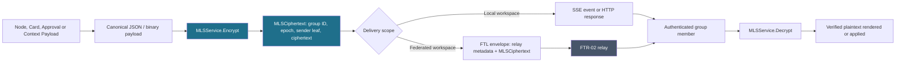

# SPEC-FTR-03 — MLS Encryption Model

> **Status:** Spec | **Phase:** Post-MVP (FTR-03) | **Blocks:** BE-10 (Encryption Layer MLS)
> **References:** SPEC-FTR-01, SPEC-FTR-02, T1.7-Security-Protocol (`T1.7-mls-encryption.md`), SPEC-DM-03, SPEC-API-06, ARCHITECTURE.md, RFC 9420
> **Commit:** _(to be filled)_

---

## 1. Purpose

Define Messaging Layer Security (MLS, RFC 9420) as Canopy's mandatory end-to-end encryption layer for multi-user and federated collaboration. Every workspace, every tree node, and every event payload is encrypted by the MLS group associated with its workspace before persistence, SSE publication, or FTL federation relay. The delivery service may route opaque ciphertext and required routing metadata, but it must not require plaintext node content, card data, approval decisions, or context manifests.

A Go worker reading this document can implement the MLS service, key-package manager, group-state machine, persistence repository, HTTP handlers, SSE event emission, and FTL integration without making encryption-design decisions. A TypeScript worker can implement MLS state display and the post-MVP browser client boundary without inventing wire formats.

Canopy MVP remains local and unencrypted as stated in AGENTS.md. MLS activates with the post-MVP workspace model defined by SPEC-FTR-01. The `workspace_id` in this document is the collaboration workspace/tree security boundary: one workspace maps to exactly one active MLS group. This supersedes the per-topic subgroup direction in T1.7 for FTR-03; restricted-topic subgroups are intentionally deferred until an authorization model exists that can preserve member-set isolation without duplicating tree state.

**Security boundary:** the server-side Hermes agent is an explicit, visible MLS group member when it needs to compile context or act in the workspace. It is not an invisible decrypting observer. Membership changes are auditable through SPEC-DM-03, and client-visible membership state is sourced from SPEC-FTR-01/SPEC-API-06.

---

## 2. Design Decisions

| # | Decision | Choice | Rationale |
|---|----------|--------|-----------|
| 1 | MLS versus custom E2EE | MLS defined by RFC 9420; no custom protocol and no Signal fallback | Canopy is intrinsically multi-participant. RFC 9420 gives a reviewed group state machine, authenticated commits, forward secrecy, and post-compromise security without creating a protocol-negotiation attack surface. |
| 2 | MLS implementation | Pure Go RFC 9420 implementation (for example a maintained `circl/mls`-compatible implementation); no CGO | BE-10 must compile into the single `canopyd` binary without Rust/C toolchains or FFI memory boundaries. This intentionally supersedes T1.7 and ARCHITECTURE.md's earlier mls-rs-via-CGo implementation assumption; selection requires an interoperability and security review before dependency lock. |
| 3 | Group granularity | One active MLS group per workspace, not per tree node or per individual node | Workspace membership is the access boundary in SPEC-FTR-01. Per-node groups create unbounded commit traffic and inconsistent access decisions. A workspace maps to one tree in the post-MVP collaboration model. |
| 4 | Identity model | Profile UUIDv7 plus Ed25519 identity keypair | UUIDv7 preserves the existing profile identity model from SPEC-API-06. Ed25519 provides stable public identity material for MLS credential signatures; private material remains outside API responses. |
| 5 | Authentication | MLS credential carrying profile UUIDv7 and Ed25519 signature public key | MLS-native credential validation binds a leaf to an authenticated Canopy profile and permits a verifier to reject forged or malformed join material before it reaches group state. |
| 6 | Key-package storage | PostgreSQL authoritative store plus file-based key-package cache | PostgreSQL supplies transactional, durable lookup for group operations. The local encrypted cache keeps reconnect latency low and can be safely rebuilt from the database. Cache is never authoritative. |
| 7 | Epoch management | Advance epoch on every accepted add, remove, or update operation | Membership and credential changes require a Commit. The service never reuses an epoch after a group-state mutation, preserving MLS forward secrecy and post-compromise recovery semantics. |
| 8 | Proposal timing | Immediate for local members; asynchronous for federated members through FTR-02 | A local workspace operation can create and commit in one transaction. A remote profile's proposal is transported as an opaque FTL payload and can be committed only after relay validation and durable queueing. |
| 9 | External proposals | Accepted for federated member joins only | FTR-02 §2 creates remote profile routes. External proposals let a remote profile request admission without granting it local state-write authority; the workspace admin still commits the proposal. |
| 10 | Application-message encryption | MLS `Ciphertext`; transport in the existing FTL envelope when federated | MLS encrypts the application payload. SSE and FTL carry the resulting ciphertext, group identifier, epoch, sender leaf index, and routing data only. FTL signatures add relay authentication but do not replace MLS encryption. |
| 11 | Epoch staleness | Re-sync with an authenticated MLS Welcome/rejoin state | A client that cannot process a current ciphertext because its epoch is stale must not guess keys or accept a lower epoch. It obtains current state through a freshly addressed Welcome flow and retries only after validation. |
| 12 | Group-state persistence | PostgreSQL state per workspace: group ID, epoch, ratchet tree, and encrypted serialized state | MLS state is durable across `canopyd` restart. At-rest encryption uses a deployment-managed envelope key; database backups contain encrypted state rather than usable leaf secrets. |
| 13 | Exporter secret | MLS exporter secret derives workspace-scoped authentication tokens | Exported values are domain-separated with workspace ID, epoch, and token purpose. They are short-lived, never used as database-at-rest keys, and rotate whenever group state advances. |
| 14 | Ratchet tree storage | Persist full ratchet tree per workspace; do not treat client caches as authoritative | The service must recreate the exact MLS group state after restart and validate commits against a durable tree hash. Clients retain only their own state and cannot reconstruct server group state. |
| 15 | Proposal validation | MLS-native credential and signature verification before queueing or committing | Invalid proposals must fail before state mutation, SSE publication, or federation forwarding. Application authorization additionally checks workspace role before calling MLS commit operations. |
| 16 | Welcome delivery | Send an encrypted, addressed Welcome event over SSE to a new local member | The Welcome is encrypted for the recipient's key package, is visible only on that member's authenticated SSE stream, and is persisted for retransmission until receipt acknowledgment. |
| 17 | Key-package expiry | 24 hours; clients renew on reconnect and before expiry | Short-lived packages reduce stale pre-key exposure. Renewal is independent of membership: a fresh key package is uploaded, then an MLS Update proposal changes the existing member's leaf. |
| 18 | Federation compatibility | Remote profiles occupy normal MLS leaf nodes | FTR-02 profile routing changes delivery, not cryptographic membership. A remote profile credential and key package are verified exactly as local material, while Commit/Welcome traffic uses the FTL relay. |
| 19 | Offline-member removal | Generate an admin-reviewable removal proposal after seven days without heartbeat | A missing heartbeat is not proof of compromise, so removal is proposed rather than automatic. On commit, the epoch advances and removed members cannot decrypt subsequent workspace ciphertext. |
| 20 | Client-side MLS | WASM-compiled Go MLS implementation is a post-MVP client capability | Server-side MLS ships first. The browser boundary and wire types are specified now, but no client bundle may claim end-to-end browser decryption until the WASM implementation passes RFC 9420 interoperability and side-channel review. |

---

## 3. Go Interface Definitions

The following single package is syntactically compilable Go. UUID values are UUIDv7 at creation time; `github.com/google/uuid` is already the identifier convention used by the project specifications. Concrete implementations must keep `PrivateKey` and serialized group secrets out of JSON and logs.

### 3.1 MLS Service, Domain Types, and Key Packages

```go
package mls

import (
    "context"
    "crypto/ed25519"
    "encoding/json"
    "errors"
    "time"

    "github.com/google/uuid"
)

// Ed25519KeyPair holds one profile identity keypair. PrivateKey is never serialized.
type Ed25519KeyPair struct {
    PublicKey  ed25519.PublicKey  `json:"public_key"`
    PrivateKey ed25519.PrivateKey `json:"-"`
}

// MLSGroup is the persisted public summary of one workspace MLS group.
type MLSGroup struct {
    ID          []byte    `json:"id"`
    WorkspaceID uuid.UUID `json:"workspace_id"`
    CipherSuite string    `json:"cipher_suite"`
    Epoch       uint64    `json:"epoch"`
    TreeHash    []byte    `json:"tree_hash"`
    CreatedAt   time.Time `json:"created_at"`
    UpdatedAt   time.Time `json:"updated_at"`
}

// MLSGroupState contains encrypted state required to resume an MLS group.
type MLSGroupState struct {
    Group              MLSGroup           `json:"group"`
    EncryptedState     []byte             `json:"-"`
    RatchetTree        []byte             `json:"ratchet_tree"`
    ExporterSecretHash []byte             `json:"exporter_secret_hash"`
    Members            []MLSGroupMember  `json:"members"`
}

// MLSGroupMember is the authenticated member representation at an MLS leaf.
type MLSGroupMember struct {
    ProfileID           uuid.UUID `json:"profile_id"`
    MLSIdentity         []byte    `json:"mls_identity"`
    EncryptionPublicKey []byte    `json:"encryption_public_key"`
    SignaturePublicKey  []byte    `json:"signature_public_key"`
    CredentialType      string    `json:"credential_type"`
    AddedAt             time.Time `json:"added_at"`
    LastActive          time.Time `json:"last_active"`
}

// MLSCiphertext is an opaque RFC 9420 application-message representation.
type MLSCiphertext struct {
    GroupID         []byte `json:"group_id"`
    Epoch           uint64 `json:"epoch"`
    ContentType     string `json:"content_type"`
    Ciphertext      []byte `json:"ciphertext"`
    Nonce           []byte `json:"nonce"`
    SenderLeafIndex uint32 `json:"sender_leaf_index"`
    WireFormat      string `json:"wire_format"` // "mls_ciphertext_v1"
}

// MLSCredential is the MLS credential data bound to a Canopy profile UUIDv7.
type MLSCredential struct {
    ProfileID          uuid.UUID `json:"profile_id"`
    Identity           []byte    `json:"identity"`
    SignaturePublicKey []byte    `json:"signature_public_key"`
    CredentialType     string    `json:"credential_type"`
}

// MLSKeyPackage is a short-lived RFC 9420 key package plus Canopy metadata.
type MLSKeyPackage struct {
    ID              uuid.UUID `json:"id"`
    ProfileID       uuid.UUID `json:"profile_id"`
    KeyPackageBytes []byte    `json:"key_package_bytes"`
    Hash            []byte    `json:"hash"`
    CipherSuite     string    `json:"cipher_suite"`
    CreatedAt       time.Time `json:"created_at"`
    ExpiresAt       time.Time `json:"expires_at"`
}

// MLSService owns workspace group state and cryptographic transitions.
type MLSService interface {
    CreateGroup(ctx context.Context, workspaceID, creatorProfileID uuid.UUID, adminKeyPair Ed25519KeyPair) (*MLSGroup, error)
    JoinGroup(ctx context.Context, workspaceID, profileID uuid.UUID, keyPackage MLSKeyPackage, welcomeBytes []byte) error
    LeaveGroup(ctx context.Context, workspaceID, profileID uuid.UUID) error
    RemoveMember(ctx context.Context, workspaceID, profileID, callerProfileID uuid.UUID) error
    Encrypt(ctx context.Context, workspaceID, profileID uuid.UUID, plaintext []byte) (MLSCiphertext, error)
    Decrypt(ctx context.Context, workspaceID, profileID uuid.UUID, ciphertext MLSCiphertext) ([]byte, error)
    AddExternalProposal(ctx context.Context, workspaceID, profileID uuid.UUID, proposalBytes []byte) error
    CommitProposals(ctx context.Context, workspaceID, profileID uuid.UUID) ([]byte, error) // returns commit bytes
    GetEpochSecret(ctx context.Context, workspaceID uuid.UUID) ([]byte, error) // exporter secret
    GetGroupState(ctx context.Context, workspaceID uuid.UUID) (*MLSGroupState, error)
}

// KeyPackageManager manages 24-hour member key packages.
type KeyPackageManager interface {
    GenerateKeyPackage(ctx context.Context, profileID uuid.UUID, credential MLSCredential, keyPair Ed25519KeyPair) (MLSKeyPackage, error)
    GetKeyPackage(ctx context.Context, profileID uuid.UUID) (MLSKeyPackage, error)
    ExpireKeyPackage(ctx context.Context, keyPackageID uuid.UUID) error
}

// Errors are stable service-level classifications for HTTP, SSE, and audit mapping.
var (
    ErrMLSGroupNotFound    = errors.New("mls: group not found")
    ErrNotGroupMember      = errors.New("mls: profile is not a group member")
    ErrEpochMismatch       = errors.New("mls: ciphertext epoch does not match group epoch")
    ErrKeyPackageExpired   = errors.New("mls: key package is expired")
    ErrProposalRejected    = errors.New("mls: proposal rejected")
    ErrCommitFailed        = errors.New("mls: commit failed")
    ErrDecryptionFailed    = errors.New("mls: decryption failed")
    ErrGroupStateCorrupt   = errors.New("mls: persisted group state is corrupt")
    ErrInvalidCredential   = errors.New("mls: credential is invalid")
    ErrMemberAlreadyInGroup = errors.New("mls: profile is already a group member")
    ErrMemberNotInGroup    = errors.New("mls: profile is not in the group")
    ErrUnauthorizedCommit  = errors.New("mls: caller is not authorized to commit proposals")
    ErrWelcomeUndelivered  = errors.New("mls: welcome has not been acknowledged")
)

// MLSEventType enumerates workspace-scoped SSE event types.
type MLSEventType string

const (
    EventGroupCreated       MLSEventType = "group_created"
    EventGroupJoined        MLSEventType = "group_joined"
    EventMemberAdded        MLSEventType = "member_added"
    EventMemberRemoved      MLSEventType = "member_removed"
    EventGroupEpochAdvanced MLSEventType = "group_epoch_advanced"
    EventKeyPackageExpiring MLSEventType = "key_package_expiring"
    EventWelcomeMessage     MLSEventType = "welcome_message"
)

// MLSEvent is delivered through the authenticated workspace SSE stream.
type MLSEvent struct {
    Type            MLSEventType    `json:"type"`
    WorkspaceID     uuid.UUID       `json:"workspace_id"`
    ActorProfileID  uuid.UUID       `json:"actor_profile_id"`
    TargetProfileID *uuid.UUID      `json:"target_profile_id,omitempty"`
    Timestamp       time.Time       `json:"timestamp"`
    Payload         json.RawMessage `json:"payload"`
}
```

### 3.2 State-Machine Invariants

1. `CreateGroup` creates epoch 0 with the creator and the visible Hermes system profile as members where the workspace configuration requires agent context compilation.
2. `JoinGroup` validates the recipient's key package, processes only a Welcome addressed to that package, and persists state atomically before emitting `group_joined`.
3. `RemoveMember`, `LeaveGroup`, a credential update, and an accepted external proposal become effective only through `CommitProposals`; no API handler may mutate `mls_group_members` directly.
4. `Encrypt` requires current membership and emits application data at the persisted group epoch. `Decrypt` rejects a ciphertext that cannot authenticate, belongs to another group, or has an unrecoverable epoch mismatch.
5. `GetEpochSecret` returns a domain-separated exporter value to the authenticated service layer only. It is not exposed by a public REST response.
6. Every accepted group transition writes a before/after audit entry through SPEC-DM-03 and publishes the corresponding SSE event only after the PostgreSQL transaction commits.

---

## 4. Group Lifecycle Protocol

### 4.1 Lifecycle Sequence

```mermaid
sequenceDiagram
    participant C as Composer / Browser
    participant API as canopyd MLS API
    participant MLS as MLSService
    participant KP as KeyPackageManager
    participant PG as PostgreSQL
    participant SSE as SSE Hub
    participant FTL as FTR-02 Relay
    participant R as Remote Profile

    C->>API: Create workspace
    API->>MLS: CreateGroup(workspace, creator, keypair)
    MLS->>PG: Persist group epoch 0 + ratchet tree
    MLS-->>SSE: group_created

    C->>API: Join workspace (local profile)
    API->>KP: GetKeyPackage(profile)
    KP-->>API: valid 24h package
    API->>MLS: Add local member proposal
    MLS->>MLS: Validate credential + signature
    MLS->>MLS: Commit proposals; advance epoch
    MLS->>PG: Persist commit, tree, epoch
    MLS-->>SSE: member_added + group_epoch_advanced
    MLS-->>SSE: welcome_message (targeted, encrypted)

    R->>FTL: External join proposal
    FTL->>API: Verified opaque proposal for workspace
    API->>MLS: AddExternalProposal
    MLS->>MLS: Validate remote credential
    MLS->>MLS: Commit proposals; advance epoch
    MLS->>PG: Persist commit + remote leaf
    MLS-->>FTL: Welcome bytes in FTL envelope
    FTL-->>R: Targeted Welcome

    C->>API: Remove member
    API->>MLS: Remove proposal
    MLS->>MLS: Commit proposals; advance epoch
    MLS->>PG: Persist removal + epoch
    MLS-->>SSE: member_removed + group_epoch_advanced

    C->>MLS: Encrypt(plaintext)
    MLS-->>SSE: MLSCiphertext in workspace event
    SSE-->>MLS: MLSCiphertext for recipient
    MLS->>MLS: Decrypt and authenticate
    MLS-->>C: Display plaintext

    C->>KP: Key package expires / reconnect
    KP->>KP: Generate fresh key package
    KP->>PG: Store package with expires_at = now + 24h
    C->>MLS: Update proposal using fresh package
    MLS->>MLS: Commit; advance epoch
```

### 4.2 Encryption and Transport Boundary



### 4.3 Transition Rules

| Trigger | Proposal | Commit authority | Result |
|---------|----------|------------------|--------|
| Workspace creation | Initial group creation | Creator/profile with workspace-admin authority | Group at epoch 0; creator and required system profile enrolled |
| Local membership accepted | Add | Workspace admin service | Member leaf added, epoch advances, targeted Welcome persisted and sent |
| Remote federation join | External add | Workspace admin after FTR-02 verification | Remote profile added as standard MLS leaf; Welcome relayed through FTL |
| Member leaves | Remove self | Service validates caller owns target profile | Member leaf removed and epoch advances |
| Admin removes member | Remove | Owner/admin per SPEC-FTR-01 | Member loses access to future epochs after Commit |
| Key-package renewal | Update | A valid current member or admin service | Leaf credential/key material updated and epoch advances |
| Seven-day inactive member | Proposed remove | Human/admin review required | No removal until Commit; audit records heartbeat evidence |

---

## 5. API Endpoints

All endpoints are prefixed with `/api/v1/mls/` and require `Authorization: Bearer <token>`. Authentication resolves a user/profile according to SPEC-API-06; authorization additionally requires membership in the target workspace. Endpoints never return private key material, the raw current exporter secret, or unencrypted group state.

### 5.1 Route Summary

```
POST   /api/v1/mls/key-packages                              → Generate and upload a key package
GET    /api/v1/mls/key-packages                              → Get caller's current key package metadata
GET    /api/v1/mls/key-packages/{profile_id}                 → Get public package for a join flow
PUT    /api/v1/mls/key-packages/{key_package_id}             → Replace/renew a caller-owned package
DELETE /api/v1/mls/key-packages/{key_package_id}             → Revoke a caller-owned package

GET    /api/v1/mls/workspaces/{workspace_id}/group           → Get public group summary and member leaves
POST   /api/v1/mls/workspaces/{workspace_id}/group           → Create group or submit group operation
POST   /api/v1/mls/workspaces/{workspace_id}/proposals       → Submit local or external proposal
POST   /api/v1/mls/workspaces/{workspace_id}/commit          → Commit validated proposals (admin only)
POST   /api/v1/mls/workspaces/{workspace_id}/welcome/ack     → Acknowledge receipt of targeted Welcome

POST   /api/v1/mls/workspaces/{workspace_id}/encrypt         → Encrypt authorized application payload
POST   /api/v1/mls/workspaces/{workspace_id}/decrypt         → Decrypt authorized MLS ciphertext
```

### 5.2 Key Package Operations

**POST `/api/v1/mls/key-packages`** creates a locally generated or server-assisted RFC 9420 key package bound to the caller's Ed25519 credential. The server validates the credential signature, stores only the package/public data, and sets `expires_at` to 24 hours after `created_at`.

```json
// Request
{
  "profile_id": "0191a8b2-7fff-7000-9000-000000000099",
  "credential": {
    "identity": "base64-profile-identity",
    "signature_public_key": "base64-ed25519-public-key",
    "credential_type": "basic"
  },
  "key_package_bytes": "base64-rfc9420-key-package"
}
// Response 201
{
  "id": "0191a8b2-7fff-7000-9000-000000000701",
  "profile_id": "0191a8b2-7fff-7000-9000-000000000099",
  "cipher_suite": "MLS_128_DHKEMX25519_AES128GCM_SHA256_Ed25519",
  "created_at": "2026-07-22T12:00:00Z",
  "expires_at": "2026-07-23T12:00:00Z"
}
```

`GET /key-packages/{profile_id}` returns the newest unexpired package only to an authorized workspace join or proposal flow. The response omits storage-local metadata other than package ID, bytes, cipher suite, and expiry. `PUT` rotates a package; `DELETE` revokes a package that has not been consumed by a committed group operation.

### 5.3 Group Operations

**POST `/api/v1/mls/workspaces/{workspace_id}/group`** supports explicit, typed operations. A create request is allowed only while no group exists. Add, remove, update, and external operations create validated pending proposals; they do not immediately expose a new membership state before a Commit succeeds.

```json
// Add member proposal request
{
  "operation": "add_member",
  "profile_id": "0191a8b2-7fff-7000-9000-000000000123",
  "key_package_id": "0191a8b2-7fff-7000-9000-000000000701"
}
// Response 202
{
  "workspace_id": "0191a8b2-7fff-7000-9000-000000000001",
  "proposal_id": "0191a8b2-7fff-7000-9000-000000000702",
  "status": "pending_commit"
}
```

**POST `/api/v1/mls/workspaces/{workspace_id}/commit`** requires workspace owner/admin authority from SPEC-FTR-01. It serializes proposal application with a row lock on `mls_groups`, validates all MLS signatures, persists state and the new epoch, then returns opaque commit bytes for delivery.

```json
// Response 200
{
  "group_id": "base64-mls-group-id",
  "epoch": 4,
  "commit_bytes": "base64-rfc9420-commit",
  "welcome_targets": ["0191a8b2-7fff-7000-9000-000000000123"]
}
```

### 5.4 Encrypt, Decrypt, and Error Mapping

**POST `/api/v1/mls/workspaces/{workspace_id}/encrypt`** accepts a canonical payload only from a current group member. The response is an `MLSCiphertext` suitable for storage in a node/event envelope. **POST `/decrypt`** accepts only a ciphertext for the caller's workspace group; it returns plaintext to the authenticated group-member context and must not be a generic decryption oracle.

```json
// Encrypt request
{"content_type":"application","plaintext":"base64-canonical-payload"}

// Encrypt response 200
{
  "group_id":"base64-mls-group-id",
  "epoch":4,
  "content_type":"application",
  "ciphertext":"base64-opaque-ciphertext",
  "nonce":"base64-nonce",
  "sender_leaf_index":2,
  "wire_format":"mls_ciphertext_v1"
}
```

| Condition | HTTP status | Error code |
|-----------|-------------|------------|
| Missing/invalid Bearer token | 401 | `UNAUTHENTICATED` |
| Caller is not workspace/group member | 403 | `NOT_GROUP_MEMBER` |
| Group or workspace has no MLS state | 404 | `MLS_GROUP_NOT_FOUND` |
| Expired/revoked key package | 410 | `KEY_PACKAGE_EXPIRED` |
| Invalid credential or proposal signature | 422 | `INVALID_CREDENTIAL` / `PROPOSAL_REJECTED` |
| Concurrent state changed before commit | 409 | `EPOCH_MISMATCH` |
| Ciphertext cannot authenticate/decrypt | 422 | `DECRYPTION_FAILED` |
| Persisted group state is corrupt | 500 | `GROUP_STATE_CORRUPT` |

---

## 6. Data Model

The following four tables are the MLS persistence model. `mls_groups` is the authoritative serialized state boundary; membership and proposals are queryable projections/audit inputs. All private state fields are envelope-encrypted before insertion, using a deployment-managed key that is distinct from MLS exporter secrets.

### 6.1 MLS Groups

```sql
CREATE TABLE mls_groups (
    group_id          BYTEA PRIMARY KEY,
    workspace_id      UUID NOT NULL UNIQUE REFERENCES workspaces(id) ON DELETE CASCADE,
    cipher_suite      TEXT NOT NULL,
    epoch             BIGINT NOT NULL DEFAULT 0 CHECK (epoch >= 0),
    tree_hash_bytes   BYTEA NOT NULL,
    encrypted_state   JSONB NOT NULL,
    created_at        TIMESTAMPTZ NOT NULL DEFAULT now(),
    updated_at        TIMESTAMPTZ NOT NULL DEFAULT now(),
    CONSTRAINT ck_mls_groups_state_object CHECK (jsonb_typeof(encrypted_state) = 'object')
);

CREATE INDEX idx_mls_groups_workspace ON mls_groups(workspace_id);
CREATE INDEX idx_mls_groups_epoch ON mls_groups(workspace_id, epoch);
```

`encrypted_state` contains versioned, envelope-encrypted serialized MLS state and the key-encryption metadata required to decrypt it. It never contains a plaintext private key or exporter secret. A transaction locks this row with `FOR UPDATE` while validating and committing proposals.

### 6.2 MLS Group Members

```sql
CREATE TABLE mls_group_members (
    group_id               BYTEA NOT NULL REFERENCES mls_groups(group_id) ON DELETE CASCADE,
    profile_id             UUID NOT NULL REFERENCES profiles(id) ON DELETE RESTRICT,
    mls_identity           BYTEA NOT NULL,
    encryption_pubkey      BYTEA NOT NULL,
    signature_pubkey       BYTEA NOT NULL,
    credential_type        TEXT NOT NULL,
    leaf_index             INTEGER NOT NULL CHECK (leaf_index >= 0),
    added_at               TIMESTAMPTZ NOT NULL DEFAULT now(),
    last_active            TIMESTAMPTZ NOT NULL DEFAULT now(),
    PRIMARY KEY (group_id, profile_id),
    UNIQUE (group_id, leaf_index)
);

CREATE INDEX idx_mls_group_members_profile ON mls_group_members(profile_id);
CREATE INDEX idx_mls_group_members_inactive ON mls_group_members(group_id, last_active);
```

### 6.3 MLS Key Packages

```sql
CREATE TABLE mls_key_packages (
    id                UUID PRIMARY KEY DEFAULT uuidv7(),
    profile_id        UUID NOT NULL REFERENCES profiles(id) ON DELETE CASCADE,
    key_package_bytes BYTEA NOT NULL,
    hash_unique       BYTEA NOT NULL UNIQUE,
    ciphersuite       TEXT NOT NULL,
    created_at        TIMESTAMPTZ NOT NULL DEFAULT now(),
    expires_at        TIMESTAMPTZ NOT NULL,
    CONSTRAINT ck_mls_key_packages_expiry CHECK (expires_at > created_at)
);

CREATE INDEX idx_mls_key_packages_available ON mls_key_packages(profile_id, expires_at)
    WHERE expires_at > now();
```

### 6.4 MLS Pending Proposals

```sql
CREATE TABLE mls_pending_proposals (
    id             UUID PRIMARY KEY DEFAULT uuidv7(),
    group_id       BYTEA NOT NULL REFERENCES mls_groups(group_id) ON DELETE CASCADE,
    proposal_bytes BYTEA NOT NULL,
    proposal_type  TEXT NOT NULL CHECK (proposal_type IN ('add', 'remove', 'update', 'external_add')),
    proposer_id    UUID NOT NULL REFERENCES profiles(id) ON DELETE RESTRICT,
    created_at     TIMESTAMPTZ NOT NULL DEFAULT now()
);

CREATE INDEX idx_mls_pending_proposals_group_created
    ON mls_pending_proposals(group_id, created_at);
```

All group creation, member projection updates, proposal deletion, audit writes, and SSE outbox writes occur in one PostgreSQL transaction. The canonical encrypted application payload remains in the existing node/event data model but is serialized as `MLSCiphertext` rather than plaintext once BE-10 is enabled.

---

## 7. Edge Cases

| # | Edge Case | Handling |
|---|-----------|----------|
| 1 | Stale epoch after an offline period | Reject the ciphertext/proposal with `ErrEpochMismatch`; fetch targeted Welcome/current state, validate it, persist it atomically, then retry the user action against the current epoch. |
| 2 | Concurrent proposals from multiple members | Lock `mls_groups` during commit; order proposals by durable creation sequence; revalidate each against the locked ratchet tree. Conflicting stale proposals remain rejected/audited rather than silently merged. |
| 3 | Member key package expires mid-group operation | Reject before Add/Update commit with `ErrKeyPackageExpired`; request a new package and create a new proposal. A Commit never embeds an expired package. |
| 4 | Federation peer goes offline during Commit | Commit locally only if the group can produce valid commit/welcome bytes; write outbound FTL messages to the FTR-02 queue transactionally. Remote delivery retries; no plaintext is queued. |
| 5 | Exporter secret rotation | Derive token values with explicit context and current epoch. On every epoch advance, invalidate outstanding derived workspace tokens at the next validation boundary. |
| 6 | Group-state corruption recovery | Quarantine the workspace group, stop encrypt/decrypt, alert admins, restore the last verified encrypted state backup, and require a new Commit/rekey. Never reconstruct secrets by guessing from member rows. |
| 7 | Key-package hash collision | Enforce `hash_unique`; recompute a fixed SHA-256 digest before insert. A duplicate hash with unequal bytes is a security event and rejects both package use and retry until reviewed. |
| 8 | Cross-group membership | A profile may participate in many workspaces, but each `workspace_id` resolves to a distinct group ID, ratchet tree, epoch, exporter context, and ciphertext acceptance boundary. |
| 9 | Welcome message loss | Persist the targeted Welcome and delivery state; retransmit after authenticated reconnect or explicit `/welcome/ack` absence. The new member is not treated as active until its Welcome acknowledgment or successful first authenticated MLS message. |
| 10 | Adversary re-joins after removal | Removal Commit advances epoch. The removed leaf cannot decrypt subsequent state. Rejoin requires a new verified credential, an unexpired key package, authorization through SPEC-FTR-01, and an explicit new Add proposal. |
| 11 | Cipher-suite mismatch across member libraries | Accept only the selected mandatory cipher suite in P1. Reject unsupported packages before proposal insertion; no runtime suite downgrade or per-member compatibility fallback exists. |
| 12 | Large group performance (50+ members) | Measure Add/Remove Commit latency, serialized state size, memory, and fan-out. Batch proposal commits when authorization allows; preserve one atomic epoch transition and cap group size until benchmarks meet the stated target. |
| 13 | Profile identity key compromised | Revoke the identity/key package, create a credential Update or Remove/Add sequence, commit a new epoch, notify all members, and record the incident in the immutable audit trail. |
| 14 | Server restart between Commit construction and persistence | Do not emit Commit or Welcome before the database transaction commits. On restart, discard in-memory uncommitted work and reload only the last durable encrypted state. |
| 15 | Offline member absent for seven days | Generate a pending removal proposal referencing last heartbeat. An owner/admin must commit it; reconnecting before commit cancels the proposal after authentication and heartbeat confirmation. |
| 16 | Malformed ciphertext amplification | Enforce byte-size limits before MLS parsing, bound per-member failed-decrypt counters, and do not reveal whether a particular leaf index exists in error responses. |

---

## 8. Test Scenarios

| # | Scenario | Verification |
|---|----------|-------------|
| 1 | Create a workspace MLS group | Assert group state persists at epoch 0 with selected cipher suite, a non-empty ratchet tree hash, creator membership, and `group_created` SSE event after transaction commit. |
| 2 | Add a local member with a valid key package | Assert Add proposal validates, Commit advances exactly one epoch, the member leaf exists, and an encrypted targeted `welcome_message` event is emitted. |
| 3 | Remove a member | Assert Remove Commit advances epoch, removes the member projection, writes audit data, emits `member_removed`, and rejects removed-member encryption at the new epoch. |
| 4 | Encrypt and decrypt an application payload | Assert a current member's plaintext round-trips only within its workspace group; ciphertext exposes no plaintext substring and has expected group ID/epoch/wire format. |
| 5 | Epoch advancement on credential update | Renew a member key package and Commit an Update. Assert epoch increments, old exporter-derived token fails validation, and new ciphertext decrypts for current members. |
| 6 | Rejoin after removal | Remove a profile, then attempt encryption using prior state and assert failure. Submit a fresh authorized key package/Add proposal and assert rejoin occurs only after a new Welcome and later epoch. |
| 7 | Federated member add via external proposal | Deliver external proposal through a mocked FTR-02 relay. Assert credential validation, pending proposal persistence, admin Commit, normal remote leaf creation, and opaque Welcome queued to FTL. |
| 8 | Key-package expiry | Advance test clock beyond 24 hours. Assert Get/Add returns `ErrKeyPackageExpired`/410, emits `key_package_expiring` before expiry, and accepts a renewed package. |
| 9 | Stale-epoch recovery | Hold a client at epoch N, commit N+1 elsewhere, then decrypt/send at N. Assert epoch mismatch, authenticated Welcome/state resync, and success only after client state advances. |
| 10 | Cross-group isolation | Add one profile to two workspaces. Assert ciphertext from workspace A fails decrypt in workspace B even when profile ID and epoch numbers coincide. |
| 11 | Concurrent proposals | Submit Add, Remove, and Update proposals concurrently. Assert one serialized Commit order, no duplicate leaf indices, all accepted transitions are reflected in ratchet tree hash, and stale proposals are deterministically rejected. |
| 12 | Welcome retransmission | Simulate SSE disconnect before Welcome delivery. Assert Welcome is retained encrypted, is retransmitted only to the target after reconnect, and delivery state closes only after acknowledgment. |
| 13 | Exporter secret derivation | Derive two tokens with different labels/workspace IDs at one epoch. Assert values differ, are stable for same inputs, rotate after Commit, and are never returned through a public API response. |
| 14 | Fifty-member group stress test | Add 50 members with valid packages, then execute a representative encrypt/decrypt workload and membership Commit. Assert all valid members decrypt, memory/latency remain within benchmark budget, and no leaf index duplicates occur. |
| 15 | Restart recovery | Persist group at a nonzero epoch, restart service with only database state/cache available, and assert group state loads, current ciphertext decrypts, and the next valid commit preserves monotonic epoch. |
| 16 | Corrupt persisted encrypted state | Corrupt the encrypted state fixture. Assert startup/use returns `ErrGroupStateCorrupt`, emits no plaintext/log secret, disables group operations, and follows backup-recovery procedure. |

---

## 9. Security Considerations

| Concern | Mitigation |
|---------|------------|
| MLS protocol downgrade attack | Pin the RFC 9420 wire version and approved cipher suite in configuration and credential validation. Reject lower/unknown versions; never negotiate a fallback to custom E2EE or Signal. |
| Key compromise recovery | MLS Update/Remove Commit operations advance epochs. Revoke affected credentials, rotate member state, and audit the recovery so subsequent group messages gain post-compromise security. |
| Forward secrecy guarantees | New members receive only current-group Welcome material and cannot read prior epoch application ciphertext. Member removal and update commits rotate state for future ciphertext. |
| Side-channel resistance in Go implementation | Select audited pure-Go primitives using constant-time operations where available; avoid secret-dependent branching/logging, zero transient buffers where APIs permit, and benchmark timing-sensitive paths before release. |
| Key-package enumeration attack | Require authenticated, authorized join/proposal context for package retrieval; rate-limit lookup; expose only the newest valid package; record abuse and do not publish profile package inventories. |
| Group-state theft from database | Encrypt serialized MLS state at rest with deployment KMS/master-key envelope encryption, separate database roles, encrypted backups, and strict access audit. MLS exporter secrets are not stored as plaintext. |
| Adversary-in-the-middle during Welcome transmission | MLS Welcome is encrypted to the recipient package and authenticated by MLS group semantics. SSE/FTL use TLS plus authenticated Bearer/relay tokens; recipient validates package binding before accepting state. |
| Clock skew affecting expiry/epoch validation | Use database time for package expiry and bounded clock skew only for UI warnings. Epoch comparisons are logical counters, never wall-clock comparisons. |
| Ratchet-tree size attack | Set workspace member and proposal payload limits, validate leaf indexes, reject oversized serialized trees before allocation, and rate-limit membership operations. |
| Cipher-suite downgrade in mixed-version groups | Use one mandatory suite in P1; clients lacking it cannot join. Version/cipher changes require an explicit audited reinitialization plan, not transparent per-member downgrade. |
| Unauthorized server-side decrypt | Hermes is an explicit group member only where workspace policy grants it membership. Decrypt operations require member context, are audit logged, and never provide a generic API to arbitrary authenticated users. |
| FTL metadata and replay | FTR-02 signs and sequences the FTL envelope; MLS authenticates payload content. Store/replay only opaque MLS ciphertext and reject duplicate/stale relay sequence values. |
| Secret leakage through observability | Redact ciphertext payloads, serialized group state, private keys, Welcome bytes, and exporter values from logs/traces. Record IDs, epochs, hashes, and result codes only. |

---

## 10. Implementation Phasing

| Phase | Components | Est. Effort |
|-------|------------|-------------|
| P1 — Core MLS | MLSGroup CRUD, group creation, encrypt/decrypt, basic epoch management | 5-7 days |
| P2 — Key Management | KeyPackageManager, key generation, key expiry/renewal, credential binding | 3-4 days |
| P3 — Group Operations | Add member, remove member, commit flow, welcome message, SSE events | 4-6 days |
| P4 — Federation Integration | External proposals via FTR-02 relay, federated group operations | 3-5 days |
| P5 — UI & Client Integration | MLS state visualization, key management UI, WASM compilation setup | 3-4 days |
| P6 — Hardening | Security audit, edge case testing, chaos testing, performance benchmarks | 3-5 days |

**Total: 21-31 days.** P2 can begin after the P1 storage abstraction is fixed. P3 depends on P1/P2. P4 depends on SPEC-FTR-02's FTL envelope and relay queue. P5's WASM setup is a documented client boundary, not a claim that browser MLS decryption ships before interoperability review. P6 is mandatory before enabling MLS for a non-local workspace.

---

## 11. Cross-References

| Reference | Relevance |
|-----------|-----------|
| SPEC-FTR-01 (§2, §5, §6) | Defines workspace membership, roles, invitations, targeted SSE delivery, offline events, and removal authorization that cause MLS Add/Remove/Welcome transitions. |
| SPEC-FTR-02 (§2, §3, §5, §9) | Defines FTL envelopes, profile routing, relay queues, and remote profile membership. MLS ciphertext is the encryption payload carried inside federated FTL events. |
| T1.7-Security-Protocol (`T1.7-mls-encryption.md`) | Establishes the MLS-only security direction, explicit agent membership, forward secrecy, post-compromise security, and rejection of a Signal/custom-protocol hybrid. FTR-03 updates its CGo/per-topic implementation details as recorded in Design Decisions 2 and 3. |
| SPEC-DM-03 (§3, §7, §8) | Supplies immutable audit-trail patterns for group creation, member lifecycle, decrypt authorization, compromise recovery, and key transition records. |
| SPEC-API-06 (§2, §3, §6, §9, §11) | Supplies Bearer authentication, profile UUIDv7 identities, membership lifecycle, visibility, and authorization rules used before MLS endpoints accept a proposal or decrypt request. |
| ARCHITECTURE.md (§2.1, §4, §5, §11) | Defines the Go/PostgreSQL/SSE architecture, transport boundary, MLS-only decision registry, deferred post-MVP scope, and server-side agent security model. |
| RFC 9420 | Normative protocol reference for MLS groups, credentials, key packages, proposals, commits, Welcome messages, ratchet trees, epochs, exporters, and application ciphertext. |
