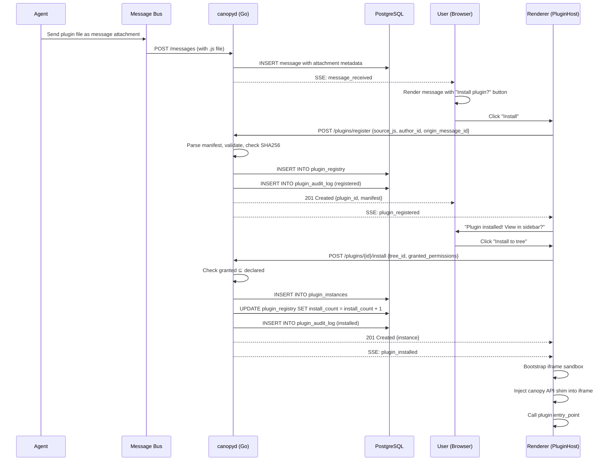
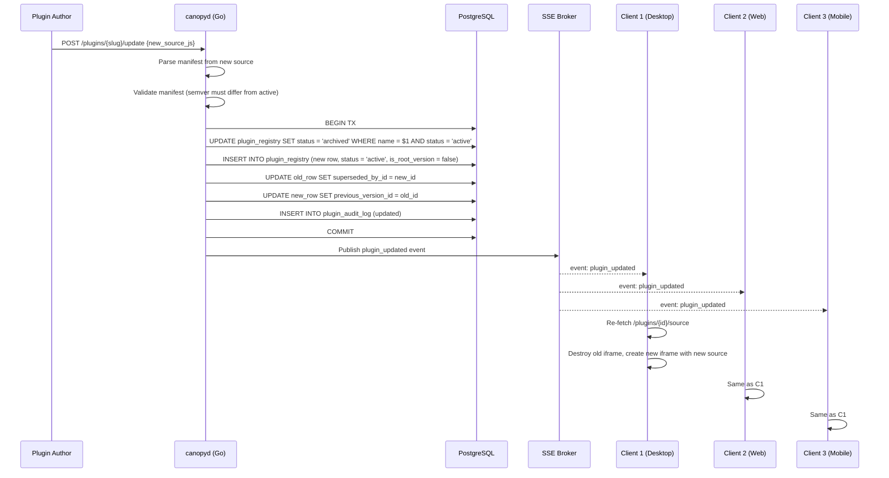

# SPEC-PL-01 — JS Plugin System

> **Status:** Spec | **Blocks:** SPEC-PL-02 (File Viewer Plugins), SPEC-PL-03 (App Card System), BE-08 (Plugin Service), FE-08 (Plugin Renderer), FE-09 (Sandbox Host)
> **References:** SPEC-DM-01, SPEC-API-02, SPEC-API-03, SPEC-TM-01, ARCHITECTURE.md §2, ARCHITECTURE.md §3, ARCHITECTURE.md §5, ARCHITECTURE.md §11

---

## 1. Purpose

Define the exact specification for Canopy's JavaScript plugin system: how agents deliver plugins, how plugins are registered, sandboxed, hot-reloaded, and uninstalled, and what API surface a plugin can call inside the sandbox. A Go worker reading this spec must implement `PluginRepo`, `PluginService`, and the install/update/rollback flow with zero clarifying questions. A TypeScript worker reading this spec must implement the sandbox host (`PluginHost`), the iframe bridge (`canopy` global), and the per-plugin renderer.

A plugin in Canopy is a single self-contained JavaScript file that embeds a JSON manifest declaring its identity, version, permissions, and render type. Plugins are delivered by agents as messages, installed by users with a single click, executed inside sandboxed iframes with capability-scoped APIs, and hot-reloaded across all connected clients when updated. The plugin system IS the foundation of Canopy's app card system (SPEC-PL-03) and is reused by file viewers (SPEC-PL-02).

---

## 2. Design Decisions

| Decision | Choice | Rationale |
|----------|--------|-----------|
| Plugin format | Single `.js` file with embedded JSON manifest (comment-prefixed) | One file = one artifact; agent can send a plugin in a single message; manifest is parseable without executing the JS |
| Manifest encoding | `/*@@canopy.manifest@@ {json} @@end@@*/` comment block at the top of the file | Survives minification unless the user explicitly strips block comments; parser does not need to execute JS |
| Manifest schema validation | Zod on client (parse), Go struct + json.Decoder on server (register) | Same schema, both languages; errors returned before any installation |
| Delivery channel | Agent sends JS file as a message attachment → user clicks "Install" in message UI | No separate upload flow; plugins ride the existing messaging protocol |
| Registration | `plugin_registry` PostgreSQL table; one row per (name, version) tuple | Version history preserved; rollback re-points active version to an older row |
| Sandbox | Sandboxed `<iframe sandbox="allow-scripts">` with `Content-Security-Policy: default-src 'none'; script-src 'self' 'unsafe-inline'` | Sandboxed iframes + CSP are the security boundary (NOT shadow DOM — per ARCHITECTURE.md §11) |
| Communication | `postMessage({type, id, payload, target}, origin)` with `target: 'host'` or `target: 'plugin:<id>'` | Standard browser API; bidirectional; origin-checked on host side |
| API surface | `canopy.data.query()`, `canopy.data.mutate()`, `canopy.notify()`, `canopy.calendar.query()`, `canopy.calendar.create()`, `canopy.network.fetch()` | Six capability buckets, each gated by one permission |
| Permission model | Declared in manifest, granted at install time, immutable until plugin is updated | User knows what they're approving; no "ask later" prompts mid-flow |
| Hot-reload | Server emits SSE `plugin_updated`; every connected client re-fetches the plugin JS and re-instantiates its iframe | One source of truth (registry); propagation is automatic; offline clients reconcile on reconnect |
| Rollback | `POST /plugins/{slug}/rollback` with `target_version`; server re-points active row | No destructive deletes; full history preserved in `plugin_registry` |
| Plugin size limit | 1 MB (server-rejected) and 1 MB (browser-served as `blob:` URL) | Keeps iframe creation snappy; prevents abuse |
| Source storage | `source_js` column on `plugin_registry` row; gzipped on the wire (Accept-Encoding: gzip) | Single round-trip for install + load; gzip brings typical plugin to <50KB over the wire |
| Plugin identity | `name` + `version` (semver). Slug derived from name. ID is server-assigned UUIDv7 | Semver is standard; UUIDv7 is time-ordered (SPEC-DM-01 §3) |
| Disabling vs Archiving | `status = 'active' \| 'disabled' \| 'archived'`. Disabled = installed but not loaded. Archived = removed from sidebar but rows preserved | Three-state model covers "installed but off", "uninstalled but recoverable" |
| Per-tree state | `plugin_instances` table for per-tree/per-user configuration (e.g., API tokens, settings) | Global plugin definition + per-tree instance state — clean separation |
| Update policy | New version with same name = new row; users get an "Update available" prompt | Never auto-update; user stays in control |
| Manifest-required fields | `name`, `version`, `description`, `permissions[]`, `render_type`, `entry_point` | Minimal but complete; everything else is optional |
| Render types | `card` (rendered as tree node), `embed` (rendered inline in message), `background` (no UI, runs continuously) | Three types cover file viewers, app cards, and background workers |
| Permission enforcement | All API calls go through `pluginPermissionGate(pluginID, permission, scope)` on the host | Single chokepoint; denied calls return `PERMISSION_DENIED` synchronously |
| Render engine | Iframe with `sandbox="allow-scripts"` + a non-trusted `srcdoc` that bootstraps the plugin | Each plugin is a separate browsing context; cannot access parent DOM or cookies |

---

## 3. PostgreSQL DDL

### 3.1 Plugin Registry Table

```sql
-- 000080_plugin_registry.up.sql

-- One row per (name, version) tuple. Full history preserved.
-- The "active" version of a plugin is identified by name + status = 'active'.
-- A given (name) can have at most one row with status = 'active' (enforced via partial unique index).
CREATE TABLE plugin_registry (
    id                  uuid        PRIMARY KEY DEFAULT uuidv7(),
    name                text        NOT NULL,           -- e.g. "csv-viewer"
    slug                text        NOT NULL,           -- e.g. "csv-viewer" (derived from name; lowercase, hyphenated)
    version             text        NOT NULL,           -- semver: "1.2.3"
    description         text        NOT NULL DEFAULT '',
    author_profile_id   uuid        NOT NULL REFERENCES profiles(id) ON DELETE RESTRICT,
    permissions         text[]      NOT NULL DEFAULT '{}',  -- subset of canonical permission set
    manifest_json       jsonb       NOT NULL,           -- full parsed manifest (including optional fields)
    source_js           text        NOT NULL,           -- the actual plugin JS (raw UTF-8)
    source_sha256       text        NOT NULL,           -- hex digest of source_js for integrity verification
    source_byte_size    integer     NOT NULL,           -- raw byte size; server enforces <1MB
    icon_url            text        NOT NULL DEFAULT '',
    status              text        NOT NULL DEFAULT 'active',  -- 'active' | 'disabled' | 'archived'
    install_count       integer     NOT NULL DEFAULT 0, -- number of plugin_instances referencing this row
    is_root_version     boolean     NOT NULL DEFAULT false,    -- true if this is the first version of this name
    superseded_by_id    uuid        REFERENCES plugin_registry(id) ON DELETE SET NULL,  -- points to newer active version
    previous_version_id uuid        REFERENCES plugin_registry(id) ON DELETE SET NULL,  -- points to older version (for rollback)
    created_at          timestamptz NOT NULL DEFAULT clock_timestamp(),
    updated_at          timestamptz NOT NULL DEFAULT clock_timestamp(),
    archived_at         timestamptz,
    CONSTRAINT chk_plugin_status
        CHECK (status IN ('active', 'disabled', 'archived')),
    CONSTRAINT chk_plugin_name
        CHECK (char_length(name) BETWEEN 1 AND 100),
    CONSTRAINT chk_plugin_version
        CHECK (version ~ '^[0-9]+\.[0-9]+\.[0-9]+(-[a-zA-Z0-9.-]+)?$'),
    CONSTRAINT chk_plugin_slug
        CHECK (slug ~ '^[a-z]([a-z0-9-]*[a-z0-9])?$'),
    CONSTRAINT chk_source_byte_size
        CHECK (source_byte_size > 0 AND source_byte_size <= 1048576),  -- 1 MB hard limit
    CONSTRAINT uq_plugin_name_version
        UNIQUE (name, version)
);

-- At most one active version per plugin name
CREATE UNIQUE INDEX idx_plugin_registry_name_active
    ON plugin_registry(name)
    WHERE status = 'active';

CREATE INDEX idx_plugin_registry_name            ON plugin_registry(name);
CREATE INDEX idx_plugin_registry_status          ON plugin_registry(status);
CREATE INDEX idx_plugin_registry_author          ON plugin_registry(author_profile_id);
CREATE INDEX idx_plugin_registry_created         ON plugin_registry(created_at DESC);
CREATE INDEX idx_plugin_registry_name_created    ON plugin_registry(name, created_at DESC);
```

### 3.2 Plugin Instances Table (Per-Tree / Per-User State)

```sql
-- 000081_plugin_instances.up.sql

-- Per-tree and per-user configuration for an installed plugin.
-- A single plugin_registry row can be installed into many trees by many users.
CREATE TABLE plugin_instances (
    id                  uuid        PRIMARY KEY DEFAULT uuidv7(),
    plugin_id           uuid        NOT NULL REFERENCES plugin_registry(id) ON DELETE CASCADE,
    tree_id             uuid,                           -- NULL = globally available to this user
    profile_id          uuid        NOT NULL REFERENCES profiles(id) ON DELETE CASCADE,
    instance_name       text        NOT NULL DEFAULT '',-- User-given display name (optional)
    settings            jsonb       NOT NULL DEFAULT '{}',  -- Per-instance settings (API keys, prefs)
    granted_permissions text[]      NOT NULL,           -- Snapshot of permissions user granted (subset of plugin's declared)
    status              text        NOT NULL DEFAULT 'active',  -- 'active' | 'paused' | 'uninstalled'
    last_invoked_at     timestamptz,
    invoke_count        integer     NOT NULL DEFAULT 0,
    created_at          timestamptz NOT NULL DEFAULT clock_timestamp(),
    updated_at          timestamptz NOT NULL DEFAULT clock_timestamp(),
    uninstalled_at      timestamptz,
    CONSTRAINT chk_instance_status
        CHECK (status IN ('active', 'paused', 'uninstalled')),
    CONSTRAINT chk_instance_name_length
        CHECK (char_length(instance_name) <= 100)
);

-- At most one install per (plugin, tree, profile) combination
CREATE UNIQUE INDEX idx_plugin_instances_unique_install
    ON plugin_instances(plugin_id, COALESCE(tree_id, '00000000-0000-0000-0000-000000000000'::uuid), profile_id)
    WHERE status != 'uninstalled';

CREATE INDEX idx_plugin_instances_plugin        ON plugin_instances(plugin_id);
CREATE INDEX idx_plugin_instances_tree          ON plugin_instances(tree_id) WHERE tree_id IS NOT NULL;
CREATE INDEX idx_plugin_instances_profile       ON plugin_instances(profile_id);
CREATE INDEX idx_plugin_instances_status        ON plugin_instances(status);
```

### 3.3 Plugin Audit Log

```sql
-- 000082_plugin_audit_log.up.sql

-- Immutable log of plugin lifecycle events. Used for compliance, debugging,
-- and "what permissions did I grant this plugin" recall.
CREATE TABLE plugin_audit_log (
    id              uuid        PRIMARY KEY DEFAULT uuidv7(),
    plugin_id       uuid        NOT NULL REFERENCES plugin_registry(id) ON DELETE CASCADE,
    instance_id     uuid        REFERENCES plugin_instances(id) ON DELETE SET NULL,
    event_type      text        NOT NULL,  -- 'registered' | 'updated' | 'installed' | 'paused' | 'resumed' | 'uninstalled' | 'rolled_back' | 'permission_changed' | 'hot_reload' | 'sandbox_error'
    actor_profile_id uuid       NOT NULL REFERENCES profiles(id) ON DELETE RESTRICT,
    metadata        jsonb       NOT NULL DEFAULT '{}',
    created_at      timestamptz NOT NULL DEFAULT clock_timestamp(),
    CONSTRAINT chk_plugin_audit_event_type
        CHECK (event_type IN (
            'registered', 'updated', 'installed', 'paused', 'resumed',
            'uninstalled', 'rolled_back', 'permission_changed',
            'hot_reload', 'sandbox_error'
        ))
);

CREATE INDEX idx_plugin_audit_plugin  ON plugin_audit_log(plugin_id, created_at DESC);
CREATE INDEX idx_plugin_audit_event   ON plugin_audit_log(event_type);
CREATE INDEX idx_plugin_audit_actor   ON plugin_audit_log(actor_profile_id);
```

### 3.4 Down Migrations

```sql
-- 000080_plugin_registry.down.sql
DROP TABLE IF EXISTS plugin_registry;

-- 000081_plugin_instances.down.sql
DROP TABLE IF EXISTS plugin_instances;

-- 000082_plugin_audit_log.down.sql
DROP TABLE IF EXISTS plugin_audit_log;
```

---

## 4. Go Structs & Repository Interfaces

### 4.1 Package Layout

```
internal/
├── plugin/
│   ├── models.go            # Plugin, PluginVersion, PluginInstance, PluginAuditEntry structs
│   ├── repo.go              # PluginRepo interface + pgx implementation
│   ├── service.go           # PluginService: install, update, rollback, hot-reload broadcast
│   ├── manifest.go          # Manifest parsing, validation, slug derivation
│   ├── permissions.go       # Permission gate, capability set, scope checks
│   └── handlers.go          # HTTP handlers for /plugins endpoints
```

### 4.2 Go Structs

```go
package plugin

import (
    "time"
    "github.com/google/uuid"
)

// ── Plugin Manifest ──────────────────────────────────────────

// PluginStatus is the lifecycle status of a plugin_registry row.
type PluginStatus string

const (
    PluginStatusActive   PluginStatus = "active"
    PluginStatusDisabled PluginStatus = "disabled"
    PluginStatusArchived PluginStatus = "archived"
)

// PluginRenderType determines how a plugin is mounted in the UI.
type PluginRenderType string

const (
    RenderTypeCard      PluginRenderType = "card"      // Rendered as a tree node
    RenderTypeEmbed     PluginRenderType = "embed"     // Rendered inline in a message
    RenderTypeBackground PluginRenderType = "background" // No UI; runs continuously
)

// Permission is a capability granted to a plugin at install time.
type Permission string

const (
    PermissionDataRead       Permission = "data_read"
    PermissionDataWrite      Permission = "data_write"
    PermissionNotification   Permission = "notification"
    PermissionCalendarRead   Permission = "calendar_read"
    PermissionCalendarWrite  Permission = "calendar_write"
    PermissionNetworkRequest Permission = "network_request"
)

// AllPermissions is the canonical set of permissions a plugin may declare.
var AllPermissions = []Permission{
    PermissionDataRead,
    PermissionDataWrite,
    PermissionNotification,
    PermissionCalendarRead,
    PermissionCalendarWrite,
    PermissionNetworkRequest,
}

// ValidPermission reports whether p is a recognized permission.
func ValidPermission(p Permission) bool {
    for _, k := range AllPermissions {
        if k == p {
            return true
        }
    }
    return false
}

// PluginManifest is the parsed JSON manifest embedded in a plugin file.
// Field names mirror the on-wire manifest exactly.
type PluginManifest struct {
    Name         string           `json:"name"          validate:"required,min=1,max=100"`
    Version      string           `json:"version"       validate:"required,semver"`
    Description  string           `json:"description"   validate:"required,max=1000"`
    Permissions  []Permission     `json:"permissions"   validate:"required,min=0,max=6,dive,oneof=..."`
    RenderType   PluginRenderType `json:"render_type"   validate:"required,oneof=card embed background"`
    EntryPoint   string           `json:"entry_point"   validate:"required,min=1,max=200"`  // e.g. "main", "index"
    IconURL      string           `json:"icon_url,omitempty"      validate:"omitempty,url"`
    Homepage     string           `json:"homepage,omitempty"      validate:"omitempty,url"`
    AuthorName   string           `json:"author_name,omitempty"   validate:"omitempty,max=100"`
    MinCanopyVer string           `json:"min_canopy_version,omitempty" validate:"omitempty,semver"`
}

// ── Plugin Registry Row ─────────────────────────────────────

// Plugin represents a single (name, version) entry in the plugin_registry table.
type Plugin struct {
    ID                uuid.UUID     `db:"id"                  json:"id"`
    Name              string        `db:"name"                json:"name"`
    Slug              string        `db:"slug"                json:"slug"`
    Version           string        `db:"version"             json:"version"`
    Description       string        `db:"description"         json:"description"`
    AuthorProfileID   uuid.UUID     `db:"author_profile_id"   json:"authorProfileId"`
    Permissions       []Permission  `db:"permissions"         json:"permissions"`
    ManifestJSON      []byte        `db:"manifest_json"       json:"manifest"`     // Full parsed manifest
    SourceJS          string        `db:"source_js"           json:"-"`             // Excluded from API responses (too large)
    SourceSHA256      string        `db:"source_sha256"       json:"sourceSha256"`
    SourceByteSize    int           `db:"source_byte_size"    json:"sourceByteSize"`
    IconURL           string        `db:"icon_url"            json:"iconUrl"`
    Status            PluginStatus  `db:"status"              json:"status"`
    InstallCount      int           `db:"install_count"       json:"installCount"`
    IsRootVersion     bool          `db:"is_root_version"     json:"isRootVersion"`
    SupersededByID    *uuid.UUID    `db:"superseded_by_id"    json:"supersededById"`
    PreviousVersionID *uuid.UUID    `db:"previous_version_id" json:"previousVersionId"`
    CreatedAt         time.Time     `db:"created_at"          json:"createdAt"`
    UpdatedAt         time.Time     `db:"updated_at"          json:"updatedAt"`
    ArchivedAt        *time.Time    `db:"archived_at"         json:"archivedAt,omitempty"`
}

// PluginVersion is a slim view of a Plugin (no source) used in list/lookup endpoints.
type PluginVersion struct {
    ID              uuid.UUID    `json:"id"`
    Name            string       `json:"name"`
    Slug            string       `json:"slug"`
    Version         string       `json:"version"`
    Description     string       `json:"description"`
    Permissions     []Permission `json:"permissions"`
    IconURL         string       `json:"iconUrl"`
    Status          PluginStatus `json:"status"`
    InstallCount    int          `json:"installCount"`
    IsRootVersion   bool         `json:"isRootVersion"`
    SupersededByID  *uuid.UUID   `json:"supersededById"`
    PreviousVersionID *uuid.UUID `json:"previousVersionId"`
    CreatedAt       time.Time    `json:"createdAt"`
}

// ── Plugin Instance ──────────────────────────────────────────

// InstanceStatus is the lifecycle status of a plugin_instance.
type InstanceStatus string

const (
    InstanceStatusActive      InstanceStatus = "active"
    InstanceStatusPaused      InstanceStatus = "paused"
    InstanceStatusUninstalled InstanceStatus = "uninstalled"
)

// PluginInstance is a per-tree/per-user installation of a plugin.
type PluginInstance struct {
    ID                 uuid.UUID      `db:"id"                   json:"id"`
    PluginID           uuid.UUID      `db:"plugin_id"            json:"pluginId"`
    TreeID             *uuid.UUID     `db:"tree_id"              json:"treeId"`         // NULL = global
    ProfileID          uuid.UUID      `db:"profile_id"           json:"profileId"`
    InstanceName       string         `db:"instance_name"        json:"instanceName"`
    Settings           []byte         `db:"settings"             json:"settings"`       // JSONB
    GrantedPermissions []Permission   `db:"granted_permissions"  json:"grantedPermissions"`
    Status             InstanceStatus `db:"status"               json:"status"`
    LastInvokedAt      *time.Time     `db:"last_invoked_at"      json:"lastInvokedAt"`
    InvokeCount        int            `db:"invoke_count"         json:"invokeCount"`
    CreatedAt          time.Time      `db:"created_at"           json:"createdAt"`
    UpdatedAt          time.Time      `db:"updated_at"           json:"updatedAt"`
    UninstalledAt      *time.Time     `db:"uninstalled_at"       json:"uninstalledAt,omitempty"`
}

// ── Plugin Audit Entry ───────────────────────────────────────

// AuditEventType enumerates all plugin_audit_log event types.
type AuditEventType string

const (
    AuditEventRegistered         AuditEventType = "registered"
    AuditEventUpdated            AuditEventType = "updated"
    AuditEventInstalled          AuditEventType = "installed"
    AuditEventPaused             AuditEventType = "paused"
    AuditEventResumed            AuditEventType = "resumed"
    AuditEventUninstalled        AuditEventType = "uninstalled"
    AuditEventRolledBack         AuditEventType = "rolled_back"
    AuditEventPermissionChanged  AuditEventType = "permission_changed"
    AuditEventHotReload          AuditEventType = "hot_reload"
    AuditEventSandboxError       AuditEventType = "sandbox_error"
)

// PluginAuditEntry is an immutable record of a plugin lifecycle event.
type PluginAuditEntry struct {
    ID            uuid.UUID      `db:"id"               json:"id"`
    PluginID      uuid.UUID      `db:"plugin_id"        json:"pluginId"`
    InstanceID    *uuid.UUID     `db:"instance_id"      json:"instanceId"`
    EventType     AuditEventType `db:"event_type"       json:"eventType"`
    ActorProfileID uuid.UUID     `db:"actor_profile_id" json:"actorProfileId"`
    Metadata      []byte         `db:"metadata"         json:"metadata"`     // JSONB
    CreatedAt     time.Time      `db:"created_at"       json:"createdAt"`
}

// ── Service Input/Output Structs ─────────────────────────────

// RegisterPluginInput carries the request to register a new plugin (or a new version of an existing one).
type RegisterPluginInput struct {
    SourceJS   string         `json:"source_js"`           // The full plugin file contents
    AuthorID   uuid.UUID      `json:"author_id"`           // Profile registering the plugin
    OriginMessageID *uuid.UUID `json:"origin_message_id,omitempty"` // Message that delivered the plugin
}

// RegisterPluginOutput carries the result of a registration.
type RegisterPluginOutput struct {
    Plugin      *Plugin      `json:"plugin"`
    IsNewVersion bool        `json:"is_new_version"`     // true if a row with this (name, version) was just created
    IsUpdate    bool         `json:"is_update"`          // true if this is a new version of an existing name
    SSEEvent    PluginSSEEvent `json:"sse_event"`
}

// InstallPluginInput carries the request to install (create an instance of) a plugin.
type InstallPluginInput struct {
    PluginID     uuid.UUID    `json:"plugin_id"`
    ProfileID    uuid.UUID    `json:"profile_id"`
    TreeID       *uuid.UUID   `json:"tree_id,omitempty"`   // NULL = global install
    GrantedPerms []Permission `json:"granted_permissions"` // Subset of plugin's declared permissions
    InstanceName string       `json:"instance_name,omitempty"`
}

// InstallPluginOutput carries the result of an installation.
type InstallPluginOutput struct {
    Instance  *PluginInstance `json:"instance"`
    Plugin    *Plugin         `json:"plugin"`             // The plugin that was installed
    SSEEvent  PluginSSEEvent  `json:"sse_event"`
}

// UpdatePluginInput carries the request to publish a new version of an existing plugin.
type UpdatePluginInput struct {
    Name      string    `json:"name"`
    SourceJS  string    `json:"source_js"`
    AuthorID  uuid.UUID `json:"author_id"`
}

// UpdatePluginOutput carries the result of an update.
type UpdatePluginOutput struct {
    OldPlugin *Plugin         `json:"old_plugin"`         // Now status = 'archived' (or 'disabled')
    NewPlugin *Plugin         `json:"new_plugin"`         // New active row
    SSEEvent  PluginSSEEvent  `json:"sse_event"`
}

// RollbackPluginInput carries the request to roll back a plugin to a previous version.
type RollbackPluginInput struct {
    Slug           string    `json:"slug"`
    TargetVersion  string    `json:"target_version"`     // Must be an existing version in the registry
    ActorProfileID uuid.UUID `json:"actor_profile_id"`
}

// RollbackPluginOutput carries the result of a rollback.
type RollbackPluginOutput struct {
    ActivePlugin   *Plugin         `json:"active_plugin"`    // Re-pointed to target version
    ArchivedPlugin *Plugin         `json:"archived_plugin"`  // Previously active version
    SSEEvent       PluginSSEEvent  `json:"sse_event"`
}

// PluginSSEEvent is the payload for plugin-related SSE events.
type PluginSSEEvent struct {
    EventType   string    `json:"event_type"`           // "plugin_registered" | "plugin_updated" | "plugin_installed" | "plugin_uninstalled" | "plugin_rolled_back" | "plugin_disabled" | "plugin_enabled" | "plugin_hot_reload"
    PluginID    uuid.UUID `json:"plugin_id"`
    PluginName  string    `json:"plugin_name"`
    Version     string    `json:"version,omitempty"`
    TreeID      *uuid.UUID `json:"tree_id,omitempty"`
    ProfileID   uuid.UUID `json:"profile_id,omitempty"`
    Timestamp   time.Time `json:"timestamp"`
    Metadata    map[string]any `json:"metadata,omitempty"`
}
```

### 4.3 Repository Interface

```go
package plugin

import (
    "context"
    "github.com/google/uuid"
)

// PluginRepo is the persistence interface for the plugin system.
type PluginRepo interface {
    // ── Registry CRUD ─────────────────────────────────────────

    // Insert adds a new plugin_registry row.
    Insert(ctx context.Context, p *Plugin) (*Plugin, error)

    // GetByID retrieves a plugin_registry row by ID. SourceJS is populated.
    GetByID(ctx context.Context, id uuid.UUID) (*Plugin, error)

    // GetBySlug returns the currently active version of a plugin by slug.
    GetBySlug(ctx context.Context, slug string) (*Plugin, error)

    // GetByNameAndVersion retrieves a specific (name, version) row. Used for rollback.
    GetByNameAndVersion(ctx context.Context, name, version string) (*Plugin, error)

    // List returns all active plugins, paginated. SourceJS is NOT populated.
    List(ctx context.Context, opts ListPluginsOpts) ([]PluginVersion, error)

    // ListByTree returns all plugins installed in a given tree (via plugin_instances).
    ListByTree(ctx context.Context, treeID uuid.UUID, profileID uuid.UUID) ([]PluginVersion, error)

    // ListByAuthor returns all plugins authored by a profile.
    ListByAuthor(ctx context.Context, authorID uuid.UUID) ([]PluginVersion, error)

    // ListVersions returns all versions of a plugin by name (full history).
    ListVersions(ctx context.Context, name string) ([]PluginVersion, error)

    // UpdateStatus changes a plugin's status (active | disabled | archived).
    UpdateStatus(ctx context.Context, id uuid.UUID, status PluginStatus) (*Plugin, error)

    // UpdateSource replaces the source JS and recomputes SHA256/byte_size.
    // Used when re-uploading the same version of a plugin (e.g., bug fix that doesn't bump semver).
    UpdateSource(ctx context.Context, id uuid.UUID, sourceJS string) (*Plugin, error)

    // SetSuperseded marks the old active row as superseded-by the new row.
    SetSuperseded(ctx context.Context, oldID, newID uuid.UUID) error

    // SetPreviousVersion links the new row to the previous active row (for rollback).
    SetPreviousVersion(ctx context.Context, newID, previousID uuid.UUID) error

    // ── Instance CRUD ─────────────────────────────────────────

    // InstallInstance creates a new plugin_instance row.
    InstallInstance(ctx context.Context, inst *PluginInstance) (*PluginInstance, error)

    // GetInstance retrieves a plugin_instance by ID.
    GetInstance(ctx context.Context, id uuid.UUID) (*PluginInstance, error)

    // ListInstances returns all instances of a plugin.
    ListInstances(ctx context.Context, pluginID uuid.UUID) ([]PluginInstance, error)

    // ListInstancesForTree returns all active instances for a tree+profile.
    ListInstancesForTree(ctx context.Context, treeID, profileID uuid.UUID) ([]PluginInstance, error)

    // UpdateInstanceStatus pauses/resumes/uninstalls an instance.
    UpdateInstanceStatus(ctx context.Context, id uuid.UUID, status InstanceStatus) (*PluginInstance, error)

    // UpdateInstanceSettings replaces the per-instance settings JSON.
    UpdateInstanceSettings(ctx context.Context, id uuid.UUID, settings []byte) (*PluginInstance, error)

    // RecordInvocation updates last_invoked_at and increments invoke_count.
    RecordInvocation(ctx context.Context, id uuid.UUID) error

    // ── Audit Log ─────────────────────────────────────────────

    // AppendAuditEntry appends an immutable entry to plugin_audit_log.
    AppendAuditEntry(ctx context.Context, entry *PluginAuditEntry) error

    // GetAuditLog returns recent audit entries for a plugin.
    GetAuditLog(ctx context.Context, pluginID uuid.UUID, limit int) ([]PluginAuditEntry, error)

    // ── Transactional helpers ────────────────────────────────

    // WithTx runs fn inside a database transaction. Used by service for multi-step ops.
    WithTx(ctx context.Context, fn func(repo PluginRepo) error) error

    // IncrementInstallCount atomically increments install_count on a registry row.
    IncrementInstallCount(ctx context.Context, id uuid.UUID) error
}

// ListPluginsOpts controls listing behavior.
type ListPluginsOpts struct {
    Cursor     *uuid.UUID
    Limit      int                  // 1-100; default 50
    Sort       string               // "created_desc" | "created_asc" | "install_desc" | "name_asc"
    Status     PluginStatus         // Filter by status; "" = all active
    AuthorID   *uuid.UUID           // Filter by author
    SearchName string               // Substring match on name (case-insensitive)
}
```

### 4.4 PluginService Interface

```go
package plugin

import (
    "context"
)

// PluginService defines the business logic for the plugin system.
// It orchestrates registry updates, instance creation, permission gates, and hot-reload broadcasts.
type PluginService interface {
    // ── Registration Flow ─────────────────────────────────────

    // Register validates a plugin source, parses the manifest, and inserts a new registry row.
    // If a plugin with the same (name, version) already exists, returns the existing row.
    // If the (name) is new, sets is_root_version = true.
    // Emits SSE `plugin_registered` on success.
    Register(ctx context.Context, input RegisterPluginInput) (*RegisterPluginOutput, error)

    // Update publishes a new version of an existing plugin. The old active version is archived.
    // Emits SSE `plugin_updated`. All connected clients re-fetch the plugin JS.
    Update(ctx context.Context, input UpdatePluginInput) (*UpdatePluginOutput, error)

    // Rollback re-points the active row of a plugin to a previous version.
    // Emits SSE `plugin_rolled_back`. Connected clients swap to the rolled-back source.
    Rollback(ctx context.Context, input RollbackPluginInput) (*RollbackPluginOutput, error)

    // Disable sets a plugin's status to 'disabled'. All instances pause.
    // Emits SSE `plugin_disabled`.
    Disable(ctx context.Context, pluginID uuid.UUID, actorID uuid.UUID) (*Plugin, error)

    // Enable restores a disabled plugin to 'active'.
    // Emits SSE `plugin_enabled`.
    Enable(ctx context.Context, pluginID uuid.UUID, actorID uuid.UUID) (*Plugin, error)

    // Archive permanently removes a plugin from the active registry. Rows preserved.
    // Emits SSE `plugin_uninstalled` (the legacy event name is retained for client compat).
    Archive(ctx context.Context, pluginID uuid.UUID, actorID uuid.UUID) error

    // ── Installation Flow ─────────────────────────────────────

    // Install creates a plugin_instance for the given (plugin, tree, profile).
    // Validates that granted_permissions is a subset of the plugin's declared permissions.
    // Emits SSE `plugin_installed`.
    Install(ctx context.Context, input InstallPluginInput) (*InstallPluginOutput, error)

    // Uninstall marks an instance as uninstalled. Plugin remains available in registry.
    // Emits SSE `plugin_uninstalled`.
    Uninstall(ctx context.Context, instanceID uuid.UUID, actorID uuid.UUID) error

    // PauseInstance sets an instance to 'paused'. Plugin remains installed but not invoked.
    PauseInstance(ctx context.Context, instanceID uuid.UUID, actorID uuid.UUID) (*PluginInstance, error)

    // ResumeInstance restores a paused instance to 'active'.
    ResumeInstance(ctx context.Context, instanceID uuid.UUID, actorID uuid.UUID) (*PluginInstance, error)

    // ── Queries ───────────────────────────────────────────────

    // GetActiveBySlug returns the currently active version of a plugin.
    GetActiveBySlug(ctx context.Context, slug string) (*Plugin, error)

    // GetVersion returns a specific (name, version) row, for rollback UI.
    GetVersion(ctx context.Context, name, version string) (*PluginVersion, error)

    // ListVersions returns the full version history of a plugin.
    ListVersions(ctx context.Context, name string) ([]PluginVersion, error)

    // ListForTree returns all plugins installed in a tree (active instances only).
    ListForTree(ctx context.Context, treeID, profileID uuid.UUID) ([]PluginVersion, error)

    // ── Permission Gate ───────────────────────────────────────

    // CheckPermission returns nil if the plugin's active instance has been granted the permission.
    // Called by the sandbox host before every API call.
    CheckPermission(ctx context.Context, pluginID uuid.UUID, perm Permission) error

    // ── Hot-Reload Broadcast ──────────────────────────────────

    // BroadcastHotReload notifies all connected clients that a plugin's source has changed.
    // Called automatically after Update, Rollback, and Disable/Enable.
    BroadcastHotReload(ctx context.Context, pluginID uuid.UUID) error
}
```

---

## 5. TypeScript Types & Zod Validation

### 5.1 Plugin Manifest Types

```typescript
// ── Plugin Manifest ──────────────────────────────────────────

export type PluginRenderType = 'card' | 'embed' | 'background';

export type PluginPermission =
  | 'data_read'
  | 'data_write'
  | 'notification'
  | 'calendar_read'
  | 'calendar_write'
  | 'network_request';

export const ALL_PERMISSIONS: readonly PluginPermission[] = [
  'data_read',
  'data_write',
  'notification',
  'calendar_read',
  'calendar_write',
  'network_request',
] as const;

export interface PluginManifest {
  name: string;
  version: string;           // semver: "1.2.3" or "1.2.3-beta.1"
  description: string;
  permissions: PluginPermission[];
  render_type: PluginRenderType;
  entry_point: string;       // e.g. "main", "index"
  icon_url?: string;
  homepage?: string;
  author_name?: string;
  min_canopy_version?: string;
}

export type PluginStatus = 'active' | 'disabled' | 'archived';
export type InstanceStatus = 'active' | 'paused' | 'uninstalled';

// ── Plugin Registry Row ──────────────────────────────────────

export interface Plugin {
  id: string;                // UUIDv7
  name: string;
  slug: string;
  version: string;
  description: string;
  authorProfileId: string;
  permissions: PluginPermission[];
  manifest: PluginManifest;  // Parsed full manifest
  sourceSha256: string;
  sourceByteSize: number;
  iconUrl: string;
  status: PluginStatus;
  installCount: number;
  isRootVersion: boolean;
  supersededById: string | null;
  previousVersionId: string | null;
  createdAt: string;         // ISO 8601
  updatedAt: string;
  archivedAt?: string;
}

// Slim view (no source, no manifest blob) for list/lookup responses
export interface PluginVersion {
  id: string;
  name: string;
  slug: string;
  version: string;
  description: string;
  permissions: PluginPermission[];
  iconUrl: string;
  status: PluginStatus;
  installCount: number;
  isRootVersion: boolean;
  supersededById: string | null;
  previousVersionId: string | null;
  createdAt: string;
}

// ── Plugin Instance ──────────────────────────────────────────

export interface PluginInstance {
  id: string;
  pluginId: string;
  treeId: string | null;     // null = global instance
  profileId: string;
  instanceName: string;
  settings: Record<string, unknown>;
  grantedPermissions: PluginPermission[];
  status: InstanceStatus;
  lastInvokedAt: string | null;
  invokeCount: number;
  createdAt: string;
  updatedAt: string;
  uninstalledAt?: string;
}

// ── Audit Entry ──────────────────────────────────────────────

export type AuditEventType =
  | 'registered'
  | 'updated'
  | 'installed'
  | 'paused'
  | 'resumed'
  | 'uninstalled'
  | 'rolled_back'
  | 'permission_changed'
  | 'hot_reload'
  | 'sandbox_error';

export interface PluginAuditEntry {
  id: string;
  pluginId: string;
  instanceId: string | null;
  eventType: AuditEventType;
  actorProfileId: string;
  metadata: Record<string, unknown>;
  createdAt: string;
}

// ── SSE Event Payload ────────────────────────────────────────

export interface PluginSSEEvent {
  event_type:
    | 'plugin_registered'
    | 'plugin_updated'
    | 'plugin_installed'
    | 'plugin_uninstalled'
    | 'plugin_rolled_back'
    | 'plugin_disabled'
    | 'plugin_enabled'
    | 'plugin_hot_reload';
  plugin_id: string;
  plugin_name: string;
  version?: string;
  tree_id?: string;
  profile_id?: string;
  timestamp: string;
  metadata?: Record<string, unknown>;
}
```

### 5.2 Zod Schemas

```typescript
import { z } from 'zod';

// ── Manifest Validation ──────────────────────────────────────

// Semver regex (matches the Go CHECK constraint)
// Allows: 1.0.0, 1.2.3, 1.0.0-beta, 1.0.0-rc.1, 1.0.0-beta.1+sha.abc123
const SEMVER_RE = /^[0-9]+\.[0-9]+\.[0-9]+(-[a-zA-Z0-9.-]+)?(\+[a-zA-Z0-9.-]+)?$/;

const PluginSlugSchema = z.string().regex(
  /^[a-z]([a-z0-9-]*[a-z0-9])?$/,
  'Slug must be lowercase, start with a letter, contain only a-z, 0-9, hyphens',
);

export const PluginPermissionSchema = z.enum([
  'data_read',
  'data_write',
  'notification',
  'calendar_read',
  'calendar_write',
  'network_request',
]);

export const PluginRenderTypeSchema = z.enum(['card', 'embed', 'background']);

export const PluginManifestSchema = z.object({
  name: z.string().min(1).max(100),
  version: z.string().regex(SEMVER_RE, 'Version must be valid semver (e.g. 1.2.3)'),
  description: z.string().min(1).max(1000),
  permissions: z.array(PluginPermissionSchema).max(6).default([]),
  render_type: PluginRenderTypeSchema,
  entry_point: z.string().min(1).max(200),
  icon_url: z.string().url().optional(),
  homepage: z.string().url().optional(),
  author_name: z.string().max(100).optional(),
  min_canopy_version: z.string().regex(SEMVER_RE).optional(),
});

// ── Registry / Instance / Audit ──────────────────────────────

export const PluginStatusSchema = z.enum(['active', 'disabled', 'archived']);

export const PluginVersionSchema = z.object({
  id: z.string().uuid(),
  name: z.string(),
  slug: PluginSlugSchema,
  version: z.string(),
  description: z.string(),
  permissions: z.array(PluginPermissionSchema),
  iconUrl: z.string().default(''),
  status: PluginStatusSchema,
  installCount: z.number().int().nonnegative(),
  isRootVersion: z.boolean(),
  supersededById: z.string().uuid().nullable(),
  previousVersionId: z.string().uuid().nullable(),
  createdAt: z.string().datetime(),
});

export const PluginSchema = PluginVersionSchema.extend({
  authorProfileId: z.string().uuid(),
  manifest: PluginManifestSchema,
  sourceSha256: z.string().regex(/^[a-f0-9]{64}$/, 'Must be SHA256 hex digest'),
  sourceByteSize: z.number().int().min(1).max(1048576),
  updatedAt: z.string().datetime(),
  archivedAt: z.string().datetime().optional(),
});

export const InstanceStatusSchema = z.enum(['active', 'paused', 'uninstalled']);

export const PluginInstanceSchema = z.object({
  id: z.string().uuid(),
  pluginId: z.string().uuid(),
  treeId: z.string().uuid().nullable(),
  profileId: z.string().uuid(),
  instanceName: z.string().max(100).default(''),
  settings: z.record(z.unknown()).default({}),
  grantedPermissions: z.array(PluginPermissionSchema),
  status: InstanceStatusSchema,
  lastInvokedAt: z.string().datetime().nullable(),
  invokeCount: z.number().int().nonnegative(),
  createdAt: z.string().datetime(),
  updatedAt: z.string().datetime(),
  uninstalledAt: z.string().datetime().optional(),
});

export const PluginAuditEntrySchema = z.object({
  id: z.string().uuid(),
  pluginId: z.string().uuid(),
  instanceId: z.string().uuid().nullable(),
  eventType: z.enum([
    'registered', 'updated', 'installed', 'paused', 'resumed',
    'uninstalled', 'rolled_back', 'permission_changed',
    'hot_reload', 'sandbox_error',
  ]),
  actorProfileId: z.string().uuid(),
  metadata: z.record(z.unknown()).default({}),
  createdAt: z.string().datetime(),
});

// ── API Request Schemas ──────────────────────────────────────

export const RegisterPluginRequestSchema = z.object({
  source_js: z.string().min(50).max(1048576, 'Plugin source must be ≤ 1 MB'),
  author_id: z.string().uuid(),
  origin_message_id: z.string().uuid().optional(),
});

export const InstallPluginRequestSchema = z.object({
  plugin_id: z.string().uuid(),
  profile_id: z.string().uuid(),
  tree_id: z.string().uuid().optional(),
  granted_permissions: z.array(PluginPermissionSchema),
  instance_name: z.string().max(100).optional(),
});

export const RollbackPluginRequestSchema = z.object({
  slug: PluginSlugSchema,
  target_version: z.string().regex(SEMVER_RE),
  actor_profile_id: z.string().uuid(),
});
```

### 5.3 Manifest Extraction (Parser)

```typescript
// Plugin file format:
//   /*@@canopy.manifest@@
//   { "name": "csv-viewer", "version": "1.0.0", ... }
//   @@end@@ */
//   ... actual plugin code ...

const MANIFEST_START = '/*@@canopy.manifest@@';
const MANIFEST_END = '@@end@@*/';

export function extractManifest(sourceJS: string): { manifest: string; rest: string } {
  const startIdx = sourceJS.indexOf(MANIFEST_START);
  if (startIdx === -1) {
    throw new Error('Plugin manifest not found. Expected /*@@canopy.manifest@@ ... @@end@@*/');
  }
  const endMarkerIdx = sourceJS.indexOf(MANIFEST_END, startIdx);
  if (endMarkerIdx === -1) {
    throw new Error('Manifest end marker @@end@@*/ not found');
  }
  const manifest = sourceJS
    .substring(startIdx + MANIFEST_START.length, endMarkerIdx)
    .trim();
  return { manifest, rest: sourceJS.substring(endMarkerIdx + MANIFEST_END.length) };
}
```

---

## 6. Plugin Installation Flow

### 6.1 Sequence: Agent Delivers Plugin → User Installs



### 6.2 Install Endpoint

```
POST /plugins/register
Authorization: Bearer <token>
Content-Type: application/json

{
  "source_js": "/*@@canopy.manifest@@ {...} @@end@@*/\nfunction main() { ... }",
  "author_id": "0191a8b2-7fff-7000-9000-000000000042",
  "origin_message_id": "0191a8b2-7fff-7000-9000-000000000201"
}
```

| Status | Code | Description |
|--------|------|-------------|
| 201 | `PLUGIN_REGISTERED` | New plugin row created |
| 200 | `PLUGIN_VERSION_EXISTS` | Plugin with same (name, version) already registered; returns existing row |
| 400 | `INVALID_MANIFEST` | Manifest block missing or JSON malformed |
| 400 | `MANIFEST_VALIDATION_FAILED` | Zod schema validation failed (specific field errors in `details`) |
| 413 | `PLUGIN_TOO_LARGE` | Source JS exceeds 1 MB |
| 422 | `INVALID_SEMVER` | Version is not valid semver |
| 422 | `INVALID_PERMISSION` | Permissions contains an unknown permission |

### 6.3 Install to Tree Endpoint

```
POST /plugins/{plugin_id}/install
Authorization: Bearer <token>
Content-Type: application/json

{
  "profile_id": "0191a8b2-7fff-7000-9000-000000000042",
  "tree_id": "0191a8b2-7fff-7000-9000-000000000001",   // optional; omit for global
  "granted_permissions": ["data_read", "notification"],
  "instance_name": "My CSV Viewer"                       // optional
}
```

| Status | Code | Description |
|--------|------|-------------|
| 201 | `PLUGIN_INSTALLED` | New instance created |
| 409 | `PLUGIN_ALREADY_INSTALLED` | Same (plugin, tree, profile) already has an active instance |
| 403 | `PERMISSION_NOT_DECLARED` | `granted_permissions` is not a subset of the plugin's declared permissions |
| 404 | `PLUGIN_NOT_FOUND` | Plugin ID does not exist |
| 410 | `PLUGIN_DISABLED` | Plugin is currently disabled |
| 410 | `PLUGIN_ARCHIVED` | Plugin has been archived |

### 6.4 Plugin Sidebar UI

The plugin sidebar lives in the same panel as the topic sidebar (SPEC-TM-05) but as a distinct tab. It shows three sections:

```
┌─────────────────────────────────┐
│ 🧩 Plugins (Active: 12)  ⋮     │  ← Header row
├─────────────────────────────────┤
│ 🔍 Search plugins...            │
├─────────────────────────────────┤
│                                 │
│ 🧩 CSV Viewer       v1.2.3  ●  │  ← Active plugin card
│    View CSV files in tree       │
│                                 │
│ 🧩 JSON Pretty      v2.0.0  ●  │
│    Format JSON messages         │
│                                 │
│ 🧩 Calendar         v0.9.1  ●  │
│    Google Calendar integration  │
│                                 │
│ ...                             │
│                                 │
│ ─── Disabled (2) ───     [▼]   │  ← Collapsible disabled section
│                                 │
│ 🧩 Code Runner      v1.0.0  ○  │  ← Disabled (dimmed)
│                                 │
│ ─── Updates Available (1) ───  │  ← Newer version exists
│                                 │
│ ⬆️ JSON Pretty     v1.5 → v2.0 │  ← Update available badge
│    [Update] [View Changelog]    │
│                                 │
└─────────────────────────────────┘
```

Each plugin card shows: name, version, status icon (●/○), short description, install count, and a context menu (right-click or ⋯ icon) with: Update, View Versions, Rollback to..., Configure, Disable, Uninstall.

---

## 7. Plugin Sandbox Architecture

### 7.1 Sandbox Construction

Each plugin instance gets its own sandboxed `<iframe>`. The iframe is created in the renderer's React tree using a stable `name` and a `srcDoc` attribute that bootstraps the plugin.

```html
<iframe
  name="canopy-plugin-{pluginId}-{instanceId}"
  sandbox="allow-scripts"
  referrerpolicy="no-referrer"
  srcDoc='<!doctype html>
    <html>
    <head>
      <meta charset="utf-8" />
      <meta http-equiv="Content-Security-Policy"
        content="default-src '\''none'\'';
                 script-src '\''unsafe-inline'\'';
                 style-src '\''unsafe-inline'\'';
                 connect-src none;
                 img-src data: https:;
                 font-src data:;" />
      <title>{pluginName}</title>
    </head>
    <body>
      <div id="root"></div>
      <script>
        // canopy API shim is injected here by the host (see §7.3)
        (function() {
          // Plugin source is evaluated in this scope
          {sourceJS}
        })();
      </script>
    </body>
    </html>'
  style="width:100%; height:100%; border:0; display:block;"
/>
```

**Why `sandbox="allow-scripts"` (not `allow-same-origin`):**

- The plugin cannot read cookies, `localStorage`, or `sessionStorage` of the parent origin.
- The plugin cannot make same-origin XHR/fetch calls (parent's API is at a different origin via `postMessage`).
- The plugin cannot navigate the top-level browsing context.
- The plugin can still use `postMessage` to communicate with the host.
- The CSP further restricts: no `connect-src` (no XHR/fetch to anywhere), no `default-src` (no implicit resources).

**Per-plugin nonce:** Every `postMessage` from the plugin to the host carries a per-session nonce. The host rejects messages whose nonce does not match the iframe's expected nonce. This prevents another iframe on the page (e.g., a chat embed) from impersonating the plugin.

### 7.2 Communication Protocol

Every message between host and plugin has the same envelope:

```typescript
interface PluginMessage {
  type: string;             // e.g. "api_call", "api_response", "init", "event"
  id: string;               // UUIDv4; matches request/response pairs
  target: 'host' | string;  // 'host' for plugin→host; 'plugin:{pluginId}:{instanceId}' for host→plugin
  payload: unknown;         // Type depends on `type`
  nonce: string;            // Per-session; validated by host
  timestamp: number;        // Date.now()
}
```

**Host → Plugin messages:**

| Type | Payload | Meaning |
|------|---------|---------|
| `init` | `{ pluginId, instanceId, manifest, grantedPermissions, theme }` | Sent immediately after iframe loads. The plugin's entry point is called after this. |
| `update` | `{ manifest, sourceJS }` | Hot-reload: new manifest + source. Plugin should re-initialize. |
| `permission_granted` | `{ permission }` | Confirmation that a permission was granted mid-session (rare; usually granted at install). |
| `permission_denied` | `{ permission, reason }` | Notification that a previously-granted permission has been revoked. |
| `context_update` | `{ treeId, activeNodeId, contextManifest }` | The host's current conversation context changed. |
| `destroy` | `{}` | Plugin is being unmounted (navigating away, uninstalling, disabling). |

**Plugin → Host messages:**

| Type | Payload | Meaning |
|------|---------|---------|
| `ready` | `{ entryPoint: string }` | Plugin has loaded and wants entry_point called. Sent in response to `init`. |
| `api_call` | `{ method, params }` | Plugin wants to call a Canopy API (e.g. `canopy.data.query`). Host validates permissions and forwards. |
| `api_response` | `{ id, result? , error? }` | Host's response to an `api_call`. Matches the `id` from the original call. |
| `event` | `{ event, data }` | Plugin-emitted event (e.g. user clicked something). Host may log, surface as a notification, or update tree state. |
| `error` | `{ code, message, stack? }` | Plugin error. Host logs to plugin_audit_log and shows a "Plugin crashed" UI. |
| `resize` | `{ width, height }` | Plugin wants the iframe resized. Host updates the iframe container. |

### 7.3 Host-Injected `canopy` API Shim

When the host calls `iframe.contentWindow.postMessage(...)` to send the `init` message, it ALSO injects a `canopy` global into the iframe via the same `init` payload (the plugin reads it from the message handler). The shim is a JavaScript object that wraps `postMessage` to the host:

```javascript
// This code runs inside the plugin's iframe
// It is NOT the plugin's source — it's the shim that the host has installed

(function() {
  const PLUGIN_ID = '__PLUGIN_ID__';
  const INSTANCE_ID = '__INSTANCE_ID__';
  const NONCE = '__NONCE__';
  const PARENT_ORIGIN = '__PARENT_ORIGIN__';

  let nextId = 1;
  const pendingCalls = new Map();

  window.addEventListener('message', (event) => {
    if (event.origin !== PARENT_ORIGIN) return;
    const msg = event.data;
    if (msg.target !== `plugin:${PLUGIN_ID}:${INSTANCE_ID}`) return;
    if (msg.nonce !== NONCE) return;

    if (msg.type === 'api_response' && pendingCalls.has(msg.id)) {
      const { resolve, reject } = pendingCalls.get(msg.id);
      pendingCalls.delete(msg.id);
      if (msg.error) reject(new CanopyAPIError(msg.error.code, msg.error.message));
      else resolve(msg.result);
    }
  });

  class CanopyAPIError extends Error {
    constructor(code, message) {
      super(message);
      this.code = code;
    }
  }

  function callAPI(method, params) {
    return new Promise((resolve, reject) => {
      const id = `call-${nextId++}`;
      pendingCalls.set(id, { resolve, reject });
      window.parent.postMessage({
        type: 'api_call',
        id,
        target: 'host',
        payload: { method, params },
        nonce: NONCE,
        timestamp: Date.now(),
      }, PARENT_ORIGIN);

      // Timeout after 30s
      setTimeout(() => {
        if (pendingCalls.has(id)) {
          pendingCalls.delete(id);
          reject(new CanopyAPIError('TIMEOUT', `API call ${method} timed out`));
        }
      }, 30000);
    });
  }

  // ── Public API ────────────────────────────────────────────
  window.canopy = {
    version: '1.0.0',
    pluginId: PLUGIN_ID,
    instanceId: INSTANCE_ID,

    data: {
      query: (params) => callAPI('data.query', params),
      mutate: (params) => callAPI('data.mutate', params),
    },
    notify: (params) => callAPI('notify', params),
    calendar: {
      query: (params) => callAPI('calendar.query', params),
      create: (params) => callAPI('calendar.create', params),
    },
    network: {
      fetch: (params) => callAPI('network.fetch', params),
    },

    on: (event, handler) => { /* register host event listener */ },
    emit: (event, data) => { /* postMessage('event', {event, data}) to host */ },

    error: CanopyAPIError,
  };

  // Tell host we're ready
  window.parent.postMessage({
    type: 'ready',
    id: 'ready-' + Date.now(),
    target: 'host',
    payload: { entryPoint: '__ENTRY_POINT__' },
    nonce: NONCE,
    timestamp: Date.now(),
  }, PARENT_ORIGIN);
})();
```

### 7.4 Permission Gate

Every `api_call` from a plugin is intercepted by the host (`PluginHost.onApiCall`):

```typescript
async function onApiCall(pluginId: string, instanceId: string, method: string, params: unknown): Promise<unknown> {
  // 1. Look up the instance
  const instance = await pluginRepo.GetInstance(ctx, instanceId);
  if (instance.Status !== 'active') {
    throw new CanopyAPIError('PLUGIN_DISABLED', `Plugin instance is ${instance.status}`);
  }

  // 2. Map method to required permission
  const requiredPerm = methodToPermission(method);
  if (requiredPerm === null) {
    throw new CanopyAPIError('API_NOT_FOUND', `Unknown API method: ${method}`);
  }

  // 3. Check granted permissions
  if (!instance.grantedPermissions.includes(requiredPerm)) {
    // Log denied attempt
    await pluginRepo.AppendAuditEntry(ctx, {
      PluginID: pluginId,
      InstanceID: &instanceId,
      EventType: 'sandbox_error',
      ActorProfileID: instance.ProfileID,
      Metadata: jsonb(`{"method": "${method}", "missing_permission": "${requiredPerm}"}`),
    });
    throw new CanopyAPIError('PERMISSION_DENIED', `Plugin not granted permission: ${requiredPerm}`);
  }

  // 4. Quota check
  const quotaOK = await checkQuota(ctx, instanceId, requiredPerm);
  if (!quotaOK) {
    throw new CanopyAPIError('QUOTA_EXCEEDED', `Quota exceeded for ${requiredPerm}`);
  }

  // 5. Dispatch to the actual handler
  return dispatchAPICall(ctx, instance, method, params);
}
```

### 7.5 API Method → Permission Map

| Method | Permission | Description |
|--------|-----------|-------------|
| `data.query({ collection, filter, limit })` | `data_read` | Read from Canopy's data model (e.g., tree nodes, topics). Returns a paginated result. |
| `data.mutate({ collection, op, document })` | `data_write` | Insert, update, or delete a document. `op` is `'insert' \| 'update' \| 'delete'`. |
| `notify({ title, body, level, actions? })` | `notification` | Show a system notification (desktop, in-app, or push to mobile). |
| `calendar.query({ start, end, calendar? })` | `calendar_read` | Read calendar events in a date range. Returns list of events. |
| `calendar.create({ title, start, end, attendees? })` | `calendar_write` | Create a new calendar event. |
| `network.fetch({ url, method, headers?, body? })` | `network_request` | Make an outbound HTTP request. Subject to CORS and an allowlist. |

### 7.6 Render Type Mounting

| Render Type | Mount Point | Lifecycle |
|-------------|------------|-----------|
| `card` | Rendered as a tree node (extends the node's `node_type = 'card'`). Visible in tree view. | Instantiated when its tree node is rendered. Destroyed when navigated away. |
| `embed` | Rendered inline in a message body. Replaces/extends a code block or rich content area. | Instantiated when the message is scrolled into view. Destroyed on scroll out (with state preserved). |
| `background` | No UI. Runs continuously in a hidden iframe (`width: 1px; height: 1px; visibility: hidden`). | Instantiated on plugin install. Persists until plugin is uninstalled. |

---

## 8. Hot-Reload Protocol

### 8.1 Hot-Reload Sequence



### 8.2 Hot-Reload Fetch

When a client receives a `plugin_updated` SSE event for a plugin it has installed:

1. Client calls `GET /plugins/{id}/source` with `Accept-Encoding: gzip`.
2. Server returns the new source JS, gzipped, with `Cache-Control: no-store` and `Content-Type: application/javascript`.
3. Client receives the source, creates a SHA256 of it, and compares to the `sourceSha256` in the SSE event's metadata. If they differ, the client logs a warning and retries.
4. Client destroys the current iframe (sends a `destroy` message first; waits 100ms for graceful cleanup; then removes from DOM).
5. Client constructs a new iframe with the new source (see §7.1) and mounts it in the same DOM position.
6. The new iframe's `init` payload includes the new manifest.

### 8.3 Rollback

Rollback is hot-reload that swaps the active version to a prior one:

```
POST /plugins/{slug}/rollback
Authorization: Bearer <token>
Content-Type: application/json

{
  "target_version": "1.2.3",
  "actor_profile_id": "0191a8b2-7fff-7000-9000-000000000042"
}
```

The server:

1. Looks up the row with `(name, version = target_version)`. If not found → `PLUGIN_VERSION_NOT_FOUND`.
2. Inside a transaction: sets current active to `archived`, sets target version to `active`, links the two via `previous_version_id` and `superseded_by_id`.
3. Emits `plugin_rolled_back` SSE event.
4. Connected clients perform the same hot-reload flow as §8.2.

### 8.4 Update Prompt UI

When a user has an older version of a plugin installed and a newer version becomes active (via a different user's update, or an agent pushing a new version), the client shows a non-blocking banner:

```
┌─────────────────────────────────────┐
│ ⬆️ Update available: CSV Viewer     │
│ v1.2.3 (installed) → v1.5.0 (new)   │
│ [Update now] [Changelog] [Dismiss]  │
└─────────────────────────────────────┘
```

`Update now` → `POST /plugins/{id}/install` with the new plugin ID (which re-installs over the existing instance, updating `granted_permissions` if they changed).
`Dismiss` → stored in local storage; banner hidden until next version.
`Changelog` → opens a modal showing the manifest diffs between installed and new versions (permissions added/removed, render type changed, entry point changed).

---

## 9. Plugin API Surface (Detailed)

### 9.1 `canopy.data.query({ collection, filter, limit?, cursor? })`

**Permission:** `data_read`
**Quota:** 100 calls/min/instance

```typescript
interface DataQueryParams {
  collection: 'nodes' | 'edges' | 'topics' | 'trees' | 'messages' | 'cards';
  filter?: Record<string, unknown>;   // Field equality / IN / range filters
  limit?: number;                      // Default 50, max 500
  cursor?: string;                     // Opaque pagination token
}

interface DataQueryResult<T = unknown> {
  items: T[];
  nextCursor: string | null;
  hasMore: boolean;
  total: number;                       // Approximate, may be stale by 5s
}
```

**Example:**
```javascript
const { items, nextCursor } = await canopy.data.query({
  collection: 'nodes',
  filter: { treeId: '0191a8b2-7fff-7000-9000-000000000001', nodeType: 'message' },
  limit: 20,
});
```

### 9.2 `canopy.data.mutate({ collection, op, document, id? })`

**Permission:** `data_write`
**Quota:** 30 calls/min/instance

```typescript
type DataMutateOp = 'insert' | 'update' | 'delete';

interface DataMutateParams {
  collection: 'nodes' | 'cards' | 'topics' | 'plugin_settings';
  op: DataMutateOp;
  document?: Record<string, unknown>;  // For insert/update
  id?: string;                          // For update/delete
}

interface DataMutateResult {
  id: string;
  op: DataMutateOp;
  collection: string;
  timestamp: string;
}
```

**Restrictions:** Plugins cannot `update` or `delete` a node they did not create (tracked via `metadata.created_by_plugin_id`). The server enforces this.

### 9.3 `canopy.notify({ title, body, level, actions? })`

**Permission:** `notification`
**Quota:** 10 calls/min/instance

```typescript
type NotificationLevel = 'info' | 'success' | 'warning' | 'error';

interface NotificationParams {
  title: string;                        // 1-100 chars
  body: string;                         // 1-2000 chars (markdown)
  level: NotificationLevel;
  actions?: Array<{                     // Max 3 actions per notification
    label: string;                      // 1-30 chars
    type: 'primary' | 'secondary' | 'destructive';
    payload: Record<string, unknown>;   // Sent back to plugin when clicked
  }>;
  ttl_seconds?: number;                 // Auto-dismiss after N seconds; default 10
  persistent?: boolean;                 // Sticky notification
}
```

Notifications are scoped to the user's currently active devices (desktop notification, in-app banner, mobile push if enabled).

### 9.4 `canopy.calendar.query({ start, end, calendar? })`

**Permission:** `calendar_read`
**Quota:** 30 calls/min/instance

```typescript
interface CalendarQueryParams {
  start: string;                        // ISO 8601
  end: string;                          // ISO 8601
  calendar?: string;                    // Calendar ID; default: primary
  max_results?: number;                 // Default 100, max 1000
}

interface CalendarEvent {
  id: string;
  calendar: string;
  title: string;
  description: string;
  start: string;
  end: string;
  allDay: boolean;
  attendees: Array<{ email: string; name?: string; responseStatus: string }>;
  location?: string;
  metadata: Record<string, unknown>;
}
```

### 9.5 `canopy.calendar.create({ title, start, end, attendees?, description?, location? })`

**Permission:** `calendar_write`
**Quota:** 10 calls/min/instance

```typescript
interface CalendarCreateParams {
  title: string;                        // 1-200 chars
  start: string;                        // ISO 8601
  end: string;                          // ISO 8601
  attendees?: Array<{ email: string }>; // Max 100 attendees
  description?: string;                 // 0-5000 chars
  location?: string;                    // 0-500 chars
  reminders?: Array<{ minutes: number; method: 'email' | 'popup' }>;
}
```

### 9.6 `canopy.network.fetch({ url, method, headers?, body? })`

**Permission:** `network_request`
**Quota:** 60 calls/min/instance
**Restrictions:** Requests are proxied through the canopyd server. The server:

1. Validates the URL is HTTPS (no `http://`, no `file://`, etc.)
2. Applies a per-plugin URL allowlist (configurable in plugin settings, default: `*` with same-origin disabled)
3. Strips sensitive headers (`Cookie`, `Authorization` unless explicitly allowlisted)
4. Enforces a 30-second request timeout
5. Enforces a 10 MB response body cap

```typescript
interface NetworkFetchParams {
  url: string;                          // Must be HTTPS
  method?: 'GET' | 'POST' | 'PUT' | 'PATCH' | 'DELETE';
  headers?: Record<string, string>;     // Subset of standard headers
  body?: string | Record<string, unknown>;
  timeout_ms?: number;                  // Default 30000, max 30000
}

interface NetworkFetchResult {
  status: number;
  statusText: string;
  headers: Record<string, string>;
  body: string;                         // Always text (caller parses if needed)
  durationMs: number;
}
```

---

## 10. Error Catalog

### 10.1 Registration Errors

| Error Code | HTTP | Condition |
|------------|------|-----------|
| `PLUGIN_NOT_FOUND` | 404 | Plugin ID does not exist in registry |
| `PLUGIN_VERSION_NOT_FOUND` | 404 | (name, version) tuple does not exist |
| `PLUGIN_NAME_NOT_FOUND` | 404 | Plugin name has no versions in registry |
| `INVALID_MANIFEST` | 400 | Manifest block missing or JSON unparseable |
| `MANIFEST_VALIDATION_FAILED` | 400 | Zod validation failed; `details` array lists per-field errors |
| `INVALID_SEMVER` | 422 | `version` field is not valid semver |
| `INVALID_PERMISSION` | 422 | `permissions` array contains an unknown permission |
| `INVALID_RENDER_TYPE` | 422 | `render_type` is not one of `card`, `embed`, `background` |
| `PLUGIN_TOO_LARGE` | 413 | Source JS exceeds 1 MB (1,048,576 bytes) |
| `PLUGIN_SLUG_CONFLICT` | 409 | Slug derived from name already in use by a different plugin (rare; only if rename attempted) |

### 10.2 Lifecycle Errors

| Error Code | HTTP | Condition |
|------------|------|-----------|
| `PLUGIN_DISABLED` | 410 | Plugin is currently disabled; cannot install/load |
| `PLUGIN_ARCHIVED` | 410 | Plugin has been archived; cannot install |
| `PLUGIN_ALREADY_INSTALLED` | 409 | Same (plugin, tree, profile) already has an active instance |
| `PLUGIN_NOT_INSTALLED` | 404 | No active instance found for (plugin, tree, profile) |
| `VERSION_CONFLICT` | 409 | Updating a plugin with the same version that already exists |
| `INSTALL_FAILED` | 500 | Database error during install transaction |
| `HOT_RELOAD_FAILED` | 502 | SSE broker failed to deliver hot-reload event to all clients |
| `ROLLBACK_FAILED` | 500 | Target version is not in the plugin's history |
| `UPDATE_FAILED` | 500 | New version validation failed or DB error |

### 10.3 Runtime / Sandbox Errors

| Error Code | HTTP | Condition |
|------------|------|-----------|
| `PERMISSION_DENIED` | 403 | Plugin does not have the permission required for the API call |
| `API_NOT_FOUND` | 404 | Plugin called an unknown `canopy.*` method |
| `SANDBOX_ERROR` | 500 | Iframe failed to initialize (CSP violation, parse error, etc.) |
| `PLUGIN_CRASHED` | 500 | Plugin's entry point threw an unhandled exception |
| `QUOTA_EXCEEDED` | 429 | Plugin exceeded rate limit for the API method (per-minute quota) |
| `TIMEOUT` | 504 | API call did not respond within 30s |

### 10.4 Validation Errors (sub-codes)

| Error Code | HTTP | Condition |
|------------|------|-----------|
| `PLUGIN_NAME_TOO_SHORT` | 400 | Manifest `name` is empty or > 100 chars |
| `PLUGIN_NAME_TOO_LONG` | 400 | Manifest `name` > 100 chars |
| `PLUGIN_DESCRIPTION_TOO_LONG` | 400 | Manifest `description` > 1000 chars |
| `PLUGIN_ENTRY_POINT_MISSING` | 400 | Manifest `entry_point` is empty |
| `PLUGIN_ICON_URL_INVALID` | 400 | `icon_url` is set but not a valid URL |
| `PLUGIN_PERMISSIONS_TOO_MANY` | 400 | More than 6 permissions requested |
| `PERMISSION_NOT_DECLARED` | 403 | `granted_permissions` includes a permission not in the plugin's manifest |

---

## 11. Edge Cases

| # | Case | Expected Behavior |
|---|------|-------------------|
| EC-1 | Same plugin name registered by two different authors | First registration wins; second gets `VERSION_CONFLICT` only if semver matches. Different semver from different author → both rows exist; users see "Two plugins with this name" warning. |
| EC-2 | Two clients install the same plugin at the same time | Each client gets its own instance row (per profile). No conflict. |
| EC-3 | Plugin update published while user is viewing it | Client receives `plugin_updated`; old iframe is sent `destroy`, then replaced. New manifest is sent in the `init` payload. State is NOT preserved (plugins must persist via `canopy.data.mutate`). |
| EC-4 | Plugin crashes on load (entry point throws) | Host catches error, logs to `plugin_audit_log` as `sandbox_error`, displays "Plugin crashed" UI with stack trace and "Report to author" button. Plugin is not disabled automatically. |
| EC-5 | Plugin update requests new permissions not in original | Update is allowed; user is re-prompted on next instance launch ("This update requests new permissions: calendar_write. [Approve] [Deny]"). If denied, plugin remains at old version. |
| EC-6 | Plugin with no manifest block | Server returns `INVALID_MANIFEST` (400). Client UI: "This file doesn't appear to be a Canopy plugin." |
| EC-7 | Plugin JS > 1 MB | Server returns `PLUGIN_TOO_LARGE` (413). Client UI: "Plugin exceeds 1 MB size limit. Contact author." |
| EC-8 | Two plugins with circular `import` or `require` | Each plugin runs in its own iframe, so true circular imports are impossible. If both plugins call each other's host APIs via `canopy.network.fetch`, this is allowed but no semantic guarantee is made. |
| EC-9 | Plugin declares `data_write` but only writes to its own settings | Allowed; the gate is permission-based, not action-based. Plugin still gets `data_write` and can mutate anything. |
| EC-10 | Plugin tries to read another plugin's settings via `canopy.data.query({ collection: 'plugin_settings', filter: { pluginId: '<other-id>' } })` | `data_read` permission is per-plugin (the calling plugin's). Cross-plugin reads are denied at the handler level with `PERMISSION_DENIED`. |
| EC-11 | Same plugin name across different trees | Global (tree_id = NULL) and per-tree instances coexist. Tree-scoped instance takes precedence when the user is in that tree. |
| EC-12 | Plugin installed with empty `granted_permissions` | Allowed; plugin loads but every API call returns `PERMISSION_DENIED`. Useful for "view-only" plugins. |
| EC-13 | Network request to a private IP (`http://192.168.1.10`) | Server blocks non-HTTPS URLs and RFC1918 ranges. Returns `NETWORK_FORBIDDEN` (in `PLUGIN_NOT_FOUND` family). |
| EC-14 | Plugin calls `canopy.notify` 100 times in 1 minute | First 10 succeed (quota), next 90 return `QUOTA_EXCEEDED`. Counter resets every minute. |
| EC-15 | Host disconnects from SSE and reconnects mid-update | Client receives `plugin_updated` twice (once from broker replay, once from live event). Client deduplicates by `(plugin_id, version)`. |
| EC-16 | Concurrent rollback + update on same plugin | Server serializes via row-level lock on `plugin_registry.name`. Second operation sees the new state and either no-ops (rollback to current version) or fails (update to old version). |
| EC-17 | Plugin name with Unicode (e.g., `データビューア`) | Allowed; slug is generated by transliteration + lowercasing. If transliteration fails, slug uses hash of name. |
| EC-18 | User grants fewer permissions than plugin declares | Allowed; plugin loads but API calls requiring withheld permissions return `PERMISSION_DENIED`. Plugin is responsible for graceful degradation. |
| EC-19 | Plugin source contains `eval()` or `Function()` | Allowed (not stripped). Sandbox CSP already blocks network exfiltration. Plugin's responsibility to not `eval` untrusted input. |
| EC-20 | Plugin iframe takes > 10s to send `ready` message | Host assumes plugin is hung; sends `destroy` and logs `sandbox_error` to audit log. Iframe is removed. |
| EC-21 | User uninstalls a plugin while another user is using it | Uninstall is local (sets instance status = 'uninstalled' for that profile). Other users' instances are untouched. |
| EC-22 | Plugin's icon URL is unreachable | Plugin loads with default icon (gray box). No error. |
| EC-23 | Plugin manifest declares a `render_type` that doesn't match what the code does | No validation possible; render type is a UI hint. Mismatches cause display issues, not errors. |
| EC-24 | Two plugins with same name + same version (race condition) | DB unique constraint `uq_plugin_name_version` rejects the second insert. First registration wins; second gets `VERSION_CONFLICT`. |
| EC-25 | Plugin declares `network_request` but uses `connect-src` in inline CSP to call home | The iframe's CSP `connect-src none` blocks all network requests from inside the iframe. The `canopy.network.fetch` proxy is the only path. |

---

## 12. Testing

### 12.1 Backend Test Scenarios

| # | Scenario | Setup | Expected |
|---|----------|-------|----------|
| 1 | Register valid plugin | Manifest is well-formed; source is 10KB JS | 201, plugin row created with `is_root_version = true`, audit log `registered` entry |
| 2 | Register with invalid manifest | Manifest JSON malformed | 400 `INVALID_MANIFEST`; no row created |
| 3 | Register with missing required field | Manifest omits `entry_point` | 400 `MANIFEST_VALIDATION_FAILED`; details lists `entry_point` error |
| 4 | Register with invalid semver | `version: "1.2"` | 400 `MANIFEST_VALIDATION_FAILED`; details lists `version` semver error |
| 5 | Register with unknown permission | `permissions: ["quantum_compute"]` | 422 `INVALID_PERMISSION` |
| 6 | Register oversized plugin | 2 MB JS file | 413 `PLUGIN_TOO_LARGE` |
| 7 | Register duplicate (name, version) | Existing plugin "csv-viewer@1.0.0" | 200 `PLUGIN_VERSION_EXISTS`; returns existing row; no new audit log entry |
| 8 | Update existing plugin | Author updates "csv-viewer" with new version "1.1.0" | 201; old row archived, new row active; `plugin_updated` SSE emitted; `previous_version_id` linked |
| 9 | Update with same version | Same (name, version) re-uploaded | 409 `VERSION_CONFLICT` |
| 10 | Install plugin to tree | Active plugin, no existing instance | 201; instance created; `install_count` incremented; `plugin_installed` SSE |
| 11 | Install same plugin twice | Same (plugin, tree, profile) | 409 `PLUGIN_ALREADY_INSTALLED` |
| 12 | Install with permission not declared | Plugin declares only `data_read`; request grants `data_write` | 403 `PERMISSION_NOT_DECLARED` |
| 13 | Install disabled plugin | Plugin status = 'disabled' | 410 `PLUGIN_DISABLED` |
| 14 | Install archived plugin | Plugin status = 'archived' | 410 `PLUGIN_ARCHIVED` |
| 15 | Pause and resume instance | Install plugin, then pause, then resume | Status: active → paused → active; `plugin_paused`/`plugin_resumed` SSE events |
| 16 | Uninstall plugin | Install, then uninstall | Instance status = 'uninstalled'; `install_count` decremented; `plugin_uninstalled` SSE; plugin_registry row preserved |
| 17 | Rollback to previous version | Plugin at v2.0.0 with v1.5.0 in history | 200; v2.0.0 archived, v1.5.0 active; `plugin_rolled_back` SSE |
| 18 | Rollback to non-existent version | Target version not in plugin's history | 400 `ROLLBACK_FAILED` |
| 19 | Disable plugin | Active plugin | Status = 'disabled'; all instances paused; `plugin_disabled` SSE |
| 20 | Enable plugin | Disabled plugin | Status = 'active'; instances resume; `plugin_enabled` SSE |
| 21 | Hot-reload event propagation | Update plugin; verify SSE broker | All clients subscribed to `plugin.{id}.events` receive `plugin_updated` within 100ms |
| 22 | List plugins with pagination | 100 active plugins; request `limit=20` | Returns 20 + `nextCursor`; second call with cursor returns next 20 |
| 23 | List plugins by tree | Install 3 plugins to tree; query | Returns 3 plugin versions |
| 24 | List plugin versions | Plugin "csv-viewer" with 5 versions | Returns 5 PluginVersion entries, sorted by created_at DESC |
| 25 | Permission check on API call | Plugin with `data_read` calls `data.mutate` | Audit log entry `sandbox_error`; `PERMISSION_DENIED` returned to plugin |
| 26 | Plugin name conflict across authors | Two authors register "csv-viewer" with different semver | Both rows created; UI shows "Two plugins with this name" warning |
| 27 | Concurrent register race | Two parallel `POST /plugins/register` for same (name, version) | Exactly one succeeds; other gets `VERSION_CONFLICT` |
| 28 | Audit log immutability | Insert audit log entry; attempt UPDATE | UPDATE fails (no UPDATE permission); row is immutable |
| 29 | Manifest SHA256 integrity | Compute SHA256 of source on register | Stored `source_sha256` matches computed value; client re-verifies on fetch |
| 30 | Tree-scoped vs global instance | Install plugin globally (tree_id=NULL) and to tree T1 | Two instances; per-tree takes precedence when user is in T1 |

### 12.2 Frontend Test Scenarios

| # | Scenario | Expected |
|---|----------|----------|
| 1 | Render plugin card in tree | Plugin with `render_type: 'card'` appears as a tree node with its iframe rendered inside the node body |
| 2 | Plugin sandbox initialization | When user navigates to a card plugin, iframe is created with `sandbox="allow-scripts"`, CSP injected, `canopy` shim available |
| 3 | postMessage communication | Plugin calls `canopy.data.query({...})`; iframe postMessage reaches host; host returns response; plugin receives Promise resolution |
| 4 | Plugin update hot-reload | `plugin_updated` SSE arrives; old iframe destroyed; new iframe created with new source; `init` payload has new manifest |
| 5 | Plugin crash recovery | Plugin entry point throws; host shows "Plugin crashed" UI with stack trace; "Disable" and "Uninstall" buttons available |
| 6 | Permission prompt UI | First-time install shows permission list: "This plugin requests: data_read, network_request. [Approve] [Deny]" |
| 7 | Update with new permissions | Plugin update adds `calendar_write`; user is re-prompted: "Update requests new permissions. [Approve] [Deny] [View Changelog]" |
| 8 | Plugin uninstall cleanup | Iframe is destroyed; instance row marked uninstalled; plugin no longer in sidebar; `canopy` shim is removed from iframe |
| 9 | Render type: embed | Plugin with `render_type: 'embed'` renders inline within a message body; preserves surrounding message formatting |
| 10 | Render type: background | Plugin with `render_type: 'background'` creates hidden iframe at top-left corner; no visible UI; can send notifications |
| 11 | Plugin sidebar shows install count | Plugin with 47 installs shows "47 installs" in card subtitle |
| 12 | Plugin sidebar sort options | Sort by "name_asc" / "name_desc" / "install_desc" / "recent" works; sort preference persists in local storage |
| 13 | Network request CORS handling | Plugin calls `canopy.network.fetch('https://api.example.com')`; host proxies; returns result; cross-origin plugin CORS is irrelevant |
| 14 | Quota exceeded UI | Plugin hits quota; user sees toast: "Plugin exceeded rate limit (data_read: 100/min)" |
| 15 | Disabled plugin cannot load | Plugin status = 'disabled'; user clicks card; UI shows "Plugin disabled. [Enable] [Uninstall]" |
| 16 | Two plugins with same name in sidebar | Both shown with version badges: "CSV Viewer v1.5.0 (Author A) / v2.0.0 (Author B)" |
| 17 | Plugin source fetch with gzip | `GET /plugins/{id}/source` with `Accept-Encoding: gzip` returns gzipped body; client decompresses; integrity check via SHA256 |
| 18 | Rollback confirmation modal | User clicks "Rollback" in context menu; modal shows "Rollback to v1.5.0? This will deactivate v2.0.0. [Confirm] [Cancel]" |

---

## 13. SSE Event Specifications

All plugin SSE events follow the envelope defined in SPEC-API-01. Events are published to the channel `plugin.{plugin_id}.events`.

### 13.1 Event Catalog

```typescript
// Event: plugin_registered
// Fired when a new plugin is first registered.
{
  event: 'plugin_registered',
  data: {
    plugin_id: "0191a8b2-7fff-7000-9000-000000000301",
    plugin_name: "csv-viewer",
    version: "1.0.0",
    author_profile_id: "0191a8b2-7fff-7000-9000-000000000042",
    is_root_version: true,
    permissions: ["data_read", "notification"],
    render_type: "card",
    timestamp: "2026-07-22T00:00:00Z"
  }
}

// Event: plugin_updated
// Fired when a new version of an existing plugin is published.
{
  event: 'plugin_updated',
  data: {
    plugin_id: "0191a8b2-7fff-7000-9000-000000000302",  // New row
    plugin_name: "csv-viewer",
    version: "1.1.0",
    previous_plugin_id: "0191a8b2-7fff-7000-9000-000000000301",
    previous_version: "1.0.0",
    superseded_plugin_id: "0191a8b2-7fff-7000-9000-000000000301",
    source_sha256: "abc123...",
    timestamp: "2026-07-22T00:30:00Z"
  }
}

// Event: plugin_installed
// Fired when a user installs a plugin into a tree.
{
  event: 'plugin_installed',
  data: {
    plugin_id: "0191a8b2-7fff-7000-9000-000000000301",
    instance_id: "0191a8b2-7fff-7000-9000-000000000401",
    plugin_name: "csv-viewer",
    version: "1.0.0",
    tree_id: "0191a8b2-7fff-7000-9000-000000000001",
    profile_id: "0191a8b2-7fff-7000-9000-000000000042",
    granted_permissions: ["data_read", "notification"],
    timestamp: "2026-07-22T00:35:00Z"
  }
}

// Event: plugin_uninstalled
// Fired when a user uninstalls a plugin instance.
{
  event: 'plugin_uninstalled',
  data: {
    plugin_id: "0191a8b2-7fff-7000-9000-000000000301",
    instance_id: "0191a8b2-7fff-7000-9000-000000000401",
    tree_id: "0191a8b2-7fff-7000-9000-000000000001",
    profile_id: "0191a8b2-7fff-7000-9000-000000000042",
    timestamp: "2026-07-22T00:40:00Z"
  }
}

// Event: plugin_rolled_back
// Fired when a plugin is rolled back to a previous version.
{
  event: 'plugin_rolled_back',
  data: {
    plugin_id: "0191a8b2-7fff-7000-9000-000000000301",  // Now active
    plugin_name: "csv-viewer",
    version: "1.0.0",
    superseded_plugin_id: "0191a8b2-7fff-7000-9000-000000000302",  // Now archived
    superseded_version: "1.1.0",
    actor_profile_id: "0191a8b2-7fff-7000-9000-000000000042",
    timestamp: "2026-07-22T00:45:00Z"
  }
}

// Event: plugin_disabled
// Fired when a plugin is disabled by the author or admin.
{
  event: 'plugin_disabled',
  data: {
    plugin_id: "0191a8b2-7fff-7000-9000-000000000301",
    plugin_name: "csv-viewer",
    version: "1.0.0",
    actor_profile_id: "0191a8b2-7fff-7000-9000-000000000042",
    reason: "author_request",
    timestamp: "2026-07-22T00:50:00Z"
  }
}

// Event: plugin_enabled
// Fired when a disabled plugin is re-enabled.
{
  event: 'plugin_enabled',
  data: {
    plugin_id: "0191a8b2-7fff-7000-9000-000000000301",
    plugin_name: "csv-viewer",
    version: "1.0.0",
    actor_profile_id: "0191a8b2-7fff-7000-9000-000000000042",
    timestamp: "2026-07-22T00:55:00Z"
  }
}

// Event: plugin_hot_reload
// Fired after a successful hot-reload broadcast (Update, Rollback, Enable).
{
  event: 'plugin_hot_reload',
  data: {
    plugin_id: "0191a8b2-7fff-7000-9000-000000000301",
    plugin_name: "csv-viewer",
    version: "1.1.0",
    source_sha256: "abc123...",
    timestamp: "2026-07-22T01:00:00Z"
  }
}
```

### 13.2 Client-Side Consumption

When a client receives a plugin SSE event:

1. **Deduplication:** If the event has a `(plugin_id, version)` already seen in the last 60s, ignore. (Belt-and-suspenders against broker replay.)
2. **Source fetch:** For `plugin_updated` and `plugin_rolled_back`, immediately fetch the new source via `GET /plugins/{id}/source` with `Accept-Encoding: gzip`.
3. **Integrity check:** Compute SHA256 of the fetched source; compare to `source_sha256` in the event. If mismatch, log error and retry.
4. **Iframe rebuild:** Destroy old iframe (graceful `destroy` message, 100ms wait, then `iframe.remove()`), create new iframe with new source.
5. **State refresh:** Re-render the sidebar/plugin card to reflect the new version/status.

---

## 14. API Endpoints Summary

| Method | Path | Description | Returns |
|--------|------|-------------|---------|
| `POST` | `/plugins/register` | Register a new plugin or new version | `RegisterPluginOutput` |
| `GET` | `/plugins` | List all active plugins (paginated) | `{ plugins: PluginVersion[], pagination }` |
| `GET` | `/plugins/{id}` | Get a specific plugin (with full manifest) | `Plugin` |
| `GET` | `/plugins/{id}/source` | Fetch the plugin's source JS (gzipped) | `application/javascript` |
| `GET` | `/plugins/slug/{slug}` | Get the active version of a plugin by slug | `Plugin` |
| `GET` | `/plugins/{name}/versions` | List all versions of a plugin by name | `PluginVersion[]` |
| `POST` | `/plugins/{id}/install` | Install a plugin into a tree or globally | `InstallPluginOutput` |
| `POST` | `/plugins/{slug}/update` | Publish a new version | `UpdatePluginOutput` |
| `POST` | `/plugins/{slug}/rollback` | Roll back to a previous version | `RollbackPluginOutput` |
| `POST` | `/plugins/{id}/disable` | Disable a plugin (pauses all instances) | `Plugin` |
| `POST` | `/plugins/{id}/enable` | Re-enable a disabled plugin | `Plugin` |
| `POST` | `/plugins/{id}/archive` | Archive a plugin (preserves rows) | `{}` |
| `POST` | `/plugins/instances/{id}/pause` | Pause a specific instance | `PluginInstance` |
| `POST` | `/plugins/instances/{id}/resume` | Resume a paused instance | `PluginInstance` |
| `POST` | `/plugins/instances/{id}/uninstall` | Uninstall a specific instance | `{}` |
| `GET` | `/plugins/instances/{id}` | Get an instance | `PluginInstance` |
| `GET` | `/trees/{tree_id}/plugins` | List plugins installed in a tree | `PluginVersion[]` |
| `GET` | `/profiles/{profile_id}/plugins` | List plugins installed by a profile | `PluginVersion[]` |
| `GET` | `/plugins/{id}/audit` | Get audit log for a plugin | `PluginAuditEntry[]` |

---

## 15. Hilo Impact

### What depends on this component:

| Component | Depends On | Reason |
|-----------|-----------|--------|
| SPEC-PL-02 (File Viewer Plugins) | This spec | File viewers are a plugin subset; reuse the manifest, sandbox, and registry |
| SPEC-PL-03 (App Card System) | This spec | App cards are plugins with `render_type: 'card'`; card storage extends `nodes.metadata` with plugin reference |
| BE-08 (Plugin Service) | This spec | `PluginService` implementation in Go |
| FE-08 (Plugin Renderer) | This spec | React component that mounts the iframe and shims the `canopy` API |
| FE-09 (Sandbox Host) | This spec | `PluginHost` class managing iframe lifecycle, postMessage routing, permission gates |
| AGENT-02 (Context Compiler) | This spec | Plugin cards become first-class DAG nodes; context compiler includes their data |
| SPEC-API-01 (SSE Event Stream) | This spec | All plugin events delivered via SSE |
| SPEC-API-02 (Tree CRUD) | This spec | `tree_id` foreign key on `plugin_instances`; tree existence validation |
| SPEC-API-03 (Node CRUD) | This spec | Plugin cards become tree nodes; node metadata references plugin instance |

### What this component depends on:

| Component | Required By | Reason |
|-----------|------------|--------|
| SPEC-DM-01 (Tree Node & Edge DDL) | This spec | `nodes` table for plugin card storage; `uuidv7()` for IDs |
| SPEC-DM-04 (User & Profile Model) | This spec | `profiles` table for `author_profile_id` and `profile_id` foreign keys |
| SPEC-API-01 (SSE Event Stream) | This spec | Event delivery mechanism for hot-reload and lifecycle |
| SPEC-API-02 (Tree CRUD) | This spec | Tree existence validation for plugin installation |
| SPEC-API-03 (Node CRUD) | This spec | Plugin card node creation/lookup |
| SPEC-API-07 (Error Catalog) | This spec | All `PLUGIN_*` error codes registered in the central error catalog |
| SPEC-TM-01 (Topic Data Model) | This spec | Plugin topic reference count for sidebar |
| ARCHITECTURE.md §2 (Stack) | This spec | Go + pgx + React/TypeScript stack |
| ARCHITECTURE.md §3 (Data) | This spec | Storage layer decisions (PostgreSQL authoritative) |
| ARCHITECTURE.md §5 (Security) | This spec | Sandboxed iframes + CSP security model (NOT shadow DOM) |
| ARCHITECTURE.md §11 (Roadmap) | This spec | Plugin system is "Phase 3c" in the roadmap |

### Hilo Dependency Graph (relevant subset)

```
ARCHITECTURE.md
   │
   ├── SPEC-DM-01 ─┐
   ├── SPEC-DM-04 ─┤
   ├── SPEC-API-01 ─┼──> SPEC-PL-01 ──> SPEC-PL-02 (File Viewers)
   ├── SPEC-API-02 ─┤            │
   ├── SPEC-API-03 ─┤            ├──> SPEC-PL-03 (App Cards)
   ├── SPEC-API-07 ─┤            │
   └── SPEC-TM-01  ─┘            │
                                 │
                          ┌──────┴───────┐
                          │              │
                    BE-08 (Service)  FE-08 (Renderer)
                                     FE-09 (Sandbox)
```

---

## 16. Version History

| Version | Date | Author | Changes |
|---------|------|--------|---------|
| 1.0 | 2026-07-22 | Hermes Foreman | Initial spec. Plugin manifest format, registry schema, sandbox architecture, hot-reload protocol, plugin API surface, communication protocol, error catalog (37 codes), edge cases (25), 30 backend + 18 frontend test scenarios. Cross-references SPEC-DM-01, SPEC-API-01/02/03/07, SPEC-TM-01, SPEC-PL-02, SPEC-PL-03, ARCHITECTURE.md. |
