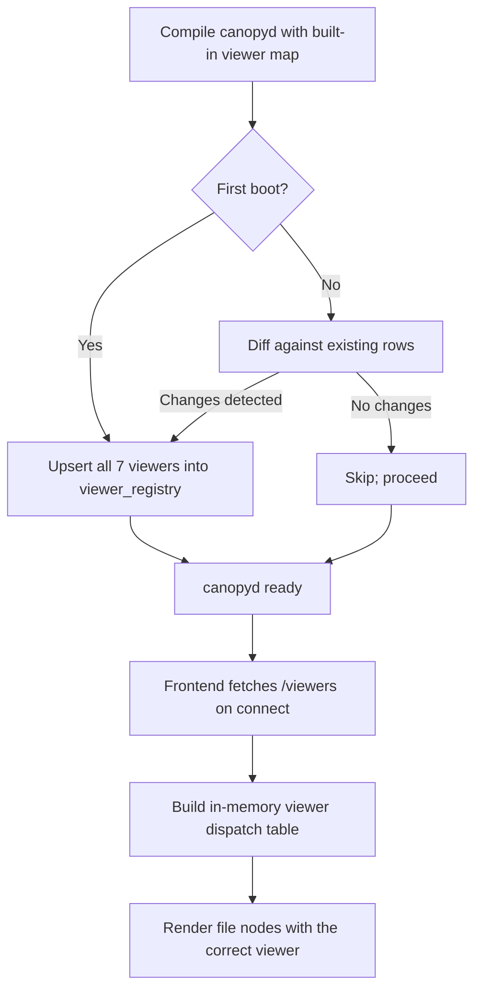
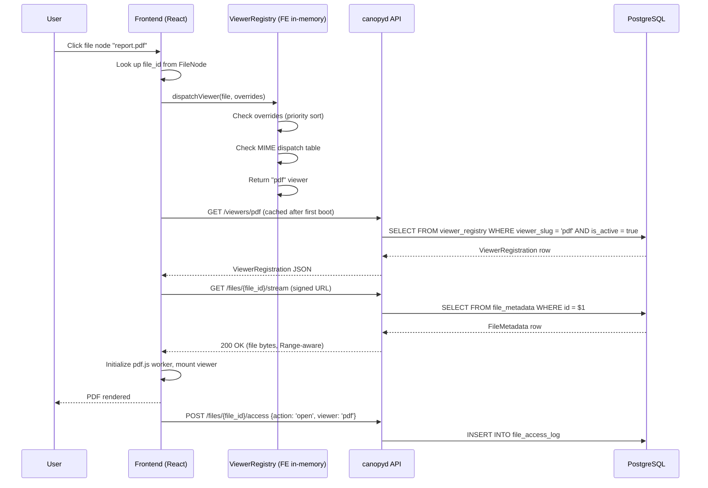

# SPEC-PL-02 — Built-in File Viewers

> **Status:** Spec | **Blocks:** BE-04 (Node Service — file nodes), BE-06 (Sync Engine — file sync), FE-03 (Tree Rendering — file node rendering), FE-08 (Plugin Renderer — viewer sandbox host), SPEC-PL-03 (App Card System)
> **References:** SPEC-PL-01 (JS Plugin System), SPEC-DM-01, SPEC-DM-02, SPEC-DM-04, SPEC-API-01, SPEC-API-02, SPEC-API-03, SPEC-API-07, ARCHITECTURE.md §2, ARCHITECTURE.md §3, ARCHITECTURE.md §5, ARCHITECTURE.md §11

---

## 1. Purpose

Define the exact specification for Canopy's built-in file viewers: the seven first-class viewers (PDF, Images, Code, CSV/Spreadsheet, Markdown, JSON, Audio/Video) that ship compiled into the `canopyd` binary and the frontend bundle, plus the file-attachment model that governs how messages reference files (by hash reference into the Hermes filesystem, or by upload into the Hermes knowledge base).

Built-in viewers are NOT plugins. They are part of Canopy itself. They share a contract with the plugin system (SPEC-PL-01) — they reuse the sandboxed iframe infrastructure, the postMessage envelope, the permission gate, and the SSE event channel — but they are compiled, versioned, and shipped with `canopyd`, not delivered by agents as `.js` files. A new built-in viewer is a code change in the `hermes-canopy` repo, not a registry row.

The seven viewers are:

1. **PDF** — `pdf.js` (~2 MB bundled, not lazy-loaded)
2. **Images** — lightbox + zoom (pan, pinch, rotate)
3. **Code** — Monaco Editor with syntax highlighting for 20+ languages (~5 MB lazy-loaded)
4. **CSV / Spreadsheet** — handsontable grid component (~500 KB lazy-loaded)
5. **Markdown** — GitHub-Flavored Markdown with tables, code blocks, task lists, math (KaTeX)
6. **JSON** — collapsible tree view with search and copy
7. **Audio / Video** — HTML5 `<audio>` / `<video>` with custom controls

A Go worker reading this spec must implement `FileMetadataRepo`, `ViewerRegistryRepo`, `FileAccessLogRepo`, `FileResolver`, and `FileViewerService` with zero clarifying questions. A TypeScript worker reading this spec must implement `ViewerHost`, `ViewerRegistry`, the per-viewer renderer components, the file-fetch client, and the lightbox/keyboard-navigation system.

The file-attachment model defines two paths: **by reference** (file already exists in the Hermes filesystem; one canonical copy referenced by SHA-256 hash) and **by upload** (new file uploaded into the Hermes knowledge base). Both paths converge on a single `file_metadata` row that the viewers consume.

---

## 2. Design Decisions

| Decision | Choice | Rationale |
|----------|--------|-----------|
| Viewer classification | First-class built-ins, not plugins | Built-ins ship with `canopyd`; no install step; cannot be disabled; versioned with the binary |
| Sandbox reuse | Reuse SPEC-PL-01 sandboxed-iframe infrastructure | One security model to audit; built-ins and plugins share the same `iframe sandbox="allow-scripts"` + CSP boundary |
| New render type | `fullscreen` (in addition to PL-01's `card` / `embed` / `background`) | File viewers occupy the right panel and cannot fit a `card` node; `fullscreen` is the dedicated mount class |
| File type detection | MIME type → extension → magic-byte sniff | MIME is the primary signal; extension is the fallback for ambiguous files; magic bytes resolve text-vs-binary conflicts |
| Viewer dispatch | Static `MIME_TO_VIEWER` table compiled into binary | O(1) lookup; no plugin-style registry resolution; adding a viewer requires a code change |
| Extensibility | Config-file override of default viewer mappings | Admins can reroute `.txt` to the code viewer without recompiling; per-profile, per-tree overrides allowed |
| File deduplication | SHA-256 content hash; `file_metadata` rows are 1:1 with content | Same bytes = same row; messages hold FKs, not blobs; reference count on each row |
| Attachment by reference | File already in Hermes FS → reference by hash, no copy | Storage efficiency; single source of truth |
| Attachment by upload | New file → stream into Hermes KB, compute hash, dedup | Uploaded bytes join the same hash-keyed namespace as referenced files |
| PDF viewer | `pdf.js` bundled eagerly in main chunk (~2 MB) | PDFs are the most common "review" action; lazy-loading adds 100-300 ms latency to every open |
| Code viewer | Monaco lazy-loaded as a separate chunk (~5 MB) | Monaco is heavy; only loaded when user opens a code file |
| CSV viewer | `handsontable` lazy-loaded (~500 KB) | Only loaded for CSV/TSV/spreadsheet files |
| Image thumbnail | Server-generated 200 px WebP, streamed over SSE on node update | Tree sidebar shows image previews without downloading the full file |
| Text-based formats | Code, Markdown, JSON, CSV — client-side rendering from file content fetched via API | No server-side render pass; works offline once cached |
| Binary formats | PDF, audio, video — streamed via signed blob URLs | Direct-to-media; preserves streaming; browser handles buffering |
| Image lightbox | Inline first; click opens fullscreen lightbox | Inline preview keeps the file's context visible |
| File content cache | IndexedDB via the existing offline layer | First fetch cached; subsequent reads work offline |
| Large file policy | Files >50 MB stream with progressive loading indicator; UI never blocks | pdf.js, `<video>`, `<audio>` handle streaming natively |
| Unsupported formats | Fallback to "download only" UI with file metadata + size + hash | Never silently fail; always offer the raw file |
| Performance budget — PDF | <2 s to first page for <10 MB files | Measured on a 4-core mid-2018 laptop; flag if exceeded |
| Performance budget — JSON tree | 10 000+ keys with no perceptible lag | Virtualize the tree; collapse-on-load; depth limit 8 |
| Performance budget — Code | Monaco ready in <1 s on cached chunk, <3 s on cold load | Cold load hits CDN edge in the install; cached load is instant |
| Viewer configuration | JSON file at `~/.canopy/viewer-config.json` with viewer mappings, theme overrides, feature flags | Replaces hard-coded behavior without recompile; hot-reloadable on save |
| Viewer registry storage | Single `viewer_registry` PostgreSQL table seeded by `canopyd` on first boot | One row per built-in viewer; `source` column is empty (compiled in); rows are immutable after install |
| File metadata storage | `file_metadata` table; one row per unique (sha256, profile_id) tuple | Profile-scoped dedup; same bytes uploaded by two profiles = two rows |
| Access logging | `file_access_log` table; append-only | Audit trail for "who viewed what when"; powers the recents list |
| Per-viewer permissions | Built-ins inherit no plugin permissions; sandbox is read-only by default | Built-ins are trusted code; they cannot mutate the data model |
| Lifecycle | Viewers are not installable, updatable, rollback-able, or archivable | They are part of the binary; version is the `canopyd` version |
| Build-time version | `viewer_registry.version` column pinned to `canopyd` version at compile time | Downgrades only happen via binary downgrade |
| CSP for built-in viewers | `default-src 'none'; script-src 'self' 'unsafe-inline'; img-src data: blob: https:; media-src blob:; connect-src 'self'` | Tighter than plugins: built-ins cannot make arbitrary network requests |
| Keyboard navigation | `j`/`k` (next/prev file in folder), `Enter` (open), `Esc` (close), `+`/`-` (zoom), `[`/`]` (rotate), `?` (help overlay) | Power-user speed; consistent across viewers |
| Accessibility | ARIA roles, focus traps in lightbox, screen-reader announcements on view state changes | Compliance baseline; not optional |
| File size hard limits | 500 MB single file; 5 GB per knowledge-base profile | Prevents resource exhaustion; server-side enforced |

---

## 3. PostgreSQL DDL

### 3.1 File Metadata Table

```sql
-- 000090_file_metadata.up.sql
--
-- One row per unique file content (by SHA-256) per profile.
-- The same bytes uploaded by two profiles = two rows.
-- file_metadata is the canonical "this is what file X looks like" record.
CREATE TABLE file_metadata (
    id                  uuid        PRIMARY KEY DEFAULT uuidv7(),
    profile_id          uuid        NOT NULL REFERENCES profiles(id) ON DELETE CASCADE,
    sha256              text        NOT NULL,            -- hex digest of full file content
    byte_size           bigint      NOT NULL,            -- raw byte count
    mime_type           text        NOT NULL,            -- server-detected MIME (via magic bytes)
    declared_mime       text        NOT NULL DEFAULT '', -- MIME the uploader declared (may differ)
    filename            text        NOT NULL,            -- original filename (preserved exactly)
    extension           text        NOT NULL DEFAULT '', -- lowercase, no dot: 'pdf', 'ts', 'tsx'
    storage_path        text        NOT NULL,            -- relative path in hermes-kb storage root
    storage_kind        text        NOT NULL DEFAULT 'hermes_kb', -- 'hermes_kb' | 'hermes_fs_ref' | 'external'
    source_kind         text        NOT NULL DEFAULT 'upload',  -- 'upload' | 'reference' | 'agent_message' | 'import'
    source_message_id   uuid,                           -- if uploaded via a message attachment
    source_external_url text,                            -- if storage_kind = 'external'
    is_text             boolean     NOT NULL DEFAULT false, -- server classified as text format
    is_binary           boolean     NOT NULL DEFAULT false,
    is_viewable         boolean     NOT NULL DEFAULT true,  -- false = download-only
    viewer_hint         text        NOT NULL DEFAULT '',     -- e.g. 'pdf', 'code', 'image' — server-detected viewer slug
    thumbnail_path      text        NOT NULL DEFAULT '',     -- relative path to generated thumbnail (images only)
    thumbnail_sha256    text        NOT NULL DEFAULT '',
    preview_text        text        NOT NULL DEFAULT '',     -- first 8 KB of text files (server-extracted)
    metadata_json       jsonb       NOT NULL DEFAULT '{}',  -- type-specific (PDF page count, image dims, audio duration, etc.)
    reference_count     integer     NOT NULL DEFAULT 1,     -- number of messages/edges pointing at this row
    last_accessed_at    timestamptz,
    access_count        integer     NOT NULL DEFAULT 0,
    quarantined         boolean     NOT NULL DEFAULT false, -- true if virus scan (future) flagged it
    created_at          timestamptz NOT NULL DEFAULT clock_timestamp(),
    updated_at          timestamptz NOT NULL DEFAULT clock_timestamp(),
    deleted_at          timestamptz,
    CONSTRAINT chk_storage_kind
        CHECK (storage_kind IN ('hermes_kb', 'hermes_fs_ref', 'external')),
    CONSTRAINT chk_source_kind
        CHECK (source_kind IN ('upload', 'reference', 'agent_message', 'import')),
    CONSTRAINT chk_byte_size
        CHECK (byte_size > 0 AND byte_size <= 536870912), -- 500 MB hard limit
    CONSTRAINT chk_sha256
        CHECK (sha256 ~ '^[a-f0-9]{64}$'),
    CONSTRAINT chk_mime_type
        CHECK (char_length(mime_type) BETWEEN 1 AND 200),
    CONSTRAINT chk_filename
        CHECK (char_length(filename) BETWEEN 1 AND 1000)
);

-- One canonical row per (profile, sha256). Different profiles can have the same content.
CREATE UNIQUE INDEX idx_file_metadata_profile_sha
    ON file_metadata(profile_id, sha256)
    WHERE deleted_at IS NULL;

CREATE INDEX idx_file_metadata_sha             ON file_metadata(sha256);
CREATE INDEX idx_file_metadata_profile         ON file_metadata(profile_id);
CREATE INDEX idx_file_metadata_mime            ON file_metadata(mime_type);
CREATE INDEX idx_file_metadata_extension       ON file_metadata(extension);
CREATE INDEX idx_file_metadata_viewer_hint     ON file_metadata(viewer_hint);
CREATE INDEX idx_file_metadata_created         ON file_metadata(created_at DESC);
CREATE INDEX idx_file_metadata_last_accessed   ON file_metadata(last_accessed_at DESC NULLS LAST);
CREATE INDEX idx_file_metadata_source_message  ON file_metadata(source_message_id) WHERE source_message_id IS NOT NULL;
```

### 3.2 Viewer Registry Table

```sql
-- 000091_viewer_registry.up.sql
--
-- One row per built-in viewer compiled into canopyd.
-- Seeded on first boot from a static Go map (see internal/fileviewer/builtin_viewers.go).
-- Rows are immutable after install; the only mutator is a canopyd version bump that
-- rewrites the table contents in one transaction.
CREATE TABLE viewer_registry (
    id                  uuid        PRIMARY KEY DEFAULT uuidv7(),
    viewer_slug         text        NOT NULL,           -- 'pdf' | 'image' | 'code' | 'csv' | 'markdown' | 'json' | 'audio_video'
    version             text        NOT NULL,           -- semver; pinned to canopyd build
    canopyd_version     text        NOT NULL,           -- e.g. '0.4.2'
    display_name        text        NOT NULL,           -- 'PDF' | 'Code Editor' | 'Markdown' | etc.
    description         text        NOT NULL DEFAULT '',
    icon_url            text        NOT NULL DEFAULT '',
    render_type         text        NOT NULL DEFAULT 'fullscreen',
    supports_mime       text[]      NOT NULL,           -- e.g. {'application/pdf'}
    supports_extensions text[]      NOT NULL DEFAULT '{}', -- e.g. {'pdf'}
    supports_viewer_hint text[]     NOT NULL DEFAULT '{}',
    required_capabilities text[]   NOT NULL DEFAULT '{}', -- empty for built-ins (always allowed)
    bundle_path         text        NOT NULL DEFAULT '', -- relative to canopyd web root; '' means compile-time
    bundle_byte_size    integer     NOT NULL DEFAULT 0,
    bundle_sha256       text        NOT NULL DEFAULT '',
    min_canopyd_version text        NOT NULL,           -- lowest canopyd version that supports this viewer
    deprecation_notice  text        NOT NULL DEFAULT '',
    is_active           boolean     NOT NULL DEFAULT true,
    installed_at        timestamptz NOT NULL DEFAULT clock_timestamp(),
    CONSTRAINT chk_render_type_viewer
        CHECK (render_type IN ('fullscreen', 'embed', 'card')),
    CONSTRAINT chk_viewer_slug
        CHECK (viewer_slug ~ '^[a-z][a-z0-9_]*$'),
    CONSTRAINT chk_viewer_version
        CHECK (version ~ '^[0-9]+\.[0-9]+\.[0-9]+(-[a-zA-Z0-9.-]+)?$'),
    CONSTRAINT uq_viewer_slug_version
        UNIQUE (viewer_slug, version)
);

CREATE UNIQUE INDEX idx_viewer_registry_slug_active
    ON viewer_registry(viewer_slug)
    WHERE is_active = true;

CREATE INDEX idx_viewer_registry_active          ON viewer_registry(is_active);
CREATE INDEX idx_viewer_registry_canopyd_version ON viewer_registry(canopyd_version);
CREATE INDEX idx_viewer_registry_installed       ON viewer_registry(installed_at DESC);
```

### 3.3 File Access Log

```sql
-- 000092_file_access_log.up.sql
--
-- Append-only audit trail of every viewer render. Used for:
--   - "Recently viewed" lists
--   - Quota / abuse detection
--   - "Who accessed what" compliance queries
--   - Telemetry on viewer popularity
CREATE TABLE file_access_log (
    id              uuid        PRIMARY KEY DEFAULT uuidv7(),
    file_id         uuid        NOT NULL REFERENCES file_metadata(id) ON DELETE CASCADE,
    profile_id      uuid        NOT NULL REFERENCES profiles(id) ON DELETE RESTRICT,
    tree_id         uuid,                           -- tree where the view occurred (nullable)
    node_id         uuid,                           -- node where the view was triggered (nullable)
    viewer_slug     text        NOT NULL,           -- which viewer rendered
    action          text        NOT NULL,           -- 'open' | 'download' | 'thumbnail_fetch' | 'preview_text' | 'stream_start' | 'stream_end' | 'error'
    duration_ms     integer,                        -- for stream_end; how long the view lasted
    byte_offset     bigint,                         -- for streaming content; current byte position
    client_info     jsonb       NOT NULL DEFAULT '{}', -- user agent, viewport size, etc.
    error_code      text,                           -- if action = 'error'
    created_at      timestamptz NOT NULL DEFAULT clock_timestamp(),
    CONSTRAINT chk_action
        CHECK (action IN ('open', 'download', 'thumbnail_fetch', 'preview_text', 'stream_start', 'stream_end', 'error')),
    CONSTRAINT chk_viewer_slug_log
        CHECK (viewer_slug ~ '^[a-z][a-z0-9_]*$')
);

-- Append-only enforcement: revoke UPDATE / DELETE in a separate migration (000093).
CREATE INDEX idx_file_access_log_file          ON file_access_log(file_id, created_at DESC);
CREATE INDEX idx_file_access_log_profile       ON file_access_log(profile_id, created_at DESC);
CREATE INDEX idx_file_access_log_viewer        ON file_access_log(viewer_slug, created_at DESC);
CREATE INDEX idx_file_access_log_action        ON file_access_log(action);
CREATE INDEX idx_file_access_log_created       ON file_access_log(created_at DESC);
CREATE INDEX idx_file_access_log_tree          ON file_access_log(tree_id) WHERE tree_id IS NOT NULL;
```

### 3.4 Viewer Configuration Overrides

```sql
-- 000094_viewer_config_overrides.up.sql
--
-- Per-profile or per-tree overrides of the default viewer dispatch table.
-- Allows admins to reroute .txt to the code viewer, or disable PDF rendering for a tree.
CREATE TABLE viewer_config_overrides (
    id                  uuid        PRIMARY KEY DEFAULT uuidv7(),
    profile_id          uuid        REFERENCES profiles(id) ON DELETE CASCADE,
    tree_id             uuid,                           -- nullable; non-null = per-tree
    mime_pattern        text        NOT NULL DEFAULT '', -- glob, e.g. 'text/*', 'application/pdf'
    extension_pattern   text        NOT NULL DEFAULT '', -- glob, e.g. 'txt', 'md'
    override_viewer     text        NOT NULL,           -- target viewer_slug, or '' to disable
    priority            integer     NOT NULL DEFAULT 100, -- lower = higher priority
    created_by          uuid        NOT NULL REFERENCES profiles(id) ON DELETE RESTRICT,
    created_at          timestamptz NOT NULL DEFAULT clock_timestamp(),
    expires_at          timestamptz,
    CONSTRAINT chk_override_viewer
        CHECK (override_viewer = '' OR override_viewer ~ '^[a-z][a-z0-9_]*$'),
    CONSTRAINT chk_priority
        CHECK (priority BETWEEN 1 AND 1000)
);

CREATE INDEX idx_viewer_config_overrides_profile  ON viewer_config_overrides(profile_id);
CREATE INDEX idx_viewer_config_overrides_tree     ON viewer_config_overrides(tree_id) WHERE tree_id IS NOT NULL;
CREATE INDEX idx_viewer_config_overrides_priority ON viewer_config_overrides(priority);
```

### 3.5 Down Migrations

```sql
-- 000090_file_metadata.down.sql
DROP TABLE IF EXISTS file_metadata;

-- 000091_viewer_registry.down.sql
DROP TABLE IF EXISTS viewer_registry;

-- 000092_file_access_log.down.sql
DROP TABLE IF EXISTS file_access_log;

-- 000094_viewer_config_overrides.down.sql
DROP TABLE IF EXISTS viewer_config_overrides;
```

### 3.6 Append-Only Enforcement

```sql
-- 000093_file_access_log_append_only.up.sql
--
-- Enforce immutability of file_access_log.
-- Trigger rejects UPDATE and DELETE; only INSERT is allowed.
CREATE OR REPLACE FUNCTION reject_file_access_log_mutation()
RETURNS trigger AS $$
BEGIN
    RAISE EXCEPTION 'file_access_log is append-only; UPDATE/DELETE forbidden';
END;
$$ LANGUAGE plpgsql;

CREATE TRIGGER trg_file_access_log_no_update
    BEFORE UPDATE ON file_access_log
    FOR EACH ROW EXECUTE FUNCTION reject_file_access_log_mutation();

CREATE TRIGGER trg_file_access_log_no_delete
    BEFORE DELETE ON file_access_log
    FOR EACH ROW EXECUTE FUNCTION reject_file_access_log_mutation();

-- 000093_file_access_log_append_only.down.sql
DROP TRIGGER IF EXISTS trg_file_access_log_no_delete ON file_access_log;
DROP TRIGGER IF EXISTS trg_file_access_log_no_update ON file_access_log;
DROP FUNCTION IF EXISTS reject_file_access_log_mutation();
```

---

## 4. Go Structs & Repository Interfaces

### 4.1 Package Layout

```
internal/
├── fileviewer/
│   ├── models.go            # FileMetadata, ViewerRegistration, ViewerConfigOverride, FileAccessEntry structs
│   ├── repo.go              # FileMetadataRepo, ViewerRegistryRepo, FileAccessLogRepo interfaces + pgx impls
│   ├── service.go           # FileViewerService: resolve, fetch, log, dispatch
│   ├── resolver.go          # FileResolver: by-reference vs by-upload path
│   ├── registry.go          # ViewerRegistry: in-memory viewer dispatch table, override resolution
│   ├── builtin_viewers.go   # Static map of the 7 built-in viewers seeded on first boot
│   ├── magic.go             # MIME-type detection via magic bytes
│   ├── thumbnails.go        # Server-side thumbnail generation for images
│   ├── streaming.go         # Range-request handler for large files
│   └── handlers.go          # HTTP handlers for /files and /viewers endpoints
```

### 4.2 Go Structs

```go
package fileviewer

import (
    "time"
    "github.com/google/uuid"
)

// ── Storage & Source ────────────────────────────────────────

// FileStorageKind identifies how the file bytes are stored.
type FileStorageKind string

const (
    StorageKindHermesKB   FileStorageKind = "hermes_kb"    // Bytes in hermes-kb storage root
    StorageKindHermesFS   FileStorageKind = "hermes_fs_ref" // Reference to existing file in hermes-fs
    StorageKindExternal   FileStorageKind = "external"     // URL reference (rare; future federation)
)

// FileSourceKind identifies the origin of the file in the system.
type FileSourceKind string

const (
    SourceKindUpload        FileSourceKind = "upload"
    SourceKindReference     FileSourceKind = "reference"
    SourceKindAgentMessage  FileSourceKind = "agent_message"
    SourceKindImport        FileSourceKind = "import"
)

// ── File Metadata ───────────────────────────────────────────

// FileMetadata is the canonical record for a unique file content (per profile).
// One row per (profile_id, sha256); reference_count tracks how many messages point at it.
type FileMetadata struct {
    ID                uuid.UUID        `db:"id"                  json:"id"`
    ProfileID         uuid.UUID        `db:"profile_id"          json:"profileId"`
    SHA256            string           `db:"sha256"              json:"sha256"`
    ByteSize          int64            `db:"byte_size"           json:"byteSize"`
    MimeType          string           `db:"mime_type"           json:"mimeType"`
    DeclaredMime      string           `db:"declared_mime"       json:"declaredMime"`
    Filename          string           `db:"filename"            json:"filename"`
    Extension         string           `db:"extension"           json:"extension"`
    StoragePath       string           `db:"storage_path"        json:"-"`            // Internal; not exposed via API
    StorageKind       FileStorageKind  `db:"storage_kind"        json:"storageKind"`
    SourceKind        FileSourceKind   `db:"source_kind"         json:"sourceKind"`
    SourceMessageID   *uuid.UUID       `db:"source_message_id"   json:"sourceMessageId,omitempty"`
    SourceExternalURL string           `db:"source_external_url" json:"sourceExternalUrl,omitempty"`
    IsText            bool             `db:"is_text"             json:"isText"`
    IsBinary          bool             `db:"is_binary"           json:"isBinary"`
    IsViewable        bool             `db:"is_viewable"         json:"isViewable"`
    ViewerHint        string           `db:"viewer_hint"         json:"viewerHint"`
    ThumbnailPath     string           `db:"thumbnail_path"      json:"thumbnailPath,omitempty"`
    ThumbnailSHA256   string           `db:"thumbnail_sha256"    json:"thumbnailSha256,omitempty"`
    PreviewText       string           `db:"preview_text"        json:"previewText,omitempty"`
    MetadataJSON      []byte           `db:"metadata_json"       json:"metadata"`     // Type-specific (PDF pages, image dims, etc.)
    ReferenceCount    int              `db:"reference_count"     json:"referenceCount"`
    LastAccessedAt    *time.Time       `db:"last_accessed_at"    json:"lastAccessedAt,omitempty"`
    AccessCount       int              `db:"access_count"        json:"accessCount"`
    Quarantined       bool             `db:"quarantined"         json:"quarantined"`
    CreatedAt         time.Time        `db:"created_at"          json:"createdAt"`
    UpdatedAt         time.Time        `db:"updated_at"          json:"updatedAt"`
    DeletedAt         *time.Time       `db:"deleted_at"          json:"deletedAt,omitempty"`
}

// FileMetadataSlim is a lighter view used in list endpoints (no preview_text, no metadata_json).
type FileMetadataSlim struct {
    ID              uuid.UUID  `json:"id"`
    ProfileID       uuid.UUID  `json:"profileId"`
    SHA256          string     `json:"sha256"`
    ByteSize        int64      `json:"byteSize"`
    MimeType        string     `json:"mimeType"`
    Filename        string     `json:"filename"`
    Extension       string     `json:"extension"`
    StorageKind     FileStorageKind `json:"storageKind"`
    IsText          bool       `json:"isText"`
    IsViewable      bool       `json:"isViewable"`
    ViewerHint      string     `json:"viewerHint"`
    ThumbnailPath   string     `json:"thumbnailPath,omitempty"`
    ReferenceCount  int        `json:"referenceCount"`
    LastAccessedAt  *time.Time `json:"lastAccessedAt,omitempty"`
    CreatedAt       time.Time  `json:"createdAt"`
}

// ── Viewer Registry ─────────────────────────────────────────

// ViewerRenderType for built-in viewers. Includes 'fullscreen' (new for SPEC-PL-02).
// card/embed are reused from SPEC-PL-01 for future extensibility.
type ViewerRenderType string

const (
    ViewerRenderFullscreen ViewerRenderType = "fullscreen"
    ViewerRenderEmbed      ViewerRenderType = "embed"
    ViewerRenderCard       ViewerRenderType = "card"
)

// ViewerRegistration is one row in the viewer_registry table.
// One row per built-in viewer compiled into canopyd.
type ViewerRegistration struct {
    ID                   uuid.UUID        `db:"id"                  json:"id"`
    ViewerSlug           string           `db:"viewer_slug"         json:"viewerSlug"`
    Version              string           `db:"version"             json:"version"`
    CanopydVersion       string           `db:"canopyd_version"     json:"canopydVersion"`
    DisplayName          string           `db:"display_name"        json:"displayName"`
    Description          string           `db:"description"         json:"description"`
    IconURL              string           `db:"icon_url"            json:"iconUrl"`
    RenderType           ViewerRenderType `db:"render_type"         json:"renderType"`
    SupportsMime         []string         `db:"supports_mime"       json:"supportsMime"`
    SupportsExtensions   []string         `db:"supports_extensions" json:"supportsExtensions"`
    SupportsViewerHint   []string         `db:"supports_viewer_hint" json:"supportsViewerHint"`
    RequiredCapabilities []string         `db:"required_capabilities" json:"requiredCapabilities"`
    BundlePath           string           `db:"bundle_path"         json:"bundlePath"`
    BundleByteSize       int              `db:"bundle_byte_size"    json:"bundleByteSize"`
    BundleSHA256         string           `db:"bundle_sha256"       json:"bundleSha256"`
    MinCanopydVersion    string           `db:"min_canopyd_version" json:"minCanopydVersion"`
    DeprecationNotice    string           `db:"deprecation_notice"  json:"deprecationNotice,omitempty"`
    IsActive             bool             `db:"is_active"           json:"isActive"`
    InstalledAt          time.Time        `db:"installed_at"        json:"installedAt"`
}

// BuiltInViewerDescriptor is the compile-time definition of a built-in viewer.
// Used to seed viewer_registry on first boot. The Go map in builtin_viewers.go is
// the source of truth; the table is a runtime cache.
type BuiltInViewerDescriptor struct {
    ViewerSlug       string
    Version          string           // pinned to canopyd build at compile time
    CanopydVersion   string           // canopyd version this viewer was compiled into
    DisplayName      string
    Description      string
    IconURL          string
    RenderType       ViewerRenderType
    SupportsMime     []string
    SupportsExtensions []string
    BundlePath       string           // relative to web root; empty for compile-time-inlined viewers
    BundleByteSize   int
    BundleSHA256     string
    MinCanopydVersion string
}

// ── Viewer Config Override ──────────────────────────────────

// ViewerConfigOverride is a per-profile or per-tree override of the default viewer dispatch.
type ViewerConfigOverride struct {
    ID               uuid.UUID  `db:"id"                 json:"id"`
    ProfileID        *uuid.UUID `db:"profile_id"         json:"profileId,omitempty"`
    TreeID           *uuid.UUID `db:"tree_id"            json:"treeId,omitempty"`
    MimePattern      string     `db:"mime_pattern"       json:"mimePattern"`
    ExtensionPattern string     `db:"extension_pattern"  json:"extensionPattern"`
    OverrideViewer   string     `db:"override_viewer"    json:"overrideViewer"` // '' disables
    Priority         int        `db:"priority"           json:"priority"`
    CreatedBy        uuid.UUID  `db:"created_by"         json:"createdBy"`
    CreatedAt        time.Time  `db:"created_at"         json:"createdAt"`
    ExpiresAt        *time.Time `db:"expires_at"         json:"expiresAt,omitempty"`
}

// ── File Access Log ─────────────────────────────────────────

// FileAccessAction enumerates the kinds of viewer interactions logged.
type FileAccessAction string

const (
    AccessActionOpen          FileAccessAction = "open"
    AccessActionDownload      FileAccessAction = "download"
    AccessActionThumbnail     FileAccessAction = "thumbnail_fetch"
    AccessActionPreviewText   FileAccessAction = "preview_text"
    AccessActionStreamStart   FileAccessAction = "stream_start"
    AccessActionStreamEnd     FileAccessAction = "stream_end"
    AccessActionError         FileAccessAction = "error"
)

// FileAccessEntry is one row in file_access_log.
type FileAccessEntry struct {
    ID          uuid.UUID        `db:"id"               json:"id"`
    FileID      uuid.UUID        `db:"file_id"          json:"fileId"`
    ProfileID   uuid.UUID        `db:"profile_id"       json:"profileId"`
    TreeID      *uuid.UUID       `db:"tree_id"          json:"treeId,omitempty"`
    NodeID      *uuid.UUID       `db:"node_id"          json:"nodeId,omitempty"`
    ViewerSlug  string           `db:"viewer_slug"      json:"viewerSlug"`
    Action      FileAccessAction `db:"action"           json:"action"`
    DurationMs  *int             `db:"duration_ms"      json:"durationMs,omitempty"`
    ByteOffset  *int64           `db:"byte_offset"      json:"byteOffset,omitempty"`
    ClientInfo  []byte           `db:"client_info"      json:"clientInfo"`
    ErrorCode   *string          `db:"error_code"       json:"errorCode,omitempty"`
    CreatedAt   time.Time        `db:"created_at"       json:"createdAt"`
}

// ── Service Input/Output Structs ────────────────────────────

// ResolveFileInput is the input to FileResolver.Resolve.
// Either HashRef or Upload must be set, never both.
type ResolveFileInput struct {
    // Reference mode: file already in Hermes filesystem; reference by hash.
    HashRef      *HashRef `json:"hash_ref,omitempty"`

    // Upload mode: new file bytes being attached.
    Upload       *FileUpload `json:"upload,omitempty"`
}

// HashRef identifies an existing file by content hash + profile scope.
type HashRef struct {
    ProfileID uuid.UUID `json:"profile_id"`
    SHA256    string    `json:"sha256"`
}

// FileUpload carries new file bytes for upload into Hermes KB.
type FileUpload struct {
    ProfileID      uuid.UUID `json:"profile_id"`
    Filename       string    `json:"filename"`
    DeclaredMime   string    `json:"declared_mime,omitempty"`
    ByteStream     io.Reader `json:"-"`                    // populated from multipart form
    SourceMessageID *uuid.UUID `json:"source_message_id,omitempty"`
}

// ResolveFileOutput is the result of FileResolver.Resolve.
type ResolveFileOutput struct {
    FileMetadata   *FileMetadata `json:"file"`
    WasNewUpload   bool          `json:"was_new_upload"`     // true if upload path was taken
    WasDeduped     bool          `json:"was_deduped"`        // true if upload bytes matched existing hash
    StreamURL      string        `json:"stream_url"`         // signed URL for the viewer to fetch content
    ThumbnailURL   string        `json:"thumbnail_url,omitempty"`
    ExpiresAt      time.Time     `json:"expires_at"`         // signed URLs expire
}

// FileStreamRequest is the input to the streaming endpoint.
type FileStreamRequest struct {
    FileID      uuid.UUID
    ProfileID   uuid.UUID
    RangeStart  *int64         // HTTP Range header start
    RangeEnd    *int64         // HTTP Range header end
    IfNoneMatch string         // ETag for caching
}

// ViewerDispatchResult is the result of ViewerRegistry.Resolve.
type ViewerDispatchResult struct {
    ViewerSlug string           `json:"viewerSlug"`
    RenderType ViewerRenderType `json:"renderType"`
    BundlePath string           `json:"bundlePath"`
    BundleSHA256 string         `json:"bundleSha256"`
    DisplayName string          `json:"displayName"`
    IconURL    string           `json:"iconUrl"`
    Config     map[string]any   `json:"config"`           // Viewer-specific configuration
    IsBuiltIn  bool             `json:"isBuiltIn"`
}

// FileViewerSSEEvent is the payload for viewer-related SSE events.
type FileViewerSSEEvent struct {
    EventType    string    `json:"event_type"`
    // 'file_uploaded' | 'file_resolved' | 'file_deleted' | 'file_thumbnail_ready'
    // 'viewer_registered' | 'viewer_config_changed' | 'file_access_logged'
    FileID       *uuid.UUID `json:"file_id,omitempty"`
    ViewerSlug   string     `json:"viewer_slug,omitempty"`
    ProfileID    uuid.UUID  `json:"profile_id"`
    TreeID       *uuid.UUID `json:"tree_id,omitempty"`
    NodeID       *uuid.UUID `json:"node_id,omitempty"`
    SHA256       string     `json:"sha256,omitempty"`
    Timestamp    time.Time  `json:"timestamp"`
    Metadata     map[string]any `json:"metadata,omitempty"`
}
```

### 4.3 Repository Interfaces

```go
package fileviewer

import (
    "context"
    "github.com/google/uuid"
)

// ── File Metadata Repo ──────────────────────────────────────

// FileMetadataRepo is the persistence interface for file_metadata.
type FileMetadataRepo interface {
    // Insert creates a new file_metadata row. If (profile_id, sha256) already exists, returns ErrDuplicate.
    Insert(ctx context.Context, f *FileMetadata) (*FileMetadata, error)

    // GetByID retrieves a file_metadata row by ID.
    GetByID(ctx context.Context, id uuid.UUID) (*FileMetadata, error)

    // GetByProfileAndHash retrieves a file by (profile_id, sha256). The lookup path for HashRef resolution.
    GetByProfileAndHash(ctx context.Context, profileID uuid.UUID, sha256 string) (*FileMetadata, error)

    // ListByProfile returns files owned by a profile, paginated.
    ListByProfile(ctx context.Context, profileID uuid.UUID, opts ListFilesOpts) ([]FileMetadataSlim, error)

    // ListByTree returns files referenced by any node in a tree.
    ListByTree(ctx context.Context, treeID uuid.UUID, opts ListFilesOpts) ([]FileMetadataSlim, error)

    // ListRecent returns recently accessed files for a profile. Powers the "Recents" list.
    ListRecent(ctx context.Context, profileID uuid.UUID, limit int) ([]FileMetadataSlim, error)

    // IncrementReferenceCount atomically bumps reference_count. Called when a new node attaches to the file.
    IncrementReferenceCount(ctx context.Context, id uuid.UUID) error

    // DecrementReferenceCount atomically decrements reference_count. Called when a node detaches.
    DecrementReferenceCount(ctx context.Context, id uuid.UUID) error

    // UpdateLastAccessed stamps last_accessed_at = now() and bumps access_count.
    UpdateLastAccessed(ctx context.Context, id uuid.UUID) error

    // UpdateThumbnail sets the thumbnail_path and thumbnail_sha256.
    UpdateThumbnail(ctx context.Context, id uuid.UUID, path, sha256 string) error

    // SoftDelete sets deleted_at = now(). Row preserved for audit.
    SoftDelete(ctx context.Context, id uuid.UUID) error

    // PurgeDeleted hard-deletes rows with deleted_at < cutoff. Called by a janitor job.
    PurgeDeleted(ctx context.Context, cutoff time.Time) (int, error)

    // WithTx runs fn inside a database transaction.
    WithTx(ctx context.Context, fn func(repo FileMetadataRepo) error) error
}

// ListFilesOpts controls file listing behavior.
type ListFilesOpts struct {
    Cursor        *uuid.UUID
    Limit         int               // 1-200; default 50
    Sort          string            // "created_desc" | "created_asc" | "name_asc" | "size_desc" | "last_accessed_desc"
    MimeFilter    string            // substring match on mime_type
    ExtensionFilter string          // exact match on extension
    ViewableOnly  bool              // if true, exclude is_viewable = false
    ExcludeQuarantined bool         // default true
}

// ── Viewer Registry Repo ────────────────────────────────────

// ViewerRegistryRepo is the persistence interface for viewer_registry.
type ViewerRegistryRepo interface {
    // UpsertAll replaces the entire viewer_registry with the provided descriptors.
    // Called once per canopyd boot after comparing against the compile-time map.
    // Deactivates any viewer not in the new list (by setting is_active = false).
    UpsertAll(ctx context.Context, descriptors []BuiltInViewerDescriptor) error

    // GetBySlug returns the active viewer for a slug.
    GetBySlug(ctx context.Context, slug string) (*ViewerRegistration, error)

    // GetByID retrieves a viewer by ID.
    GetByID(ctx context.Context, id uuid.UUID) (*ViewerRegistration, error)

    // List returns all active viewers.
    List(ctx context.Context) ([]ViewerRegistration, error)

    // ListByMime returns active viewers that declare support for a MIME type.
    ListByMime(ctx context.Context, mime string) ([]ViewerRegistration, error)
}

// ── File Access Log Repo ────────────────────────────────────

// FileAccessLogRepo is the append-only interface for file_access_log.
type FileAccessLogRepo interface {
    // Append inserts a new access log entry. UPDATE and DELETE are forbidden by trigger.
    Append(ctx context.Context, entry *FileAccessEntry) error

    // GetRecent returns recent access entries for a profile.
    GetRecent(ctx context.Context, profileID uuid.UUID, limit int) ([]FileAccessEntry, error)

    // GetByFile returns access entries for a specific file.
    GetByFile(ctx context.Context, fileID uuid.UUID, limit int) ([]FileAccessEntry, error)

    // GetStats returns viewer usage stats (which viewers are used, how often).
    GetStats(ctx context.Context, profileID uuid.UUID, since time.Time) (map[string]int, error)
}

// ── Viewer Config Override Repo ─────────────────────────────

// ViewerConfigOverrideRepo is the persistence interface for viewer_config_overrides.
type ViewerConfigOverrideRepo interface {
    Insert(ctx context.Context, o *ViewerConfigOverride) (*ViewerConfigOverride, error)
    Delete(ctx context.Context, id uuid.UUID) error
    ListByScope(ctx context.Context, profileID uuid.UUID, treeID *uuid.UUID) ([]ViewerConfigOverride, error)
}

// ── FileResolver Interface ──────────────────────────────────

// FileResolver is the service-layer interface for the two-path file attachment model.
type FileResolver interface {
    // Resolve dispatches to the reference or upload path based on ResolveFileInput.
    // Returns the file_metadata row (existing or new) and a signed stream URL.
    Resolve(ctx context.Context, input ResolveFileInput) (*ResolveFileOutput, error)

    // ResolveByHash is a shortcut for the reference path.
    ResolveByHash(ctx context.Context, profileID uuid.UUID, sha256 string) (*ResolveFileOutput, error)

    // ResolveByUpload streams bytes into the Hermes KB and creates/updates the metadata row.
    ResolveByUpload(ctx context.Context, upload FileUpload) (*ResolveFileOutput, error)

    // ResolveBatch resolves many files in one call. Used when loading a tree with many file nodes.
    ResolveBatch(ctx context.Context, inputs []ResolveFileInput) ([]ResolveFileOutput, error)
}

// ── FileViewerService Interface ─────────────────────────────

// FileViewerService is the top-level service for the file viewer subsystem.
type FileViewerService interface {
    // ResolveViewer picks the correct viewer for a file based on its MIME / extension / hint
    // and applies any per-profile / per-tree overrides.
    ResolveViewer(ctx context.Context, file *FileMetadata, profileID uuid.UUID, treeID *uuid.UUID) (*ViewerDispatchResult, error)

    // StreamFile opens a streaming response for the file content. Honors HTTP Range requests.
    StreamFile(ctx context.Context, req FileStreamRequest) (io.ReadCloser, *StreamFileMeta, error)

    // GenerateThumbnail produces a 200 px WebP thumbnail for an image file. Idempotent.
    GenerateThumbnail(ctx context.Context, fileID uuid.UUID) (*ThumbnailResult, error)

    // ExtractPreviewText reads the first 8 KB of a text file and stores it in preview_text.
    ExtractPreviewText(ctx context.Context, fileID uuid.UUID) (string, error)

    // LogAccess appends an entry to file_access_log. Always succeeds (best-effort).
    LogAccess(ctx context.Context, entry *FileAccessEntry) error

    // Recents returns the most recently accessed files for a profile.
    Recents(ctx context.Context, profileID uuid.UUID, limit int) ([]FileMetadataSlim, error)

    // SoftDeleteFile marks a file as deleted. Decrements reference counts from all attached nodes.
    SoftDeleteFile(ctx context.Context, fileID uuid.UUID, actorID uuid.UUID) error

    // BroadcastFileEvent publishes an SSE event to all connected clients.
    BroadcastFileEvent(ctx context.Context, event *FileViewerSSEEvent) error
}

// StreamFileMeta describes a streaming response.
type StreamFileMeta struct {
    ByteSize      int64             `json:"byteSize"`
    MimeType      string            `json:"mimeType"`
    ETag          string            `json:"etag"`           // SHA-256 hex; strong validator
    LastModified  time.Time         `json:"lastModified"`
    AcceptRanges  bool              `json:"acceptRanges"`
    ContentDisposition string       `json:"contentDisposition"` // 'inline' or 'attachment'
    ViewerHint    string            `json:"viewerHint"`
}

// ThumbnailResult is the output of GenerateThumbnail.
type ThumbnailResult struct {
    ThumbnailPath   string `json:"thumbnailPath"`
    ThumbnailSHA256 string `json:"thumbnailSha256"`
    ThumbnailURL    string `json:"thumbnailUrl"`
    WidthPx         int    `json:"widthPx"`
    HeightPx        int    `json:"heightPx"`
    ByteSize        int    `json:"byteSize"`
}
```

### 4.4 Built-In Viewers (Compile-Time Map)

```go
package fileviewer

// AllBuiltInViewers is the compile-time source of truth for the seven built-in viewers.
// This map is seeded into viewer_registry on every canopyd boot.
var AllBuiltInViewers = []BuiltInViewerDescriptor{
    {
        ViewerSlug:       "pdf",
        Version:          BuildVersion,           // injected at compile time via -ldflags
        CanopydVersion:   BuildVersion,
        DisplayName:      "PDF",
        Description:      "Render PDF documents with pdf.js",
        IconURL:          "/static/viewers/pdf/icon.svg",
        RenderType:       ViewerRenderFullscreen,
        SupportsMime:     []string{"application/pdf"},
        SupportsExtensions: []string{"pdf"},
        BundlePath:       "",                     // pdf.js is bundled in main chunk
        BundleByteSize:   2097152,                // ~2 MB
        BundleSHA256:     BuildPDFJSBundleSHA256,
        MinCanopydVersion: "0.4.0",
    },
    {
        ViewerSlug:       "image",
        Version:          BuildVersion,
        CanopydVersion:   BuildVersion,
        DisplayName:      "Image",
        Description:      "View images with lightbox, pan, pinch, rotate",
        IconURL:          "/static/viewers/image/icon.svg",
        RenderType:       ViewerRenderFullscreen,
        SupportsMime: []string{
            "image/png", "image/jpeg", "image/gif", "image/webp",
            "image/svg+xml", "image/bmp", "image/avif", "image/heic",
        },
        SupportsExtensions: []string{"png", "jpg", "jpeg", "gif", "webp", "svg", "bmp", "avif", "heic"},
        BundlePath:       "",
        BundleByteSize:   0,
        BundleSHA256:     "",
        MinCanopydVersion: "0.4.0",
    },
    {
        ViewerSlug:       "code",
        Version:          BuildVersion,
        CanopydVersion:   BuildVersion,
        DisplayName:      "Code Editor",
        Description:      "View code with Monaco Editor — 20+ languages, syntax highlighting",
        IconURL:          "/static/viewers/code/icon.svg",
        RenderType:       ViewerRenderFullscreen,
        SupportsMime: []string{
            "text/x-python", "text/x-javascript", "text/typescript",
            "text/x-go", "text/x-rust", "text/x-c", "text/x-c++",
            "text/x-java", "text/x-ruby", "text/x-php", "text/x-shellscript",
            "application/json", "application/xml", "text/x-yaml", "text/x-toml",
            "text/x-html", "text/x-css", "text/x-sql", "text/x-markdown",
        },
        SupportsExtensions: []string{
            "py", "js", "ts", "tsx", "jsx", "go", "rs", "c", "cpp", "h", "hpp",
            "java", "rb", "php", "sh", "bash", "zsh", "json", "xml", "yaml",
            "yml", "toml", "html", "css", "scss", "sql", "md", "mdx", "rs",
            "kt", "swift", "dart", "lua", "r", "jl", "ex", "exs", "elm",
        },
        BundlePath:       "/static/viewers/code/monaco.bundle.js",
        BundleByteSize:   5242880,                // ~5 MB
        BundleSHA256:     BuildMonacoBundleSHA256,
        MinCanopydVersion: "0.4.0",
    },
    {
        ViewerSlug:       "csv",
        Version:          BuildVersion,
        CanopydVersion:   BuildVersion,
        DisplayName:      "Spreadsheet",
        Description:      "View CSV and TSV files in a handsontable grid",
        IconURL:          "/static/viewers/csv/icon.svg",
        RenderType:       ViewerRenderFullscreen,
        SupportsMime: []string{
            "text/csv", "text/tab-separated-values",
            "application/vnd.ms-excel",
            "application/vnd.openxmlformats-officedocument.spreadsheetml.sheet",
        },
        SupportsExtensions: []string{"csv", "tsv", "xlsx", "xls"},
        BundlePath:       "/static/viewers/csv/handsontable.bundle.js",
        BundleByteSize:   512000,                 // ~500 KB
        BundleSHA256:     BuildHandsontableBundleSHA256,
        MinCanopydVersion: "0.4.0",
    },
    {
        ViewerSlug:       "markdown",
        Version:          BuildVersion,
        CanopydVersion:   BuildVersion,
        DisplayName:      "Markdown",
        Description:      "Render Markdown with GFM, tables, code blocks, task lists, math (KaTeX)",
        IconURL:          "/static/viewers/markdown/icon.svg",
        RenderType:       ViewerRenderFullscreen,
        SupportsMime:     []string{"text/markdown", "text/x-markdown"},
        SupportsExtensions: []string{"md", "markdown", "mdx"},
        BundlePath:       "",
        BundleByteSize:   0,
        BundleSHA256:     "",
        MinCanopydVersion: "0.4.0",
    },
    {
        ViewerSlug:       "json",
        Version:          BuildVersion,
        CanopydVersion:   BuildVersion,
        DisplayName:      "JSON",
        Description:      "Collapsible JSON tree view with search and copy",
        IconURL:          "/static/viewers/json/icon.svg",
        RenderType:       ViewerRenderFullscreen,
        SupportsMime:     []string{"application/json"},
        SupportsExtensions: []string{"json", "jsonc", "json5"},
        BundlePath:       "",
        BundleByteSize:   0,
        BundleSHA256:     "",
        MinCanopydVersion: "0.4.0",
    },
    {
        ViewerSlug:       "audio_video",
        Version:          BuildVersion,
        CanopydVersion:   BuildVersion,
        DisplayName:      "Audio / Video",
        Description:      "HTML5 audio and video player with custom controls",
        IconURL:          "/static/viewers/audio_video/icon.svg",
        RenderType:       ViewerRenderFullscreen,
        SupportsMime: []string{
            "audio/mpeg", "audio/ogg", "audio/wav", "audio/webm", "audio/flac", "audio/aac",
            "video/mp4", "video/webm", "video/ogg", "video/quicktime",
        },
        SupportsExtensions: []string{
            "mp3", "ogg", "wav", "webm", "flac", "aac", "m4a",
            "mp4", "mov", "avi", "mkv", "webm", "ogv",
        },
        BundlePath:       "",
        BundleByteSize:   0,
        BundleSHA256:     "",
        MinCanopydVersion: "0.4.0",
    },
}

// DefaultViewerDispatch is the static MIME → viewer map used when no override matches.
var DefaultViewerDispatch = map[string]string{
    "application/pdf":                                           "pdf",
    "image/png":                                                 "image",
    "image/jpeg":                                                "image",
    "image/gif":                                                 "image",
    "image/webp":                                                "image",
    "image/svg+xml":                                             "image",
    "image/bmp":                                                 "image",
    "image/avif":                                                "image",
    "image/heic":                                                "image",
    "text/csv":                                                  "csv",
    "text/tab-separated-values":                                "csv",
    "application/vnd.ms-excel":                                  "csv",
    "application/vnd.openxmlformats-officedocument.spreadsheetml.sheet": "csv",
    "text/markdown":                                             "markdown",
    "text/x-markdown":                                           "markdown",
    "application/json":                                          "json",
    "audio/mpeg":                                                "audio_video",
    "audio/ogg":                                                 "audio_video",
    "audio/wav":                                                 "audio_video",
    "audio/webm":                                                "audio_video",
    "audio/flac":                                                "audio_video",
    "audio/aac":                                                 "audio_video",
    "video/mp4":                                                 "audio_video",
    "video/webm":                                                "audio_video",
    "video/ogg":                                                 "audio_video",
    "video/quicktime":                                           "audio_video",
    "text/x-python":                                             "code",
    "text/x-javascript":                                         "code",
    "text/typescript":                                           "code",
    "text/x-go":                                                 "code",
    "text/x-rust":                                               "code",
    "text/x-c":                                                  "code",
    "text/x-c++":                                                "code",
    "text/x-java":                                               "code",
    "text/x-ruby":                                               "code",
    "text/x-php":                                                "code",
    "text/x-shellscript":                                        "code",
    "text/x-yaml":                                               "code",
    "text/x-toml":                                               "code",
    "text/x-html":                                               "code",
    "text/x-css":                                                "code",
    "text/x-sql":                                                "code",
}
```

---

## 5. TypeScript Types & Zod Validation

### 5.1 Core Types

```typescript
// ── Storage & Source ────────────────────────────────────────

export type FileStorageKind = 'hermes_kb' | 'hermes_fs_ref' | 'external';
export type FileSourceKind = 'upload' | 'reference' | 'agent_message' | 'import';

// ── File Metadata ───────────────────────────────────────────

export interface FileMetadata {
  id: string;                          // UUIDv7
  profileId: string;
  sha256: string;                      // hex SHA-256
  byteSize: number;                    // bytes
  mimeType: string;
  declaredMime: string;
  filename: string;
  extension: string;
  storageKind: FileStorageKind;
  sourceKind: FileSourceKind;
  sourceMessageId?: string;
  sourceExternalUrl?: string;
  isText: boolean;
  isBinary: boolean;
  isViewable: boolean;
  viewerHint: string;
  thumbnailPath?: string;
  thumbnailSha256?: string;
  previewText?: string;
  metadata: Record<string, unknown>;   // type-specific
  referenceCount: number;
  lastAccessedAt?: string;
  accessCount: number;
  quarantined: boolean;
  createdAt: string;
  updatedAt: string;
  deletedAt?: string;
}

export interface FileMetadataSlim {
  id: string;
  profileId: string;
  sha256: string;
  byteSize: number;
  mimeType: string;
  filename: string;
  extension: string;
  storageKind: FileStorageKind;
  isText: boolean;
  isViewable: boolean;
  viewerHint: string;
  thumbnailPath?: string;
  referenceCount: number;
  lastAccessedAt?: string;
  createdAt: string;
}

// ── Viewer Registry ─────────────────────────────────────────

export type ViewerRenderType = 'fullscreen' | 'embed' | 'card';

export interface ViewerRegistration {
  id: string;
  viewerSlug: string;
  version: string;
  canopydVersion: string;
  displayName: string;
  description: string;
  iconUrl: string;
  renderType: ViewerRenderType;
  supportsMime: string[];
  supportsExtensions: string[];
  supportsViewerHint: string[];
  requiredCapabilities: string[];
  bundlePath: string;
  bundleByteSize: number;
  bundleSha256: string;
  minCanopydVersion: string;
  deprecationNotice?: string;
  isActive: boolean;
  installedAt: string;
}

// ── Viewer Config Override ──────────────────────────────────

export interface ViewerConfigOverride {
  id: string;
  profileId?: string;
  treeId?: string;
  mimePattern: string;
  extensionPattern: string;
  overrideViewer: string;        // '' disables
  priority: number;
  createdBy: string;
  createdAt: string;
  expiresAt?: string;
}

// ── File Access ─────────────────────────────────────────────

export type FileAccessAction =
  | 'open'
  | 'download'
  | 'thumbnail_fetch'
  | 'preview_text'
  | 'stream_start'
  | 'stream_end'
  | 'error';

export interface FileAccessEntry {
  id: string;
  fileId: string;
  profileId: string;
  treeId?: string;
  nodeId?: string;
  viewerSlug: string;
  action: FileAccessAction;
  durationMs?: number;
  byteOffset?: number;
  clientInfo: Record<string, unknown>;
  errorCode?: string;
  createdAt: string;
}

// ── File Node (attached to the tree) ────────────────────────

export interface FileNode {
  id: string;                        // Node ID (FK to nodes table)
  treeId: string;
  parentNodeId?: string;
  fileId: string;                    // FK to file_metadata.id
  filename: string;
  displayName?: string;              // optional user-given name
  viewerHint?: string;               // override of auto-detected viewer
  position: number;                  // sort order within parent
  createdAt: string;
  createdBy: string;                 // profile_id
  attachmentKind: 'reference' | 'upload';
}

// ── File Resolver I/O ───────────────────────────────────────

export interface HashRef {
  profileId: string;
  sha256: string;
}

export interface FileUpload {
  profileId: string;
  filename: string;
  declaredMime?: string;
  sourceMessageId?: string;
}

export type ResolveFileInput =
  | { hashRef: HashRef; upload?: never }
  | { hashRef?: never; upload: FileUpload };

export interface ResolveFileOutput {
  file: FileMetadata;
  wasNewUpload: boolean;
  wasDeduped: boolean;
  streamUrl: string;
  thumbnailUrl?: string;
  expiresAt: string;
}

export interface ViewerDispatchResult {
  viewerSlug: string;
  renderType: ViewerRenderType;
  bundlePath: string;
  bundleSha256: string;
  displayName: string;
  iconUrl: string;
  config: Record<string, unknown>;
  isBuiltIn: true;
}

export interface FileViewerConfig {
  // User-overridable viewer behavior.
  theme: 'light' | 'dark' | 'auto';
  fontSize: number;                  // code & markdown base font size in px (12-20)
  lineHeight: number;                // code line height multiplier (1.2-2.0)
  tabSize: number;                   // code indentation width (2, 4, 8)
  wordWrap: boolean;                 // code word wrap
  renderMath: boolean;               // markdown KaTeX rendering
  renderTaskLists: boolean;          // markdown GFM task lists
  imageZoomSensitivity: number;      // 0.5-3.0; multiplier for pinch/wheel zoom
  audioVolume: number;               // 0-1
  playbackRate: number;              // 0.25-2.0
  autoPlayMedia: boolean;            // autoplay on open
  loopMedia: boolean;
  preloadMedia: 'none' | 'metadata' | 'auto';
  showLineNumbers: boolean;
  minimapEnabled: boolean;           // code viewer minimap
  pdfSinglePageMode: boolean;        // fit single page in viewport
  csvFirstRowIsHeader: boolean;      // treat first CSV row as column headers
  jsonCollapseDepth: number;         // initial expansion depth for JSON tree (1-8)
}

export const DEFAULT_FILE_VIEWER_CONFIG: FileViewerConfig = {
  theme: 'auto',
  fontSize: 14,
  lineHeight: 1.5,
  tabSize: 4,
  wordWrap: false,
  renderMath: true,
  renderTaskLists: true,
  imageZoomSensitivity: 1.0,
  audioVolume: 1.0,
  playbackRate: 1.0,
  autoPlayMedia: false,
  loopMedia: false,
  preloadMedia: 'metadata',
  showLineNumbers: true,
  minimapEnabled: false,
  pdfSinglePageMode: false,
  csvFirstRowIsHeader: true,
  jsonCollapseDepth: 3,
};
```

### 5.2 Zod Schemas

```typescript
import { z } from 'zod';

// ── File Metadata ───────────────────────────────────────────

export const FileStorageKindSchema = z.enum(['hermes_kb', 'hermes_fs_ref', 'external']);
export const FileSourceKindSchema = z.enum(['upload', 'reference', 'agent_message', 'import']);

const SHA256_RE = /^[a-f0-9]{64}$/;

export const FileMetadataSchema = z.object({
  id: z.string().uuid(),
  profileId: z.string().uuid(),
  sha256: z.string().regex(SHA256_RE, 'Must be SHA-256 hex digest'),
  byteSize: z.number().int().positive().max(536870912), // 500 MB
  mimeType: z.string().min(1).max(200),
  declaredMime: z.string().max(200).default(''),
  filename: z.string().min(1).max(1000),
  extension: z.string().max(50).default(''),
  storageKind: FileStorageKindSchema,
  sourceKind: FileSourceKindSchema,
  sourceMessageId: z.string().uuid().optional(),
  sourceExternalUrl: z.string().url().optional(),
  isText: z.boolean(),
  isBinary: z.boolean(),
  isViewable: z.boolean(),
  viewerHint: z.string().max(100).default(''),
  thumbnailPath: z.string().default(''),
  thumbnailSha256: z.string().regex(SHA256_RE).optional(),
  previewText: z.string().max(8192).default(''),
  metadata: z.record(z.unknown()).default({}),
  referenceCount: z.number().int().nonnegative(),
  lastAccessedAt: z.string().datetime().optional(),
  accessCount: z.number().int().nonnegative(),
  quarantined: z.boolean(),
  createdAt: z.string().datetime(),
  updatedAt: z.string().datetime(),
  deletedAt: z.string().datetime().optional(),
});

export const FileMetadataSlimSchema = FileMetadataSchema.pick({
  id: true, profileId: true, sha256: true, byteSize: true,
  mimeType: true, filename: true, extension: true, storageKind: true,
  isText: true, isViewable: true, viewerHint: true, thumbnailPath: true,
  referenceCount: true, lastAccessedAt: true, createdAt: true,
});

// ── Viewer Registry ─────────────────────────────────────────

export const ViewerRenderTypeSchema = z.enum(['fullscreen', 'embed', 'card']);

export const ViewerSlugSchema = z.string().regex(
  /^[a-z][a-z0-9_]*$/,
  'Viewer slug must be lowercase, start with a letter, contain only a-z, 0-9, underscores',
);

export const ViewerRegistrationSchema = z.object({
  id: z.string().uuid(),
  viewerSlug: ViewerSlugSchema,
  version: z.string().regex(/^[0-9]+\.[0-9]+\.[0-9]+(-[a-zA-Z0-9.-]+)?$/),
  canopydVersion: z.string().regex(/^[0-9]+\.[0-9]+\.[0-9]+/),
  displayName: z.string().min(1).max(100),
  description: z.string().max(1000).default(''),
  iconUrl: z.string().default(''),
  renderType: ViewerRenderTypeSchema,
  supportsMime: z.array(z.string()).min(1),
  supportsExtensions: z.array(z.string()).default([]),
  supportsViewerHint: z.array(z.string()).default([]),
  requiredCapabilities: z.array(z.string()).default([]),
  bundlePath: z.string().default(''),
  bundleByteSize: z.number().int().nonnegative().default(0),
  bundleSha256: z.string().regex(SHA256_RE).default(''),
  minCanopydVersion: z.string(),
  deprecationNotice: z.string().optional(),
  isActive: z.boolean(),
  installedAt: z.string().datetime(),
});

// ── Viewer Config Override ──────────────────────────────────

export const ViewerConfigOverrideSchema = z.object({
  id: z.string().uuid(),
  profileId: z.string().uuid().optional(),
  treeId: z.string().uuid().optional(),
  mimePattern: z.string().max(200).default(''),
  extensionPattern: z.string().max(50).default(''),
  overrideViewer: z.union([z.literal(''), ViewerSlugSchema]),
  priority: z.number().int().min(1).max(1000),
  createdBy: z.string().uuid(),
  createdAt: z.string().datetime(),
  expiresAt: z.string().datetime().optional(),
});

// ── File Access Log ─────────────────────────────────────────

export const FileAccessActionSchema = z.enum([
  'open', 'download', 'thumbnail_fetch', 'preview_text',
  'stream_start', 'stream_end', 'error',
]);

export const FileAccessEntrySchema = z.object({
  id: z.string().uuid(),
  fileId: z.string().uuid(),
  profileId: z.string().uuid(),
  treeId: z.string().uuid().optional(),
  nodeId: z.string().uuid().optional(),
  viewerSlug: ViewerSlugSchema,
  action: FileAccessActionSchema,
  durationMs: z.number().int().nonnegative().optional(),
  byteOffset: z.number().int().nonnegative().optional(),
  clientInfo: z.record(z.unknown()).default({}),
  errorCode: z.string().optional(),
  createdAt: z.string().datetime(),
});

// ── File Node ───────────────────────────────────────────────

export const FileNodeSchema = z.object({
  id: z.string().uuid(),
  treeId: z.string().uuid(),
  parentNodeId: z.string().uuid().optional(),
  fileId: z.string().uuid(),
  filename: z.string().min(1).max(1000),
  displayName: z.string().max(200).optional(),
  viewerHint: ViewerSlugSchema.optional(),
  position: z.number().int().nonnegative(),
  createdAt: z.string().datetime(),
  createdBy: z.string().uuid(),
  attachmentKind: z.enum(['reference', 'upload']),
});

// ── File Resolver ───────────────────────────────────────────

export const HashRefSchema = z.object({
  profileId: z.string().uuid(),
  sha256: z.string().regex(SHA256_RE),
});

export const FileUploadSchema = z.object({
  profileId: z.string().uuid(),
  filename: z.string().min(1).max(1000),
  declaredMime: z.string().max(200).optional(),
  sourceMessageId: z.string().uuid().optional(),
});

export const ResolveFileInputSchema = z.union([
  z.object({ hashRef: HashRefSchema, upload: z.undefined().optional() }),
  z.object({ upload: FileUploadSchema, hashRef: z.undefined().optional() }),
]);

export const ResolveFileOutputSchema = z.object({
  file: FileMetadataSchema,
  wasNewUpload: z.boolean(),
  wasDeduped: z.boolean(),
  streamUrl: z.string(),
  thumbnailUrl: z.string().optional(),
  expiresAt: z.string().datetime(),
});

export const ViewerDispatchResultSchema = z.object({
  viewerSlug: ViewerSlugSchema,
  renderType: ViewerRenderTypeSchema,
  bundlePath: z.string(),
  bundleSha256: z.string(),
  displayName: z.string(),
  iconUrl: z.string(),
  config: z.record(z.unknown()),
  isBuiltIn: z.literal(true),
});

// ── File Viewer Config (user preferences) ───────────────────

export const FileViewerConfigSchema = z.object({
  theme: z.enum(['light', 'dark', 'auto']).default('auto'),
  fontSize: z.number().int().min(12).max(20).default(14),
  lineHeight: z.number().min(1.2).max(2.0).default(1.5),
  tabSize: z.union([z.literal(2), z.literal(4), z.literal(8)]).default(4),
  wordWrap: z.boolean().default(false),
  renderMath: z.boolean().default(true),
  renderTaskLists: z.boolean().default(true),
  imageZoomSensitivity: z.number().min(0.5).max(3.0).default(1.0),
  audioVolume: z.number().min(0).max(1).default(1.0),
  playbackRate: z.number().min(0.25).max(2.0).default(1.0),
  autoPlayMedia: z.boolean().default(false),
  loopMedia: z.boolean().default(false),
  preloadMedia: z.enum(['none', 'metadata', 'auto']).default('metadata'),
  showLineNumbers: z.boolean().default(true),
  minimapEnabled: z.boolean().default(false),
  pdfSinglePageMode: z.boolean().default(false),
  csvFirstRowIsHeader: z.boolean().default(true),
  jsonCollapseDepth: z.number().int().min(1).max(8).default(3),
});

// ── API Request Schemas ─────────────────────────────────────

export const UploadFileRequestSchema = z.object({
  filename: z.string().min(1).max(1000),
  declaredMime: z.string().max(200).optional(),
  sourceMessageId: z.string().uuid().optional(),
});

export const ResolveByHashRequestSchema = z.object({
  profileId: z.string().uuid(),
  sha256: z.string().regex(SHA256_RE),
});

export const CreateViewerOverrideRequestSchema = z.object({
  profileId: z.string().uuid().optional(),
  treeId: z.string().uuid().optional(),
  mimePattern: z.string().max(200).default(''),
  extensionPattern: z.string().max(50).default(''),
  overrideViewer: z.union([z.literal(''), ViewerSlugSchema]),
  priority: z.number().int().min(1).max(1000).default(100),
  expiresAt: z.string().datetime().optional(),
});

export const ListFilesRequestSchema = z.object({
  cursor: z.string().uuid().optional(),
  limit: z.number().int().min(1).max(200).default(50),
  sort: z.enum(['created_desc', 'created_asc', 'name_asc', 'size_desc', 'last_accessed_desc']).default('created_desc'),
  mimeFilter: z.string().optional(),
  extensionFilter: z.string().optional(),
  viewableOnly: z.boolean().default(true),
});
```

### 5.3 Viewer Dispatch Helper

```typescript
// ── Frontend viewer dispatch logic ──────────────────────────

export interface DispatchContext {
  file: FileMetadata;
  profileId: string;
  treeId?: string;
  overrides: ViewerConfigOverride[];
}

export function dispatchViewer(ctx: DispatchContext, defaultDispatch: Record<string, string>): ViewerDispatchResult | null {
  // 1. Apply per-profile/per-tree overrides (sorted by priority asc = highest first)
  const applicable = ctx.overrides
    .filter(o => matchesOverride(o, ctx.file))
    .sort((a, b) => a.priority - b.priority);

  if (applicable.length > 0) {
    const top = applicable[0];
    if (top.overrideViewer === '') {
      return null; // explicitly disabled
    }
    return { viewerSlug: top.overrideViewer, /* ... */ } as ViewerDispatchResult;
  }

  // 2. Fall back to MIME → viewer map
  const mimeSlug = defaultDispatch[ctx.file.mimeType];
  if (mimeSlug) {
    return { viewerSlug: mimeSlug, /* ... */ } as ViewerDispatchResult;
  }

  // 3. Fall back to viewer_hint (server-detected)
  if (ctx.file.viewerHint) {
    return { viewerSlug: ctx.file.viewerHint, /* ... */ } as ViewerDispatchResult;
  }

  // 4. Fall back to extension-based dispatch
  const extSlug = defaultDispatch[`ext:${ctx.file.extension}`];
  if (extSlug) {
    return { viewerSlug: extSlug, /* ... */ } as ViewerDispatchResult;
  }

  // 5. Unsupported format → null (caller renders "download only" fallback)
  return null;
}

function matchesOverride(o: ViewerConfigOverride, file: FileMetadata): boolean {
  if (o.profileId && o.profileId !== file.profileId) return false;
  if (o.treeId && o.treeId !== /* current tree */ '') return false;
  if (o.mimePattern && !globMatch(o.mimePattern, file.mimeType)) return false;
  if (o.extensionPattern && !globMatch(o.extensionPattern, file.extension)) return false;
  return true;
}

function globMatch(pattern: string, value: string): boolean {
  // Simple glob: * matches any chars; ? matches one char
  const re = new RegExp('^' + pattern.replace(/[.+^${}()|[\]\\]/g, '\\$&').replace(/\*/g, '.*').replace(/\?/g, '.') + '$', 'i');
  return re.test(value);
}
```

---

## 6. Viewer Registration Flow

### 6.1 Compile-Time vs Runtime Registration

Built-in viewers are NOT registered at runtime via an API call. They are compiled into the canopyd binary and seeded into the `viewer_registry` table on every boot.



### 6.2 Boot-Time Seeding

```go
// In canopyd/cmd/serve/main.go — called once per boot.

func (s *FileViewerService) SeedViewerRegistry(ctx context.Context) error {
    descriptors := fileviewer.AllBuiltInViewers
    return s.viewerRepo.UpsertAll(ctx, descriptors)
}
```

```sql
-- UpsertAll logic (Go-side transaction):
BEGIN;
  -- 1. Deactivate all currently-active viewers
  UPDATE viewer_registry SET is_active = false WHERE is_active = true;

  -- 2. For each descriptor:
  FOR descriptor IN descriptors LOOP
    INSERT INTO viewer_registry (id, viewer_slug, version, ...)
    VALUES (uuidv7(), $slug, $version, ...)
    ON CONFLICT (viewer_slug, version) DO UPDATE SET
      display_name = EXCLUDED.display_name,
      description = EXCLUDED.description,
      supports_mime = EXCLUDED.supports_mime,
      supports_extensions = EXCLUDED.supports_extensions,
      bundle_sha256 = EXCLUDED.bundle_sha256,
      bundle_byte_size = EXCLUDED.bundle_byte_size,
      is_active = true,
      canopyd_version = EXCLUDED.canopyd_version;

    -- 3. If the slug has a different version row active, deactivate the old
    UPDATE viewer_registry SET is_active = false
      WHERE viewer_slug = $slug AND version != $version AND is_active = true;
  END LOOP;
COMMIT;
```

### 6.3 Viewer Lookup on File Open



### 6.4 Override Resolution Order

The viewer for a file is determined by this priority order (highest first):

1. **Per-tree override** (`viewer_config_overrides` where `tree_id = current_tree_id`)
2. **Per-profile override** (`viewer_config_overrides` where `profile_id = current_profile_id` AND `tree_id IS NULL`)
3. **Global override** (`viewer_config_overrides` where `profile_id IS NULL` AND `tree_id IS NULL`)
4. **Built-in MIME dispatch** (`DefaultViewerDispatch[mime_type]`)
5. **Viewer hint** (`file_metadata.viewer_hint` — server-detected)
6. **Extension dispatch** (`DefaultViewerDispatch['ext:' + extension]`)
7. **Download-only fallback** (return null → render `<DownloadOnlyPanel />`)

Within each tier, rows are sorted by `priority ASC` (lower number = higher priority). The first matching row wins.

---

## 7. File Access & Reference Model

### 7.1 Two-Path Model

```
┌──────────────────────────────────────────────────────────────────┐
│                      Message Attachment                          │
│                                                                  │
│   ┌──────────────┐                  ┌──────────────┐             │
│   │  By Hash Ref │                  │  By Upload   │             │
│   │              │                  │              │             │
│   │  file already│                  │  new bytes   │             │
│   │  in Hermes FS│                  │  to store    │             │
│   └──────┬───────┘                  └──────┬───────┘             │
│          │                                 │                     │
│          │ HashRef                         │ FileUpload          │
│          │ (profile_id, sha256)            │ (bytes, filename)   │
│          ▼                                 ▼                     │
│   ┌──────────────────────────────────────────────────────────┐   │
│   │  FileResolver.Resolve(input)                            │   │
│   │  ─ HashRef path: SELECT FROM file_metadata              │   │
│   │  ─ Upload path:  Stream bytes → hermes-kb → SHA-256      │   │
│   │                   → INSERT/UPSERT file_metadata         │   │
│   │                   → wasNewUpload / wasDeduped flag      │   │
│   └────────────────────┬─────────────────────────────────────┘   │
│                        │                                         │
│                        ▼                                         │
│              ┌──────────────────┐                                │
│              │  file_metadata   │  (canonical row)               │
│              │  + signed URL    │                                │
│              └──────────────────┘                                │
└──────────────────────────────────────────────────────────────────┘
```

### 7.2 By-Reference Path

```typescript
// Client side: file already in Hermes filesystem → just reference by hash

const resolveInput: ResolveFileInput = {
  hashRef: {
    profileId: currentProfile.id,
    sha256: 'a3f5b8c9d1e2f4a6b7c8d9e0f1a2b3c4d5e6f7a8b9c0d1e2f3a4b5c6d7e8f9a0',
  },
};

const output = await fileResolver.resolve(resolveInput);
// output.file.id is the existing file_metadata row
// output.wasNewUpload === false
// output.wasDeduped === false (no upload happened)
```

**Backend behavior:**
1. `SELECT FROM file_metadata WHERE profile_id = $1 AND sha256 = $2 AND deleted_at IS NULL`
2. If found → return the existing row + a fresh signed stream URL.
3. If not found → `FILE_NOT_FOUND_BY_HASH` (404). Client must upload via the upload path.

**Reference count semantics:** When a node attaches to a file by reference, the server calls `IncrementReferenceCount`. When the last node detaches, the row remains (preserves dedup; soft-delete via TTL or explicit user action).

### 7.3 By-Upload Path

```typescript
// Client side: new file uploaded into Hermes KB

const formData = new FormData();
formData.append('file', fileBlob, 'report.pdf');
formData.append('filename', 'report.pdf');
formData.append('declaredMime', 'application/pdf');
formData.append('sourceMessageId', messageId);

const output = await fetch('/files/upload', {
  method: 'POST',
  body: formData,
});
// Server streams bytes in, hashes on the fly, dedups, returns ResolveFileOutput.
```

**Backend behavior:**

```go
func (r *FileResolverImpl) ResolveByUpload(ctx context.Context, upload FileUpload) (*ResolveFileOutput, error) {
    // 1. Open a tee'd reader: bytes flow to hermes-kb AND to SHA-256 hasher simultaneously.
    hasher := sha256.New()
    storagePath := generateStoragePath()  // hermes-kb/<profile>/<yyyy>/<mm>/<dd>/<uuid>.<ext>
    writer, err := r.kbStore.OpenWriter(storagePath)
    if err != nil { return nil, err }
    teeReader := io.TeeReader(upload.ByteStream, io.MultiWriter(hasher, writer))

    // 2. Read all bytes (or up to 500 MB).
    n, err := io.Copy(io.Discard, teeReader)
    if err != nil { return nil, err }
    if n > 500*1024*1024 { return nil, ErrFileTooLarge }

    // 3. Compute SHA-256, close writers.
    sha256Hex := hex.EncodeToString(hasher.Sum(nil))
    writer.Close()

    // 4. Detect MIME via magic bytes (first 512 bytes).
    mimeType := detectMIME(upload.ByteStream, upload.Filename, upload.DeclaredMime)

    // 5. Look up existing row for (profile, sha256).
    existing, err := r.repo.GetByProfileAndHash(ctx, upload.ProfileID, sha256Hex)
    if err == nil && existing != nil {
        // Dedup! Increment reference count, delete the temp storage we just wrote.
        r.kbStore.Delete(storagePath)
        r.repo.IncrementReferenceCount(ctx, existing.ID)
        return &ResolveFileOutput{
            FileMetadata: existing,
            WasNewUpload: false,
            WasDeduped:  true,
            StreamURL:   r.signURL(existing),
            ExpiresAt:   time.Now().Add(15 * time.Minute),
        }, nil
    }

    // 6. New file. INSERT file_metadata row.
    meta := &FileMetadata{
        ProfileID:  upload.ProfileID,
        SHA256:     sha256Hex,
        ByteSize:   n,
        MimeType:   mimeType,
        Filename:   upload.Filename,
        Extension:  strings.TrimPrefix(strings.ToLower(filepath.Ext(upload.Filename)), "."),
        StoragePath: storagePath,
        StorageKind: StorageKindHermesKB,
        SourceKind:  classifySourceKind(upload),
        IsText:      isTextFormat(mimeType),
        IsBinary:    !isTextFormat(mimeType),
        IsViewable:  viewerHint != "",
        ViewerHint:  viewerHint,
        // ... etc
    }
    inserted, err := r.repo.Insert(ctx, meta)
    if err != nil { return nil, err }

    // 7. For images: kick off thumbnail generation (async).
    if isImage(mimeType) {
        go r.GenerateThumbnail(ctx, inserted.ID)
    }

    // 8. For text files: extract preview (first 8 KB).
    if isTextFormat(mimeType) {
        go r.ExtractPreviewText(ctx, inserted.ID)
    }

    return &ResolveFileOutput{
        FileMetadata: inserted,
        WasNewUpload: true,
        WasDeduped:  false,
        StreamURL:   r.signURL(inserted),
        ExpiresAt:   time.Now().Add(15 * time.Minute),
    }, nil
}
```

### 7.4 Deduplication Semantics

| Scenario | Behavior |
|----------|----------|
| Same profile uploads same bytes twice | First upload creates row; second is deduped, `wasDeduped = true`, `reference_count` incremented, temp storage discarded |
| Profile A and Profile B each upload the same file | Two separate rows (one per profile); bytes stored once in shared hermes-kb (dedup at the storage layer) |
| Upload hash matches a hash that's been soft-deleted | New row created; old row remains in `deleted_at IS NOT NULL` state for audit |
| Upload hash matches a quarantined row | New row created with `quarantined = false`; original quarantined row stays flagged |
| Concurrent uploads of identical bytes | Both calls race; second one finds the row created by the first and dedups |
| Upload of zero-byte file | `byte_size = 0` violates CHECK constraint; rejected with `FILE_EMPTY` (400) |
| Upload exceeding 500 MB | Server aborts mid-stream with `FILE_TOO_LARGE` (413); temp storage cleaned up |

### 7.5 Stream URL Signing

```go
// Signed URLs are HMAC-SHA256 over (file_id, profile_id, expires_at) using a server secret.
// Format: /files/{file_id}/stream?sig={base64-hmac}&exp={unix-ts}

func (r *FileResolverImpl) signURL(f *FileMetadata) string {
    exp := time.Now().Add(15 * time.Minute).Unix()
    payload := fmt.Sprintf("%s|%s|%d", f.ID, f.ProfileID, exp)
    sig := hmacSign(r.signingKey, payload)
    return fmt.Sprintf("/files/%s/stream?sig=%s&exp=%d", f.ID, base64URL(sig), exp)
}

func (r *FileResolverImpl) verifyURL(fileID, profileID uuid.UUID, sig string, exp int64) error {
    if time.Now().Unix() > exp { return ErrStreamURLExpired }
    payload := fmt.Sprintf("%s|%s|%d", fileID, profileID, exp)
    expectedSig := hmacSign(r.signingKey, payload)
    if !hmac.Equal([]byte(sig), []byte(expectedSig)) { return ErrStreamURLInvalid }
    return nil
}
```

### 7.6 Content Storage Paths

| Storage Kind | Path Pattern | Owner | Lifetime |
|--------------|--------------|-------|----------|
| `hermes_kb` | `hermes-kb/<profile_id>/<yyyy>/<mm>/<dd>/<uuid>.<ext>` | hermes-kb | Permanent (until soft-delete purge) |
| `hermes_fs_ref` | _(no copy; reference to existing file in user's Hermes filesystem)_ | hermes-fs | Lifetime of the source file |
| `external` | _(no copy; URL only)_ | External service | Until URL 404s or expires |

---

## 8. Viewer Rendering Architecture

### 8.1 Render Mount Point

Built-in viewers mount in the right panel of the main Canopy layout, replacing the message-detail view when a file node is selected:

```
┌──────────────────────────────────────────────────────────────────────────┐
│  Canopy Header                                                          │
├──────────┬──────────────────────────────────────────────┬────────────────┤
│          │                                              │                │
│  Tree    │           Conversation DAG                   │   File Viewer  │
│  Sidebar │                                              │   (fullscreen) │
│          │                                              │                │
│          │                                              │ ┌────────────┐ │
│          │                                              │ │ PDF Page 1 │ │
│          │                                              │ │            │ │
│          │                                              │ └────────────┘ │
│          │                                              │ [< 1 / 12 >]  │
│          │                                              │ [Zoom] [Fit]  │
│          │                                              │ [Download]    │
│          │                                              │ [Share]       │
└──────────┴──────────────────────────────────────────────┴────────────────┘
```

The right panel's content is determined by the selected node:
- **File node** → file viewer (this spec)
- **Message node** → message detail
- **Code node** → code editor (SPEC-APP-card-code, future)
- **Topic node** → topic sidebar (SPEC-TM-05)

### 8.2 Sandbox Reuse from SPEC-PL-01

Built-in viewers reuse the same `<iframe sandbox="allow-scripts">` infrastructure that plugins use, but with a tighter CSP:

```html
<iframe
  name="canopy-viewer-{viewerSlug}-{fileId}"
  sandbox="allow-scripts allow-same-origin"
  referrerpolicy="no-referrer"
  srcDoc='<!doctype html>
    <html>
    <head>
      <meta charset="utf-8" />
      <meta http-equiv="Content-Security-Policy"
        content="default-src '\''none'\'';
                 script-src '\''self'\'' '\''unsafe-inline'\'';
                 style-src '\''self'\'' '\''unsafe-inline'\'';
                 img-src '\''self'\'' data: blob: https:;
                 media-src '\''self'\'' blob:;
                 font-src '\''self'\'' data:;
                 connect-src '\''self'\'';" />
      <title>{viewerDisplayName} — {filename}</title>
    </head>
    <body>
      <div id="root"></div>
      <script>
        // ViewerHost-injected bootstrap
        (function() {
          const PARENT_ORIGIN = '\''__PARENT_ORIGIN__'\'';
          const NONCE = '\''__NONCE__'\'';
          const VIEWER_SLUG = '\''__VIEWER_SLUG__'\'';
          const FILE_ID = '\''__FILE_ID__'\'';
          const FILE_META = __FILE_META_JSON__;  // inlined JSON
          const STREAM_URL = '\''__STREAM_URL__'\'';
          const VIEWER_CONFIG = __VIEWER_CONFIG_JSON__;

          // See §8.3 for the canopy-viewer API shim
          window.__viewerBootstrap = { /* ... */ };
        })();
      </script>
    </body>
    </html>'
  style="width:100%; height:100%; border:0; display:block;"
/>
```

**Differences from SPEC-PL-01 plugin sandbox:**

| Property | Plugin sandbox | Built-in viewer sandbox |
|----------|---------------|------------------------|
| `allow-same-origin` | ✗ (omitted) | ✓ (added — needed for IndexedDB cache) |
| `connect-src` | `none` | `'self'` (needed for `/files/{id}/stream`) |
| `media-src` | (none) | `'self' blob:` (needed for `<video>`/`<audio>` blob URLs) |
| API surface | `canopy.data.*`, `canopy.network.*`, etc. | `canopy.viewer.*` only (read-only file access) |
| Permissions | Plugin declares; user approves | Always granted (built-in is trusted code) |

### 8.3 Host-Injected `canopy.viewer` API Shim

```javascript
// Runs inside the viewer iframe. Host-injected, not user-controllable.

(function() {
  const PARENT_ORIGIN = '__PARENT_ORIGIN__';
  const NONCE = '__NONCE__';
  const FILE_ID = '__FILE_ID__';
  const VIEWER_SLUG = '__VIEWER_SLUG__';

  let nextId = 1;
  const pendingCalls = new Map();

  window.addEventListener('message', (event) => {
    if (event.origin !== PARENT_ORIGIN) return;
    const msg = event.data;
    if (msg.nonce !== NONCE) return;

    if (msg.type === 'viewer_api_response' && pendingCalls.has(msg.id)) {
      const { resolve, reject } = pendingCalls.get(msg.id);
      pendingCalls.delete(msg.id);
      if (msg.error) reject(Object.assign(new Error(msg.error.message), { code: msg.error.code }));
      else resolve(msg.result);
    }
  });

  function callAPI(method, params) {
    return new Promise((resolve, reject) => {
      const id = `viewer-call-${nextId++}`;
      pendingCalls.set(id, { resolve, reject });
      window.parent.postMessage({
        type: 'viewer_api_call',
        id,
        target: 'host',
        payload: { method, params },
        nonce: NONCE,
        timestamp: Date.now(),
      }, PARENT_ORIGIN);

      setTimeout(() => {
        if (pendingCalls.has(id)) {
          pendingCalls.delete(id);
          reject(Object.assign(new Error('API call timed out'), { code: 'TIMEOUT' }));
        }
      }, 30000);
    });
  }

  window.canopy = {
    version: '1.0.0',
    viewerSlug: VIEWER_SLUG,
    fileId: FILE_ID,

    viewer: {
      // Get the full file metadata
      getFileMetadata: () => callAPI('viewer.get_file_metadata', {}),

      // Get the file content (text files only; fails for binary)
      getTextContent: () => callAPI('viewer.get_text_content', {}),

      // Get the binary content as a Blob
      getBinaryContent: () => callAPI('viewer.get_binary_content', {}),

      // Get a signed stream URL (for media elements)
      getStreamUrl: (range) => callAPI('viewer.get_stream_url', { range }),

      // Log an access event (open, download, error, etc.)
      logAccess: (action, metadata) => callAPI('viewer.log_access', { action, metadata }),

      // Get the user-overridden viewer config (font size, theme, etc.)
      getConfig: () => callAPI('viewer.get_config', {}),

      // Set the iframe title (visible in browser tab)
      setTitle: (title) => callAPI('viewer.set_title', { title }),

      // Resize the iframe container
      setSize: (width, height) => callAPI('viewer.set_size', { width, height }),

      // Open the file in the user's default OS app
      openExternally: () => callAPI('viewer.open_externally', {}),

      // Copy the file's hash to clipboard (for sharing)
      copyHash: () => callAPI('viewer.copy_hash', {}),

      // Notify the host that the viewer is ready
      ready: () => callAPI('viewer.ready', {}),

      // Listen for host events (theme change, config change, navigation away)
      on: (event, handler) => { /* ... */ },
    },

    error: class ViewerError extends Error {
      constructor(code, message) { super(message); this.code = code; }
    },
  };

  window.parent.postMessage({
    type: 'viewer_ready',
    id: 'ready-' + Date.now(),
    target: 'host',
    payload: { viewerSlug: VIEWER_SLUG, fileId: FILE_ID },
    nonce: NONCE,
    timestamp: Date.now(),
  }, PARENT_ORIGIN);
})();
```

### 8.4 Host-Side ViewerHost

```typescript
// ── ViewerHost (React component) ─────────────────────────────

export interface ViewerHostProps {
  file: FileMetadata;
  viewer: ViewerRegistration;
  dispatchResult: ViewerDispatchResult;
  fileNode: FileNode;
  config: FileViewerConfig;
  onClose: () => void;
  onNavigate: (direction: 'prev' | 'next') => void;
}

export function ViewerHost({ file, viewer, dispatchResult, fileNode, config, onClose, onNavigate }: ViewerHostProps) {
  const iframeRef = useRef<HTMLIFrameElement>(null);
  const [nonce] = useState(() => crypto.randomUUID());
  const [parentOrigin] = useState(() => window.location.origin);

  useEffect(() => {
    function handleMessage(event: MessageEvent) {
      if (event.origin !== parentOrigin) return;
      const msg = event.data;
      if (!msg || msg.target !== 'host') return;
      if (msg.nonce !== nonce) return;

      switch (msg.type) {
        case 'viewer_ready':
          handleViewerReady(msg.id);
          break;
        case 'viewer_api_call':
          handleApiCall(msg.id, msg.payload);
          break;
        case 'viewer_event':
          handleViewerEvent(msg.payload);
          break;
        case 'viewer_error':
          handleViewerError(msg.payload);
          break;
      }
    }
    window.addEventListener('message', handleMessage);
    return () => window.removeEventListener('message', handleMessage);
  }, [nonce, parentOrigin]);

  async function handleApiCall(id: string, payload: { method: string; params: any }) {
    try {
      const result = await dispatchViewerApiCall(viewer.viewerSlug, file, payload.method, payload.params, fileNode);
      iframeRef.current?.contentWindow?.postMessage({
        type: 'viewer_api_response', id, result,
        nonce, timestamp: Date.now(),
      }, parentOrigin);
    } catch (err: any) {
      iframeRef.current?.contentWindow?.postMessage({
        type: 'viewer_api_response', id, error: { code: err.code || 'INTERNAL', message: err.message },
        nonce, timestamp: Date.now(),
      }, parentOrigin);
    }
  }

  // ... (build srcDoc, render iframe)
  return <iframe ref={iframeRef} name={`canopy-viewer-${viewer.viewerSlug}-${file.id}`} sandbox="allow-scripts allow-same-origin" srcDoc={srcDoc} style={{ width: '100%', height: '100%', border: 0, display: 'block' }} />;
}

async function dispatchViewerApiCall(viewerSlug: string, file: FileMetadata, method: string, params: any, fileNode: FileNode): Promise<any> {
  switch (method) {
    case 'viewer.get_file_metadata': return file;
    case 'viewer.get_text_content': return fetchTextContent(file);
    case 'viewer.get_binary_content': return fetchBinaryContent(file);
    case 'viewer.get_stream_url': return { url: signStreamURL(file, params.range) };
    case 'viewer.log_access': return fileViewerService.logAccess({ /* ... */ });
    case 'viewer.get_config': return getViewerConfig(file.profileId);
    // ... (other cases)
    default: throw new Error(`Unknown viewer API method: ${method}`);
  }
}
```

### 8.5 Caching Strategy

| Layer | What is cached | Lifetime | Implementation |
|-------|----------------|----------|----------------|
| Browser HTTP cache | Stream responses with `ETag: <sha256>` | Until reload (or `Cache-Control: max-age=300` for files) | Browser native |
| IndexedDB | File content blobs (after first fetch) | Until eviction; LRU at 500 MB | y-indexeddb (offline layer) |
| Service Worker | Viewer JS chunks (Monaco, handsontable) | Until canopyd version bump | Workbox v7 precache |
| Server-side | Thumbnails (200 px WebP) | Until file deleted | hermes-kb storage |
| Server-side | `preview_text` (first 8 KB) | Until file content changes | PostgreSQL column |

### 8.6 Progressive Loading for Large Files (>50 MB)

```typescript
async function streamLargeFile(file: FileMetadata, onProgress: (bytes: number, total: number) => void): Promise<Blob> {
  const url = signStreamURL(file);
  const response = await fetch(url);
  const total = parseInt(response.headers.get('Content-Length') || '0', 10);
  const reader = response.body!.getReader();
  const chunks: Uint8Array[] = [];
  let received = 0;

  while (true) {
    const { done, value } = await reader.read();
    if (done) break;
    chunks.push(value);
    received += value.length;
    onProgress(received, total);
  }

  return new Blob(chunks);
}

// Usage in a viewer:
const [progress, setProgress] = useState(0);
useEffect(() => {
  streamLargeFile(file, (received, total) => {
    setProgress(total > 0 ? received / total : 0);
  }).then(blob => {
    // mount viewer with the blob
  });
}, [file.id]);
```

---

## 9. Each Viewer Spec

### 9.1 PDF Viewer (`pdf`)

**Library:** `pdf.js` v4.x (Mozilla's PDF renderer)
**Bundle size:** ~2 MB (eager, in main chunk)
**Render type:** `fullscreen`
**Mounted into:** right panel, full height

**Props:**

```typescript
interface PdfViewerProps {
  file: FileMetadata;
  streamUrl: string;
  config: FileViewerConfig & {
    initialPage?: number;             // 1-indexed; default 1
    initialZoom?: number;             // 0.5-3.0; default 'fit-width'
    pdfSinglePageMode?: boolean;      // default false (continuous scroll)
    textLayer?: boolean;              // enable text selection; default true
    annotations?: boolean;            // render PDF annotations; default true
  };
  onPageChange?: (page: number, totalPages: number) => void;
  onError?: (code: string, message: string) => void;
}
```

**Events emitted:**

| Event | Payload | Trigger |
|-------|---------|---------|
| `pdf_ready` | `{ totalPages }` | pdf.js worker initialized |
| `pdf_page_visible` | `{ page, totalPages }` | Page scrolled into view |
| `pdf_text_selected` | `{ text, page }` | User selected text |
| `pdf_zoom_changed` | `{ zoom, fitMode }` | Zoom level changed |
| `pdf_error` | `{ code, message }` | pdf.js failed to render |

**Rendering requirements:**
- Render via `<canvas>` for the page bitmap.
- Overlay an invisible text layer for text selection (searchable, copyable).
- Support `Range` requests for progressive page loading.
- Cache rendered pages in an LRU (50 pages) to avoid re-render on scroll back.
- Fallback to download-only if `pdf.js` worker fails to initialize (CSP violation, WebAssembly blocked).

**Keyboard shortcuts:**

| Key | Action |
|-----|--------|
| `←` / `→` | Previous / next page |
| `Home` / `End` | First / last page |
| `Ctrl/Cmd + F` | Find in document |
| `Ctrl/Cmd + +` / `Ctrl/Cmd + -` | Zoom in / out |
| `Ctrl/Cmd + 0` | Reset zoom |
| `Ctrl/Cmd + S` | Save / download |
| `p` | Toggle single-page mode |

---

### 9.2 Image Viewer (`image`)

**Library:** None (native `` with custom overlay)
**Bundle size:** 0 (inline in viewer-host chunk)
**Render type:** `fullscreen`
**Mounted into:** right panel

**Props:**

```typescript
interface ImageViewerProps {
  file: FileMetadata;
  streamUrl: string;
  config: FileViewerConfig & {
    initialZoom?: number;             // default 'fit'
    imageZoomSensitivity?: number;    // 0.5-3.0
    showMetadata?: boolean;           // show EXIF data; default false
    backgroundColor?: string;         // checker pattern color; default '#888'
  };
  onZoomChange?: (zoom: number) => void;
  onRotate?: (degrees: 90 | 180 | 270) => void;
  onLightboxClose?: () => void;
}
```

**Features:**
- **Inline preview:** in the tree sidebar, shows 200 px thumbnail; click to open full viewer.
- **Lightbox:** fullscreen overlay with backdrop blur; ESC or click-outside to close.
- **Pan:** click-and-drag; touch pan on mobile.
- **Pinch zoom:** two-finger gesture on mobile; mouse wheel on desktop.
- **Rotate:** rotate by 90° increments; state preserved until file is closed.
- **Reset:** double-click or `0` key resets to fit-viewport.
- **EXIF metadata:** optional overlay showing camera, lens, exposure, GPS (if available).

**Events emitted:**

| Event | Payload | Trigger |
|-------|---------|---------|
| `image_loaded` | `{ width, height, mimeType }` | Image decoded |
| `image_zoom_changed` | `{ zoom }` | Zoom level changed |
| `image_rotated` | `{ degrees }` | Image rotated |
| `image_error` | `{ code, message }` | Decode failed (corrupt file, unsupported format) |

**Keyboard shortcuts:**

| Key | Action |
|-----|--------|
| `+` / `-` | Zoom in / out |
| `0` | Reset (fit viewport) |
| `1` | Actual size (100%) |
| `[` / `]` | Rotate left / right |
| `i` | Toggle metadata overlay |
| `f` | Toggle fullscreen |
| `←` / `→` | Previous / next image in folder (if folder context) |
| `Esc` | Close lightbox |

**Format support:**
- PNG, JPEG, GIF (animated), WebP (animated), AVIF, HEIC (decoded via `libheif-js`)
- BMP, TIFF (via `@jsquash`)
- SVG: rendered as-is (NOT sandboxed; SVG can contain scripts — display in a separate restricted iframe if untrusted)

---

### 9.3 Code Viewer (`code`)

**Library:** Monaco Editor v0.50+
**Bundle size:** ~5 MB (lazy-loaded chunk `monaco.bundle.js`)
**Render type:** `fullscreen`
**Mounted into:** right panel

**Props:**

```typescript
interface CodeViewerProps {
  file: FileMetadata;
  content: string;                   // pre-fetched text content
  language: string;                  // 'python', 'typescript', etc.
  config: FileViewerConfig & {
    readOnly?: boolean;              // default true (file viewers don't edit)
    showLineNumbers?: boolean;       // default true
    minimapEnabled?: boolean;        // default false
    tabSize?: 2 | 4 | 8;             // default 4
    wordWrap?: 'off' | 'on' | 'wordWrapColumn' | 'bounded'; // default 'off'
    fontSize?: number;               // 12-20; default 14
    fontFamily?: string;             // monospace stack
    renderWhitespace?: 'none' | 'selection' | 'trailing' | 'all';
    bracketPairColorization?: boolean; // default true
    guides?: { indentation: boolean; bracketPairs: boolean };
    folding?: boolean;
  };
  onLanguageDetect?: (language: string) => void;
}
```

**Language detection:**
- Priority order: extension → filename pattern → content sniffing (first 4 KB)
- 20+ supported languages: python, javascript, typescript, go, rust, c, cpp, java, ruby, php, shell/bash, json, xml, yaml, toml, html, css, scss, sql, markdown, kotlin, swift, dart, lua, r, julia, elixir, elm

**Events emitted:**

| Event | Payload | Trigger |
|-------|---------|---------|
| `code_ready` | `{ language }` | Monaco initialized |
| `code_language_detected` | `{ language, confidence }` | Auto-detection completed |
| `code_cursor_moved` | `{ line, column }` | Cursor position changed |
| `code_error` | `{ code, message, line? }` | Parse / syntax error |

**Keyboard shortcuts:**

| Key | Action |
|-----|--------|
| `Ctrl/Cmd + F` | Find |
| `Ctrl/Cmd + H` | Find and replace |
| `Ctrl/Cmd + G` | Go to line |
| `Ctrl/Cmd + D` | Add selection to next find match |
| `Alt + Click` | Insert multi-cursor |
| `Ctrl/Cmd + /` | Toggle line comment |
| `Ctrl/Cmd + Shift + K` | Delete line |
| `Ctrl/Cmd + Shift + F` | Format document |
| `F1` | Command palette |
| `F12` | Peek definition (if symbols available) |

**Performance budget:** Monaco ready in <1 s on cached chunk; <3 s on cold load. Initial render of 10 000 lines in <500 ms.

---

### 9.4 CSV / Spreadsheet Viewer (`csv`)

**Library:** `handsontable` v13+
**Bundle size:** ~500 KB (lazy-loaded chunk `handsontable.bundle.js`)
**Render type:** `fullscreen`
**Mounted into:** right panel

**Props:**

```typescript
interface CsvViewerProps {
  file: FileMetadata;
  content: string;                   // CSV/TSV text content
  config: FileViewerConfig & {
    csvFirstRowIsHeader?: boolean;   // default true
    delimiter?: string;              // auto-detect if not specified
    columnTypes?: ('text' | 'numeric' | 'date' | 'boolean' | 'dropdown')[];
    readOnly?: boolean;              // default true
    rowHeights?: number;             // default 24
    columnWidths?: number | 'auto';
    showFilters?: boolean;           // default true
    showColumnHeaders?: boolean;     // default true
    freezeFirstRow?: boolean;        // default true if firstRowIsHeader
    maxRowsForInlineRender?: number; // default 10_000; larger uses virtualization
  };
  onCellSelect?: (row: number, col: number, value: string) => void;
  onSort?: (column: number, direction: 'asc' | 'desc') => void;
  onFilter?: (filters: Record<number, string>) => void;
}
```

**Features:**
- **Auto-detect delimiter:** `,` `\t` `;` `|` — sniff first 5 rows.
- **Type inference:** numeric columns, dates, booleans.
- **Virtualization:** rows beyond viewport are virtualized; 100 K-row CSV scrolls smoothly.
- **Filtering:** per-column filter row above the header.
- **Sorting:** click column header to sort.
- **Cell selection:** click and drag to select ranges; copy to clipboard as TSV.
- **Formulas:** optional `hyperformula` integration for `=SUM(A1:A10)` evaluation (off by default).

**Events emitted:**

| Event | Payload | Trigger |
|-------|---------|---------|
| `csv_ready` | `{ rowCount, colCount }` | Parsed and rendered |
| `csv_cell_selected` | `{ row, col, value }` | Cell clicked |
| `csv_sorted` | `{ column, direction }` | Column sorted |
| `csv_filtered` | `{ visibleRows, totalRows }` | Filter applied |
| `csv_error` | `{ code, message, row?, col? }` | Parse error |

**Keyboard shortcuts:**

| Key | Action |
|-----|--------|
| `Ctrl/Cmd + C` / `Ctrl/Cmd + V` | Copy / paste (TSV format) |
| `Ctrl/Cmd + F` | Find in cells |
| `Ctrl/Cmd + Home` | Jump to A1 |
| `Ctrl/Cmd + Arrow` | Jump to edge of data |
| `Shift + Click` | Extend selection |
| `Ctrl/Cmd + A` | Select all |
| `Ctrl/Cmd + Z` / `Ctrl/Cmd + Y` | Undo / redo (in edit mode) |

---

### 9.5 Markdown Viewer (`markdown`)

**Library:** `react-markdown` + `remark-gfm` + `remark-math` + `rehype-katex` + `rehype-highlight`
**Bundle size:** ~250 KB (eager, in viewer chunk; KaTeX font ~100 KB lazy)
**Render type:** `fullscreen`
**Mounted into:** right panel

**Props:**

```typescript
interface MarkdownViewerProps {
  file: FileMetadata;
  content: string;                   // markdown source
  config: FileViewerConfig & {
    renderMath?: boolean;            // default true (KaTeX)
    renderTaskLists?: boolean;       // default true (GFM)
    renderMermaid?: boolean;         // default true (mermaid diagrams)
    fontSize?: number;               // 12-20; default 14
    maxWidth?: string;               // '75ch' default
    linkTarget?: '_blank' | '_self'; // default '_blank'
    codeBlockTheme?: 'github' | 'monokai' | 'nord' | 'auto';
    sanitizeHtml?: boolean;          // default true (DOMPurify pass)
  };
  onLinkClick?: (href: string) => void;
}
```

**GFM features:**
- Tables (column alignment via `:` syntax)
- Task lists (`- [ ]` / `- [x]`)
- Strikethrough (`~~text~~`)
- Autolinks
- Footnotes (via `remark-gfm`)

**Code blocks:**
- Syntax highlighting via `rehype-highlight` (20+ languages, same set as the code viewer).
- Language label shown in the top-right corner of each block.
- Copy-to-clipboard button on hover.

**Math (KaTeX):**
- Inline math: `$E = mc^2$`
- Block math: `$$\int_0^\infty e^{-x^2} dx = \frac{\sqrt{\pi}}{2}$$`
- Server-side rendered to HTML (no client-side KaTeX execution for security).

**Mermaid diagrams:**
- Fenced code block with language `mermaid`.
- Rendered client-side via `mermaid` library (~700 KB lazy-loaded).
- Error: render an error block with the diagram source.

**Sanitization:** All HTML in markdown is passed through `DOMPurify` before render. Inline scripts are stripped. SVG is allowed but `<script>` tags inside SVG are stripped.

**Events emitted:**

| Event | Payload | Trigger |
|-------|---------|---------|
| `markdown_rendered` | `{ wordCount, paragraphCount }` | Initial render complete |
| `markdown_link_clicked` | `{ href, internal }` | User clicked a link |
| `markdown_code_copied` | `{ language, code }` | Code block copy button |
| `markdown_error` | `{ code, message }` | Render error |

---

### 9.6 JSON Viewer (`json`)

**Library:** `react-json-view` (or similar)
**Bundle size:** ~150 KB
**Render type:** `fullscreen`
**Mounted into:** right panel

**Props:**

```typescript
interface JsonViewerProps {
  file: FileMetadata;
  content: string;                   // JSON source
  config: FileViewerConfig & {
    jsonCollapseDepth?: number;      // 1-8; default 3
    showLineNumbers?: boolean;       // default true
    indentWidth?: number;            // 2-8; default 2
    theme?: 'rjv-default' | 'monokai' | 'nord';
    sortKeys?: boolean;              // default false
    enableSearch?: boolean;          // default true
    enableCopy?: boolean;            // default true
    enableClipboard?: boolean;       // copy path + value
  };
  onNodeExpand?: (path: string[]) => void;
  onSearch?: (query: string, matchCount: number) => void;
}
```

**Features:**
- **Collapsible tree:** click caret to expand/collapse; nested arrays/objects.
- **Search:** `Ctrl/Cmd + F` opens search bar; highlights matches; navigates with Enter/Shift+Enter.
- **Copy path:** right-click any node → "Copy path" (e.g., `$.users[0].email`).
- **Copy value:** right-click any leaf → "Copy value".
- **Type indicators:** color-coded by type (string, number, boolean, null, object, array).
- **Performance:** virtualized rendering; handles 10 000+ keys with no perceptible lag.

**JSONC / JSON5 support:**
- Strips `//` and `/* */` comments before parsing.
- Trailing commas allowed.
- Unquoted keys allowed (JSON5).

**Events emitted:**

| Event | Payload | Trigger |
|-------|---------|---------|
| `json_parsed` | `{ rootType, keyCount, depth }` | Parse complete |
| `json_node_expanded` | `{ path, keyCount }` | Node expanded |
| `json_search_active` | `{ query, matchCount }` | Search bar active |
| `json_path_copied` | `{ path }` | Path copied to clipboard |
| `json_error` | `{ code, message, line?, column? }` | Parse error |

**Keyboard shortcuts:**

| Key | Action |
|-----|--------|
| `Ctrl/Cmd + F` | Search |
| `←` / `→` | Collapse / expand current node |
| `Enter` | Toggle expand on current node |
| `Ctrl/Cmd + C` | Copy selected value (or current line if nothing selected) |
| `Ctrl/Cmd + A` | Select all visible nodes |
| `Esc` | Close search bar |

---

### 9.7 Audio / Video Viewer (`audio_video`)

**Library:** None (native HTML5 `<audio>` / `<video>` with custom controls)
**Bundle size:** 0 (inline in viewer-host chunk)
**Render type:** `fullscreen`
**Mounted into:** right panel

**Props:**

```typescript
interface MediaViewerProps {
  file: FileMetadata;
  streamUrl: string;                 // signed URL for streaming
  mediaKind: 'audio' | 'video';
  config: FileViewerConfig & {
    autoPlayMedia?: boolean;         // default false
    loopMedia?: boolean;             // default false
    preloadMedia?: 'none' | 'metadata' | 'auto'; // default 'metadata'
    audioVolume?: number;            // 0-1; default 1.0
    playbackRate?: number;           // 0.25-2.0; default 1.0
    showSubtitles?: boolean;         // default true if VTT sidecar exists
    subtitleUrl?: string;            // optional .vtt sidecar URL
    videoPoster?: string;            // optional poster image URL
    pipEnabled?: boolean;            // picture-in-picture; default true
    castEnabled?: boolean;           // Chromecast; default true
  };
  onPlay?: () => void;
  onPause?: () => void;
  onEnded?: () => void;
  onTimeUpdate?: (currentTime: number, duration: number) => void;
  onError?: (code: string, message: string) => void;
}
```

**Features:**
- **Custom controls:** play/pause, scrubber, time display, volume, playback rate (0.5×, 1×, 1.5×, 2×), fullscreen, picture-in-picture, cast.
- **Streaming:** uses HTTP Range requests for seeking without buffering the entire file.
- **Subtitles:** loads `.vtt` sidecar from `<filename>.vtt` (if exists in the same storage path).
- **Waveform (audio):** generated client-side from the audio buffer; click waveform to seek.
- **Chapters (video):** loaded from a `.chapters.json` sidecar; shown as markers on the scrubber.
- **Keyboard shortcuts:** space (play/pause), arrow keys (seek), F (fullscreen), M (mute), 0-9 (jump to %).

**Events emitted:**

| Event | Payload | Trigger |
|-------|---------|---------|
| `media_loaded` | `{ duration, width?, height?, hasAudio, hasVideo }` | Metadata loaded |
| `media_play` | `{ currentTime }` | Playback started |
| `media_pause` | `{ currentTime }` | Paused |
| `media_ended` | `{}` | Playback finished |
| `media_seek` | `{ from, to }` | User seeked |
| `media_rate_change` | `{ rate }` | Playback rate changed |
| `media_error` | `{ code, message }` | Decode / network error |

**Format support:**

| Audio | Video |
|-------|-------|
| MP3 (`audio/mpeg`) | MP4 (`video/mp4`) |
| OGG Vorbis (`audio/ogg`) | WebM (`video/webm`) |
| WAV (`audio/wav`) | OGG Theora (`video/ogg`) |
| FLAC (`audio/flac`) | QuickTime MOV (`video/quicktime`) |
| AAC (`audio/aac`, `audio/mp4`) | MKV (limited; depends on codecs) |
| Opus (`audio/opus`) | AVI (limited; depends on codecs) |

---

## 10. Error Catalog

### 10.1 File Resolution Errors

| Error Code | HTTP | Condition |
|------------|------|-----------|
| `FILE_NOT_FOUND_BY_HASH` | 404 | Hash reference does not resolve to any file_metadata row |
| `FILE_NOT_FOUND_BY_ID` | 404 | File ID does not exist |
| `FILE_EMPTY` | 400 | Uploaded file is 0 bytes |
| `FILE_TOO_LARGE` | 413 | File exceeds 500 MB limit |
| `FILENAME_INVALID` | 400 | Filename is empty or >1000 chars, or contains path separators |
| `MIME_DETECTION_FAILED` | 422 | Server could not determine MIME type from magic bytes |
| `FILE_QUARANTINED` | 423 | File is flagged by virus scan (future); cannot be streamed |
| `FILE_SOFT_DELETED` | 410 | File has been soft-deleted; only metadata accessible |
| `PROFILE_NOT_FOUND` | 404 | Profile referenced in HashRef / FileUpload does not exist |
| `PROFILE_QUOTA_EXCEEDED` | 507 | Profile has exceeded their storage quota |

### 10.2 Stream Errors

| Error Code | HTTP | Condition |
|------------|------|-----------|
| `STREAM_URL_INVALID` | 401 | Signature on stream URL does not verify |
| `STREAM_URL_EXPIRED` | 401 | Stream URL has expired (default 15 min) |
| `RANGE_NOT_SATISFIABLE` | 416 | Range request exceeds file size |
| `STREAM_INTERRUPTED` | 503 | Storage backend unavailable mid-stream |
| `STREAM_THROTTLED` | 429 | Too many concurrent stream requests from this profile |
| `CHECKSUM_MISMATCH` | 422 | Streamed bytes' SHA-256 does not match file_metadata.sha256 |

### 10.3 Viewer Errors

| Error Code | HTTP | Condition |
|------------|------|-----------|
| `VIEWER_NOT_FOUND` | 404 | No active viewer matches the file's MIME/extension/hint |
| `VIEWER_DISABLED` | 410 | The resolved viewer is marked inactive |
| `VIEWER_BUNDLE_MISSING` | 500 | A lazy-loaded viewer bundle (Monaco, handsontable) is missing or 404 |
| `VIEWER_BUNDLE_HASH_MISMATCH` | 500 | Viewer bundle's SHA-256 does not match viewer_registry.bundle_sha256 |
| `VIEWER_RENDER_TIMEOUT` | 504 | Viewer did not send `viewer_ready` within 10 s of mount |
| `VIEWER_API_TIMEOUT` | 504 | A `canopy.viewer.*` call did not return within 30 s |
| `VIEWER_SANDBOX_ERROR` | 500 | Iframe failed to initialize (CSP violation, parse error) |
| `VIEWER_CRASHED` | 500 | Viewer code threw an unhandled exception |
| `VIEWER_CONFIG_INVALID` | 400 | Viewer config Zod validation failed |
| `VIEWER_OVERRIDE_CONFLICT` | 409 | Two overrides with same priority match; admin must disambiguate |

### 10.4 Thumbnail / Preview Errors

| Error Code | HTTP | Condition |
|------------|------|-----------|
| `THUMBNAIL_GENERATION_FAILED` | 500 | Image decode or resize failed |
| `THUMBNAIL_NOT_AVAILABLE` | 404 | File is not an image; no thumbnail exists |
| `PREVIEW_TEXT_EXTRACTION_FAILED` | 500 | Failed to read first 8 KB of text file |
| `PREVIEW_TEXT_TOO_LARGE` | 422 | File exceeds 8 KB preview threshold (no preview generated) |
| `METADATA_EXTRACTION_FAILED` | 500 | Failed to extract PDF page count, image dimensions, audio duration |

### 10.5 Validation Errors (Sub-Codes)

| Error Code | HTTP | Condition |
|------------|------|-----------|
| `INVALID_SHA256` | 400 | SHA-256 string is not 64 hex chars |
| `INVALID_FILE_ID` | 400 | File ID is not a valid UUIDv7 |
| `INVALID_VIEWER_SLUG` | 400 | Viewer slug contains invalid characters |
| `INVALID_RANGE_HEADER` | 400 | HTTP Range header is malformed |
| `OVERRIDE_PATTERN_INVALID` | 400 | MIME or extension glob pattern is malformed |
| `VIEWER_HINT_UNKNOWN` | 422 | File's viewer_hint does not match any registered viewer |
| `CONFIG_VALUE_OUT_OF_RANGE` | 400 | File viewer config value outside allowed range (e.g., fontSize 50) |

### 10.6 Access Log Errors

| Error Code | HTTP | Condition |
|------------|------|-----------|
| `ACCESS_LOG_APPEND_FAILED` | 500 | INSERT into file_access_log failed (very rare; trigger shouldn't fail on insert) |
| `ACCESS_LOG_FORBIDDEN` | 403 | Attempt to UPDATE or DELETE file_access_log (impossible via API; defensive) |

---

## 11. Edge Cases

| # | Case | Expected Behavior |
|---|------|-------------------|
| EC-1 | Empty file (0 bytes) uploaded | `FILE_EMPTY` (400) returned; no row created; client UI: "File is empty." |
| EC-2 | File is 1 byte (just a newline) | Accepted if MIME is text/plain; row created with `byte_size = 1`; viewer renders an empty document |
| EC-3 | Corrupted PDF (header valid but body truncated) | pdf.js emits `pdf_error` with code `INVALID_PDF`; viewer shows "PDF is corrupted" UI with [Download original] button |
| EC-4 | Corrupted image (JPEG with bad EXIF) | Browser's native decoder fails; viewer shows "Image is corrupted" UI; row's `is_viewable` is set to `false`; falls back to download-only on next view |
| EC-5 | Corrupted ZIP / archive | No dedicated viewer; falls through to download-only; viewer_hint stays empty |
| EC-6 | Unsupported format (e.g., `.docx`, `.psd`) | `viewer_hint` is empty; `VIEWER_NOT_FOUND` (404) on dispatch; UI shows download-only panel with metadata |
| EC-7 | Very large file (>50 MB, <500 MB) | Streamed with progressive loading indicator; UI shows "% loaded" overlay; viewer renders as bytes arrive |
| EC-8 | File at the 500 MB hard limit | Uploaded; row created with `byte_size = 524288000`; viewer streams via Range requests; thumbnail generation skipped (only for images <50 MB) |
| EC-9 | Two messages reference the same file by hash | Both messages point to the same `file_metadata` row; `reference_count = 2`; deleting one message's reference decrements count, but row remains |
| EC-10 | File referenced by hash no longer exists in Hermes FS (source deleted) | `FILE_NOT_FOUND_BY_HASH` (404) on resolve; client UI: "This file is no longer available. The original may have been deleted." |
| EC-11 | Concurrent uploads of identical bytes from the same profile | Both calls race; second one finds the row created by the first and dedups (`wasDeduped = true`); temp storage from the losing call is deleted |
| EC-12 | Concurrent uploads of identical bytes from different profiles | Each creates its own row; storage layer dedups the bytes (same content-addressed path on disk) |
| EC-13 | User uploads a file with the same filename as an existing file but different content | Two distinct rows; filenames may collide but hashes differ; client UI shows both with different `id`s |
| EC-14 | User uploads a file with the same filename AND same content | Deduped; second upload returns `wasDeduped = true` |
| EC-15 | File MIME detected as `application/octet-stream` (unknown binary) | `viewer_hint = ''`; `is_viewable = false`; falls through to download-only |
| EC-16 | File MIME declared by client differs from server magic-byte detection | Server's detection wins; `mime_type = detected`; `declared_mime = client_value` preserved for audit |
| EC-17 | SVG file with embedded `<script>` tags | SVG is rendered in a separate `<iframe sandbox="allow-scripts">` with CSP that strips `script-src`; viewer renders safely without executing embedded scripts |
| EC-18 | Markdown with malicious HTML (`<script>`, `<iframe>`) | DOMPurify strips dangerous tags before render; inline `<script>` is removed; SVG is sandboxed (same as EC-17) |
| EC-19 | CSV file with 1 million rows | Rendered with virtualization; only visible rows are mounted; sort/filter operate on a worker thread; no UI freeze |
| EC-20 | JSON file with circular reference | Detect during parse; render shows "JSON contains a circular reference at $path" and offers [Download original]; not infinitely recursive |
| EC-21 | JSON file >50 MB | Preview text is truncated to 8 KB; full tree view loads lazily as user expands; warning banner: "Large JSON — performance may be slow" |
| EC-22 | Code file with mixed line endings (CRLF + LF) | Monaco handles mixed line endings; no normalization; line counts include both |
| EC-23 | Code file in a language not in the supported 20+ set | Falls back to "plain text" syntax highlighting; viewer_hints still routes to code viewer; user can manually override via viewer_config_overrides |
| EC-24 | PDF with 1000+ pages | pdf.js renders pages on-demand as user scrolls; full document not loaded into memory; navigation via outline/thumbnails is virtualized |
| EC-25 | Video file >500 MB | Rejected at upload with `FILE_TOO_LARGE`; user must compress or use external storage |
| EC-26 | Audio file with embedded album art | Artwork displayed in the player UI; not extracted as a separate file |
| EC-27 | Video file with multiple audio tracks | First audio track selected by default; user can switch via track selector |
| EC-28 | Subtitle file (.vtt) referenced by hash but main video missing | Subtitles panel shows "Video not found"; no error to user beyond the message |
| EC-29 | Network drops mid-stream during video playback | Browser's `<video>` element buffers; resumes from last byte when network returns; viewer logs `stream_end` only when user closes or video ends |
| EC-30 | User opens the same file in two tabs simultaneously | Both tabs share the same `file_metadata` row; both log separate `stream_start` entries; both can independently play/pause without interference |
| EC-31 | File is moved/renamed in Hermes FS while viewer is open | Hermes FS uses content-addressed storage (by hash), so renames don't affect the file; `storage_path` in file_metadata stays valid |
| EC-32 | File quarantined after viewer was opened | Viewer continues to work from the cached content; next `viewer.get_binary_content` call returns `FILE_QUARANTINED`; client shows warning banner |
| EC-33 | Profile quota exceeded mid-upload | Stream aborts; partial bytes deleted; `PROFILE_QUOTA_EXCEEDED` returned to client; UI: "Storage quota exceeded. Free up space or upgrade." |
| EC-34 | canopYd is restarted while user has a file open | On reconnect, SSE replays `file_resolved` event; client refetches viewer config and re-opens the file |
| EC-35 | Viewer config changed (user updated `~/.canopy/viewer-config.json`) while a viewer is open | SSE `viewer_config_changed` event; current viewer receives `config_update` message; reconfigures without remounting |
| EC-36 | Two overrides match the same file with the same priority | `VIEWER_OVERRIDE_CONFLICT` (409); admin UI shows "Two rules conflict. Adjust priorities to disambiguate." |
| EC-37 | Override with empty `mime_pattern` AND empty `extension_pattern` | Matches all files for the scoped profile/tree; very high priority (e.g., 1) effectively disables the built-in dispatch table for that scope |
| EC-38 | Expired override (TTL passed) | Override is silently ignored; falls through to next tier; no warning emitted |
| EC-39 | User has offline cache for a file but server-side file is updated (different hash) | Cache hit for old hash is served (if still in IndexedDB); new file requires new fetch; both rows coexist; user sees "Newer version available" badge |
| EC-40 | Browser tab is in background while viewer is loading | pdf.js and Monaco use Web Workers; loading continues; no throttling unless browser is in deep sleep |
| EC-41 | User has hardware acceleration disabled | pdf.js falls back to software rendering (slower but works); no error |
| EC-42 | Monaco Editor fails to load due to CSP violation | `VIEWER_BUNDLE_MISSING` (500); viewer shows "Code viewer failed to load" UI; user can [Download original] |
| EC-43 | Handsontable bundle 404 | `VIEWER_BUNDLE_MISSING` (500); CSV viewer shows "Spreadsheet viewer failed to load"; user can [Download original] or [View as text] |
| EC-44 | User opens a 1 GB PDF (somehow uploaded before the 500 MB limit) | Streamed via Range requests; viewer warns "Very large PDF"; first page renders in <5 s; user can navigate |
| EC-45 | File extension is uppercase (`FILE.PDF`) | Extension normalized to lowercase for dispatch; filename preserved as-is |
| EC-46 | File extension has multiple dots (`archive.tar.gz`) | Last extension used for dispatch (`gz` → no viewer → download-only); full filename preserved |
| EC-47 | File has no extension at all | `extension = ''`; dispatch falls through to MIME and viewer_hint; if both empty → download-only |
| EC-48 | MIME type has parameters (`text/html; charset=utf-8`) | Server strips parameters; `mime_type = 'text/html'`; full type preserved in `declared_mime` if uploader specified it |
| EC-49 | File is a symlink in Hermes FS | Resolved to the underlying file at upload time; symlink itself is not stored |
| EC-50 | File bytes are all null bytes (`\0`) | Server detects binary via magic-byte null check; `mime_type = 'application/octet-stream'`; `is_viewable = false`; download-only |

---

## 12. Testing

### 12.1 Backend Test Scenarios

| # | Scenario | Setup | Expected |
|---|----------|-------|----------|
| 1 | Resolve by hash, file exists | (profile_id, sha256) matches existing row | `ResolveFileOutput` returned; `wasNewUpload = false`; `stream_url` is signed and valid for 15 min |
| 2 | Resolve by hash, file does not exist | (profile_id, sha256) not in file_metadata | `FILE_NOT_FOUND_BY_HASH` (404) |
| 3 | Upload new file (1 KB text) | Multipart form with a UTF-8 text file | `ResolveFileOutput` returned; `wasNewUpload = true`; `wasDeduped = false`; row inserted with correct MIME / extension / hash |
| 4 | Upload duplicate (same bytes) | Same profile uploads identical file twice | First creates row; second returns `wasDeduped = true`; `reference_count` incremented; temp storage discarded |
| 5 | Upload across profiles | Profile A and Profile B each upload identical bytes | Two rows (one per profile); storage bytes deduped at hermes-kb layer |
| 6 | Upload empty file | 0-byte file | `FILE_EMPTY` (400); no row created |
| 7 | Upload oversized file | 600 MB file | `FILE_TOO_LARGE` (413); partial bytes cleaned up |
| 8 | Upload filename with path separator | Filename `../../etc/passwd` | `FILENAME_INVALID` (400); rejected |
| 9 | Upload filename >1000 chars | 1001-char filename | `FILENAME_INVALID` (400) |
| 10 | Upload with MIME mismatch | File is PNG but declared `application/pdf` | Server detects PNG via magic bytes; `mime_type = 'image/png'`; `declared_mime = 'application/pdf'` |
| 11 | Concurrent uploads of identical bytes | Two simultaneous uploads of same bytes | One wins race, creates row; second dedups; both responses are valid |
| 12 | Stream URL signature tampering | Manually edit `sig` parameter | `STREAM_URL_INVALID` (401); no bytes served |
| 13 | Stream URL expiration | Wait 16 minutes after signing | `STREAM_URL_EXPIRED` (401) |
| 14 | Range request for partial content | `Range: bytes=0-1023` on 10 MB file | `206 Partial Content`; first 1024 bytes; `Content-Range` header set |
| 15 | Range request exceeding file size | `Range: bytes=0-99999999` on 1 KB file | `416 Range Not Satisfiable` |
| 16 | Stream interrupted by storage failure | Storage backend returns error mid-stream | `STREAM_INTERRUPTED` (503); connection reset; client retries |
| 17 | Thumbnail generation for image | Upload PNG, request thumbnail | 200 px WebP at `thumbnail_path`; `thumbnail_sha256` set; metadata row updated |
| 18 | Thumbnail for non-image file | Upload PDF, request thumbnail | `THUMBNAIL_NOT_AVAILABLE` (404); no thumbnail generated |
| 19 | Preview text extraction | Upload 100 KB text file | `preview_text` populated with first 8 KB; row updated |
| 20 | Preview text for binary file | Upload 100 KB PNG | `preview_text` stays empty; no extraction attempted |
| 21 | Viewer registry seeding on first boot | Empty `viewer_registry` table; `SeedViewerRegistry` called | All 7 built-in viewer rows inserted with `is_active = true` |
| 22 | Viewer registry upgrade (canopyd bump) | Old version of `pdf` viewer exists; new canopyd has new version | Old row deactivated (`is_active = false`); new row inserted with `is_active = true` |
| 23 | Viewer dispatch by MIME | File with `mime_type = 'application/pdf'` | Viewer resolved as `pdf` |
| 24 | Viewer dispatch by extension override | File `.txt` with override → `code` viewer | `VIEWER_NOT_FOUND` if no override; resolved to `code` with override |
| 25 | Viewer dispatch returns null (unsupported) | File `.docx`, no override | `VIEWER_NOT_FOUND`; client falls back to download-only |
| 26 | Override conflict | Two overrides same priority | `VIEWER_OVERRIDE_CONFLICT` (409) |
| 27 | Override expiry | Override with `expires_at` in past | Override ignored; falls through to default dispatch |
| 28 | File access log append | Open file in viewer | One row in `file_access_log` with `action = 'open'` |
| 29 | File access log immutability | Attempt UPDATE on `file_access_log` row | Trigger raises exception; UPDATE rejected |
| 30 | Recents list | Open 5 files; query `recents` | Returns 5 `FileMetadataSlim` rows sorted by `last_accessed_at DESC` |
| 31 | Reference count increment | Attach file to a new node | `reference_count` atomically incremented |
| 32 | Soft delete file | `SoftDeleteFile` called; reference_count > 0 | `deleted_at` set; row preserved; file_metadata no longer in `ListByProfile` (filtered) |
| 33 | Soft delete last reference | `reference_count` becomes 0 after node removal | Row remains but flagged as orphan; janitor purges after 30 days |
| 34 | Profile quota check | Profile has 4.9 GB of files; uploads 200 MB | `PROFILE_QUOTA_EXCEEDED` (507) before bytes committed |
| 35 | Magic byte detection | File starting with `%PDF-1.7` | `mime_type = 'application/pdf'` |
| 36 | Concurrent stream requests | 10 clients stream same file simultaneously | All 10 succeed; ETag matches; no throttling |
| 37 | Stream throttling | 100 simultaneous streams from one profile | Streams 1-50 succeed; 51-100 return `STREAM_THROTTLED` (429) |
| 38 | Quarantine on import | Future: virus scan flags uploaded file | `quarantined = true`; `is_viewable = false`; stream blocked with `FILE_QUARANTINED` |
| 39 | Override for entire profile | Override `profile_id = X`, `tree_id = NULL`, no MIME/extension pattern | All files in profile X use the override viewer |
| 40 | Override disabled | `override_viewer = ''` for a MIME pattern | All files matching pattern in the scope return `VIEWER_NOT_FOUND`; download-only |

### 12.2 Frontend Test Scenarios

| # | Scenario | Expected |
|---|----------|----------|
| 1 | Open a PDF file | pdf.js iframe mounts; first page renders in <2 s for 5 MB PDF; page navigation works |
| 2 | Open a corrupt PDF | pdf.js emits `pdf_error`; UI shows "PDF is corrupted" with [Download original] |
| 3 | Zoom PDF with `+` key | Page rescales; `pdf_zoom_changed` event fires |
| 4 | Search text in PDF | `Ctrl/Cmd + F` opens search bar; first match highlighted; Enter navigates |
| 5 | Open an image (PNG) | Lightbox mounts; image fits viewport; pinch-zoom works on touch device |
| 6 | Rotate image with `]` key | Image rotates 90°; state preserved until close |
| 7 | Close lightbox with Esc | Iframe destroyed; `viewer_ready` -> unmount; back to tree view |
| 8 | Open a large image (>20 MB) | Progressive load with % indicator; UI never blocks |
| 9 | Animated GIF in image viewer | All frames play; pause on click |
| 10 | SVG with embedded script | Rendered in sandboxed iframe; script NOT executed; safe display |
| 11 | Open a TypeScript file | Monaco lazy-loads chunk; viewer mounts in <3 s cold; <1 s cached |
| 12 | Switch to Python file in tree | Monaco keeps state; just reloads content; no re-init |
| 13 | Code viewer line numbers | Lines 1-N visible; current line highlighted on cursor |
| 14 | Code viewer find with `Ctrl/Cmd + F` | Find bar opens; Enter highlights next match |
| 15 | Open a CSV file | Handsontable lazy-loads; grid renders in <1 s; first row treated as header |
| 16 | Sort CSV column | Click header; rows re-sort; `csv_sorted` event |
| 17 | Filter CSV column | Filter row accepts text; rows filter live |
| 18 | Copy CSV cell to clipboard | `Ctrl/Cmd + C` copies cell value as TSV |
| 19 | Open a 1 million row CSV | Virtualized rendering; only visible rows mounted; scroll smooth |
| 20 | Open a Markdown file | GFM rendered; tables, task lists, code blocks display correctly |
| 21 | Math in Markdown | KaTeX renders `$E = mc^2$` as formatted equation |
| 22 | Mermaid diagram in code block | Renders as SVG diagram; error block on bad syntax |
| 23 | Markdown with malicious HTML | DOMPurify strips `<script>`, `<iframe>`; safe content renders |
| 24 | Open a JSON file | Collapsible tree mounts; depth 3 by default |
| 25 | Search JSON with `Ctrl/Cmd + F` | Search bar opens; matches highlighted; Enter navigates |
| 26 | Copy JSON path | Right-click node → Copy path → clipboard has `$.users[0].email` |
| 27 | JSON with 10 000 keys | Virtualized; scrolling smooth; no lag |
| 28 | JSON with circular reference | Parser detects; shows error UI with [Download original] |
| 29 | Open an MP4 video | HTML5 video element mounts; controls visible; poster shows first frame |
| 30 | Play video | `media_play` event; `timeupdate` events every 250 ms |
| 31 | Seek video by clicking scrubber | Browser seeks via Range request; playback resumes |
| 32 | Playback rate change to 1.5× | Rate selector updates; `media_rate_change` event |
| 33 | Open an MP3 audio | HTML5 audio element mounts; waveform renders client-side |
| 34 | Unsupported file (.docx) | Download-only panel shows filename, size, hash, MIME; [Download] button works |
| 35 | Viewer keyboard shortcuts | Press `?`; shortcut overlay appears; `Esc` dismisses |
| 36 | Viewer config change | User updates `~/.canopy/viewer-config.json`; SSE `viewer_config_changed`; live viewer re-configures without remount |
| 37 | Lightbox focus trap | Tab cycles within lightbox; focus does not escape to underlying tree |
| 38 | Screen reader announces view state | NVDA / VoiceOver announces "PDF viewer opened. Page 1 of 12." |
| 39 | Offline cached file | IndexedDB has file content; user opens file while offline; viewer loads from cache |
| 40 | Service Worker caches Monaco | First load downloads ~5 MB; subsequent loads instant from cache |

---

## 13. SSE Event Specifications

All file-viewer SSE events follow the envelope defined in SPEC-API-01. Events are published to the channel `files.{profile_id}.events`.

### 13.1 Event Catalog

```typescript
// Event: file_uploaded
// Fired when a new file is uploaded into Hermes KB (or a duplicate is deduped).
{
  event: 'file_uploaded',
  data: {
    file_id: "0191a8b2-7fff-7000-9000-000000000501",
    profile_id: "0191a8b2-7fff-7000-9000-000000000042",
    sha256: "a3f5b8c9d1e2f4a6b7c8d9e0f1a2b3c4d5e6f7a8b9c0d1e2f3a4b5c6d7e8f9a0",
    filename: "report.pdf",
    byte_size: 524288,
    mime_type: "application/pdf",
    extension: "pdf",
    viewer_hint: "pdf",
    storage_kind: "hermes_kb",
    was_deduped: false,
    reference_count: 1,
    source_message_id: "0191a8b2-7fff-7000-9000-000000000201",
    timestamp: "2026-07-22T01:00:00Z"
  }
}

// Event: file_resolved
// Fired when a file is resolved via FileResolver (by hash or by upload).
{
  event: 'file_resolved',
  data: {
    file_id: "0191a8b2-7fff-7000-9000-000000000501",
    profile_id: "0191a8b2-7fff-7000-9000-000000000042",
    sha256: "a3f5b8c9d1e2f4a6b7c8d9e0f1a2b3c4d5e6f7a8b9c0d1e2f3a4b5c6d7e8f9a0",
    resolution_kind: "hash_ref", // "hash_ref" | "upload_new" | "upload_deduped"
    timestamp: "2026-07-22T01:00:00Z"
  }
}

// Event: file_thumbnail_ready
// Fired when an async thumbnail generation completes.
{
  event: 'file_thumbnail_ready',
  data: {
    file_id: "0191a8b2-7fff-7000-9000-000000000502",
    profile_id: "0191a8b2-7fff-7000-9000-000000000042",
    thumbnail_path: "hermes-kb/.../thumbnails/abc123.webp",
    thumbnail_sha256: "def456...",
    width_px: 200,
    height_px: 150,
    byte_size: 4096,
    timestamp: "2026-07-22T01:00:30Z"
  }
}

// Event: file_deleted
// Fired when a file is soft-deleted.
{
  event: 'file_deleted',
  data: {
    file_id: "0191a8b2-7fff-7000-9000-000000000503",
    profile_id: "0191a8b2-7fff-7000-9000-000000000042",
    sha256: "a3f5b8c9d1e2f4a6b7c8d9e0f1a2b3c4d5e6f7a8b9c0d1e2f3a4b5c6d7e8f9a0",
    actor_profile_id: "0191a8b2-7fff-7000-9000-000000000042",
    timestamp: "2026-07-22T01:05:00Z"
  }
}

// Event: viewer_registered
// Fired when the viewer registry is seeded or updated at boot.
{
  event: 'viewer_registered',
  data: {
    viewer_slug: "pdf",
    version: "0.4.2",
    canopyd_version: "0.4.2",
    display_name: "PDF",
    supports_mime: ["application/pdf"],
    bundle_sha256: "abc123...",
    timestamp: "2026-07-22T01:00:00Z"
  }
}

// Event: viewer_config_changed
// Fired when the user updates ~/.canopy/viewer-config.json or a viewer_config_overrides row changes.
{
  event: 'viewer_config_changed',
  data: {
    profile_id: "0191a8b2-7fff-7000-9000-000000000042",
    tree_id: "0191a8b2-7fff-7000-9000-000000000001", // optional
    config: {
      fontSize: 16,
      wordWrap: true,
      minimapEnabled: true
    },
    override_id: "0191a8b2-7fff-7000-9000-000000000601", // optional
    timestamp: "2026-07-22T01:10:00Z"
  }
}

// Event: file_access_logged
// Fired for high-priority access events (open, error). Stream start/end are not broadcast.
{
  event: 'file_access_logged',
  data: {
    file_id: "0191a8b2-7fff-7000-9000-000000000504",
    profile_id: "0191a8b2-7fff-7000-9000-000000000042",
    viewer_slug: "pdf",
    action: "open", // "open" | "download" | "error"
    node_id: "0191a8b2-7fff-7000-9000-000000000301",
    tree_id: "0191a8b2-7fff-7000-9000-000000000001",
    error_code: null, // populated if action = "error"
    timestamp: "2026-07-22T01:15:00Z"
  }
}
```

### 13.2 Client-Side Consumption

When a client receives a file-viewer SSE event:

1. **Deduplication:** If `(file_id, action)` was seen in the last 60 s, ignore.
2. **Cache invalidation:** For `file_thumbnail_ready`, update the local file_metadata cache with the new thumbnail_path.
3. **UI refresh:** For `file_deleted`, mark the file as deleted in any open viewers (replace with download-only fallback).
4. **Live config:** For `viewer_config_changed`, push the new config to all open viewers via `postMessage('config_update', { config })`.
5. **Telemetry:** For `file_access_logged`, append to the local analytics buffer (optional).

---

## 14. API Endpoints Summary

| Method | Path | Description | Returns |
|--------|------|-------------|---------|
| `POST` | `/files/upload` | Upload a new file (multipart) | `ResolveFileOutput` |
| `POST` | `/files/resolve` | Resolve a file by hash or upload | `ResolveFileOutput` |
| `POST` | `/files/resolve/batch` | Resolve many files in one call | `ResolveFileOutput[]` |
| `GET` | `/files/{id}` | Get file metadata by ID | `FileMetadata` |
| `GET` | `/files/{id}/stream` | Stream file content (Range-aware) | Binary stream |
| `GET` | `/files/{id}/thumbnail` | Get the 200 px WebP thumbnail | Image bytes |
| `GET` | `/files/{id}/preview` | Get the 8 KB preview text | `text/plain` |
| `GET` | `/files/{id}/access` | Get recent access log for this file | `FileAccessEntry[]` |
| `POST` | `/files/{id}/access` | Log an access event | `{}` |
| `DELETE` | `/files/{id}` | Soft-delete a file | `{}` |
| `GET` | `/files/recents` | Get recently accessed files for current profile | `FileMetadataSlim[]` |
| `GET` | `/files` | List files for current profile (paginated) | `{ files: FileMetadataSlim[], pagination }` |
| `GET` | `/viewers` | List all active viewers | `ViewerRegistration[]` |
| `GET` | `/viewers/{slug}` | Get a specific viewer | `ViewerRegistration` |
| `GET` | `/viewers/{slug}/bundle/{path}` | Download a viewer bundle (Monaco, handsontable) | `application/javascript` |
| `POST` | `/viewers/overrides` | Create a viewer dispatch override | `ViewerConfigOverride` |
| `GET` | `/viewers/overrides` | List overrides for the current profile / tree | `ViewerConfigOverride[]` |
| `DELETE` | `/viewers/overrides/{id}` | Delete an override | `{}` |
| `POST` | `/viewers/dispatch` | Resolve a viewer for a given file (preview without opening) | `ViewerDispatchResult` |

---

## 15. Hilo Impact

### What depends on this component:

| Component | Depends On | Reason |
|-----------|-----------|--------|
| BE-04 (Node Service — file nodes) | This spec | `file_metadata.id` referenced from `nodes.metadata.file_id`; file_node CRUD lives in node service |
| BE-06 (Sync Engine — file sync) | This spec | Sync engine streams file content from server to client; uses `/files/{id}/stream` and `/files/{id}/access` |
| FE-03 (Tree Rendering — file node rendering) | This spec | File nodes render with a viewer icon + filename; clicking opens the viewer in the right panel |
| FE-08 (Plugin Renderer — viewer sandbox host) | This spec | `ViewerHost` extends `PluginHost` (or shares its iframe sandbox code); built-in viewers reuse the postMessage bridge |
| SPEC-PL-03 (App Card System) | This spec | App cards may attach files (e.g., a file-upload card); the file viewer subsystem provides storage and access |
| SPEC-TM-04 (Topic Reference Resolution) | This spec | Topic `#reference` syntax may include files; resolution uses FileResolver |
| AGENT-02 (Context Compiler) | This spec | File content may be included in the context manifest; preview_text is the cheap path |
| SPEC-API-01 (SSE Event Stream) | This spec | All file/viewer events delivered via SSE |
| SPEC-API-02 (Tree CRUD) | This spec | File node creation triggers `file_uploaded` event |
| SPEC-API-07 (Error Catalog) | This spec | All `FILE_*`, `STREAM_*`, `VIEWER_*`, `THUMBNAIL_*`, `PREVIEW_*` codes registered |

### What this component depends on:

| Component | Required By | Reason |
|-----------|------------|--------|
| SPEC-DM-01 (Tree Node & Edge DDL) | This spec | `nodes` table for file_node rows; `uuidv7()` for IDs |
| SPEC-DM-02 (Tree Snapshot & Delta) | This spec | File node deltas in the snapshot stream |
| SPEC-DM-04 (User & Profile Model) | This spec | `profiles` table for `profile_id` foreign keys on every table |
| SPEC-PL-01 (JS Plugin System) | This spec | Sandbox infrastructure, postMessage envelope, permission gate model |
| SPEC-API-01 (SSE Event Stream) | This spec | Event delivery mechanism for `file_uploaded`, `viewer_registered`, etc. |
| SPEC-API-02 (Tree CRUD) | This spec | Tree existence validation when attaching files to nodes |
| SPEC-API-03 (Node CRUD) | This spec | File node creation / metadata |
| SPEC-API-07 (Error Catalog) | This spec | Central registration of file-viewer error codes |
| ARCHITECTURE.md §2 (Stack) | This spec | Go + pgx + React/TypeScript stack; multipart upload via chi |
| ARCHITECTURE.md §3 (Data) | This spec | PostgreSQL authoritative; IndexedDB replica for offline |
| ARCHITECTURE.md §5 (Security) | This spec | Sandboxed iframes + CSP for viewer security boundary |
| ARCHITECTURE.md §11 (Roadmap) | This spec | Built-in viewers ship with "Phase 3c" of the plugin system |

### Hilo Dependency Graph (relevant subset)

```
ARCHITECTURE.md
   │
   ├── SPEC-DM-01 ─┐
   ├── SPEC-DM-02 ─┤
   ├── SPEC-DM-04 ─┤
   ├── SPEC-API-01 ─┼──> SPEC-PL-01 ──> SPEC-PL-02 (Built-in Viewers)
   ├── SPEC-API-02 ─┤            │            │
   ├── SPEC-API-03 ─┤            │            ├──> BE-04 (File Nodes)
   ├── SPEC-API-07 ─┤            │            ├──> BE-06 (File Sync)
   └── SPEC-TM-04  ─┘            │            ├──> FE-03 (Tree Rendering)
                                 │            ├──> FE-08 (Sandbox Host)
                                 │            └──> SPEC-PL-03 (App Cards)
                                 │
                          ┌──────┴──────┐
                          │             │
                   BE-FileViewer    FE-FileViewer
                   (Service)        (Renderer)
```

---

## 16. Version History

| Version | Date | Author | Changes |
|---------|------|--------|---------|
| 1.0 | 2026-07-22 | Hermes Foreman | Initial spec. Seven built-in viewers (PDF, Image, Code, CSV, Markdown, JSON, Audio/Video), file attachment by reference vs by upload, file_metadata / viewer_registry / file_access_log / viewer_config_overrides tables, FileResolver and FileViewerService interfaces, full TypeScript Zod schemas, viewer dispatch with override resolution, sandbox reuse from SPEC-PL-01 with tighter CSP, per-viewer spec (props, events, keyboard shortcuts, performance budgets), 37 error codes, 50 edge cases, 40 backend + 40 frontend test scenarios, 7 SSE events, 19 API endpoints. Cross-references SPEC-PL-01, SPEC-DM-01/02/04, SPEC-API-01/02/03/07, SPEC-TM-04, SPEC-PL-03, ARCHITECTURE.md. |