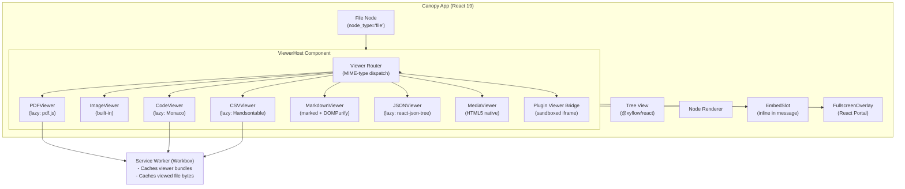

# SPEC-PL-02 — Built-in File Viewers

> **Status:** Spec | **Blocks:** BE-09 (File Service), FE-10 (Viewer Host), FE-11 (Individual Viewers), TEST-04 (Viewer Integration Tests)
> **References:** SPEC-PL-01, SPEC-API-03, SPEC-DM-01, SPEC-API-07, SPEC-API-01, ARCHITECTURE.md §4, ARCHITECTURE.md §5, ARCHITECTURE.md §11

---

## 1. Purpose

Define the exact specification for Canopy's built-in file viewers: architecture, MIME-type routing, file reference model, individual viewer implementations (PDF, images, code, CSV/spreadsheet, Markdown, JSON, audio/video), lazy-loading strategy, security sandboxing per viewer type, offline/PWA behavior, and agent integration. A Go worker reading this spec must implement `FileRepo`, `FileService`, and the file reference resolution layer with zero clarifying questions. A TypeScript worker reading this spec must implement the `ViewerHost` component, all seven built-in viewer React components, and the MIME-type router.

File viewers in Canopy render file content directly in the tree UI — not by opening external applications. A user clicks a file node in the tree and the appropriate viewer renders the file inline (embed mode) or in a fullscreen overlay (fullscreen mode). The agent can open and view any file in the knowledge base by creating a file node with a `hermes://` URI. The viewer system reuses the plugin sandbox infrastructure (SPEC-PL-01) as its security boundary but implements core viewers as native React components for performance and tight integration.

---

## 2. Design Decisions

| Decision | Choice | Rationale |
|----------|--------|-----------|
| Core viewer implementation | Native React components, NOT plugins | Core viewers (PDF, images, code, CSV, Markdown, JSON, audio/video) are compiled into the Canopy frontend bundle. They are not sandboxed via iframes — they run in the main React tree with viewer-specific security hardening. This avoids the overhead of 7+ sandboxed iframes for every file open. Plugin-extensible viewers (user-installed) are sandboxed per SPEC-PL-01. |
| MIME-type routing | Two-tier: built-in registry (compile-time) + plugin overlay (runtime) | The core MIME → viewer mapping is hardcoded in the frontend. User-installed plugins can register `file_handler` entries in their manifest to override or extend the mapping. Plugin handlers take priority over built-in. |
| File reference model | `hermes://` URIs for all files | Uniform URI scheme: `hermes://kb/<sha256-hash>` for knowledge-base files, `hermes://upload/<uuid>` for uploaded files, `hermes://sync/<provider>/<path>` for future sync'd files. One canonical copy, no duplication. |
| Viewer rendering modes | `embed` (inline in tree node) and `fullscreen` (overlay) | Inline for quick preview (images, audio players, short code snippets); fullscreen for deep work (PDF reading, code editing, large CSV). User toggles with one click. |
| Lazy loading | IntersectionObserver + dynamic import() | PDF.js (~2.5MB), Monaco Editor (~5MB), and Handsontable (~800KB) are loaded only when a file of that type is first viewed. Code-split at the viewer component boundary. |
| Offline support | Service Worker caches viewed file blobs + viewer bundles | When a file is viewed online, the raw bytes are cached in Cache API. Viewer JS bundles are pre-cached by Workbox. Offline open uses cached file bytes; if never cached, shows "File not available offline." |
| Security: SVG | SVG rendered via `` only — no inline SVG | Prevents SVG XSS (script injection, event handlers in SVG markup). SVG files are displayed as static images. |
| Security: PDF | PDF.js with `disableScripting: true`, `disableFontFace: true`, sandboxed worker | PDF JavaScript execution is blocked. Font rendering is restricted. PDF.js worker runs in a dedicated web worker. |
| Security: CSV | Handsontable with formula detection: cells starting with `=`, `+`, `-`, `@` are escaped with a leading `'` single quote | Prevents CSV injection attacks (Excel formula execution, DDE). Displayed content shows the original value; export preserves the escape. |
| Security: images | Image bomb detection: max 50MP resolution, max 100MB decoded size, pixel-sampled preview for >20MP images | Prevents browser tab crash from decompression bombs. Large images get a scaled preview with "Download full resolution" button. |
| Security: code | Monaco Editor in read-only mode by default; "Edit" mode requires user toggle + write permission | Prevents accidental modification. Read-only mode disables all Monaco actions that mutate content. |
| Security: audio/video | HTML5 `<audio>` / `<video>` with `sandbox=""` attribute on parent container, `Content-Security-Policy` via `csp` attribute on `<video>` | Prevents media element XSS via track/cue injection. |
| File size limits | PDF: 200MB, CSV: 100MB, code: 10MB (larger files via streaming viewer), images: 50MP, audio/video: 500MB | Balances usability with browser memory constraints. Streaming viewer for large text/code files uses `ReadableStream` + virtualized text rendering. |
| PDF.js version | pdfjs-dist 4.9.x (Apache 2.0, ~2.5MB gzipped ~800KB) | Stable v4 line; worker-based rendering; supports PDF 2.0. Lazy-loaded via dynamic import. |
| Monaco Editor version | monaco-editor 0.47.x (MIT, ~5MB gzipped ~1.5MB) | VS Code core; 60+ language support; theme integration. Lazy-loaded; not bundled in main chunk. |
| Handsontable version | handsontable 14.x (free for non-commercial; commercial license for Canopy; ~800KB gzipped ~250KB) | Spreadsheet-grade CSV viewer; frozen headers, sorting, filtering, formula detection. Lazy-loaded. |
| Markdown renderer | marked 12.x (MIT, ~35KB gzipped ~12KB) + DOMPurify 3.x for sanitization | GFM-compatible; sanitized output prevents XSS. Bundled in main chunk (small enough). |
| JSON viewer | Custom React component: react-json-tree or @microlink/react-json-view (MIT, ~20KB) | Collapsible tree view with search and copy-paths. No eval-based rendering. |
| Audio/video codec support | Browser-native codecs only (no transcoding). Supported: MP4/H.264, WebM/VP8/VP9, MP3, Ogg/Vorbis, WAV, FLAC | Zero server-side transcoding cost. Unsupported formats show "Unsupported format" error with format list. |
| File node type | `node_type: 'file'` in SPEC-DM-01 `nodes` table; `content` stores `hermes://` URI; `metadata` carries `{mime_type, byte_size, sha256, display_name, viewer_state}` | Compatible with existing node model. File content is never stored in the `content` field — only the reference URI. |
| Viewer state persistence | `metadata.viewer_state` on the node, keyed by viewer type | Per-viewer state: scroll position for PDF, cursor position for code, sort/filter for CSV. Persisted via node update on viewer close. |
| Agent file open | SSE event `file_view_request` with `hermes://` URI + `viewer_mode` | Agent requests the frontend to open a file. Frontend resolves the URI, loads the file bytes, and instantiates the viewer. |
| Font rendering in code viewer | Monaco Editor inherits Canopy's UI font stack; no additional font downloads | Consistent with the app's typography; zero additional bundle weight for fonts. |

---

## 3. File Storage Schema

### 3.1 File Metadata Table (DuckDB)

Card DB (DuckDB) stores file metadata. PostgreSQL stores only the node reference (node_type='file', content='hermes://...'). The file bytes live on the local filesystem under `~/.hermes/canopy/files/`.

```sql
-- 000090_file_registry.up.sql (DuckDB)
-- DuckDB in-process; no server required.

CREATE TABLE file_registry (
    id              UUID    PRIMARY KEY,
    hermes_uri      TEXT    NOT NULL UNIQUE,         -- hermes://kb/<sha256> or hermes://upload/<uuid>
    mime_type       TEXT    NOT NULL,                -- e.g. 'application/pdf'
    byte_size       BIGINT  NOT NULL,                -- Raw bytes on disk
    sha256          TEXT    NOT NULL,                -- Hex digest
    display_name    TEXT    NOT NULL,                -- Original filename or generated name
    source          TEXT    NOT NULL DEFAULT 'upload', -- 'kb' | 'upload' | 'sync'
    source_path     TEXT,                            -- Original path for kb files; sync provider for sync
    created_at      TIMESTAMPTZ NOT NULL DEFAULT CURRENT_TIMESTAMP,
    last_viewed_at  TIMESTAMPTZ,
    view_count      INTEGER NOT NULL DEFAULT 0,
    metadata        JSON    NOT NULL DEFAULT '{}',   -- Extra provider-specific metadata
    CONSTRAINT chk_file_source CHECK (source IN ('kb', 'upload', 'sync'))
);

CREATE INDEX idx_file_registry_mime   ON file_registry(mime_type);
CREATE INDEX idx_file_registry_source ON file_registry(source);
CREATE INDEX idx_file_registry_sha256 ON file_registry(sha256);
```

### 3.2 Filesystem Layout

```
~/.hermes/canopy/files/
├── kb/
│   └── <sha256[0:2]>/
│       └── <sha256>          # Raw file bytes
├── upload/
│   └── <uuid[0:2]>/
│       └── <uuid>            # Raw file bytes
└── sync/
    └── <provider>/
        └── <path>            # Synced file (future)
```

### 3.3 Viewer State (Stored on Node)

```sql
-- Viewer state is stored in nodes.metadata JSONB (PostgreSQL, SPEC-DM-01 §3.3)
-- Example metadata for a file node:
{
  "mime_type": "application/pdf",
  "byte_size": 2456789,
  "sha256": "a1b2c3d4...",
  "display_name": "spec-pl-01.pdf",
  "viewer_state": {
    "pdf": {
      "page": 42,
      "scroll_top": 0.65,
      "zoom": 1.5,
      "rotation": 0
    }
  },
  "thumbnail_uri": "hermes://thumb/a1b2c3d4"
}
```

---

## 4. Go Structs & Repository Interfaces

### 4.1 Package Layout

```
internal/
├── file/
│   ├── models.go            # FileRecord, FileRef, FileViewerState structs
│   ├── repo.go              # FileRepo interface + DuckDB implementation
│   ├── service.go           # FileService: register, resolve, thumbnail, stream
│   ├── mime.go              # MIME type detection (first 512 bytes + extension)
│   └── handlers.go          # HTTP handlers for /files endpoints
```

### 4.2 Go Structs

```go
package file

import (
    "time"
    "github.com/google/uuid"
)

// FileSource indicates where a file originated.
type FileSource string

const (
    FileSourceKB     FileSource = "kb"     // Already in Hermes knowledge base
    FileSourceUpload FileSource = "upload" // User uploaded via UI or agent
    FileSourceSync   FileSource = "sync"   // Sync'd from external provider (future)
)

// FileRecord is a row in the file_registry DuckDB table.
type FileRecord struct {
    ID            uuid.UUID  `db:"id"              json:"id"`
    HermesURI     string     `db:"hermes_uri"      json:"hermesUri"`
    MimeType      string     `db:"mime_type"       json:"mimeType"`
    ByteSize      int64      `db:"byte_size"       json:"byteSize"`
    SHA256        string     `db:"sha256"          json:"sha256"`
    DisplayName   string     `db:"display_name"    json:"displayName"`
    Source        FileSource `db:"source"          json:"source"`
    SourcePath    *string    `db:"source_path"     json:"sourcePath,omitempty"`
    CreatedAt     time.Time  `db:"created_at"      json:"createdAt"`
    LastViewedAt  *time.Time `db:"last_viewed_at"  json:"lastViewedAt,omitempty"`
    ViewCount     int        `db:"view_count"      json:"viewCount"`
    Metadata      []byte     `db:"metadata"        json:"metadata"`   // JSON blob
}

// FileRef is the lightweight reference stored in a node's content field.
// Format: hermes://<source>/<id>
// Examples: hermes://kb/a1b2c3d4e5f6..., hermes://upload/0191a8b2-...
type FileRef struct {
    Scheme string     // Always "hermes"
    Source FileSource // "kb" | "upload" | "sync"
    ID     string     // SHA256 hex (kb) or UUID (upload) or provider path (sync)
}

// ParseFileRef parses a hermes:// URI into its components.
// Returns an error if the URI is malformed.
func ParseFileRef(uri string) (*FileRef, error)

// String returns the hermes:// URI for this reference.
func (r *FileRef) String() string

// ViewerState is per-viewer state persisted in node metadata.
type ViewerState struct {
    ViewerType string          `json:"viewer_type"` // "pdf" | "image" | "code" | "csv" | "markdown" | "json" | "media"
    State      json.RawMessage `json:"state"`       // Viewer-specific state blob
}

// PDFViewerState is the persisted state for the PDF viewer.
type PDFViewerState struct {
    Page       int     `json:"page"`
    ScrollTop  float64 `json:"scroll_top"`  // 0.0-1.0
    Zoom       float64 `json:"zoom"`        // 0.5-4.0
    Rotation   int     `json:"rotation"`    // 0, 90, 180, 270
}

// CodeViewerState is the persisted state for the Monaco code viewer.
type CodeViewerState struct {
    CursorLine     int  `json:"cursor_line"`
    CursorColumn   int  `json:"cursor_column"`
    ScrollTop      int  `json:"scroll_top"`
    WordWrap       bool `json:"word_wrap"`
    ReadOnly       bool `json:"read_only"`
}

// CSVViewerState is the persisted state for the CSV viewer.
type CSVViewerState struct {
    SortColumn    string `json:"sort_column,omitempty"`
    SortDirection string `json:"sort_direction,omitempty"` // "asc" | "desc"
    FilterText    string `json:"filter_text,omitempty"`
    FrozenColumns int    `json:"frozen_columns"`
    Page          int    `json:"page"`
}

// ── Service Input/Output ──────────────────────────────────────

// RegisterFileInput carries a new file to register.
type RegisterFileInput struct {
    SourcePath  string     // Absolute path on the Hermes filesystem (kb source)
    UploadBytes []byte     // Raw bytes for upload source
    DisplayName string     // Original filename
    MimeType    string     // Detected or provided MIME type
    Source      FileSource
}

// RegisterFileOutput carries the result of registration.
type RegisterFileOutput struct {
    Record   FileRecord
    HermesURI string
    IsNew    bool // true if this is a new file (SHA256 not already registered)
}

// ResolveFileInput carries the hermes:// URI to resolve.
type ResolveFileInput struct {
    HermesURI string
}

// ResolveFileOutput returns the file record and a reader for the file bytes.
type ResolveFileOutput struct {
    Record     FileRecord
    ReadSeeker io.ReadSeeker // Reads from disk (kb/upload/sync path)
}
```

### 4.3 Repository Interface

```go
package file

import (
    "context"
    "github.com/google/uuid"
)

// FileRepo is the persistence interface for file metadata (DuckDB).
type FileRepo interface {
    // Insert adds a new file_registry row. Returns ErrFileAlreadyExists if SHA256 dup.
    Insert(ctx context.Context, record *FileRecord) (*FileRecord, error)

    // GetByURI retrieves a file record by hermes:// URI.
    GetByURI(ctx context.Context, hermesURI string) (*FileRecord, error)

    // GetBySHA256 retrieves a file record by SHA256 hash.
    GetBySHA256(ctx context.Context, sha256 string) (*FileRecord, error)

    // GetByID retrieves a file record by UUID.
    GetByID(ctx context.Context, id uuid.UUID) (*FileRecord, error)

    // ListByMimeType returns files filtered by MIME type, paginated.
    ListByMimeType(ctx context.Context, mimeType string, limit, offset int) ([]FileRecord, error)

    // ListBySource returns files filtered by source, paginated.
    ListBySource(ctx context.Context, source FileSource, limit, offset int) ([]FileRecord, error)

    // UpdateLastViewed bumps last_viewed_at and view_count.
    UpdateLastViewed(ctx context.Context, id uuid.UUID) error

    // Delete removes the file_registry row and the on-disk file bytes.
    // Only succeeds if no tree nodes reference this file (checked in service layer).
    Delete(ctx context.Context, id uuid.UUID) error

    // GetNodeRefCount returns the number of tree nodes referencing this file.
    GetNodeRefCount(ctx context.Context, hermesURI string) (int, error)
}
```

### 4.4 FileService Interface

```go
package file

import (
    "context"
    "io"
)

// FileService defines the business logic for file management.
type FileService interface {
    // RegisterFromKB registers a file that already exists in the Hermes knowledge base.
    // Copies the file into ~/.hermes/canopy/files/kb/<sha256> and creates a registry row.
    RegisterFromKB(ctx context.Context, input RegisterFileInput) (*RegisterFileOutput, error)

    // RegisterUpload stores uploaded bytes and creates a registry row.
    RegisterUpload(ctx context.Context, input RegisterFileInput) (*RegisterFileOutput, error)

    // Resolve returns the file record and a reader for the raw bytes.
    // Caller must close the reader.
    Resolve(ctx context.Context, hermesURI string) (*ResolveFileOutput, error)

    // Stream returns a byte range from a file (HTTP Range header support).
    Stream(ctx context.Context, hermesURI string, start, end int64) (io.ReadCloser, int64, error)

    // DetectMimeType reads the first 512 bytes of a reader to determine MIME type.
    // Falls back to extension-based detection if magic bytes are ambiguous.
    DetectMimeType(reader io.Reader, filename string) (string, error)

    // GenerateThumbnail creates a thumbnail for image/PDF files (first page).
    // Returns a hermes://thumb/<sha256> URI.
    GenerateThumbnail(ctx context.Context, hermesURI string) (string, error)

    // GetViewerState reads the viewer_state from a node's metadata.
    GetViewerState(ctx context.Context, nodeID uuid.UUID) (*ViewerState, error)

    // SaveViewerState persists viewer_state to a node's metadata.
    SaveViewerState(ctx context.Context, nodeID uuid.UUID, state *ViewerState) error

    // DeleteFile removes the registry row and on-disk bytes if no nodes reference it.
    DeleteFile(ctx context.Context, hermesURI string) error
}
```

---

## 5. TypeScript Types & React Component Interfaces

### 5.1 Core Types

```typescript
// ── File Reference ───────────────────────────────────────────

/** Parsed hermes:// URI components */
export interface FileRef {
  scheme: 'hermes';
  source: 'kb' | 'upload' | 'sync';
  id: string; // SHA256 hex (kb), UUID (upload), or provider/path (sync)
}

/** Parse a hermes:// URI string into a FileRef. Throws on malformed URI. */
export function parseFileRef(uri: string): FileRef;

/** Serialize a FileRef back to a hermes:// URI string. */
export function formatFileRef(ref: FileRef): string;

// ── File Registry Record ─────────────────────────────────────

export interface FileRecord {
  id: string;             // UUIDv7
  hermesUri: string;      // hermes://kb/<sha256> or hermes://upload/<uuid>
  mimeType: string;
  byteSize: number;
  sha256: string;
  displayName: string;
  source: 'kb' | 'upload' | 'sync';
  sourcePath?: string;
  createdAt: string;      // ISO 8601
  lastViewedAt?: string;
  viewCount: number;
  metadata: Record<string, unknown>;
}

// ── Viewer Mode ───────────────────────────────────────────────

export type ViewerMode = 'embed' | 'fullscreen';

// ── Built-in Viewer Types ─────────────────────────────────────

export type BuiltInViewerType =
  | 'pdf'
  | 'image'
  | 'code'
  | 'csv'
  | 'markdown'
  | 'json'
  | 'media';

// ── MIME-Type → Viewer Mapping ────────────────────────────────

export interface ViewerMapping {
  /** The viewer type identifier */
  viewerType: BuiltInViewerType | string; // string for plugin viewers
  /** Human-readable name for the viewer selector UI */
  displayName: string;
  /** MIME types this viewer handles (glob patterns supported: image/*) */
  mimeTypes: string[];
  /** File extensions this viewer handles (without dot: ['pdf', 'PDF']) */
  extensions: string[];
  /** Whether this is a built-in or plugin viewer */
  source: 'built-in' | 'plugin';
  /** Plugin slug if source === 'plugin' */
  pluginSlug?: string;
  /** Default viewer mode */
  defaultMode: ViewerMode;
  /** Supported modes */
  supportedModes: ViewerMode[];
  /** Max file size in bytes (0 = no limit) */
  maxFileSize: number;
}

// ── Viewer Props (passed to every viewer component) ──────────

export interface ViewerProps {
  /** The hermes:// URI of the file to view */
  hermesUri: string;
  /** Resolved file metadata */
  fileRecord: FileRecord;
  /** The raw file bytes as an ArrayBuffer */
  fileBytes: ArrayBuffer;
  /** Current viewer mode */
  mode: ViewerMode;
  /** Callback to toggle embed/fullscreen */
  onToggleMode: () => void;
  /** Callback to persist viewer state */
  onSaveState: (state: Record<string, unknown>) => void;
  /** Previously saved viewer state (undefined if first open) */
  savedState?: Record<string, unknown>;
  /** Whether the file is available offline (cached) */
  isOfflineAvailable: boolean;
  /** Error callback — called when viewer encounters a fatal error */
  onError: (error: ViewerError) => void;
}

export interface ViewerError {
  code: string;
  message: string;
  details?: Record<string, unknown>;
}

// ── ViewerHost Component Props ────────────────────────────────

export interface ViewerHostProps {
  hermesUri: string;
  initialMode?: ViewerMode;
  nodeId?: string; // For loading/saving viewer state
}

// ── Viewer Registry ───────────────────────────────────────────

export interface ViewerRegistry {
  /** Find the best viewer for a given MIME type and file extension */
  findViewer(mimeType: string, extension: string): ViewerMapping | null;
  /** Register a plugin viewer (from SPEC-PL-01 manifest file_handler) */
  registerPluginViewer(mapping: ViewerMapping): void;
  /** Unregister a plugin viewer */
  unregisterPluginViewer(viewerType: string): void;
  /** List all registered viewers */
  listViewers(): ViewerMapping[];
  /** Get a specific viewer mapping */
  getViewer(viewerType: string): ViewerMapping | null;
}
```

### 5.2 Zod Schemas

```typescript
import { z } from 'zod';

export const FileSourceSchema = z.enum(['kb', 'upload', 'sync']);

export const FileRefSchema = z.string().regex(
  /^hermes:\/\/(kb|upload|sync)\/.+$/,
  'Must be a valid hermes:// URI (hermes://kb/<sha256>, hermes://upload/<uuid>, hermes://sync/<provider>/<path>)',
);

export const ViewerModeSchema = z.enum(['embed', 'fullscreen']);

export const ViewerTypeSchema = z.enum([
  'pdf', 'image', 'code', 'csv', 'markdown', 'json', 'media',
]);

export const FileRecordSchema = z.object({
  id: z.string().uuid(),
  hermesUri: FileRefSchema,
  mimeType: z.string().min(1),
  byteSize: z.number().int().nonnegative(),
  sha256: z.string().regex(/^[a-f0-9]{64}$/),
  displayName: z.string().min(1).max(500),
  source: FileSourceSchema,
  sourcePath: z.string().optional(),
  createdAt: z.string().datetime(),
  lastViewedAt: z.string().datetime().optional(),
  viewCount: z.number().int().nonnegative(),
  metadata: z.record(z.unknown()).default({}),
});

export const ViewerMappingSchema = z.object({
  viewerType: z.string(),
  displayName: z.string(),
  mimeTypes: z.array(z.string()),
  extensions: z.array(z.string()),
  source: z.enum(['built-in', 'plugin']),
  pluginSlug: z.string().optional(),
  defaultMode: ViewerModeSchema,
  supportedModes: z.array(ViewerModeSchema),
  maxFileSize: z.number().int().nonnegative(),
});
```

### 5.3 MIME-Type Detection (Frontend Fallback)

```typescript
// When the server hasn't registered a MIME type, the frontend detects it from
// the first few bytes (magic numbers) or the file extension.
// Priority: server-stored mimeType > magic bytes > extension

const MAGIC_BYTES: Array<{ bytes: number[]; mimeType: string }> = [
  { bytes: [0x25, 0x50, 0x44, 0x46], mimeType: 'application/pdf' },
  { bytes: [0xFF, 0xD8, 0xFF], mimeType: 'image/jpeg' },
  { bytes: [0x89, 0x50, 0x4E, 0x47], mimeType: 'image/png' },
  { bytes: [0x47, 0x49, 0x46, 0x38], mimeType: 'image/gif' },
  { bytes: [0x52, 0x49, 0x46, 0x46], mimeType: 'image/webp' }, // after RIFF header check
  { bytes: [0x1F, 0x8B], mimeType: 'application/gzip' },
  { bytes: [0x50, 0x4B, 0x03, 0x04], mimeType: 'application/zip' },
  // Video/audio magic bytes checked in MediaViewer component
];

const EXTENSION_MAP: Record<string, string> = {
  'pdf': 'application/pdf',
  'jpg': 'image/jpeg', 'jpeg': 'image/jpeg',
  'png': 'image/png', 'gif': 'image/gif', 'svg': 'image/svg+xml',
  'webp': 'image/webp', 'bmp': 'image/bmp', 'ico': 'image/x-icon',
  'mp3': 'audio/mpeg', 'wav': 'audio/wav', 'ogg': 'audio/ogg',
  'flac': 'audio/flac', 'm4a': 'audio/mp4',
  'mp4': 'video/mp4', 'webm': 'video/webm', 'mov': 'video/quicktime',
  'csv': 'text/csv', 'tsv': 'text/tab-separated-values',
  'json': 'application/json', 'jsonl': 'application/jsonl',
  'md': 'text/markdown', 'markdown': 'text/markdown',
  'txt': 'text/plain',
  'html': 'text/html', 'htm': 'text/html',
  'css': 'text/css',
  'js': 'text/javascript', 'jsx': 'text/javascript',
  'ts': 'text/typescript', 'tsx': 'text/typescript',
  'py': 'text/x-python', 'rb': 'text/x-ruby',
  'go': 'text/x-go', 'rs': 'text/x-rust',
  'java': 'text/x-java', 'kt': 'text/x-kotlin',
  'c': 'text/x-c', 'cpp': 'text/x-c++', 'h': 'text/x-c',
  'sql': 'text/x-sql',
  'yaml': 'text/yaml', 'yml': 'text/yaml',
  'xml': 'text/xml',
  'sh': 'text/x-shellscript', 'bash': 'text/x-shellscript',
  'toml': 'text/toml',
  'ini': 'text/plain', 'cfg': 'text/plain',
  'log': 'text/plain',
};

export function detectMimeTypeFromBytes(
  bytes: Uint8Array,
  extension: string,
): string {
  // Check magic bytes first
  for (const magic of MAGIC_BYTES) {
    if (magic.bytes.every((b, i) => bytes[i] === b)) {
      return magic.mimeType;
    }
  }
  // Fall back to extension
  const ext = extension.toLowerCase().replace(/^\./, '');
  return EXTENSION_MAP[ext] ?? 'application/octet-stream';
}
```

---

## 6. Viewer Installation & Registration Flow

### 6.1 Built-in Viewer Registration (Compile-Time)

Built-in viewers are registered at application startup via the `ViewerRegistry` singleton. No user action required — they are always available.

```typescript
// In viewerRegistry.ts — called once at app init
function registerBuiltInViewers(registry: ViewerRegistry): void {
  registry.registerBuiltIn({
    viewerType: 'pdf',
    displayName: 'PDF Viewer',
    mimeTypes: ['application/pdf'],
    extensions: ['pdf'],
    defaultMode: 'fullscreen',
    supportedModes: ['embed', 'fullscreen'],
    maxFileSize: 200 * 1024 * 1024, // 200 MB
    source: 'built-in',
  });

  registry.registerBuiltIn({
    viewerType: 'image',
    displayName: 'Image Viewer',
    mimeTypes: ['image/*'],
    extensions: ['jpg', 'jpeg', 'png', 'gif', 'svg', 'webp', 'bmp', 'ico'],
    defaultMode: 'embed',
    supportedModes: ['embed', 'fullscreen'],
    maxFileSize: 100 * 1024 * 1024, // 100 MB
    source: 'built-in',
  });

  registry.registerBuiltIn({
    viewerType: 'code',
    displayName: 'Code Viewer (Monaco)',
    mimeTypes: [
      'text/*',
      'application/json',
      'application/javascript',
      'application/xml',
    ],
    extensions: ['js', 'jsx', 'ts', 'tsx', 'py', 'rb', 'go', 'rs', 'java',
                 'kt', 'c', 'cpp', 'h', 'sql', 'yaml', 'yml', 'xml', 'json',
                 'html', 'htm', 'css', 'sh', 'bash', 'toml', 'ini', 'cfg',
                 'log', 'txt', 'md', 'markdown'],
    defaultMode: 'fullscreen',
    supportedModes: ['embed', 'fullscreen'],
    maxFileSize: 10 * 1024 * 1024, // 10 MB (larger files use streaming mode)
    source: 'built-in',
  });

  registry.registerBuiltIn({
    viewerType: 'csv',
    displayName: 'CSV / Spreadsheet Viewer',
    mimeTypes: ['text/csv', 'text/tab-separated-values'],
    extensions: ['csv', 'tsv'],
    defaultMode: 'fullscreen',
    supportedModes: ['embed', 'fullscreen'],
    maxFileSize: 100 * 1024 * 1024, // 100 MB
    source: 'built-in',
  });

  registry.registerBuiltIn({
    viewerType: 'markdown',
    displayName: 'Markdown Viewer (GFM)',
    mimeTypes: ['text/markdown'],
    extensions: ['md', 'markdown'],
    defaultMode: 'fullscreen',
    supportedModes: ['embed', 'fullscreen'],
    maxFileSize: 5 * 1024 * 1024, // 5 MB
    source: 'built-in',
  });

  registry.registerBuiltIn({
    viewerType: 'json',
    displayName: 'JSON Tree Viewer',
    mimeTypes: ['application/json', 'application/jsonl'],
    extensions: ['json', 'jsonl'],
    defaultMode: 'fullscreen',
    supportedModes: ['embed', 'fullscreen'],
    maxFileSize: 50 * 1024 * 1024, // 50 MB
    source: 'built-in',
  });

  registry.registerBuiltIn({
    viewerType: 'media',
    displayName: 'Audio / Video Player',
    mimeTypes: ['audio/*', 'video/*'],
    extensions: ['mp3', 'wav', 'ogg', 'flac', 'm4a', 'mp4', 'webm', 'mov'],
    defaultMode: 'embed',
    supportedModes: ['embed', 'fullscreen'],
    maxFileSize: 500 * 1024 * 1024, // 500 MB
    source: 'built-in',
  });
}
```

### 6.2 Plugin Viewer Registration (Runtime)

Plugin viewers extend or override the built-in MIME-type mapping. A plugin's manifest (SPEC-PL-01 §2) may include a `file_handlers` array:

```json
{
  "name": "dicom-viewer",
  "version": "1.0.0",
  "permissions": ["data_read"],
  "render_type": "embed",
  "entry_point": "main",
  "file_handlers": [
    {
      "mime_types": ["application/dicom"],
      "extensions": ["dcm", "dicom"],
      "viewer_mode": "fullscreen",
      "priority": 10
    }
  ]
}
```

On plugin install (SPEC-PL-01 §6.2), the `ViewerRegistry` registers the plugin's file handlers. Plugin handlers with higher `priority` take precedence over built-in viewers for the same MIME type.

### 6.3 Mermaid: Viewer Resolution Flow

```mermaid
flowchart TD
    A["User clicks file node
    (hermes://kb/a1b2...)"] --> B["ViewerHost mounts"]
    B --> C["GET /files/{uri}/meta
    → FileRecord + mimeType"]
    C --> D{"File cached offline?
    (Cache API)"}
    D -->|Yes| E["Load bytes from Cache API"]
    D -->|No| F["GET /files/{uri}/bytes
    → raw bytes"]
    F --> G["Cache bytes in Cache API
    for offline use"]
    E --> H["ViewerRegistry.findViewer
    (mimeType, extension)"]
    G --> H
    H --> I{"Plugin override
    for this MIME type?"}
    I -->|Yes| J["Load plugin iframe
    (sandboxed, SPEC-PL-01)"]
    I -->|No| K["Select built-in viewer
    component"]
    K --> L{"Viewer bundle cached?"}
    L -->|No| M["Dynamic import()
    pdf.js / Monaco / Handsontable"]
    L -->|Yes| N["Render viewer component
    with fileBytes"]
    M --> N
    N --> O{"Large file?"
    (code > 10MB, CSV > 100MB)"}
    O -->|Yes| P["Streaming viewer:
    ReadableStream + virtualization"]
    O -->|No| Q["Standard viewer render"]
    P --> R["User views file"]
    Q --> R
    J --> R
    R --> S["On close: save
    viewer_state → node metadata"]
```

---

## 7. File Access & Reference Model

### 7.1 URI Scheme

All file references in Canopy use the `hermes://` URI scheme:

| URI Pattern | Source | ID Format | Example |
|-------------|--------|-----------|---------|
| `hermes://kb/<sha256-hex>` | Knowledge base | 64-char hex SHA256 | `hermes://kb/a1b2c3d4e5f6...` |
| `hermes://upload/<uuid>` | User/agent upload | UUIDv7 | `hermes://upload/0191a8b2-7fff-7000-9000-000000000001` |
| `hermes://sync/<provider>/<path>` | External sync | Provider + path | `hermes://sync/gdrive/reports/q4.pdf` |

### 7.2 File Attachment Model

Files are attached to tree nodes by reference, not by value:

1. **Attach by reference (KB files):** The agent or user creates a node with `node_type: 'file'` and `content: 'hermes://kb/<sha256>'`. The file already exists on the Hermes filesystem — no bytes are copied. One canonical copy.

2. **Attach by upload:** The agent or user uploads file bytes via `POST /files/upload`. The server stores the bytes under `~/.hermes/canopy/files/upload/<uuid>`, creates a `file_registry` row, and returns the `hermes://` URI. The caller creates a file node with that URI.

3. **Future: attach by sync:** Sync provider integration (e.g., Google Drive) resolves `hermes://sync/<provider>/<path>` to the provider's file content. The sync provider handles fetching and caching.

### 7.3 File Open Flow

```
User/Agent requests file open
  → Resolve hermes:// URI → FileRecord (DuckDB)
  → Check MIME type → select viewer
  → Fetch raw bytes (disk or Cache API)
  → Instantiate viewer component with fileBytes
  → User interacts with file
  → On close → save viewer_state to node.metadata
```

### 7.4 Agent File Actions (SSE)

Agents open files by emitting `file_view_request` SSE events:

```json
{
  "event": "file_view_request",
  "data": {
    "hermes_uri": "hermes://kb/a1b2c3d4...",
    "viewer_mode": "fullscreen",
    "context_node_id": "0191a8b2-7fff-7000-9000-000000000201",
    "message": "Opening spec-pl-01.pdf for review",
    "timestamp": "2026-07-22T12:00:00Z"
  }
}
```

The frontend receives this event and:
1. Shows a chat message: "Agent: Opening spec-pl-01.pdf for review"
2. Automatically opens the file in the requested viewer mode
3. The user can close the viewer and return to the conversation

---

## 8. Individual Viewer Specifications

### 8.1 PDF Viewer (pdf.js)

**Library:** pdfjs-dist 4.9.x (Apache 2.0)
**Bundle:** ~2.5MB uncompressed, ~800KB gzipped
**Loading:** `import('pdfjs-dist')` — lazy-loaded on first PDF open
**Worker:** Dedicated web worker (`pdf.worker.min.js`), same-origin

**Configuration:**

```typescript
import * as pdfjsLib from 'pdfjs-dist';

pdfjsLib.GlobalWorkerOptions.workerSrc = '/pdf.worker.min.js';

const loadingTask = pdfjsLib.getDocument({
  data: fileBytes,
  disableScripting: true,     // Block PDF JavaScript
  disableFontFace: true,      // Prevent font enumeration
  cMapUrl: '/cmaps/',
  cMapPacked: true,
  maxImageSize: 50 * 1024 * 1024, // 50MB max image decode
});
```

**Features:**
- Page-by-page rendering with virtualized scroll (only rendered pages in viewport)
- Zoom: 50%–400%, with fit-to-width/fit-to-page presets
- Page rotation (0°/90°/180°/270°)
- Text layer for copy/paste
- Search within document (pdf.js built-in find)
- Thumbnail sidebar (collapsible)
- Keyboard navigation: Page Up/Down, Home/End, j/k

**UX Behavior:**
- `embed` mode: Renders first page as a clickable preview. Click opens fullscreen.
- `fullscreen` mode: Full document with toolbar (zoom, search, thumbnails, download, page counter: "Page 42 / 128").
- Scroll position saved to `viewer_state.pdf.scroll_top` on close.

**Limitations:**
- No fillable form support in MVP (pdf.js can render but not fill)
- No annotation creation (viewing existing annotations is supported)
- Max 200MB file size (enforced by server pre-check)

**Error States:**
- Corrupted PDF → "This PDF file appears to be corrupted. Error: <detail>" with "Download raw file" button
- Password-protected → Password input dialog; after 3 failed attempts: "Cannot open password-protected PDF"
- Unsupported PDF feature → Graceful degradation; missing features render as blank areas with "[Unsupported]" label

### 8.2 Image Viewer (Lightbox + Zoom)

**Library:** No external library — custom React component using browser-native image decoding + CSS transforms.

**Features:**
- Lightbox overlay with dimmed background (fullscreen mode)
- Zoom: pinch-to-zoom (touch), scroll-to-zoom (mouse), 25%–500%
- Pan: click-and-drag when zoomed in
- Rotate: 90° clockwise/counterclockwise buttons
- Image carousel: if multiple images attached to a node, arrow keys navigate between them
- Full-screen browser mode (F11-style via Fullscreen API)
- Copy to clipboard (via Canvas API)

**Security:**
- SVG files: Rendered via ``, NOT inline SVG. Prevents SVG XSS.
- Image bomb detection: Before rendering, check `byteSize` against resolution estimate:
  - PNG/GIF/WebP: parse IHDR/header to get dimensions; if dimensions > 50MP → reject
  - JPEG: parse SOF marker; if dimensions > 50MP → reject
  - Images >20MP: render a scaled preview (max 20MP) with "Download full resolution (XX MP)" button

**UX Behavior:**
- `embed` mode: Thumbnail-sized preview (300px wide) that fits within the tree node. Click opens fullscreen.
- `fullscreen` mode: Lightbox overlay; image scales to fit viewport. Toolbar: zoom in/out, rotate, reset, download, copy, close (Esc or click outside).

**Supported Formats:**
- JPEG, PNG, GIF (animated, first frame static; full animation in fullscreen via ``), SVG (static ``), WebP, BMP, ICO

**Error States:**
- Corrupted image → "This image file cannot be displayed. The file may be corrupted or in an unsupported format."
- Image too large (>50MP) → "This image is too large to display (XX MP). Maximum supported resolution is 50MP. You can download the original file."
- Zero-byte image → "This file is empty (0 bytes)."

### 8.3 Code Viewer (Monaco Editor)

**Library:** monaco-editor 0.47.x (MIT)
**Bundle:** ~5MB uncompressed, ~1.5MB gzipped
**Loading:** `import('monaco-editor')` — lazy-loaded on first code file open
**Font:** Inherits Canopy's UI font stack; no additional web font downloads

**Features:**
- Syntax highlighting for 60+ languages (auto-detected from extension and MIME type)
- Read-only by default; "Edit" toggle in toolbar (requires `data_write` permission on the file node)
- Line numbers, minimap, bracket matching, code folding
- Find/replace (Monaco built-in)
- Word wrap toggle
- Theme: matches Canopy dark/light theme (Monaco `vs-dark` / `vs`)
- Diff mode: if the node has a parent with a code file and this node is a fork/edit, show diff view between the two

**Read-Only Mode Restrictions:**
- All Monaco editor actions that mutate content are disabled (`editor.addAction` filter)
- Cursor is visible for text selection but typing is blocked
- Context menu items "Cut", "Paste", "Delete" are removed

**Streaming Mode (files >10MB):**
- First 1MB loaded and displayed immediately
- Remaining content streamed via `ReadableStream` and appended in 256KB chunks
- Virtualized rendering via Monaco's built-in viewport virtualization
- Search still works across the full file (Monaco searches its internal model)

**Language Detection Priority:**
1. MIME type from `FileRecord.mimeType` (server-stored, most reliable)
2. File extension from `FileRecord.displayName`
3. Content analysis: first 100 lines scanned for shebang (`#!/usr/bin/env python3`), modeline (`/* -*- mode: go -*- */`), or distinctive syntax patterns

**UX Behavior:**
- `embed` mode: First 30 lines rendered in a fixed-height (400px) mini editor. "Open in full editor" button.
- `fullscreen` mode: Full Monaco editor with toolbar (language selector, read-only/edit toggle, word wrap, find, download, line/column indicator).

**Error States:**
- Unsupported language → Falls back to `plaintext` with a banner: "Language not recognized. Displaying as plain text."
- File too large for Monaco (>10MB) → Streaming mode auto-enabled; loading indicator shows "Loading 1MB / 50MB..."
- File is binary (null bytes detected) → "This file appears to be binary and cannot be displayed in the code viewer. Try downloading it instead."
- Monaco fails to load → "Code viewer failed to initialize. [Retry] [Download raw file]"

### 8.4 CSV / Spreadsheet Viewer (Handsontable)

**Library:** handsontable 14.x (free for non-commercial use; commercial license for Canopy distribution)
**Bundle:** ~800KB uncompressed, ~250KB gzipped
**Loading:** `import('handsontable')` — lazy-loaded

**Features:**
- Grid view with frozen headers (first row as header row, toggleable)
- Column sorting (click header), multi-column sort
- Text filter per column
- Column resizing (drag header border)
- Pagination: 100 rows per page for files >1000 rows
- Cell selection, copy to clipboard (Ctrl+C), select-all (Ctrl+A)
- Export to CSV (current view with filters/sort applied)
- Row numbers

**CSV Injection Prevention (Critical Security):**
Every cell value that starts with `=`, `+`, `-`, or `@` is escaped with a leading single quote `'` before rendering. This prevents Excel/Sheets formula execution (CSV injection, DDE attacks).

```typescript
function sanitizeCSVCell(value: string): string {
  const first = value.charAt(0);
  if (first === '=' || first === '+' || first === '-' || first === '@') {
    return "'" + value;
  }
  return value;
}
```

**Parsing:**
- CSV: Papa Parse 5.x (MIT, ~20KB) for robust CSV parsing (quoted fields, escaped commas, multiline fields)
- TSV: Tab-separated parsing with same logic
- Auto-detect delimiter (comma vs tab) from first 10 lines

**UX Behavior:**
- `embed` mode: First 10 rows × 5 columns in a compact table. "Open in spreadsheet" button.
- `fullscreen` mode: Full Handsontable grid with toolbar (sort, filter, export, column freeze, row count).

**Error States:**
- Malformed CSV (uneven column counts) → Renders with warning: "CSV has inconsistent column counts. Some rows may be misaligned."
- Empty CSV (0 rows) → "This CSV file is empty."
- CSV too large (>100MB, >1M rows) → "This CSV file exceeds the maximum supported size (100MB / 1,000,000 rows). Only the first 10,000 rows are shown. [Download full file]"

### 8.5 Markdown Viewer (GFM)

**Library:** marked 12.x (MIT, ~35KB gzipped ~12KB) + DOMPurify 3.x (Apache 2.0, ~25KB) for sanitization
**Loading:** Bundled in main chunk (combined ~37KB gzipped is acceptable)

**Features:**
- GitHub-Flavored Markdown (GFM): tables, strikethrough, task lists, autolinks
- Syntax-highlighted code blocks (reuses Monaco's tokenizer via `monaco.editor.colorize()`)
- Rendered HTML sanitized through DOMPurify (blocks XSS via markdown HTML injection)
- Mermaid diagram rendering: fenced code blocks with `mermaid` language → rendered as SVG via mermaid.js (lazy-loaded, ~1MB)
- Internal link resolution: `[spec](./SPEC-PL-01.md)` → links to Canopy tree nodes by filename
- Table of contents auto-generated from headings (toggleable sidebar)

**Security:**
```typescript
import { marked } from 'marked';
import DOMPurify from 'dompurify';

const html = marked.parse(markdownContent, { gfm: true });
const clean = DOMPurify.sanitize(html, {
  ALLOWED_TAGS: ['h1', 'h2', 'h3', 'h4', 'h5', 'h6', 'p', 'a', 'ul', 'ol', 'li',
                 'code', 'pre', 'strong', 'em', 'del', 'table', 'thead', 'tbody',
                 'tr', 'th', 'td', 'blockquote', 'hr', 'br', 'img', 'input'],
  ALLOWED_ATTR: ['href', 'src', 'alt', 'title', 'class', 'id', 'checked', 'disabled'],
});
```

**UX Behavior:**
- `embed` mode: First 500 characters rendered inline in the tree node with "Read more..." link. Images shown as thumbnails.
- `fullscreen` mode: Full rendered markdown with TOC sidebar (collapsible), dark-theme styling, scrollable. Rendered HTML matches Canopy's message rendering style.

**Error States:**
- Markdown parsing error (should not happen with marked) → "Error rendering markdown." with raw text fallback below

### 8.6 JSON Viewer (Collapsible Tree)

**Library:** Custom React component using `react-json-tree` theme or `@microlink/react-json-view` (MIT, ~20KB)
**Loading:** Lazy-loaded

**Features:**
- Collapsible tree view with expand/collapse all
- Syntax-highlighted: strings (green), numbers (blue), booleans (orange), null (gray), keys (purple)
- Copy path (e.g., `$.data.users[0].name`) to clipboard
- Copy value to clipboard
- Search/filter: highlight matching keys and values
- Line count display: "1,247 keys, 8,392 nodes"
- JSONL support (JSON Lines): rendered as a list of collapsible rows, one per line

**Streaming Mode (files >5MB):**
- Parse first 100KB and display immediately
- Remaining parsed in 100KB chunks via Web Worker
- Virtualized rendering for large trees (>10K nodes)

**UX Behavior:**
- `embed` mode: Collapsed root node showing key count. Click expands inline.
- `fullscreen` mode: Full tree viewer with search bar, expand/collapse all, copy path, download, key count.

**Error States:**
- Invalid JSON → "Invalid JSON at line X, column Y: <error message>" with raw text fallback
- JSONL with malformed line → "Line X is not valid JSON. Skipped." Continue rendering other lines
- JSON too large (>50MB) → "This JSON file exceeds the maximum supported size (50MB). Only the first 5MB are shown. [Download full file]"

### 8.7 Audio / Video Player (HTML5)

**Library:** None — browser-native `<audio>` and `<video>` elements with custom Canopy-themed controls.

**Supported Codecs:**
- Video: MP4/H.264, WebM/VP8/VP9, Ogg/Theora
- Audio: MP3, WAV, Ogg/Vorbis, FLAC, M4A/AAC

**Features:**
- Custom control bar (styled to match Canopy dark theme)
- Play/pause, seek, volume, playback speed (0.5x–2x), picture-in-picture, fullscreen
- Waveform visualization for audio (generated client-side via Web Audio API, no library)
- Keyboard shortcuts: Space (play/pause), Left/Right (seek ±5s), Up/Down (volume), M (mute), F (fullscreen)
- Time display: elapsed / total (e.g., "2:34 / 5:12")

**Security:**
```html
<video
  src="blob:..."
  controls
  crossorigin="anonymous"
  playsinline
  disablepictureinpicture="false"
></video>
```

The `<video>` and `<audio>` elements are rendered inside a container with `sandbox=""` attribute (when in embed mode) to prevent media element XSS via track/cue injection.

**UX Behavior:**
- `embed` mode: Compact player bar with play/pause, seek bar, time display. Autoplay is off (browser policy).
- `fullscreen` mode: Larger player with additional controls (speed, PiP, fullscreen). For audio files, shows a waveform visualization.

**Error States:**
- Unsupported codec → "This media format is not supported by your browser. Supported formats: MP4/H.264, WebM/VP9, MP3, WAV, Ogg, FLAC."
- File not fully loaded (network error) → "Playback failed. The file may be corrupted or unavailable. [Retry]"
- Zero-length media → "This media file contains no playable content (0 seconds)."

---

## 9. Rendering Architecture

### 9.1 Component Tree



### 9.2 Rendering Modes

#### Embed Mode

The viewer renders inline within the tree node. The node grows vertically to accommodate the content (capped at 600px for code/PDF/CSV, 400px for images, 80px for audio). A "View fullscreen" button is always visible in embed mode.

```tsx
function EmbedSlot({ children, onExpand }: EmbedSlotProps) {
  return (
    <div className="viewer-embed" style={{ maxHeight: 600, overflow: 'hidden' }}>
      <div className="viewer-embed-content">
        {children}
      </div>
      <button className="viewer-expand-btn" onClick={onExpand}>
        ⛶ View Fullscreen
      </button>
    </div>
  );
}
```

#### Fullscreen Mode

The viewer renders in a React Portal attached to `document.body`. The overlay dims the background (80% opacity black) and centers the viewer. The viewer fills 90vw × 90vh. Close via Esc key, clicking the background, or clicking the close button.

```tsx
function FullscreenOverlay({ children, onClose, title }: FullscreenOverlayProps) {
  useEffect(() => {
    const handler = (e: KeyboardEvent) => { if (e.key === 'Escape') onClose(); };
    window.addEventListener('keydown', handler);
    return () => window.removeEventListener('keydown', handler);
  }, [onClose]);

  return createPortal(
    <div className="viewer-fullscreen-overlay" onClick={onClose}>
      <div className="viewer-fullscreen-container" onClick={e => e.stopPropagation()}>
        <div className="viewer-fullscreen-toolbar">
          <span className="viewer-fullscreen-title">{title}</span>
          <button onClick={onClose}>✕ Close</button>
        </div>
        <div className="viewer-fullscreen-content">
          {children}
        </div>
      </div>
    </div>,
    document.body,
  );
}
```

### 9.3 Lazy Loading Strategy

Large viewer libraries are code-split and loaded on-demand:

```typescript
// viewerLoader.ts
const viewerLoaders: Record<string, () => Promise<React.ComponentType<ViewerProps>>> = {
  pdf:   () => import('./viewers/PDFViewer').then(m => ({ default: m.PDFViewer })),
  code:  () => import('./viewers/CodeViewer').then(m => ({ default: m.CodeViewer })),
  csv:   () => import('./viewers/CSVViewer').then(m => ({ default: m.CSVViewer })),
  json:  () => import('./viewers/JSONViewer').then(m => ({ default: m.JSONViewer })),
  image:    () => Promise.resolve({ default: ImageViewer }),
  markdown: () => Promise.resolve({ default: MarkdownViewer }),
  media:    () => Promise.resolve({ default: MediaViewer }),
};

// Loaded viewers are cached in memory after first load
const loadedViewers = new Map<string, React.ComponentType<ViewerProps>>();

export async function loadViewer(viewerType: string): Promise<React.ComponentType<ViewerProps>> {
  if (loadedViewers.has(viewerType)) {
    return loadedViewers.get(viewerType)!;
  }
  const loader = viewerLoaders[viewerType];
  if (!loader) throw new Error(`Unknown viewer type: ${viewerType}`);
  const Component = await loader();
  loadedViewers.set(viewerType, Component);
  return Component;
```

### 9.4 Offline Behavior (PWA Service Worker)

**Workbox Cache Strategies:**

| Resource | Strategy | Cache Name | Max Age |
|----------|----------|-----------|---------|
| Viewer JS bundles (pdf.js, Monaco, Handsontable) | `CacheFirst` | `viewer-bundles-v1` | 30 days |
| Static assets (marked, DOMPurify) | `CacheFirst` | `static-assets-v1` | 30 days |
| Viewed file bytes | `NetworkFirst` with Cache API fallback | `file-cache-v1` | 7 days |
| File metadata (GET /files/{uri}/meta) | `NetworkFirst` | `file-meta-v1` | 1 hour |

```typescript
// In Service Worker (Workbox config)
workbox.routing.registerRoute(
  ({ url }) => url.pathname.startsWith('/assets/viewers/'),
  new workbox.strategies.CacheFirst({
    cacheName: 'viewer-bundles-v1',
    plugins: [new workbox.expiration.ExpirationPlugin({ maxAgeSeconds: 30 * 24 * 60 * 60 })],
  }),
);

// File bytes: cache for offline viewing
workbox.routing.registerRoute(
  ({ url }) => url.pathname.startsWith('/api/files/') && url.pathname.endsWith('/bytes'),
  new workbox.strategies.NetworkFirst({
    cacheName: 'file-cache-v1',
    plugins: [new workbox.expiration.ExpirationPlugin({
      maxAgeSeconds: 7 * 24 * 60 * 60,
      maxEntries: 50,
    })],
  }),
);
```

**Offline UX:**
- File metadata is cached → viewer can show filename, size, MIME type even offline
- File bytes cached → viewer renders normally
- File bytes NOT cached → "This file is not available offline. Connect to the internet to view it. [Retry]"

### 9.5 Security Sandboxing Summary

| Viewer | Threat | Mitigation |
|--------|--------|------------|
| PDF | PDF JavaScript execution | `disableScripting: true` in pdf.js config |
| PDF | Font enumeration / exfiltration | `disableFontFace: true` |
| PDF | Large image decode DoS | `maxImageSize: 50MB` |
| Image (SVG) | SVG XSS (script tags, event handlers) | Render via ``, never inline SVG |
| Image (all) | Decompression bomb (100MP image → 4GB decoded) | Max 50MP resolution check; >20MP gets scaled preview |
| Code (Monaco) | Accidental/permanent edits | Read-only by default; edit mode requires explicit toggle |
| Code (Monaco) | Code execution | Monaco is an editor, not an executor. No eval, no preview, no run button. |
| CSV | CSV injection (Excel formula execution) | Cells starting with `=`, `+`, `-`, `@` are prefixed with `'` |
| Markdown | XSS via HTML injection | DOMPurify sanitization of rendered HTML |
| Markdown | Mermaid diagram XSS | Mermaid rendered as SVG via library; no user-controlled JS |
| JSON | Prototype pollution via `__proto__` | JSON.parse with `reviver` that strips `__proto__`, `constructor` keys |
| Audio/Video | Track/cue XSS | No `<track>` elements; custom controls; `sandbox=""` on embed container |
| All | postMessage spoofing from plugin iframes | Each viewer component owns its DOM scope; no cross-viewer postMessage bridge exists in built-in viewers |

---

## 10. Error Catalog

All error codes use the `SCREAMING_SNAKE_CASE` convention from SPEC-API-07 §2. Viewer-specific errors are in the `viewer/` domain.

### 10.1 File Resolution Errors

| Code | Status | Message | Trigger Condition |
|------|--------|---------|-------------------|
| `FILE_NOT_FOUND` | 404 | `"File not found: <hermes_uri>"` | `hermes://` URI not in `file_registry` |
| `FILE_URI_INVALID` | 400 | `"Invalid hermes:// URI: <detail>"` | URI does not match `hermes://(kb\|upload\|sync)/.+` |
| `FILE_SOURCE_NOT_FOUND` | 404 | `"File source not found: <source_path>"` | KB source file does not exist on disk |
| `FILE_TOO_LARGE` | 413 | `"File exceeds viewer max size: <file_size> > <max_size> bytes"` | File larger than viewer's `maxFileSize` |
| `FILE_BYTES_UNAVAILABLE` | 503 | `"File bytes are unavailable (disk error or sync failure)"` | Disk read error or sync provider down |
| `FILE_ALREADY_EXISTS` | 409 | `"File with this content already registered: <hermes_uri>"` | Upload of bytes with same SHA256 as existing file |
| `FILE_REGISTRY_ERROR` | 500 | `"Internal error accessing file registry"` | DuckDB error |

### 10.2 Viewer Errors

| Code | Status | Message | Trigger Condition |
|------|--------|---------|-------------------|
| `VIEWER_NOT_FOUND` | 404 | `"No viewer registered for MIME type: <mime_type>"` | No built-in or plugin viewer handles the MIME type |
| `VIEWER_LOAD_FAILED` | 500 | `"Failed to load viewer: <viewer_type>"` | Dynamic import() of viewer bundle failed (network error, bundle missing) |
| `VIEWER_RENDER_ERROR` | 500 | `"Viewer encountered a rendering error: <detail>"` | Viewer component threw an error during render |
| `VIEWER_UNSUPPORTED_FORMAT` | 415 | `"<viewer_type> does not support this format. Details: <detail>"` | Viewer was selected but cannot handle the specific format (e.g., PDF 2.0 feature) |
| `VIEWER_PASSWORD_REQUIRED` | 401 | `"This file is password-protected"` | Encrypted PDF or archive |
| `VIEWER_FILE_CORRUPTED` | 422 | `"File appears to be corrupted: <detail>"` | Parsing error indicates file corruption |
| `VIEWER_OFFLINE_UNAVAILABLE` | 503 | `"File is not available offline. Connect to view."` | File bytes not in Cache API and network unavailable |
| `VIEWER_OUT_OF_MEMORY` | 507 | `"Viewer ran out of memory. File may be too large to render."` | Browser tab memory exhausted (image bomb, giant JSON) |
| `VIEWER_STREAMING_FAILED` | 500 | `"Streaming viewer failed at offset <offset>: <detail>"` | ReadableStream error during chunked file read |

### 10.3 Viewer State Errors

| Code | Status | Message | Trigger Condition |
|------|--------|---------|-------------------|
| `VIEWER_STATE_SAVE_FAILED` | 500 | `"Failed to save viewer state"` | Node metadata update failed (network, permissions) |
| `VIEWER_STATE_INVALID` | 400 | `"Invalid viewer state: <detail>"` | Corrupted or schema-mismatched viewer_state in node metadata |
| `VIEWER_STATE_TOO_LARGE` | 400 | `"Viewer state exceeds 64KB limit"` | Serialized viewer_state > 64KB |

### 10.4 Agent File Errors

| Code | Status | Message | Trigger Condition |
|------|--------|---------|-------------------|
| `AGENT_FILE_VIEW_DENIED` | 403 | `"Agent does not have permission to open file: <hermes_uri>"` | Agent's profile lacks file read permission |
| `AGENT_FILE_UPLOAD_DENIED` | 403 | `"Agent does not have permission to upload files"` | Agent's profile lacks file write permission |

---

## 11. Edge Cases

| # | Case | Expected Behavior |
|---|------|-------------------|
| EC-1 | File is opened while upload is still in progress | Show progress bar with "Uploading... 45%". Viewer loads once upload completes. If upload fails, show error. |
| EC-2 | User switches viewer mode (embed ↔ fullscreen) rapidly | Debounce toggle: 300ms cooldown prevents flicker. State is preserved across mode switches. |
| EC-3 | Two tree nodes reference the same `hermes://` file | Both nodes open the same viewer independently. Each has its own `viewer_state` (stored per-node). File bytes are cached once in Cache API. |
| EC-4 | File is deleted from `file_registry` while a viewer has it open | Viewer continues to display from in-memory and Cache API bytes. On close, state save fails with `FILE_NOT_FOUND`. Show toast: "This file has been deleted." |
| EC-5 | Browser tab runs out of memory during large image decode | Catch `out of memory` via image decode error handler. Show error: "Image too large to display." Offer "Download" button. |
| EC-6 | Monaco Editor takes >10s to load on slow connection | Show skeleton loader with spinner and "Loading code viewer..." text. After 30s, show error with "Download raw file" fallback. |
| EC-7 | PDF.js worker fails to initialize (blocked by CSP) | Fall back to "Download PDF" view with a preview thumbnail (generated server-side). Show CSP error details in console only. |
| EC-8 | CSV file uses non-standard delimiter (`;`, `\|`) | Auto-detect delimiter from first 10 lines (count frequency of `,` vs `;` vs `\t` vs `\|`). Show detected delimiter in toolbar with manual override dropdown. |
| EC-9 | JSON file contains circular references | JSON.parse would throw (browser handles this natively). Show error: "Circular reference detected. JSON must be a tree." |
| EC-10 | Markdown file contains 10,000+ lines | Render first 1,000 lines with "File truncated. Showing 1,000 / 10,500 lines. [Show all]" button. Full render may be slow due to DOM size. |
| EC-11 | User downloads a file while viewing it | Use the original `fileBytes` ArrayBuffer to create a blob download. No second network request. |
| EC-12 | MIME type in `file_registry` is wrong (e.g., `.csv` registered as `text/plain`) | Frontend runs secondary MIME detection from extension + magic bytes. If detection conflicts, show "View as: [Detected: CSV] [Registered: Plain Text]" selector. |
| EC-13 | Multiple viewers are eligible for the same file | `ViewerRegistry.findViewer()` returns the highest-priority match. Plugin viewers with explicit MIME type match win over glob (`*`) matches. Built-in with exact match beats plugin with glob. User can override via "Open with..." context menu. |
| EC-14 | Plugin viewer overrides built-in but then gets uninstalled | `ViewerRegistry` falls back to the built-in viewer. Any open viewer instances close and reopen in the built-in viewer. |
| EC-15 | Audio file with no duration metadata (streaming source) | Show "Live / Unknown duration" instead of elapsed/total. Seek bar is disabled. |
| EC-16 | Video has embedded subtitles but language is not user's locale | Show subtitle selector in player controls. Default: off. |
| EC-17 | Code file changes on disk (KB file) while viewer is open | Viewer does not auto-refresh (no file watcher in browser). "File may have changed on disk. [Refresh]" banner appears if `file_registry.updated_at > viewer_open_time`. |
| EC-18 | User opens a `.md` file that starts with `<!DOCTYPE html>` | Markdown viewer detects HTML preamble and falls back to raw code viewer: "This file appears to be HTML, not Markdown. [View as HTML] [View as Markdown] [View as Code]" |
| EC-19 | File bytes fail SHA256 integrity check | Frontend computes SHA256 of received bytes (via SubtleCrypto). If mismatch: "File integrity check failed. The file may have been corrupted during transfer. [Retry] [Download anyway]" |
| EC-20 | Background sync uploads file while viewer is showing stale cached version | Stale-while-revalidate: show cached version immediately; fetch updated bytes in background; if changed, show "File updated. [Refresh]" banner. |

---

## 12. Testing

### 12.1 Backend Test Scenarios

| # | Scenario | Setup | Expected |
|---|----------|-------|----------|
| 1 | Register KB file | Valid file path, MIME type `application/pdf` | 201, `file_registry` row created, bytes copied to `files/kb/<sha256>`, `hermes://kb/<sha256>` URI returned |
| 2 | Register upload | Raw bytes of PNG image, `image/png` | 201, bytes stored under `files/upload/<uuid>`, `hermes://upload/<uuid>` URI returned |
| 3 | Register duplicate (same SHA256) | Upload same bytes twice | 200, returns existing `hermes://` URI, `IsNew=false`, no duplicate bytes on disk |
| 4 | Resolve file by URI | `hermes://kb/<sha256>` exists | 200, FileRecord + readable byte stream |
| 5 | Resolve non-existent URI | `hermes://kb/deadbeef...` not registered | 404 `FILE_NOT_FOUND` |
| 6 | Malformed URI | `hermes://invalid` | 400 `FILE_URI_INVALID` |
| 7 | File too large for viewer | 300MB PDF registered; request to view | 413 `FILE_TOO_LARGE` with max size detail |
| 8 | MIME type detection (magic bytes) | PNG file with no extension | Detects `image/png` from magic bytes `\x89PNG` |
| 9 | MIME type detection (extension fallback) | Text file with `.py` extension, no distinctive magic bytes | Detects `text/x-python` from extension |
| 10 | Stream byte range | Request bytes 1000-1999 of a file | 206 Partial Content, correct byte range returned |
| 11 | Delete file with no node refs | `file_registry` row, 0 node references | 204, row deleted, on-disk bytes removed |
| 12 | Delete file with node refs | File referenced by 3 tree nodes | 409 `FILE_HAS_REFERENCES` with node count |
| 13 | Save viewer state | Valid node ID, valid viewer_state JSON | 200, node.metadata.viewer_state updated |
| 14 | Save viewer state — node not found | Invalid node ID | 404 `NODE_NOT_FOUND` |
| 15 | Generate thumbnail for PDF | PDF file, first page | 200, thumbnail image generated, `hermes://thumb/<sha256>` returned |
| 16 | Thumbnail for non-image/PDF | CSV file | 400 `THUMBNAIL_NOT_SUPPORTED` |

### 12.2 Frontend Test Scenarios

| # | Scenario | Expected |
|---|----------|----------|
| 1 | Open PDF → PDF viewer loads | pdf.js bundle dynamically imported; PDF renders with page 1 visible; toolbar shows page counter, zoom controls |
| 2 | Open image → lightbox | Image renders in lightbox; zoom with scroll; pan with drag; rotate button works |
| 3 | Open code file → Monaco loads | Monaco dynamically imported; syntax highlighting active; read-only by default; language auto-detected from `.ts` extension |
| 4 | Open CSV → Handsontable loads | Handsontable imported; grid renders with frozen header; sort by clicking column header; formula-like cells escaped with `'` |
| 5 | Open Markdown → GFM rendered | Marked + DOMPurify render HTML; tables, code blocks, task lists work; code blocks syntax-highlighted |
| 6 | Open JSON → tree view | JSON parsed; collapsible tree rendered; expand/collapse all; copy path from context menu |
| 7 | Open audio → HTML5 player | Audio element with custom controls; play/pause; waveform visualization renders |
| 8 | Open video → HTML5 player | Video element with custom controls; fullscreen via Fullscreen API; playback speed selector |
| 9 | Unsupported format | MIME type `application/x-msdownload` (.exe) → "No viewer available. [Download file]" |
| 10 | Corrupted file | Truncated PDF → "This PDF file appears to be corrupted." with download button |
| 11 | Offline mode — cached file | Disconnect network; open previously-viewed PDF → loads from Cache API, renders normally |
| 12 | Offline mode — uncached file | Disconnect network; open never-viewed file → "File not available offline" |
| 13 | Large file — streaming viewer | 50MB JSON → streaming mode; first chunk renders in <1s; remaining chunks stream in |
| 14 | Image bomb protection | 100MP PNG → "Image too large (100 MP). Max 50 MP." |
| 15 | SVG XSS protection | SVG with `<script>alert(1)</script>` → rendered as ``, script does not execute |
| 16 | CSV injection protection | CSV cell containing `=SUM(A1:A10)` → displayed as `'=SUM(A1:A10)` |
| 17 | Multi-viewer switching | Open `.md` file → Markdown viewer. Right-click "Open with..." → select Code viewer → switches to Monaco with plain text |
| 18 | Toggle embed/fullscreen | PDF in embed mode (first page preview) → click "View Fullscreen" → fullscreen overlay opens → press Esc → returns to embed mode |
| 19 | Viewer state persistence | Open PDF, scroll to page 42, close → reopen → PDF opens at page 42 |
| 20 | Agent file view request | SSE `file_view_request` received → file opens automatically in requested mode; chat message shown |
| 21 | Plugin viewer override | Plugin registers handler for `text/csv` → opening CSV uses plugin viewer (sandboxed iframe) instead of built-in Handsontable |
| 22 | Plugin uninstall fallback | Override plugin uninstalled → currently-open CSV switches to built-in Handsontable viewer |
| 23 | Permission denied | Agent requests file open but lacks `data_read` on that tree → error toast: "Agent does not have permission." |
| 24 | File update while viewing | KB file modified on disk → "File updated on disk. [Refresh]" banner; click refreshes viewer |

---

## 13. SSE Event Specifications

### 13.1 File View Request (Agent → Frontend)

```
event: file_view_request
data: {
  "hermes_uri": "hermes://kb/a1b2c3d4e5f6789...",
  "viewer_mode": "fullscreen",
  "context_node_id": "0191a8b2-7fff-7000-9000-000000000201",
  "message": "Opening architecture.pdf for review",
  "timestamp": "2026-07-22T12:00:00Z"
}
```

Sent when an agent wants the user to view a file. The frontend automatically opens the viewer.

### 13.2 File Registered Event

```
event: file_registered
data: {
  "file_id": "0191a8b2-7fff-7000-9000-000000000301",
  "hermes_uri": "hermes://upload/0191a8b2-7fff-7000-9000-000000000301",
  "display_name": "report.pdf",
  "mime_type": "application/pdf",
  "byte_size": 2456789,
  "sha256": "a1b2c3d4...",
  "source": "upload",
  "timestamp": "2026-07-22T12:00:00Z"
}
```

Emitted when a new file is registered (upload or KB import). Frontend updates the file browser if visible.

### 13.3 File Deleted Event

```
event: file_deleted
data: {
  "file_id": "0191a8b2-7fff-7000-9000-000000000301",
  "hermes_uri": "hermes://upload/0191a8b2-7fff-7000-9000-000000000301",
  "reason": "user_requested",
  "timestamp": "2026-07-22T12:30:00Z"
}
```

If the user has this file open in a viewer, show a toast: "This file has been deleted." and close the viewer.

### 13.4 Viewer State Saved Event

```
event: viewer_state_saved
data: {
  "node_id": "0191a8b2-7fff-7000-9000-000000000201",
  "viewer_type": "pdf",
  "state_summary": "page=42, zoom=1.5",
  "timestamp": "2026-07-22T12:35:00Z"
}
```

Emitted after viewer state is persisted. Used for multi-device sync (future).

---

## 14. API Endpoints Summary

| Method | Path | Description | Returns |
|--------|------|-------------|---------|
| `GET` | `/files/{hermes_uri}/meta` | Get file metadata (no bytes) | `FileRecord` |
| `GET` | `/files/{hermes_uri}/bytes` | Get raw file bytes (supports Range) | `application/octet-stream` |
| `POST` | `/files/upload` | Upload a new file (multipart or raw bytes) | `RegisterFileOutput` |
| `POST` | `/files/register-kb` | Register an existing KB file by path | `RegisterFileOutput` |
| `GET` | `/files/{hermes_uri}/thumbnail` | Get a thumbnail (image or PDF first page) | `image/png` |
| `PUT` | `/nodes/{node_id}/viewer-state` | Save viewer state to node metadata | `{ success: true }` |
| `GET` | `/nodes/{node_id}/viewer-state` | Get viewer state from node metadata | `ViewerState` |
| `GET` | `/files/mime-types` | List all registered MIME-type → viewer mappings | `ViewerMapping[]` |
| `DELETE` | `/files/{hermes_uri}` | Delete file (fails if referenced by nodes) | `{ deleted: true }` |

---

## 15. Hilo Impact

### What depends on this component:

| Component | Depends On | Reason |
|-----------|-----------|--------|
| FE-10 (Viewer Host) | This spec | `ViewerHost` React component implementing the viewer router, lazy loader, and embed/fullscreen modes |
| FE-11 (Individual Viewers) | This spec | Seven viewer React components (PDF, image, code, CSV, Markdown, JSON, media) |
| BE-09 (File Service) | This spec | `FileService`, `FileRepo`, MIME detection, thumbnail generation in Go |
| AGENT-03 (File Context) | This spec | Context compiler includes file content for code/CSV/JSON files in the context manifest |
| TEST-04 (Viewer Integration) | This spec | E2E tests covering viewer scenarios across all seven types |

### What this component depends on:

| Component | Required By | Reason |
|-----------|------------|--------|
| SPEC-DM-01 (Tree Node & Edge DDL) | This spec | `nodes` table for file nodes (`node_type='file'`); `metadata` for viewer state; `uuidv7()` for IDs |
| SPEC-PL-01 (JS Plugin System) | This spec | Plugin sandbox infrastructure for plugin viewers; `file_handlers` manifest extension; `plugin_instances` for viewer plugins |
| SPEC-API-03 (Node CRUD) | This spec | Node creation/lookup for file nodes; metadata update for viewer state |
| SPEC-API-07 (Error Catalog) | This spec | Error code taxonomy and `SCREAMING_SNAKE_CASE` convention; all `FILE_*` and `VIEWER_*` codes registered |
| SPEC-API-01 (SSE Event Stream) | This spec | SSE delivery for `file_view_request`, `file_registered`, `file_deleted`, `viewer_state_saved` |
| ARCHITECTURE.md §2 (Stack) | This spec | React 19, TypeScript 5.7, Vite 6, Workbox v7, PWA |
| ARCHITECTURE.md §3 (Data) | This spec | DuckDB in-process for `file_registry`; filesystem layout under `~/.hermes/canopy/files/` |
| ARCHITECTURE.md §4 (Transport) | This spec | SSE for agent file requests; HTTP Range for media streaming |
| ARCHITECTURE.md §5 (Security) | This spec | Sandboxed iframes + CSP model (NOT shadow DOM); viewer-specific security hardening |
| ARCHITECTURE.md §7 (Frontend) | This spec | Tree rendering with @xyflow/react; file nodes as tree nodes with embed slots |
| ARCHITECTURE.md §11 (Roadmap) | This spec | File viewers are "Phase 3c" — Plugin & App Card Specs |

### Hilo Dependency Graph (relevant subset)

```
ARCHITECTURE.md
   │
   ├── SPEC-DM-01 ─┐
   ├── SPEC-API-01 ─┤
   ├── SPEC-API-03 ─┼──> SPEC-PL-02 (File Viewers)  ← THIS SPEC
   ├── SPEC-API-07 ─┤            │
   ├── SPEC-PL-01  ─┤            ├──> FE-10 (Viewer Host)
   └── (Stack,      ┤            ├──> FE-11 (Viewers: pdf/image/code/csv/md/json/media)
        Frontend)   ┘            ├──> BE-09 (File Service)
                                 └──> AGENT-03 (File Context)
```

---

## 16. Version History

| Version | Date | Author | Changes |
|---------|------|--------|---------|
| 1.0 | 2026-07-22 | Hermes Worker (deepseek-v4-pro) | Initial spec. File reference model (`hermes://` URIs), 7 built-in viewers (pdf.js 4.9.x, image lightbox, Monaco 0.47.x, Handsontable 14.x, marked 12.x + DOMPurify, JSON tree, HTML5 media), MIME-type routing, viewer registry, lazy-loading strategy, offline/PWA support, agent file actions via SSE, security model per viewer type (SVG XSS, PDF JS, CSV injection, image bomb, code execution), 20 edge cases, 40 test scenarios (16 backend + 24 frontend), 18 error codes. Cross-references SPEC-PL-01, SPEC-API-03, SPEC-DM-01, SPEC-API-07, SPEC-API-01, ARCHITECTURE.md. |
