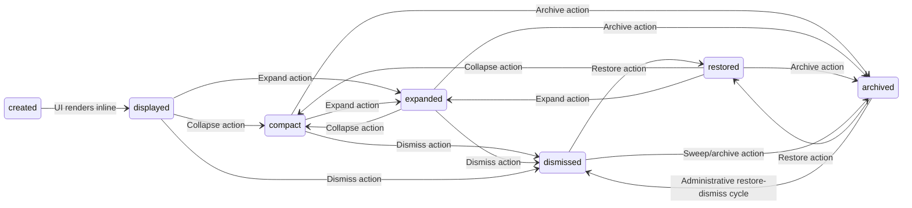

# SPEC-PL-03 — App Card System + Database-per-Card

> **Status:** Spec | **Blocks:** FE-12 (Card Renderer), FE-13 (Card Host Sandbox), BE-14 (Card Service), BE-15 (Card Event Bus), SPEC-PL-04 (Notification Cards), SPEC-TM-06 (Topic Cards)
> **References:** SPEC-PL-01 (JS Plugin System), SPEC-PL-02 (Built-in File Viewers), SPEC-DM-01 (Tree / Node / Edge DDL), SPEC-DM-02 (Tree Snapshot / Delta), SPEC-API-07 (Error Catalog), SPEC-API-01 (SSE Event Stream), SPEC-TM-01 (Topic Data Model), SPEC-TM-04 (Topic Reference Resolution), ARCHITECTURE.md §2, ARCHITECTURE.md §3, ARCHITECTURE.md §5, ARCHITECTURE.md §11

---

## 1. Purpose

Define the exact specification for Canopy's App Card System and its Database-per-Card architecture: the structured UI cards that agents render inline in the conversation tree, the SQLite-per-card-type storage layout, the event flow between agent processes, local card databases, the canopyd REST API, and the SSE delivery surface that keeps the UI in sync.

A Go worker reading this spec must implement `CardRepo`, `EventRepo`, `CardService`, the SQLite schema migrations, the card REST API, the SSE broadcaster, and the feedback loop from UI → agent with zero clarifying questions. A TypeScript worker reading this spec must implement `CardHost`, `CardRenderer`, `CompactCard`, `ExpandedCard`, `IterationCard`, the SSE client, and the action/feedback bridge inside the plugin sandbox.

Cards are first-class graph nodes with structured data. They are #referenceable like topics (SPEC-TM-01 through SPEC-TM-05). Each card type owns a dedicated SQLite database on the local filesystem. The server authoritative view lives in PostgreSQL; the local SQLite databases are the live render surface for the UI and the write path for offline agent activity.

---

## 2. Design Decisions

| # | Decision | Choice | Rationale |
|---|----------|--------|-----------|
| 1 | Card identity | UUIDv7 primary key, time-ordered | Matches SPEC-DM-01 node/edge identity semantics; enables ordered enumeration |
| 2 | Card-to-tree binding | Card metadata references a tree node via `node_id` | A card is attached to one tree node; card data lives outside the `nodes` table to avoid row bloat |
| 3 | Referenceability | Cards use the same `#<slug>` mechanism as topics | SPEC-TM-04 pattern; agents and users can link cards in message content |
| 4 | Storage architecture | Database-per-card-type SQLite at `~/.hermes/canopy/cards/{type}.db` | Isolation between card types; per-type tuning; easier backup/restore by type; prevents one noisy type from locking unrelated reads |
| 5 | Authoritative backend | PostgreSQL mirrors card metadata and aggregates events | SQLite is local-first; PostgreSQL is the multi-device sync and search source of truth |
| 6 | SQLite vs PostgreSQL for cards | SQLite for hot card payloads and local agent writes; PostgreSQL for search, cross-device sync, audit, and server-side listing | Keeps local writes fast and offline-capable; preserves server-driven consistency |
| 7 | Card types | `compact`, `expanded`, `iteration` | Three render budgets cover MVP surfaces: summary, detail, live agent work |
| 8 | Compact card shape | Summary text <=140 chars, up to one primary action | Fits inline in message stream without dominating vertical space |
| 9 | Expanded card shape | Full content, all declared actions, optional attachments | Mounted in right panel or inline expanded block |
| 10 | Iteration card shape | Dynamic payload updated by agent while work is in progress | Live terminal-like surface; supports streaming SSE updates |
| 11 | Event model | Append-only `events` table per card type | Enables replay, audit, feedback attribution, and SSE fan-out |
| 12 | Agent write path | Agent writes events to local SQLite; background syncer pushes to PostgreSQL | Local-first behavior survives canopyd restarts and offline agent sessions |
| 13 | UI read path | UI reads card data from local SQLite directly for render; server used for cross-device state and search | Removes round-trip latency from every render frame |
| 14 | User feedback path | User interactions write `user_feedback` on event rows; agent reads feedback via SSE or poll | Tight loop without requiring agent to own UI state |
| 15 | SSE delivery | canopyd emits `card_*` and `event_appended` events over existing SSE channel | Reuses SPEC-API-01 transport; no new socket layer |
| 16 | Multi-device sync | PostgreSQL is the merge target; last-writer-wins for `data_json`, append-only for events | Prevents event rewrite conflicts while allowing card payload reconciliation |
| 17 | Sync conflict resolution | `context_hash` mismatch triggers conflict metadata on the card row; UI shows merge controls | Detects when the same card was edited from two devices concurrently |
| 18 | Lifecycle | `created` → `displayed` → `collapsed` → `dismissed`; optional `promote`, `archive`, `restore` | Covers inline, expanded, archived, and restored states |
| 19 | Permission model | Cards inherit the tree's profile scope; plugin sandbox permissions apply to card-rendering plugins | Reuses SPEC-PL-01 permission gate |
| 20 | Sandbox reuse | Cards reuse SPEC-PL-01 iframe sandbox + postMessage envelope | One security model; consistent host/plugin contract |
| 21 | Plugin binding | `app_id` points to an installed plugin slug that renders the card | Cards are renderer-agnostic; the plugin declares card capabilities |
| 22 | Data shape | `data` is opaque JSON; schema is plugin-defined | Maximum flexibility across calendar, weather, deploy, code, and search cards |
| 23 | Actions model | `actions[]` with `label` and `handler` identifiers resolved by the plugin | UI renders buttons; plugin owns handler implementation inside sandbox |
| 24 | Context hash | SHA-256 of agent's serialized context at card creation time | Enables staleness detection and conflict reasoning |
| 25 | Soft deletes | Cards use `status` active/dismissed/archived; events never deleted | History preserved; UI hides dismissed cards by default |
| 26 | Indexing | Per-type indexes on `status`, `created_at`, `context_hash`, and `node_id` | Fast local lookup for render and agent queries |
| 27 | Backup/restore | Each `{type}.db` is independently restorable; event append-order is preserved within file | Supports point-in-time recovery for a single card type without touching the rest of the system |
| 28 | WAL mode | SQLite `PRAGMA journal_mode = WAL` for all card databases | Improves concurrency for reader-heavy UI + writer-heavy agent patterns |
| 29 | Busy timeout | `PRAGMA busy_timeout = 5000` for all card databases | Reduces `SQLITE_BUSY` errors during overlapping writes |
| 30 | Card limits | One active card per `(node_id, app_id)` by default; configurable per tree | Prevents duplicate cards from repeated agent emissions |
| 31 | Orphan handling | Background sweeper marks cards orphaned from deleted nodes as `dismissed` | Keeps card list coherent after tree edits |
| 32 | Large payload policy | Cards >512 KB are rejected on create; iteration cards stream deltas instead of full rewrites | Protects SQLite read performance and SSE bandwidth |
| 33 | Versioning | Card schema version stored in `cards.metadata_json.schema_version`; plugin declares compatible versions | Allows non-breaking plugin evolution without invalidating existing cards |
| 34 | Telemetry | Minimal local telemetry: card render time, action tap rate, feedback submit rate | Used to tune render budgets and action placement |
| 35 | Local-first security | SQLite files owned by user UID/GID; no network exposure; server access requires auth | Matches Canopy's local-first trust model |

---

## 3. SQLite DDL

### 3.1 Per-Type Card Database Layout

Each card type gets its own SQLite database at `~/.hermes/canopy/cards/{type}.db`. Supported types in MVP: `compact`, `expanded`, `iteration`. The schema is identical across types.

```sql
-- {type}.db
-- Shared schema for compact.db, expanded.db, iteration.db

-- cards: one row per card instance.
CREATE TABLE IF NOT EXISTS cards (
    id              TEXT        PRIMARY KEY,                     -- UUIDv7 hex
    app_id          TEXT        NOT NULL,                        -- plugin slug that renders this card
    card_type       TEXT        NOT NULL,                        -- 'compact' | 'expanded' | 'iteration'
    title           TEXT        NOT NULL DEFAULT '',              -- human-readable title
    data_json       TEXT        NOT NULL DEFAULT '{}',            -- opaque JSON payload
    actions_json    TEXT        NOT NULL DEFAULT '[]',            -- JSON array of action descriptors
    status          TEXT        NOT NULL DEFAULT 'active',        -- 'active' | 'dismissed' | 'archived'
    node_id         TEXT,                                       -- FK to tree node (application-enforced)
    tree_id         TEXT,                                       -- FK to tree (application-enforced)
    context_hash    TEXT        NOT NULL DEFAULT '',              -- SHA-256 hex of agent context at creation
    metadata_json   TEXT        NOT NULL DEFAULT '{}',            -- schema_version, plugin_version, render_hints
    created_at      TEXT        NOT NULL,                         -- ISO 8601
    updated_at      TEXT        NOT NULL,                         -- ISO 8601
    dismissed_at    TEXT,                                       -- ISO 8601 or NULL
    archived_at     TEXT,                                       -- ISO 8601 or NULL
    sync_status     TEXT        NOT NULL DEFAULT 'local',        -- 'local' | 'synced' | 'conflict'
    server_id       TEXT,                                       -- PostgreSQL card id after sync
    sync_error      TEXT        NOT NULL DEFAULT '',              -- human-readable sync failure
    CONSTRAINT chk_card_status
        CHECK (status IN ('active', 'dismissed', 'archived')),
    CONSTRAINT chk_card_type
        CHECK (card_type IN ('compact', 'expanded', 'iteration')),
    CONSTRAINT chk_card_sync_status
        CHECK (sync_status IN ('local', 'synced', 'conflict'))
);

-- events: append-only event stream for a single card type database.
CREATE TABLE IF NOT EXISTS events (
    id              TEXT        PRIMARY KEY,                     -- UUIDv7 hex
    card_id         TEXT        NOT NULL,                        -- FK to cards.id
    event_type      TEXT        NOT NULL,                        -- see §13
    payload_json    TEXT        NOT NULL DEFAULT '{}',            -- event-specific payload
    actor           TEXT        NOT NULL DEFAULT 'agent',         -- 'agent' | 'user' | 'system'
    user_feedback   TEXT        NOT NULL DEFAULT '',              -- free-form user response text
    feedback_at     TEXT,                                       -- ISO 8601 or NULL
    correlation_id  TEXT        NOT NULL DEFAULT '',              -- links related events across types
    created_at      TEXT        NOT NULL,                         -- ISO 8601
    CONSTRAINT chk_event_actor
        CHECK (actor IN ('agent', 'user', 'system')),
    CONSTRAINT chk_event_type
        CHECK (event_type IN (
            'card_created', 'card_viewed', 'card_expanded', 'card_collapsed',
            'card_dismissed', 'card_restored', 'card_archived',
            'action_triggered', 'feedback_submitted',
            'card_updated', 'card_expired', 'sync_conflict'
        ))
);

-- Indexes for local render and agent queries.
CREATE INDEX IF NOT EXISTS idx_cards_status
    ON cards(status);
CREATE INDEX IF NOT EXISTS idx_cards_created
    ON cards(created_at DESC);
CREATE INDEX IF NOT EXISTS idx_cards_node
    ON cards(node_id);
CREATE INDEX IF NOT EXISTS idx_cards_context_hash
    ON cards(context_hash);
CREATE INDEX IF NOT EXISTS idx_cards_sync
    ON cards(sync_status);
CREATE INDEX IF NOT EXISTS idx_events_card
    ON events(card_id, created_at DESC);
CREATE INDEX IF NOT EXISTS idx_events_type
    ON events(event_type);
CREATE INDEX IF NOT EXISTS idx_events_correlation
    ON events(correlation_id);
CREATE INDEX IF NOT EXISTS idx_events_created
    ON events(created_at DESC);
```

### 3.2 SQLite Pragmas

```sql
-- Applied on every open of a card database.
PRAGMA journal_mode = WAL;
PRAGMA busy_timeout = 5000;
PRAGMA synchronous = NORMAL;
PRAGMA cache_size = -64000;  -- 64 MB
PRAGMA mmap_size = 268435456; -- 256 MB
```

### 3.3 PostgreSQL Mirror Tables

```sql
-- 000095_cards.up.sql
CREATE TABLE cards (
    id              uuid        PRIMARY KEY DEFAULT uuidv7(),
    profile_id      uuid        NOT NULL REFERENCES profiles(id) ON DELETE CASCADE,
    app_id          text        NOT NULL,
    card_type       text        NOT NULL,
    title           text        NOT NULL DEFAULT '',
    data_json       jsonb       NOT NULL DEFAULT '{}',
    actions_json    jsonb       NOT NULL DEFAULT '[]',
    status          text        NOT NULL DEFAULT 'active',
    node_id         uuid,
    tree_id         uuid,
    context_hash    text        NOT NULL DEFAULT '',
    metadata_json   jsonb       NOT NULL DEFAULT '{}',
    created_at      timestamptz NOT NULL DEFAULT clock_timestamp(),
    updated_at      timestamptz NOT NULL DEFAULT clock_timestamp(),
    dismissed_at    timestamptz,
    archived_at     timestamptz,
    sync_status     text        NOT NULL DEFAULT 'synced',
    source_db_path  text        NOT NULL DEFAULT '',
    CONSTRAINT chk_card_status_pg
        CHECK (status IN ('active', 'dismissed', 'archived')),
    CONSTRAINT chk_card_type_pg
        CHECK (card_type IN ('compact', 'expanded', 'iteration'))
);

CREATE UNIQUE INDEX idx_cards_node_app_active
    ON cards(node_id, app_id)
    WHERE status = 'active';

CREATE INDEX idx_cards_profile        ON cards(profile_id);
CREATE INDEX idx_cards_tree           ON cards(tree_id);
CREATE INDEX idx_cards_status         ON cards(status);
CREATE INDEX idx_cards_created        ON cards(created_at DESC);
CREATE INDEX idx_cards_updated        ON cards(updated_at DESC);
CREATE INDEX idx_cards_context_hash   ON cards(context_hash);
CREATE INDEX idx_cards_sync           ON cards(sync_status);

-- 000096_card_events.up.sql
CREATE TABLE card_events (
    id              uuid        PRIMARY KEY DEFAULT uuidv7(),
    card_id         uuid        NOT NULL REFERENCES cards(id) ON DELETE CASCADE,
    event_type      text        NOT NULL,
    payload_json    jsonb       NOT NULL DEFAULT '{}',
    actor           text        NOT NULL DEFAULT 'agent',
    user_feedback   text        NOT NULL DEFAULT '',
    feedback_at     timestamptz,
    correlation_id  uuid,
    created_at      timestamptz NOT NULL DEFAULT clock_timestamp(),
    CONSTRAINT chk_card_event_actor
        CHECK (actor IN ('agent', 'user', 'system'))
);

CREATE INDEX idx_card_events_card      ON card_events(card_id, created_at DESC);
CREATE INDEX idx_card_events_type      ON card_events(event_type);
CREATE INDEX idx_card_events_created   ON card_events(created_at DESC);

-- 000095_cards.down.sql
DROP TABLE IF EXISTS cards;

-- 000096_card_events.down.sql
DROP TABLE IF EXISTS card_events;
```

---

## 4. Go Structs & Repository Interfaces

### 4.1 Package Layout

```text
internal/
├── card/
│   ├── models.go            # Card, CardEvent, CardAction, CardSyncMeta structs
│   ├── repo.go              # CardRepo + EventRepo interfaces + sqlite impl
│   ├── service.go           # CardService: lifecycle, actions, feedback
│   ├── sync.go              # Local SQLite ↔ PostgreSQL sync
│   ├── sweeper.go           # Orphan and expired card sweeper
│   ├── sse.go               # Card SSE broadcaster
│   ├── sqlite.go            # Open/initialize per-type SQLite databases
│   ├── handlers.go          # HTTP handlers for /api/cards/*
│   ├── planner.go           # Query/context compiler integration hooks
│   └── service_test.go      # Backend integration tests
```

### 4.2 Go Structs

```go
package card

import (
    "time"
    "github.com/google/uuid"
)

// CardStatus is the lifecycle state of a card.
type CardStatus string

const (
    CardStatusActive    CardStatus = "active"
    CardStatusDismissed CardStatus = "dismissed"
    CardStatusArchived  CardStatus = "archived"
)

// CardSyncStatus reflects local ↔ server agreement.
type CardSyncStatus string

const (
    CardSyncLocal   CardSyncStatus = "local"
    CardSyncSynced  CardSyncStatus = "synced"
    CardSyncConflict CardSyncStatus = "conflict"
)

// Actor identifies who caused an event.
type Actor string

const (
    ActorAgent   Actor = "agent"
    ActorUser    Actor = "user"
    ActorSystem  Actor = "system"
)

// EventType enumerates card events.
type EventType string

const (
    EventCardCreated        EventType = "card_created"
    EventCardViewed         EventType = "card_viewed"
    EventCardExpanded       EventType = "card_expanded"
    EventCardCollapsed      EventType = "card_collapsed"
    EventCardDismissed      EventType = "card_dismissed"
    EventCardRestored       EventType = "card_restored"
    EventCardArchived       EventType = "card_archived"
    EventActionTriggered    EventType = "action_triggered"
    EventFeedbackSubmitted  EventType = "feedback_submitted"
    EventCardUpdated        EventType = "card_updated"
    EventCardExpired        EventType = "card_expired"
    EventSyncConflict       EventType = "sync_conflict"
)

// Card is the canonical card row, mirrored between SQLite and PostgreSQL.
type Card struct {
    ID             uuid.UUID     `db:"id"              json:"id"`
    AppID          string        `db:"app_id"          json:"appId"`
    CardType       string        `db:"card_type"        json:"cardType"`
    Title          string        `db:"title"            json:"title"`
    DataJSON       string        `db:"data_json"        json:"data"`         // opaque JSON
    ActionsJSON    string        `db:"actions_json"     json:"actions"`      // opaque JSON array
    Status         CardStatus    `db:"status"           json:"status"`
    NodeID         *uuid.UUID    `db:"node_id"          json:"nodeId,omitempty"`
    TreeID         *uuid.UUID    `db:"tree_id"          json:"treeId,omitempty"`
    ContextHash    string        `db:"context_hash"     json:"contextHash"`
    MetadataJSON   string        `db:"metadata_json"    json:"metadata"`     // schema_version, plugin_version
    CreatedAt      time.Time     `db:"created_at"       json:"createdAt"`
    UpdatedAt      time.Time     `db:"updated_at"       json:"updatedAt"`
    DismissedAt    *time.Time    `db:"dismissed_at"     json:"dismissedAt,omitempty"`
    ArchivedAt     *time.Time    `db:"archived_at"      json:"archivedAt,omitempty"`
    SyncStatus     CardSyncStatus `db:"sync_status"    json:"syncStatus"`
    ServerID       *uuid.UUID    `db:"server_id"        json:"serverId,omitempty"`
    SyncError      string        `db:"sync_error"       json:"syncError,omitempty"`
}

// CardEvent is an append-only record in the events table.
type CardEvent struct {
    ID            uuid.UUID     `db:"id"              json:"id"`
    CardID        uuid.UUID     `db:"card_id"         json:"cardId"`
    EventType     EventType     `db:"event_type"       json:"eventType"`
    PayloadJSON   string        `db:"payload_json"     json:"payload"`
    Actor         Actor         `db:"actor"            json:"actor"`
    UserFeedback  string        `db:"user_feedback"    json:"userFeedback"`
    FeedbackAt    *time.Time    `db:"feedback_at"      json:"feedbackAt,omitempty"`
    CorrelationID string        `db:"correlation_id"   json:"correlationId"`
    CreatedAt     time.Time     `db:"created_at"       json:"createdAt"`
}

// CardAction is a typed action descriptor stored in actions_json.
type CardAction struct {
    Label         string            `json:"label"`
    Handler       string            `json:"handler"`
    Style         string            `json:"style,omitempty"`         // primary | secondary | destructive
    Confirm       string            `json:"confirm,omitempty"`       // optional confirmation prompt
    Capability    string            `json:"capability,omitempty"`    // required plugin permission slug
    Meta          map[string]any    `json:"meta,omitempty"`
}

// CardSyncMeta tracks multi-device sync metadata for conflict detection.
type CardSyncMeta struct {
    CardID          uuid.UUID `json:"cardId"`
    SourceDBPath    string    `json:"sourceDbPath"`
    LastSyncAt      time.Time `json:"lastSyncAt"`
    BaseContextHash string    `json:"baseContextHash"`
    ConflictReason  string    `json:"conflictReason,omitempty"`
}

// CardCreateInput is the request payload for creating a card.
type CardCreateInput struct {
    AppID       string                 `json:"appId"       validate:"required"`
    CardType    string                 `json:"cardType"    validate:"required,oneof=compact expanded iteration"`
    Title       string                 `json:"title"       validate:"required,max=200"`
    Data        map[string]any         `json:"data"       validate:"required"`
    Actions     []CardAction           `json:"actions"`
    NodeID      *uuid.UUID             `json:"nodeId,omitempty"`
    TreeID      *uuid.UUID             `json:"treeId,omitempty"`
    ContextHash string                 `json:"contextHash" validate:"required,sha256"`
    Metadata    map[string]any         `json:"metadata,omitempty"`
}

// CardUpdateInput is the request payload for updating a card.
type CardUpdateInput struct {
    Title     *string                `json:"title,omitempty"`
    Data      map[string]any         `json:"data,omitempty"`
    Actions   *[]CardAction          `json:"actions,omitempty"`
    Status    *CardStatus            `json:"status,omitempty"`
    Metadata  map[string]any         `json:"metadata,omitempty"`
}

// FeedbackInput is the request payload for submitting user feedback on an event.
type FeedbackInput struct {
    EventID     uuid.UUID `json:"eventId"     validate:"required"`
    UserFeedback string   `json:"userFeedback" validate:"required,max=2000"`
}

// CardListFilter controls listing behavior.
type CardListFilter struct {
    ProfileID   uuid.UUID
    TreeID      *uuid.UUID
    NodeID      *uuid.UUID
    Status      *CardStatus
    CardType    *string
    AppID       *string
    Limit       int
    Offset      int
    Sort        string // created_desc | updated_desc | title_asc
}
```

### 4.3 Repository Interfaces

```go
package card

import (
    "context"
    "github.com/google/uuid"
)

// CardRepo is the persistence interface for cards.
type CardRepo interface {
    // Create inserts a new card row into the appropriate local SQLite database.
    Create(ctx context.Context, dbPath string, c *Card) (*Card, error)

    // GetByID retrieves a card by ID from local SQLite.
    GetByID(ctx context.Context, dbPath string, id uuid.UUID) (*Card, error)

    // GetByNode returns the active card for a node/app combination.
    GetByNode(ctx context.Context, dbPath string, nodeID, appID string) (*Card, error)

    // List returns cards matching the filter from local SQLite.
    List(ctx context.Context, dbPath string, filter CardListFilter) ([]Card, error)

    // Update updates mutable card fields in local SQLite.
    Update(ctx context.Context, dbPath string, id uuid.UUID, input CardUpdateInput) (*Card, error)

    // SetStatus transitions a card to a new status.
    SetStatus(ctx context.Context, dbPath string, id uuid.UUID, status CardStatus, at *time.Time) (*Card, error)

    // SetSyncStatus updates the sync_status and optional server_id/sync_error.
    SetSyncStatus(ctx context.Context, dbPath string, id uuid.UUID, syncStatus CardSyncStatus, serverID *uuid.UUID, syncError string) error

    // SoftDelete dismisses or archives a card without removing the row.
    SoftDelete(ctx context.Context, dbPath string, id uuid.UUID, status CardStatus, at time.Time) error

    // HardDelete permanently removes a card. Use only after archival sweep.
    HardDelete(ctx context.Context, dbPath string, id uuid.UUID) error

    // CountActive returns the count of active cards for a node/app pair.
    CountActive(ctx context.Context, dbPath string, nodeID, appID string) (int, error)
}

// EventRepo is the append-only persistence interface for card events.
type EventRepo interface {
    // Append inserts a new event row.
    Append(ctx context.Context, dbPath string, e *CardEvent) error

    // ListByCard returns events for a card, newest first.
    ListByCard(ctx context.Context, dbPath string, cardID uuid.UUID, limit, offset int) ([]CardEvent, error)

    // GetLatestByType returns the latest event of a given type for a card.
    GetLatestByType(ctx context.Context, dbPath string, cardID uuid.UUID, eventType EventType) (*CardEvent, error)

    // SetFeedback updates user_feedback and feedback_at on an event.
    SetFeedback(ctx context.Context, dbPath string, eventID uuid.UUID, feedback string, at time.Time) error

    // CountByCard returns event count for pagination.
    CountByCard(ctx context.Context, dbPath string, cardID uuid.UUID) (int, error)

    // ListPendingSync returns events not yet acknowledged by the syncer.
    ListPendingSync(ctx context.Context, dbPath string, since time.Time, limit int) ([]CardEvent, error)
}

// CardService is the top-level application service for the card subsystem.
type CardService interface {
    // CreateCard validates input, writes to the card-type SQLite database, emits card_created event, and broadcasts SSE.
    CreateCard(ctx context.Context, input CardCreateInput) (*Card, error)

    // GetCard retrieves a card by ID from local SQLite.
    GetCard(ctx context.Context, cardType string, id uuid.UUID) (*Card, error)

    // ListCards returns cards from the requested type database.
    ListCards(ctx context.Context, cardType string, filter CardListFilter) ([]Card, error)

    // UpdateCard applies partial updates and emits card_updated.
    UpdateCard(ctx context.Context, cardType string, id uuid.UUID, input CardUpdateInput) (*Card, error)

    // DismissCard transitions a card to dismissed, records dismissed_at, emits card_dismissed.
    DismissCard(ctx context.Context, cardType string, id uuid.UUID) (*Card, error)

    // RestoreCard transitions a card back to active, clears dismissed_at/archived_at.
    RestoreCard(ctx context.Context, cardType string, id uuid.UUID) (*Card, error)

    // ArchiveCard transitions a card to archived, records archived_at.
    ArchiveCard(ctx context.Context, cardType string, id uuid.UUID) (*Card, error)

    // SubmitFeedback attaches user feedback to an event and emits feedback_submitted.
    SubmitFeedback(ctx context.Context, input FeedbackInput) (*CardEvent, error)

    // TriggerAction records an action_triggered event and returns handler resolution info to the caller.
    TriggerAction(ctx context.Context, cardType string, cardID uuid.UUID, actionHandler string, payload map[string]any) (*CardEvent, error)

    // MarkCardViewed records a card_viewed event for telemetry and SSE.
    MarkCardViewed(ctx context.Context, cardType string, cardID uuid.UUID) error

    // SyncPending pushes local changes to PostgreSQL; returns cards needing conflict resolution.
    SyncPending(ctx context.Context) ([]CardSyncMeta, error)

    // ResolveSyncConflict marks a card with conflict metadata after manual or automated merge.
    ResolveSyncConflict(ctx context.Context, cardID uuid.UUID, resolution string, mergedData map[string]any) (*Card, error)

    // SweepOrphans dismisses cards whose node_id no longer exists.
    SweepOrphans(ctx context.Context) (int, error)

    // SweepExpired archives iteration cards past their ttl.
    SweepExpired(ctx context.Context) (int, error)

    // BroadcastCardEvent publishes a card SSE event.
    BroadcastCardEvent(ctx context.Context, event CardSSEEvent) error
}

// CardSSEEvent is the SSE envelope for card system events.
type CardSSEEvent struct {
    EventType string                 `json:"eventType"`
    CardType  string                 `json:"cardType"`
    CardID    uuid.UUID              `json:"cardId"`
    Timestamp time.Time              `json:"timestamp"`
    Payload   map[string]any         `json:"payload,omitempty"`
}
```

### 4.4 Card Database Manager

```go
// CardDBManager opens and caches per-type SQLite database handles.
type CardDBManager interface {
    // DBPath returns the filesystem path for a card type.
    DBPath(cardType string) (string, error)

    // Open returns a *sql.DB for the card type, opening and initializing if needed.
    Open(cardType string) (*sql.DB, error)

    // CloseAll releases all open database handles.
    CloseAll() error
}
```

---

## 5. TypeScript Types & Zod Validation

### 5.1 Core Types

```typescript
// src/types/card.ts

export type CardStatus = 'active' | 'dismissed' | 'archived';
export type CardType   = 'compact' | 'expanded' | 'iteration';
export type Actor       = 'agent' | 'user' | 'system';
export type SyncStatus  = 'local' | 'synced' | 'conflict';

export type EventType =
  | 'card_created'
  | 'card_viewed'
  | 'card_expanded'
  | 'card_collapsed'
  | 'card_dismissed'
  | 'card_restored'
  | 'card_archived'
  | 'action_triggered'
  | 'feedback_submitted'
  | 'card_updated'
  | 'card_expired'
  | 'sync_conflict';

export interface CardAction {
  label: string;
  handler: string;
  style?: 'primary' | 'secondary' | 'destructive';
  confirm?: string;
  capability?: string;
  meta?: Record<string, unknown>;
}

export interface Card {
  id: string;
  appId: string;
  cardType: CardType;
  title: string;
  data: Record<string, unknown>;
  actions: CardAction[];
  status: CardStatus;
  nodeId?: string;
  treeId?: string;
  contextHash: string;
  metadata: Record<string, unknown>;
  createdAt: string;
  updatedAt: string;
  dismissedAt?: string;
  archivedAt?: string;
  syncStatus: SyncStatus;
  serverId?: string;
  syncError?: string;
}

export interface CardEvent {
  id: string;
  cardId: string;
  eventType: EventType;
  payload: Record<string, unknown>;
  actor: Actor;
  userFeedback: string;
  feedbackAt?: string;
  correlationId: string;
  createdAt: string;
}

export interface CardCreateInput {
  appId: string;
  cardType: CardType;
  title: string;
  data: Record<string, unknown>;
  actions?: CardAction[];
  nodeId?: string;
  treeId?: string;
  contextHash: string;
  metadata?: Record<string, unknown>;
}

export interface CardUpdateInput {
  title?: string;
  data?: Record<string, unknown>;
  actions?: CardAction[];
  status?: CardStatus;
  metadata?: Record<string, unknown>;
}

export interface FeedbackInput {
  eventId: string;
  userFeedback: string;
}

export interface CardListFilter {
  profileId: string;
  treeId?: string;
  nodeId?: string;
  status?: CardStatus;
  cardType?: CardType;
  appId?: string;
  limit: number;
  offset: number;
  sort: 'created_desc' | 'updated_desc' | 'title_asc';
}

export interface CardSSEEvent {
  eventType: EventType;
  cardType: CardType;
  cardId: string;
  timestamp: string;
  payload?: Record<string, unknown>;
}

export interface CardSyncMeta {
  cardId: string;
  sourceDbPath: string;
  lastSyncAt: string;
  baseContextHash: string;
  conflictReason?: string;
}
```

### 5.2 Zod Schemas

```typescript
import { z } from 'zod';

export const CardStatusSchema = z.enum(['active', 'dismissed', 'archived']);
export const CardTypeSchema   = z.enum(['compact', 'expanded', 'iteration']);
export const ActorSchema      = z.enum(['agent', 'user', 'system']);
export const SyncStatusSchema = z.enum(['local', 'synced', 'conflict']);

export const SHA256HexSchema = z.string().regex(/^[a-f0-9]{64}$/, 'Must be SHA-256 hex digest');

export const CardActionSchema = z.object({
  label: z.string().min(1).max(120),
  handler: z.string().min(1).max(120),
  style: z.enum(['primary', 'secondary', 'destructive']).optional(),
  confirm: z.string().max(500).optional(),
  capability: z.string().max(120).optional(),
  meta: z.record(z.unknown()).optional(),
});

export const CardSchema = z.object({
  id: z.string().uuid(),
  appId: z.string().min(1).max(120),
  cardType: CardTypeSchema,
  title: z.string().min(1).max(200),
  data: z.record(z.unknown()),
  actions: z.array(CardActionSchema).max(20).default([]),
  status: CardStatusSchema,
  nodeId: z.string().uuid().optional(),
  treeId: z.string().uuid().optional(),
  contextHash: SHA256HexSchema,
  metadata: z.record(z.unknown()).default({}),
  createdAt: z.string().datetime(),
  updatedAt: z.string().datetime(),
  dismissedAt: z.string().datetime().optional(),
  archivedAt: z.string().datetime().optional(),
  syncStatus: SyncStatusSchema,
  serverId: z.string().uuid().optional(),
  syncError: z.string().max(1000).default(''),
});

export const CardEventSchema = z.object({
  id: z.string().uuid(),
  cardId: z.string().uuid(),
  eventType: z.enum([
    'card_created', 'card_viewed', 'card_expanded', 'card_collapsed',
    'card_dismissed', 'card_restored', 'card_archived',
    'action_triggered', 'feedback_submitted',
    'card_updated', 'card_expired', 'sync_conflict',
  ]),
  payload: z.record(z.unknown()).default({}),
  actor: ActorSchema,
  userFeedback: z.string().max(2000).default(''),
  feedbackAt: z.string().datetime().optional(),
  correlationId: z.string().max(64).default(''),
  createdAt: z.string().datetime(),
});

export const CardCreateInputSchema = z.object({
  appId: z.string().min(1).max(120),
  cardType: CardTypeSchema,
  title: z.string().min(1).max(200),
  data: z.record(z.unknown()),
  actions: z.array(CardActionSchema).max(20).optional(),
  nodeId: z.string().uuid().optional(),
  treeId: z.string().uuid().optional(),
  contextHash: SHA256HexSchema,
  metadata: z.record(z.unknown()).optional(),
});

export const CardUpdateInputSchema = z.object({
  title: z.string().min(1).max(200).optional(),
  data: z.record(z.unknown()).optional(),
  actions: z.array(CardActionSchema).max(20).optional(),
  status: CardStatusSchema.optional(),
  metadata: z.record(z.unknown()).optional(),
});

export const FeedbackInputSchema = z.object({
  eventId: z.string().uuid(),
  userFeedback: z.string().min(1).max(2000),
});

export const CardListFilterSchema = z.object({
  profileId: z.string().uuid(),
  treeId: z.string().uuid().optional(),
  nodeId: z.string().uuid().optional(),
  status: CardStatusSchema.optional(),
  cardType: CardTypeSchema.optional(),
  appId: z.string().max(120).optional(),
  limit: z.number().int().min(1).max(200).default(50),
  offset: z.number().int().min(0).default(0),
  sort: z.enum(['created_desc', 'updated_desc', 'title_asc']).default('created_desc'),
});

export const CardSSEEventSchema = z.object({
  eventType: z.enum([
    'card_created', 'card_updated', 'card_dismissed',
    'event_appended', 'feedback_received',
  ]),
  cardType: CardTypeSchema,
  cardId: z.string().uuid(),
  timestamp: z.string().datetime(),
  payload: z.record(z.unknown()).optional(),
});
```

### 5.3 Frontend Card Host Contract

```typescript
// src/components/cards/CardHost.ts

export interface CardRenderContext {
  card: Card;
  profileId: string;
  treeId?: string;
  nodeId?: string;
  nonce: string;
  sseUrl: string;
}

export interface CardAPI {
  updateCard(cardId: string, patch: CardUpdateInput): Promise<Card>;
  submitFeedback(eventId: string, text: string): Promise<CardEvent>;
  triggerAction(cardId: string, handler: string, payload: Record<string, unknown>): Promise<CardEvent>;
  dismissCard(cardId: string): Promise<Card>;
  expandCard(cardId: string): Promise<Card>;
}

export interface PluginCardBridge {
  renderCard(card: Card, bridge: CardAPI): void;
  onAction(handler: string, payload: Record<string, unknown>): Promise<void>;
  onFeedback(text: string): Promise<void>;
}
```

---

## 6. Card Model & Schema

### 6.1 Card Record

A card is a structured node in the conversation DAG. The card row stores the current renderable state; the events table stores the full history of state transitions and user interactions.

```json
{
  "id": "019a7c3e-8b10-7abc-9001-112233445566",
  "app_id": "calendar",
  "card_type": "compact",
  "title": "Standup at 10:00",
  "data": {
    "summary": "Engineering standup — 10:00–10:15 in #general-voice",
    "start": "2026-07-22T10:00:00Z",
    "end": "2026-07-22T10:15:00Z",
    "location": "#general-voice",
    "attendees": ["kara", "alexis"],
    "status": "confirmed"
  },
  "actions": [
    {
      "label": "Join",
      "handler": "join_call",
      "style": "primary",
      "capability": "calendar_write"
    }
  ],
  "created_at": "2026-07-22T04:12:33Z",
  "context_hash": "a3f5b8c9d1e2f4a6b7c8d9e0f1a2b3c4d5e6f7a8b9c0d1e2f3a4b5c6d7e8f9a0"
}
```

### 6.2 Field Constraints

| Field | Constraint | Notes |
|-------|-----------|-------|
| `id` | UUIDv7, time-ordered | Primary key in both SQLite and PostgreSQL |
| `app_id` | Non-empty, max 120 chars | Must match an installed plugin slug |
| `card_type` | Enum: compact, expanded, iteration | Determines target SQLite database |
| `title` | 1–200 chars | Human-readable; used in accessibility labels |
| `data` | JSON object, max 512 KB serialized | Opaque to card core; plugin-defined schema |
| `actions` | JSON array, max 20 entries | Each entry must have `label` and `handler` |
| `status` | Enum: active, dismissed, archived | Soft lifecycle; rows never hard-deleted in normal operation |
| `node_id` | UUID or NULL | NULL for unattached cards |
| `tree_id` | UUID or NULL | NULL for detached cards |
| `context_hash` | SHA-256 hex, 64 chars | Empty string allowed only for system-created cards |
| `metadata` | JSON object | `schema_version`, `plugin_version`, `render_hints`, `ttl_seconds` for iteration cards |
| `sync_status` | Enum: local, synced, conflict | Updated by background syncer |
| `created_at` | ISO 8601 | Immutable after insert |
| `updated_at` | ISO 8601 | Updated on every mutation |

### 6.3 #Referenceable Identity

Cards are #referenceable using the same resolution pipeline as topics:

- Card slug is derived from `title` or explicit `metadata.slug`.
- #reference format: `#card-<slug>`.
- Resolution returns a card context payload containing the card row, recent events, and current status.
- Resolution is server-side at message send time, following SPEC-TM-04.

### 6.4 Relationship to Tree Nodes

- A card may reference a single `node_id`. This does not make the card part of the `nodes` table; it is a metadata link.
- When the referenced node is soft-deleted, the card is not immediately removed. The sweeper marks it `dismissed` and emits `card_expired`.
- Cards without a `node_id` are considered unattached and are not listed in tree views.

---

## 7. Card Lifecycle

### 7.1 State Machine



### 7.2 Lifecycle Rules

1. **created**: Agent or user creates a card. `status = active`, `sync_status = local`, `created_at` set.
2. **displayed**: UI first renders the card. `card_viewed` event appended; render telemetry captured.
3. **compact**: User collapses an expanded card, or a new compact card is created. Compact cards show summary and up to one primary action.
4. **expanded**: User expands a compact card, or an expanded card is created. Full data and all actions visible.
5. **dismissed**: User dismisses or agent requests dismissal. `dismissed_at` set, card hidden from default UI lists.
6. **archived**: Card is archived after extended inactivity or explicit user action. `archived_at` set. Archived cards are retained indefinitely and restorable.
7. **restored**: Archived or dismissed card is returned to active state. `dismissed_at` and `archived_at` cleared.
8. **expired**: Iteration cards with `metadata.ttl_seconds` exceeded are auto-archived by sweeper.

### 7.3 Promotion Rules

- A compact card can be promoted to expanded via user action or agent update.
- Promotion does not change `card_type` in this spec; it is a UI state tracked by events.
- Future extensions may introduce true type migration.

### 7.4 Orphan Handling

- When a card's `node_id` no longer exists in the tree, the sweeper transitions the card to `dismissed` and emits `card_expired`.
- Orphaned cards are not hard-deleted; they remain queryable for audit.

---

## 8. Event Model & Agent Integration

### 8.1 Event Flow

```mermaid
flowchart LR
    A[Agent Process] -->|writes events| B[Local SQLite\n{type}.db events table]
    B -->|background syncer| C[PostgreSQL\ncard_events table]
    B -->|direct read| D[UI Renderer]
    D -->|user interaction| E[User Feedback\nevent row user_feedback]
    E -->|writes back| B
    B -->|SSE| F[canopyd SSE\ncard_* / event_appended]
    F -->|push| D
    F -->|push| A
```

### 8.2 Event Types and Semantics

| Event Type | Actor | Meaning |
|-----------|-------|---------|
| `card_created` | agent | Card was created by agent or system |
| `card_viewed` | user | UI rendered the card for the first time |
| `card_expanded` | user | Card was expanded from compact |
| `card_collapsed` | user | Card was collapsed from expanded |
| `card_dismissed` | user/system | Card was dismissed |
| `card_restored` | user/system | Card was restored from dismissed or archived |
| `card_archived` | user/system | Card was archived |
| `action_triggered` | user | User tapped an action button |
| `feedback_submitted` | user | User submitted feedback on a card or event |
| `card_updated` | agent | Card data/metadata was updated |
| `card_expired` | system | Iteration card exceeded TTL or node was deleted |
| `sync_conflict` | system | PostgreSQL merge detected conflicting edits |

### 8.3 Agent Integration

- Agents create cards by calling `POST /api/cards/{type}` or by writing directly to the local SQLite database.
- Agents read card state by querying local SQLite or by consuming SSE events.
- Agents are notified of user feedback via SSE (`feedback_received`) or by polling `GET /api/cards/{type}/{id}/events`.
- Agents should treat `card_dismissed` and `card_archived` as terminal unless `card_restored` is observed.
- Iteration cards are designed for streaming: the agent appends `card_updated` events rather than rewriting the full `data_json`.

### 8.4 Feedback Loop

1. User interacts with a card (tap action, submit feedback).
2. UI writes an event row with `actor = user`.
3. If the interaction includes feedback text, `user_feedback` is set on the event row.
4. canopyd emits `feedback_received` over SSE.
5. Agent consumes the event and updates its internal state or next action.
6. Agent may update the card via `PATCH /api/cards/{type}/{id}`.

### 8.5 Correlation IDs

- Related events share a `correlation_id`. Examples:
  - One agent emission may produce `card_created` + `card_updated` + `action_triggered` with the same correlation ID.
  - A user session of feedback may be correlated across multiple cards via a session token.

---

## 9. Card Types

### 9.1 Compact Cards

- **Purpose:** Summary view in the message stream.
- **Data expectations:** Short summary string, optional icon, optional one primary action.
- **Render behavior:** Single-line or two-line summary; max width constrained to message column.
- **Actions:** At most one primary action. Secondary actions are hidden until expanded.
- **Size budget:** Target < 4 KB `data_json`.
- **Example:** Calendar event, weather summary, deploy status badge.

### 9.2 Expanded Cards

- **Purpose:** Full detail view in right panel or expanded inline block.
- **Data expectations:** Rich structured payload; multiple sections; all declared actions visible.
- **Render behavior:** Full-width panel; scrollable content; supports nested interactive elements inside sandbox.
- **Actions:** Up to 20 actions across primary, secondary, and destructive styles.
- **Size budget:** Target < 128 KB `data_json`. Larger payloads should be paginated or streamed.
- **Example:** Full task list, detailed search results, code execution output.

### 9.3 Iteration Cards

- **Purpose:** Live-updating surface for agent-in-progress work.
- **Data expectations:** Streaming delta payloads; partial updates; status indicator.
- **Render behavior:** Terminal-like or progress-like surface; auto-scrolls to latest event; supports cancel action.
- **Actions:** Primary cancel/stop action; optional pause/resume.
- **TTL:** `metadata.ttl_seconds` controls automatic expiration. Default 3600 seconds; max 86400 seconds.
- **Size budget:** Deltas should be < 8 KB each. Cumulative event stream may grow large; events are paginated in UI.
- **Example:** Agent reasoning steps, long-running command output, search results streaming in.

---

## 10. Error Catalog

| Code | HTTP Status | Condition | Message |
|------|-------------|-----------|---------|
| `CARD_NOT_FOUND` | 404 | Card ID does not exist in the requested type database | Card not found |
| `CARD_TYPE_UNKNOWN` | 400 | Card type is not one of compact, expanded, iteration | Unknown card type |
| `CARD_DUPLICATE_NODE_APP` | 409 | An active card already exists for the same node_id and app_id | Duplicate card for node |
| `CARD_INVALID_STATUS_TRANSITION` | 409 | Status transition is not allowed by the lifecycle | Invalid card status transition |
| `CARD_DATA_TOO_LARGE` | 413 | Serialized data_json exceeds 512 KB | Card data exceeds size limit |
| `CARD_ACTIONS_LIMIT_EXCEEDED` | 400 | actions array length exceeds 20 | Too many card actions |
| `CARD_CONTEXT_HASH_MALFORMED` | 400 | context_hash is not a valid SHA-256 hex string | Invalid context hash |
| `CARD_EVENT_NOT_FOUND` | 404 | Event ID does not exist on the requested card | Card event not found |
| `CARD_EVENT_INVALID_TYPE` | 400 | Event type is not in the canonical set | Invalid card event type |
| `CARD_FEEDBACK_TOO_LONG` | 400 | user_feedback exceeds 2000 characters | Feedback exceeds length limit |
| `CARD_DISMISSED_READ` | 404 | Card status is dismissed and the caller is not the owner | Card is dismissed |
| `CARD_ARCHIVED_READ` | 404 | Card status is archived and the caller is not the owner | Card is archived |
| `CARD_SYNC_CONFLICT` | 409 | PostgreSQL merge detected conflicting context_hash or data versions | Card sync conflict |
| `CARD_DB_OPEN_FAILED` | 500 | SQLite database for the card type could not be opened | Card database unavailable |
| `CARD_DB_BUSY` | 503 | SQLite returned SQLITE_BUSY after retries | Card database busy; retry later |
| `CARD_ORPHAN_DETECTED` | 409 | Card references a node_id that no longer exists | Card references deleted node |
| `CARD_PERMISSION_DENIED` | 403 | Caller does not have access to the card's tree/profile | Permission denied |
| `CARD_ACTION_HANDLER_UNKNOWN` | 400 | Action handler does not match any capability declared by the plugin | Unknown card action handler |
| `CARD_ITERATION_EXPIRED` | 410 | Iteration card TTL exceeded; card is no longer writable | Card iteration expired |
| `CARD_FEEDBACK_ON_DISMISSED` | 400 | Feedback submitted on an event belonging to a dismissed card | Cannot submit feedback on dismissed card |
| `CARD_PROMOTE_NOT_SUPPORTED` | 501 | Requested promotion changes card_type; not supported in this spec version | Card promotion not supported |
| `CARD_SSE_UNKNOWN_EVENT` | 500 | SSE event type is unknown to the card broadcaster | Unknown card SSE event |

---

## 11. Edge Cases

1. **Concurrent writes to the same card:** SQLite WAL + `busy_timeout` handles most cases. If both agents write simultaneously, the last writer wins for `data_json`; both writes append separate events.
2. **Offline card creation:** Agent writes to local SQLite with `sync_status = local`. UI reads local state. Syncer pushes to PostgreSQL when connectivity returns.
3. **Sync conflicts:** Two devices update `data_json` while offline. PostgreSQL merge sees divergent `context_hash` or `updated_at`. Card is marked `sync_status = conflict`; UI shows merge controls; agent is notified via SSE.
4. **Stale context_hash:** Agent reopens a card after its context has changed. Server returns the card with `context_hash` mismatch warning; agent decides whether to refresh or overwrite.
5. **Orphaned cards:** Node is deleted while cards reference it. Sweeper marks cards `dismissed`; existing references continue to resolve to the historical card row.
6. **Feedback on dismissed cards:** API rejects feedback submission on dismissed cards with `CARD_FEEDBACK_ON_DISMISSED`.
7. **Cross-device card state:** PostgreSQL is authoritative for listing and search. Local SQLite is authoritative for current render state. Sync merges append-only event streams first, then reconciles `data_json`.
8. **Large card data:** Cards exceeding 512 KB are rejected at create time. Iteration cards avoid full rewrites by emitting deltas.
9. **SQLite WAL lock contention:** `busy_timeout = 5000` plus `journal_mode = WAL` reduces reader/writer contention. If contention persists, card type is sharded by profile ID prefix.
10. **Backup/restore of card databases:** Each `{type}.db` is independently copyable while SQLite is not in the middle of a transaction. Restore requires resetting `sync_status = local` and re-running syncer.
11. **Plugin deletion with active cards:** Cards referencing a removed plugin are not deleted; they enter `sync_status = conflict` with `sync_error = 'plugin_missing'`. UI renders fallback card.
12. **Duplicate card creation race:** Two agents create cards for the same `(node_id, app_id)` simultaneously. Unique index on PostgreSQL enforces one active card; local SQLite allows both until sync, where one is marked `dismissed`.
13. **Event stream growth:** Iteration cards can accumulate thousands of events. UI paginates; server `ListByCard` uses cursor-based pagination.
14. **Clock skew across devices:** `created_at` uses ISO 8601 strings. Conflicts caused by clock skew are resolved by preferring the higher `context_hash` version or by manual merge.
15. **Node reassignment:** A card's `node_id` is updated when the user drags the card to another node. Old node loses the card reference without side effects.
16. **Card title changes:** Title updates regenerate `metadata.slug` for #reference resolution. Existing #references to old slug continue to resolve for 30 days via redirect table.
17. **Zero-byte actions array:** Allowed; treated as no actions. Compact cards with no actions render as read-only summary.
18. **Empty data object:** Allowed, but discouraged. Some plugins may reject empty data at registration time.
19. **Schema version mismatch:** Plugin declares `schema_version` incompatible with card `metadata.schema_version`. UI renders compatibility shim; agent is notified via `card_updated` event.
20. **Long feedback text:** Truncated to 2000 characters server-side. Client should warn before submission.
21. **Card TTL edge case:** `ttl_seconds = 0` means no expiration. Negative TTL is rejected at card creation.
22. **Local database corruption:** SQLite integrity check runs on every open. If corruption is detected, the database is quarantined and a fresh database is initialized; cards in the corrupted file are marked `sync_status = conflict`.

---

## 12. Testing

### 12.1 Backend Integration Tests

1. Create a compact card with valid input; expect 201 and correct SQLite row.
2. Create a card with `data_json` exceeding 512 KB; expect `CARD_DATA_TOO_LARGE`.
3. Create two compact cards for the same `(node_id, app_id)`; expect the second to be rejected with `CARD_DUPLICATE_NODE_APP`.
4. Create a card with malformed `context_hash`; expect `CARD_CONTEXT_HASH_MALFORMED`.
5. Get a card by ID after creation; expect exact match on `app_id`, `title`, `data`.
6. Update card `title`; expect `updated_at` to change and `card_updated` event to be appended.
7. Update card `data` with a new key; expect event payload to contain only the changed fields.
8. Dismiss a card; expect `status = dismissed` and `dismissed_at` populated.
9. Dismiss an already dismissed card; expect `CARD_INVALID_STATUS_TRANSITION`.
10. Restore a dismissed card; expect `status = active` and `dismissed_at = null`.
11. Archive an active card; expect `status = archived` and `archived_at` populated.
12. Restore an archived card; expect `status = active` and `archived_at = null`.
13. Submit feedback on a valid event; expect `user_feedback` populated and `feedback_submitted` event appended.
14. Submit feedback on a dismissed card's event; expect `CARD_FEEDBACK_ON_DISMISSED`.
15. Trigger an action with a valid handler; expect `action_triggered` event appended.
16. Trigger an action with unknown handler; expect `CARD_ACTION_HANDLER_UNKNOWN`.
17. List cards with `status = active`; expect only active cards returned.
18. List cards with `cardType = iteration` and `appId` filter; expect filtered results.
19. Paginate card events with limit/offset; expect correct slice and total count.
20. Append 1000 events to one card; expect `ListByCard` to paginate without OOM.
21. Open the same card type database from 50 concurrent goroutines; expect no `SQLITE_BUSY` failures.
22. Simulate offline creation: insert card with `sync_status = local`; expect syncer to push to PostgreSQL on `SyncPending`.
23. Simulate sync conflict: update same card in two local DBs; expect `sync_status = conflict` after merge attempt.
24. Resolve sync conflict with merged data; expect `sync_status = synced` and updated `data_json`.
25. Sweep orphans after deleting a referenced node; expect card marked `dismissed` and `card_expired` emitted.
26. Sweep expired iteration cards past TTL; expect cards marked `archived`.
27. Verify `card_viewed` event is appended on first UI render simulation.
28. Verify `card_expanded` and `card_collapsed` events are appended on state transitions.
29. Hard-delete an archived card; expect row removal and cascading event deletion.
30. Verify PostgreSQL mirror table consistency after `SyncPending`; expect matching `data_json` and `status`.

### 12.2 Frontend Tests

1. Render a compact card with summary <=140 chars and one action; expect correct inline layout.
2. Render a compact card with no actions; expect read-only styling.
3. Render an expanded card with 10 actions; expect all actions visible and primary action highlighted.
4. Render an iteration card with streaming events; expect auto-scroll and terminal styling.
5. Expand a compact card via user action; expect `card_expanded` SSE event emitted.
6. Collapse an expanded card; expect `card_collapsed` SSE event emitted.
7. Dismiss a card via UI action; expect `card_dismissed` SSE event and card removed from view.
8. Restore a dismissed card from archive view; expect card reappears in active list.
9. Submit feedback text on an action result; expect `feedback_submitted` event and confirmation toast.
10. Receive `card_updated` SSE event while card is mounted; expect data re-render without full unmount.
11. Receive `feedback_received` SSE event; expect inline acknowledgement in card UI.
12. Render card with `sync_status = conflict`; expect conflict banner with merge/reject controls.
13. Render card referencing missing plugin `app_id`; expect fallback UI with plugin-not-available message.
14. Render 100 compact cards in a scrollable list; expect no jank and stable frame budget.
15. Verify card #reference `#card-<slug>` resolves to correct card context payload.
16. Verify compact card truncates text >140 chars with ellipsis and full-text tooltip.
17. Verify iteration card shows spinner when no events have arrived yet.
18. Verify action button with `style = destructive` renders with warning color and confirmation dialog when `confirm` text is present.
19. Verify card accessibility: ARIA labels on actions, live region for iteration updates, focus management on expand/collapse.
20. Verify offline behavior: local SQLite reads succeed without network; sync status badge shows `local`.

---

## 13. SSE Event Specifications

### 13.1 Event Envelope

All card SSE events use the existing canopyd SSE channel under the `card` subject:

```
event: card
data: {"eventType":"card_created","cardType":"compact","cardId":"019a...","timestamp":"2026-07-22T04:12:33Z","payload":{...}}
```

### 13.2 Event Catalog

| Event Type | When Emitted | Key Payload Fields |
|-----------|--------------|-------------------|
| `card_created` | New card inserted | `appId`, `cardType`, `title`, `nodeId?`, `treeId?` |
| `card_updated` | Card data/title/status changed | `changedFields[]`, `status?` |
| `card_dismissed` | Card dismissed | `reason?` |
| `event_appended` | New event appended to events table | `eventType`, `actor`, `correlationId` |
| `feedback_received` | User feedback submitted | `eventId`, `userFeedback` |

### 13.3 SSE Format

```json
{
  "eventType": "card_created",
  "cardType": "compact",
  "cardId": "019a7c3e-8b10-7abc-9001-112233445566",
  "timestamp": "2026-07-22T04:12:33Z",
  "payload": {
    "appId": "calendar",
    "title": "Standup at 10:00",
    "nodeId": "019a7c3e-8b10-7abc-9001-998877665544",
    "syncStatus": "local"
  }
}
```

### 13.4 Subscription Model

- Clients subscribe to `card` events filtered by `cardType` or `cardId`.
- Agent processes subscribe to all card events for their active trees.
- SSE stream includes reconnection guidance: client replays last seen event ID to recover missed events.

---

## 14. API Endpoints Summary

| Method | Path | Request Body | Response | Auth |
|--------|------|--------------|----------|------|
| `POST` | `/api/cards/{type}` | `CardCreateInput` | `Card` (201) | Tree/profile member |
| `GET` | `/api/cards/{type}` | Query: `status`, `nodeId`, `appId`, `limit`, `offset`, `sort` | `{ cards: Card[], total: number }` | Tree/profile member |
| `GET` | `/api/cards/{type}/{id}` | — | `Card` | Card owner or tree member |
| `PATCH` | `/api/cards/{type}/{id}` | `CardUpdateInput` | `Card` | Card owner |
| `DELETE` | `/api/cards/{type}/{id}` | — | `204 No Content` | Card owner |
| `POST` | `/api/cards/{type}/{id}/dismiss` | — | `Card` | Card owner |
| `POST` | `/api/cards/{type}/{id}/restore` | — | `Card` | Card owner |
| `POST` | `/api/cards/{type}/{id}/archive` | — | `Card` | Card owner |
| `POST` | `/api/cards/{type}/{id}/actions/{handler}` | `{ payload?: Record<string, any> }` | `CardEvent` | Card owner |
| `POST` | `/api/cards/{type}/{id}/feedback` | `FeedbackInput` | `CardEvent` | Card owner |
| `GET` | `/api/cards/{type}/{id}/events` | Query: `limit`, `offset`, `eventType` | `{ events: CardEvent[], total: number }` | Card owner |
| `GET` | `/api/cards/{type}/{id}/events/{eventId}` | — | `CardEvent` | Card owner |
| `POST` | `/api/cards/sync` | — | `{ synced: number, conflicts: CardSyncMeta[] }` | Profile owner |
| `GET` | `/api/cards/references/{ref}` | — | `{ card: Card, events: CardEvent[] }` | Public if card is active |
| `GET` | `/api/cards/health` | — | `{ databases: Record<CardType, { path: string, size: number }> }` | Admin |

### 14.1 Card Type Parameter

The `{type}` path segment must be one of `compact`, `expanded`, or `iteration`. Requests with unknown types receive `CARD_TYPE_UNKNOWN`.

### 14.2 Pagination

- List endpoints use cursor-style pagination via `offset`/`limit` capped at 200.
- Event endpoints use `offset`/`limit` capped at 100.
- Responses include `total` counts where applicable.

### 14.3 idempotency

- `POST /api/cards/{type}` supports `Idempotency-Key` header. Replay of the same key returns the original card.
- Action and feedback endpoints are idempotent per `(card_id, handler)` or `(event_id)`.

---

## 15. References & Dependencies

| This Spec | Depends On | Dependency Type | Notes |
|-----------|-----------|-----------------|-------|
| SPEC-PL-03 | SPEC-PL-01 | Foundation | Reuses plugin sandbox, postMessage envelope, permission gate, render types |
| SPEC-PL-03 | SPEC-PL-02 | Integration | Built-in viewers show how fullscreen/card renderers mount inside the same host |
| SPEC-PL-03 | SPEC-DM-01 | Data model | UUIDv7, node/edge patterns, tree membership constraints |
| SPEC-PL-03 | SPEC-DM-02 | Delta sync | Tree snapshot/delta model informs card sync conflict resolution |
| SPEC-PL-03 | SPEC-API-07 | Error handling | Adopts canonical error code registration pattern |
| SPEC-PL-03 | SPEC-API-01 | Transport | SSE channel reused for card events |
| SPEC-PL-03 | SPEC-TM-01 | References | #reference resolution pattern, slug generation, topic-like identity |
| SPEC-PL-03 | SPEC-TM-04 | References | #reference parsing at send time and redirect semantics |
| SPEC-PL-03 | ARCHITECTURE.md §2 | Vision | Cards are first-class graph nodes |
| SPEC-PL-03 | ARCHITECTURE.md §3 | Data | SQLite local-first + PostgreSQL authoritative split |
| SPEC-PL-03 | ARCHITECTURE.md §5 | Render | Card host sandbox boundaries and mount points |
| SPEC-PL-03 | ARCHITECTURE.md §11 | Security | Sandboxed iframe + CSP trust model |
| SPEC-PL-04 | SPEC-PL-03 | Consumer | Notification cards extend the same card model and event bus |
| SPEC-TM-06 | SPEC-PL-03 | Consumer | Topic cards render topic context as cards |
| BE-14 | SPEC-PL-03 | Implementation | Card service, SQLite manager, syncer |
| BE-15 | SPEC-PL-03 | Implementation | Card event bus, SSE broadcaster |
| FE-12 | SPEC-PL-03 | Implementation | Card renderer components |
| FE-13 | SPEC-PL-03 | Implementation | Card host sandbox and plugin bridge |

---

## 16. Version History

| Version | Date | Author | Notes |
|---------|------|--------|-------|
| v1.0 | 2026-07-22 | Kara + Alexis Okuwa | Initial spec: App Card System + Database-per-Card architecture, 16 sections, 35 design decisions, 3 Mermaid diagrams |
