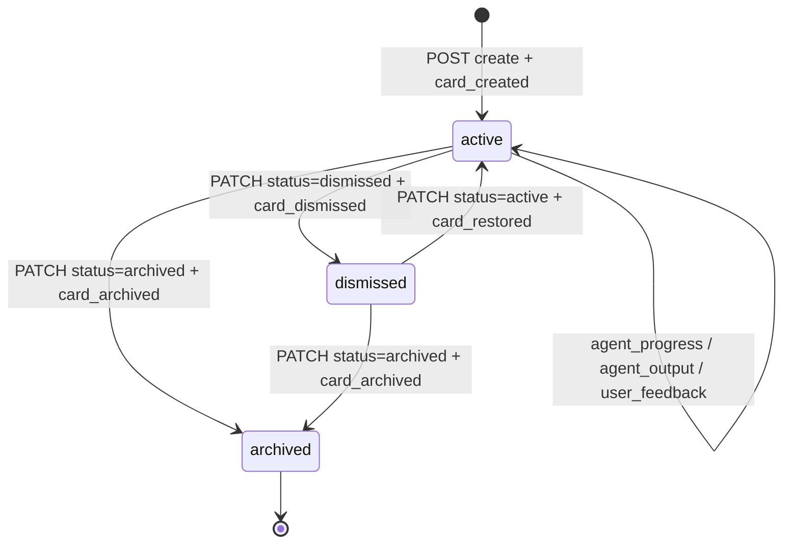
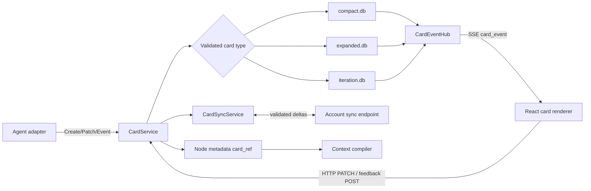
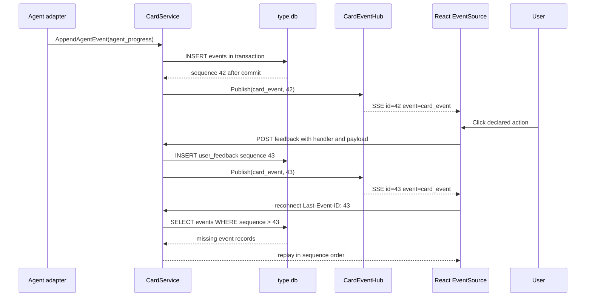

# SPEC-PL-03 — App Card System + Database-per-Card Architecture

> **Status:** Spec | **Blocks:** BE-12 (Card Store), BE-13 (Card Sync), BE-14 (Card SSE), FE-10 (Card Renderer), FE-11 (Card Actions)
> **References:** SPEC-PL-01, SPEC-PL-02, SPEC-DM-01, SPEC-API-01, SPEC-API-02, SPEC-API-03, SPEC-TM-01, SPEC-TM-04, ARCHITECTURE.md §3, ARCHITECTURE.md §5

---

## 1. Purpose

Define the exact implementation contract for Canopy app cards: structured, interactive graph nodes owned by an app and stored in a local SQLite database selected by card type. A Go worker reading this document can implement the card database manager, repositories, HTTP handlers, SSE bridge, synchronization service, reference resolver, and `canopyd` wiring without an additional design decision. A TypeScript worker can implement the card data client, Zod parsers, lifecycle state store, renderers, EventSource subscription, and action dispatch layer without guessing wire shapes.

A card is a first-class Canopy graph attachment with a UUIDv7 identity, app identifier, type, JSON data payload, declared actions, lifecycle status, creation timestamp, and immutable context hash. Cards are not messages and are not JavaScript plugins. A plugin described by SPEC-PL-01 can create or render a card only through the host card API, while built-in viewers described by SPEC-PL-02 can open card-attached files. The card is represented in a graph node metadata object from SPEC-DM-01 and is therefore visible in the tree UI defined by ARCHITECTURE.md §3.

The system has exactly three card types:

1. `compact` for small state snapshots and one-click work units.
2. `expanded` for persistent detailed work surfaces.
3. `iteration` for an agent activity trace, checkpoints, and user feedback during a bounded work loop.

Each type has an independent SQLite database at `~/.hermes/canopy/cards/{type}.db`. All databases implement the same two-table contract: `cards` is the current materialized card state and `events` is an append-only ordered record of activity. Agents append events while working. The UI receives those events through SSE. User actions append `user_feedback` events and update card state through HTTP. SQLite remains the local source of operation; synchronization replicates validated deltas to the account server for the same profile on another device.

---

## 2. Design Decisions

| Decision | Choice | Rationale |
|----------|--------|-----------|
| Card identity | UUIDv7 generated by the creator before persistence | Time ordering improves local scans and matches SPEC-DM-01 identity conventions |
| Card ownership | `app_id` is an application-scoped text identifier | Allows built-ins and installed plugins to use one card contract without a central app-table dependency |
| Card types | Exactly `compact`, `expanded`, and `iteration` | A closed set gives database routing, renderer selection, and validation deterministic behavior |
| Database placement | `~/.hermes/canopy/cards/{type}.db` | Separates card-type write patterns while keeping all local state inside the Hermes profile directory |
| Database engine | SQLite with WAL journaling and foreign keys enabled per connection | SQLite is local-first, transactional, portable, and safe for one local `canopyd` process |
| Database scope | One database per card type, not one file per card instance | Keeps file handles bounded and permits efficient typed list and event queries |
| Standard schema | Every card database contains precisely `cards` and `events` tables plus indexes and triggers | Shared repository code can use one schema contract after selecting a type database |
| Current state | `cards` holds the latest materialized JSON state | GET requests avoid replaying an event stream for every render |
| Activity history | `events` is append-only and ordered by integer sequence | Agent progress and user feedback stay auditable and SSE replay is deterministic |
| Event ordering | `events.sequence` is SQLite `INTEGER PRIMARY KEY AUTOINCREMENT` | Provides a stable monotonic sequence within each type database |
| Card status | `active`, `dismissed`, or `archived` | Active cards render normally; dismissed cards remain retrievable; archived cards are retained for sync and references |
| Status removal | No physical delete endpoint | References and event histories stay valid; archive is the terminal retention state |
| Data format | JSON text validated by SQLite JSON functions and Go/TypeScript schemas | Supports app-specific payloads while rejecting malformed stored state |
| Actions format | JSON array of `{label, handler}` objects | The renderer can expose declared interactions without evaluating app-provided code |
| Action handlers | Handler names match `^[a-z][a-z0-9_.-]{0,63}$` | Names are stable protocol identifiers and never executable JavaScript |
| Action execution | UI posts an event; the server routes the handler to the owning app adapter | Preserves an auditable interaction record and makes permission enforcement central |
| Context binding | `context_hash` is lowercase SHA-256 of the compiled context manifest | A card can prove which context produced its state without retaining hidden reasoning |
| Context refresh | A changed context creates an explicit `context_rebound` event | Prevents silent loss of provenance when an app attaches a card to a new graph context |
| Graph attachment | Node metadata stores a `card_ref` object containing ID, type, app ID, and context hash | Uses the DAG metadata contract in SPEC-DM-01 without duplicating card payloads in PostgreSQL |
| Text reference syntax | `#card:<type>/<uuidv7>` | Extends the readable reference behavior of SPEC-TM-04 while disambiguating cards from topic slugs |
| Internal reference URI | `ref://card/<type>/<uuidv7>` | Stable across display-label changes and parallel to the internal URI approach in SPEC-TM-04 |
| Reference resolution | The card resolver reads the type database selected by the parsed type | Resolution has one authoritative local location and does not scan unrelated card databases |
| Local reads | `canopyd` reads SQLite directly through the card repository | Cards remain available without a network connection |
| Multi-device replication | Validated event and card deltas sync through the account server | The local database remains usable offline while a second device converges after reconnecting |
| Sync conflict rule | Higher `revision` wins; equal revisions merge only disjoint JSON object keys; conflict emits an event | Gives deterministic conflict behavior while preserving visible evidence for incompatible writes |
| Sync cursor | Per-card-type opaque cursor persisted by the sync service | Each database can resume replication independently after a disconnect |
| SSE channel | EventSource subscribes to a card-specific event stream | Uses the server-to-client transport specified by SPEC-API-01 and ARCHITECTURE.md §5 |
| Client mutation channel | HTTP POST and PATCH only | Matches the server-push/client-mutate transport split in SPEC-API-01 |
| SSE replay | `Last-Event-ID` maps to the SQLite event sequence | Reconnected browsers receive only missing activity records |
| SSE heartbeat | `heartbeat` event every 30 seconds | Detects stale connections and aligns with SPEC-API-01 heartbeat behavior |
| Event payload limit | 256 KiB encoded JSON per event | Bounds disk usage, SSE frame size, and browser processing cost |
| Card data limit | 1 MiB encoded JSON per card | Allows rich structured payloads without turning cards into file storage |
| Action limit | At most 16 declared actions per card | Keeps compact cards usable and prevents action-bar abuse |
| Label limit | Action labels are 1 to 80 Unicode code points | Provides accessible controls with bounded UI layout |
| App ID format | 1 to 100 lowercase ASCII characters, digits, dots, underscores, or hyphens | Stable routing namespace and URL-safe diagnostics |
| Write authorization | A caller must own the card profile and match the card app adapter | Prevents one app from altering another app's card |
| Agent actor identity | Agent writes record `actor_kind = 'agent'` and actor ID | Separates agent progress from user decisions in the activity trace |
| User feedback | Every user action writes event type `user_feedback` before adapter dispatch | The interaction is durable even if the adapter returns an error |
| Optimistic concurrency | PATCH requires `If-Match` equal to the current revision | Avoids accidental overwrites by concurrent UI surfaces |
| Dismiss behavior | Dismiss changes status and emits `card_dismissed`; it does not erase data | The user can inspect or restore a dismissed card |
| Archive behavior | Archive changes status and rejects app-data updates | Preserves immutable historical cards while stopping active work |
| Renderer isolation | Plugin-backed renderer runs through the sandbox host in SPEC-PL-01 | Cards inherit capability-scoped execution rather than creating a second sandbox model |
| Built-in rendering | Built-in card renderers are compiled into the frontend bundle | Core Task, File, and Code cards work without an installation step |
| Accessibility | Card actions are buttons with labels, keyboard focus, and live region event announcements | Interactive graph content remains usable with keyboard and assistive technologies |
| Observability | Every HTTP write and sync decision emits a structured server log with card ID and type | Operators can trace routing and replication without logging private JSON payloads |

---

## 3. SQLite DDL

### 3.1 Database Initialization Contract

`CardDBManager.Open` creates the directory `~/.hermes/canopy/cards` with mode `0700`, opens only the database selected by a validated `CardType`, and executes these pragmas on every pooled connection:

```sql
PRAGMA journal_mode = WAL;
PRAGMA synchronous = NORMAL;
PRAGMA foreign_keys = ON;
PRAGMA busy_timeout = 5000;
PRAGMA temp_store = MEMORY;
```

The application creates UUIDv7 values before each insert. SQLite does not generate card IDs. `data` and `actions` are JSON text values; `json_valid` requires that the SQLite JSON1 extension is enabled, which is part of the supported `modernc.org/sqlite` build.

### 3.2 `compact.db` Migration

```sql
-- 000001_compact_cards.up.sql
CREATE TABLE cards (
    id              TEXT PRIMARY KEY NOT NULL,
    app_id          TEXT NOT NULL,
    card_type       TEXT NOT NULL DEFAULT 'compact',
    data            TEXT NOT NULL DEFAULT '{}',
    actions         TEXT NOT NULL DEFAULT '[]',
    status          TEXT NOT NULL DEFAULT 'active',
    context_hash    TEXT NOT NULL,
    revision        INTEGER NOT NULL DEFAULT 1,
    created_at      TEXT NOT NULL DEFAULT (strftime('%Y-%m-%dT%H:%M:%fZ', 'now')),
    updated_at      TEXT NOT NULL DEFAULT (strftime('%Y-%m-%dT%H:%M:%fZ', 'now')),
    dismissed_at    TEXT,
    archived_at     TEXT,
    CHECK (length(id) = 36),
    CHECK (app_id GLOB '[a-z0-9][a-z0-9._-]*' AND length(app_id) <= 100),
    CHECK (card_type = 'compact'),
    CHECK (json_valid(data)),
    CHECK (length(data) <= 1048576),
    CHECK (json_valid(actions) AND json_type(actions) = 'array'),
    CHECK (length(actions) <= 16384),
    CHECK (status IN ('active', 'dismissed', 'archived')),
    CHECK (length(context_hash) = 64 AND context_hash NOT GLOB '*[^0123456789abcdef]*'),
    CHECK (revision >= 1)
);

CREATE TABLE events (
    sequence         INTEGER PRIMARY KEY AUTOINCREMENT,
    event_id         TEXT NOT NULL UNIQUE,
    card_id          TEXT NOT NULL,
    event_type       TEXT NOT NULL,
    actor_kind       TEXT NOT NULL,
    actor_id         TEXT NOT NULL,
    payload          TEXT NOT NULL DEFAULT '{}',
    created_at       TEXT NOT NULL DEFAULT (strftime('%Y-%m-%dT%H:%M:%fZ', 'now')),
    CHECK (length(event_id) = 36),
    CHECK (event_type IN (
        'card_created', 'card_updated', 'card_dismissed', 'card_restored',
        'card_archived', 'agent_progress', 'agent_output', 'agent_error',
        'user_feedback', 'action_requested', 'action_completed',
        'context_rebound', 'sync_applied', 'sync_conflict'
    )),
    CHECK (actor_kind IN ('agent', 'user', 'system', 'sync')),
    CHECK (length(actor_id) BETWEEN 1 AND 128),
    CHECK (json_valid(payload)),
    CHECK (length(payload) <= 262144),
    FOREIGN KEY (card_id) REFERENCES cards(id) ON DELETE RESTRICT
);

CREATE INDEX idx_cards_status_created ON cards(status, created_at DESC);
CREATE INDEX idx_cards_app_status ON cards(app_id, status, updated_at DESC);
CREATE INDEX idx_cards_context_hash ON cards(context_hash);
CREATE INDEX idx_events_card_sequence ON events(card_id, sequence ASC);
CREATE INDEX idx_events_type_created ON events(event_type, created_at DESC);

CREATE TRIGGER trg_cards_updated_at
AFTER UPDATE OF app_id, data, actions, status, context_hash, revision ON cards
FOR EACH ROW
BEGIN
    UPDATE cards
    SET updated_at = strftime('%Y-%m-%dT%H:%M:%fZ', 'now')
    WHERE id = NEW.id;
END;

CREATE TRIGGER trg_events_no_update
BEFORE UPDATE ON events
FOR EACH ROW
BEGIN
    SELECT RAISE(ABORT, 'events is append-only');
END;

CREATE TRIGGER trg_events_no_delete
BEFORE DELETE ON events
FOR EACH ROW
BEGIN
    SELECT RAISE(ABORT, 'events is append-only');
END;
```

### 3.3 `expanded.db` Migration

```sql
-- 000001_expanded_cards.up.sql
CREATE TABLE cards (
    id TEXT PRIMARY KEY NOT NULL, app_id TEXT NOT NULL, card_type TEXT NOT NULL DEFAULT 'expanded',
    data TEXT NOT NULL DEFAULT '{}', actions TEXT NOT NULL DEFAULT '[]', status TEXT NOT NULL DEFAULT 'active',
    context_hash TEXT NOT NULL, revision INTEGER NOT NULL DEFAULT 1,
    created_at TEXT NOT NULL DEFAULT (strftime('%Y-%m-%dT%H:%M:%fZ', 'now')),
    updated_at TEXT NOT NULL DEFAULT (strftime('%Y-%m-%dT%H:%M:%fZ', 'now')), dismissed_at TEXT, archived_at TEXT,
    CHECK (length(id) = 36), CHECK (app_id GLOB '[a-z0-9][a-z0-9._-]*' AND length(app_id) <= 100),
    CHECK (card_type = 'expanded'), CHECK (json_valid(data)), CHECK (length(data) <= 1048576),
    CHECK (json_valid(actions) AND json_type(actions) = 'array'), CHECK (length(actions) <= 16384),
    CHECK (status IN ('active', 'dismissed', 'archived')),
    CHECK (length(context_hash) = 64 AND context_hash NOT GLOB '*[^0123456789abcdef]*'), CHECK (revision >= 1)
);
CREATE TABLE events (
    sequence INTEGER PRIMARY KEY AUTOINCREMENT, event_id TEXT NOT NULL UNIQUE, card_id TEXT NOT NULL,
    event_type TEXT NOT NULL, actor_kind TEXT NOT NULL, actor_id TEXT NOT NULL, payload TEXT NOT NULL DEFAULT '{}',
    created_at TEXT NOT NULL DEFAULT (strftime('%Y-%m-%dT%H:%M:%fZ', 'now')),
    CHECK (length(event_id) = 36),
    CHECK (event_type IN ('card_created','card_updated','card_dismissed','card_restored','card_archived','agent_progress','agent_output','agent_error','user_feedback','action_requested','action_completed','context_rebound','sync_applied','sync_conflict')),
    CHECK (actor_kind IN ('agent','user','system','sync')), CHECK (length(actor_id) BETWEEN 1 AND 128),
    CHECK (json_valid(payload)), CHECK (length(payload) <= 262144),
    FOREIGN KEY (card_id) REFERENCES cards(id) ON DELETE RESTRICT
);
CREATE INDEX idx_cards_status_created ON cards(status, created_at DESC);
CREATE INDEX idx_cards_app_status ON cards(app_id, status, updated_at DESC);
CREATE INDEX idx_cards_context_hash ON cards(context_hash);
CREATE INDEX idx_events_card_sequence ON events(card_id, sequence ASC);
CREATE INDEX idx_events_type_created ON events(event_type, created_at DESC);
CREATE TRIGGER trg_cards_updated_at AFTER UPDATE OF app_id, data, actions, status, context_hash, revision ON cards FOR EACH ROW BEGIN UPDATE cards SET updated_at = strftime('%Y-%m-%dT%H:%M:%fZ', 'now') WHERE id = NEW.id; END;
CREATE TRIGGER trg_events_no_update BEFORE UPDATE ON events FOR EACH ROW BEGIN SELECT RAISE(ABORT, 'events is append-only'); END;
CREATE TRIGGER trg_events_no_delete BEFORE DELETE ON events FOR EACH ROW BEGIN SELECT RAISE(ABORT, 'events is append-only'); END;
```

### 3.4 `iteration.db` Migration

```sql
-- 000001_iteration_cards.up.sql
CREATE TABLE cards (
    id TEXT PRIMARY KEY NOT NULL, app_id TEXT NOT NULL, card_type TEXT NOT NULL DEFAULT 'iteration',
    data TEXT NOT NULL DEFAULT '{}', actions TEXT NOT NULL DEFAULT '[]', status TEXT NOT NULL DEFAULT 'active',
    context_hash TEXT NOT NULL, revision INTEGER NOT NULL DEFAULT 1,
    created_at TEXT NOT NULL DEFAULT (strftime('%Y-%m-%dT%H:%M:%fZ', 'now')),
    updated_at TEXT NOT NULL DEFAULT (strftime('%Y-%m-%dT%H:%M:%fZ', 'now')), dismissed_at TEXT, archived_at TEXT,
    CHECK (length(id) = 36), CHECK (app_id GLOB '[a-z0-9][a-z0-9._-]*' AND length(app_id) <= 100),
    CHECK (card_type = 'iteration'), CHECK (json_valid(data)), CHECK (length(data) <= 1048576),
    CHECK (json_valid(actions) AND json_type(actions) = 'array'), CHECK (length(actions) <= 16384),
    CHECK (status IN ('active', 'dismissed', 'archived')),
    CHECK (length(context_hash) = 64 AND context_hash NOT GLOB '*[^0123456789abcdef]*'), CHECK (revision >= 1)
);
CREATE TABLE events (
    sequence INTEGER PRIMARY KEY AUTOINCREMENT, event_id TEXT NOT NULL UNIQUE, card_id TEXT NOT NULL,
    event_type TEXT NOT NULL, actor_kind TEXT NOT NULL, actor_id TEXT NOT NULL, payload TEXT NOT NULL DEFAULT '{}',
    created_at TEXT NOT NULL DEFAULT (strftime('%Y-%m-%dT%H:%M:%fZ', 'now')),
    CHECK (length(event_id) = 36),
    CHECK (event_type IN ('card_created','card_updated','card_dismissed','card_restored','card_archived','agent_progress','agent_output','agent_error','user_feedback','action_requested','action_completed','context_rebound','sync_applied','sync_conflict')),
    CHECK (actor_kind IN ('agent','user','system','sync')), CHECK (length(actor_id) BETWEEN 1 AND 128),
    CHECK (json_valid(payload)), CHECK (length(payload) <= 262144),
    FOREIGN KEY (card_id) REFERENCES cards(id) ON DELETE RESTRICT
);
CREATE INDEX idx_cards_status_created ON cards(status, created_at DESC);
CREATE INDEX idx_cards_app_status ON cards(app_id, status, updated_at DESC);
CREATE INDEX idx_cards_context_hash ON cards(context_hash);
CREATE INDEX idx_events_card_sequence ON events(card_id, sequence ASC);
CREATE INDEX idx_events_type_created ON events(event_type, created_at DESC);
CREATE TRIGGER trg_cards_updated_at AFTER UPDATE OF app_id, data, actions, status, context_hash, revision ON cards FOR EACH ROW BEGIN UPDATE cards SET updated_at = strftime('%Y-%m-%dT%H:%M:%fZ', 'now') WHERE id = NEW.id; END;
CREATE TRIGGER trg_events_no_update BEFORE UPDATE ON events FOR EACH ROW BEGIN SELECT RAISE(ABORT, 'events is append-only'); END;
CREATE TRIGGER trg_events_no_delete BEFORE DELETE ON events FOR EACH ROW BEGIN SELECT RAISE(ABORT, 'events is append-only'); END;
```

### 3.5 Down Migration

```sql
-- Run only while canopyd is stopped; one invocation for each type database.
DROP TRIGGER IF EXISTS trg_events_no_delete;
DROP TRIGGER IF EXISTS trg_events_no_update;
DROP TRIGGER IF EXISTS trg_cards_updated_at;
DROP TABLE IF EXISTS events;
DROP TABLE IF EXISTS cards;
```

---

## 4. Go Structs & Repository Interfaces

### 4.1 Package Layout

```
internal/card/
├── models.go          # Card, CardAction, CardEvent, enums, DTOs
├── database.go        # CardDBManager and validated type-to-path routing
├── repo.go            # CardRepository and SQLite implementation
├── service.go         # CardService lifecycle, action, reference, and sync policy
├── handlers.go        # HTTP and SSE handlers under /api/cards
├── sse.go             # CardEventHub and replay encoding
├── sync.go            # CardSyncService delta export and application
├── reference.go       # #card parser and resolver for context assembly
└── app_adapter.go     # registered built-in and plugin-backed app adapters
```

### 4.2 Go Models

```go
package card

import (
    "encoding/json"
    "time"

    "github.com/google/uuid"
)

type CardType string

const (
    CardTypeCompact   CardType = "compact"
    CardTypeExpanded  CardType = "expanded"
    CardTypeIteration CardType = "iteration"
)

type CardStatus string

const (
    CardStatusActive    CardStatus = "active"
    CardStatusDismissed CardStatus = "dismissed"
    CardStatusArchived  CardStatus = "archived"
)

type CardEventType string

const (
    EventCardCreated     CardEventType = "card_created"
    EventCardUpdated     CardEventType = "card_updated"
    EventCardDismissed   CardEventType = "card_dismissed"
    EventCardRestored    CardEventType = "card_restored"
    EventCardArchived    CardEventType = "card_archived"
    EventAgentProgress   CardEventType = "agent_progress"
    EventAgentOutput     CardEventType = "agent_output"
    EventAgentError      CardEventType = "agent_error"
    EventUserFeedback    CardEventType = "user_feedback"
    EventActionRequested CardEventType = "action_requested"
    EventActionCompleted CardEventType = "action_completed"
    EventContextRebound  CardEventType = "context_rebound"
    EventSyncApplied     CardEventType = "sync_applied"
    EventSyncConflict    CardEventType = "sync_conflict"
)

type CardActorKind string

const (
    ActorAgent  CardActorKind = "agent"
    ActorUser   CardActorKind = "user"
    ActorSystem CardActorKind = "system"
    ActorSync   CardActorKind = "sync"
)

type CardAction struct {
    Label   string `json:"label"`
    Handler string `json:"handler"`
}

type Card struct {
    ID          uuid.UUID       `db:"id"           json:"id"`
    AppID       string          `db:"app_id"       json:"appId"`
    CardType    CardType        `db:"card_type"    json:"cardType"`
    Data        json.RawMessage `db:"data"         json:"data"`
    Actions     []CardAction    `db:"actions"      json:"actions"`
    Status      CardStatus      `db:"status"       json:"status"`
    ContextHash string          `db:"context_hash" json:"contextHash"`
    Revision    int64           `db:"revision"     json:"revision"`
    CreatedAt   time.Time       `db:"created_at"   json:"createdAt"`
    UpdatedAt   time.Time       `db:"updated_at"   json:"updatedAt"`
    DismissedAt *time.Time      `db:"dismissed_at" json:"dismissedAt,omitempty"`
    ArchivedAt  *time.Time      `db:"archived_at"  json:"archivedAt,omitempty"`
}

type CardEvent struct {
    Sequence  int64           `db:"sequence"   json:"sequence"`
    EventID   uuid.UUID       `db:"event_id"   json:"eventId"`
    CardID    uuid.UUID       `db:"card_id"    json:"cardId"`
    EventType CardEventType   `db:"event_type" json:"eventType"`
    ActorKind CardActorKind   `db:"actor_kind" json:"actorKind"`
    ActorID   string          `db:"actor_id"   json:"actorId"`
    Payload   json.RawMessage `db:"payload"    json:"payload"`
    CreatedAt time.Time       `db:"created_at" json:"createdAt"`
}

type CreateCardInput struct {
    ID          uuid.UUID       `json:"id"`
    AppID       string          `json:"appId"`
    CardType    CardType        `json:"cardType"`
    Data        json.RawMessage `json:"data"`
    Actions     []CardAction    `json:"actions"`
    ContextHash string          `json:"contextHash"`
    ActorID     string          `json:"-"`
}

type PatchCardInput struct {
    Data        *json.RawMessage `json:"data,omitempty"`
    Actions     *[]CardAction    `json:"actions,omitempty"`
    Status      *CardStatus      `json:"status,omitempty"`
    ContextHash *string          `json:"contextHash,omitempty"`
    ActorID     string           `json:"-"`
}

type AppendEventInput struct {
    EventID   uuid.UUID       `json:"eventId"`
    EventType CardEventType   `json:"eventType"`
    ActorKind CardActorKind   `json:"actorKind"`
    ActorID   string          `json:"actorId"`
    Payload   json.RawMessage `json:"payload"`
}

type CardReference struct {
    ID          uuid.UUID `json:"id"`
    CardType    CardType  `json:"cardType"`
    AppID       string    `json:"appId"`
    ContextHash string    `json:"contextHash"`
}

type CardSSEEvent struct {
    EventType string    `json:"event_type"`
    CardType  CardType  `json:"card_type"`
    CardID    uuid.UUID `json:"card_id"`
    Sequence  int64     `json:"sequence"`
    Timestamp time.Time `json:"timestamp"`
    Data      any       `json:"data"`
}
```

### 4.3 Repository and Service Interfaces

```go
package card

import (
    "context"

    "github.com/google/uuid"
)

type ListCardsOptions struct {
    AppID          string
    Status         *CardStatus
    ContextHash    string
    Limit          int
    BeforeCreatedAt string
}

type CardRepository interface {
    Create(ctx context.Context, input CreateCardInput) (*Card, error)
    Get(ctx context.Context, id uuid.UUID) (*Card, error)
    List(ctx context.Context, options ListCardsOptions) ([]Card, error)
    Patch(ctx context.Context, id uuid.UUID, expectedRevision int64, input PatchCardInput) (*Card, error)
    AppendEvent(ctx context.Context, cardID uuid.UUID, input AppendEventInput) (*CardEvent, error)
    ListEvents(ctx context.Context, cardID uuid.UUID, afterSequence int64, limit int) ([]CardEvent, error)
    MaxSequence(ctx context.Context, cardID uuid.UUID) (int64, error)
    GetByContextHash(ctx context.Context, contextHash string) ([]Card, error)
    Close() error
}

type CardDBManager interface {
    Repository(ctx context.Context, cardType CardType) (CardRepository, error)
    DatabasePath(cardType CardType) (string, error)
    Migrate(ctx context.Context, cardType CardType) error
    Close() error
}

type CardEventPublisher interface {
    Publish(ctx context.Context, event CardSSEEvent) error
    Subscribe(cardType CardType, cardID uuid.UUID) (<-chan CardSSEEvent, func(), error)
}

type AppCardAdapter interface {
    AppID() string
    CreateCard(ctx context.Context, input CreateCardInput) error
    HandleAction(ctx context.Context, card *Card, handler string, feedback AppendEventInput) (json.RawMessage, error)
}

type CardService interface {
    Create(ctx context.Context, input CreateCardInput) (*Card, error)
    Get(ctx context.Context, cardType CardType, id uuid.UUID) (*Card, error)
    Patch(ctx context.Context, cardType CardType, id uuid.UUID, expectedRevision int64, input PatchCardInput) (*Card, error)
    AppendAgentEvent(ctx context.Context, cardType CardType, cardID uuid.UUID, input AppendEventInput) (*CardEvent, error)
    SubmitFeedback(ctx context.Context, cardType CardType, cardID uuid.UUID, handler string, input AppendEventInput) (*CardEvent, error)
    ListEvents(ctx context.Context, cardType CardType, cardID uuid.UUID, afterSequence int64, limit int) ([]CardEvent, error)
    ResolveReference(ctx context.Context, raw string) (*CardReference, error)
}

type CardSyncService interface {
    Export(ctx context.Context, cardType CardType, cursor string, limit int) (CardSyncBatch, error)
    Apply(ctx context.Context, cardType CardType, batch CardSyncBatch, actorID string) (CardSyncResult, error)
}

type CardSyncBatch struct {
    Cursor string      `json:"cursor"`
    Cards  []Card      `json:"cards"`
    Events []CardEvent `json:"events"`
}

type CardSyncResult struct {
    Cursor          string      `json:"cursor"`
    AppliedCardIDs  []uuid.UUID `json:"appliedCardIds"`
    ConflictCardIDs []uuid.UUID `json:"conflictCardIds"`
}
```

### 4.4 Invariants Enforced by `CardService`

1. `Create` rejects an ID that is not UUIDv7 before opening a transaction.
2. The path-selected `CardType` must equal `CreateCardInput.CardType`.
3. `Patch` rejects empty patches and requires a positive expected revision.
4. An archived card accepts only synchronization idempotency events and rejects mutable card fields.
5. A dismissed card may be restored to active or archived, but agent app-data updates require restoration first.
6. `SubmitFeedback` appends `user_feedback`, publishes it, invokes the matching adapter, then appends `action_completed` or `agent_error` in one logical request sequence.
7. All writes insert their corresponding lifecycle event before publishing SSE.
8. Repository transactions use `BEGIN IMMEDIATE` for card materialization updates and event inserts.

---

## 5. TypeScript Types & Zod Validation

### 5.1 Canonical Types

```ts
import { z } from 'zod'

export const cardTypeValues = ['compact', 'expanded', 'iteration'] as const
export type CardType = (typeof cardTypeValues)[number]

export const cardStatusValues = ['active', 'dismissed', 'archived'] as const
export type CardStatus = (typeof cardStatusValues)[number]

export const cardEventTypeValues = [
  'card_created', 'card_updated', 'card_dismissed', 'card_restored',
  'card_archived', 'agent_progress', 'agent_output', 'agent_error',
  'user_feedback', 'action_requested', 'action_completed',
  'context_rebound', 'sync_applied', 'sync_conflict',
] as const
export type CardEventType = (typeof cardEventTypeValues)[number]

export const cardActorKindValues = ['agent', 'user', 'system', 'sync'] as const
export type CardActorKind = (typeof cardActorKindValues)[number]

export interface CardAction {
  label: string
  handler: string
}

export interface Card {
  id: string
  appId: string
  cardType: CardType
  data: Record<string, unknown>
  actions: CardAction[]
  status: CardStatus
  contextHash: string
  revision: number
  createdAt: string
  updatedAt: string
  dismissedAt?: string
  archivedAt?: string
}

export interface CardEvent {
  sequence: number
  eventId: string
  cardId: string
  eventType: CardEventType
  actorKind: CardActorKind
  actorId: string
  payload: Record<string, unknown>
  createdAt: string
}

export interface CardSSEEvent {
  event_type: 'card_event' | 'card_snapshot' | 'heartbeat'
  card_type: CardType
  card_id: string
  sequence: number
  timestamp: string
  data: CardEvent | Card | { lastSequence: number }
}
```

### 5.2 Zod Schemas

```ts
const uuidV7Pattern = /^[0-9a-f]{8}-[0-9a-f]{4}-7[0-9a-f]{3}-[89ab][0-9a-f]{3}-[0-9a-f]{12}$/i
const sha256Pattern = /^[a-f0-9]{64}$/
const appIdPattern = /^[a-z0-9][a-z0-9._-]{0,99}$/
const handlerPattern = /^[a-z][a-z0-9_.-]{0,63}$/

export const CardTypeSchema = z.enum(cardTypeValues)
export const CardStatusSchema = z.enum(cardStatusValues)
export const CardEventTypeSchema = z.enum(cardEventTypeValues)
export const CardActorKindSchema = z.enum(cardActorKindValues)

export const CardActionSchema = z.object({
  label: z.string().trim().min(1).max(80),
  handler: z.string().regex(handlerPattern),
}).strict()

export const CardSchema = z.object({
  id: z.string().regex(uuidV7Pattern, 'id must be UUIDv7'),
  appId: z.string().regex(appIdPattern, 'invalid appId'),
  cardType: CardTypeSchema,
  data: z.record(z.string(), z.unknown()),
  actions: z.array(CardActionSchema).max(16),
  status: CardStatusSchema,
  contextHash: z.string().regex(sha256Pattern, 'contextHash must be SHA-256'),
  revision: z.number().int().positive(),
  createdAt: z.string().datetime(),
  updatedAt: z.string().datetime(),
  dismissedAt: z.string().datetime().optional(),
  archivedAt: z.string().datetime().optional(),
}).strict()

export const CardEventSchema = z.object({
  sequence: z.number().int().positive(),
  eventId: z.string().regex(uuidV7Pattern, 'eventId must be UUIDv7'),
  cardId: z.string().regex(uuidV7Pattern, 'cardId must be UUIDv7'),
  eventType: CardEventTypeSchema,
  actorKind: CardActorKindSchema,
  actorId: z.string().min(1).max(128),
  payload: z.record(z.string(), z.unknown()),
  createdAt: z.string().datetime(),
}).strict()

export const CreateCardRequestSchema = z.object({
  id: z.string().regex(uuidV7Pattern),
  appId: z.string().regex(appIdPattern),
  cardType: CardTypeSchema,
  data: z.record(z.string(), z.unknown()),
  actions: z.array(CardActionSchema).max(16),
  contextHash: z.string().regex(sha256Pattern),
}).strict()

export const PatchCardRequestSchema = z.object({
  data: z.record(z.string(), z.unknown()).optional(),
  actions: z.array(CardActionSchema).max(16).optional(),
  status: CardStatusSchema.optional(),
  contextHash: z.string().regex(sha256Pattern).optional(),
}).strict().refine(value => Object.keys(value).length > 0, 'at least one field is required')

export const FeedbackRequestSchema = z.object({
  eventId: z.string().regex(uuidV7Pattern),
  handler: z.string().regex(handlerPattern),
  payload: z.record(z.string(), z.unknown()),
}).strict()

export const CardSSEEventSchema = z.object({
  event_type: z.enum(['card_event', 'card_snapshot', 'heartbeat']),
  card_type: CardTypeSchema,
  card_id: z.string().regex(uuidV7Pattern),
  sequence: z.number().int().nonnegative(),
  timestamp: z.string().datetime(),
  data: z.unknown(),
}).strict()
```

### 5.3 Client Store Rules

The `useCardStore` reducer inserts a `card_snapshot` only when its revision is newer than local state. It inserts a `card_event` only when `sequence` is exactly `lastSequence + 1`. A sequence gap triggers a REST replay request with `after_sequence=lastSequence`; it does not invent a local event. A parsed payload failing `CardSchema`, `CardEventSchema`, or `CardSSEEventSchema` is surfaced as a non-destructive card error banner and logged with the event ID.

---

## 6. Card Rendering & Lifecycle

### 6.1 Renderer Dispatch

The frontend resolves a renderer by `(appId, cardType)`. Built-in adapters register explicit React components. Plugin adapters render within the sandbox host specified by SPEC-PL-01. No renderer receives a capability wider than the app adapter's declared permissions. The renderer receives a validated `Card`, a read-only event list, and an `invokeAction(handler, payload)` callback.

The default card frame always renders the application identifier, card type, status badge, creation time, context-hash affordance, activity indicator, and declared actions. The frame does not render raw arbitrary HTML from `data` or event payloads. App-specific display content is text-escaped by React or generated in the plugin iframe.

### 6.2 Card Lifecycle State Machine



### 6.3 Lifecycle Rules

| Transition | Actor | Required precondition | Durable writes | SSE event |
|------------|-------|-----------------------|----------------|-----------|
| Create → active | App adapter or authorized API caller | UUIDv7 is unused; path type equals body type | `cards` row and `card_created` event | `card_snapshot`, `card_event` |
| Active update | App adapter or authorized API caller | `If-Match` equals revision | card update, revision increment, `card_updated` event | `card_snapshot`, `card_event` |
| Agent progress | Agent adapter | Card status is active | `agent_progress` event | `card_event` |
| User feedback | User | Handler is declared in `actions`; card status is active | `user_feedback`, adapter result event | `card_event` |
| Active → dismissed | User or app adapter | `If-Match` equals revision | status update, `dismissed_at`, `card_dismissed` | `card_snapshot`, `card_event` |
| Dismissed → active | User or app adapter | `If-Match` equals revision | status update, cleared `dismissed_at`, `card_restored` | `card_snapshot`, `card_event` |
| Active/dismissed → archived | User or app adapter | `If-Match` equals revision | status update, `archived_at`, `card_archived` | `card_snapshot`, `card_event` |

### 6.4 Graph Attachment and `#card` Resolution

A graph node carries this metadata shape:

```json
{
  "card_ref": {
    "id": "0191a9c3-0000-7000-8000-000000000000",
    "card_type": "iteration",
    "app_id": "canopy.agent",
    "context_hash": "c4a2f1d6c7b8e9f00112233445566778899aabbccddeeff0011223344556677"
  }
}
```

The reference parser extends the topic parser from SPEC-TM-04 with `#card:<type>/<id>`. It produces `ref://card/<type>/<id>`, validates the type and UUIDv7, then resolves the card in the selected database. The context compiler described in ARCHITECTURE.md §5 receives a compact reference envelope containing card ID, app ID, status, context hash, selected data fields, and the most recent 20 events. It excludes data keys marked by the adapter as private. A missing, dismissed, or archived card is still resolved with its status; only malformed references fail parsing.

---

## 7. Card Types

### 7.1 Compact Cards

Compact cards occupy a single graph-node-sized frame. They are intended for a task state, file summary, code check result, or short agent handoff. A compact card data object must contain `title` and may contain `summary`, `icon`, `badge`, and adapter-defined fields. The renderer shows no more than three actions directly; remaining actions are available in an accessible overflow menu.

```json
{
  "title": "Run migration checks",
  "summary": "12/12 migrations validated locally",
  "icon": "database",
  "badge": "passed"
}
```

Compact cards use `canopy.task`, `canopy.file`, and `canopy.code` built-in app IDs. They may be attached to any non-deleted DAG node defined in SPEC-DM-01.

### 7.2 Expanded Cards

Expanded cards occupy the inspector pane or an inline graph detail surface. They are intended for structured documents, a file-viewer surface, a multi-step task, or a code review summary. Their `data` object must contain `title` and `sections`, where `sections` is an ordered array of app-owned structured sections. Large binary content is stored as a file reference and opened through SPEC-PL-02 rather than copied into the card database.

```json
{
  "title": "Release checklist",
  "sections": [
    {"id": "build", "label": "Build", "state": "passed"},
    {"id": "tests", "label": "Tests", "state": "running"}
  ]
}
```

Expanded cards expose the same action and event contracts as compact cards. Rendering is virtualized when a section list has more than 100 rows.

### 7.3 Iteration Cards

Iteration cards represent a bounded agent work loop and render a chronological activity trace. Their `data` object must contain `title`, `iteration`, and `state`; permitted state values are `running`, `waiting_for_user`, `completed`, and `failed`. Progress detail belongs in ordered `agent_progress`, `agent_output`, `agent_error`, and `user_feedback` events rather than repeated card data mutations.

```json
{
  "title": "Implement card sync",
  "iteration": 3,
  "state": "waiting_for_user",
  "summary": "Migration and HTTP handlers are ready for review"
}
```

A user feedback interaction posts the selected handler and JSON payload. The handler is normally `approve`, `reject`, `retry`, `provide_input`, or an app-specific validated handler. The card does not display model chain-of-thought; it displays durable work facts, outputs, errors, and explicit user decisions.

---

## 8. Database-per-Card Architecture

### 8.1 Type Routing

| Card type | Absolute database path | Primary UI surface | Dominant writes |
|-----------|------------------------|--------------------|-----------------|
| `compact` | `~/.hermes/canopy/cards/compact.db` | Graph node frame | state snapshots and short actions |
| `expanded` | `~/.hermes/canopy/cards/expanded.db` | Inspector and inline detail | structured section updates |
| `iteration` | `~/.hermes/canopy/cards/iteration.db` | Agent activity trace | frequent append-only agent events |

`CardDBManager.DatabasePath` accepts only the three enum values. It joins the fixed cards directory with the fixed filename map; it never accepts a user-provided file path. The resulting absolute path must remain inside the cards directory after symlink evaluation. A directory or file that violates owner and mode checks is rejected with `CARD_DB_INSECURE_PATH`.

### 8.2 Architecture Flow



### 8.3 Transaction Boundaries

Create, patch, dismiss, restore, and archive each run as one SQLite transaction: write materialized `cards` state, append its lifecycle event, commit, then publish to the in-process event hub. A publish error does not roll back committed state. The SSE client detects the missing sequence and replays from the database.

Agent event writes use one transaction per event. Iteration adapters batch logically related progress fields into one JSON payload instead of creating one event per token or byte. The repository returns the assigned sequence after commit; that sequence is the SSE event ID.

### 8.4 Local-First Synchronization

The local card database is readable and writable while no account server is reachable. `CardSyncService.Export` emits card snapshots and events after its per-type cursor. Sync transport validates every received object with the same Go validation used by HTTP handlers. The receiver applies a remote event only once by `event_id` uniqueness.

For a remote card revision greater than local revision, the receiver replaces the materialized card row, appends `sync_applied`, and republishes a snapshot. For equal revisions, it compares canonical JSON object keys. Disjoint keys are merged with a revision increment and `sync_applied`; overlapping unequal keys leave local state untouched, append `sync_conflict`, and return the conflicting card ID. A user-visible conflict action can select one resolved state through ordinary PATCH semantics.

### 8.5 Backup and Recovery

`canopyd` creates a SQLite online backup for each database before applying a schema migration. Backups are written under `~/.hermes/canopy/cards/backups/{type}-{utc-timestamp}.db` with mode `0600`. On open, `PRAGMA integrity_check` must return `ok`; otherwise `canopyd` refuses the affected type database and reports its recovery path without opening it read-write. Card references for a failed type render a retained error frame instead of crashing graph rendering.

---

## 9. SSE Event Flow

### 9.1 Endpoint and Wire Contract

```
GET /api/cards/{type}/{id}/events?after_sequence={n}
Accept: text/event-stream
Last-Event-ID: {n}
```

The server uses the larger of `after_sequence` and parsed `Last-Event-ID` as the replay cursor. It writes compact single-line JSON data and follows the SSE envelope specified by SPEC-API-01:

```text
id: 42
event: card_event
data: {"event_type":"card_event","card_type":"iteration","card_id":"0191a9c3-0000-7000-8000-000000000000","sequence":42,"timestamp":"2026-07-22T12:00:00.000Z","data":{"sequence":42,"eventId":"0191a9c3-0000-7000-8000-000000000001","cardId":"0191a9c3-0000-7000-8000-000000000000","eventType":"agent_progress","actorKind":"agent","actorId":"coding","payload":{"message":"tests running"},"createdAt":"2026-07-22T12:00:00.000Z"}}
retry: 3000

```

### 9.2 SSE Event Sequence



### 9.3 Event Mapping

| Stored event type | SSE `event` name | Client result |
|-------------------|------------------|---------------|
| any row in `events` | `card_event` | Validate `CardEventSchema`, append by sequence |
| create, patch, dismiss, restore, archive, sync materialization | `card_snapshot` | Validate `CardSchema`, replace only newer revision |
| no stored event | `heartbeat` | Update connection liveness only |

SSE connections require the same profile authorization as the REST GET endpoint. The server limits one connection per `(profile_id, card_type, card_id)` per browser tab token and sends a heartbeat every 30 seconds. It closes an idle or cancelled request context immediately and releases the hub subscription.

---

## 10. Error Catalog

| Code | HTTP status | Condition | Response behavior |
|------|-------------|-----------|-------------------|
| `CARD_TYPE_INVALID` | 400 | Path type is not compact, expanded, or iteration | JSON error; no database opened |
| `CARD_ID_INVALID` | 400 | Path or body ID is not UUIDv7 | JSON error; no write |
| `CARD_ID_MISMATCH` | 400 | POST path ID differs from body ID | JSON error; no write |
| `CARD_APP_ID_INVALID` | 400 | App ID fails canonical format | JSON error; no write |
| `CARD_DATA_INVALID` | 400 | Data is not JSON object or exceeds 1 MiB | JSON error; no write |
| `CARD_ACTIONS_INVALID` | 400 | Actions are invalid JSON, exceed 16 entries, or have invalid label/handler | JSON error; no write |
| `CARD_CONTEXT_HASH_INVALID` | 400 | Context hash is not lowercase 64-character SHA-256 | JSON error; no write |
| `CARD_PATCH_EMPTY` | 400 | PATCH has no mutable fields | JSON error; no write |
| `CARD_EVENT_INVALID` | 400 | Event type, actor, event ID, or payload fails validation | JSON error; no write |
| `CARD_EVENT_TOO_LARGE` | 413 | Encoded event payload exceeds 256 KiB | JSON error; no write |
| `CARD_NOT_FOUND` | 404 | No card ID exists in the selected type database | JSON error |
| `CARD_EVENT_NOT_FOUND` | 404 | A requested event ID cannot be found | JSON error |
| `CARD_ACTION_NOT_FOUND` | 404 | Feedback handler is absent from the card actions array | JSON error; feedback event is not written |
| `CARD_REFERENCE_NOT_FOUND` | 404 | A syntactically valid `#card` target is absent | Reference resolver returns unresolved diagnostic |
| `CARD_STATUS_ARCHIVED` | 409 | PATCH attempts to mutate archived card data or actions | JSON error; no write |
| `CARD_STATUS_DISMISSED` | 409 | Agent app-data update targets a dismissed card | JSON error; no write |
| `CARD_REVISION_REQUIRED` | 428 | PATCH has no `If-Match` header | JSON error; no write |
| `CARD_REVISION_CONFLICT` | 412 | `If-Match` differs from current revision | JSON error with current card snapshot |
| `CARD_ALREADY_EXISTS` | 409 | POST attempts to create an existing ID in selected database | JSON error; no write |
| `CARD_APP_FORBIDDEN` | 403 | Caller app differs from card owning app | JSON error; audit log entry |
| `CARD_PROFILE_FORBIDDEN` | 403 | Caller lacks profile access to card | JSON error; no existence disclosure in response body |
| `CARD_DB_UNAVAILABLE` | 503 | Type database cannot be opened or is locked past busy timeout | JSON error with retryable flag |
| `CARD_DB_INSECURE_PATH` | 500 | Database directory, owner, mode, or resolved path violates storage policy | JSON error; affected database remains closed |
| `CARD_DB_CORRUPT` | 503 | `PRAGMA integrity_check` does not return `ok` | JSON error; card type rendered unavailable |
| `CARD_SSE_CURSOR_INVALID` | 400 | `after_sequence` or Last-Event-ID is not nonnegative integer | Regular JSON error before SSE headers |
| `CARD_SSE_BACKLOG_LIMIT` | 413 | Replay request exceeds 10,000 events | JSON error instructing client to GET snapshot |
| `CARD_SYNC_PAYLOAD_INVALID` | 400 | Received sync batch fails schema validation | JSON error; batch transaction rolled back |
| `CARD_SYNC_CONFLICT` | 409 | Same revision has overlapping incompatible JSON keys | JSON result includes conflicting card IDs |
| `CARD_SYNC_CURSOR_INVALID` | 400 | Sync cursor cannot be decoded for the selected type | JSON error; no replication |
| `CARD_ADAPTER_UNAVAILABLE` | 503 | Owning app adapter is not registered | Feedback stored only when handler dispatch is not attempted; action request returns error |
| `CARD_ADAPTER_FAILED` | 502 | Registered adapter returns an execution error | `agent_error` event appended and JSON error returned |

All error responses use the API envelope conventions of SPEC-API-02 and SPEC-API-03:

```json
{
  "error": "CARD_REVISION_CONFLICT",
  "message": "If-Match revision does not match the current card revision",
  "request_id": "0191a9c3-0000-7000-8000-000000000099"
}
```

---

## 11. Edge Cases

1. A POST retries after a timeout with the same card UUIDv7: return `CARD_ALREADY_EXISTS`; GET then returns the original card.
2. An agent retries an event after an uncertain network result: the unique `event_id` makes the append idempotent at the sync receiver.
3. A PATCH changes `status` to archived and data in the same request: reject the request because archived cards do not accept app-data updates.
4. A dismiss PATCH races with an agent update: revision comparison selects one winner; the loser receives `CARD_REVISION_CONFLICT`.
5. A user opens a card in one tab and a second tab changes it: the first tab receives `card_snapshot` and updates only if revision rises.
6. A browser reconnects after SQLite has retained more than 10,000 events: return `CARD_SSE_BACKLOG_LIMIT`; client fetches the snapshot then resubscribes from its max sequence.
7. A malformed SSE frame reaches the browser: Zod rejects it, the UI keeps prior state, and the client requests a snapshot.
8. A card database has no file on initial boot: manager creates it, applies the matching migration, and starts at schema version one.
9. A database file exists with an incomplete migration transaction: SQLite atomic migration rollback leaves the prior valid schema; manager reruns migration.
10. A database file is read-only: GET may proceed if open succeeds read-only; POST and PATCH return `CARD_DB_UNAVAILABLE`.
11. A compact card contains more than three actions: render first three and expose remaining actions in the keyboard-accessible overflow menu.
12. An action label has duplicate visible text but distinct handlers: display both because handler identity, not label text, selects the adapter action.
13. A card action handler contains executable syntax: validation rejects it; handler names are identifiers, never code.
14. An event references a missing card because a manual database edit removed it: foreign key enforcement rejects the event write.
15. A node references an archived card: context compiler resolves it with archived status and last materialized data.
16. A node has an invalid `card_ref`: graph node renders its message content and a reference error frame; it does not attempt path recovery.
17. A `#card` reference has a valid UUID but invalid type: parser emits invalid reference and does not scan all databases.
18. A context hash differs from the card's source graph context: app sends PATCH with a changed hash and `context_rebound` event; the old hash remains in prior event history.
19. The user provides feedback while an iteration card state is `waiting_for_user`: feedback is accepted and the adapter may patch state back to `running`.
20. The user provides feedback after archive: return `CARD_STATUS_ARCHIVED` and do not invoke the adapter.
21. An agent writes frequent progress: adapter combines progress into semantic checkpoints; every persisted event remains under payload limit.
22. The account server sends an already-applied event: unique event ID skips it and cursor advances.
23. A remote snapshot has a lower revision than local: receiver ignores it, records no state change, and returns current cursor.
24. A remote equal-revision snapshot has exact JSON equality: receiver treats it as idempotent.
25. A remote equal-revision snapshot has disjoint top-level object keys: receiver merges keys, increments revision, and emits `sync_applied`.
26. A remote equal-revision snapshot changes the same key differently: receiver emits `sync_conflict` and retains local materialization.
27. An adapter unregisters while a card exists: card remains readable; action responses return `CARD_ADAPTER_UNAVAILABLE`.
28. A plugin card renderer fails in its iframe: the host retains the card frame and renders the validated generic detail JSON; the card data remains intact.
29. Device clock differs from another device: ordering uses event sequence per local database and UUIDv7 only as identity; sync conflict policy uses revision.
30. Browser storage is cleared: frontend fetches card snapshots and SSE replay from `canopyd`; SQLite remains authoritative local card storage.

---

## 12. Testing

### 12.1 SQLite and Repository Tests

1. Create every database type and verify its path is exactly under `~/.hermes/canopy/cards`.
2. Verify all three migrations create `cards` and `events` with the same columns, indexes, and append-only triggers.
3. Verify `PRAGMA foreign_keys` is enabled on repository connections.
4. Create valid compact, expanded, and iteration cards with UUIDv7 IDs.
5. Reject a UUIDv4 ID for create and event requests.
6. Reject card type/body type mismatch.
7. Reject malformed JSON data, JSON array card data, malformed actions, and action arrays with 17 entries.
8. Reject invalid app IDs, handler names, labels longer than 80 characters, and invalid context hashes.
9. Reject card data larger than 1 MiB and event payload larger than 256 KiB.
10. Verify an event sequence is strictly increasing for one card.
11. Verify event sequences replay in sequence order after a supplied cursor.
12. Verify event UPDATE and DELETE both fail with the append-only trigger message.
13. Verify card update increments revision and updates `updated_at`.
14. Verify PATCH with stale revision returns `CARD_REVISION_CONFLICT`.
15. Verify PATCH without `If-Match` is rejected by handler before repository call.
16. Verify active → dismissed creates `card_dismissed` and timestamps `dismissed_at`.
17. Verify dismissed → active clears `dismissed_at` and creates `card_restored`.
18. Verify active → archived creates `card_archived` and timestamps `archived_at`.
19. Verify archived data update is rejected while archival status remains intact.
20. Verify a dismissed agent data update is rejected and an explicit restore permits it.
21. Verify a missing card returns `CARD_NOT_FOUND` from every repository method.
22. Verify an event cannot be inserted for a missing card.
23. Verify database manager rejects path traversal and invalid card type values.
24. Verify insecure directory mode yields `CARD_DB_INSECURE_PATH`.
25. Verify integrity check failure produces `CARD_DB_CORRUPT` and no write handle.

### 12.2 HTTP and SSE Tests

26. POST `/api/cards/compact/{id}` creates a card and returns 201 with `CardSchema` payload.
27. POST with path/body mismatch returns 400 `CARD_ID_MISMATCH`.
28. GET `/api/cards/{type}/{id}` returns the exact materialized card.
29. GET unknown card returns 404 `CARD_NOT_FOUND`.
30. PATCH with matching `If-Match` returns new revision and a `card_snapshot` publication.
31. PATCH with missing `If-Match` returns 428.
32. PATCH with stale `If-Match` returns 412 and current snapshot.
33. POST feedback with declared handler writes `user_feedback` before adapter invocation.
34. POST feedback with unknown handler returns `CARD_ACTION_NOT_FOUND`.
35. Adapter success appends `action_completed` after feedback.
36. Adapter failure appends `agent_error` and returns `CARD_ADAPTER_FAILED`.
37. SSE initial subscription replays events after `after_sequence` in ascending sequence order.
38. SSE reconnect with Last-Event-ID replays only missing events.
39. SSE invalid Last-Event-ID returns 400 before content type becomes event stream.
40. SSE heartbeat is emitted at 30 seconds using a test clock.
41. SSE subscription cancellation releases its hub subscriber.
42. SSE replay over 10,000 events returns `CARD_SSE_BACKLOG_LIMIT`.
43. A published agent event reaches an active EventSource client with matching ID and JSON envelope.
44. A profile without access receives 403 and cannot distinguish card presence from protected details.

### 12.3 TypeScript Tests

45. `CardSchema` accepts a complete valid compact card.
46. `CardSchema` rejects UUIDv4, invalid enum values, malformed hash, missing actions, and unknown keys.
47. `CardActionSchema` rejects script-like handler values and empty labels.
48. `PatchCardRequestSchema` rejects an empty object.
49. `CardEventSchema` rejects zero or fractional sequence values.
50. `CardSSEEventSchema` rejects unknown event type and malformed card ID.
51. Store applies a newer snapshot and ignores a lower-revision snapshot.
52. Store detects a sequence gap and requests REST replay.
53. Store ignores an invalid SSE payload while retaining previously rendered card data.
54. Compact renderer displays three direct actions and an overflow control for remaining actions.
55. Expanded renderer virtualizes a 101-section surface.
56. Iteration renderer announces new agent events in an ARIA live region without exposing hidden reasoning.
57. Card frame exposes status, type, app ID, and context-hash copy affordance.
58. Keyboard Enter activates the focused declared action and Escape closes an expanded card inspector.

### 12.4 Synchronization and Reference Tests

59. Export emits only card and event deltas after its cursor.
60. Applying the same sync batch twice is idempotent.
61. Higher remote revision replaces local materialization and emits `sync_applied`.
62. Lower remote revision leaves local materialization unchanged.
63. Equal revision with disjoint object keys merges and increments revision.
64. Equal revision with overlapping unequal keys returns `CARD_SYNC_CONFLICT` and appends a conflict event.
65. `#card:compact/{uuidv7}` resolves to `ref://card/compact/{uuidv7}`.
66. Invalid card type reference fails without opening another type database.
67. A missing syntactically valid card reference returns `CARD_REFERENCE_NOT_FOUND`.
68. An archived referenced card contributes status and materialized data to the context envelope.
69. Node metadata `card_ref` serializes exactly with ID, type, app ID, and context hash.
70. Context envelope includes at most 20 most-recent events in descending creation order, then serializes chronologically for the agent boundary.

---

## 13. API Endpoints Summary

| Method | Path | Request requirements | Success response | Errors |
|--------|------|----------------------|------------------|--------|
| POST | `/api/cards/{type}/{id}` | Body validates as `CreateCardRequestSchema`; path ID equals body ID | 201 `Card` | 400, 403, 409, 413, 503 |
| GET | `/api/cards/{type}/{id}` | Profile authorization | 200 `Card` | 400, 403, 404, 503 |
| PATCH | `/api/cards/{type}/{id}` | `If-Match: {revision}` and `PatchCardRequestSchema` body | 200 `Card` | 400, 403, 404, 409, 412, 428, 503 |
| GET | `/api/cards/{type}` | Optional `app_id`, `status`, `context_hash`, `limit`, `before_created_at` query values | 200 `{ "cards": Card[] }` | 400, 403, 503 |
| GET | `/api/cards/{type}/{id}/events` | Optional `after_sequence`; EventSource headers | SSE stream | 400, 403, 404, 413, 503 |
| POST | `/api/cards/{type}/{id}/feedback` | `FeedbackRequestSchema` body | 202 `CardEvent` | 400, 403, 404, 409, 502, 503 |
| POST | `/api/cards/{type}/sync/export` | `{ "cursor": string, "limit": number }` | 200 `CardSyncBatch` | 400, 403, 503 |
| POST | `/api/cards/{type}/sync/apply` | Valid `CardSyncBatch` | 200 `CardSyncResult` | 400, 403, 409, 503 |

All REST JSON uses camelCase fields from Section 5. `type` is a path parameter and is never accepted as an unvalidated free-form database selector. Authentication, request ID generation, JSON envelope behavior, and node attachment follow the conventions in SPEC-API-02 and SPEC-API-03.

---

## 14. Wiring

### 14.1 `canopyd` Startup

`canopyd serve` initializes cards in this exact order:

1. Load Hermes profile directory and create `~/.hermes/canopy/cards` with secure mode.
2. Construct `CardDBManager` with the three fixed database filenames.
3. Open and migrate compact, expanded, and iteration databases.
4. Construct three SQLite `CardRepository` instances.
5. Construct `CardEventHub`, `CardSyncService`, and `CardService`.
6. Register built-in `AppCardAdapter` implementations for `canopy.task`, `canopy.file`, `canopy.code`, and `canopy.agent`.
7. Register plugin-backed adapters only through the permission gate and sandbox routing from SPEC-PL-01.
8. Mount HTTP handlers under `/api/cards/` after profile-auth middleware and before the SPA fallback handler.
9. Register the card reference resolver with the context compiler from ARCHITECTURE.md §5 and the `#reference` parser path in SPEC-TM-04.
10. Start the card synchronization worker after HTTP listeners are ready.

### 14.2 Main Binary Composition

```go
cardManager, err := card.NewSQLiteDBManager(profile.CardDirectory())
if err != nil {
    return err
}
for _, cardType := range []card.CardType{
    card.CardTypeCompact,
    card.CardTypeExpanded,
    card.CardTypeIteration,
} {
    if err := cardManager.Migrate(ctx, cardType); err != nil {
        return err
    }
}

cardHub := card.NewEventHub()
cardService := card.NewService(cardManager, cardHub, adapters, logger)
cardSync := card.NewSyncService(cardManager, cardHub, syncClient, logger)
referenceResolver.RegisterCardResolver(cardService)
card.RegisterRoutes(router, cardService, profileAuth)

err = group.Go(func() error { return cardSync.Run(ctx) })
```

The router has exact outward connections: HTTP POST and PATCH handlers call `CardService`; CardService uses the selected SQLite repository; the repository commits events; CardEventHub exposes those committed events through SSE; TypeScript EventSource instances update the card store; graph node metadata and the reference resolver expose cards to DAG rendering and context compilation. This feature is wired to the main `canopyd` binary, not left as an unreferenced package.

### 14.3 Shutdown

On shutdown `canopyd` stops accepting card SSE connections, sends a final heartbeat with a closing marker, waits for active card transactions to complete, flushes the sync cursor, closes subscriptions, then closes all three SQLite repositories. A shutdown timeout returns a non-zero process result only after repositories have refused new writes.

---

## 15. Hilo Impact

| Path | Relation | Required change |
|------|----------|-----------------|
| `cmd/canopyd/serve.go` | Application composition root | Initialize database manager, service, sync worker, and routes |
| `internal/card/models.go` | New package root | Define exact Section 4 models and enums |
| `internal/card/database.go` | New type database boundary | Own secure path validation, pragma setup, migration, and repository lifecycle |
| `internal/card/repo.go` | Persistence layer | Implement SQLite CRUD, append-only event reads, transaction semantics, and revision updates |
| `internal/card/service.go` | Domain layer | Validate inputs, enforce lifecycle, publish SSE, route adapters, and resolve references |
| `internal/card/handlers.go` | HTTP boundary | Implement all Section 13 endpoint methods and error mapping |
| `internal/card/sse.go` | Real-time boundary | Replay by sequence and manage EventSource subscriptions according to SPEC-API-01 |
| `internal/card/sync.go` | Local-first replication | Export and apply validated type-specific deltas |
| `internal/card/reference.go` | Context integration | Parse and resolve `#card:<type>/<uuidv7>` into canonical URI |
| `internal/context/compiler.go` | Context assembly | Register card reference envelope alongside topic references in SPEC-TM-04 |
| `internal/plugin/` | Plugin integration | Permit card operations only through declared adapter and permission gate from SPEC-PL-01 |
| `web/src/cards/` | Frontend feature | Add schemas, client, store, generic frame, and three card renderers |
| `web/src/api/cards.ts` | REST client | Implement typed POST, GET, PATCH, feedback, list, sync, and SSE calls |
| `web/src/graph/NodeRenderer.tsx` | DAG rendering | Detect `metadata.card_ref` and mount compact card frame |
| `web/src/context/ReferenceAutocomplete.tsx` | Reference UI | Complete and render `#card` references alongside topic references from SPEC-TM-04 |
| `web/src/plugins/PluginHost.tsx` | Plugin-backed rendering | Mount registered plugin card renderer through existing sandbox contract |

No Hilo impact path is an optional wiring step. The data path crosses `canopyd` startup, HTTP routing, SQLite persistence, SSE, React state, DAG node metadata, and context compilation.

---

## 16. Version History

| Version | Date | Change |
|---------|------|--------|
| 1.0 | 2026-07-22 | Initial implementation specification for app cards, three SQLite type databases, append-only event activity, SSE, synchronization, lifecycle, #card references, API contract, and `canopyd` wiring |
