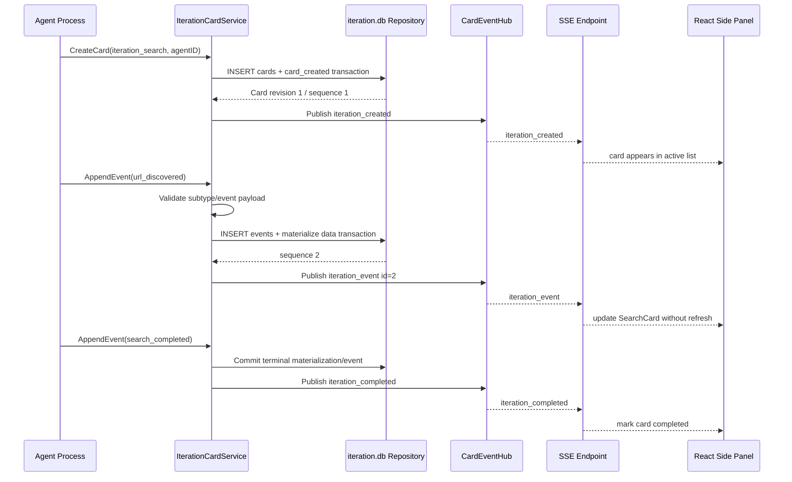
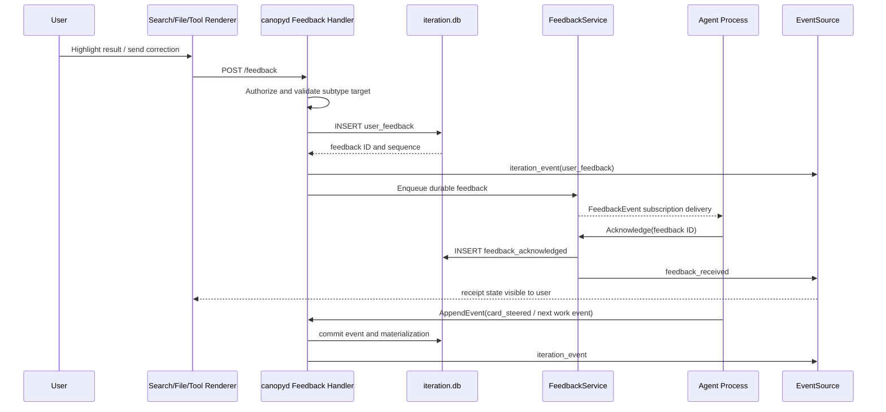

# SPEC-PL-04 — Dynamic Thinking Interface (Iteration Cards)

> **Status:** Spec | **Blocks:** BE-15 (Iteration Card Engine), BE-16 (Agent Feedback Bridge), BE-17 (Iteration SSE), FE-12 (Iteration Side Panel), FE-13 (Iteration Renderers)
> **References:** SPEC-PL-03, SPEC-PL-01, SPEC-DM-01, SPEC-API-01, SPEC-API-07, SPEC-TM-01, ARCHITECTURE.md §3, ARCHITECTURE.md §4, ARCHITECTURE.md §5

---

## 1. Purpose

Define the Dynamic Thinking Interface: five typed `iteration` card subtypes that expose a durable, user-steerable activity trace while an agent works. A Go worker can implement the iteration-card engine, persistence validation, feedback bridge, agent-process cancellation, HTTP handlers, SSE publisher, progress aggregation, crash recovery, and `canopyd` wiring from this document without choosing a protocol. A TypeScript worker can implement the side panel, typed Zod parsers, EventSource client, subtype renderers, feedback controls, terminal output viewer, progress summary, and accessible live updates without guessing wire shapes.

An iteration card is still a `CardTypeIteration` card from SPEC-PL-03 and is stored in `~/.hermes/canopy/cards/iteration.db`. Its `data.subtype` selects exactly one specialized renderer and payload schema. The card materializes the current activity state; the append-only `events` table records ordered work facts, user steering, acknowledgements, cancellation, completion, and recovery. No card stores raw private model chain-of-thought. The thinking subtype displays only an agent-authored, user-visible reasoning digest or work-plan step content, while preserving the requested step schema and interaction contract.

The interface is bidirectional. An agent appends structured events through `canopyd`; the server commits first and publishes after commit to browser EventSource clients. A user highlights a result, corrects an approach, steers focus, approves a gated tool call, or cancels execution through HTTP POST. `canopyd` durably writes the feedback, publishes it to the registered process through an in-memory subscription bridge, and the process acknowledges it before adjusting subsequent work. If a process crashes, the SQLite card and complete event history remain readable; recovery is explicit rather than silently inventing resumed state.

---

## 2. Design Decisions

| Decision | Choice | Rationale |
|----------|--------|-----------|
| Base card type | Every dynamic card has `card_type = 'iteration'` | Preserves the fixed three-type routing contract of SPEC-PL-03. |
| Subtype routing | `data.subtype` is required and is a closed `IterationSubtype` enum | The existing `cards` schema remains unchanged while renderer and validation routing are deterministic. |
| Allowed subtypes | Exactly `iteration_search`, `iteration_code_exec`, `iteration_file_read`, `iteration_thinking`, and `iteration_tool_call` | A closed set gives each work mode an auditable schema and renderer. |
| New persistent tables | None | `iteration.db` already owns `cards` and append-only `events`; subtype state belongs in `cards.data`. |
| Event-type representation | Use distinct, subtype-specific event types plus existing lifecycle events | Stored event names are searchable, replayable, and do not require every consumer to infer a payload discriminator. |
| Event CHECK scope | Extend only the `iteration.db.events.event_type` CHECK | Compact and expanded cards retain the shared base event vocabulary in SPEC-PL-03. |
| Existing event compatibility | Existing `card_*`, `agent_*`, `user_feedback`, `action_*`, context, and sync event types remain legal | Base lifecycle and synchronization behavior continues unchanged. |
| Cross-type events | `card_cancelled`, `card_steered`, and `feedback_acknowledged` are legal only for iteration cards | Cancellation, steering, and acknowledgement need explicit durable evidence across all subtypes. |
| Event schema validation | Validate subtype/event payload pairs in `IterationCardService` before insert | SQLite validates JSON syntax and bounds; domain validation enforces semantic shape. |
| Event ordering | SQLite assigned `sequence` is the canonical order | Browser reconnects and process subscriptions can replay a deterministic activity trace. |
| Agent-to-server transport | An authenticated local/internal HTTP or adapter call invokes `AppendEvent` | `canopyd` remains the persistence and authorization boundary rather than exposing SQLite to processes. |
| Server-to-browser transport | Card-specific SSE/EventSource | Matches ARCHITECTURE.md §4 and SPEC-API-01 server-push behavior. |
| Browser-to-server transport | Authenticated HTTP POST and PATCH | Matches the client-mutation contract in SPEC-PL-03. |
| Server-to-agent feedback transport | In-memory `FeedbackService` subscription with durable replay from SQLite | Live agents receive low-latency feedback; restarted agents can recover unacknowledged feedback. |
| Agent registration | Agent registers an `AgentProcess` by authenticated agent ID at card creation | Server can route cancellation and feedback without trusting a browser-provided process handle. |
| Feedback delivery | At-least-once delivery until acknowledgement | Feedback cannot disappear if an agent reconnects between persistence and delivery. |
| Feedback acknowledgement | Agent appends `feedback_acknowledged` within 30 seconds | The user gets an explicit receipt signal rather than inferring response from later work. |
| Feedback timeout | Feedback remains queued after 30 seconds and request/reporting records `ITERATION_FEEDBACK_TIMEOUT` | A slow or disconnected process does not lose user instruction. |
| Cancel escalation | `CancelCard` requests SIGTERM; after 5 seconds the process manager may send SIGKILL | Cooperative shutdown is preferred; stuck local execution has a bounded termination path. |
| Cancel completion | `exec_complete` includes `cancelled: true`; all cards also append `card_cancelled` | A typed execution result and a cross-type lifecycle event give both renderer and activity history precise state. |
| Gated tools | `gated: true` tool calls start at `pending_approval` | High-impact actions do not execute until an explicit user feedback event records approval. |
| Gated approval event | `action_requested` is persisted before the UI prompt; user approve/deny is `user_feedback` | The pending decision survives reload and remains auditable. |
| Search feedback | Result feedback uses a canonical relevance/correction/approve/reject payload | The agent can distinguish a wrong result from a focus instruction and a decision. |
| File highlights | Highlights are materialized in subtype data and feedback emits `highlight` | The current annotation set is cheap to render while user intent remains in the event log. |
| Thinking content | Show user-visible reasoning digests, not hidden private chain-of-thought | The trace is useful, inspectable work context without exposing private reasoning. |
| Code output retention | `stdout` and `stderr` are chunk arrays, capped by the base 1 MiB card-data limit; overflow is a file reference | Keeps the side panel responsive and prevents cards from becoming unbounded terminal logs. |
| File content retention | Card state stores metadata and visible range; content events are bounded chunks or a secure file reference | Files are rendered efficiently and do not bypass SPEC-PL-02 file handling for large data. |
| Progress ownership | Each active card exposes one normalized `CardProgress` record | The side-panel header can aggregate heterogeneous work without renderer-specific branching. |
| Progress hierarchy | Optional `parentCardID` and `phase` group normalized records into phases | A user can see sequential work such as search, code, then analysis. |
| Active-card cap | A profile may have at most 10 active iteration cards | Prevents a busy agent from overwhelming the side panel and resource budget. |
| Card ordering | Active side-panel cards sort by most recent committed interaction/event, descending | The work the user or agent just touched stays at the top. |
| Renderer isolation | Built-in subtype renderers are React components; plugin extensions use SPEC-PL-01 sandboxing | Core renderers remain fast and typed; untrusted extensions do not gain DOM access. |
| Compact rendering | All subtype cards expose a title, subtype label, status badge, and concise progress | Side-panel scanning is useful before opening a full detail surface. |
| Expanded rendering | Full data, chronological activity, and subtype controls are rendered only after validated parsing | Rich controls do not execute against malformed SSE payloads. |
| Node attachment | Card references remain `card_ref` metadata from SPEC-DM-01 and SPEC-PL-03 | Dynamic cards participate in graph context without duplicating their data in PostgreSQL. |
| Topic organization | Cards may carry an optional topic ID in subtype extension metadata | SPEC-TM-01 organization is supported without changing base card identity. |
| Authorization | JWT authentication and tree-membership middleware guard every route and stream | Matches ARCHITECTURE.md §5; a card cannot become a cross-tree data leak. |
| Privacy in logs | Structured logs include card ID, subtype, event type, sequence, and agent ID but not raw payloads | Operators can diagnose routing without leaking work content. |
| Crash recovery | A process crash leaves card state durable, marks the card interrupted, and permits a registered replacement to replay feedback | Users can inspect evidence and explicitly resume instead of losing the iteration. |
| Completion rule | Completed, failed, or cancelled cards reject new agent work events except allowed recovery/sync lifecycle records | Immutable terminal state prevents an old process from reviving stale work. |
| SSE replay | `Last-Event-ID` and `after` use the iteration event sequence | Reconnection behavior is identical to SPEC-API-01 and SPEC-PL-03. |
| SSE heartbeat | The server emits `heartbeat` every 30 seconds | Clients can distinguish a quiet iteration from a broken stream. |
| Error envelope | Errors use the `SPEC-API-07` canonical code/message/request ID envelope | Iteration endpoints compose with the existing API error catalog. |

---

## 3. Data Model and Event Vocabulary

### 3.1 Iteration Card Envelope

No new persistent tables are introduced. `iteration.db.cards.data` contains the subtype data object, and `iteration.db.events` records immutable activity. All subtype objects include a common envelope before subtype-specific fields:

```json
{
  "subtype": "iteration_search",
  "title": "Find primary documentation",
  "state": "running",
  "agent_id": "agent-0191a9c3",
  "session_id": "0191a9c3-0000-7000-8000-000000000010",
  "topic_id": "0191a9c3-0000-7000-8000-000000000011",
  "progress": {
    "type": "search",
    "title": "Find primary documentation",
    "current": 3,
    "total": 5,
    "status": "running"
  }
}
```

`title` is 1–160 Unicode code points. `agent_id` is 1–128 characters and must match the agent registered for the card. `session_id` is a UUIDv7 identifying the active agent session. `topic_id` is optional and, when present, is a UUIDv7 topic defined by SPEC-TM-01. `state` is `running`, `waiting_for_user`, `completed`, `failed`, `cancelled`, or `interrupted`. `progress` uses Section 8.

### 3.2 Subtype Discriminator

| `data.subtype` | Renderer | Primary activity | User controls |
|----------------|----------|------------------|---------------|
| `iteration_search` | `IterationSearchCard` | Search URLs, snippets, extraction, progress | Highlight, relevance/correction feedback, approve/reject result |
| `iteration_code_exec` | `IterationCodeExecCard` | Command/output chunks and exit state | Cancel, expand terminal output |
| `iteration_file_read` | `IterationFileReadCard` | File metadata and visible source content | Highlight ranges, note, expand/collapse range |
| `iteration_thinking` | `IterationThinkingCard` | User-visible reasoning digest steps | Expand/collapse steps |
| `iteration_tool_call` | `IterationToolCallCard` | Tool parameters, result, approval state | Approve/deny gated calls, inspect result |

The renderer must reject a base `iteration` card missing `data.subtype` or whose subtype data does not validate. It renders the generic card frame with a non-destructive schema error banner and does not send actions.

### 3.3 Search Card Data and Events

The `iteration_search` data object is:

```json
{
  "subtype": "iteration_search",
  "title": "Find official SSE reconnection guidance",
  "urls_searched": ["https://example.com/docs"],
  "current_batch": [
    {
      "url": "https://example.com/docs",
      "snippet": "The browser reconnects automatically.",
      "snippet_id": "snippet-001",
      "status": "retrieved"
    }
  ],
  "progress": {"completed": 1, "total": 5},
  "focus_urls": ["https://example.com/docs"]
}
```

`urls_searched` contains at most 100 canonical absolute HTTP(S) URLs. `current_batch` contains at most 50 entries; `status` is `queued`, `searching`, `retrieved`, `approved`, `rejected`, or `error`. `snippet` is limited to 16 KiB per entry. `focus_urls` is either `null` or a de-duplicated subset of URLs supplied by the user or agent.

| Event type | Actor | Payload | Materialized effect |
|------------|-------|---------|---------------------|
| `search_started` | agent | `{query, batch_total}` | Set state running and initialize progress. |
| `url_discovered` | agent | `{url, source?, rank?}` | Add URL to the batch or URL history. |
| `snippet_retrieved` | agent | `{url, snippet_id, snippet, extracted?}` | Add/update a retrieved snippet. |
| `search_completed` | agent | `{completed, total, summary?}` | Set completed counts and terminal state when done. |
| `search_error` | agent | `{url?, code, message}` | Mark related result error or card failed. |

Search-result feedback uses exactly this payload under `user_feedback.payload`:

```json
{
  "kind": "relevance",
  "target": {"url": "https://example.com/docs", "snippet_id": "snippet-001"},
  "note": "Focus on the official protocol section."
}
```

`kind` is `relevance`, `correction`, `approve`, or `reject`; `target.url` and `target.snippet_id` are independently optional but at least one must be present for result-specific feedback. Search freeform steering uses the common `steer` feedback contract in Section 7.

### 3.4 Code Exec Card Data and Events

The `iteration_code_exec` data object is:

```json
{
  "subtype": "iteration_code_exec",
  "title": "Run targeted Go tests",
  "command": "go test ./internal/card/... -count=1",
  "workdir": "/workspace/canopy",
  "status": "running",
  "stdout": ["=== RUN   TestCard\n"],
  "stderr": [],
  "exit_code": null,
  "start_time": "2026-07-22T12:00:00.000Z",
  "end_time": null,
  "cancelled": false
}
```

`workdir` is an absolute server-authorized path or `null`; it is never interpreted from browser input. `status` is `running`, `completed`, `cancelled`, or `failed`. Output chunks preserve arrival ordering separately for stdout and stderr and include no ANSI HTML; the renderer may parse safe ANSI styling after escaping text. `exit_code` is an integer in `[-1, 255]` or `null` while running.

| Event type | Actor | Payload | Materialized effect |
|------------|-------|---------|---------------------|
| `exec_start` | agent | `{command, workdir?, start_time}` | Set running state and start time. |
| `exec_output` | agent | `{stream: 'stdout'|'stderr', chunk, offset}` | Append a bounded output chunk. |
| `exec_complete` | agent | `{exit_code, end_time, cancelled, duration_ms}` | Set terminal state and execution result. |
| `exec_error` | agent | `{code, message, end_time?}` | Set failure information. |

Output chunks are at most 32 KiB decoded UTF-8. The service rejects a chunk that would make retained output exceed 1 MiB; the agent must store further output as a secure file reference and append an `agent_output` reference event.

### 3.5 File Read Card Data and Events

The `iteration_file_read` data object is:

```json
{
  "subtype": "iteration_file_read",
  "title": "Inspect iteration service",
  "path": "internal/iteration/service.go",
  "absolute_path": "/workspace/canopy/internal/iteration/service.go",
  "size": 18240,
  "mime_type": "text/x-go",
  "language": "go",
  "line_count": 614,
  "highlights": [
    {"start_line": 42, "end_line": 47, "label": "cancel path", "note": null, "color": "yellow"}
  ],
  "visible_lines": {"start": 1, "end": 160}
}
```

`path` is the agent-visible project-relative path. `absolute_path` is rendered only to a user authorized to see the working tree and is never accepted from a user feedback body. `size` is nonnegative bytes. `highlights` contains at most 100 non-empty inclusive ranges within `line_count`; color is `yellow`, `green`, `red`, or `blue`. `visible_lines.start` and `.end` are inclusive and must be within the known line count.

| Event type | Actor | Payload | Materialized effect |
|------------|-------|---------|---------------------|
| `file_read_opened` | agent | `{path, absolute_path, size, mime_type, language}` | Set metadata and initial range. |
| `file_read_content` | agent | `{start_line, end_line, content, line_count}` | Supply bounded source content for the visible range. |
| `file_read_error` | agent | `{code, message, path?}` | Render file access/read failure. |

A highlight feedback payload is:

```json
{
  "region": {"startLine": 42, "endLine": 47},
  "label": "cancel path",
  "note": "Check whether this can race with completion.",
  "color": "yellow"
}
```

The server normalizes camelCase region fields to the materialized snake_case highlight representation, appends `user_feedback` with kind `highlight`, increments revision, and publishes a card snapshot followed by the event.

### 3.6 Thinking Card Data and Events

The `iteration_thinking` card is an activity-trace renderer. Its content is user-visible reasoning digest text, work decomposition, evidence, or explanation supplied by the agent; it must not contain hidden private chain-of-thought.

```json
{
  "subtype": "iteration_thinking",
  "title": "Assess feedback routing",
  "steps": [
    {
      "id": "step-1",
      "title": "Inspect current event contract",
      "status": "completed",
      "content": "The base card service already persists append-only events.",
      "duration_ms": 240,
      "error": null
    }
  ],
  "current_step_id": null
}
```

A step ID is unique within the card and 1–128 URL-safe characters. `status` is `pending`, `active`, `completed`, or `failed`. `content` is `null` or at most 32 KiB of escaped user-visible text. `duration_ms` is nonnegative or `null`; `error` is `null` unless the step is failed.

| Event type | Actor | Payload | Materialized effect |
|------------|-------|---------|---------------------|
| `thought_started` | agent | `{step_id, title}` | Create or activate one step. |
| `thought_progress` | agent | `{step_id, content, progress?}` | Replace/append visible digest content. |
| `thought_complete` | agent | `{step_id, content?, duration_ms}` | Mark step completed. |
| `thought_error` | agent | `{step_id, error, duration_ms?}` | Mark step failed. |

The compact renderer shows titles and active/terminal status only. Expanded mode shows escaped step content, duration, and error text. Expanding and collapsing are client-local presentation state and do not create user feedback events.

### 3.7 Tool Call Card Data and Events

The `iteration_tool_call` data object is:

```json
{
  "subtype": "iteration_tool_call",
  "title": "Write migration file",
  "tool_name": "write_file",
  "params": {"path": "migrations/000002.sql"},
  "result": null,
  "status": "pending_approval",
  "start_time": null,
  "end_time": null,
  "duration_ms": null,
  "error": null,
  "gated": true
}
```

`params` is a JSON object no larger than 64 KiB. `result` is JSON-compatible and no larger than 256 KiB. `status` is `pending_approval`, `running`, `completed`, `denied`, or `failed`. A non-gated call starts `running`; a gated call starts `pending_approval` and must not invoke the agent tool until feedback approval is persisted and delivered.

| Event type | Actor | Payload | Materialized effect |
|------------|-------|---------|---------------------|
| `tool_call_started` | agent | `{tool_name, params, start_time, gated}` | Set pending approval or running. |
| `tool_call_result` | agent | `{result, end_time, duration_ms}` | Set completed result. |
| `tool_call_error` | agent | `{code, message, end_time?, duration_ms?}` | Set failed result. |

For gated calls the server first appends `action_requested` with `{gated: true, action: 'approve_tool_call'}`. The user submits `approve` or `reject` as `user_feedback`. Approval causes the process to execute and append `tool_call_started` or `tool_call_result`; rejection sets `denied` and appends `action_completed` with `{skipped: true}`. A denial never calls the tool.

### 3.8 Extended Iteration Event Constraint

The iteration event vocabulary is the union of all base events from SPEC-PL-03 and the exact additions below:

```text
search_started, url_discovered, snippet_retrieved, search_completed, search_error,
exec_start, exec_output, exec_complete, exec_error,
file_read_opened, file_read_content, file_read_error,
thought_started, thought_progress, thought_complete, thought_error,
tool_call_started, tool_call_result, tool_call_error,
card_cancelled, card_steered, feedback_acknowledged
```

This is deliberately not implemented as generic `agent_progress` payload dispatch. Typed event names make SQLite queries, observability, redaction rules, recovery replay, and renderer reducers unambiguous. `agent_progress` remains legal for generic checkpoints, but a subtype-specific state transition must use its subtype event name.

For new installations, the `000001_iteration_cards.up.sql` event CHECK in SPEC-PL-03 must include these values. For installations that already applied it, `000002_iteration_extended_events.up.sql` performs a transactionally safe SQLite table rebuild that preserves every existing event row, indexes, foreign key, and append-only triggers while replacing only the iteration event CHECK with the union above. It creates no new durable table and does not alter `compact.db` or `expanded.db`.

### 3.9 Event Payload Envelope

Every agent-originated iteration event is stored in `events.payload` as:

```json
{
  "subtype": "iteration_code_exec",
  "data": {"stream": "stdout", "chunk": "ok\n", "offset": 0},
  "agent_session_id": "0191a9c3-0000-7000-8000-000000000010",
  "trace_id": "0191a9c3-0000-7000-8000-000000000012"
}
```

`subtype` must equal the card's `data.subtype`; it prevents a stale agent from appending a different subtype event. `data` validates against the event table for the subtype. `agent_session_id` is required for agent writes. `trace_id` is optional correlation metadata and is not rendered by default. User feedback and cancellation payloads use Section 7.

---

## 4. Go Interfaces and Structs

### 4.1 Package Layout

The implementation package is `internal/card/iteration/`, nested under the existing `internal/card/` ownership boundary from SPEC-PL-03. This avoids a second card root while keeping iteration-specific validation, event reduction, feedback routing, agent process registry, HTTP handlers, and SSE mapping cohesive.

```text
internal/card/iteration/
├── models.go       # subtype, progress, event, feedback, and data models
├── validate.go     # subtype and event payload validation
├── service.go      # IterationCardService implementation and lifecycle rules
├── feedback.go     # durable feedback queue and subscription hub
├── process.go      # AgentProcess registry and cancellation bridge
├── reducer.go      # materialized data updates from typed events
├── handlers.go     # /api/cards/iteration and /api/iteration routes
├── sse.go          # iteration SSE mapping over CardEventHub
└── recovery.go     # crash detection, replay, and replacement-agent recovery
```

### 4.2 Canonical Go Types

```go
package iteration

import (
    "context"
    "encoding/json"
    "time"

    "github.com/google/uuid"

    "github.com/hermes/canopy/internal/card"
)

type IterationSubtype string

const (
    IterationSubtypeSearch   IterationSubtype = "iteration_search"
    IterationSubtypeCodeExec IterationSubtype = "iteration_code_exec"
    IterationSubtypeFileRead IterationSubtype = "iteration_file_read"
    IterationSubtypeThinking IterationSubtype = "iteration_thinking"
    IterationSubtypeToolCall IterationSubtype = "iteration_tool_call"
)

type FeedbackKind string

const (
    FeedbackKindRelevance  FeedbackKind = "relevance"
    FeedbackKindCorrection FeedbackKind = "correction"
    FeedbackKindSteer      FeedbackKind = "steer"
    FeedbackKindCancel     FeedbackKind = "cancel"
    FeedbackKindHighlight  FeedbackKind = "highlight"
    FeedbackKindApprove    FeedbackKind = "approve"
    FeedbackKindReject     FeedbackKind = "reject"
)

type ProgressType string

const (
    ProgressTypeSearch   ProgressType = "search"
    ProgressTypeCodeExec ProgressType = "code_exec"
    ProgressTypeFileRead ProgressType = "file_read"
    ProgressTypeThinking ProgressType = "thinking"
    ProgressTypeToolCall ProgressType = "tool_call"
)

type ProgressStatus string

const (
    ProgressStatusRunning   ProgressStatus = "running"
    ProgressStatusCompleted ProgressStatus = "completed"
    ProgressStatusFailed    ProgressStatus = "failed"
    ProgressStatusCancelled ProgressStatus = "cancelled"
)

type CardProgress struct {
    CardID       uuid.UUID      `json:"cardId"`
    ParentCardID *uuid.UUID     `json:"parentCardId,omitempty"`
    Type         ProgressType   `json:"type"`
    Title        string         `json:"title"`
    Current      int            `json:"current"`
    Total        int            `json:"total"`
    Status       ProgressStatus `json:"status"`
    Phase        string         `json:"phase,omitempty"`
    UpdatedAt    time.Time      `json:"updatedAt"`
}

type IterationState string

const (
    IterationStateRunning        IterationState = "running"
    IterationStateWaitingForUser IterationState = "waiting_for_user"
    IterationStateCompleted      IterationState = "completed"
    IterationStateFailed         IterationState = "failed"
    IterationStateCancelled      IterationState = "cancelled"
    IterationStateInterrupted    IterationState = "interrupted"
)

type IterationCardData struct {
    Subtype   IterationSubtype `json:"subtype"`
    Title     string           `json:"title"`
    State     IterationState   `json:"state"`
    AgentID   string           `json:"agentId"`
    SessionID uuid.UUID        `json:"sessionId"`
    TopicID   *uuid.UUID       `json:"topicId,omitempty"`
    Progress  CardProgress     `json:"progress"`
    Search    *SearchCardData  `json:"-"`
    CodeExec  *CodeExecData    `json:"-"`
    FileRead  *FileReadData    `json:"-"`
    Thinking  *ThinkingData    `json:"-"`
    ToolCall  *ToolCallData    `json:"-"`
}

type SearchBatchItem struct {
    URL       string `json:"url"`
    Snippet   string `json:"snippet"`
    SnippetID string `json:"snippet_id"`
    Status    string `json:"status"`
}

type SearchCardData struct {
    URLsSearched []string `json:"urls_searched"`
    CurrentBatch []SearchBatchItem `json:"current_batch"`
    Progress     struct {
        Completed int `json:"completed"`
        Total     int `json:"total"`
    } `json:"progress"`
    FocusURLs *[]string `json:"focus_urls"`
}

type CodeExecData struct {
    Command   string   `json:"command"`
    Workdir   *string  `json:"workdir"`
    Status    string   `json:"status"`
    Stdout    []string `json:"stdout"`
    Stderr    []string `json:"stderr"`
    ExitCode  *int     `json:"exit_code"`
    StartTime time.Time `json:"start_time"`
    EndTime   *time.Time `json:"end_time"`
    Cancelled bool     `json:"cancelled"`
}

type FileHighlight struct {
    StartLine int     `json:"start_line"`
    EndLine   int     `json:"end_line"`
    Label     *string `json:"label"`
    Note      *string `json:"note"`
    Color     string  `json:"color"`
}

type FileReadData struct {
    Path          string          `json:"path"`
    AbsolutePath  string          `json:"absolute_path"`
    Size          int64           `json:"size"`
    MIMEType      string          `json:"mime_type"`
    Language      string          `json:"language"`
    LineCount     int             `json:"line_count"`
    Highlights    []FileHighlight `json:"highlights"`
    VisibleLines  struct {
        Start int `json:"start"`
        End   int `json:"end"`
    } `json:"visible_lines"`
}

type ThoughtStep struct {
    ID         string  `json:"id"`
    Title      string  `json:"title"`
    Status     string  `json:"status"`
    Content    *string `json:"content"`
    DurationMS *int64  `json:"duration_ms"`
    Error      *string `json:"error"`
}

type ThinkingData struct {
    Steps         []ThoughtStep `json:"steps"`
    CurrentStepID *string       `json:"current_step_id"`
}

type ToolCallData struct {
    ToolName   string          `json:"tool_name"`
    Params     json.RawMessage `json:"params"`
    Result     json.RawMessage `json:"result"`
    Status     string          `json:"status"`
    StartTime  *time.Time      `json:"start_time"`
    EndTime    *time.Time      `json:"end_time"`
    DurationMS *int64          `json:"duration_ms"`
    Error      *string         `json:"error"`
    Gated      bool            `json:"gated"`
}
```

`IterationCardData` is a tagged union. The JSON encoding contains the common fields and only the fields for `Subtype`; `Search`, `CodeExec`, `FileRead`, `Thinking`, and `ToolCall` are in-memory typed projections used by validation and reducer code, not duplicated JSON fields.

### 4.3 Process, Feedback, and Service Interfaces

```go
package iteration

import (
    "context"
    "encoding/json"
    "time"

    "github.com/google/uuid"

    "github.com/hermes/canopy/internal/card"
)

type AgentProcessStatus string

const (
    AgentProcessStatusStarting AgentProcessStatus = "starting"
    AgentProcessStatusRunning  AgentProcessStatus = "running"
    AgentProcessStatusStopping AgentProcessStatus = "stopping"
    AgentProcessStatusStopped  AgentProcessStatus = "stopped"
    AgentProcessStatusCrashed  AgentProcessStatus = "crashed"
)

type AgentProcess interface {
    ID() string
    SubscribeFeedback(ctx context.Context, cardID uuid.UUID) (<-chan FeedbackEvent, error)
    Cancel(ctx context.Context, cardID uuid.UUID) error
    Status() AgentProcessStatus
}

type FeedbackService interface {
    Submit(ctx context.Context, cardID uuid.UUID, input FeedbackInput) error
    Subscribe(ctx context.Context, cardID uuid.UUID) (<-chan FeedbackEvent, func(), error)
    Acknowledge(ctx context.Context, feedbackID uuid.UUID) error
}

type IterationCardService interface {
    CreateCard(ctx context.Context, subtype IterationSubtype, agentID string) (*card.Card, error)
    AppendEvent(ctx context.Context, cardID uuid.UUID, event IterationEvent) error
    SubmitFeedback(ctx context.Context, cardID uuid.UUID, input FeedbackInput) error
    SubscribeEvents(ctx context.Context, cardID uuid.UUID) (<-chan IterationEvent, func(), error)
    CancelCard(ctx context.Context, cardID uuid.UUID) error
    ListActiveCards(ctx context.Context) ([]card.Card, error)
    GetProgress(ctx context.Context) ([]CardProgress, error)
}

type IterationEvent struct {
    Sequence  int64            `json:"sequence"`
    Subtype   IterationSubtype `json:"subtype"`
    EventType string           `json:"eventType"`
    Data      json.RawMessage  `json:"data"`
    CardID    uuid.UUID        `json:"cardId"`
    CreatedAt time.Time        `json:"createdAt"`
}

type FeedbackInput struct {
    CardID       uuid.UUID       `json:"cardId"`
    Subtype      IterationSubtype `json:"subtype"`
    FeedbackKind FeedbackKind    `json:"feedbackKind"`
    Target       json.RawMessage `json:"target,omitempty"`
    Note         string          `json:"note,omitempty"`
    ActorID      string          `json:"actorId"`
    SessionID    uuid.UUID       `json:"sessionId"`
    Timestamp    time.Time       `json:"timestamp"`
}

type FeedbackEvent struct {
    ID           uuid.UUID       `json:"id"`
    CardID       uuid.UUID       `json:"cardId"`
    Subtype      IterationSubtype `json:"subtype"`
    FeedbackKind FeedbackKind    `json:"feedbackKind"`
    Target       json.RawMessage `json:"target,omitempty"`
    Note         string          `json:"note,omitempty"`
    ActorID      string          `json:"actorId"`
    SessionID    uuid.UUID       `json:"sessionId"`
    CreatedAt    time.Time       `json:"createdAt"`
    Acknowledged bool            `json:"acknowledged"`
}

type CreateIterationCardInput struct {
    ID          uuid.UUID        `json:"id"`
    AppID       string           `json:"appId"`
    Subtype     IterationSubtype `json:"subtype"`
    Data        json.RawMessage  `json:"data"`
    Actions     []card.CardAction `json:"actions"`
    ContextHash string           `json:"contextHash"`
    AgentID     string           `json:"agentId"`
}

type CancelInput struct {
    Reason  string    `json:"reason,omitempty"`
    ActorID string    `json:"actorId"`
    At      time.Time `json:"at"`
}
```

### 4.4 Service Invariants

1. `CreateCard` always creates a base `CardTypeIteration` card and rejects an unknown subtype before persistence.
2. An agent can append an event only if `event.Subtype` equals the persisted `data.subtype`, the card is active, and the registered process ID matches `data.agent_id`.
3. `AppendEvent` validates the exact subtype/event payload pair, writes the base `CardEvent`, materializes changed subtype data in the same SQLite transaction, then publishes after commit.
4. `SubmitFeedback` verifies card ownership, subtype equality, active state, feedback target shape, and session ID before appending `user_feedback`.
5. `SubmitFeedback` creates a UUIDv7 feedback record in the event payload, commits it, then publishes it to `FeedbackService`; delivery failure leaves the feedback durable and queued.
6. `Acknowledge` writes `feedback_acknowledged`, marks the durable feedback acknowledged, and emits the `feedback_received` SSE event after commit.
7. `CancelCard` appends `action_requested` and user feedback kind `cancel`, asks the registered process to cancel, then records `card_cancelled` only after accepted cancellation or process termination evidence.
8. A cancellation request is idempotent: a second request for a terminal card returns its current terminal state without issuing another signal.
9. An agent crash changes a nonterminal card state to `interrupted`, appends `agent_error` with `ITERATION_AGENT_NOT_FOUND` or process crash context, and leaves its events, feedback queue, and output intact.
10. A replacement process must authenticate as the same agent ID or an authorized supervisor and explicitly replay unacknowledged feedback before it emits new work events.
11. `ListActiveCards` returns only status `active` cards with data state `running`, `waiting_for_user`, or `interrupted`, sorted by latest event then `updated_at` descending.
12. `GetProgress` reads current subtype data only; it does not replay all event history on every side-panel render.

---

## 5. TypeScript Types and Zod Validation

### 5.1 Canonical TypeScript Types

```ts
import { z } from 'zod'

export const iterationSubtypeValues = [
  'iteration_search',
  'iteration_code_exec',
  'iteration_file_read',
  'iteration_thinking',
  'iteration_tool_call',
] as const
export type IterationSubtype = (typeof iterationSubtypeValues)[number]

export const feedbackKindValues = [
  'relevance', 'correction', 'steer', 'cancel', 'highlight', 'approve', 'reject',
] as const
export type FeedbackKind = (typeof feedbackKindValues)[number]

export type IterationState =
  | 'running'
  | 'waiting_for_user'
  | 'completed'
  | 'failed'
  | 'cancelled'
  | 'interrupted'

export type ProgressType = 'search' | 'code_exec' | 'file_read' | 'thinking' | 'tool_call'
export type ProgressStatus = 'running' | 'completed' | 'failed' | 'cancelled'

export interface CardProgress {
  cardId: string
  parentCardId?: string
  type: ProgressType
  title: string
  current: number
  total: number
  status: ProgressStatus
  phase?: string
  updatedAt: string
}

export interface IterationBaseData {
  subtype: IterationSubtype
  title: string
  state: IterationState
  agentId: string
  sessionId: string
  topicId?: string
  progress: CardProgress
}

export interface SearchBatchItem {
  url: string
  snippet: string
  snippetId: string
  status: 'queued' | 'searching' | 'retrieved' | 'approved' | 'rejected' | 'error'
}

export interface IterationSearchData extends IterationBaseData {
  subtype: 'iteration_search'
  urlsSearched: string[]
  currentBatch: SearchBatchItem[]
  searchProgress: { completed: number; total: number }
  focusUrls: string[] | null
}

export interface IterationCodeExecData extends IterationBaseData {
  subtype: 'iteration_code_exec'
  command: string
  workdir: string | null
  status: 'running' | 'completed' | 'cancelled' | 'failed'
  stdout: string[]
  stderr: string[]
  exitCode: number | null
  startTime: string
  endTime: string | null
  cancelled: boolean
}

export interface FileHighlight {
  startLine: number
  endLine: number
  label: string | null
  note: string | null
  color: 'yellow' | 'green' | 'red' | 'blue'
}

export interface IterationFileReadData extends IterationBaseData {
  subtype: 'iteration_file_read'
  path: string
  absolutePath: string
  size: number
  mimeType: string
  language: string
  lineCount: number
  highlights: FileHighlight[]
  visibleLines: { start: number; end: number }
}

export interface ThoughtStep {
  id: string
  title: string
  status: 'pending' | 'active' | 'completed' | 'failed'
  content: string | null
  durationMs: number | null
  error: string | null
}

export interface IterationThinkingData extends IterationBaseData {
  subtype: 'iteration_thinking'
  steps: ThoughtStep[]
  currentStepId: string | null
}

export interface IterationToolCallData extends IterationBaseData {
  subtype: 'iteration_tool_call'
  toolName: string
  params: Record<string, unknown>
  result: unknown | null
  status: 'pending_approval' | 'running' | 'completed' | 'denied' | 'failed'
  startTime: string | null
  endTime: string | null
  durationMs: number | null
  error: string | null
  gated: boolean
}

export type IterationCardData =
  | IterationSearchData
  | IterationCodeExecData
  | IterationFileReadData
  | IterationThinkingData
  | IterationToolCallData

export interface IterationEvent {
  sequence: number
  subtype: IterationSubtype
  eventType: string
  data: Record<string, unknown>
  cardId: string
  createdAt: string
}

export interface FeedbackInput {
  cardId: string
  subtype: IterationSubtype
  feedbackType: FeedbackKind
  target?: Record<string, unknown>
  note?: string
  timestamp: string
  sessionId: string
}

export interface FeedbackEvent extends FeedbackInput {
  id: string
  actorId: string
  acknowledged: boolean
}

export type IterationRendererProps<T extends IterationCardData> = {
  cardId: string
  data: T
  events: readonly IterationEvent[]
  compact: boolean
  submitFeedback: (input: Omit<FeedbackInput, 'cardId' | 'subtype' | 'timestamp' | 'sessionId'>) => Promise<void>
  cancel: (reason?: string) => Promise<void>
}

export type IterationSearchCardProps = IterationRendererProps<IterationSearchData>
export type IterationCodeExecCardProps = IterationRendererProps<IterationCodeExecData>
export type IterationFileReadCardProps = IterationRendererProps<IterationFileReadData>
export type IterationThinkingCardProps = IterationRendererProps<IterationThinkingData>
export type IterationToolCallCardProps = IterationRendererProps<IterationToolCallData>
```

### 5.2 Zod Schemas

```ts
const uuidV7Pattern = /^[0-9a-f]{8}-[0-9a-f]{4}-7[0-9a-f]{3}-[89ab][0-9a-f]{3}-[0-9a-f]{12}$/i
const agentIdPattern = /^[A-Za-z0-9._:-]{1,128}$/
const stepIdPattern = /^[A-Za-z0-9._:-]{1,128}$/

export const IterationSubtypeSchema = z.enum(iterationSubtypeValues)
export const FeedbackKindSchema = z.enum(feedbackKindValues)
export const ProgressTypeSchema = z.enum(['search', 'code_exec', 'file_read', 'thinking', 'tool_call'])
export const ProgressStatusSchema = z.enum(['running', 'completed', 'failed', 'cancelled'])
export const IterationStateSchema = z.enum([
  'running', 'waiting_for_user', 'completed', 'failed', 'cancelled', 'interrupted',
])

export const CardProgressSchema = z.object({
  cardId: z.string().regex(uuidV7Pattern),
  parentCardId: z.string().regex(uuidV7Pattern).optional(),
  type: ProgressTypeSchema,
  title: z.string().trim().min(1).max(160),
  current: z.number().int().nonnegative(),
  total: z.number().int().nonnegative(),
  status: ProgressStatusSchema,
  phase: z.string().trim().min(1).max(160).optional(),
  updatedAt: z.string().datetime(),
}).strict().refine(value => value.total === 0 || value.current <= value.total, {
  message: 'current must not exceed total',
})

const IterationBaseDataSchema = z.object({
  subtype: IterationSubtypeSchema,
  title: z.string().trim().min(1).max(160),
  state: IterationStateSchema,
  agentId: z.string().regex(agentIdPattern),
  sessionId: z.string().regex(uuidV7Pattern),
  topicId: z.string().regex(uuidV7Pattern).optional(),
  progress: CardProgressSchema,
}).strict()

export const SearchBatchItemSchema = z.object({
  url: z.string().url().max(4096),
  snippet: z.string().max(16 * 1024),
  snippetId: z.string().min(1).max(128),
  status: z.enum(['queued', 'searching', 'retrieved', 'approved', 'rejected', 'error']),
}).strict()

export const IterationSearchDataSchema = IterationBaseDataSchema.extend({
  subtype: z.literal('iteration_search'),
  urlsSearched: z.array(z.string().url().max(4096)).max(100),
  currentBatch: z.array(SearchBatchItemSchema).max(50),
  searchProgress: z.object({
    completed: z.number().int().nonnegative(),
    total: z.number().int().nonnegative(),
  }).strict(),
  focusUrls: z.array(z.string().url().max(4096)).max(100).nullable(),
}).strict().refine(value => value.searchProgress.total === 0 || value.searchProgress.completed <= value.searchProgress.total, {
  message: 'search completed must not exceed total',
})

export const IterationCodeExecDataSchema = IterationBaseDataSchema.extend({
  subtype: z.literal('iteration_code_exec'),
  command: z.string().min(1).max(16 * 1024),
  workdir: z.string().startsWith('/').max(4096).nullable(),
  status: z.enum(['running', 'completed', 'cancelled', 'failed']),
  stdout: z.array(z.string().max(32 * 1024)),
  stderr: z.array(z.string().max(32 * 1024)),
  exitCode: z.number().int().min(-1).max(255).nullable(),
  startTime: z.string().datetime(),
  endTime: z.string().datetime().nullable(),
  cancelled: z.boolean(),
}).strict()

export const FileHighlightSchema = z.object({
  startLine: z.number().int().positive(),
  endLine: z.number().int().positive(),
  label: z.string().max(160).nullable(),
  note: z.string().max(16 * 1024).nullable(),
  color: z.enum(['yellow', 'green', 'red', 'blue']),
}).strict().refine(value => value.endLine >= value.startLine, {
  message: 'endLine must be >= startLine',
})

export const IterationFileReadDataSchema = IterationBaseDataSchema.extend({
  subtype: z.literal('iteration_file_read'),
  path: z.string().min(1).max(4096),
  absolutePath: z.string().startsWith('/').max(4096),
  size: z.number().int().nonnegative(),
  mimeType: z.string().min(1).max(255),
  language: z.string().min(1).max(64),
  lineCount: z.number().int().nonnegative(),
  highlights: z.array(FileHighlightSchema).max(100),
  visibleLines: z.object({
    start: z.number().int().positive(),
    end: z.number().int().positive(),
  }).strict(),
}).strict().superRefine((value, ctx) => {
  if (value.visibleLines.end < value.visibleLines.start || value.visibleLines.end > value.lineCount) {
    ctx.addIssue({ code: z.ZodIssueCode.custom, message: 'visible lines must be within lineCount' })
  }
  value.highlights.forEach((highlight, index) => {
    if (highlight.endLine > value.lineCount) {
      ctx.addIssue({ code: z.ZodIssueCode.custom, path: ['highlights', index], message: 'highlight exceeds lineCount' })
    }
  })
})

export const ThoughtStepSchema = z.object({
  id: z.string().regex(stepIdPattern),
  title: z.string().trim().min(1).max(160),
  status: z.enum(['pending', 'active', 'completed', 'failed']),
  content: z.string().max(32 * 1024).nullable(),
  durationMs: z.number().int().nonnegative().nullable(),
  error: z.string().max(16 * 1024).nullable(),
}).strict()

export const IterationThinkingDataSchema = IterationBaseDataSchema.extend({
  subtype: z.literal('iteration_thinking'),
  steps: z.array(ThoughtStepSchema).max(100),
  currentStepId: z.string().regex(stepIdPattern).nullable(),
}).strict().superRefine((value, ctx) => {
  const ids = new Set<string>()
  for (const [index, step] of value.steps.entries()) {
    if (ids.has(step.id)) ctx.addIssue({ code: z.ZodIssueCode.custom, path: ['steps', index, 'id'], message: 'step id must be unique' })
    ids.add(step.id)
  }
  if (value.currentStepId !== null && !ids.has(value.currentStepId)) {
    ctx.addIssue({ code: z.ZodIssueCode.custom, path: ['currentStepId'], message: 'current step must exist' })
  }
})

export const IterationToolCallDataSchema = IterationBaseDataSchema.extend({
  subtype: z.literal('iteration_tool_call'),
  toolName: z.string().trim().min(1).max(128),
  params: z.record(z.string(), z.unknown()),
  result: z.unknown().nullable(),
  status: z.enum(['pending_approval', 'running', 'completed', 'denied', 'failed']),
  startTime: z.string().datetime().nullable(),
  endTime: z.string().datetime().nullable(),
  durationMs: z.number().int().nonnegative().nullable(),
  error: z.string().max(16 * 1024).nullable(),
  gated: z.boolean(),
}).strict().refine(value => !value.gated || value.status !== 'running' || value.startTime !== null, {
  message: 'running gated calls require approved start time',
})

export const IterationCardDataSchema = z.discriminatedUnion('subtype', [
  IterationSearchDataSchema,
  IterationCodeExecDataSchema,
  IterationFileReadDataSchema,
  IterationThinkingDataSchema,
  IterationToolCallDataSchema,
])

export const IterationEventSchema = z.object({
  sequence: z.number().int().positive(),
  subtype: IterationSubtypeSchema,
  eventType: z.string().min(1).max(64),
  data: z.record(z.string(), z.unknown()),
  cardId: z.string().regex(uuidV7Pattern),
  createdAt: z.string().datetime(),
}).strict()

export const FeedbackInputSchema = z.object({
  cardId: z.string().regex(uuidV7Pattern),
  subtype: IterationSubtypeSchema,
  feedbackType: FeedbackKindSchema,
  target: z.record(z.string(), z.unknown()).optional(),
  note: z.string().max(16 * 1024).optional(),
  timestamp: z.string().datetime(),
  sessionId: z.string().regex(uuidV7Pattern),
}).strict()

export const FeedbackEventSchema = FeedbackInputSchema.extend({
  id: z.string().regex(uuidV7Pattern),
  actorId: z.string().regex(agentIdPattern),
  acknowledged: z.boolean(),
}).strict()
```

### 5.3 Renderer Registry and Store Rules

```ts
export type IterationRenderer = (props: IterationRendererProps<IterationCardData>) => JSX.Element

export const iterationRenderers: Record<IterationSubtype, IterationRenderer> = {
  iteration_search: IterationSearchCard,
  iteration_code_exec: IterationCodeExecCard,
  iteration_file_read: IterationFileReadCard,
  iteration_thinking: IterationThinkingCard,
  iteration_tool_call: IterationToolCallCard,
}
```

The store applies an SSE `iteration_event` only if its `sequence` is exactly one higher than the stored sequence for that card. A sequence gap triggers `GET /api/cards/iteration/{id}/events?after={lastSequence}`; it never guesses materialized state. A newer card snapshot replaces prior data only when the base card revision rises. A failed Zod parse keeps the prior valid card visible, adds a local error banner, and requests a fresh GET snapshot. Component-local expansion state is keyed by `{cardId, stepId}` and is not persisted as card data.

---

## 6. HTTP API

All routes require Hermes JWT authentication and tree/profile membership middleware before iteration authorization. Bodies use camelCase. Base Card creation and patch fields follow SPEC-PL-03; the subtype contracts below add iteration validation. All errors use the envelope described in Section 10.

| Method | Path | Purpose | Success |
|--------|------|---------|---------|
| POST | `/api/cards/iteration` | Create a new iteration card by authorized agent | 201 `Card` |
| GET | `/api/cards/iteration/{id}` | Get current card state | 200 `Card` |
| GET | `/api/cards/iteration/{id}/events?after={seq}` | Stream/replay iteration events as SSE | 200 `text/event-stream` |
| POST | `/api/cards/iteration/{id}/feedback` | Persist and deliver user feedback | 202 `FeedbackEvent` |
| POST | `/api/cards/iteration/{id}/cancel` | Request user-initiated cancellation | 202 `{cardId, status}` |
| PATCH | `/api/cards/iteration/{id}` | Update permitted materialized iteration state | 200 `Card` |
| GET | `/api/cards/iteration/active` | List active cards for current user | 200 `{cards: Card[]}` |
| GET | `/api/iteration/progress` | Return aggregate active progress | 200 `{progress: CardProgress[], summary}` |

### 6.1 Create Card

```http
POST /api/cards/iteration
Content-Type: application/json

{
  "id": "0191a9c3-0000-7000-8000-000000000000",
  "appId": "canopy.agent",
  "subtype": "iteration_search",
  "data": {
    "subtype": "iteration_search",
    "title": "Find documentation",
    "state": "running",
    "agentId": "agent-0191a9c3",
    "sessionId": "0191a9c3-0000-7000-8000-000000000010",
    "progress": {"cardId": "0191a9c3-0000-7000-8000-000000000000", "type": "search", "title": "Find documentation", "current": 0, "total": 5, "status": "running", "updatedAt": "2026-07-22T12:00:00.000Z"},
    "urlsSearched": [],
    "currentBatch": [],
    "searchProgress": {"completed": 0, "total": 5},
    "focusUrls": null
  },
  "actions": [],
  "contextHash": "c4a2f1d6c7b8e9f00112233445566778899aabbccddeeff0011223344556677",
  "agentId": "agent-0191a9c3"
}
```

The authenticated process may create only for its registered `agentId`; `data.agentId`, top-level `agentId`, and process ID must match. The service appends `card_created`, emits `iteration_created`, and rejects the request with `ITERATION_MAX_CARDS` before writing if the profile already has ten active cards.

### 6.2 Get and Patch

`GET /api/cards/iteration/{id}` returns the base `Card` from SPEC-PL-03 with `data` parsed by `IterationCardDataSchema`. `PATCH /api/cards/iteration/{id}` requires `If-Match: {revision}`. User clients may patch only presentation-safe materialized state delegated by subtype operations (such as file highlights); agents may patch title, state, progress, and subtype data only while their process is registered and the card is nonterminal. Direct browser patches cannot change `agentId`, `sessionId`, `subtype`, command, absolute path, tool parameters, or execution result.

```http
PATCH /api/cards/iteration/0191a9c3-0000-7000-8000-000000000000
If-Match: 4
Content-Type: application/json

{
  "data": {
    "subtype": "iteration_thinking",
    "title": "Assess feedback routing",
    "state": "waiting_for_user",
    "agentId": "agent-0191a9c3",
    "sessionId": "0191a9c3-0000-7000-8000-000000000010",
    "progress": {"cardId": "0191a9c3-0000-7000-8000-000000000000", "type": "thinking", "title": "Assess feedback routing", "current": 2, "total": 3, "status": "running", "updatedAt": "2026-07-22T12:01:00.000Z"},
    "steps": [],
    "currentStepId": null
  }
}
```

### 6.3 Submit Feedback

```http
POST /api/cards/iteration/0191a9c3-0000-7000-8000-000000000000/feedback
Content-Type: application/json

{
  "cardId": "0191a9c3-0000-7000-8000-000000000000",
  "subtype": "iteration_search",
  "feedbackType": "relevance",
  "target": {"url": "https://example.com/docs", "snippetId": "snippet-001"},
  "note": "This is the authoritative source.",
  "timestamp": "2026-07-22T12:02:00.000Z",
  "sessionId": "0191a9c3-0000-7000-8000-000000000010"
}
```

The server derives `actorId` from JWT identity; it ignores an actor ID supplied by the browser. The response is `202` after SQLite commit, not after process acknowledgement. The service appends `user_feedback`, applies allowed materialized effects, emits `iteration_event`, and delivers a `FeedbackEvent` to the agent subscription. If no acknowledgement is observed in 30 seconds, the feedback remains queued, the API/monitor records `ITERATION_FEEDBACK_TIMEOUT`, and later agent interaction receives it before newer feedback.

### 6.4 Cancel Iteration

```http
POST /api/cards/iteration/0191a9c3-0000-7000-8000-000000000000/cancel
Content-Type: application/json

{"reason": "The command is using the wrong environment."}
```

The server appends `action_requested` with action `cancel`, appends `user_feedback` with `feedbackKind: "cancel"`, invokes `AgentProcess.Cancel`, and returns 202 only when cancellation was accepted by the process manager. For code execution, `Cancel` sends SIGTERM and records an `agent_progress` message `cancelled`; the execution handler must subsequently append `exec_complete` with `cancelled: true`. If the process remains alive for five seconds, the process manager may escalate to SIGKILL, then append `card_cancelled` with escalation evidence. A terminal card returns 409 `ITERATION_ALREADY_COMPLETED`; a missing/crashed process returns 404 `ITERATION_AGENT_NOT_FOUND` unless the durable cancellation state was already committed.

### 6.5 Active Cards and Progress

`GET /api/cards/iteration/active` returns only cards accessible to the current user, sorted by latest committed interaction descending. `GET /api/iteration/progress` returns:

```json
{
  "progress": [
    {
      "cardId": "0191a9c3-0000-7000-8000-000000000000",
      "type": "search",
      "title": "Find documentation",
      "current": 3,
      "total": 5,
      "status": "running",
      "phase": "Phase 1",
      "updatedAt": "2026-07-22T12:03:00.000Z"
    }
  ],
  "summary": {
    "active": 1,
    "running": 1,
    "waitingForUser": 0,
    "completed": 0,
    "failed": 0,
    "cancelled": 0
  }
}
```

---

## 7. Feedback Loop Contract

### 7.1 Feedback Types

| Feedback type | Allowed subtypes | Required target | Meaning |
|---------------|------------------|-----------------|---------|
| `relevance` | search | URL and/or snippet ID | Mark a result as useful, irrelevant, or needing changed weight. |
| `correction` | search, file read, thinking, tool call | Optional typed target | Tell the agent a stated fact, selected source, or proposed action is wrong. |
| `steer` | all | Optional card-specific target | Redirect work toward a topic, URL, file, or stated goal. |
| `cancel` | all | None | Stop the bounded iteration or active execution. |
| `highlight` | file read, search | Region or result target | Mark a source range/result for agent attention. |
| `approve` | tool call, search | Gated action/result target | Permit a gated tool execution or approve a result. |
| `reject` | tool call, search | Gated action/result target | Deny tool execution or reject a result. |

The canonical browser payload is `{card_id, subtype, feedback_type, target, note, timestamp, session_id}` at the conceptual protocol boundary. REST uses camelCase fields from `FeedbackInputSchema`. `target` is untrusted JSON and is validated against the target schema for the subtype and feedback kind.

### 7.2 Feedback Delivery and Acknowledgement

1. The user submits feedback with HTTP POST.
2. `IterationCardService.SubmitFeedback` authorizes the user, writes `user_feedback` to `iteration.db`, and creates a feedback ID in its payload.
3. The committed event is published to browser SSE immediately so all user surfaces converge.
4. `FeedbackService` enqueues the corresponding `FeedbackEvent` by card ID and pushes it to every current subscription for the registered agent process.
5. The agent processes the feedback before its next mutable work action and calls `Acknowledge(feedbackID)`.
6. `Acknowledge` persists `feedback_acknowledged`, marks the queue record acknowledged, and emits `feedback_received` to the browser.
7. If no acknowledgement arrives in 30 seconds, the feedback remains unacknowledged and is replayed first on a new subscription. The server exposes `ITERATION_FEEDBACK_TIMEOUT` to the caller/monitor but does not delete the instruction.

A process is registered for feedback through `AgentProcess.SubscribeFeedback(ctx, cardID)`. The service-level subscription is the authoritative delivery mechanism; polling is a recovery fallback only. On process startup or replacement, `FeedbackService.Subscribe` replays all durable unacknowledged feedback in creation/sequence order before live events. This gives low-latency live operation without losing feedback during an in-memory hub restart.

### 7.3 Feedback and Crash Recovery

If an agent process exits unexpectedly, the process registry reports its status to `IterationCardService`. The service atomically appends `agent_error`, materializes state `interrupted`, and emits a card snapshot plus `iteration_event`. The user can inspect all prior URLs, output, file highlights, reasoning digests, tool state, and queued feedback. A compatible agent process may register as a replacement, subscribe, acknowledge/replay pending feedback, append `agent_progress` with `{message: "resumed", recovered_from: agentID}`, and explicitly patch state to `running`. No process may silently append a new action after a crash without this recovery event sequence.

---

## 8. Side Panel UI and Progress Contract

### 8.1 Side Panel Behavior

The side panel opens from the application chrome and calls `GET /api/cards/iteration/active`, then opens one EventSource per visible card through `/api/cards/iteration/{id}/events`. It renders an accessible list of active cards; each list item has a subtype icon, title, state/status badge, compact progress, last interaction timestamp, expand/collapse button, and dismiss control inherited from SPEC-PL-03. The list is sorted by most recent committed agent event, user feedback, or action interaction first.

A compact card renders only a title, subtype label, status badge, concise progress, and required immediate control: search result count, code running/cancel badge, file name/range, thinking active step, or tool approval state. An expanded card renders its full typed data and chronological activity with controls. Cards update from SSE without refresh. A dismissed card disappears from the active list after its durable `card_dismissed` event, but remains available through base card history/recovery surfaces.

Each renderer must use an ARIA live region with polite announcements for committed progress/status updates. It must not announce every output byte/chunk; code output emits summarized progress announcements no more often than once per two seconds. All controls are semantic buttons, keyboard reachable, and have labels that include the card title when ambiguity would otherwise exist.

### 8.2 Renderer Contract

| Subtype | Compact view | Expanded view | Controls |
|---------|--------------|---------------|----------|
| Search | Title, `completed/total`, current URL | URLs, snippets, extraction, result state, focus markers | Highlight/focus, relevance, correction, approve/reject |
| Code exec | Command summary, running/terminal badge, elapsed time | Scrollable terminal with separate stdout/stderr, full command/workdir, exit code | Cancel while running, output expand/collapse |
| File read | File name, language, visible range | Metadata, line-numbered highlighted source, annotation list | Select range, add label/note/color, range expand/collapse |
| Thinking | Active step title and `current/total` | Collapsible user-visible reasoning digest steps, durations/errors | Step expand/collapse only |
| Tool call | Tool name and pending/running/result badge | Formatted escaped JSON params/result, duration/error | Approve/deny only when `gated && pending_approval` |

Search, file, and tool components must never render server strings as HTML. Code output and thinking content are rendered as text. JSON is rendered using a safe formatter with a depth and byte cap. Plugin-provided optional renderers must be hosted through the sandbox contract of SPEC-PL-01 and receive only validated data and explicit capability-scoped callbacks.

### 8.3 Progress Model

Every active card reports this normalized shape:

```ts
{
  type: 'search' | 'code_exec' | 'file_read' | 'thinking' | 'tool_call',
  title: string,
  current: number,
  total: number,
  status: 'running' | 'completed' | 'failed' | 'cancelled'
}
```

The canonical wire/API model additionally includes `cardId`, optional `parentCardId`, optional `phase`, and `updatedAt` as shown in `CardProgress`. `current` and `total` are cardinal progress where known. Code execution has `current: 0, total: 0` while duration is its visible progress; a completed execution becomes `current: 1, total: 1`. A file read uses visible ranges or chunk count. A tool call uses `0/1` while waiting/running and `1/1` at any terminal state.

The header aggregates active records with this exact algorithm:

1. Group records by nonempty `phase`; records without phase form `Ungrouped`.
2. Sort groups by the earliest `updatedAt` ascending only when a parent/phase order is absent; otherwise use the declared phase ordinal supplied by the agent.
3. Within a group, sum `current` and `total` only where `total > 0`.
4. Show a status segment for indeterminate records rather than inventing a percentage.
5. Render up to three most relevant segments: waiting-for-user/pending approval first, then running, then failed/cancelled; overflow is accessible in the panel list.

Example header: `Thinking: step 3/5 | Search: 4 URLs | Tool: approve file_write`. A tree-structured sequence may render: `Phase 1: search (3/5) → Phase 2: code (1/1) → Phase 3: thinking (2/4)`. Terminal cards remain in history but are excluded from active aggregate totals once dismissed or archived.

---

## 9. Event Flow Architecture

### 9.1 Agent Event Flow



The process sends structured JSON-LD-compatible event payloads: a stable `@type`/event type may be retained for external provenance, but the canonical storage key is the exact event type and validated `data` envelope in Section 3.9. `canopyd` mediates all writes through `IterationCardService`; the only in-memory component is a post-commit fan-out hub. SQLite, not the hub, remains the replay source of truth.

### 9.2 User Feedback to Agent Flow



### 9.3 Cancellation Flow

```mermaid
sequenceDiagram
    participant U as User
    participant C as Code Exec Renderer
    participant API as canopyd Cancel Handler
    participant DB as iteration.db
    participant P as Agent Process Manager
    participant A as Executing Agent
    participant SSE as EventSource

    U->>C: Click Cancel
    C->>API: POST /cancel {reason}
    API->>DB: INSERT action_requested + user_feedback(cancel)
    API->>SSE: iteration_event
    API->>P: Cancel(cardID) / SIGTERM
    P->>A: SIGTERM
    A->>API: AppendEvent(agent_progress: cancelled)
    API->>DB: Commit progress event
    A->>API: AppendEvent(exec_complete cancelled=true)
    API->>DB: Commit execution result
    API->>DB: INSERT card_cancelled
    API->>SSE: iteration_cancelled
    SSE-->>C: Disable Cancel; display cancelled terminal state
    alt process does not exit in 5 seconds
        P->>A: SIGKILL
        P->>API: termination evidence
        API->>DB: INSERT card_cancelled escalated=true
    end
```

### 9.4 Reconnect and Failure Behavior

The SSE handler selects the greater of query `after` and `Last-Event-ID`, validates a nonnegative integer, replays committed events in ascending sequence, subscribes to `CardEventHub`, and emits a 30-second heartbeat. A browser receiving a sequence gap requests replay; an SSE publish failure never rolls back committed state.

An agent process crash does not delete its card. The process registry marks it crashed, the card service writes an `agent_error` and state `interrupted`, and SSE updates all open panels. The user may dismiss the card, retain it as an audit artifact, or start an authorized recovery process. The recovery process calls `SubscribeFeedback`, receives all unacknowledged feedback, acknowledges each relevant item, and explicitly emits a resumed progress event before it can append subtype work events.

---

## 10. SSE Events

The iteration endpoint emits the following server-to-client event names. The SSE `id` is the committed `events.sequence` for persistent activity messages. `iteration_created`, `iteration_completed`, and `iteration_cancelled` also include the corresponding committed sequence even when their payload table below focuses on user-facing fields.

| Event name | Payload | Trigger |
|------------|---------|---------|
| `iteration_created` | `{card_id, subtype, title, sequence}` | Agent opens and commits an iteration card. |
| `iteration_event` | `{card_id, subtype, event_type, data, sequence, created_at}` | Any committed iteration card event. |
| `iteration_completed` | `{card_id, subtype, result, sequence}` | Agent reaches completed or failed terminal iteration result. |
| `iteration_cancelled` | `{card_id, subtype, reason?, sequence}` | User cancellation, agent abort, or forced termination. |
| `iteration_progress` | `{card_id, subtype, current, total, status, sequence}` | Materialized normalized progress changes. |
| `feedback_received` | `{card_id, feedback, sequence}` | Registered agent acknowledges persisted feedback. |
| `card_snapshot` | Base `Card` with validated iteration data | A materialized card revision changes. |
| `heartbeat` | `{lastSequence, timestamp}` | No stored event; emitted every 30 seconds. |

Example event frame:

```text
id: 42
event: iteration_event
data: {"card_id":"0191a9c3-0000-7000-8000-000000000000","subtype":"iteration_code_exec","event_type":"exec_output","data":{"stream":"stdout","chunk":"ok\n","offset":0},"sequence":42,"created_at":"2026-07-22T12:00:00.000Z"}
retry: 3000
```

All JSON values use camelCase at the TypeScript API boundary. The illustrative table retains snake_case where existing SSE conventions in SPEC-PL-03 use it; implementation must choose camelCase consistently for the new iteration payload objects and preserve the event names exactly.

---

## 11. Error Catalog

All errors follow the envelope and code naming conventions in SPEC-API-07. Existing `CARD_*` errors from SPEC-PL-03 remain applicable for malformed IDs, authorization, revisions, storage failures, and base lifecycle violations.

| Code | HTTP | Message | When |
|------|------|---------|------|
| `ITERATION_SUBTYPE_INVALID` | 400 | Iteration card subtype is invalid | `data.subtype`, route input, or subtype/event pairing is unknown. |
| `ITERATION_DATA_INVALID` | 400 | Iteration card data does not match its subtype schema | Required fields, bounds, tagged union, or state invariants fail. |
| `ITERATION_EVENT_INVALID` | 400 | Iteration event does not match the card subtype contract | Event type is illegal for subtype or payload fails validation. |
| `ITERATION_FEEDBACK_INVALID` | 400 | Feedback does not match the card subtype contract | Feedback kind/target/note/session relationship is invalid. |
| `ITERATION_AGENT_NOT_FOUND` | 404 | Agent process not found for card | Card references a dead, absent, or unregistered process. |
| `ITERATION_CANCEL_FAILED` | 409 | Failed to cancel agent process | Process manager rejects termination or cannot establish cancellation state. |
| `ITERATION_ALREADY_COMPLETED` | 409 | Card is already completed | Attempt to add non-recovery events or cancel a terminal card. |
| `ITERATION_FEEDBACK_TIMEOUT` | 408 | Agent did not acknowledge feedback | No feedback acknowledgement arrives within 30 seconds; feedback remains queued. |
| `ITERATION_MAX_CARDS` | 429 | Maximum active iteration cards (10) | Create would exceed the per-profile active-card limit. |
| `ITERATION_PROCESS_FORBIDDEN` | 403 | Agent process is not authorized for card | Agent ID/session does not own the active card. |
| `ITERATION_SUBTYPE_MISMATCH` | 409 | Event or feedback subtype does not match card | A stale or malformed producer names a different subtype. |
| `ITERATION_TERMINAL_STATE` | 409 | Iteration card is in a terminal state | Agent tries to mutate a completed, failed, or cancelled card. |
| `ITERATION_GATED_APPROVAL_REQUIRED` | 409 | Tool call requires user approval | Gated tool attempts execution while pending approval. |
| `ITERATION_FEEDBACK_ALREADY_ACKNOWLEDGED` | 409 | Feedback has already been acknowledged | Agent repeats acknowledgement for an already-acknowledged feedback ID. |
| `ITERATION_PROGRESS_INVALID` | 400 | Iteration progress is invalid | Current/total/status violates normalized progress invariants. |
| `ITERATION_OUTPUT_LIMIT` | 413 | Iteration output exceeds retained card limit | Retained code/output or content chunk exceeds permitted bounds. |
| `ITERATION_SSE_CURSOR_INVALID` | 400 | Iteration event cursor is invalid | `after` or `Last-Event-ID` is not a nonnegative integer. |
| `ITERATION_SSE_BACKLOG_LIMIT` | 413 | Iteration event replay exceeds limit | Replay exceeds 10,000 events; client must fetch current state then resubscribe. |
| `ITERATION_RECOVERY_REQUIRED` | 409 | Interrupted card requires explicit recovery | Replacement agent emits work before feedback replay/resume event. |

Example response:

```json
{
  "error": "ITERATION_FEEDBACK_TIMEOUT",
  "message": "Agent did not acknowledge feedback",
  "request_id": "0191a9c3-0000-7000-8000-000000000099"
}
```

---

## 12. Test Scenarios

### 12.1 Backend Tests

1. Create one valid card for each of the exactly five iteration subtypes and verify `card_type = iteration` plus a valid `data.subtype`.
2. Reject a sixth/unknown subtype before SQLite writes and return `ITERATION_SUBTYPE_INVALID`.
3. Verify the iteration-only event CHECK accepts every base event and every extended event in Section 3.8.
4. Verify compact and expanded databases reject iteration-only event names.
5. Verify a search agent sequence `search_started → url_discovered → snippet_retrieved → search_completed` materializes URL, snippet, progress, and completed state correctly.
6. Verify search feedback with a URL/snippet target appends `user_feedback`, updates permitted result state, publishes the event, and delivers the same feedback ID to the subscribed process.
7. Verify malformed search relevance target, invalid URL, oversized snippet, and completed greater than total return `ITERATION_FEEDBACK_INVALID` or `ITERATION_DATA_INVALID` with no partial write.
8. Verify code execution output chunks preserve stream ordering, reject a chunk over 32 KiB, and reject retained output beyond the 1 MiB limit with `ITERATION_OUTPUT_LIMIT`.
9. Verify cancel flow writes `action_requested` and cancel feedback before `AgentProcess.Cancel`, sends SIGTERM, receives progress, persists `exec_complete(cancelled=true)`, and emits `iteration_cancelled`.
10. Verify an execution that remains alive after five seconds records escalation evidence after SIGKILL and never reports a successful exit code.
11. Verify file-read highlights enforce inclusive range bounds, valid colors, maximum count, and update card revision plus snapshot atomically with the feedback event.
12. Verify thinking events create, progress, complete, and fail only the identified step; duplicate IDs and unknown current step IDs are rejected.
13. Verify thinking content does not accept fields designated as private raw chain-of-thought and renders only validated user-visible digest text.
14. Verify gated tool call starts at `pending_approval`, refuses execution before approval, executes only after persisted `approve`, and persists denied state without invoking the tool after `reject`.
15. Verify `FeedbackService.Subscribe` replays unacknowledged feedback in sequence order before live feedback and `Acknowledge` is durable/idempotent according to the specified error policy.
16. Verify no acknowledgement for 30 seconds retains feedback for replay and records `ITERATION_FEEDBACK_TIMEOUT` without deleting the event.
17. Verify ten active cards can be created and the eleventh returns 429 `ITERATION_MAX_CARDS` without a `cards` or `events` row.
18. Verify progress aggregation handles mixed determinate and indeterminate subtypes, phase grouping, terminal status, and latest update ordering.
19. Verify two concurrently active cards for one agent route feedback only to the matching card ID and neither subscription receives another card's feedback.
20. Verify agent crash changes a running card to `interrupted`, preserves all prior events/output, emits `agent_error`, and prevents new work events from the dead process.
21. Verify an authorized replacement agent must replay/acknowledge queued feedback and emit a resumed progress event before new subtype events; otherwise return `ITERATION_RECOVERY_REQUIRED`.
22. Verify event serialization round-trips every subtype schema, including JSON tool parameters/results, and rejects an event whose subtype differs from persisted card data.
23. Verify SSE replay honors the greater of `after` and `Last-Event-ID`, is ascending/unique by sequence, emits heartbeats, and rejects a replay over 10,000 events.
24. Verify publish failure after commit is recoverable by SSE replay and does not roll back card data or event sequence.

### 12.2 Frontend Tests

25. Render a search card receiving streamed `url_discovered` and `snippet_retrieved` events; verify URL/snippet/progress update without a refresh.
26. Submit search relevance, correction, approve, and reject controls; verify the client sends valid feedback payloads and disables duplicate submission while pending.
27. Render code execution stdout/stderr streams in a scrollable terminal, preserve text escaping, show elapsed time, and display exit code after `exec_complete`.
28. Click cancel on a running code card; verify a single POST is issued, the control enters pending state, and it is disabled after `iteration_cancelled`.
29. Render a file-read card with line numbers and mixed highlight colors; select a range, add a note, and verify valid `highlight` feedback serialization.
30. Verify file-read range expansion/collapse changes only local view state and does not submit feedback until the user adds or edits a highlight.
31. Render a thinking card compactly with titles only; expand/collapse individual steps and verify user-visible content, duration, and failure error are shown without unsafe HTML.
32. Render a gated tool card; verify approve/deny controls appear only in `pending_approval`, approval/denial payloads are correct, and controls disappear after terminal state.
33. Verify the side panel initial active-card list and incoming events reorder cards by most recent interaction descending without losing keyboard focus.
34. Verify the header aggregates search, code, thinking, and tool progress into `Thinking: step 3/5 | Search: 4 URLs | Tool: approve file_write`-style accessible status text.
35. Verify malformed SSE data fails Zod validation, retains the prior card UI, displays a non-destructive error banner, and issues one snapshot/replay request.
36. Verify a sequence gap triggers replay from the prior sequence and applies replayed events exactly once.
37. Verify ARIA live regions announce terminal/progress changes with output chunk throttling and all approve, deny, cancel, dismiss, and expand controls are keyboard operable.
38. Verify a process-crash `interrupted` snapshot retains visible prior activity, displays recovery/interruption state, and does not present stale active controls.

---

## 13. Wiring and Operational Integration

### 13.1 `canopyd` Startup

`canopyd serve` wires iteration cards after the base CardService from SPEC-PL-03 is initialized:

1. Open/migrate `iteration.db`, including the iteration event-vocabulary migration.
2. Construct the base iteration `CardRepository` through `CardDBManager`.
3. Construct `CardEventHub` if not already shared by the base card service.
4. Construct a process registry keyed by authorized agent ID and agent session ID.
5. Construct a durable `FeedbackService` over the iteration repository plus an in-memory post-commit subscription hub.
6. Construct `IterationCardService` using the base repository, card service, event hub, feedback service, process registry, clock, and structured logger.
7. Register reducer/validator handlers for all five subtypes and their exact event sets.
8. Mount iteration routes after JWT/profile/tree middleware and before SPA fallback.
9. Start crash-status monitoring for registered agent processes and the feedback acknowledgement timeout worker.
10. Register the active-card/progress reader with the side-panel bootstrap API.

```go
iterationRepo, err := cardManager.Repository(ctx, card.CardTypeIteration)
if err != nil {
    return err
}

processRegistry := iteration.NewProcessRegistry(logger)
feedbackService := iteration.NewFeedbackService(iterationRepo, cardHub, clock, logger)
iterationService := iteration.NewService(
    iterationRepo,
    cardHub,
    feedbackService,
    processRegistry,
    clock,
    logger,
)

iteration.RegisterRoutes(router, iterationService, profileAuth)
err = group.Go(func() error { return feedbackService.RunTimeoutMonitor(ctx) })
if err != nil {
    return err
}
```

### 13.2 Outward Connections

The implementation is wired only when all of these connections exist:

| Source | Connection | Destination |
|--------|------------|-------------|
| Agent adapter/process | Authenticated create/append endpoint or service adapter | `IterationCardService` |
| `IterationCardService` | Base repository transaction | `iteration.db` cards/events |
| Committed event | Post-commit publication | Shared `CardEventHub` and iteration SSE mapper |
| Browser EventSource | `/api/cards/iteration/{id}/events` | React iteration store and side panel |
| Browser feedback/control | POST feedback/cancel | HTTP handler then `IterationCardService` |
| Durable feedback | `FeedbackService.Subscribe` | Registered `AgentProcess` |
| Agent acknowledgement | `FeedbackService.Acknowledge` | iteration event history and `feedback_received` SSE |
| Process crash monitor | Process status transition | interrupted materialization, error event, SSE snapshot |
| Graph node metadata | `card_ref` from SPEC-DM-01 | Base card resolver/context compiler |
| Topic organizer | optional topic ID | SPEC-TM-01 topic surfaces |
| Plugin render extension | validated renderer bridge | SPEC-PL-01 sandbox host |

### 13.3 Security and Retention

Route authorization uses JWTs from Hermes and membership middleware as required by ARCHITECTURE.md §5. An agent process token is scoped to its registered agent/session and card IDs; it cannot append events to another agent's card. User feedback is scoped to the user/profile/tree that can read the card. The server logs metadata but excludes raw snippets, source content, terminal output, tool parameters/results, and reasoning-digest text from structured logs.

Iteration cards use the base lifecycle `active → dismissed → archived` from SPEC-PL-03. Their subtype state adds `running`, waiting, terminal, and interrupted work states inside `data`; it does not replace base card status. Dismissal is a user visibility choice and must first cancel or detach a still-running process according to product policy; archival rejects further agent work events. Synchronization follows the base card event/snapshot contract, with iteration subtype validation applied before accepting remote deltas.

---

## 14. Edge Cases

1. A browser retries feedback after a network timeout: the client reuses a feedback UUID in the stored event envelope so the server deduplicates it rather than sending duplicate steering.
2. A process writes `exec_output` after an accepted cancellation: the service accepts only output already causally sequenced before `exec_complete`; later output is rejected as terminal-state mutation.
3. A user presses cancel twice in two tabs: only one process cancellation is issued; both tabs converge on the same `card_cancelled` event.
4. A user approves a gated tool call at the same time another tab denies it: first committed feedback wins; the second returns a terminal/pending-state conflict and the tool follows the committed decision only.
5. A search result includes an untrusted URL with a control character: schema validation rejects it before it reaches a clickable renderer.
6. A search card has no determinate total: it reports `current: 0, total: 0`; header uses its running label, not a false percentage.
7. A file line count is zero: visible ranges and highlights are empty; any nonempty range is rejected.
8. A file exceeds card data limits: `file_read_content` carries a secure file reference rather than copying the entire file into an event.
9. A code command includes secrets in text: authorization/audit log excludes command/output payload; renderer follows user-visible permissions and normal redaction policy.
10. A thinking step has failed but later work continues: the step remains failed, another step may become active, and the card can remain running.
11. A thinking card contains text labelled raw chain-of-thought by an untrusted producer: the agent adapter/validator rejects prohibited private-reasoning fields and records a safe error summary.
12. A tool result is binary or exceeds 256 KiB: store a secure artifact reference and append a bounded summary result.
13. An SSE connection reconnects with an event ID from another card: the endpoint treats it only as a numeric cursor for the requested card and replays that card's rows after it.
14. Event hub restart loses in-memory subscribers: browsers and agents reconnect; SQLite replay provides the durable source.
15. A feedback timeout occurs while the process is healthy but slow: UI shows queued/unacknowledged, not failed; later acknowledgement emits `feedback_received`.
16. A process crashes while a tool call awaits approval: the card remains `pending_approval`/interrupted; a replacement may resume only after user decision and recovery sequence.
17. A user dismisses a card during agent work: the server applies base dismissal policy and stops UI display; agent mutable events are rejected until an explicit restore/recovery policy permits them.
18. A synchronization delta carries an event known in `events.event_id`: it is idempotently skipped and no duplicate feedback is delivered.
19. A base card revision conflict occurs while adding a highlight: server returns current snapshot; client reapplies the user draft only after user review, never silently overwrites another highlight edit.
20. A card has an optional topic that the user cannot read: the card remains accessible only if its own tree authorization permits it; topic metadata is omitted rather than disclosing existence.

---

## 15. Version History

| Version | Date | Change |
|---------|------|--------|
| 1.0 | 2026-07-22 | Initial implementation specification for the five Dynamic Thinking Interface iteration card subtypes, typed event extension, feedback bridge, cancellation flow, side panel, progress aggregation, HTTP/SSE contracts, error catalog, recovery behavior, and test matrix. |
