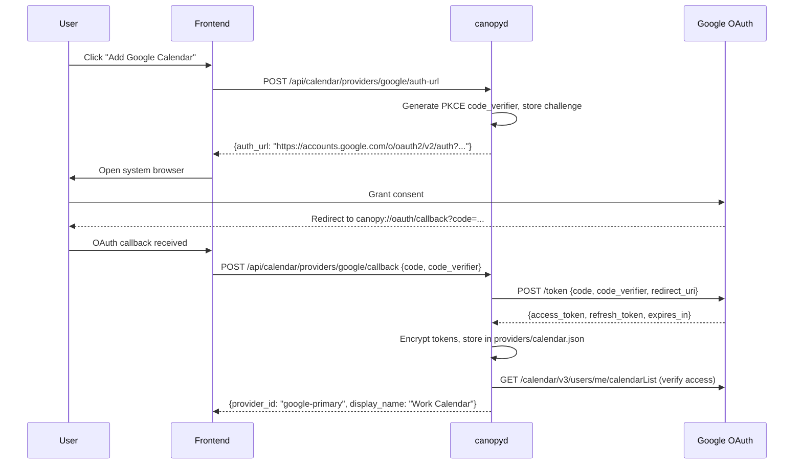

# SPEC-PL-05 — Calendar Integration

> **Status:** Spec | **Blocks:** BE-18 (Calendar Card Store), BE-19 (Calendar Provider Manager), BE-20 (Calendar Sync), BE-21 (Auto-Responder Engine), FE-14 (Calendar Viewer), FE-15 (Event Card Renderer)
> **References:** SPEC-PL-03, SPEC-PL-04, SPEC-API-01, SPEC-API-02, SPEC-API-07, SPEC-DM-01, SPEC-DM-03, SPEC-DM-04, SPEC-TM-01, SPEC-TM-04, ARCHITECTURE.md §3, ARCHITECTURE.md §4, ARCHITECTURE.md §5

---

## 1. Purpose

Define the exact implementation contract for Canopy calendar integration: a card-backed calendar viewer, provider-agnostic event storage, agent calendar actions, an auto-responder that respects busy time, and busy-status propagation across Hermes sessions. A Go worker reading this document can implement `CalendarCardService`, `CalendarProvider` adapters (Google OAuth, CalDAV, local ICS), the `AutoResponder`, status publishing, calendar SSE, HTTP handlers, and `canopyd` wiring without additional design decisions. A TypeScript worker can implement the month/week/day view components, EventSource subscription to calendar events, event card renderers, recurrence rendering, availability picker, OAuth consent flow UI, and auto-responder configuration panel without guessing the wire shapes.

Calendar events are stored as `expanded` cards in a dedicated `~/.hermes/canopy/cards/calendar.db` database following the two-table contract from SPEC-PL-03. Each calendar event is a card with `card_type = 'expanded'`, `app_id = 'hermes.canopy.calendar'`, and a structured `data` object containing ICALENDAR-compatible event fields. The calendar viewer card is a `compact` card of type `calendar_view` that tracks view mode, visible range, and active event set. Providers are pluggable through a `CalendarProvider` interface — Google Calendar (OAuth 2.0), iCloud (CalDAV), and local `.ics` files are the three built-in implementations.

---

## 2. Design Decisions

| Decision | Choice | Rationale |
|----------|--------|-----------|
| Calendar identity | UUIDv7 generated at card creation | Matches SPEC-DM-01 and SPEC-PL-03 identity conventions; time-ordered for efficient scans |
| Calendar storage | `expanded` card in dedicated `calendar.db` | Reuses the SPEC-PL-03 card contract, events table, and base lifecycle without a new storage engine |
| Event data envelope | ICALENDAR VEVENT fields as JSON in `cards.data` | Standard field names map directly to .ics format interop and CalDAV/Google API round-trips |
| Provider abstraction | `CalendarProvider` Go interface with register/unregister | New sources (Outlook, Proton Mail, FastMail) are added without changing the card service |
| Google Calendar auth | OAuth 2.0 Authorization Code Flow with PKCE | Native browser consent, refresh token rotation, no persistent client secret on disk |
| CalDAV auth | OAuth 2.0 (Apple/iCloud) or Basic Auth + `/.well-known/caldav` | Matches RFC 6764 discovery; Apple enforces OAuth for iCloud |
| Local `.ics` | File watcher on `.ics` files in the Hermes knowledge base | Changes written by other tools propagate without explicit import; no background sync needed |
| Provider config storage | Encrypted JSON file at `~/.hermes/canopy/providers/calendar.json` | Tokens and passwords are encrypted at rest; the file is a single registry for all calendar sources |
| Encryption | AES-256-GCM with key derived from the profile master key | Token material never stored in plaintext; matches ARCHITECTURE.md §5 credential protection |
| Recurrence handling | Expand single occurrence to real events; store RRULE in parent card | The parent card is non-rendered metadata; each occurrence is a separate event card with `recurrence_parent_id` |
| Recurrence updates | Update single occurrence leaves others unchanged; update-all creates a new RRULE | Matches Google Calendar and CalDAV behavior; user expectation from existing calendar tools |
| Timezone handling | Store `dtstart` and `dtend` as RFC 3339 with explicit timezone offset | ICALENDAR `VTIMEZONE` is preserved in provider sync but the internal model stores resolved UTC + tz offset |
| All-day events | `dtstart` and `dtend` are date-only strings (YYYY-MM-DD) with `all_day: true` | Matches ICALENDAR VALUE=DATE convention; no timezone offset ambiguity |
| Availability query | Free/Busy endpoint returns `[{start, end, source, event_card_id}]` over a range | Lightweight query does not materialize event cards; used by auto-responder and availability picker |
| Busy detection | Any `confirmed` or `tentative` event in range with non-zero overlap | `free` or `cancelled` events are skipped; events under `busy_threshold_seconds` (default 300, configurable) are ignored |
| Busy status propagation | Hermes presence message over the agent SSE bus | Other Hermes profiles and gateway integrations see the busy status without polling the calendar |
| Busy status format | `{"type": "presence", "status": "busy", "until": "...", "summary": "in meeting"}` | Machine-readable and human-readable; used by auto-responder, status bar, and gateway dispatch |
| Auto-responder activation | Opt-in per profile: `calendar.auto_responder: true` | Calendar awareness is not assumed; user must enable before agent auto-responds |
| Auto-responder scope | Responds to new messages during busy blocks only | Does not re-reply to existing threads or override manual replies |
| Auto-responder content | "NAME is in a meeting until TIME. They will respond after that." or custom template | Concise, actionable, does not expose event details |
| Auto-responder template | User-configurable via profile settings: `auto_responder_template` | Default is polite English; supports `{name}`, `{time}`, `{summary}` placeholders |
| Event participation | `attendees` array with `{email, name, status, optional}` | Matches ICALENDAR ATTENDEE fields; used for availability queries across users |
| Organizer identity | `organizer` field with email and name | Matches ICALENDAR ORGANIZER; used for updates and cancellation authority |
| Event modification guard | Only the organizer may cancel; any attendee may update own status | Matches common calendar provider semantics |
| Agent create event | Agent calls `POST /api/calendar/events` with structured event payload | Creates a card, broadcasts SSE event, triggers background sync to provider |
| Agent modify event | Agent calls `PATCH /api/calendar/events/{cardId}` with partial update fields | Server validates organizer permission, updates card, syncs to provider |
| Agent propose times | Agent calls `POST /api/calendar/availability/propose` with duration and window | Returns ranked list of free blocks from all sources; no card created until user accepts |
| Agent check availability | `GET /api/calendar/availability?start=...&end=...` | Returns merged free/busy from all providers without creating cards |
| Time proposal format | `[{start, end, score, conflicts: [{attendee, source}]}]` | Scores by number of free attendees; user sees ranked options with conflict details |
| Event card actions | `open`, `edit`, `delete`, `accept`, `decline`, `tentative` | Standard invitation response plus calendar navigation |
| Calendar viewer card type | `calendar_view` — a `compact` card with `app_id = 'hermes.canopy.calendar'` | The viewer is a persistent compact card in the sidebar; its data payload tracks state |
| Viewer state | `{view_mode, current_date, sources: [{id, enabled, busy_visible}]}` | Lightweight; the monthly/weekly/daily event set is derived from calendar.db at render time |
| SSE per-event stream | `/api/cards/calendar/events/{cardId}` | Follows SPEC-PL-03 SSE contract; each event card publishes its own stream |
| SSE calendar viewer stream | `/api/calendar/viewer/events` | Single stream for viewer state changes and event card availability changes |
| Sync strategy | Poll-based for Google (via `watch` channels for push, poll as fallback); push-based for CalDAV | Google Calendar API supports push notifications; CalDAV uses CTag polling |
| Sync interval | Active providers poll every 60s; idle providers poll every 300s | Active means the calendar viewer card is open or an auto-responder is configured |
| Conflict resolution | Remote event always wins (source of truth is the provider) | Calendar providers are authoritative; local modifications are pushed upstream |
| Old event retention | Events older than 90 days from today transition to `archived` status | Keeps the calendar.db compact while respecting base card lifecycle |
| Event card limit | At most 500 active event cards at any time | Prevents calendar.db from unbounded growth; older events auto-archive |

---

## 3. Data Model — `calendar.db`

### 3.1 Database Initialization

`CalendarCardDBManager.Open` creates `~/.hermes/canopy/cards/` (mode `0700`), opens `calendar.db`, and runs these pragmas:

```sql
PRAGMA journal_mode = WAL;
PRAGMA synchronous = NORMAL;
PRAGMA foreign_keys = ON;
PRAGMA busy_timeout = 5000;
PRAGMA temp_store = MEMORY;
```

### 3.2 Migration: `calendar_cards`

```sql
-- 000001_calendar_cards.up.sql
CREATE TABLE cards (
    id              TEXT PRIMARY KEY NOT NULL,
    app_id          TEXT NOT NULL DEFAULT 'hermes.canopy.calendar',
    card_type       TEXT NOT NULL DEFAULT 'expanded',
    data            TEXT NOT NULL DEFAULT '{}',
    actions         TEXT NOT NULL DEFAULT '[]',
    status          TEXT NOT NULL DEFAULT 'active',
    context_hash    TEXT NOT NULL DEFAULT '',
    revision        INTEGER NOT NULL DEFAULT 1,
    created_at      TEXT NOT NULL DEFAULT (strftime('%Y-%m-%dT%H:%M:%fZ', 'now')),
    updated_at      TEXT NOT NULL DEFAULT (strftime('%Y-%m-%dT%H:%M:%fZ', 'now')),
    dismissed_at    TEXT,
    archived_at     TEXT,
    CHECK (length(id) = 36),
    CHECK (app_id = 'hermes.canopy.calendar'),
    CHECK (card_type = 'expanded'),
    CHECK (json_valid(data)),
    CHECK (length(data) <= 1048576),
    CHECK (json_valid(actions) AND json_type(actions) = 'array'),
    CHECK (status IN ('active', 'dismissed', 'archived')),
    CHECK (revision >= 1)
);

CREATE TABLE events (
    sequence         INTEGER PRIMARY KEY AUTOINCREMENT,
    event_id         TEXT NOT NULL UNIQUE,
    card_id          TEXT NOT NULL,
    event_type       TEXT NOT NULL,
    actor_kind       TEXT NOT NULL,
    actor_id         TEXT NOT NULL,
    payload          TEXT NOT NULL DEFAULT '{}',
    created_at       TEXT NOT NULL DEFAULT (strftime('%Y-%m-%dT%H:%M:%fZ', 'now')),
    CHECK (length(event_id) = 36),
    CHECK (event_type IN (
        'card_created', 'card_updated', 'card_dismissed', 'card_restored',
        'card_archived', 'agent_progress', 'agent_output', 'agent_error',
        'user_feedback', 'action_requested', 'action_completed',
        'context_rebound', 'sync_applied', 'sync_conflict',
        'event_synced', 'event_confirmed', 'event_declined',
        'event_updated_external', 'event_removed_external',
        'busy_started', 'busy_ended', 'auto_responded'
    )),
    CHECK (actor_kind IN ('agent', 'user', 'system', 'sync', 'provider')),
    CHECK (length(actor_id) BETWEEN 1 AND 128),
    CHECK (json_valid(payload)),
    CHECK (length(payload) <= 262144),
    FOREIGN KEY (card_id) REFERENCES cards(id) ON DELETE RESTRICT
);

CREATE INDEX idx_cards_status_created ON cards(status, created_at DESC);
CREATE INDEX idx_cards_data_dtstart ON cards(json_extract(data, '$.dtstart'));
CREATE INDEX idx_cards_data_provider_id ON cards(json_extract(data, '$.provider_card_id'));
CREATE INDEX idx_events_card_sequence ON events(card_id, sequence ASC);
CREATE INDEX idx_events_type_created ON events(event_type, created_at DESC);

CREATE TRIGGER trg_cards_updated_at
AFTER UPDATE OF data, actions, status, revision ON cards
FOR EACH ROW
BEGIN
    UPDATE cards
    SET updated_at = strftime('%Y-%m-%dT%H:%M:%fZ', 'now')
    WHERE id = NEW.id;
END;

CREATE TRIGGER trg_events_no_update
BEFORE UPDATE ON events
FOR EACH ROW
BEGIN
    SELECT RAISE(ABORT, 'events is append-only');
END;

CREATE TRIGGER trg_events_no_delete
BEFORE DELETE ON events
FOR EACH ROW
BEGIN
    SELECT RAISE(ABORT, 'events is append-only');
END;
```

### 3.3 Calendar Viewer Card

The viewer card uses the same `calendar.db` with `card_type = 'calendar_view'`:

```sql
-- 000002_viewer_cards.up.sql
CREATE TABLE viewer_cards (
    id              TEXT PRIMARY KEY NOT NULL,
    app_id          TEXT NOT NULL DEFAULT 'hermes.canopy.calendar',
    card_type       TEXT NOT NULL DEFAULT 'calendar_view',
    data            TEXT NOT NULL DEFAULT '{}',
    actions         TEXT NOT NULL DEFAULT '[]',
    status          TEXT NOT NULL DEFAULT 'active',
    revision        INTEGER NOT NULL DEFAULT 1,
    created_at      TEXT NOT NULL DEFAULT (strftime('%Y-%m-%dT%H:%M:%fZ', 'now')),
    updated_at      TEXT NOT NULL DEFAULT (strftime('%Y-%m-%dT%H:%M:%fZ', 'now')),
    CHECK (length(id) = 36),
    CHECK (card_type = 'calendar_view'),
    CHECK (json_valid(data)),
    CHECK (status IN ('active', 'dismissed')),
    CHECK (revision >= 1)
);

CREATE TRIGGER trg_viewer_updated_at
AFTER UPDATE OF data, actions, status, revision ON viewer_cards
FOR EACH ROW
BEGIN
    UPDATE viewer_cards
    SET updated_at = strftime('%Y-%m-%dT%H:%M:%fZ', 'now')
    WHERE id = NEW.id;
END;
```

The viewer card `data` payload:

```json
{
  "view_mode": "month",
  "current_date": "2026-07-22",
  "view_range": {
    "start": "2026-07-20T00:00:00Z",
    "end": "2026-08-02T23:59:59Z"
  },
  "sources": [
    {"id": "google-primary", "name": "Work Calendar", "provider_type": "google",
     "enabled": true, "busy_visible": true, "color": "#4285F4"}
  ],
  "active_event_count": 23,
  "pending_response_count": 2
}
```

---

## 4. Calendar Source Model

### 4.1 Provider Configuration (encrypted JSON)

```json
{
  "sources": [
    {
      "id": "google-primary",
      "provider_type": "google",
      "display_name": "Work Calendar",
      "enabled": true,
      "color": "#4285F4",
      "auth": {
        "type": "oauth2",
        "client_id": "xxxx.apps.googleusercontent.com",
        "token": "<ENCRYPTED_AES_256_GCM>",
        "refresh_token": "<ENCRYPTED_AES_256_GCM>",
        "token_expires_at": "2026-07-22T10:00:00Z",
        "scopes": [
          "https://www.googleapis.com/auth/calendar.events",
          "https://www.googleapis.com/auth/calendar.freebusy"
        ]
      },
      "sync": {
        "last_sync_at": "2026-07-22T08:15:00Z",
        "sync_cursor": "CNmZ2OjClvoDEgUIBRgAGAE=",
        "watch_channel_id": "uuid-watch",
        "watch_expires_at": "2026-07-29T08:15:00Z"
      }
    },
    {
      "id": "icloud-personal",
      "provider_type": "caldav",
      "display_name": "Personal",
      "enabled": true,
      "color": "#34A853",
      "auth": {
        "type": "oauth2",
        "client_id": "com.apple.account.CalDAV",
        "token": "<ENCRYPTED>",
        "token_expires_at": "2026-07-23T08:00:00Z"
      },
      "connection": {
        "base_url": "https://caldav.icloud.com/",
        "principal_path": "/principals/me/",
        "calendar_home_set": "/calendars/me/"
      },
      "sync": {"last_sync_at": "2026-07-22T08:10:00Z", "ctag": "abc123-ctag"}
    },
    {
      "id": "ics-local",
      "provider_type": "ics_file",
      "display_name": "Team Events",
      "enabled": true,
      "color": "#FBBC04",
      "path": "/home/user/.hermes/knowledge/team-events.ics",
      "sync": {"last_import_at": "2026-07-22T07:00:00Z", "file_hash": "sha256-hash"}
    }
  ]
}
```

### 4.2 Provider Go Interface

```go
type CalendarProvider interface {
    Type() string
    ID() string
    ListEvents(ctx context.Context, start, end time.Time) ([]CalendarEvent, error)
    CreateEvent(ctx context.Context, event CalendarEvent) (string, error) // returns provider_card_id
    UpdateEvent(ctx context.Context, providerCardID string, event CalendarEvent) error
    DeleteEvent(ctx context.Context, providerCardID string) error
    GetFreeBusy(ctx context.Context, start, end time.Time) ([]BusyBlock, error)
    Sync(ctx context.Context, since time.Time, cursor string) (CalendarSyncResult, error)
    IsActive() bool
}

type CalendarEvent struct {
    ID              string      `json:"id"`
    Title           string      `json:"title"`
    Description     string      `json:"description,omitempty"`
    Location        string      `json:"location,omitempty"`
    DtStart         time.Time   `json:"dtstart"`
    DtEnd           time.Time   `json:"dtend"`
    AllDay          bool        `json:"all_day"`
    Status          string      `json:"status"`     // confirmed, tentative, cancelled, free
    Organizer       *Attendee   `json:"organizer,omitempty"`
    Attendees       []Attendee  `json:"attendees,omitempty"`
    RecurrenceID    string      `json:"recurrence_id,omitempty"`
    RRule           string      `json:"rrule,omitempty"`
    ExDates         []string    `json:"exdates,omitempty"`
    Transparency    string      `json:"transparency"` // opaque or transparent
    Reminders       []Reminder  `json:"reminders,omitempty"`
    CreatedAt       time.Time   `json:"created_at"`
    UpdatedAt       time.Time   `json:"updated_at"`
}

type Attendee struct {
    Email    string `json:"email"`
    Name     string `json:"name,omitempty"`
    Status   string `json:"status"`   // accepted, declined, tentative, needs_action
    Optional bool   `json:"optional,omitempty"`
}

type BusyBlock struct {
    Start       time.Time `json:"start"`
    End         time.Time `json:"end"`
    Source      string    `json:"source"`
    EventCardID string    `json:"event_card_id,omitempty"`
}

type CalendarSyncResult struct {
    NewEvents     []CalendarEvent `json:"new_events"`
    UpdatedEvents []CalendarEvent `json:"updated_events"`
    DeletedIDs    []string        `json:"deleted_ids"`
    NewCursor     string          `json:"new_cursor,omitempty"`
    NewCTag       string          `json:"new_ctag,omitempty"`
}
```

### 4.3 Google OAuth Flow



### 4.4 CalDAV Discovery (RFC 6764)

1. Well-known URL: `GET /.well-known/caldav` resolves to principal URL
2. Principal discovery: `PROPFIND` on principal URL for `calendar-home-set`
3. Calendar listing: `PROPFIND` on calendar-home-set for display name, color, CTag
4. Event query: `REPORT` with `calendar-query` filtering by `VEVENT` and time range
5. iCloud specifics: OAuth 2.0 with `com.apple.account.CalDAV` client ID

### 4.5 Local ICS File Watcher

The ICS provider reads `.ics` files from `~/.hermes/knowledge/`. An inotify watcher monitors for modifications:

- **File created/updated**: Re-import, SHA-256 diff against stored `file_hash`, delta-merge event cards
- **File deleted**: Events are NOT immediately removed; set to `dismissed` if file absent for 24h
- **Parser errors**: Emit `CALENDAR_ICS_PARSE_ERROR` with line-level details

---

## 5. Calendar Event Card Model

### 5.1 Event Card Data Envelope

```json
{
  "provider_id": "google-primary",
  "provider_card_id": "abc123def456",
  "calendar_name": "Work Calendar",
  "title": "Sprint Planning",
  "description": "Weekly sprint planning session with the team.",
  "location": "Meeting Room 3 / Zoom",
  "dtstart": "2026-07-22T14:00:00-04:00",
  "dtend": "2026-07-22T15:00:00-04:00",
  "all_day": false,
  "timezone": "America/New_York",
  "status": "confirmed",
  "transparency": "opaque",
  "organizer": {
    "email": "alex@example.com",
    "name": "Alexis Okuwa"
  },
  "attendees": [
    {"email": "kara@example.com", "name": "Kara", "status": "accepted", "optional": false}
  ],
  "recurrence": null,
  "recurrence_parent_id": null,
  "reminders": [
    {"type": "email", "minutes_before": 1440},
    {"type": "popup", "minutes_before": 10}
  ],
  "conference": {
    "type": "zoom",
    "url": "https://zoom.us/j/123456789",
    "meeting_code": "123456789"
  },
  "privacy": "public"
}
```

### 5.2 Recurrence Model

Recurring events use a parent-card + occurrences pattern:

- **Parent card**: `recurrence = {"freq": "weekly", "interval": 1, "byday": ["MO"], "until": "2026-10-01T00:00:00Z"}`. Parent has `status = 'archived'` — never rendered. `recurrence_parent_id` is null.
- **Occurrence cards**: Each occurrence is a separate `expanded` card with `recurrence_parent_id` pointing to the parent. Occurrences transition to `dismissed` after their `dtend` passes.
- **Exception dates**: `recurrence_exception_dates` lists removed dates. Overridden occurrences (single-instance edit) get their own `provider_card_id`.

Card actions on recurring events:
- `edit_this`: update single occurrence (separate card with new `provider_card_id`)
- `edit_all`: update parent card's RRULE
- `delete_this`: cancel single occurrence (adds date to EXDATE)
- `delete_all`: cancel all (parent + children → `dismissed`)

---

## 6. Event Vocabulary

Calendar-specific event types added to the base SPEC-PL-03 vocabulary:

| Event type | Actor | Payload | Materialized effect |
|------------|-------|---------|---------------------|
| `event_synced` | provider | `{provider_id, provider_card_id, sync_action}` | Provider sync updated the event card |
| `event_confirmed` | user | `{reply_status: 'accepted'}` | Set attendee status to accepted |
| `event_declined` | user | `{reply_status: 'declined', reason?}` | Set attendee status to declined |
| `event_updated_external` | provider | `{changed_fields: [...], previous: {...}}` | Provider's version differs from local |
| `event_removed_external` | provider | `{provider_card_id}` | Remote event deleted; card set dismissed |
| `busy_started` | system | `{event_card_id, title, until, source}` | Auto-responder triggers; status updates |
| `busy_ended` | system | `{event_card_id}` | Event ended; status clears |
| `auto_responded` | system | `{message_id, recipient, template}` | Auto-reply was sent |

All base SPEC-PL-03 event types remain valid (`card_created`, `card_updated`, `user_feedback`, etc.).

---

## 7. Agent Calendar Actions

### 7.1 Create Event

```
POST /api/calendar/events
Authorization: Bearer <jwt>
Content-Type: application/json

{
  "title": "Design Review",
  "description": "Review architecture",
  "location": "Room A",
  "dtstart": "2026-07-23T10:00:00-04:00",
  "dtend": "2026-07-23T11:00:00-04:00",
  "timezone": "America/New_York",
  "attendees": [{"email": "kara@example.com"}],
  "reminders": [{"type": "popup", "minutes_before": 15}]
}

Response 201:
{
  "card_id": "0191a9c3-...",
  "provider_id": "google-primary",
  "provider_card_id": "abc456def789",
  "title": "Design Review"
}
```

Server flow: generate UUIDv7 → validate → write card → `card_created` event → `Provider.CreateEvent()` → store `provider_card_id` → publish SSE.

### 7.2 Modify Event

```
PATCH /api/calendar/events/{cardId}
If-Match: <revision>
Content-Type: application/json

{"title": "Design Review (Rescheduled)", "dtstart": "...", "dtend": "..."}

Response 200: {card_id, revision: 2, updated_fields: ["title", "dtstart", "dtend"]}
```

Partial updates. Optimistic concurrency via `If-Match`.

### 7.3 Delete Event

```
DELETE /api/calendar/events/{cardId}
If-Match: <revision>

Response 200: {card_id, status: "dismissed"}
```

### 7.4 Free/Busy Query

```
GET /api/calendar/availability?start=2026-07-25T08:00:00Z&end=...&duration=60&attendees=kara%40example.com

Response 200:
{
  "blocks": [
    {"start": "...", "end": "...", "available": true, "score": 2},
    {"start": "...", "end": "...", "available": false, "score": 0,
     "conflicts": [{"event_card_id": "...", "title": "Standup", "attendee_count": 2}]}
  ],
  "timezone": "America/New_York"
}
```

### 7.5 Propose Times

```
POST /api/calendar/availability/propose
Content-Type: application/json

{
  "title": "Sync Meeting",
  "duration_minutes": 30,
  "window_start": "2026-07-24T08:00:00Z",
  "window_end": "2026-07-25T20:00:00Z",
  "attendees": ["bob@example.com"],
  "prefer_morning": true
}

Response 200:
{
  "proposals": [
    {"start": "...", "end": "...", "score": 2, "available_attendees": ["me", "bob"]},
    {"start": "...", "end": "...", "score": 1, "available_attendees": ["me"]}
  ]
}
```

---

## 8. Auto-Responder

### 8.1 Engine Logic

The auto-responder runs as a background goroutine in `canopyd`. On each 60-second tick:

1. Query all providers for the next 24h where `transparency = 'opaque'` and `status = 'confirmed' | 'tentative'`
2. Build a set of busy blocks (merged for overlapping events). Blocks < `busy_threshold_minutes` (default 5) are excluded.
3. Compare against the last-emitted busy set
4. On busy→free: emit `busy_ended`, clear presence status
5. On free→busy: emit `busy_started`, set presence status, activate auto-responder

### 8.2 Auto-Reply Trigger

When a new message arrives via Hermes gateway AND `auto_responder: true` AND the current time falls in a busy block:

1. Gateway checks auto-responder state (in-memory busy set, updated every 60s)
2. If busy: generates a reply using the configured template
3. Sends reply as a normal message from the agent
4. Appends `auto_responded` event with message_id and recipient

### 8.3 Reply Template

Default: "{{.Name}} is in a meeting until {{.Time}}. They will respond after that."

Template variables: `{{.Name}}`, `{{.Time}}`, `{{.Summary}}`, `{{.SenderName}}`, `{{.Text}}` (configurable status text, default: "in a meeting").

### 8.4 Busy Threshold

`busy_threshold_minutes` (default 5) prevents auto-responder activation for events shorter than 5m. `transparent` events are never treated as busy.

---

## 9. Status Integration

### 9.1 Busy Status Propagation

On `busy_started`:
1. Publish SSE on Hermes gateway presence channel
2. Presence message: `{"type": "presence", "status": "busy", "until": "...", "summary": "Sprint Planning"}`
3. All gateway sessions receive the update
4. Profile UI status indicator changes from `available` to `busy`

On `busy_ended`:
1. Check if any OTHER busy block is active (back-to-back)
2. If none: publish `{"type": "presence", "status": "available"}`
3. Auto-responder deactivates

### 9.2 Multi-Profile Status

Each profile independently runs its own auto-responder. `cross_profile_busy: false` (default) means a meeting on one profile does NOT affect the other.

---

## 10. SSE Contract

### 10.1 Viewer SSE Stream

```
GET /api/calendar/viewer/events
Authorization: Bearer <jwt>
Accept: text/event-stream
Last-Event-ID: <sequence>
```

| SSE event | Payload | Trigger |
|-----------|---------|---------|
| `card_created` | `{card_id, title, dtstart, dtend, provider_id}` | New event card |
| `card_updated` | `{card_id, changed_fields}` | Event modified |
| `card_dismissed` | `{card_id}` | Event removed |
| `busy_started` | `{until, summary}` | User is now busy |
| `busy_ended` | `{event_card_id}` | User is now free |
| `heartbeat` | `{}` | Every 30s |

### 10.2 Per-Event Card SSE

Each event card also exposes `/api/cards/calendar/{cardId}/events` following the base SPEC-PL-03 SSE contract, emitting calendar-specific event types.

---

## 11. View Modes

### 11.1 Month View

```
GET /api/calendar/viewer/month?date=2026-07-01&tz=America/New_York

Response: 6x7 grid. Each cell: {date, events: [{card_id, title, time, color}], is_current_month, today}
```

Up to 3 event dots/titles per cell; overflow "+N more".

### 11.2 Week View

```
GET /api/calendar/viewer/week?date=2026-07-20
Response: {week_start, days: [{date, day_name, events: [{card_id, title, dtstart, dtend, all_day, color, status}]}]}
```

### 11.3 Day View

```
GET /api/calendar/viewer/day?date=2026-07-22
Response: {date, hours: [{hour, events: [{card_id, title, time_range}]}], all_day_events}
```

Multi-hour events span consecutive hour slots. All-day events listed above the grid.

---

## 12. Provider Management Endpoints

### 12.1 Register Provider

```
POST /api/calendar/providers
{provider_type: "google"|"caldav"|"ics_file", display_name, path? (for ics)}
```

Returns `{provider_id, auth_url?}` — for OAuth providers, includes the consent URL.

### 12.2 OAuth Callback

```
POST /api/calendar/providers/{providerId}/callback
{code, state, code_verifier?}
```

Returns `{provider_id, display_name, event_count}`.

### 12.3 CRUD on Providers

```
GET    /api/calendar/providers                   — list all
PATCH  /api/calendar/providers/{id} {updates}    — modify display name, enable/disable
DELETE /api/calendar/providers/{id}              — remove (dismisses event cards)
POST   /api/calendar/providers/{id}/sync         — trigger immediate sync
```

---

## 13. Error Catalog

All errors follow the SPEC-API-07 envelope: `{code, message, request_id}`.

| Code | HTTP | Description |
|------|------|-------------|
| `CALENDAR_PROVIDER_NOT_FOUND` | 404 | Provider not registered |
| `CALENDAR_PROVIDER_AUTH_EXPIRED` | 401 | OAuth token expired, re-auth needed |
| `CALENDAR_PROVIDER_AUTH_FAILED` | 502 | Provider API returned 401/403 |
| `CALENDAR_EVENT_NOT_FOUND` | 404 | Event card not found |
| `CALENDAR_EVENT_PAST` | 400 | Cannot modify events ended >24h ago |
| `CALENDAR_EVENT_NOT_ORGANIZER` | 403 | Only organizer can delete/update |
| `CALENDAR_EVENT_VALIDATION_FAILED` | 422 | Invalid event payload |
| `CALENDAR_SYNC_IN_PROGRESS` | 409 | Sync already running for this provider |
| `CALENDAR_SYNC_FAILED` | 502 | Provider sync failed |
| `CALENDAR_RECURRENCE_PARENT_NOT_FOUND` | 404 | Recurrence parent card missing |
| `CALENDAR_RECURRENCE_EDIT_CONFLICT` | 409 | Concurrent occurrence edit |
| `CALENDAR_RATE_LIMITED` | 429 | Provider rate limit hit |
| `CALENDAR_OAUTH_STATE_MISMATCH` | 400 | OAuth CSRF protection triggered |
| `CALENDAR_OAUTH_CALLBACK_FAILED` | 502 | Token exchange failed |
| `CALENDAR_ATTENDEE_NOT_FOUND` | 404 | Attendee not in event list |
| `CALENDAR_AVAILABILITY_PAST_WINDOW` | 400 | Window starts in the past |
| `CALENDAR_AVAILABILITY_TOO_LARGE` | 400 | Window exceeds 90 days |
| `CALENDAR_ICS_FILE_NOT_FOUND` | 404 | ICS file not found |
| `CALENDAR_ICS_PARSE_ERROR` | 422 | Invalid ICALENDAR format |
| `CALENDAR_ICS_TOO_LARGE` | 422 | ICS file exceeds 5000 events |

---

## 14. canopyd Wiring

### 14.1 Service Creation

```go
func wireCalendarService(
    dbManager   *CardDBManager,
    providerMgr *ProviderManager,
    cardHub     *CardEventHub,
    presenceBus *PresenceBus,
    profileAuth *ProfileAuthMiddleware,
    logger      *slog.Logger,
) (*CalendarCardService, error) {

    calendarDB, err := dbManager.OpenDB("calendar")
    if err != nil {
        return nil, fmt.Errorf("calendar db: %w", err)
    }

    cardRepo := NewCalendarCardRepository(calendarDB)
    providerRepo := NewProviderRepository(providerMgr, logger)
    service := NewCalendarCardService(cardRepo, providerRepo, cardHub, presenceBus, logger)
    return service, nil
}
```

### 14.2 Route Registration

```go
func registerCalendarRoutes(router chi.Router, auth func(http.Handler) http.Handler, svc *CalendarCardService) {
    router.Route("/api/calendar", func(r chi.Router) {
        r.Use(auth)
        r.Post("/providers", svc.HandleRegisterProvider)
        r.Get("/providers", svc.HandleListProviders)
        r.Patch("/providers/{id}", svc.HandleUpdateProvider)
        r.Delete("/providers/{id}", svc.HandleRemoveProvider)
        r.Post("/providers/{id}/callback", svc.HandleProviderCallback)
        r.Post("/providers/{id}/sync", svc.HandleSyncProvider)
        r.Post("/events", svc.HandleCreateEvent)
        r.Get("/events/{cardId}", svc.HandleGetEvent)
        r.Patch("/events/{cardId}", svc.HandleUpdateEvent)
        r.Delete("/events/{cardId}", svc.HandleDeleteEvent)
        r.Get("/events", svc.HandleListEvents)
        r.Get("/availability", svc.HandleGetAvailability)
        r.Post("/availability/propose", svc.HandleProposeTimes)
        r.Get("/viewer/month", svc.HandleMonthView)
        r.Get("/viewer/week", svc.HandleWeekView)
        r.Get("/viewer/day", svc.HandleDayView)
        r.Get("/viewer/events", svc.HandleViewerSSE)
    })
}
```

### 14.3 main.go Wiring

```go
func main() {
    // ... existing canopyd startup ...
    calendarSvc, err := wireCalendarService(cardDBMgr, providerMgr, cardHub, presenceBus, profileAuth, logger)
    if err != nil {
        log.Fatalf("calendar service: %v", err)
    }
    registerCalendarRoutes(router, profileAuth.Middleware, calendarSvc)
    calendarSvc.StartAutoResponder(ctx)
    // ... existing server startup ...
}
```

---

## 15. Edge Cases

1. **Provider token expires during sync**: Abort sync, emit `CALENDAR_PROVIDER_AUTH_EXPIRED`, notify user to re-authenticate.

2. **Concurrent agent + user modification**: Optimistic concurrency (`If-Match`) ensures one succeeds, the other gets 409.

3. **Recurring event crosses DST boundary**: VTIMEZONE rules resolve each occurrence to the correct UTC offset for that date.

4. **Multiple calendars from one provider**: One provider registration per calendar. Each has its own `calendar_id`.

5. **ICS file not modified but watcher triggers**: SHA-256 file hash compare skips re-import if hash unchanged.

6. **15-minute gap between meetings**: Auto-responder merges blocks separated by < `busy_threshold_minutes` (default 5) into one busy block.

7. **Attendee declines**: Event card unchanged; `event_declined` recorded in events. UI shows user's response status.

8. **User rejects agent-proposed time**: `user_feedback` with `reject`. No card created. Agent receives rejection and may propose alternatives.

9. **Provider returns event that was locally dismissed**: Local state respected for 7 days. After 7 days, provider state overwrites.

10. **ICS file with 10,000 VEVENTs**: Process in batches of 250. Warn at 5000+. Prompt user to split calendar.

11. **OAuth state expired**: State TTL is 10 minutes. Expired state returns `CALENDAR_OAUTH_STATE_EXPIRED`.

12. **Calendar with zero events + auto-responder enabled**: Busy set is empty. Auto-responder never fires. Correct behavior.

13. **Multi-day all-day event across weekend**: Rendered in all three date cells. Single event card, displayed in all-day section.

14. **Google push notification after watch expires**: Fall back to polling. Next 60s poll picks up changes.

15. **User revokes access from Google security settings**: Provider returns 403. Mark provider `enabled: false`. Dismiss all event cards. Prompt re-auth.

16. **SSE reconnects with stale Last-Event-ID**: Server queries `sequence > id`. If sequence GC'd, return from archive boundary.

17. **Agent proposes time in the past**: Returns `CALENDAR_AVAILABILITY_PAST_WINDOW`. Agent must request future window.

18. **Read-only birthday calendar**: Provider marked `read_only: true`. UI hides "Create Event" for that source.

19. **All available blocks outside working hours**: If `working_hours` configured and no blocks overlap, response includes `working_hours_warning`.

20. **User typing while auto-responder fires**: 10-second delay. If user sends a manual reply within that window, auto-responder cancels.

---

## 16. Version History

| Version | Date | Change |
|---------|------|--------|
| 1.0 | 2026-07-22 | Initial implementation specification for Calendar Integration: calendar viewer card, event card model, provider framework (Google OAuth, CalDAV, local ICS), agent calendar actions, free/busy availability, auto-responder, busy status propagation, SSE contracts, three view modes, OAuth/CalDAV wiring, error catalog, canopyd wiring, and 20 edge cases. |
