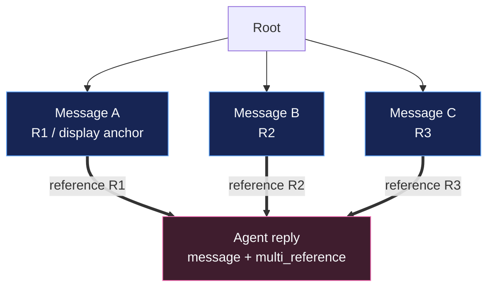
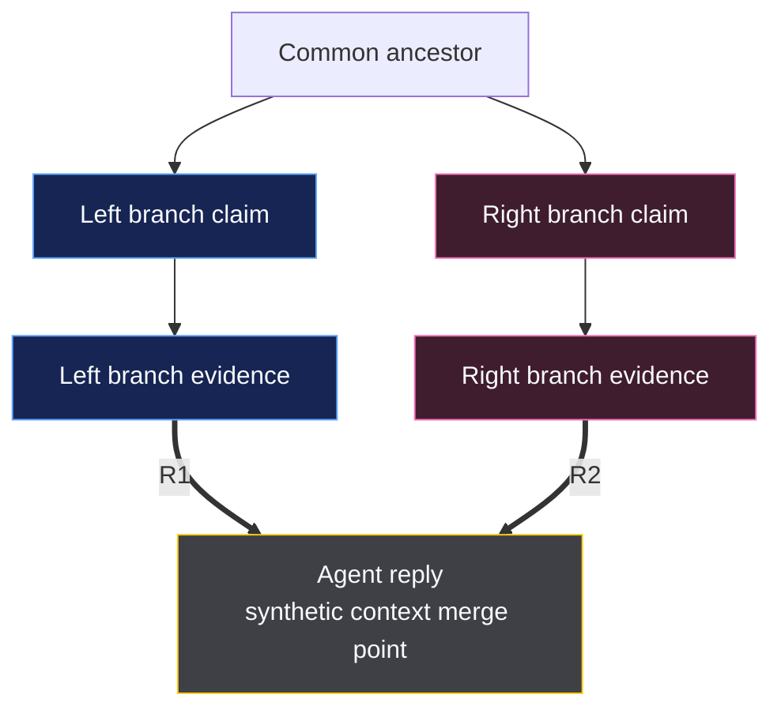

# SPEC-PL-06 — Multi-Message Reference Model

> **Status:** Spec | **Blocks:** BE-04 (Node Service), BE-03 (Tree Service), BE-11 (HTTP Router), AGENT-02 (Context Compiler), FE-03 (Tree Rendering), FE-05 (Message Composer), FE-06 (Merge View)
> **References:** SPEC-DM-01, SPEC-PL-03, SPEC-PL-04, SPEC-TM-04, SPEC-API-02, SPEC-API-03, SPEC-API-04, ARCHITECTURE.md §3.1, §5, §7

---

## 1. Purpose

Define the implementation contract that extends Canopy's DAG so an ordinary message can reply to multiple selected messages through multiple incoming `reference` edges. A multi-reference reply is a `message` node, not a `synthesis` node: it is the agent's direct response to a selected set of messages. Its incoming `reference` edges are authoritative provenance, while its single `nodes.parent_id` remains a deterministic display anchor for tree-oriented readers and existing navigation code.

The feature has five connected obligations:

1. Persist two through twenty unique source messages as `reference` edges to one target message atomically.
2. Let the UI preflight a multi-selection, submit it to an agent turn, and render convergence when the reply arrives.
3. Compile every selected source into one ordered, budgeted, auditable context input with per-source metadata.
4. Detect selections that span branches and mark the reply as a synthetic context merge point without changing it into a semantic `synthesis` node.
5. Deliver a committed node plus all committed edges through existing `node_added` / `edge_added` events and a new composite convergence event.

This specification changes the exception to SPEC-DM-01 §3.5 deliberately: a `message` in `parent_mode = 'multi_reference'` is a permitted multi-parent node, but only when every active incoming parent edge is `reference`. `synthesis` keeps its existing multi-parent behavior through `synthesis` edges. `system` remains non-user-creatable and is never a multi-reference target.

---

## 2. Design Decisions

| # | Decision | Choice | Rationale |
|---|----------|--------|-----------|
| 1 | Data model | Keep the authoritative model as a typed DAG | ARCHITECTURE.md §3.1 defines the tree as a visualization, not storage truth. |
| 2 | Target node type | Multi-reference replies are `message` nodes | They are direct conversational replies, not authored semantic syntheses. |
| 3 | Synthesis distinction | Do not convert a multi-reference reply to `synthesis` | `synthesis` means the author claims to consolidate/resolve alternatives; a reference reply may ask a question or make no resolution. |
| 4 | Eligible node types | Only active `message` nodes may be created with `parent_mode='multi_reference'` | This adds the requested feature narrowly and leaves `synthesis` and `system` invariants stable. |
| 5 | `synthesis` behavior | Existing multi-parent `synthesis` edges remain unchanged | SPEC-API-04 remains the contract for semantic merge nodes. |
| 6 | `system` behavior | `system` nodes may not receive reference-parent sets | Server events must not acquire user-selected conversational provenance. |
| 7 | Multi-parent edge type | Only `reference` may be repeated into a `message` target | `reply` and `fork` stay single-parent structural edges. |
| 8 | Reference parent count | Require 2–20 active reference parents for a multi-reference reply | One source is a normal reply/reference use case; 20 bounds transaction, layout, and context cost. |
| 9 | Source uniqueness | Source IDs must be unique in the request and in active edges | A duplicate contributes no additional context and would corrupt provenance. |
| 10 | Same-tree scope | Every selected source and target is in the same tree | Cross-tree sharing remains Topic Reference work from SPEC-TM-04, not a graph edge. |
| 11 | Existing unique constraint | Retain `UNIQUE (source_id, target_id, edge_type)` | It already prevents duplicate `reference` edges for the same source-target pair. No permissive DDL change is needed. |
| 12 | Parent denormalization | Retain `nodes.parent_id` as the display-anchor parent | Existing child ordering, legacy tree readers, and compatibility queries remain useful. |
| 13 | Display anchor | `parent_id` equals the first source in the canonical selection order | A deterministic anchor preserves one tree placement without redefining the DAG parent set. |
| 14 | Parent mode | Add `nodes.parent_mode` with `lineage` and `multi_reference` | A first-class column prevents metadata-only state and lets services reject invalid edge mixtures. |
| 15 | Authoritative parents | Active incoming edges, not `parent_id` or metadata, define the parent set | Denormalized fields must never override graph provenance. |
| 16 | Selection order | Preserve UI selection order after server validation | Order is meaningful for context priority and displayed source numbering. |
| 17 | Edge color | Assign color deterministically from `(tree_id, target_id, source_id)` | Every client renders the same edge without persisting user-specific palette state. |
| 18 | Palette | Use an accessible eight-color palette plus ordinal label | Colors aid scanning; source labels `R1`–`R20` prevent color-only meaning. |
| 19 | Branch detection | Compute the nearest common ancestor and per-source first-divergent child | This makes a branch-spanning selection explainable without pretending the graph is a tree. |
| 20 | Merge marker | Store `metadata.multi_reference.branch_span` and `is_synthetic_merge_point` | The marker records context provenance, not a new node type. |
| 21 | Merge point wording | Call it a “synthetic context merge point” | This avoids conflating it with the `synthesis` node type required by ARCHITECTURE.md terminology. |
| 22 | Context ordering | Use canonical selection order, never timestamp order | The user explicitly selected an ordered set; source ordering must be stable and auditable. |
| 23 | Context source payload | Include content plus ID, author, type, sequence, timestamp, branch, color, and truncation metadata per source | The agent and user can distinguish provenance in the unified input. |
| 24 | Reference budget | Cap selected-source context at `min(profile_budget × 0.50, 16,384)` tokens | Selected messages are important but cannot displace system policy, active turn, or direct ancestry. |
| 25 | Minimum source allocation | Reserve 256 tokens per source; reject a selection whose budget cannot fund every source | Silent omission breaks the promise that all selected messages are unified input. |
| 26 | Per-source cap | Cap any single source at 2,048 tokens before proportional distribution | One long source cannot starve every other selected message. |
| 27 | Context truncation | Preserve head and tail with an explicit omission marker | The agent sees that source text was truncated and retains opening/closing claims. |
| 28 | Context manifest | Persist a hash and source accounting in node metadata; detailed runtime manifest is emitted/audited by the context compiler | Node rows remain bounded while provenance remains inspectable. |
| 29 | Atomicity | Create target node and all N edges in one transaction | A partially converged reply is invalid graph state. |
| 30 | Concurrency | Lock the new target node and validate final active incoming edge set before commit | Service invariants remain correct if retries or parallel writers race. |
| 31 | Idempotency | Accept an optional client UUIDv7 `request_id` and return the original result on retry | Agent calls and browser retries must not make duplicate replies. |
| 32 | SSE shape | Reuse ordinary node/edge events and add `multi_reference_converged` after them | Existing stores stay compatible; convergence-aware clients receive one atomic semantic signal. |
| 33 | SSE ordering | Publish only after commit: `node_added`, N `edge_added`, then convergence event | Every client can resolve every referenced edge when it handles the composite event. |
| 34 | Selection preflight | Make selection validation a stateless API returning a signed, five-minute selection token | The composer gets branch/context information before an agent turn without persisting transient selections. |
| 35 | Agent creation | The user requests the turn; the authenticated agent/service calls the multi-reference creation API with final content | The graph stores the actual reply author, while the context compiler works before generation. |
| 36 | Read API | Expose a provenance-safe reference-context endpoint | Renderers, inspectors, and agent debugging can inspect precisely which sources contributed. |
| 37 | Deletion | Soft-deleting a selected source preserves edge provenance but excludes it from new selections | Existing replies remain auditable; new replies never cite erased source content. |
| 38 | Layout | Treat reference edges as non-tree convergence edges in React Flow | `parent_id` supplies the primary tree anchor; the visual overlay renders the complete DAG truth. |
| 39 | Accessibility | Expose list-based source provenance and labels in addition to SVG color/stroke | A graph edge color alone is not an accessible explanation. |
| 40 | API versioning | Add endpoints without changing existing reply, fork, or merge routes | SPEC-API-03 and SPEC-API-04 clients remain valid. |

---

## 3. Data Model Extensions

### 3.1 Migration

The existing `edges` unique constraint in SPEC-DM-01 §3.4 stays exactly as written. It already permits N distinct `(source_id, target_id, 'reference')` rows while prohibiting a duplicate source reference. This migration adds a node-level mode and an index optimized for retrieving the reference set.

```sql
-- 000006_multi_message_reference.up.sql

ALTER TABLE nodes
    ADD COLUMN parent_mode text NOT NULL DEFAULT 'lineage';

ALTER TABLE nodes
    ADD CONSTRAINT chk_nodes_parent_mode
    CHECK (parent_mode IN ('lineage', 'multi_reference'));

-- A multi-reference reply must retain a deterministic tree display anchor.
ALTER TABLE nodes
    ADD CONSTRAINT chk_multi_reference_has_display_parent
    CHECK (parent_mode <> 'multi_reference' OR parent_id IS NOT NULL);

-- Existing chk_edge_type remains unchanged:
-- CHECK (edge_type IN ('reply', 'fork', 'synthesis', 'reference'))
-- Existing UNIQUE(source_id, target_id, edge_type) remains unchanged.

CREATE INDEX idx_edges_active_reference_target
    ON edges (tree_id, target_id, sequence_num, source_id)
    WHERE edge_type = 'reference' AND deleted_at IS NULL;

CREATE INDEX idx_nodes_multi_reference
    ON nodes (tree_id, sequence_num)
    WHERE parent_mode = 'multi_reference' AND deleted_at IS NULL;
```

```sql
-- 000006_multi_message_reference.down.sql
DROP INDEX IF EXISTS idx_nodes_multi_reference;
DROP INDEX IF EXISTS idx_edges_active_reference_target;
ALTER TABLE nodes DROP CONSTRAINT IF EXISTS chk_multi_reference_has_display_parent;
ALTER TABLE nodes DROP CONSTRAINT IF EXISTS chk_nodes_parent_mode;
ALTER TABLE nodes DROP COLUMN IF EXISTS parent_mode;
```

The database cannot declaratively prove that `nodes.parent_id` appears among the active `reference` sources or that a target has exactly 2–20 reference parents; those rules cross the `nodes` and `edges` tables. `EdgeRepo` and `NodeService` enforce them in the same transaction under §12 and §13.

### 3.2 Node and Edge Semantics

| Field / relation | Standard message | Multi-reference reply | Synthesis node |
|---|---|---|---|
| `nodes.node_type` | `message` | `message` | `synthesis` |
| `nodes.parent_mode` | `lineage` | `multi_reference` | `lineage` |
| `nodes.parent_id` | Sole structural parent | First canonical reference source / display anchor | Existing target/display parent |
| Incoming parent edges | One `reply` or `fork` | 2–20 `reference` | Existing one structural edge plus 2–100 `synthesis` edges per SPEC-API-04 |
| Meaning | Linear reply or branch | Direct reply grounded in selected sources | Authored semantic consolidation |
| Synthetic context marker | Absent | Present only when sources span branches | Not used for this feature |

### 3.3 Exact Go Extension

```go
// internal/db/models.go

type ParentMode string

const (
    ParentModeLineage        ParentMode = "lineage"
    ParentModeMultiReference ParentMode = "multi_reference"
)

type Node struct {
    ID            uuid.UUID  `db:"id"             json:"id"`
    TreeID        uuid.UUID  `db:"tree_id"        json:"treeId"`
    ParentID      *uuid.UUID `db:"parent_id"      json:"parentId"` // display anchor; graph parents are incoming edges
    ParentMode    ParentMode `db:"parent_mode"    json:"parentMode"`
    AuthorID      uuid.UUID  `db:"author_id"      json:"authorId"`
    Content       string     `db:"content"        json:"content"`
    ContentFormat string     `db:"content_format" json:"contentFormat"`
    NodeType      string     `db:"node_type"      json:"nodeType"`
    SequenceNum   int64      `db:"sequence_num"   json:"sequenceNum"`
    Metadata      []byte     `db:"metadata"       json:"metadata"`
    CreatedAt     time.Time  `db:"created_at"     json:"createdAt"`
    EditedAt      *time.Time `db:"edited_at"      json:"editedAt"`
    DeletedAt     *time.Time `db:"deleted_at"     json:"deletedAt"`
}

type MultiReferenceMetadata struct {
    Version               int                 `json:"version"`
    PrimarySourceID       uuid.UUID           `json:"primarySourceId"`
    CanonicalSourceIDs    []uuid.UUID         `json:"canonicalSourceIds"` // denormalized audit order; edges remain authoritative
    IsSyntheticMergePoint bool                `json:"isSyntheticMergePoint"`
    BranchSpan            *BranchSpanMetadata `json:"branchSpan,omitempty"`
    ContextManifestHash   string              `json:"contextManifestHash"`
    ContextTokenBudget    int                 `json:"contextTokenBudget"`
}

type BranchSpanMetadata struct {
    CommonAncestorID uuid.UUID              `json:"commonAncestorId"`
    SourceBranches   []ReferenceBranchSource `json:"sourceBranches"`
}

type ReferenceBranchSource struct {
    SourceID          uuid.UUID  `json:"sourceId"`
    BranchRootID      uuid.UUID  `json:"branchRootId"`
    DistanceFromRoot  int        `json:"distanceFromRoot"`
}
```

`metadata.multi_reference` is mandatory for `parent_mode='multi_reference'`; it is a validated denormalized manifest. The service computes it from the selected source nodes and must not trust client-provided branch, budget, or hash fields.

### 3.4 Exact TypeScript Extension

```typescript
// web/src/types/tree.ts

export type ParentMode = 'lineage' | 'multi_reference';

export interface MultiReferenceMetadata {
  version: 1;
  primarySourceId: string;
  canonicalSourceIds: string[];
  isSyntheticMergePoint: boolean;
  branchSpan?: {
    commonAncestorId: string;
    sourceBranches: Array<{
      sourceId: string;
      branchRootId: string;
      distanceFromRoot: number;
    }>;
  };
  contextManifestHash: string;
  contextTokenBudget: number;
}

export interface Node {
  id: string;
  treeId: string;
  parentId: string | null;       // display anchor, not the complete DAG parent set
  parentMode: ParentMode;
  authorId: string;
  content: string;
  contentFormat: ContentFormat;
  nodeType: NodeType;
  sequenceNum: number;
  metadata: Record<string, unknown> & { multiReference?: MultiReferenceMetadata };
  createdAt: string;
  editedAt: string | null;
  deletedAt: string | null;
}

export const parentModeSchema = z.enum(['lineage', 'multi_reference']);
export const multiReferenceMetadataSchema = z.object({
  version: z.literal(1),
  primarySourceId: uuidSchema,
  canonicalSourceIds: z.array(uuidSchema).min(2).max(20),
  isSyntheticMergePoint: z.boolean(),
  branchSpan: z.object({
    commonAncestorId: uuidSchema,
    sourceBranches: z.array(z.object({
      sourceId: uuidSchema,
      branchRootId: uuidSchema,
      distanceFromRoot: z.number().int().nonnegative(),
    })).min(2).max(20),
  }).optional(),
  contextManifestHash: z.string().regex(/^[a-f0-9]{64}$/),
  contextTokenBudget: z.number().int().positive().max(16_384),
});
```

The existing `NodeSchema` from SPEC-DM-01 is extended with `parentMode: parentModeSchema.default('lineage')`. When `parentMode === 'multi_reference'`, the response parser additionally requires non-null `parentId`, `nodeType === 'message'`, and valid `metadata.multiReference`.

### 3.5 Authoritative Invariants

1. An active target with `parent_mode='multi_reference'` has exactly 2–20 active incoming edges, all with `edge_type='reference'`.
2. Each active source is unique and belongs to the target's tree.
3. `target.parent_id == metadata.multi_reference.primarySourceId`.
4. `target.parent_id` is one of the active reference edge sources.
5. `metadata.multi_reference.canonicalSourceIds` is ordered, unique, has the same members as the active reference edges, and starts with `primarySourceId`.
6. A `message` in `parent_mode='multi_reference'` has no active incoming `reply`, `fork`, or `synthesis` edges.
7. A `message` in `parent_mode='lineage'` may have at most one active incoming parent edge and keeps SPEC-DM-01's single-parent rule.
8. A `synthesis` target follows SPEC-API-04; it may not use `parent_mode='multi_reference'`.
9. A `system` target may not have `parent_mode='multi_reference'` or incoming `reference` edges.
10. Every reference source precedes its target by creation time, preserving DAG acyclicity.

---

## 4. Multi-Reference Reply Flow

### 4.1 User-to-Agent Flow

1. The user enters multi-select mode in the graph or branch view and selects 2–20 active message nodes in one tree.
2. The browser preserves selection order. The first selection is the default display anchor; the UI may explicitly reorder sources before preflight.
3. The browser calls `POST /trees/{tree_id}/reference-selections` with the ordered IDs.
4. `TreeService.ValidateReferenceSelection` validates existence, tree membership, uniqueness, node state, source count, estimated token availability, and branch-span information. It returns a signed five-minute selection token and a preview manifest. No graph rows are written.
5. The user presses Reply and submits the selection token plus their instruction to the selected agent profile through the existing agent-turn dispatch path.
6. The Context Compiler resolves the signed selection token, loads the exact source snapshot, compiles the unified input specified in §6, and exposes its manifest to the user before model dispatch.
7. The agent produces its answer. The trusted agent adapter calls `POST /trees/{tree_id}/multi-reference-replies` with the selection token, final answer, optional client `request_id`, and ordinary message metadata.
8. `NodeService.CreateMultiReferenceReply` starts a transaction, revalidates every selected source, creates one `message` target with `parent_mode='multi_reference'`, writes N `reference` edges, validates all §3.5 invariants, and commits.
9. After commit, the service emits `node_added`, N `edge_added`, and `multi_reference_converged` in that order.
10. React Flow receives the composite event, creates colored convergence edges, anchors the new node beneath its display parent, and exposes a source-provenance inspector.

### 4.2 Atomic Creation Sequence

```mermaid
sequenceDiagram
    participant U as User
    participant FE as React Composer
    participant TS as TreeService
    participant CC as Context Compiler
    participant A as Agent Profile
    participant NS as NodeService
    participant ER as EdgeRepo
    participant DB as PostgreSQL
    participant SSE as SSE Hub

    U->>FE: Select N messages, press Reply
    FE->>TS: POST reference-selections
    TS->>DB: Validate sources + branch span
    DB-->>TS: selection manifest
    TS-->>FE: signed selection token + preview
    FE->>CC: Dispatch agent turn with token + prompt
    CC->>DB: Load ordered source snapshot
    CC-->>A: Unified context + source manifest
    A->>NS: CreateMultiReferenceReply(final content, token)
    NS->>DB: BEGIN; revalidate selection
    NS->>DB: INSERT node (message, multi_reference)
    NS->>ER: INSERT N reference edges
    ER->>DB: Validate target invariant
    NS->>DB: COMMIT
    NS->>SSE: node_added, N edge_added, multi_reference_converged
    SSE-->>FE: committed convergence events
```

### 4.3 Selection State Rules

- Selection is local UI state until the preflight endpoint returns a token.
- The signed token contains tree ID, ordered source IDs, source revision/hash, primary source ID, expiry, and maximum context budget. It contains no final answer content.
- Creation must re-read sources after token validation. If a source was deleted, moved out of tree, or modified in a way that changes the selection hash, creation fails rather than silently replying to changed context.
- Selecting a `synthesis` source is allowed; it is source content, not a request to create another synthesis node.
- Selecting a deleted node, system node, cross-tree node, or duplicate node is rejected during preflight.
- The default display anchor is index 0. Reordering selection changes the canonical source order, token hash, context order, and tree anchor.

---

## 5. Edge Model

### 5.1 Incoming Edge Constraint Matrix

| Target node type | Parent mode | Allowed active incoming edges | Count | Allowed? |
|---|---|---|---:|---|
| `message` | `lineage` | One `reply` or `fork` | 0–1 during creation/root state; normally 1 | Yes |
| `message` | `multi_reference` | `reference` only | 2–20 | Yes, this spec |
| `synthesis` | `lineage` | Existing display edge plus `synthesis` contribution edges | Per SPEC-API-04 | Yes |
| `synthesis` | `multi_reference` | Any | 0 | No |
| `system` | any | Any user-created parent edge | 0 | No |

`reference` is therefore a multi-parent-capable edge type only when the target is a `message` in `multi_reference` mode. It is not a free-form additional citation edge that can be mixed into ordinary lineage messages.

### 5.2 Edge Metadata

Each created `reference` edge stores renderer-safe, repeatable metadata. Edge metadata is not authoritative for membership; `source_id`, `target_id`, and `edge_type` are authoritative.

```json
{
  "reference_index": 0,
  "source_label": "R1",
  "color_key": "ref-6",
  "selection_order": 0,
  "role": "context_source"
}
```

- `reference_index` and `selection_order` are zero-based and match canonical source order.
- `source_label` is `R{index + 1}` and is required for color-independent accessibility text.
- `color_key` is calculated server-side as `ref-(fnv1a64(tree_id + ':' + target_id + ':' + source_id) mod 8)`.
- The frontend maps `ref-0` through `ref-7` to the fixed accessible palette in §7.2.
- `role` is always `context_source` for this specification.

### 5.3 Write Algorithm

Within one serializable or repeatably locked transaction:

```text
1. Lock tree row and all requested source nodes FOR SHARE in canonical UUID order.
2. Validate source count, IDs, tree membership, non-deleted state, and DAG time ordering.
3. Compute branch span and context manifest hash from the locked source snapshot.
4. Insert target node with node_type='message', parent_mode='multi_reference',
   parent_id=source_ids[0], and server-built metadata.multi_reference.
5. Insert exactly one edge per ordered source with edge_type='reference'.
6. Query active incoming edges for target FOR UPDATE.
7. Verify all §3.5 invariants and reject any unexpected incoming type/count.
8. Commit. Publish only after successful commit.
```

The unique constraint permits idempotent detection of duplicate source-target edges. A duplicate edge during creation is an internal transaction failure because the target is newly allocated; the service rolls back rather than applying `ON CONFLICT DO NOTHING`, which could mask a missing requested source.

### 5.4 Parent / Ancestor Queries

`TreeService.GetParents` returns the complete incoming parent set in deterministic order:

```go
GetParents(ctx context.Context, nodeID uuid.UUID) ([]ParentEdge, error)
```

For `multi_reference` targets, callers must use this method rather than following `nodes.parent_id` alone. `GetAncestors`, `GetPath`, and depth computations retain the display-parent chain by default for stable tree navigation. Graph/merge tooling that needs full DAG reachability must traverse all active incoming edges.

---

## 6. Context Compiler Integration

### 6.1 Compilation Contract

When an agent turn is initiated from a valid reference-selection token, the Context Compiler creates a `multi_reference` input block before the agent's response. All selected messages participate; none are silently dropped.

```text
<canopy_multi_reference version="1"
  target_tree_id="..."
  primary_source_id="..."
  source_count="N"
  synthetic_context_merge="true|false"
  common_ancestor_id="...">

[Source R1 | color=ref-6 | node_id=... | branch_root=... | author=... |
 sequence=42 | created_at=... | node_type=message | tokens=812 | truncated=false]
... source content ...

[Source R2 | color=ref-1 | node_id=... | branch_root=... | author=... |
 sequence=77 | created_at=... | node_type=synthesis | tokens=2048 | truncated=true]
... head ...
[... 1,346 tokens omitted from source R2 ...]
... tail ...

</canopy_multi_reference>
```

The compiler then emits the normal visible context manifest. It records each source ID, selection index, source hash, allocated token count, truncation status, branch root, common ancestor, and final manifest SHA-256. The model receives the unified block as provenance-rich input; the user sees the same source list and truncation accounting, excluding private model reasoning.

### 6.2 Token Budget Algorithm

Let `P` be the profile's configured turn context budget.

```text
reference_budget = min(floor(P * 0.50), 16384)
minimum_required = source_count * 256
if reference_budget < minimum_required: reject selection with REFERENCE_CONTEXT_BUDGET_EXCEEDED

allocation[i] starts at 256 tokens for every source
remaining = reference_budget - (source_count * 256)
weighted_need[i] = min(2048, estimated_source_tokens[i]) - 256
allocate remaining proportionally by weighted_need, in selection order to break ties
never allocate more than 2048 tokens to one source
```

A source shorter than its allocation contributes its actual tokens. Unused tokens are redistributed once, in canonical order, to sources below their 2,048-token cap. If all sources fit below the budget, the compiler reports unused selected-source budget and does not pad context.

The compiler takes source content from the immutable source snapshot hashed into the selection token. It never reads a later edited version midway through an agent turn. A stale token causes a new preflight rather than a mixed snapshot.

### 6.3 Source Metadata and Manifest Types

```go
// internal/context/multi_reference.go

type MultiReferenceContext struct {
    TreeID                 uuid.UUID                  `json:"treeId"`
    PrimarySourceID        uuid.UUID                  `json:"primarySourceId"`
    Sources                []MultiReferenceSource     `json:"sources"`
    IsSyntheticMergePoint  bool                       `json:"isSyntheticMergePoint"`
    BranchSpan             *BranchSpanMetadata        `json:"branchSpan,omitempty"`
    TokenBudget            int                        `json:"tokenBudget"`
    TokensUsed             int                        `json:"tokensUsed"`
    ManifestHash           string                     `json:"manifestHash"`
}

type MultiReferenceSource struct {
    ReferenceIndex  int       `json:"referenceIndex"`
    SourceLabel     string    `json:"sourceLabel"`
    ColorKey        string    `json:"colorKey"`
    NodeID          uuid.UUID `json:"nodeId"`
    AuthorID        uuid.UUID `json:"authorId"`
    NodeType        string    `json:"nodeType"`
    SequenceNum     int64     `json:"sequenceNum"`
    CreatedAt       time.Time `json:"createdAt"`
    BranchRootID    uuid.UUID `json:"branchRootId"`
    ContentHash     string    `json:"contentHash"`
    TokenCount      int       `json:"tokenCount"`
    Truncated       bool      `json:"truncated"`
    OmittedTokens   int       `json:"omittedTokens"`
    Content         string    `json:"content"`
}
```

```typescript
export interface MultiReferenceContext {
  treeId: string;
  primarySourceId: string;
  sources: MultiReferenceSource[];
  isSyntheticMergePoint: boolean;
  branchSpan?: MultiReferenceMetadata['branchSpan'];
  tokenBudget: number;
  tokensUsed: number;
  manifestHash: string;
}

export interface MultiReferenceSource {
  referenceIndex: number;
  sourceLabel: string;
  colorKey: string;
  nodeId: string;
  authorId: string;
  nodeType: 'message' | 'synthesis' | 'system';
  sequenceNum: number;
  createdAt: string;
  branchRootId: string;
  contentHash: string;
  tokenCount: number;
  truncated: boolean;
  omittedTokens: number;
  content: string;
}
```

### 6.4 Context Compiler Failure Rules

- If an agent has no remaining configured context budget for the minimum source allocation, reject before model dispatch.
- If a source becomes deleted or its source hash differs from the signed token, return `REFERENCE_SELECTION_STALE`; do not answer from uncertain context.
- If one source cannot be loaded, the entire compilation fails. Partial source sets are not valid multi-reference input.
- Context source content is sanitized and rendered exactly as ordinary message context. The compiler does not treat a selected source as a trusted instruction merely because it was selected.
- Topic references inside selected messages continue through SPEC-TM-04 after direct selected-source allocation. They consume the normal topic-reference portion of the turn budget, not the 50% selected-source budget.

---

## 7. Visual Model

### 7.1 DAG Convergence

The display anchor places the reply below `R1` in the hierarchical layout. React Flow additionally renders every active `reference` edge as a convergence edge from its source to the reply. A multi-reference reply has a compact badge, `N references`, and a source list that can be opened without relying on the graph canvas.



The diagram is conceptual. The implementation must use React Flow edge IDs from persisted database IDs and must not infer edges from `parent_id`.

### 7.2 Edge Style Contract

| `color_key` | Stroke | Accessible label | Pattern |
|---|---|---|---|
| `ref-0` | `#2563EB` | Reference 1 | solid |
| `ref-1` | `#059669` | Reference 2 | solid |
| `ref-2` | `#D97706` | Reference 3 | solid |
| `ref-3` | `#7C3AED` | Reference 4 | solid |
| `ref-4` | `#DB2777` | Reference 5 | solid |
| `ref-5` | `#0891B2` | Reference 6 | solid |
| `ref-6` | `#65A30D` | Reference 7 | solid |
| `ref-7` | `#C2410C` | Reference 8 | solid |

- Reference edges use a 2.5px stroke, an arrow at the target, and a small `R#` midpoint label.
- If colors repeat for selections 9–20, the source label and selection index remain distinct; repeated palette color is never the sole identifier.
- Hovering a source, edge, or `R#` list item highlights its exact edge and dims unrelated convergence edges.
- Keyboard focus on a reply exposes an ARIA description: “Multi-reference reply to 4 messages: R1 Message A, R2 Message B, R3 Message C, R4 Message D.”
- Canvas fallback renders the same labels and routes. The DOM accessibility tree exposes the source list as ordinary focusable links.

### 7.3 Composer and Inspector

The composer shows ordered chips `R1`–`RN`, source snippets, branch badges, an estimated selected-source token count, and a warning if the selection spans branches. Reordering chips updates the primary display anchor. Removing a chip invalidates the prior selection token and requires a new preflight.

The reply inspector shows:

- source list in canonical order;
- source author, timestamp, branch root, and content preview;
- deterministic edge color/label;
- synthetic context merge marker and nearest common ancestor when applicable;
- visible context manifest hash, token allocation, and source truncation indicators;
- a “View context” action backed by §9.4.

---

## 8. Merge Conflict Model

A multi-reference reply does not perform an automatic content merge and does not resolve competing claims. “Conflict” here means a selection spans divergent structural branches. The result is a synthetic context merge point: an ordinary message whose provenance identifies each contributing branch so the agent can compare them explicitly.

### 8.1 Branch Detection Algorithm

For every selected source, follow the display-parent chain (`parent_id`) to the root and construct its ordered ancestor chain. The service finds the deepest common node shared by all chains. For each source, `branch_root_id` is the first node after that common ancestor on the source's chain; if the source is itself the common ancestor, `branch_root_id` equals the common ancestor.

```text
same_branch = all selected sources have the same branch_root_id
is_synthetic_merge_point = !same_branch
common_ancestor_id = deepest shared ancestor
```

This uses display-parent lineage intentionally: it identifies human-visible branch divergence. The full incoming edge set remains available for graph traversal; DAG reachability is not reduced to a tree claim.

### 8.2 Conflict Presentation



When `is_synthetic_merge_point=true`, the UI displays “Context from N branches” and groups the source list by `branch_root_id`. It must not label the message “resolved,” “merged,” or “synthesis” unless its node type is actually `synthesis` under SPEC-API-04.

### 8.3 Merge Metadata Example

```json
{
  "multi_reference": {
    "version": 1,
    "primarySourceId": "0191a8b2-7fff-7000-9000-000000000101",
    "canonicalSourceIds": [
      "0191a8b2-7fff-7000-9000-000000000101",
      "0191a8b2-7fff-7000-9000-000000000202"
    ],
    "isSyntheticMergePoint": true,
    "branchSpan": {
      "commonAncestorId": "0191a8b2-7fff-7000-9000-000000000001",
      "sourceBranches": [
        {"sourceId":"0191a8b2-7fff-7000-9000-000000000101","branchRootId":"0191a8b2-7fff-7000-9000-000000000010","distanceFromRoot":4},
        {"sourceId":"0191a8b2-7fff-7000-9000-000000000202","branchRootId":"0191a8b2-7fff-7000-9000-000000000020","distanceFromRoot":3}
      ]
    },
    "contextManifestHash": "91a2e5d22c17e5870f61ea6e9d501da80c2ac2735d15d5f3b6efb87c8c92856f",
    "contextTokenBudget": 8192
  }
}
```

### 8.4 Relation to Synthesis Nodes

| Situation | Correct feature |
|---|---|
| Agent needs to reply while considering several messages | Multi-reference reply (`message` + N `reference` edges) |
| User/agent produces an explicit reconciliation or decision summary | Merge endpoint in SPEC-API-04 (`synthesis` + `synthesis` edges) |
| Later author wants to synthesize a prior multi-reference reply with other branches | Use SPEC-API-04; the multi-reference reply may be a synthesis source |
| Source messages are from another topic/tree | Use SPEC-TM-04 topic reference; do not create cross-tree edges |

---

## 9. API Contract

All endpoints require JWT authentication, tree membership, `application/json`, a 1 MiB request limit, and standard error envelopes from SPEC-API-02. Field names on HTTP boundaries use snake_case for compatibility with SPEC-API-03 and SPEC-API-04.

### 9.1 POST /trees/{tree_id}/reference-selections — Validate Selected Messages

This stateless preflight is the API for selecting messages. It validates an ordered selection and returns a server-signed token; it creates no node or edge.

```json
{
  "source_node_ids": [
    "0191a8b2-7fff-7000-9000-000000000101",
    "0191a8b2-7fff-7000-9000-000000000202"
  ],
  "primary_source_id": "0191a8b2-7fff-7000-9000-000000000101",
  "profile_context_budget": 16384
}
```

| Field | Required | Rules |
|---|---:|---|
| `source_node_ids` | Yes | Ordered array of 2–20 unique UUIDv7 values. |
| `primary_source_id` | No | Must be one selected ID; defaults to index 0. If supplied, server moves it to index 0 in returned canonical order. |
| `profile_context_budget` | No | Positive integer, capped by authenticated profile configuration; used only for preflight estimation. |

Response `200 OK`:

```json
{
  "selection_token": "mrs.v1.eyJ0cmVlX2lkIjoiLi4uIn0.signature",
  "expires_at": "2026-07-22T12:05:00Z",
  "tree_id": "0191a8b2-7fff-7000-9000-000000000001",
  "canonical_source_ids": ["0191a8b2-7fff-7000-9000-000000000101", "0191a8b2-7fff-7000-9000-000000000202"],
  "primary_source_id": "0191a8b2-7fff-7000-9000-000000000101",
  "is_synthetic_merge_point": true,
  "branch_span": {"common_ancestor_id":"0191a8b2-7fff-7000-9000-000000000001", "source_branches": []},
  "context_budget": {"available_tokens":8192,"minimum_required_tokens":512,"estimated_tokens":1460,"fits":true},
  "sources": [{"node_id":"...","source_label":"R1","color_key":"ref-6","branch_root_id":"...","content_preview":"..."}]
}
```

### 9.2 POST /trees/{tree_id}/multi-reference-replies — Create Reply

This endpoint is called by an authenticated human/profile creating a final multi-reference message or by a trusted agent adapter after its model turn. The caller identity is the created node author. Browser-driven agent dispatch must use the signed preflight token and must not fabricate final agent content client-side.

```json
{
  "selection_token": "mrs.v1.eyJ0cmVlX2lkIjoiLi4uIn0.signature",
  "content": "The two approaches disagree on storage semantics. I recommend retaining the DAG edge model and using parent_id only as a display anchor.",
  "content_format": "markdown",
  "metadata": {"agent_turn_id":"0191a8b2-7fff-7000-9000-000000000888"},
  "request_id": "0191a8b2-7fff-7000-9000-000000000999"
}
```

| Field | Required | Rules |
|---|---:|---|
| `selection_token` | Yes | Valid, unexpired token from §9.1; tree and selected-source hash must match. |
| `content` | Yes | 0–65,536 UTF-8 characters. Empty content is permitted for attachment/card-only replies, matching SPEC-API-03. |
| `content_format` | No | `markdown`, `plain`, or `rich`; default `markdown`. |
| `metadata` | No | Client metadata object, maximum 16 KiB. Server appends/replaces the reserved `multi_reference` key. |
| `request_id` | No | UUIDv7 idempotency key. Same caller + tree + request ID returns prior result. |

Response `201 Created`:

```json
{
  "node": {
    "id": "0191a8b2-7fff-7000-9000-000000000301",
    "tree_id": "0191a8b2-7fff-7000-9000-000000000001",
    "parent_id": "0191a8b2-7fff-7000-9000-000000000101",
    "parent_mode": "multi_reference",
    "node_type": "message",
    "content": "The two approaches disagree on storage semantics...",
    "metadata": {"multi_reference": {"version":1}},
    "created_at": "2026-07-22T12:00:00Z"
  },
  "edges": [
    {"id":"...","source_node_id":"0191a8b2-7fff-7000-9000-000000000101","target_node_id":"0191a8b2-7fff-7000-9000-000000000301","edge_type":"reference","metadata":{"source_label":"R1","color_key":"ref-6"}},
    {"id":"...","source_node_id":"0191a8b2-7fff-7000-9000-000000000202","target_node_id":"0191a8b2-7fff-7000-9000-000000000301","edge_type":"reference","metadata":{"source_label":"R2","color_key":"ref-1"}}
  ],
  "reference_context": {"manifest_hash":"91a2e5...","source_count":2,"is_synthetic_merge_point":true}
}
```

### 9.3 GET /nodes/{node_id}/reference-context — Read Provenance Context

Returns the stored/compiled provenance for a multi-reference node. It is authorized like a node read and returns `404 REFERENCE_CONTEXT_NOT_FOUND` for a non-multi-reference node rather than exposing an empty ambiguous structure.

Query parameters: `include_content` (default `true`), `max_source_tokens` (default source allocation recorded at creation; max 2,048), and `verify_hash` (default `true`). If `verify_hash=true` and a source’s current content hash differs from the creation snapshot, the response includes `source_changed_since_creation: true`; it still returns the historical manifest snapshot where retained by audit storage.

```json
{
  "node_id": "0191a8b2-7fff-7000-9000-000000000301",
  "tree_id": "0191a8b2-7fff-7000-9000-000000000001",
  "parent_mode": "multi_reference",
  "primary_source_id": "0191a8b2-7fff-7000-9000-000000000101",
  "context": {
    "sources": [{"source_label":"R1","node_id":"...","content":"...","truncated":false}],
    "is_synthetic_merge_point": true,
    "branch_span": {"common_ancestor_id":"...","source_branches":[]},
    "token_budget": 8192,
    "tokens_used": 1460,
    "manifest_hash": "91a2e5d22c17e5870f61ea6e9d501da80c2ac2735d15d5f3b6efb87c8c92856f"
  }
}
```

### 9.4 API Error Catalog

| Code | HTTP | Condition |
|---|---:|---|
| `REFERENCE_SOURCE_COUNT_TOO_LOW` | 400 | Fewer than 2 selected sources. |
| `REFERENCE_SOURCE_COUNT_TOO_HIGH` | 400 | More than 20 selected sources. |
| `REFERENCE_SOURCE_DUPLICATE` | 400 | Ordered selection contains a duplicate UUID. |
| `REFERENCE_SOURCE_INVALID` | 400 | A source ID or primary source ID is not UUIDv7. |
| `REFERENCE_SOURCE_NOT_FOUND` | 404 | Selected source does not exist in the tree. |
| `REFERENCE_SOURCE_DELETED` | 410 | Selected source is soft-deleted. |
| `REFERENCE_SOURCE_SYSTEM_FORBIDDEN` | 400 | Selection contains a system node. |
| `REFERENCE_TREE_MISMATCH` | 400 | A source or token belongs to another tree. |
| `REFERENCE_PRIMARY_NOT_SELECTED` | 400 | Primary source is absent from selection. |
| `REFERENCE_CONTEXT_BUDGET_EXCEEDED` | 422 | Profile budget cannot reserve 256 tokens per selected source. |
| `REFERENCE_SELECTION_TOKEN_INVALID` | 400 | Token signature or claims are invalid. |
| `REFERENCE_SELECTION_TOKEN_EXPIRED` | 410 | Token expired. |
| `REFERENCE_SELECTION_STALE` | 409 | Source snapshot/hash no longer matches token. |
| `REFERENCE_CONTEXT_NOT_FOUND` | 404 | Target node is not a multi-reference reply. |
| `REFERENCE_CONTEXT_HASH_MISMATCH` | 409 | Requested integrity verification fails. |
| `REFERENCE_PARENT_INVARIANT` | 409 | Existing/new target edges violate §3.5; transaction is rolled back. |
| `REFERENCE_REQUEST_ID_CONFLICT` | 409 | Same request ID has a different payload hash. |
| `NOT_TREE_MEMBER` | 403 | Caller lacks access to the tree. |
| `TREE_DELETED` | 410 | Tree is soft-deleted. |
| `RATE_LIMITED` | 429 | Selection or creation endpoint rate limit exceeded. |

---

## 10. SSE Events

The tree stream remains `GET /trees/{tree_id}/events` from SPEC-API-01. There is no edge-type-specific SSE channel. Every client that understands ordinary graph state can process `node_added` and `edge_added`; convergence-aware clients additionally process `multi_reference_converged`.

### 10.1 Event Vocabulary

| Event | Payload | Commit/order rule |
|---|---|---|
| `node_added` | Full node with `parent_mode='multi_reference'` | First post-commit event. |
| `edge_added` | One full `reference` edge | Exactly N events, ordered by `metadata.selection_order`. |
| `multi_reference_converged` | Composite source/branch/context summary | Last event after all N edge events. |
| `reference_context_invalidated` | Node ID, old/new source hash, reason | Emitted only when retained context audit detects a changed/deleted source after creation. |

### 10.2 Composite Event Contract

```text
id: 0191a8b2-7fff-7000-9000-000000000777
event: multi_reference_converged
data: {"tree_id":"0191a8b2-7fff-7000-9000-000000000001","node_id":"0191a8b2-7fff-7000-9000-000000000301","parent_mode":"multi_reference","primary_source_id":"0191a8b2-7fff-7000-9000-000000000101","source_node_ids":["0191a8b2-7fff-7000-9000-000000000101","0191a8b2-7fff-7000-9000-000000000202"],"edge_ids":["...","..."],"is_synthetic_merge_point":true,"common_ancestor_id":"0191a8b2-7fff-7000-9000-000000000001","context_manifest_hash":"91a2e5d22c17e5870f61ea6e9d501da80c2ac2735d15d5f3b6efb87c8c92856f","created_at":"2026-07-22T12:00:00Z"}
retry: 3000
```

TypeScript validation shape:

```typescript
export const multiReferenceConvergedEventSchema = z.object({
  tree_id: uuidSchema,
  node_id: uuidSchema,
  parent_mode: z.literal('multi_reference'),
  primary_source_id: uuidSchema,
  source_node_ids: z.array(uuidSchema).min(2).max(20),
  edge_ids: z.array(uuidSchema).min(2).max(20),
  is_synthetic_merge_point: z.boolean(),
  common_ancestor_id: uuidSchema.nullable(),
  context_manifest_hash: z.string().regex(/^[a-f0-9]{64}$/),
  created_at: z.string().datetime(),
});
```

### 10.3 Client Handling

1. Apply `node_added` normally.
2. Apply each `edge_added` normally, storing its selection order and accessible label.
3. On `multi_reference_converged`, verify that all `edge_ids` and the target node exist locally. If an event gap exists, request normal SSE replay from the last committed event ID.
4. Render the convergence highlight, source badge, branch-span indicator, and inspector manifest link.
5. Never create synthetic edges from the composite event if the underlying `edge_added` events are absent; replay first.

This preserves SPEC-API-03's event model and avoids a second source of graph truth.

---

## 11. TreeService Changes

`TreeService` owns selection validation, parent-set reads, and branch-span computation. It does not persist an ephemeral selection token as a graph object.

```go
// internal/tree/service.go

type TreeService interface {
    // Existing methods from SPEC-API-02 remain unchanged.

    // ValidateReferenceSelection validates ordered sources and returns a signed,
    // short-lived, non-persistent token plus a UI/context preview.
    ValidateReferenceSelection(ctx context.Context, treeID uuid.UUID, input ReferenceSelectionInput) (*ReferenceSelectionResult, error)

    // GetReferenceParents returns the complete active incoming reference parent set
    // in canonical selection order for a multi-reference target.
    GetReferenceParents(ctx context.Context, treeID, nodeID uuid.UUID) ([]ReferenceParent, error)

    // AnalyzeReferenceBranchSpan finds the nearest shared display ancestor and each
    // source's first divergent child. It is deterministic for the same source order.
    AnalyzeReferenceBranchSpan(ctx context.Context, treeID uuid.UUID, sourceIDs []uuid.UUID) (*BranchSpanMetadata, error)
}

type ReferenceSelectionInput struct {
    SourceNodeIDs        []uuid.UUID `json:"source_node_ids"`
    PrimarySourceID      *uuid.UUID  `json:"primary_source_id,omitempty"`
    ProfileContextBudget int         `json:"profile_context_budget,omitempty"`
}

type ReferenceSelectionResult struct {
    SelectionToken          string                  `json:"selection_token"`
    ExpiresAt               time.Time               `json:"expires_at"`
    TreeID                  uuid.UUID               `json:"tree_id"`
    CanonicalSourceIDs      []uuid.UUID             `json:"canonical_source_ids"`
    PrimarySourceID         uuid.UUID               `json:"primary_source_id"`
    IsSyntheticMergePoint  bool                    `json:"is_synthetic_merge_point"`
    BranchSpan              *BranchSpanMetadata     `json:"branch_span,omitempty"`
    ContextBudget           ReferenceContextPreview `json:"context_budget"`
    Sources                 []ReferenceParent       `json:"sources"`
}

type ReferenceContextPreview struct {
    AvailableTokens       int  `json:"available_tokens"`
    MinimumRequiredTokens int  `json:"minimum_required_tokens"`
    EstimatedTokens       int  `json:"estimated_tokens"`
    Fits                  bool `json:"fits"`
}

type ReferenceParent struct {
    NodeID       uuid.UUID `json:"node_id"`
    SourceLabel  string    `json:"source_label"`
    ColorKey     string    `json:"color_key"`
    BranchRootID uuid.UUID `json:"branch_root_id"`
    ContentHash  string    `json:"content_hash"`
    SequenceNum  int64     `json:"sequence_num"`
}
```

`ValidateReferenceSelection` normalizes primary source to index zero before calculating source labels, branch metadata, source hash, and token signature. The HMAC signing key is a server secret; token claims include authenticated requester ID so another profile cannot reuse a token without authorization.

---

## 12. EdgeRepo Changes

`EdgeRepo` must replace the current unconditional “only synthesis may have more than one parent” rule from SPEC-DM-01 §3.5 with a target-mode-aware validator. It must never silently create an incoming edge that violates the target's allowed parent set.

```go
// internal/db/edge_repo.go

type EdgeRepo interface {
    // Existing methods from SPEC-DM-01 and SPEC-API-03 remain unchanged.

    // CreateReferenceSet inserts every requested reference edge for one new target.
    // Callers must hold one transaction. The method rejects 0, 1, or >20 sources,
    // duplicate sources, non-reference types, or an invalid target mode.
    CreateReferenceSet(ctx context.Context, tx pgx.Tx, input CreateReferenceSetInput) ([]*Edge, error)

    // GetActiveIncoming returns every active incoming edge in deterministic edge
    // sequence order. It is used for target invariant validation.
    GetActiveIncoming(ctx context.Context, tx pgx.Tx, targetID uuid.UUID) ([]*Edge, error)

    // GetActiveReferenceParents returns sources and edge metadata ordered by
    // metadata.selection_order, then sequence_num as a defensive stable tie-breaker.
    GetActiveReferenceParents(ctx context.Context, targetID uuid.UUID) ([]ReferenceParentEdge, error)

    // ValidateIncomingInvariant locks the target's incoming edge set and applies
    // parent-mode/node-type constraints from SPEC-PL-06 §3.5.
    ValidateIncomingInvariant(ctx context.Context, tx pgx.Tx, target *Node) error
}

type CreateReferenceSetInput struct {
    TreeID        uuid.UUID
    TargetID      uuid.UUID
    OrderedSources []uuid.UUID
}

type ReferenceParentEdge struct {
    Edge       *Edge
    SourceID   uuid.UUID
    Index      int
    SourceLabel string
    ColorKey   string
}
```

### 12.1 `EdgeRepo.Create` Decision Table

| Target | Proposed edge | Existing active incoming edges | Result |
|---|---|---|---|
| `message`, `lineage` | `reply` / `fork` | none | Allow |
| `message`, `lineage` | any | one or more | `ErrMultipleParents` |
| `message`, `lineage` | `reference` | any | `ErrReferenceRequiresMultiReferenceMode` |
| `message`, `multi_reference` | `reference` | 0–19 reference edges during same transaction | Allow only through `CreateReferenceSet` |
| `message`, `multi_reference` | `reply`, `fork`, `synthesis` | any | `ErrReferenceParentInvariant` |
| `synthesis` | `synthesis` / existing valid parent edge | per SPEC-API-04 | Preserve existing behavior |
| `synthesis` | `reference` under this feature | any | `ErrReferenceTargetType` |
| `system` | any user-created edge | any | `ErrSystemNodeParentForbidden` |

The generic `Create` path must reject a lone reference edge to a `multi_reference` message. Only `CreateReferenceSet` can guarantee a complete 2–20 set atomically.

---

## 13. NodeService Changes

`NodeService` owns final message creation, metadata construction, idempotency, context-manifest binding, and post-commit SSE publication. It must not allow client metadata to override the reserved `multi_reference` object.

```go
// internal/node/service.go

type NodeService interface {
    // Existing Create, Update, SoftDelete, Reply, Fork, and GetByID methods remain unchanged.

    // CreateMultiReferenceReply creates one message node and exactly N reference
    // parent edges from a signed selection. It validates/recomputes selection state,
    // binds the context manifest hash, commits atomically, and publishes convergence SSE.
    CreateMultiReferenceReply(ctx context.Context, treeID uuid.UUID, input CreateMultiReferenceReplyInput) (*CreateMultiReferenceReplyResult, error)

    // GetMultiReferenceContext returns the auditable context provenance associated
    // with a multi-reference node. It never returns a partial source set.
    GetMultiReferenceContext(ctx context.Context, nodeID uuid.UUID, opts GetReferenceContextOptions) (*MultiReferenceContext, error)
}

type CreateMultiReferenceReplyInput struct {
    SelectionToken string          `json:"selection_token"`
    Content        string          `json:"content"`
    ContentFormat  string          `json:"content_format"`
    Metadata       json.RawMessage `json:"metadata"`
    RequestID      *uuid.UUID      `json:"request_id,omitempty"`
}

type CreateMultiReferenceReplyResult struct {
    Node             *db.Node               `json:"node"`
    Edges            []*db.Edge             `json:"edges"`
    ReferenceContext ReferenceContextSummary `json:"reference_context"`
}

type ReferenceContextSummary struct {
    ManifestHash           string `json:"manifest_hash"`
    SourceCount            int    `json:"source_count"`
    IsSyntheticMergePoint  bool   `json:"is_synthetic_merge_point"`
}

type GetReferenceContextOptions struct {
    IncludeContent  bool
    MaxSourceTokens int
    VerifyHash      bool
}
```

### 13.1 Service Algorithm

1. Authenticate caller and verify tree membership/write permission.
2. Validate request shape, UTF-8, content format, metadata size, and request ID.
3. Resolve and verify signed selection token for caller/tree; enforce five-minute expiry.
4. In one transaction, lock source nodes in canonical UUID order and compare their tree, deletion state, and content hashes to token claims.
5. Recompute branch span and budgeted context manifest from the locked snapshot.
6. Generate target UUIDv7 and create a `message` node with `ParentModeMultiReference`, `ParentID=primarySourceID`, and server-owned `metadata.multi_reference`.
7. Call `EdgeRepo.CreateReferenceSet` and `ValidateIncomingInvariant`.
8. Persist an idempotency record keyed by caller, tree, and `request_id` when supplied.
9. Commit transaction.
10. Publish ordinary node/edge events followed by the §10 composite event. A publication failure is recoverable by SSE replay and never rolls back a committed graph.

### 13.2 Reserved Metadata Merge

The service accepts client metadata only after decoding it as a JSON object. It removes/rejects any supplied `multi_reference` key and constructs this key itself. Other user metadata is retained, subject to the existing 16 KiB maximum after server metadata is added. If server-generated metadata pushes the object above 16 KiB, return `METADATA_TOO_LARGE`; do not truncate provenance.

### 13.3 Agent Runtime Integration

The agent adapter has no privilege to bypass selection validation. It receives the signed selection token/context manifest from the dispatching turn, writes final visible answer content, and invokes `CreateMultiReferenceReply`. The created node author is the agent profile identity, preserving normal Canopy authorship and approval behavior. The user’s request prompt is recorded by the existing agent-turn/activity mechanism, not copied into `metadata.multi_reference`.

---

## 14. Wiring

### 14.1 `canopyd` Composition

`canopyd serve` wires this feature after base node, edge, tree, context-compiler, SSE, and auth components are initialized:

1. Run migration `000006_multi_message_reference` after the base nodes/edges migration from SPEC-DM-01.
2. Construct `NodeRepo`, `EdgeRepo`, and `TreeRepo` as usual.
3. Construct `TreeService` with a reference-selection token signer and branch-span analyzer.
4. Construct `MultiReferenceContextCompiler` and register it with the normal agent-turn context compiler before model dispatch.
5. Construct `NodeService` with `EdgeRepo.CreateReferenceSet`, context manifest audit storage, and the shared per-tree SSE hub.
6. Register `POST /trees/{tree_id}/reference-selections` behind auth, membership, body-size, and rate-limit middleware.
7. Register `POST /trees/{tree_id}/multi-reference-replies` behind auth, membership/write, body-size, and rate-limit middleware.
8. Register `GET /nodes/{node_id}/reference-context` behind auth and node/tree-read authorization.
9. Register React query/client route helpers, SSE parser, composer selection state, graph convergence renderer, and accessible provenance inspector.
10. Ensure normal SSE replay includes `multi_reference_converged` in the per-tree committed event log.

```go
// cmd/canopyd/serve.go — composition contract
selectionSigner := tree.NewReferenceSelectionSigner(config.ReferenceSelectionSecret, clock)
treeService := tree.NewService(treeRepo, nodeRepo, edgeRepo, selectionSigner, clock, logger)
referenceCompiler := context.NewMultiReferenceCompiler(nodeRepo, edgeRepo, treeService, tokenizer, clock)
nodeService := node.NewService(nodeRepo, edgeRepo, treeService, referenceCompiler, sseHub, idempotencyRepo, clock, logger)

referenceHandler := reference.NewMultiReferenceHandler(treeService, nodeService)
referenceHandler.Register(router, authMW, treeMembershipMW, writeMW, rateLimitMW)
agentDispatcher.RegisterContextContributor(referenceCompiler)
```

### 14.2 Outward Connections

| Source | Connection | Destination |
|---|---|---|
| React multi-select | `POST /reference-selections` | `TreeService.ValidateReferenceSelection` |
| Composer/agent dispatcher | Signed selection token | Context Compiler |
| Context Compiler | `MultiReferenceContext` | Agent profile model call and visible manifest |
| Agent adapter or authorized author | `POST /multi-reference-replies` | `NodeService.CreateMultiReferenceReply` |
| NodeService | Transactional node + N edges | PostgreSQL `nodes` / `edges` |
| Committed transaction | Ordered events | Shared tree SSE hub |
| EventSource | node/edge + convergence events | React tree store |
| React Flow | persisted reference-edge metadata | Colored convergence overlay |
| Provenance inspector | `GET /nodes/{id}/reference-context` | Auditable source/context view |
| Topic resolver | selected-message content | Existing SPEC-TM-04 reference contribution path |

This feature is not wired if it only compiles as repository methods. The HTTP selection/create/read routes, agent context contributor, post-commit SSE event, and graph renderer must all be reachable from `canopyd serve`.

---

## 15. Edge Cases

| # | Scenario | Required behavior |
|---:|---|---|
| 1 | One selected message | Reject with `REFERENCE_SOURCE_COUNT_TOO_LOW`; use ordinary reply. |
| 2 | Twenty selected messages | Allow if token budget reserves 5,120 selected-source tokens. |
| 3 | Twenty-one selected messages | Reject before any model dispatch or database write. |
| 4 | Duplicate selected ID | Reject; do not deduplicate silently because it changes user intent/order. |
| 5 | First selected source is reordered | Canonical order and `parent_id` change; require a new selection token. |
| 6 | Source from another tree | Reject with `REFERENCE_TREE_MISMATCH`; use a topic reference instead. |
| 7 | Source soft-deleted before preflight | Reject with `REFERENCE_SOURCE_DELETED`. |
| 8 | Source deleted after preflight | Creation returns `REFERENCE_SELECTION_STALE`; agent must re-preflight. |
| 9 | Source edited after preflight | Creation returns stale when content hash changes; never answer from altered silently mixed context. |
| 10 | Selected source is a synthesis node | Allow as a source and preserve node type metadata. |
| 11 | Selected source is a system node | Reject; users cannot create user context sets from system events. |
| 12 | Same branch sources | `is_synthetic_merge_point=false`; still render convergence edges. |
| 13 | Divergent branch sources | Mark synthetic context merge, group inspector sources by branch, and do not claim semantic resolution. |
| 14 | One source equals common ancestor | Its `branch_root_id` is the common ancestor; it is still a valid context contributor. |
| 15 | No display-chain common ancestor | Reject as tree mismatch/corrupt graph; valid nodes in a valid tree share a root. |
| 16 | Token budget cannot fund all sources | Reject preflight with HTTP 422; no selective truncation/omission. |
| 17 | One 100KB source and one short source | Allocate at most 2,048 selected-source tokens to the long source and preserve truncation marker. |
| 18 | Selected message contains malicious prompt text | Preserve normal untrusted-message handling; selection is provenance, not policy authority. |
| 19 | Client retries after network timeout with same request ID | Return the original node/edges if payload hash matches. |
| 20 | Client reuses request ID with different content | Return `REFERENCE_REQUEST_ID_CONFLICT`. |
| 21 | Edge insert fails after node insert | Roll back node and all edges. No SSE events. |
| 22 | SSE publish fails after commit | Keep committed data; replay supplies missed events on reconnect. |
| 23 | Browser receives composite event before all edges due to reconnect gap | Request replay; do not synthesize missing edges locally. |
| 24 | Legacy client ignores `multi_reference_converged` | It still receives node plus N `edge_added` events and remains graph-correct. |
| 25 | Legacy tree reader follows only `parent_id` | It shows the reply below R1 but omits additional provenance; upgrade is required for full DAG visualization. |
| 26 | Soft-delete a multi-reference reply | Existing soft-delete behavior applies to the node and outgoing edges; source nodes remain unchanged. |
| 27 | Soft-delete a historical source after reply creation | Preserve edge and historical context audit record, flag current-content change if inspected. |
| 28 | New ordinary reply targets a multi-reference node | Allow a normal `reply` edge from the multi-reference node to the new child. |
| 29 | Attempt to add a second reference edge later to lineage message | Reject; reference parent sets are created atomically only. |
| 30 | Attempt to add a reply/fork edge to multi-reference target | Reject with `REFERENCE_PARENT_INVARIANT`. |
| 31 | Attempt to create multi-reference `synthesis` target | Reject; use SPEC-API-04 for synthesis. |
| 32 | Profile is read-only/viewer | Selection preflight may be read-authorized; create reply is forbidden by normal write policy. |
| 33 | Selection token replayed by another user/profile | Reject because token requester claim does not match caller. |
| 34 | Selection token exceeds expiry while agent is generating | Final creation returns expired; agent may present draft and request renewed selection. |
| 35 | Tree has more than 2,000 nodes | React Flow canvas fallback still renders persisted reference overlay and source list; no edge inference. |

### 15.1 Go Backend Test Scenarios

1. Migration adds `parent_mode` with default `lineage`, constraints, and both indexes.
2. `CreateReferenceSet` creates exactly two reference edges for a valid new message target.
3. A three-source reply returns target `node_type='message'`, `parent_mode='multi_reference'`, and `parent_id=first source`.
4. A target has N reference edges in the exact canonical source order and metadata sequence labels are `R1..RN`.
5. Duplicate source IDs fail before transaction start.
6. One source and 21 sources return the documented count errors.
7. Cross-tree, missing, deleted, and system sources return their documented errors.
8. A multi-reference target rejects reply/fork/synthesis incoming edges.
9. A lineage message rejects a standalone reference edge.
10. Existing synthesis creation from SPEC-API-04 still permits its synthesis edge set unchanged.
11. `parent_id` not present in reference sources fails invariant validation and rolls back.
12. Reference parent source IDs and metadata canonical IDs mismatch fails invariant validation.
13. All database writes roll back if the fourth edge of a five-source set fails.
14. Concurrent calls using same request ID produce one node and one complete edge set.
15. Reused request ID with changed content returns conflict and creates no second node.
16. Preflight produces stable canonical order, signed token, color keys, and selection labels.
17. Token tampering, expiry, different-user replay, and content-hash staleness are rejected.
18. Same-branch sources compute `is_synthetic_merge_point=false`.
19. Divergent branches compute correct nearest common ancestor and first divergent child per source.
20. Context compiler includes every selected source with metadata in canonical order.
21. Context compiler rejects an underbudget selection rather than omitting a source.
22. Long source truncation includes explicit omitted-token marker and never exceeds 2,048 tokens per source.
23. `GetMultiReferenceContext` returns source, branch, budget, and manifest hash data for an authorized reader.
24. SSE stream emits one `node_added`, N ordered `edge_added`, then one `multi_reference_converged` only after commit.
25. Failed transaction emits no SSE events; failed post-commit publish remains recoverable from event log replay.

### 15.2 TypeScript Frontend Test Scenarios

1. Selection reducer preserves ordered source IDs and rejects the 21st selection.
2. Reordering source chips updates R labels and requires a new preflight token.
3. Preflight client serializes `source_node_ids` and parses branch/context preview with Zod.
4. Create client sends the signed token, metadata, and idempotency request UUID to the exact create endpoint.
5. Zod rejects source counts outside 2–20, duplicate IDs, malformed UUIDs, invalid manifest hash, and invalid `parent_mode`/node-type combinations.
6. Store applies node and N edge events before convergence event; a convergence event with missing edges triggers replay.
7. React Flow renders a deterministic color for every persisted `color_key` and an `R#` label for every edge.
8. Palette reuse at R9/R17 keeps labels and inspector mapping distinct.
9. Keyboard focus and screen-reader output announce every source without requiring edge color perception.
10. Same-branch selection does not render synthetic-merge banner; branch-spanning selection does and groups sources by branch root.
11. Inspector fetches and renders `GET /nodes/{id}/reference-context`, including truncation and manifest hash.
12. Underbudget preview disables the Reply action and surfaces server error text.
13. Expired/stale selection after agent draft preserves the draft locally and asks for renewed preflight.
14. A legacy node missing `parentMode` defaults to `lineage` and renders normally.
15. Canvas fallback renders convergence labels/source list for a large tree without using `parent_id` to fabricate missing edges.

---

## 16. Version History

| Version | Date | Change |
|---|---|---|
| 1.0 | 2026-07-22 | Initial implementation specification for multi-message reference replies: targeted multi-parent `reference` edges, display-anchor compatibility, branch-span synthetic context merge metadata, unified budgeted context compilation, React Flow convergence rendering, HTTP/SSE contracts, repository/service changes, wiring, and backend/frontend test matrix. |
