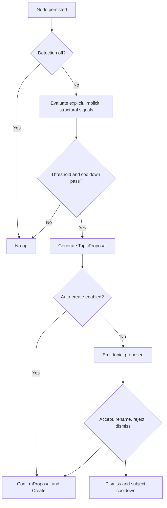

# SPEC-TM-02 — Auto-Topic Detection

> **Status:** Spec | **Blocks:** SPEC-TM-03, SPEC-TM-05, BE-04 (Topic Service), FE-03 (Topic UX)
> **References:** SPEC-TM-01, SPEC-DM-01, SPEC-API-01, SPEC-API-02, ARCHITECTURE.md §3

---

## 1. Purpose

Define Canopy's automatic topic-detection engine: the signals it observes, the thresholds it applies, the proposal and confirmation lifecycle, configuration, API wiring, user experience, errors, and verification scenarios. A Go worker reading this spec must implement deterministic detection orchestration around `TopicService`; a frontend worker must implement proposal cards, actions, state transitions, and SSE handling without clarifying questions.

Auto-detection identifies likely topic boundaries in the conversation DAG, but does not silently impose structure unless the tree configuration explicitly enables auto-creation. A topic remains the metadata overlay defined by SPEC-TM-01: its root is a node and its scope is the reachable branch below that node.

---

## 2. Design Decisions

| Decision | Choice | Rationale |
|----------|--------|-----------|
| Detection ownership | TopicService orchestrates signals; agent supplies semantic analysis | Keeps persistence and policy server-side while allowing model-aware interpretation |
| Signal classes | Explicit, implicit, and structural | Covers direct user intent, conversational drift, and DAG topology |
| Explicit threshold | One qualifying message | Direct requests are unambiguous and must feel instantaneous |
| Implicit threshold | 3–5 consecutive messages differing from the previous 10 | Avoids creating topics for one-off tangents while detecting sustained shifts |
| Structural threshold | Any new fork/branch with a new subject or agent subtask | A branch is an explicit graph boundary even when language is sparse |
| Default behavior | Always ask | Topic creation changes navigation and must be reviewable by the user |
| Auto-create | Only when `AutoCreate=true` and detection is not suppressed | Power users may prefer zero-friction organization |
| Proposal identity | UUIDv7 proposal ID, separate from topic ID | A dismissed or renamed proposal must remain auditable without creating a topic |
| Frequency limit | At most one proposal per 10 messages and at least 3 messages between proposals | Prevents notification spam and repetitive prompts |
| Rejection handling | Subject-specific cooldown; repeated matches become tentative | Respects user intent while retaining useful future detection |
| Title generation | Agent-generated from the first N messages, normalized to 1–200 characters | Produces readable titles while satisfying SPEC-TM-01 constraints |
| Configuration | Per-tree `DetectionConfig` | Different trees have different collaboration and automation expectations |
| Delivery | SSE `topic_proposed` and `topic_created`; commands use HTTP POST | Matches Canopy's existing transport model in SPEC-API-01 |
| Disabled mode | `off` produces no proposals and no auto-created topics | Configuration must be an absolute user-visible control |

---

## 3. Detection Signals

The engine evaluates all three signal classes for each newly persisted node. Signals are additive, but one event must produce at most one proposal. A signal result contains `type`, `confidence` in `[0,1]`, `rootNodeID`, `subjectKey`, and evidence.

### 3.1 Explicit Signal

Explicit detection is a lexical/intent match in the user's message. Matching is case-insensitive, permits punctuation and polite prefixes, and extracts the requested subject after the intent phrase.

```text
EXPLICIT_PATTERNS =
  /\b(make|turn|mark)\s+(this|that|it)\s+(into|as)\s+a\s+topic\b/i
  /\b(create|start|open|new)\s+(a\s+)?topic\b/i
  /\bnew\s+topic\s+(about|on|for)\s+(?<subject>.+)/i
```

The detector strips trailing punctuation, `#references`, and assistant-addressing prefixes. A bare “new topic” without a subject uses the current node as root and asks the agent to generate a title. Explicit detection has confidence `1.0`, threshold one message, and bypasses implicit minimum-message gating, but still obeys `off` and duplicate-topic checks.

### 3.2 Implicit Signal

Implicit detection compares the newest message window with the previous conversation window. The implementation MUST use embeddings when available and a keyword/entity/intent fallback when unavailable. Let `current` be the newest 3–5 consecutive messages and `previous` be the preceding 10 messages (or all available messages if fewer than 10).

A shift qualifies when:

```text
semantic_distance(current, previous) >= 0.70
AND subject_overlap(current, previous) <= 0.30
AND current_message_count >= max(3, config.MinMessagesPerTopic)
```

`semantic_distance` is cosine distance between normalized window centroids. `subject_overlap` is weighted overlap of entities, noun phrases, and intent labels. Code blocks are tokenized separately and compared by language, symbols, and file paths. The engine may emit a proposal at 3 messages with confidence >= 0.85, at 4 messages with confidence >= 0.75, or at 5 messages with confidence >= 0.65. A single message shift never qualifies implicitly.

### 3.3 Structural Signal

Structural detection fires when the graph records a new `fork` edge from an existing node, or when an agent-created node declares a new subtask/subject boundary. The new branch root is the target node. A structural event qualifies only if the branch has a subject-bearing node and is not already within an active topic rooted at that node. Confidence is `0.90` for a user fork and `0.80` for an agent subtask. Structural detection may use one node because the DAG itself supplies the boundary.

All signals are suppressed by `DetectionLevel=off`, by a duplicate active topic covering the candidate root, by the global frequency limits, and by a subject-specific cooldown after rejection.

---

## 4. Detection Algorithm

```text
onNodePersisted(node, context):
  config = TopicService.GetDetectionConfig(node.TreeID)
  if config.DetectionLevel == "off": return NoDetection
  if withinGlobalProposalLimit(context, config): return NoDetection

  signals = []
  explicit = detectExplicit(node.Content)
  if explicit: signals.append(explicit)

  if config.DetectionLevel == "full":
    implicit = detectImplicit(context, config)
    if implicit: signals.append(implicit)
    structural = detectStructural(node, context)
    if structural: signals.append(structural)
  else if config.DetectionLevel == "explicit_only":
    signals = explicit ? [explicit] : []

  candidate = highestConfidence(signals)
  if candidate == nil: return NoDetection
  if duplicateOrCovered(node, candidate): return NoDetection
  if subjectCooldownActive(node.TreeID, candidate.SubjectKey): return NoDetection

  proposal = generateProposal(node, context, candidate)
  if config.AutoCreate && !config.AlwaysAsk:
    return TopicService.ConfirmProposal(proposal.ID, proposal.Title)
  emit topic_proposed(proposal)
  return proposal

withinGlobalProposalLimit(context, config):
  return messagesSinceLastProposal(context) < max(3, config.MinMessagesPerTopic)
      OR messagesSinceAnyProposal(context) < max(10, config.ProposalCooldown)
```

`generateProposal` uses the first N messages beginning at the candidate root (N defaults to 3, capped at 5), asks the agent for a concise title and description, trims whitespace, rejects empty output, and records evidence without storing private embedding vectors in the event. Proposal persistence and creation are transactional; confirmation rechecks title uniqueness, root validity, and current configuration.



---

## 5. Agent Proposal Flow

1. The node is persisted and a detection event fires.
2. The agent generates a title from the first N messages of the candidate topic.
3. The service stores a pending proposal and emits `topic_proposed` with: proposal ID, tree ID, root node ID, title, description, detection type, confidence, evidence summary, and expiry.
4. The client shows: **“I think this is a new topic about [title] — create?”** with **Accept**, **Reject**, and **Name it differently**.
5. Accept calls `ConfirmProposal(proposalID, "")`; the service creates a topic with an auto-generated slug.
6. Rename collects a non-empty title and calls `ConfirmProposal(proposalID, titleOverride)`; slug generation follows SPEC-TM-01 §3.2.
7. Reject calls `DismissProposal`; no topic is created and the subject key enters cooldown.
8. Dismiss/ignore has the same persistence result as reject after timeout; the client may hide it immediately while the server expires it after N messages (default 5).
9. If the same pattern recurs inside cooldown, the agent does not show a normal proposal; after cooldown it may ask a tentative question with reduced confidence language.
10. `AutoCreate=true` creates directly after validation and emits `topic_created`; `AlwaysAsk=true` overrides auto-create.
11. User settings are `auto-create`, `always ask`, and `never detect`, represented by `DetectionConfig`.

---

## 6. User Interaction Model

The proposal is an inline, non-blocking card attached to the triggering node. It never steals focus, prevents sending, or changes the DAG before confirmation. The card displays title, one-line rationale, signal type, confidence band (not raw model probabilities), and the affected root node.

| Action | Client behavior | Server command |
|--------|-----------------|----------------|
| Accept | Replace card with “Topic created” confirmation and link to topic | `POST /v1/topic-proposals/{id}/confirm` |
| Name it differently | Inline title input, validation 1–200 chars, submit/cancel | Same confirm endpoint with `titleOverride` |
| Reject | Remove card and show optional “Won't suggest this subject for now” toast | `POST /v1/topic-proposals/{id}/dismiss` |
| Dismiss | Hide card; treated as reject after server timeout | Dismiss endpoint or expiry worker |
| Ignore | Card remains until next N messages, then expires silently | Server expiry marks dismissed |

Keyboard actions are Enter=Accept, Escape=Dismiss, and inline editing remains accessible by label. A proposal never appears when detection is `off`; stale cards are reconciled by proposal ID when SSE reconnects.

---

## 7. Integration Points

- **TopicService:** owns `AutoDetect`, proposal persistence, confirmation, dismissal, configuration, duplicate checks, and calls to `Create` from SPEC-TM-01.
- **Node persistence:** invokes detection after the node transaction commits, so a proposal never references an uncommitted node.
- **Edges/tree service:** fork events supply structural signals; topic scope uses reply/fork reachability from SPEC-TM-01 §3.4.
- **SSE:** publish `topic_proposed` on pending proposal creation and `topic_created` after successful creation. Events are ordered by node sequence and include `event_id` for replay.
- **CLI:** `canopyd topic detect --tree <uuid> --node <uuid>` previews a proposal; `canopyd topic proposals --tree <uuid>` lists pending proposals; CLI confirmation requires `--confirm` for creation.
- **Frontend store:** proposal cards live in the topic store, keyed by proposal UUID, and topic creation is applied to the Yjs map using SPEC-TM-01 §6.2.
- **Configuration storage:** per-tree settings are read through `GetDetectionConfig`; defaults are `AlwaysAsk=true`, `AutoCreate=false`, `DetectionLevel="full"`, `MinMessagesPerTopic=3`, `ProposalCooldown=10`.

---

## 8. API & Wiring

### 8.1 Go Types and Interfaces

```go
package topic

import (
    "context"
    "time"
    "github.com/google/uuid"
    "hermes-canopy/internal/db"
)

type DetectionConfig struct {
    AutoCreate          bool   `json:"auto_create"`
    AlwaysAsk           bool   `json:"always_ask"`
    DetectionLevel      string `json:"detection_level"` // off | explicit_only | full
    MinMessagesPerTopic int    `json:"min_messages_per_topic"`
    ProposalCooldown    int    `json:"proposal_cooldown"`
}

type DetectionType string
const (
    DetectionExplicit DetectionType = "explicit"
    DetectionImplicit DetectionType = "implicit"
    DetectionStructural DetectionType = "structural"
)

type TopicProposal struct {
    ID uuid.UUID `json:"id"`
    TreeID uuid.UUID `json:"treeId"`
    RootNodeID uuid.UUID `json:"rootNodeId"`
    Title string `json:"title"`
    Description string `json:"description"`
    DetectionType DetectionType `json:"detectionType"`
    Confidence float32 `json:"confidence"`
    SubjectKey string `json:"subjectKey"`
    Status string `json:"status"` // pending | confirmed | dismissed | expired
    ExpiresAt time.Time `json:"expiresAt"`
}

type TopicService interface {
    AutoDetect(ctx context.Context, node db.Node, contextNodes []db.Node) (*TopicProposal, error)
    ConfirmProposal(ctx context.Context, proposalID uuid.UUID, titleOverride string) (*db.Topic, error)
    DismissProposal(ctx context.Context, proposalID uuid.UUID) error
    GetDetectionConfig(ctx context.Context, treeID uuid.UUID) (DetectionConfig, error)
}
```

### 8.2 HTTP Handlers and Routes

```go
func (h *Handler) ConfirmTopicProposal(w http.ResponseWriter, r *http.Request)
func (h *Handler) DismissTopicProposal(w http.ResponseWriter, r *http.Request)
func (h *Handler) GetTopicDetectionConfig(w http.ResponseWriter, r *http.Request)
func (h *Handler) UpdateTopicDetectionConfig(w http.ResponseWriter, r *http.Request)
```

Routes are `POST /v1/topic-proposals/{proposalID}/confirm`, `POST /v1/topic-proposals/{proposalID}/dismiss`, `GET /v1/trees/{treeID}/topic-detection`, and `PUT /v1/trees/{treeID}/topic-detection`. Confirm accepts `{ "titleOverride": "" }`; all UUIDs and title lengths are validated before service calls. Wire routes in the HTTP router, node-commit hook, SSE broker, CLI command registry, and frontend API client.

### 8.3 SSE Payloads

```json
{"type":"topic_proposed","data":{"proposalId":"...","treeId":"...","rootNodeId":"...","title":"Database schema","detectionType":"implicit","confidence":0.82}}
{"type":"topic_created","data":{"proposalId":"...","topic":{"id":"...","title":"Database schema","slug":"database-schema"}}}
```

---

## 9. Error Handling

| Error Code | HTTP Status | Condition | Message |
|-----------|-------------|-----------|---------|
| `TOPIC_PROPOSAL_NOT_FOUND` | 404 | Proposal ID does not exist | "Topic proposal not found" |
| `TOPIC_PROPOSAL_EXPIRED` | 409 | Proposal timed out | "Topic proposal has expired" |
| `TOPIC_PROPOSAL_ALREADY_RESOLVED` | 409 | Confirm/dismiss after resolution | "Topic proposal is already resolved" |
| `TOPIC_DETECTION_DISABLED` | 409 | Detection is off | "Topic detection is disabled for this tree" |
| `TOPIC_DETECTION_INVALID_LEVEL` | 400 | Unknown detection level | "Detection level must be off, explicit_only, or full" |
| `TOPIC_DETECTION_INVALID_CONFIG` | 400 | Negative/unsafe thresholds | "Invalid topic detection configuration" |
| `TOPIC_DETECTION_COOLDOWN` | 409 | Subject is in rejection cooldown | "Topic detection is cooling down for this subject" |
| `TOPIC_DETECTION_RATE_LIMITED` | 429 | Frequency limit reached | "Topic proposal rate limit reached" |
| `TOPIC_PROPOSAL_TITLE_REQUIRED` | 400 | Generated/override title empty | "Topic proposal title is required" |
| `TOPIC_PROPOSAL_TITLE_TOO_LONG` | 400 | Title exceeds 200 characters | "Topic proposal title must be 1-200 characters" |
| `TOPIC_PROPOSAL_ROOT_INVALID` | 400 | Root node missing/deleted/not in tree | "Topic proposal root node is invalid" |
| `TOPIC_PROPOSAL_DUPLICATE` | 409 | Existing topic covers candidate | "An existing topic already covers this node" |
| `TOPIC_PROPOSAL_CREATE_FAILED` | 500 | Transaction failed during confirmation | "Unable to create topic from proposal" |
| `TOPIC_DETECTION_ANALYSIS_UNAVAILABLE` | 503 | Embedding/agent analysis unavailable and fallback cannot classify | "Topic detection analysis is temporarily unavailable" |
| `TOPIC_DETECTION_UNAUTHORIZED` | 403 | Caller cannot configure or resolve tree proposals | "Insufficient permission for topic detection" |
| `TOPIC_PROPOSAL_CONFLICT` | 409 | Concurrent resolution changed proposal | "Topic proposal was modified concurrently" |
| `TOPIC_PROPOSAL_EVENT_FAILED` | 500 | Topic committed but event publication failed | "Topic created; event delivery will be retried" |
| `TOPIC_DETECTION_CONTEXT_TOO_LARGE` | 413 | Analysis window exceeds configured budget | "Detection context is too large" |
| `TOPIC_DETECTION_INVALID_NODE` | 400 | Node is malformed or not persisted | "Cannot detect a topic for this node" |

Topic creation remains authoritative: if persistence succeeds but SSE publication fails, the transaction is not rolled back; the outbox retries `topic_created`.

---

## 10. Edge Cases

| Case | Expected Behavior |
|------|-------------------|
| One message then subject switch | No implicit proposal; wait for the minimum consecutive-message threshold. |
| Multiple simultaneous shifts | Score candidates independently, choose the highest-confidence contiguous branch, and emit at most one proposal. |
| Manual topic already created | Recheck coverage/title immediately before proposing; suppress duplicate. |
| Proposal ignored | Expire after N messages (default 5), mark dismissed, and do not show a stale card. |
| Detection during topic creation | Serialize by proposal/root lock; the manual creation wins and auto-proposal is dismissed. |
| Non-English text | Use multilingual embeddings and language-aware tokenization; if unavailable, skip implicit detection rather than guess. |
| One- or two-word messages | Exclude from semantic windows unless explicit or structural evidence exists. |
| Code output | Compare code tokens separately; do not classify a changed stack trace as a new human topic without sustained evidence. |
| Detection set to off | Suppress analysis, proposals, and auto-creation, including explicit requests; normal manual creation remains available. |
| Explicit request with no title | Generate a title from the current node/context and show it for confirmation. |
| Rapid-fire messages on different subjects | Maintain separate subject clusters; enforce global proposal limits and select the strongest cluster. |
| Agent proposes then user sends more messages | Proposal remains attached to its root; later messages do not mutate its title. |
| User rejects similar proposal | Store subject-key cooldown; repeated detection is silent/tentative until cooldown expires. |
| Rename collides with existing title | Return `TOPIC_ALREADY_EXISTS`/`TOPIC_SLUG_CONFLICT`; keep proposal pending for correction. |
| Root node deleted before confirmation | Confirmation returns `TOPIC_PROPOSAL_ROOT_INVALID`; proposal is expired. |
| Concurrent accept clicks | Idempotently return the same created topic; never create two topics. |
| SSE reconnect | Replay unresolved proposal and creation events by event ID; client de-duplicates by proposal/topic ID. |
| Tree archived or deleted | Do not detect new topics; pending proposals expire and are not auto-created. |
| Empty embedding response | Use keyword/entity/intent fallback; if fallback confidence is below threshold, no proposal. |
| Existing topic is archived | A new active topic may be proposed only if policy permits and no active topic covers the root; never mutate archived metadata silently. |
| Very long context | Analyze bounded windows only; return `TOPIC_DETECTION_CONTEXT_TOO_LARGE` only when configured limits cannot be met. |
| Unusual punctuation or Unicode | Normalize for explicit matching while preserving original content and title text. |

---

## 11. Testing

### 11.1 Backend Test Scenarios

| # | Scenario | Setup | Expected |
|---|----------|-------|----------|
| 1 | Explicit “make this a topic” | One user message with phrase | Explicit proposal, confidence 1.0. |
| 2 | Explicit “create topic about X” | Message includes subject | Extracted subject seeds title generation. |
| 3 | Explicit request without subject | “Create a topic” | Proposal generated from current context. |
| 4 | Explicit case/punctuation variants | Mixed case and punctuation | All supported forms match. |
| 5 | Implicit three-message shift | Three distinct subject messages, distance >= .70 | Proposal at confidence >= .85. |
| 6 | Implicit two-message shift | Only two new messages | No proposal. |
| 7 | Implicit five-message weak shift | Five messages, confidence >= .65 | Proposal created. |
| 8 | Stable conversation | Similar current/previous windows | No proposal. |
| 9 | Structural user fork | New fork with subject-bearing node | Structural proposal rooted at target. |
| 10 | Structural empty fork | Fork without subject-bearing content | No proposal until subject exists. |
| 11 | Highest signal wins | Explicit and implicit signals together | One explicit proposal. |
| 12 | Detection off | Config level off | No analysis, proposal, or creation. |
| 13 | Explicit-only mode | Implicit shift and explicit request separately | Only explicit request proposes. |
| 14 | Auto-create | AutoCreate true, AlwaysAsk false | Topic created and `topic_created` emitted. |
| 15 | Always ask override | Both flags true | Proposal emitted; no topic before confirmation. |
| 16 | Accept proposal | Pending proposal confirmed | Topic created with generated slug. |
| 17 | Rename proposal | Confirmation with title override | Topic uses override and generated slug. |
| 18 | Reject proposal | Dismiss pending proposal | No topic; subject cooldown recorded. |
| 19 | Expired proposal | Advance N messages | Proposal expired and cannot confirm. |
| 20 | Global frequency limit | Proposals inside 10-message window | Rate-limited/suppressed. |
| 21 | Minimum spacing | Proposals three messages apart | First allowed; earlier second suppressed. |
| 22 | Duplicate existing topic | Candidate root already covered | No proposal / duplicate error on race. |
| 23 | Rename title conflict | Existing same title | `TOPIC_ALREADY_EXISTS`, proposal remains pending. |
| 24 | Deleted root confirmation | Delete root before accept | `TOPIC_PROPOSAL_ROOT_INVALID`. |
| 25 | Concurrent accepts | Two confirms for same proposal | One topic; both responses idempotent. |
| 26 | Multilingual fallback | Non-English messages without multilingual model | Fallback or safe no-op, never false positive. |
| 27 | Code-window analysis | Stack traces and code blocks | Code-aware comparison; no spurious topic. |
| 28 | SSE outbox retry | Create succeeds, publish fails | Retry emits exactly one eventual event. |

### 11.2 Frontend Test Scenarios

| # | Scenario | Expected |
|---|----------|----------|
| 1 | Render `topic_proposed` | Inline proposal card appears at triggering node. |
| 2 | Accept action | Card becomes confirmation and topic link appears. |
| 3 | Rename action | Inline input validates and submits override. |
| 4 | Reject action | Card disappears and no topic is inserted. |
| 5 | Dismiss action | Card hides without focus loss. |
| 6 | Ignore timeout | Expired card is removed after reconciliation. |
| 7 | Detection off setting | No proposal UI is rendered. |
| 8 | SSE reconnect | Pending card rehydrates once, without duplicates. |
| 9 | Topic-created event | Yjs topic map/sidebar updates. |
| 10 | Keyboard controls | Enter accepts, Escape dismisses, input remains accessible. |
| 11 | Long title validation | Error shown at >200 characters; submit disabled. |
| 12 | Concurrent resolution | Stale card resolves to server's topic state. |

---

## 12. Hilo Impact

### What depends on this component:
- SPEC-TM-03 (Topic Search & One-Button Context) — indexes topics created by proposals
- SPEC-TM-05 (Topic Lifecycle & Sidebar) — displays created topics and proposal state
- FE-03 (Topic UX) — renders proposal cards and settings
- BE-04 (Topic Service) — implements detection, proposal persistence, and confirmation
- AGENT-02 (Context Compiler) — supplies bounded node context and semantic analysis
- CLI-02 (Canopy CLI) — exposes detection preview and configuration commands

### What this component depends on:
- SPEC-TM-01 (Topic Data Model) — `TopicCreateInput`, `TopicService.Create`, scope, slug, and lifecycle
- SPEC-DM-01 (Tree Node & Edge DDL) — persisted nodes and fork/reply edges
- SPEC-API-01 (SSE Event Stream) — proposal and creation event delivery
- SPEC-API-02 (Tree CRUD Endpoints) — tree membership and lifecycle
- ARCHITECTURE.md §3 — topic-as-branch semantics

---

## 13. Future Considerations (Post-MVP)

These are noted but NOT spec'd for MVP implementation:

1. Learned per-user thresholds from accept/reject history.
2. Cross-language subject clustering with translated proposal previews.
3. Batch review of several low-confidence proposals.
4. Topic auto-merging and overlap visualization.
5. Federated or multi-agent detection with signed evidence.
6. User-defined regex and domain vocabulary packs.
7. Privacy-preserving local embeddings and configurable retention of analysis features.
8. Topic templates inferred from recurring structural patterns.
9. Proposal analytics: precision, recall, acceptance latency, and dismissal reasons.
10. Offline proposal queue synchronized through the local replica.
11. Human-in-the-loop moderation for shared multi-user trees.
12. Explainable semantic evidence rendered as highlighted message spans.

