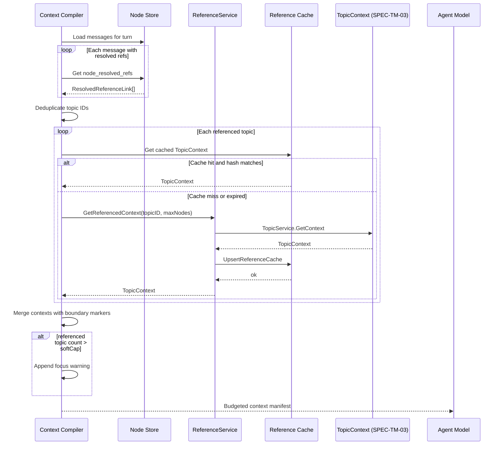
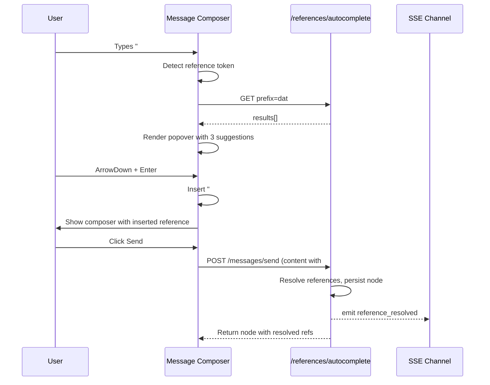

# SPEC-TM-04 — #Reference Resolution

> **Status:** Spec | **Blocks:** BE-06 (Reference Service), FE-07 (Reference Autocomplete & Rendering), AGENT-02 (Context Compiler), SPEC-TM-05 (Topic Lifecycle & Sidebar)
> **References:** SPEC-TM-01, SPEC-TM-02, SPEC-TM-03, SPEC-DM-01, SPEC-API-01, SPEC-API-02, ARCHITECTURE.md §3, ARCHITECTURE.md §5

---

## 1. Purpose

Define Canopy's `#topic-slug` reference resolution system: how `#references` are parsed from message content, completed while typing, resolved at send time, converted into internal reference links, and injected into the agent's context window when encountered. This spec targets both the Go worker implementing the reference service, repository layer, API handlers, and SSE broker, and the TypeScript worker implementing the autocomplete popover, reference rendering, and client-side send-time resolution UX.

A `#reference` is a lightweight, human-readable pointer to a topic branch. It lives inside message text as plain text (`#database-schema`) and is resolved by the server when the message is sent. Once resolved, the message stored in the DAG contains an internal reference link; the original `#slug` is preserved in the raw text only for display and editing. The context compiler treats resolved references as explicit inclusion directives: when a message containing references is part of the current turn's context, the compiler fetches each referenced topic's tree and adds it to the context window, subject to budget rules and escalation when too many references are present.

This spec depends on the topic data model from SPEC-TM-01, the detection and proposal flow from SPEC-TM-02, and the search/injection pipeline from SPEC-TM-03. It extends the Context Compiler described in ARCHITECTURE.md §5 with reference-aware inclusion logic.

---

## 2. Design Decisions

| Decision | Choice | Rationale |
|----------|--------|-----------|
| Reference format | `#topic-slug` where slug matches `[a-z][a-z0-9-]*[a-z0-9]` or single-letter `[a-z]` | Already defined in SPEC-TM-01 §5.3; human-readable, URL-safe, easy to type, unambiguous with hashtags and markdown headers |
| Parse location | Both client (for autocomplete) and server (for authoritative resolution) | Client parses for responsiveness; server re-parses to enforce canonical rules and prevent spoofing |
| Resolution timing | At send time, before the node is persisted | Guarantees every persisted message has a deterministic, resolved reference link; avoids stale references in the DAG |
| Storage of resolved refs | `node.resolved_refs` JSONB array + `node_resolved_refs` join table | JSONB for fast read during context compilation; join table for queryable analytics and cascade integrity |
| Reference link format | Internal `ref://topic/<topic-id>` URI stored in `content.references` | Stable across slug/title changes; supports future reference types (cards, messages, files) |
| Auto-complete data source | PostgreSQL prefix search on `topics.slug` + `topics.title` FTS | Single source of truth; no extra index needed beyond existing GIN indexes from SPEC-TM-01 and SPEC-TM-03 |
| Auto-complete trigger | `#` followed by `[a-z]` or digit/hyphen in editable message composer | Detected via contenteditable input events; debounced at 80ms |
| Auto-complete selection | Click, Enter, or Tab inserts the full `#slug` at cursor; server resolves at send | Keeps composer text plain and editable; avoids locking the user into a server-validated topic before typing continues |
| Agent-side fetch | Context compiler fetches referenced topic trees at turn assembly time | References are promises evaluated lazily; avoids pre-fetching all referenced topics on every message send |
| Multiple references | Each reference adds its topic context; merged with `--- topic boundary: <slug> ---` markers | Reuses SPEC-TM-03 multi-topic boundary markers for consistency |
| Too many references | Soft cap at 5 references per message; hard cap at 10; agent warns when over soft cap | Prevents reference spam from exploding the context window; allows power users to exceed with explicit warning |
| Reference cache | `reference_resolution_cache` table with TTL (24h) | Avoids repeated recursive CTE traversal for frequently referenced topics; cache invalidated on node changes within topic scope |
| Escalation | Warning is appended to the agent's context manifest, not a blocking error | The agent can still proceed but is told the context is becoming unfocused |
| SSE events | `reference_resolved`, `reference_not_found`, `references_too_many` | Keeps client and other subscribers informed of resolution outcomes per message |

---

## 3. PostgreSQL DDL

### 3.1 Node Resolved References Table

```sql
-- 000040_node_resolved_refs.up.sql

-- Stores the authoritative mapping from a node to the topics it references.
-- One row per (node, topic) pair. Supports cascade delete and fast lookups.
CREATE TABLE node_resolved_refs (
    id              uuid        PRIMARY KEY DEFAULT uuidv7(),
    node_id         uuid        NOT NULL,
    tree_id         uuid        NOT NULL,
    topic_id        uuid        NOT NULL,
    raw_ref         text        NOT NULL,    -- Original #slug text (e.g., "#database-schema")
    slug            text        NOT NULL,    -- Normalized slug
    resolved_at     timestamptz NOT NULL DEFAULT clock_timestamp(),
    resolved_by     uuid        NOT NULL REFERENCES profiles(id) ON DELETE SET NULL,
    -- The context hash of the topic at the time of resolution, used for cache coherency
    context_hash    text        NOT NULL DEFAULT '',
    CONSTRAINT fk_nrr_node
        FOREIGN KEY (node_id, tree_id) REFERENCES nodes(id, tree_id)
        ON DELETE CASCADE,
    CONSTRAINT fk_nrr_topic
        FOREIGN KEY (topic_id) REFERENCES topics(id)
        ON DELETE CASCADE,
    CONSTRAINT uq_nrr_node_topic
        UNIQUE (node_id, topic_id),
    CONSTRAINT chk_nrr_slug_format
        CHECK (slug ~ '^[a-z]([a-z0-9-]*[a-z0-9])?$')
);

CREATE INDEX idx_nrr_node_id         ON node_resolved_refs(node_id);
CREATE INDEX idx_nrr_tree_id         ON node_resolved_refs(tree_id);
CREATE INDEX idx_nrr_topic_id        ON node_resolved_refs(topic_id);
CREATE INDEX idx_nrr_resolved_at     ON node_resolved_refs(tree_id, resolved_at DESC);
CREATE INDEX idx_nrr_slug            ON node_resolved_refs(tree_id, slug);
```

### 3.2 Reference Resolution Cache Table

```sql
-- 000041_reference_resolution_cache.up.sql

-- Caches compiled TopicContext payloads for referenced topics.
-- Invalidated when nodes inside the topic scope change.
CREATE TABLE reference_resolution_cache (
    id              uuid        PRIMARY KEY DEFAULT uuidv7(),
    topic_id        uuid        NOT NULL UNIQUE,
    tree_id         uuid        NOT NULL,
    context_hash    text        NOT NULL,
    node_count      integer     NOT NULL,
    -- JSONB payload mirrors the TopicContext structure returned by TopicService.GetContext
    payload         jsonb       NOT NULL,
    created_at      timestamptz NOT NULL DEFAULT clock_timestamp(),
    expires_at      timestamptz NOT NULL DEFAULT clock_timestamp() + interval '24 hours',
    hit_count       integer     NOT NULL DEFAULT 0,
    CONSTRAINT fk_rrc_topic
        FOREIGN KEY (topic_id) REFERENCES topics(id)
        ON DELETE CASCADE,
    CONSTRAINT fk_rrc_tree
        FOREIGN KEY (tree_id) REFERENCES trees(id)
        ON DELETE CASCADE
);

CREATE INDEX idx_rrc_tree_id        ON reference_resolution_cache(tree_id);
CREATE INDEX idx_rrc_expires_at     ON reference_resolution_cache(expires_at);
CREATE INDEX idx_rrc_topic_lookup   ON reference_resolution_cache(topic_id, context_hash);
```

### 3.3 Reference Log Table

```sql
-- 000042_reference_log.up.sql

-- Analytics and audit log for every reference resolution attempt.
CREATE TABLE reference_resolution_log (
    id              uuid        PRIMARY KEY DEFAULT uuidv7(),
    tree_id         uuid        NOT NULL,
    node_id         uuid        REFERENCES nodes(id) ON DELETE SET NULL,
    profile_id      uuid        NOT NULL REFERENCES profiles(id) ON DELETE SET NULL,
    raw_ref         text        NOT NULL,
    slug            text        NOT NULL,
    topic_id        uuid        REFERENCES topics(id) ON DELETE SET NULL,
    status          text        NOT NULL,    -- 'resolved' | 'not_found' | 'ambiguous' | 'too_many' | 'error'
    error_code      text,                    -- Optional error code when status != 'resolved'
    duration_ms     integer     NOT NULL DEFAULT 0,
    created_at      timestamptz NOT NULL DEFAULT clock_timestamp()
);

CREATE INDEX idx_rrl_tree_created   ON reference_resolution_log(tree_id, created_at DESC);
CREATE INDEX idx_rrl_node           ON reference_resolution_log(node_id);
CREATE INDEX idx_rrl_profile        ON reference_resolution_log(profile_id);
CREATE INDEX idx_rrl_status         ON reference_resolution_log(status);
CREATE INDEX idx_rrl_slug             ON reference_resolution_log(tree_id, slug);
```

### 3.4 Reference Cache Invalidation Trigger

```sql
-- When a node is inserted, updated, or soft-deleted inside a topic scope,
-- invalidate the cached TopicContext for all topics that contain that node.
CREATE OR REPLACE FUNCTION invalidate_reference_cache_for_node() RETURNS trigger AS $$
DECLARE
    affected_topic_ids uuid[];
BEGIN
    SELECT array_agg(DISTINCT tmn.topic_id) INTO affected_topic_ids
    FROM topic_member_nodes tmn
    WHERE tmn.node_id = COALESCE(NEW.id, OLD.id);

    IF affected_topic_ids IS NOT NULL THEN
        DELETE FROM reference_resolution_cache
        WHERE topic_id = ANY(affected_topic_ids);
    END IF;

    RETURN COALESCE(NEW, OLD);
END;
$$ LANGUAGE plpgsql;

CREATE TRIGGER trg_invalidate_reference_cache_node_insert
    AFTER INSERT ON nodes
    FOR EACH ROW
    EXECUTE FUNCTION invalidate_reference_cache_for_node();

CREATE TRIGGER trg_invalidate_reference_cache_node_update
    AFTER UPDATE OF content, deleted_at ON nodes
    FOR EACH ROW
    WHEN (OLD.content IS DISTINCT FROM NEW.content OR OLD.deleted_at IS DISTINCT FROM NEW.deleted_at)
    EXECUTE FUNCTION invalidate_reference_cache_for_node();
```

### 3.5 Topic Reference Count Column

```sql
-- Add a denormalized reference count to topics for fast UI badges and analytics.
ALTER TABLE topics
    ADD COLUMN IF NOT EXISTS ref_count integer NOT NULL DEFAULT 0;

-- Update ref_count whenever a node resolved reference is added or removed.
CREATE OR REPLACE FUNCTION update_topic_ref_count() RETURNS trigger AS $$
BEGIN
    IF TG_OP = 'INSERT' THEN
        UPDATE topics SET ref_count = ref_count + 1 WHERE id = NEW.topic_id;
    ELSIF TG_OP = 'DELETE' THEN
        UPDATE topics SET ref_count = GREATEST(ref_count - 1, 0) WHERE id = OLD.topic_id;
    ELSIF TG_OP = 'UPDATE' AND OLD.topic_id IS DISTINCT FROM NEW.topic_id THEN
        UPDATE topics SET ref_count = GREATEST(ref_count - 1, 0) WHERE id = OLD.topic_id;
        UPDATE topics SET ref_count = ref_count + 1 WHERE id = NEW.topic_id;
    END IF;

    RETURN COALESCE(NEW, OLD);
END;
$$ LANGUAGE plpgsql;

CREATE TRIGGER trg_update_topic_ref_count
    AFTER INSERT OR DELETE OR UPDATE OF topic_id ON node_resolved_refs
    FOR EACH ROW
    EXECUTE FUNCTION update_topic_ref_count();
```

### 3.6 Node Resolved Reference Count Column

```sql
-- Add a denormalized count of resolved references on the node row for fast checks.
ALTER TABLE nodes
    ADD COLUMN IF NOT EXISTS resolved_ref_count integer NOT NULL DEFAULT 0;

CREATE OR REPLACE FUNCTION update_node_resolved_ref_count() RETURNS trigger AS $$
BEGIN
    IF TG_OP = 'INSERT' THEN
        UPDATE nodes SET resolved_ref_count = resolved_ref_count + 1 WHERE id = NEW.node_id;
    ELSIF TG_OP = 'DELETE' THEN
        UPDATE nodes SET resolved_ref_count = GREATEST(resolved_ref_count - 1, 0) WHERE id = OLD.node_id;
    END IF;

    RETURN COALESCE(NEW, OLD);
END;
$$ LANGUAGE plpgsql;

CREATE TRIGGER trg_update_node_resolved_ref_count
    AFTER INSERT OR DELETE ON node_resolved_refs
    FOR EACH ROW
    EXECUTE FUNCTION update_node_resolved_ref_count();
```

---

## 4. Go Interfaces

### 4.1 Package Layout

```
internal/
├── reference/
│   ├── service.go             # ReferenceService interface + impl
│   ├── service_test.go        # Tests
│   ├── parser.go                # ParseReferences, canonical slug validation
│   └── parser_test.go
├── db/
│   ├── reference_repo.go      # ReferenceRepo interface + pgx implementation
│   └── reference_cache_repo.go
```

### 4.2 Go Structs

```go
package reference

import (
    "context"
    "time"
    "github.com/google/uuid"
    "hermes-canopy/internal/db"
)

// ParsedReference is a single #reference found in message content.
// Matches the TypeScript ParsedReference from SPEC-TM-01 §5.1.
type ParsedReference struct {
    Raw    string `json:"raw"`    // Full match: "#topic-slug"
    Slug   string `json:"slug"`   // Extracted slug: "topic-slug"
    Offset int    `json:"offset"` // Character offset in message content
    Length int    `json:"length"` // Length of matched text
}

// ResolvedReference pairs a parsed reference with its resolved topic and optional context.
// Matches the TypeScript ResolvedReference from SPEC-TM-01 §5.1.
type ResolvedReference struct {
    Reference ParsedReference      `json:"reference"`
    Topic     db.TopicSummary      `json:"topic"`
    Context   *db.TopicContext     `json:"context,omitempty"`
}

// ReferenceResolutionResult is the outcome of resolving all references in a message.
type ReferenceResolutionResult struct {
    NodeID            uuid.UUID           `json:"node_id"`
    TreeID            uuid.UUID           `json:"tree_id"`
    References        []ResolvedReference `json:"references"`
    NotFound          []ParsedReference   `json:"not_found,omitempty"`
    TooMany           bool                `json:"too_many"`
    Warning           string              `json:"warning,omitempty"`
    TotalNodesInScope int                 `json:"total_nodes_in_scope"`
}

// ReferenceAutocompleteResult is a single auto-complete suggestion.
type ReferenceAutocompleteResult struct {
    Slug      string  `json:"slug"`
    Title     string  `json:"title"`
    MatchType string  `json:"match_type"` // "prefix" | "contains" | "fuzzy"
    Status    string  `json:"status"`
    NodeCount int32   `json:"node_count"`
}

// ReferenceAutocompleteRequest is the payload for the autocomplete endpoint.
type ReferenceAutocompleteRequest struct {
    TreeID  uuid.UUID `json:"tree_id" validate:"required"`
    Prefix  string    `json:"prefix" validate:"required,min=1,max=100"`
    Limit   int       `json:"limit" validate:"min=1,max=20"`
    Include string    `json:"include"` // "active" | "archived" | "all"; default "active"
}

// ResolveReferencesRequest is the payload for the resolve endpoint.
type ResolveReferencesRequest struct {
    TreeID     uuid.UUID `json:"tree_id" validate:"required"`
    Content    string    `json:"content" validate:"max=50000"`
    MaxNodes   int       `json:"max_nodes"`    // Per-topic max, default 500
    WithContext bool     `json:"with_context"` // If true, include TopicContext payloads
}

// InjectWithReferencesRequest extends SPEC-TM-03 InjectContextRequest with references.
type InjectWithReferencesRequest struct {
    TopicIDs   []uuid.UUID `json:"topic_ids" validate:"max=5"`
    References []string    `json:"references" validate:"max=10"` // Raw #slug strings from message content
    MaxNodes   int         `json:"max_nodes"`                    // Per-topic max, default 500
}

// ReferenceCacheEntry is a cached TopicContext payload for a topic.
type ReferenceCacheEntry struct {
    ID           uuid.UUID       `db:"id"`
    TopicID      uuid.UUID       `db:"topic_id"`
    TreeID       uuid.UUID       `db:"tree_id"`
    ContextHash  string          `db:"context_hash"`
    NodeCount    int             `db:"node_count"`
    Payload      json.RawMessage `db:"payload"`
    CreatedAt    time.Time       `db:"created_at"`
    ExpiresAt    time.Time       `db:"expires_at"`
    HitCount     int             `db:"hit_count"`
}

// ReferenceLogEntry is a row in reference_resolution_log.
type ReferenceLogEntry struct {
    ID         uuid.UUID  `db:"id"`
    TreeID     uuid.UUID  `db:"tree_id"`
    NodeID     *uuid.UUID `db:"node_id"`
    ProfileID  uuid.UUID  `db:"profile_id"`
    RawRef     string     `db:"raw_ref"`
    Slug       string     `db:"slug"`
    TopicID    *uuid.UUID `db:"topic_id"`
    Status     string     `db:"status"`
    ErrorCode  *string    `db:"error_code"`
    DurationMs int        `db:"duration_ms"`
    CreatedAt  time.Time  `db:"created_at"`
}
```

### 4.3 ReferenceService Interface

```go
package reference

import (
    "context"
    "github.com/google/uuid"
    "hermes-canopy/internal/db"
)

// ReferenceService resolves #topic-slug references, provides autocomplete,
// and injects referenced topics into the agent context window.
type ReferenceService interface {
    // ParseReferences extracts all #topic-slug references from content.
    // Uses the canonical regex from SPEC-TM-01 §5.3.
    ParseReferences(ctx context.Context, content string) ([]ParsedReference, error)

    // Autocomplete returns topic suggestions for a partial slug prefix.
    // Searches active topics by default; archived topics included when requested.
    Autocomplete(ctx context.Context, req ReferenceAutocompleteRequest) ([]ReferenceAutocompleteResult, error)

    // ResolveReferences parses and resolves all references in message content.
    // Returns resolved topics, not-found slugs, and warnings about reference count.
    // Does NOT persist anything; callers use ResolveAtSend for persistence.
    ResolveReferences(ctx context.Context, req ResolveReferencesRequest) (*ReferenceResolutionResult, error)

    // ResolveAtSend resolves references for a message being sent and persists
    // the resolved topic links on the node. Called by the message send handler
    // before the node is persisted. See SPEC-API-01 for send-time ordering.
    ResolveAtSend(ctx context.Context, treeID uuid.UUID, nodeID uuid.UUID, content string, requesterID uuid.UUID) (*ReferenceResolutionResult, error)

    // GetReferencedContext returns the TopicContext for each resolved reference.
    // Used by the context compiler (AGENT-02) when assembling an agent turn.
    GetReferencedContext(ctx context.Context, refs []db.ResolvedReferenceLink, maxNodes int) ([]db.TopicContext, error)

    // InjectWithReferences merges explicitly requested topic IDs with references
    // extracted from message content and returns a MultiTopicContext.
    InjectWithReferences(ctx context.Context, treeID uuid.UUID, req InjectWithReferencesRequest, requesterID uuid.UUID) (*db.MultiTopicContext, error)

    // GetCache returns a cached TopicContext if present and not expired.
    GetCache(ctx context.Context, topicID uuid.UUID, contextHash string) (*db.TopicContext, error)

    // RefreshCache rebuilds the cached TopicContext for a topic.
    RefreshCache(ctx context.Context, topicID uuid.UUID) (*db.TopicContext, error)

    // LogReferenceResolution records a resolution attempt for analytics/audit.
    LogReferenceResolution(ctx context.Context, entry ReferenceLogEntry) error
}
```

### 4.4 ReferenceRepo Interface

```go
package db

import (
    "context"
    "github.com/google/uuid"
)

// ResolvedReferenceLink is the stored link between a node and a topic.
type ResolvedReferenceLink struct {
    ID           uuid.UUID  `db:"id"`
    NodeID       uuid.UUID  `db:"node_id"`
    TreeID       uuid.UUID  `db:"tree_id"`
    TopicID      uuid.UUID  `db:"topic_id"`
    RawRef       string     `db:"raw_ref"`
    Slug         string     `db:"slug"`
    ResolvedAt   time.Time  `db:"resolved_at"`
    ResolvedBy   uuid.UUID  `db:"resolved_by"`
    ContextHash  string     `db:"context_hash"`
}

// ReferenceRepo handles persistence and queries for resolved references.
type ReferenceRepo interface {
    // InsertResolvedRef persists a single resolved reference link.
    InsertResolvedRef(ctx context.Context, link ResolvedReferenceLink) (*ResolvedReferenceLink, error)

    // InsertResolvedRefs persists multiple resolved reference links in one transaction.
    InsertResolvedRefs(ctx context.Context, links []ResolvedReferenceLink) error

    // GetResolvedRefsForNode returns all resolved references for a node.
    GetResolvedRefsForNode(ctx context.Context, nodeID uuid.UUID) ([]ResolvedReferenceLink, error)

    // DeleteResolvedRefsForNode removes all resolved references for a node.
    DeleteResolvedRefsForNode(ctx context.Context, nodeID uuid.UUID) error

    // GetNodesReferencingTopic returns all nodes that reference a given topic.
    GetNodesReferencingTopic(ctx context.Context, topicID uuid.UUID, limit, offset int) ([]ResolvedReferenceLink, error)

    // GetTopicReferenceCount returns the number of nodes referencing a topic.
    GetTopicReferenceCount(ctx context.Context, topicID uuid.UUID) (int, error)

    // AutocompleteTopics returns topic suggestions by slug prefix.
    AutocompleteTopics(ctx context.Context, treeID uuid.UUID, prefix string, include string, limit int) ([]TopicSummary, error)

    // GetTopicBySlug returns a topic by tree_id + slug. Used for resolution.
    GetTopicBySlug(ctx context.Context, treeID uuid.UUID, slug string) (*Topic, error)

    // UpsertReferenceCache stores or refreshes a cached TopicContext.
    UpsertReferenceCache(ctx context.Context, topicID, treeID uuid.UUID, contextHash string, nodeCount int, payload json.RawMessage) error

    // GetReferenceCache returns a cached TopicContext if present and not expired.
    GetReferenceCache(ctx context.Context, topicID uuid.UUID) (*ReferenceCacheEntry, error)

    // DeleteReferenceCache invalidates the cache for a topic.
    DeleteReferenceCache(ctx context.Context, topicID uuid.UUID) error

    // InsertReferenceLog records a resolution attempt.
    InsertReferenceLog(ctx context.Context, entry reference.ReferenceLogEntry) error
}
```

### 4.5 TopicContext Extension for References

The `TopicContext` struct from SPEC-TM-01 §4.4 and SPEC-TM-03 §4.2 is reused unchanged. The `ReferenceService` populates it via `TopicService.GetContext` and then caches it. `MultiTopicContext` is also reused from SPEC-TM-03 §4.2.

```go
package db

// ResolvedReferenceLink is embedded in the Node content for rendering.
type NodeContentReferences struct {
    Type        string    `json:"type"`        // "topic"
    TopicID     uuid.UUID `json:"topicId"`
    Slug        string    `json:"slug"`
    Title       string    `json:"title"`
    NodeCount   int       `json:"nodeCount"`
    ContextHash string    `json:"contextHash"`
}
```

---

## 5. TypeScript Types & Zod Validation

### 5.1 TypeScript Interfaces

```typescript
// src/types/reference.ts

import { z } from 'zod';
import type { Topic, TopicSummary, TopicContext, MultiTopicContext } from './topic';

// ── Parsed / Resolved References ──────────────────────────────────────

export interface ParsedReference {
  raw: string;      // Full match: "#topic-slug"
  slug: string;     // Extracted slug: "topic-slug"
  offset: number;   // Character offset in message
  length: number;   // Length of matched text
}

export interface ResolvedReference {
  reference: ParsedReference;
  topic: TopicSummary;
  context: TopicContext | null;
}

export interface ReferenceResolutionResult {
  nodeId: string;
  treeId: string;
  references: ResolvedReference[];
  notFound?: ParsedReference[];
  tooMany: boolean;
  warning?: string;
  totalNodesInScope: number;
}

// ── Autocomplete ───────────────────────────────────────────────────────

export type ReferenceMatchType = 'prefix' | 'contains' | 'fuzzy';

export interface ReferenceAutocompleteResult {
  slug: string;
  title: string;
  matchType: ReferenceMatchType;
  status: 'active' | 'archived' | 'deleted';
  nodeCount: number;
}

export interface ReferenceAutocompleteRequest {
  treeId: string;
  prefix: string;
  limit?: number;
  include?: 'active' | 'archived' | 'all';
}

// ── API Requests ───────────────────────────────────────────────────────

export interface ResolveReferencesRequest {
  treeId: string;
  content: string;
  maxNodes?: number;
  withContext?: boolean;
}

export interface InjectWithReferencesRequest {
  topicIds?: string[];
  references?: string[];   // Raw #slug strings from message content
  maxNodes?: number;
}

export interface InjectWithReferencesResponse {
  context: MultiTopicContext;
  eventId: string;
  resolvedReferences: ResolvedReference[];
  notFound?: ParsedReference[];
  tooMany: boolean;
  warning?: string;
}

// ── Composer State ─────────────────────────────────────────────────────

export interface ReferenceAutocompleteState {
  open: boolean;
  query: string;
  results: ReferenceAutocompleteResult[];
  selectedIndex: number;
  triggerOffset: number;  // Offset in composer where '#' was typed
}

// ── Rendering ──────────────────────────────────────────────────────────

export interface ReferenceRenderOptions {
  className?: string;
  onClick?: (topicId: string) => void;
  showTooltip?: boolean;
}

// ── SSE Event Payloads ─────────────────────────────────────────────────

export interface SSEReferenceResolved {
  type: 'reference_resolved';
  data: {
    nodeId: string;
    treeId: string;
    reference: ParsedReference;
    topicId: string;
    slug: string;
    title: string;
    nodeCount: number;
    contextHash: string;
  };
}

export interface SSEReferenceNotFound {
  type: 'reference_not_found';
  data: {
    nodeId: string;
    treeId: string;
    reference: ParsedReference;
    suggestion?: string;
  };
}

export interface SSEReferencesTooMany {
  type: 'references_too_many';
  data: {
    nodeId: string;
    treeId: string;
    count: number;
    softCap: number;
    hardCap: number;
    warning: string;
  };
}

export type ReferenceSSEEvent =
  | SSEReferenceResolved
  | SSEReferenceNotFound
  | SSEReferencesTooMany;
```

### 5.2 Zod Schemas

```typescript
// src/types/reference.zod.ts

export const ParsedReferenceSchema = z.object({
  raw: z.string().min(1),
  slug: z.string().regex(/^[a-z]([a-z0-9-]*[a-z0-9])?$/),
  offset: z.number().int().min(0),
  length: z.number().int().min(1),
});

export const ReferenceAutocompleteRequestSchema = z.object({
  treeId: z.string().uuid(),
  prefix: z.string().min(1).max(100),
  limit: z.coerce.number().int().min(1).max(20).default(10).optional(),
  include: z.enum(['active', 'archived', 'all']).default('active').optional(),
});

export const ReferenceAutocompleteResultSchema = z.object({
  slug: z.string(),
  title: z.string(),
  matchType: z.enum(['prefix', 'contains', 'fuzzy']),
  status: z.enum(['active', 'archived', 'deleted']),
  nodeCount: z.number().int().min(0),
});

export const ResolveReferencesRequestSchema = z.object({
  treeId: z.string().uuid(),
  content: z.string().max(50000).default(''),
  maxNodes: z.coerce.number().int().min(1).max(10000).default(500).optional(),
  withContext: z.boolean().default(false).optional(),
});

export const ResolvedReferenceSchema = z.object({
  reference: ParsedReferenceSchema,
  topic: z.object({
    id: z.string().uuid(),
    treeId: z.string().uuid(),
    title: z.string(),
    slug: z.string(),
    description: z.string(),
    status: z.enum(['active', 'archived', 'deleted']),
    nodeCount: z.number().int(),
    topicTags: z.array(z.string()),
    createdAt: z.string().datetime(),
  }),
  context: z.any().optional().nullable(), // TopicContext schema from SPEC-TM-03
});

export const ReferenceResolutionResultSchema = z.object({
  nodeId: z.string().uuid(),
  treeId: z.string().uuid(),
  references: z.array(ResolvedReferenceSchema),
  notFound: z.array(ParsedReferenceSchema).optional(),
  tooMany: z.boolean(),
  warning: z.string().optional(),
  totalNodesInScope: z.number().int().min(0),
});

export const InjectWithReferencesRequestSchema = z.object({
  topicIds: z.array(z.string().uuid()).max(5).optional().default([]),
  references: z.array(z.string().max(100)).max(10).optional().default([]),
  maxNodes: z.coerce.number().int().min(1).max(10000).default(500).optional(),
}).refine((data) => (data.topicIds?.length ?? 0) + (data.references?.length ?? 0) > 0, {
  message: 'At least one topicId or reference must be provided',
});

export const InjectWithReferencesResponseSchema = z.object({
  context: z.any(), // MultiTopicContext from SPEC-TM-03
  eventId: z.string(),
  resolvedReferences: z.array(ResolvedReferenceSchema),
  notFound: z.array(ParsedReferenceSchema).optional(),
  tooMany: z.boolean(),
  warning: z.string().optional(),
});

export const SSEReferenceResolvedSchema = z.object({
  type: z.literal('reference_resolved'),
  data: z.object({
    nodeId: z.string().uuid(),
    treeId: z.string().uuid(),
    reference: ParsedReferenceSchema,
    topicId: z.string().uuid(),
    slug: z.string(),
    title: z.string(),
    nodeCount: z.number().int(),
    contextHash: z.string(),
  }),
});

export const SSEReferenceNotFoundSchema = z.object({
  type: z.literal('reference_not_found'),
  data: z.object({
    nodeId: z.string().uuid(),
    treeId: z.string().uuid(),
    reference: ParsedReferenceSchema,
    suggestion: z.string().optional(),
  }),
});

export const SSEReferencesTooManySchema = z.object({
  type: z.literal('references_too_many'),
  data: z.object({
    nodeId: z.string().uuid(),
    treeId: z.string().uuid(),
    count: z.number().int(),
    softCap: z.number().int(),
    hardCap: z.number().int(),
    warning: z.string(),
  }),
});
```

### 5.3 Reference Parsing Utility (Client)

```typescript
// src/lib/topic-reference.ts

/**
 * Parses `#topic-slug` references from message content.
 * Reference format: `#topic-slug` where slug is [a-z0-9-]+
 * Must start with a letter and contain only lowercase alphanumeric + hyphens.
 *
 * Same canonical regex as SPEC-TM-01 §5.3; used by both client and server.
 */
const REFERENCE_REGEX = /#([a-z][a-z0-9-]*[a-z0-9]|[a-z])/g;

export function parseReferences(content: string): ParsedReference[] {
  const refs: ParsedReference[] = [];
  let match: RegExpExecArray | null;

  // Reset regex to ensure repeatable parsing across calls
  REFERENCE_REGEX.lastIndex = 0;

  while ((match = REFERENCE_REGEX.exec(content)) !== null) {
    refs.push({
      raw: match[0],
      slug: match[1],
      offset: match.index,
      length: match[0].length,
    });
  }

  return refs;
}

/**
 * Returns true if the character at the given position in the composer is
 * part of a #reference token (i.e., immediately after a '#').
 */
export function isInsideReferenceToken(content: string, cursorOffset: number): boolean {
  // Walk backwards from cursor to find either '#' or whitespace/boundary
  for (let i = cursorOffset - 1; i >= 0; i--) {
    const ch = content[i];
    if (ch === '#') {
      return true;
    }
    if (!/[a-z0-9-]/.test(ch)) {
      return false;
    }
  }
  return false;
}

/**
 * Extracts the current incomplete reference slug being typed at the cursor.
 * Returns null if the cursor is not inside a reference token.
 */
export function getActiveReferencePrefix(content: string, cursorOffset: number): string | null {
  let start = -1;
  for (let i = cursorOffset - 1; i >= 0; i--) {
    const ch = content[i];
    if (ch === '#') {
      start = i + 1;
      break;
    }
    if (!/[a-z0-9-]/.test(ch)) {
      return null;
    }
  }
  if (start === -1) return null;
  return content.slice(start, cursorOffset);
}

/**
 * Renders a resolved reference as a clickable internal link in the UI.
 */
export function renderReference(topic: TopicSummary, raw: string): string {
  return `<a href="ref://topic/${topic.id}" `
    + `class="topic-reference" `
    + `data-topic-id="${topic.id}" `
    + `data-topic-slug="${topic.slug}" `
    + `data-topic-status="${topic.status}" `
    + `title="${topic.title}: ${topic.description.substring(0, 100)}"`
    + `>${raw}</a>`;
}
```

---

## 6. API Endpoints

### 6.1 GET /trees/{tree_id}/references/autocomplete

Returns topic suggestions for a partially typed `#reference` slug. The `tree_id` path parameter scopes suggestions to the current tree. Only active topics are returned by default; archived topics may be included with `include=archived` or `include=all`.

**Request:**

```
GET /trees/{tree_id}/references/autocomplete?prefix=dat&limit=10&include=active
```

| Parameter | Type | Required | Default | Description |
|-----------|------|----------|---------|-------------|
| `prefix` | string | Yes | — | Partial slug or title fragment (1–100 chars) |
| `limit` | integer | No | 10 | Max suggestions (1–20) |
| `include` | string | No | `active` | `active`, `archived`, or `all` |

**Response 200:**

```json
{
  "results": [
    {
      "slug": "database-schema",
      "title": "Database Schema",
      "match_type": "prefix",
      "status": "active",
      "node_count": 24
    },
    {
      "slug": "data-model",
      "title": "Data Model",
      "match_type": "prefix",
      "status": "active",
      "node_count": 12
    },
    {
      "slug": "data-flow",
      "title": "Data Flow",
      "match_type": "prefix",
      "status": "active",
      "node_count": 8
    }
  ]
}
```

**Ranking rules:**
1. Exact slug prefix match first (e.g., `#dat` → `data-model`).
2. Title prefix match second.
3. Slug/title contains match third.
4. Fuzzy prefix match (PostgreSQL `pg_trgm` if enabled) last.
5. Within each tier, order by `last_active_at DESC`, then `node_count DESC`, then `title ASC`.

**Response 400:**

```json
{
  "error": {
    "code": "REFERENCE_PREFIX_TOO_SHORT",
    "message": "Autocomplete prefix must be at least 1 character",
    "param": "prefix"
  }
}
```

**Response 401:** Unauthorized — caller is not authenticated.

**Response 403:** Forbidden — caller cannot read this tree.

### 6.2 POST /trees/{tree_id}/references/resolve

Resolves all `#references` in arbitrary message content without persisting anything. Useful for previewing references before send, or for the agent-side context compiler to re-resolve references from raw message content.

**Request:**

```
POST /trees/{tree_id}/references/resolve
Content-Type: application/json

{
  "content": "Let's look at #database-schema and #data-flow.",
  "max_nodes": 500,
  "with_context": true
}
```

| Field | Type | Required | Default | Description |
|-------|------|----------|---------|-------------|
| `content` | string | Yes | — | Message content to parse |
| `max_nodes` | integer | No | 500 | Per-topic node limit when `with_context=true` |
| `with_context` | boolean | No | false | If true, include full TopicContext payloads |

**Response 200:**

```json
{
  "node_id": "00000000-0000-0000-0000-000000000000",
  "tree_id": "0194f2a1-...",
  "references": [
    {
      "reference": {
        "raw": "#database-schema",
        "slug": "database-schema",
        "offset": 14,
        "length": 16
      },
      "topic": {
        "id": "0194f2a0-...",
        "tree_id": "0194f2a1-...",
        "title": "Database Schema",
        "slug": "database-schema",
        "description": "",
        "status": "active",
        "node_count": 24,
        "topic_tags": [],
        "created_at": "2026-07-20T14:30:00Z"
      },
      "context": {
        "topic_id": "0194f2a0-...",
        "title": "Database Schema",
        "slug": "database-schema",
        "root_node_id": "0194f1a0-...",
        "nodes": [...],
        "total_nodes": 24,
        "has_more": false,
        "context_hash": "a1b2c3d4e5f6..."
      }
    }
  ],
  "not_found": [
    {
      "raw": "#missing-topic",
      "slug": "missing-topic",
      "offset": 47,
      "length": 14
    }
  ],
  "too_many": false,
  "warning": "",
  "total_nodes_in_scope": 32
}
```

**Response 400:**

```json
{
  "error": {
    "code": "REFERENCES_TOO_MANY",
    "message": "Cannot resolve more than 10 references at once",
    "context": {
      "count": 12,
      "hard_cap": 10
    }
  }
}
```

### 6.3 POST /trees/{tree_id}/references/inject

Combines explicit topic IDs with `#references` parsed from message content and returns a merged `MultiTopicContext` for the agent. This is the primary endpoint used by the send-time handler when a message contains references that should be immediately injected into the current turn.

**Request:**

```
POST /trees/{tree_id}/references/inject
Content-Type: application/json

{
  "topic_ids": ["0194f2a0-..."],
  "references": ["#database-schema", "#data-flow"],
  "max_nodes": 500
}
```

| Field | Type | Required | Default | Description |
|-------|------|----------|---------|-------------|
| `topic_ids` | uuid[] | No | [] | Explicit topic IDs to inject |
| `references` | string[] | No | [] | Raw `#slug` strings to resolve and inject |
| `max_nodes` | integer | No | 500 | Per-topic max |

**Response 200:**

```json
{
  "context": {
    "topics": [...],
    "merged_text": "\n--- topic boundary: database-schema (id: 0194f2a0-...) ---\n...",
    "total_nodes": 32,
    "truncated": false
  },
  "event_id": "evt_0194f3a0-...",
  "resolved_references": [...],
  "not_found": [],
  "too_many": false,
  "warning": ""
}
```

**Response 400:**

```json
{
  "error": {
    "code": "REFERENCES_INVALID_INPUT",
    "message": "At least one topicId or reference must be provided"
  }
}
```

### 6.4 Auth Requirements

All endpoints require a valid session cookie or Bearer token. Autocomplete and resolve require read access to the tree. Inject requires write access to the tree because it modifies the agent's context window. The requester profile ID is recorded in `reference_resolution_log` and `node_resolved_refs` for audit.

---

## 7. SSE Events

All reference SSE events are emitted under the `references.{tree_id}` channel so that subscribers to a tree receive only relevant events. Event IDs are monotonic and prefixed with `ref:` for replay after reconnect.

### 7.1 `reference_resolved`

Emitted once per successfully resolved reference when a message is sent. This is a lightweight confirmation; the full context is emitted via `context_injected` if the reference is injected into the agent context window.

```
event: reference_resolved
id: ref:0194f3a0-...
data: {
  "nodeId": "0194f2b0-...",
  "treeId": "0194f2a1-...",
  "reference": {
    "raw": "#database-schema",
    "slug": "database-schema",
    "offset": 14,
    "length": 16
  },
  "topicId": "0194f2a0-...",
  "slug": "database-schema",
  "title": "Database Schema",
  "nodeCount": 24,
  "contextHash": "a1b2c3d4e5f6..."
}
```

### 7.2 `reference_not_found`

Emitted when a `#reference` in a sent message does not match any topic in the tree. The client may render the unresolved reference with a dashed underline and a tooltip suggesting creation or search.

```
event: reference_not_found
id: ref:0194f3a1-...
data: {
  "nodeId": "0194f2b0-...",
  "treeId": "0194f2a1-...",
  "reference": {
    "raw": "#missing-topic",
    "slug": "missing-topic",
    "offset": 47,
    "length": 14
  },
  "suggestion": "database-schema"
}
```

Suggestion generation (optional): if the slug is close to one or more existing slugs (using `pg_trgm` similarity), return the closest match; otherwise omit `suggestion`.

### 7.3 `references_too_many`

Emitted when a message contains more than the soft cap (5) of `#references`. The message is still sent and up to the hard cap (10) references are resolved; the client shows a warning toast.

```
event: references_too_many
id: ref:0194f3a2-...
data: {
  "nodeId": "0194f2b0-...",
  "treeId": "0194f2a1-...",
  "count": 7,
  "softCap": 5,
  "hardCap": 10,
  "warning": "This message references 7 topics. Including all of them may reduce focus. Consider narrowing to the most relevant 3–5 topics."
}
```

### 7.4 `context_injected` (reused from SPEC-TM-03)

When a referenced topic is injected into the agent's context window, the server emits one `context_injected` event per topic as specified in SPEC-TM-03 §7.1. The event includes the topic ID, node count, context hash, and total nodes in scope. For reference-triggered injection, the event data additionally includes `trigger: "reference"`.

```
event: context_injected
id: ref:0194f3a3-...
data: {
  "topicId": "0194f2a0-...",
  "nodeCount": 24,
  "contextHash": "a1b2c3d4e5f6...",
  "totalNodesInScope": 24,
  "trigger": "reference"
}
```

### 7.5 Event Ordering

For a message with N references, the server emits:
1. Zero or one `references_too_many` event (if count > softCap).
2. One `reference_resolved` or `reference_not_found` event per reference, in order of appearance.
3. One `context_injected` event per referenced topic that is actually injected (only when the send handler decides to inject immediately; otherwise the context compiler injects later and emits its own event).

All events are emitted inside the same transaction as the node persistence, so a reconnecting client sees a consistent stream.

---

## 8. Agent Integration

### 8.1 Context Compiler Reference Handling

The Context Compiler (AGENT-02) assembles the agent's context window for each turn. When the compiler encounters a message node that has resolved references (`node.resolved_ref_count > 0`), it:

1. Reads `node_resolved_refs` for the node.
2. Deduplicates topic IDs across all referenced messages in the turn.
3. For each referenced topic, calls `ReferenceService.GetReferencedContext` (or reads from `reference_resolution_cache`).
4. Merges the topic contexts using the same `MultiTopicContext` compiler as SPEC-TM-03 §4.5.
5. Appends boundary markers and metadata to the context manifest.
6. If the total number of distinct referenced topics exceeds the soft cap (5), appends an escalation warning to the agent context.
7. If the total exceeds the hard cap (10), truncates to the first 10 and appends a hard-truncation warning.



### 8.2 Budget Rules for Referenced Topics

Reference-included topics are counted against the same per-turn node budget as any other context. The compiler applies the following priority order:

1. **Current thread messages** (required for coherence) — always included, up to the thread budget.
2. **Explicitly injected topics** (from SPEC-TM-03 `POST /context/inject`) — included as requested.
3. **Referenced topics** — included in order of first appearance in the turn, subject to remaining budget.
4. **Recent topic summaries** — if budget remains.

If a referenced topic cannot fit fully in the remaining budget, the compiler includes as many nodes as possible (breadth-first from root) and appends a truncation note. The agent is warned that the topic was truncated.

### 8.3 Too Many References Escalation

When the number of distinct referenced topics in a single turn exceeds the soft cap (5), the compiler adds the following text to the context manifest:

```text
[CONTEXT WARNING: This turn references 7 topics. Including all of them may reduce focus and consume a large portion of the context window. Consider asking the user which 3–5 topics are most relevant, or proceed with the full set if the user explicitly asked for a synthesis.]
```

If the count exceeds the hard cap (10), the compiler adds:

```text
[CONTEXT WARNING: This turn references 12 topics. Only the first 10 have been included. The remaining 2 references were ignored to protect the context budget. Consider narrowing the user's focus or asking which topics matter most.]
```

The agent is expected to surface this warning to the user politely, not to refuse to answer. The warning is informational, not a guardrail.

### 8.4 Reference Cache Coherency

The `reference_resolution_cache` table stores a snapshot of a topic's `TopicContext` with a `context_hash`. When a node inside the topic scope is inserted, updated, or soft-deleted, the trigger `trg_invalidate_reference_cache_node_*` deletes the cache entry for every topic containing that node. The next fetch rebuilds the cache.

Cache entries expire after 24 hours even if no changes occur, to prevent stale data from accumulating. The `hit_count` column is incremented on each read for analytics.

### 8.5 Agent-Side Reference Fetch (Lazy Evaluation)

References are not eagerly resolved when the message is sent unless the send handler explicitly injects them. In the normal case, the message is persisted with resolved links; the context compiler lazily fetches topic trees when the message is included in an agent turn. This avoids paying the cost of topic traversal for references that are never read by the agent.

---

## 9. Frontend Components

### 9.1 Composer Auto-Complete

The message composer detects `#` followed by a letter and opens an autocomplete popover positioned at the caret. The popover fetches suggestions from `GET /trees/{tree_id}/references/autocomplete` with a debounce of 80ms.

**Interaction rules:**
- Typing `#` opens the popover with a loading state and the top 10 recent topics if no prefix is typed yet (optional optimization).
- Typing `#dat` fetches and ranks suggestions (`database-schema`, `data-model`, `data-flow`).
- `ArrowUp`/`ArrowDown` moves selection; `Enter` or `Tab` inserts the selected slug at the trigger position.
- `Escape` closes the popover without insertion.
- Clicking a suggestion inserts the slug.
- The inserted text is always `#<slug>` (plain text), preserving raw content for server-side resolution at send time.



### 9.2 Reference Rendering

After a message is sent, resolved references are rendered as internal links with a subtle badge. Unresolved references (not found) are rendered with a dashed underline and a tooltip offering to create the topic or search.

**Resolved reference rendering:**
- Text: `#database-schema` (original raw text preserved).
- Underline: solid, color matches topic status (active = blue, archived = gray).
- Hover: tooltip shows topic title, node count, last active relative time, and first 3 snippets.
- Click: navigates to the topic's root node in the tree view.

**Unresolved reference rendering:**
- Text: `#missing-topic`.
- Underline: dashed, color orange.
- Hover: tooltip shows "Topic not found" and, if available, a suggestion link.
- Click: opens a small menu with options: **Create topic from this branch**, **Search for it**, **Dismiss**.

### 9.3 Send-Time Resolution UX

When the user clicks send, the client sends the raw message content to the server. The server parses references, resolves them, persists the node with resolved links, and emits SSE events. The client does not block the UI on resolution; it shows the message immediately with references rendered as unresolved (gray), then upgrades them to resolved or not-found states as SSE events arrive.

**State transitions:**
- `sending` → reference text is gray and italicized.
- `reference_resolved` → reference becomes a clickable link with status color.
- `reference_not_found` → reference becomes dashed orange with tooltip.
- `references_too_many` → composer shows a transient warning banner: "This message references many topics. Consider narrowing your focus."

### 9.4 Component Types

```typescript
// src/components/reference/types.ts

import type { ReferenceAutocompleteResult, ParsedReference } from '@/types/reference';

export interface ReferenceAutocompletePopoverProps {
  treeId: string;
  query: string;
  triggerOffset: number;
  onSelect: (slug: string) => void;
  onClose: () => void;
}

export interface ReferenceSuggestionItemProps {
  result: ReferenceAutocompleteResult;
  selected: boolean;
  onClick: () => void;
}

export interface ReferenceLinkProps {
  raw: string;
  topicId?: string;
  slug: string;
  status?: 'active' | 'archived' | 'deleted';
  onClick?: () => void;
}

export interface UnresolvedReferenceMenuProps {
  slug: string;
  suggestion?: string;
  onCreateTopic: () => void;
  onSearch: () => void;
  onDismiss: () => void;
}

export interface ComposerReferenceState {
  open: boolean;
  query: string;
  results: ReferenceAutocompleteResult[];
  selectedIndex: number;
  triggerOffset: number;
}
```

---

## 10. Error Handling

### 10.1 Error Catalog

| Error Code | HTTP Status | Condition | Message | JSON Shape |
|-----------|-------------|-----------|---------|------------|
| `REFERENCE_PREFIX_TOO_SHORT` | 400 | `prefix` is empty | "Autocomplete prefix must be at least 1 character" | `{"error":{"code":"REFERENCE_PREFIX_TOO_SHORT","message":"...","param":"prefix"}}` |
| `REFERENCE_PREFIX_TOO_LONG` | 400 | `prefix` exceeds 100 chars | "Autocomplete prefix must be at most 100 characters" | `{"error":{"code":"REFERENCE_PREFIX_TOO_LONG","message":"...","param":"prefix"}}` |
| `REFERENCE_INVALID_INCLUDE` | 400 | `include` is not active/archived/all | "Include must be one of: active, archived, all" | `{"error":{"code":"REFERENCE_INVALID_INCLUDE","message":"...","param":"include"}}` |
| `REFERENCES_TOO_MANY` | 400 | More than 10 references in content | "Cannot resolve more than 10 references at once" | `{"error":{"code":"REFERENCES_TOO_MANY","message":"...","context":{"count":N,"hard_cap":10}}}` |
| `REFERENCES_INVALID_INPUT` | 400 | Inject request has no topic_ids or references | "At least one topicId or reference must be provided" | `{"error":{"code":"REFERENCES_INVALID_INPUT","message":"..."}}` |
| `REFERENCES_TOO_MANY_TOPICS` | 400 | Combined topic_ids + references exceeds 5 topics in inject | "Cannot inject more than 5 topics at once via references; use explicit context injection for more" | `{"error":{"code":"REFERENCES_TOO_MANY_TOPICS","message":"..."}}` |
| `REFERENCE_CONTENT_TOO_LONG` | 400 | `content` exceeds 50000 chars | "Message content is too long for reference parsing" | `{"error":{"code":"REFERENCE_CONTENT_TOO_LONG","message":"...","param":"content"}}` |
| `REFERENCE_TOPIC_NOT_FOUND` | 404 | Slug does not match any topic in tree | "Topic not found for reference #slug" | `{"error":{"code":"REFERENCE_TOPIC_NOT_FOUND","message":"...","context":{"slug":"..."}}}` |
| `REFERENCE_TREE_NOT_FOUND` | 404 | `tree_id` does not exist | "Tree not found" | `{"error":{"code":"REFERENCE_TREE_NOT_FOUND","message":"..."}}` |
| `REFERENCE_TOPIC_DELETED` | 410 | Resolved topic exists but is soft-deleted | "Referenced topic has been deleted" | `{"error":{"code":"REFERENCE_TOPIC_DELETED","message":"..."}}` |
| `REFERENCE_TOPIC_ARCHIVED` | 409 | Resolved topic is archived and not explicitly included | "Referenced topic is archived" | `{"error":{"code":"REFERENCE_TOPIC_ARCHIVED","message":"..."}}` |
| `REFERENCE_RESOLUTION_FAILED` | 500 | Internal error during resolution | "Failed to resolve references; please try again" | `{"error":{"code":"REFERENCE_RESOLUTION_FAILED","message":"..."}}` |
| `REFERENCE_INJECTION_FAILED` | 500 | Internal error during injection | "Failed to inject referenced topics" | `{"error":{"code":"REFERENCE_INJECTION_FAILED","message":"..."}}` |
| `REFERENCE_UNAUTHORIZED` | 401 | Caller not authenticated | "Authentication required" | `{"error":{"code":"REFERENCE_UNAUTHORIZED","message":"..."}}` |
| `REFERENCE_FORBIDDEN` | 403 | Caller lacks read/write permission | "Insufficient permission to access references" | `{"error":{"code":"REFERENCE_FORBIDDEN","message":"..."}}` |
| `REFERENCE_RATE_LIMITED` | 429 | Too many autocomplete/resolve requests | "Reference operation rate limit exceeded; try again in 30 seconds" | `{"error":{"code":"REFERENCE_RATE_LIMITED","message":"..."}}` |
| `REFERENCE_CACHE_STALE` | 409 | Cache invalidated mid-resolution and rebuild failed | "Reference cache is stale; retrying" | `{"error":{"code":"REFERENCE_CACHE_STALE","message":"..."}}` |

### 10.2 Unresolved Reference Handling

A `#reference` that does not match an active topic is not a hard error at send time. The message is still persisted; the reference is recorded as unresolved (no `node_resolved_refs` row is created) and a `reference_not_found` SSE event is emitted. The client may offer to create a topic from the current branch or search for a similar slug. This keeps the conversational flow uninterrupted.

### 10.3 Duplicate References

If the same `#slug` appears multiple times in one message, only one `ResolvedReferenceLink` is persisted (the first occurrence). The `reference_resolved` event is emitted once per unique topic. Duplicate raw occurrences are preserved in the message content for display.

### 10.4 Ambiguous References

A slug uniquely identifies a topic within a tree (`uq_topic_tree_slug` from SPEC-TM-01). Therefore there are no ambiguous references within a single tree. Cross-tree references are not supported in MVP; if a user wants to reference a topic in another tree, they must use explicit context injection from SPEC-TM-03.

---

## 11. Test Scenarios

### 11.1 Backend Test Scenarios

| # | Scenario | Setup | Expected |
|---|----------|-------|----------|
| 1 | Parse single reference | Content: "See #database-schema" | One ParsedReference with slug `database-schema`, offset 4, length 16. |
| 2 | Parse multiple references | Content: "#schema and #data-flow" | Two ParsedReferences, correct offsets and slugs. |
| 3 | Parse invalid slugs | Content: "#123-start #UPPER #a-" | No references parsed (must start with letter, cannot end with hyphen). |
| 4 | Autocomplete exact prefix | Tree with topics `database-schema`, `data-model`, `data-flow`. Prefix `dat`. | All three returned, match_type `prefix`, ordered by last_active_at. |
| 5 | Autocomplete title contains | Topic title "Data Flow", prefix `flow`. | Returned with match_type `contains` because prefix matches slug part. |
| 6 | Autocomplete with archived | Topic archived, prefix matches, include=active. | Excluded. With include=all, included. |
| 7 | Resolve existing reference | Content with `#database-schema` in tree with that topic. | ReferenceResolutionResult with one resolved reference, topic summary, context hash. |
| 8 | Resolve non-existent reference | Content with `#missing-topic`. | `not_found` array with one ParsedReference; no error. |
| 9 | Resolve mixed valid/invalid | `#database-schema` and `#missing-topic`. | One resolved, one not_found; `references_too_many=false`. |
| 10 | Resolve over hard cap | Content with 12 distinct `#references`. | Returns `REFERENCES_TOO_MANY` (400) with count=12, hard_cap=10. |
| 11 | Resolve at send persists links | Send message with `#database-schema`. | `node_resolved_refs` row created; `nodes.resolved_ref_count` incremented; `topics.ref_count` incremented. |
| 12 | Resolve at send deduplicates | Message contains `#database-schema` twice. | One `node_resolved_refs` row; one `reference_resolved` event. |
| 13 | Inject with references only | POST /references/inject with `references: ["#database-schema"]`. | MultiTopicContext returned with one topic; `context_injected` event emitted. |
| 14 | Inject with topic IDs and references | topic_ids + references that resolve to same topic. | Deduplicated topic list; one topic in context. |
| 15 | Inject over 5-topic limit | topic_ids: 3, references: 3 distinct topics. | `REFERENCES_TOO_MANY_TOPICS` (400). |
| 16 | Cache hit | Fetch referenced context for topic twice without changes. | Second fetch reads from `reference_resolution_cache`; `hit_count` incremented. |
| 17 | Cache invalidation on node insert | Add node inside topic scope; fetch referenced context. | Cache entry deleted; rebuild from `TopicService.GetContext`. |
| 18 | Cache expiration | Use cache entry after 24 hours. | Cache treated as miss; rebuilt. |
| 19 | Reference log recorded | Resolve references. | Row inserted into `reference_resolution_log` with status, duration, slug. |
| 20 | Reference count denormalization | Create and delete resolved refs. | `topics.ref_count` and `nodes.resolved_ref_count` updated correctly. |
| 21 | Soft cap warning | Send message with 7 references. | Message persisted, 7 `reference_resolved` events, one `references_too_many` event with warning. |
| 22 | Hard cap truncation | Send message with 13 references. | Only first 10 resolved; `references_too_many` event indicates hard cap. |
| 23 | Context compiler includes references | Turn includes message with 2 references. | Agent context manifest contains both topic contexts with boundary markers. |
| 24 | Context compiler warns on too many | Turn includes messages referencing 6 distinct topics. | Warning appended to context manifest. |
| 25 | Context compiler budget truncation | Topic has 1000 nodes, remaining budget is 200. | Only 200 nodes included, truncation note appended. |
| 26 | Reference to deleted topic | Slug matches soft-deleted topic. | `REFERENCE_TOPIC_DELETED` (410) if strict; not_found if lenient. Default: lenient (not_found). |
| 27 | Reference to archived topic | Slug matches archived topic. | Resolved if include=archived, otherwise `REFERENCE_TOPIC_ARCHIVED` (409) or not_found. |
| 28 | SQL injection via slug | Reference content `#slug'; DROP TABLE topics;--`. | Regex rejects invalid characters; no parsing occurs. |
| 29 | Concurrent reference resolution | Two sends reference the same topic simultaneously. | Both persisted; no duplicate key errors; ref counts correct. |
| 30 | SSE replay after reconnect | Disconnect after send, reconnect with Last-Event-ID. | Missed `reference_resolved` events replayed in order. |

### 11.2 Frontend Test Scenarios

| # | Scenario | Expected |
|---|----------|----------|
| 1 | Type `#` in composer | Autocomplete popover opens with loading state and recent topics. |
| 2 | Type `#dat` | Debounced fetch fires; popover shows `database-schema`, `data-model`, `data-flow`. |
| 3 | Select with Enter | `#database-schema` inserted at cursor; composer focus retained. |
| 4 | Select with Tab | Same as Enter. |
| 5 | Select with click | Same as Enter. |
| 6 | Press Escape | Popover closes without insertion. |
| 7 | Arrow navigation | Up/down keys move selection highlight; Enter confirms selected item. |
| 8 | Empty prefix | Popover shows recent/active topics sorted by last active. |
| 9 | No matches | Popover shows "No topics found" with option to create new topic. |
| 10 | Send with references | Message appears immediately with gray references; upgrades to links on SSE. |
| 11 | Receive reference_resolved | Reference becomes clickable link, tooltip loads on hover. |
| 12 | Receive reference_not_found | Reference becomes dashed orange with "Topic not found" tooltip. |
| 13 | Receive references_too_many | Composer shows warning banner: "This message references many topics..." |
| 14 | Click resolved reference | Tree view navigates to topic root node. |
| 15 | Click unresolved reference | Menu opens with Create / Search / Dismiss options. |
| 16 | Hover tooltip | Tooltip shows topic title, node count, last active, 3 snippets. |
| 17 | Multi-reference message | Each reference is rendered independently; multiple links in one message. |
| 18 | Reference in edited message | Re-send after edit re-parses and re-resolves references; old `node_resolved_refs` replaced. |
| 19 | SSE reconnect | Missed reference events replay; references update to correct state. |
| 20 | Offline composer | Autocomplete disabled; references sent as raw text and resolved when online. |

---

## 12. Future Extensions

These are noted but NOT spec'd for MVP implementation:

1. **Cross-tree references** — `tree-slug/topic-slug` syntax for referencing topics in other trees owned by the same user or organization. Requires cross-tree membership validation and global slug lookup.

2. **Reference to specific message** — `#topic-slug/message-id` or `#topic-slug~node-id` syntax to reference a specific node within a topic, not just the whole topic scope.

3. **Reference to card** — `#card:file-id` or `#file:filename` syntax for referencing File, Task, and Code cards from message content.

4. **Inline reference preview** — On hover, show an inline preview card of the topic's first few messages without navigating away from the current thread.

5. **Reference analytics** — Most-referenced topics, orphaned references (slugs that never resolve), and reference-to-injection conversion rates.

6. **Reference suggestions** — Agent suggests `#references` while the user is typing based on the current conversation topic and existing topic slugs.

7. **Reference aliases** — Allow multiple slugs to point to the same topic (e.g., `#db-schema` and `#database-schema`).

8. **Reference notifications** — When a topic is referenced, the topic owner or contributors may receive a lightweight notification (optional, post-multi-user).

9. **Reference graph view** — Visualize which topics reference which other topics as a secondary graph overlay on the conversation DAG.

10. **Reference import/export** — Preserve `#references` when importing/exporting trees; re-resolve slugs against the target tree's topics on import.

11. **Smart truncation** — When context budget is tight, the compiler prioritizes referenced topic nodes that are most semantically similar to the current turn, rather than breadth-first from root.

12. **Reference count badges** — Show `ref_count` on topic cards in the sidebar to indicate how often a topic is being discussed.

---

## 13. Hilo Impact

### What depends on this component:

| Component | Depends On | Reason |
|-----------|-----------|--------|
| BE-06 (Reference Service) | This spec | Implements `ReferenceService`, `ReferenceRepo`, parsing, resolution, caching, and logging. |
| FE-07 (Reference Autocomplete & Rendering) | This spec | Implements composer autocomplete, reference link rendering, unresolved reference menus. |
| AGENT-02 (Context Compiler) | This spec | Consumes `node_resolved_refs` and `ReferenceService.GetReferencedContext` to assemble context window. |
| SPEC-TM-05 (Topic Lifecycle & Sidebar) | This spec | Sidebar topic cards display `ref_count`; archived topics may be excluded from reference autocomplete. |
| CLI-03 (Canopy CLI) | This spec | `canopyd reference resolve` and `canopyd reference autocomplete` commands. |
| MONITORING-02 (Reference Analytics) | This spec | `reference_resolution_log` feeds analytics on reference usage and resolution success. |

### What this component depends on:

| Component | Required By | Reason |
|-----------|------------|--------|
| SPEC-TM-01 (Topic Data Model) | This spec | `Topic` table, `TopicSummary`, `TopicContext`, `uq_topic_tree_slug`, slug regex, `topic_member_nodes` view. |
| SPEC-TM-02 (Auto-Topic Detection) | This spec | Detected topics become available for referencing; proposal events populate topic store. |
| SPEC-TM-03 (Topic Search & One-Button Context) | This spec | `TopicSearchService.InjectContext`, `MultiTopicContext`, boundary markers, `context_injected` SSE event. |
| SPEC-DM-01 (Tree Node & Edge DDL) | This spec | `nodes` table and `node_id`/`tree_id` composite key for `node_resolved_refs`. |
| SPEC-API-01 (SSE Event Stream) | This spec | Transport for `reference_resolved`, `reference_not_found`, `references_too_many`, `context_injected`. |
| SPEC-API-02 (Tree CRUD Endpoints) | This spec | Tree existence validation and membership checks. |
| ARCHITECTURE.md §3 | This spec | Topic-as-branch semantics and DAG vs tree distinction. |
| ARCHITECTURE.md §5 | This spec | Context compiler pipeline and budgeted context manifest. |

### Hilo Dependency Graph (relevant subset)

```
SPEC-TM-01 ──> SPEC-TM-02 ──> SPEC-TM-03 ──> SPEC-TM-04
                                     │
                                     ├──> AGENT-02 (Context Compiler)
                                     ├──> FE-07 (Reference Autocomplete & Rendering)
                                     ├──> BE-06 (Reference Service)
                                     └──> CLI-03 (Canopy CLI)
```

---

## 14. Version History

| Version | Date | Author | Changes |
|---------|------|--------|---------|
| 1.0.0 | 2026-07-21 | Canopy Spec Team | Initial specification for SPEC-TM-04 — #Reference Resolution: auto-complete, parse, resolve, agent-context integration, cache, SSE events, and frontend components. |
