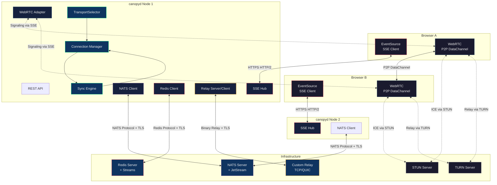
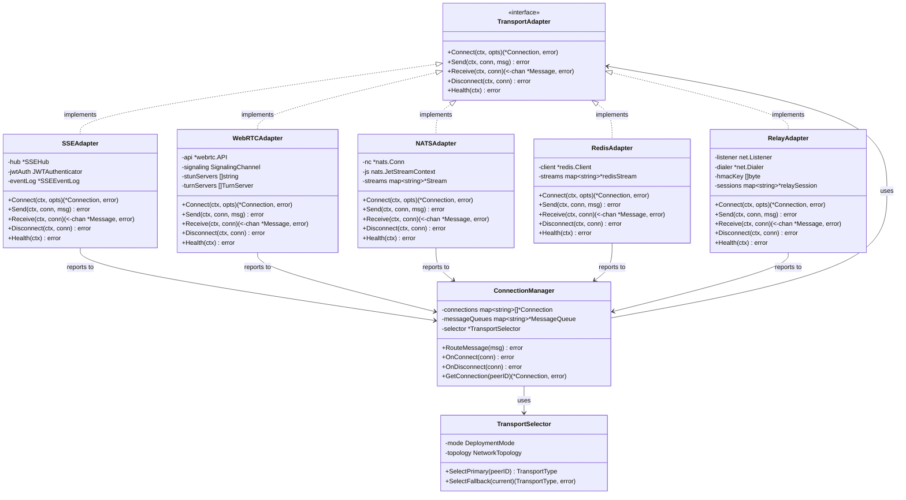

# T1.8 — Multi-Transport Architecture Design

> Status: COMPLETE | Date: 2026-07-20 | Author: coding-hermes-worker (Alexis Okuwa)
> References: T1.1 (SSE decision), T1.6 (deployment modes), T1.7 (MLS encryption)
> Target: Protocol-agnostic sync layer abstracting 5 transports behind a single Go interface.

---

## 1. Overview

### 1.1 Problem

Hermes Canopy spans **seven deployment modes** (local, LAN, self-hosted, SaaS, P2P, federated, air-gapped — per T1.6 §1). Each mode has different network topologies, latency profiles, and infrastructure availability. A single transport cannot satisfy all of them:

| Deployment Mode | Network Topology | Primary Requirement |
|---|---|---|
| **Local** | Loopback | Zero network overhead, no external deps |
| **LAN** | Same subnet, mDNS | Low-latency peer discovery |
| **Self-hosted** | Home server, NAT | Reliable relay through home firewall |
| **SaaS** | Cloud-hosted, public internet | HTTP/2 SSE + NATS backend (T1.1) |
| **P2P** | NAT'd peers, no central server | Direct P2P with NAT traversal |
| **Federated** | Multiple independent servers | Server-to-server message passing |
| **Air-gapped** | No internet, no cloud services | Self-hosted relay over TCP/QUIC |

### 1.2 Solution

A **Transport Adapter interface** in Go abstracts all transport backends behind a single contract. The system selects transports at runtime based on deployment mode and network conditions. All transports speak the same **relay protocol** (tree sync opcodes) so the sync engine never knows which wire is carrying its messages.

### 1.3 Design Principles

1. **Protocol agnosticism:** Sync engine works with `TransportAdapter` — never with raw SSE, WebRTC, or NATS APIs.
2. **Graceful degradation:** If the primary transport fails, fall back to secondary → tertiary without losing messages.
3. **Single opcode model:** Tree synchronization uses 13 self-describing opcodes that work identically over all transports.
4. **Offline-first:** Transports handle disconnection and replay through sequence-number-based resumption.
5. **Security by default:** MLS encryption (T1.7) sits above the transport layer. Each transport adds its own authentication and channel encryption.

---

## 2. Transport Adapter Interface

### 2.1 Go Interface

Every transport implements this exact interface. The sync engine never imports transport-specific packages.

```go
package transport

import (
    "context"
    "crypto/tls"
    "time"
)

// TransportAdapter is the uniform interface for all sync transports.
// Implementations: SSEAdapter, WebRTCAdapter, NATSAdapter, RedisAdapter, RelayAdapter.
type TransportAdapter interface {
    // Connect establishes a connection using the given options.
    // Returns ErrConnectionRefused if the peer actively rejects.
    // Returns ErrAuthFailed if credentials are invalid or expired.
    // Returns ErrTransportUnreachable if the peer cannot be reached (DNS, network, timeout).
    // Returns ErrTransportMismatch if opts.TransportType doesn't match the adapter.
    Connect(ctx context.Context, opts ConnectOptions) (*Connection, error)

    // Send transmits a message over an established connection.
    // Returns ErrConnectionClosed if conn.State is StateClosed.
    // Returns ErrSendTimeout if the operation exceeds the connection's send deadline.
    // Returns ErrPayloadTooLarge if msg.Payload exceeds the transport's max message size.
    Send(ctx context.Context, conn *Connection, msg *Message) error

    // Receive returns a channel that emits incoming messages for the connection.
    // The channel is closed when the connection terminates.
    // Returns ErrConnectionClosed if conn.State is StateClosed.
    // The caller must range over the channel; abandoning it leaks the goroutine.
    Receive(ctx context.Context, conn *Connection) (<-chan *Message, error)

    // Disconnect gracefully closes the connection.
    // Sends a disconnect frame/close message if the transport supports it.
    // Returns nil even if the connection is already closed (idempotent).
    Disconnect(ctx context.Context, conn *Connection) error

    // Health checks whether the transport backend is reachable and functional.
    // For SSE: pings the endpoint. For WebRTC: checks ICE connectivity.
    // For NATS: pings the NATS server. For Redis: PING command.
    // For relay: TCP health check to the relay address.
    // Returns ErrTransportUnreachable if the backend is down.
    // Returns ErrAuthExpired if credentials need rotation.
    Health(ctx context.Context) error
}
```

### 2.2 Supporting Types

```go
// ConnectOptions configures a new transport connection.
type ConnectOptions struct {
    // Target is the transport-specific address:
    //   SSE:  "https://canopy.example.com/trees/<id>/events"
    //   WebRTC: peer connection ID (not URL — negotiated via signaling)
    //   NATS: "nats://canopy.example.com:4222"
    //   Redis: "redis://canopy.example.com:6379"
    //   Relay: "tcp://relay.example.com:9443" or "quic://relay.example.com:9443"
    Target string

    // TransportType explicitly selects the transport.
    // Must match the adapter in use or Connect returns ErrTransportMismatch.
    TransportType TransportType

    // Auth carries transport-specific authentication material.
    // SSE: JWT Bearer token (Hermes auth token, per T1.1 §6)
    // WebRTC: DTLS certificate fingerprint
    // NATS: auth token or TLS client cert
    // Redis: AUTH password or ACL username+password
    // Relay: pre-shared HMAC key
    Auth AuthMaterial

    // Metadata is opaque key-value data for connection negotiation.
    // Examples: client version, capabilities bitmap, preferred codec.
    Metadata map[string]string

    // TLSConfig overrides the default TLS configuration.
    // If nil, the transport uses its secure defaults (TLS 1.3 minimum).
    TLSConfig *tls.Config

    // Timeout is the maximum time to wait for connection establishment.
    // Zero means transport default (typically 30s).
    Timeout time.Duration

    // MaxMessageSize is the maximum payload size in bytes accepted by this peer.
    // Exceeding this causes Send to return ErrPayloadTooLarge.
    // Zero means transport default (SSE: 1MB, NATS: 1MB, Redis: 512MB, WebRTC: 256KB per SCTP message, Relay: configurable).
    MaxMessageSize int64
}

// Connection represents an active transport connection to a peer.
type Connection struct {
    // ID is a globally unique connection identifier (UUIDv7).
    ID string

    // TransportType identifies which transport backs this connection.
    TransportType TransportType

    // Peer is the remote peer identifier (profile ID or server node ID).
    Peer string

    // Metadata is peer-negotiated metadata from connection setup.
    Metadata map[string]string

    // State is the current connection state.
    State ConnectionState

    // EstablishedAt is the timestamp when the connection entered StateActive.
    EstablishedAt time.Time

    // LastActivity is the timestamp of the most recent Send or Receive.
    LastActivity time.Time

    // SequenceWatermark is the highest sequence number received on this connection.
    // Used for loss detection and resumption.
    SequenceWatermark uint64
}

// ConnectionState models the lifecycle of a transport connection.
type ConnectionState int

const (
    StateInit        ConnectionState = iota // created, not yet connected
    StateConnecting                         // Connect() in progress
    StateActive                             // connected and operational
    StateDegraded                           // connected but slow/unreliable
    StateDisconnecting                      // Disconnect() in progress
    StateClosed                             // terminal
)

// TransportType enumerates all supported transports.
type TransportType string

const (
    TransportSSE    TransportType = "sse"
    TransportWebRTC TransportType = "webrtc"
    TransportNATS   TransportType = "nats"
    TransportRedis  TransportType = "redis"
    TransportRelay  TransportType = "relay"
)

// AuthMaterial carries transport-specific credentials.
type AuthMaterial struct {
    // Token is used by SSE (JWT), NATS (auth token), Redis (AUTH password).
    Token string

    // CertPEM and KeyPEM are used by NATS (TLS mutual auth), WebRTC (DTLS certificate).
    CertPEM []byte
    KeyPEM  []byte

    // HMACKey is used by the custom relay for message authentication.
    HMACKey []byte

    // Username is used by Redis ACL (Redis 6+).
    Username string
}
```

### 2.3 Error Types

```go
// Sentinel errors returned by TransportAdapter methods.
// All are defined in package transport so callers can use errors.Is.

var (
    ErrConnectionRefused    = errors.New("transport: connection refused by peer")
    ErrAuthFailed           = errors.New("transport: authentication failed")
    ErrAuthExpired          = errors.New("transport: credentials expired, rotation required")
    ErrTransportUnreachable = errors.New("transport: peer unreachable (DNS, network, timeout)")
    ErrTransportMismatch    = errors.New("transport: adapter type does not match requested transport")
    ErrConnectionClosed     = errors.New("transport: operation on closed connection")
    ErrSendTimeout          = errors.New("transport: send timed out")
    ErrPayloadTooLarge      = errors.New("transport: payload exceeds max message size")
    ErrSequenceGap          = errors.New("transport: gap detected in message sequence")
)
```

### 2.4 Connection Lifecycle

```
StateInit ──Connect()──▶ StateConnecting ──success──▶ StateActive
                              │                          │
                              │ (timeout/auth fail)      │ (latency spike, packet loss)
                              ▼                          ▼
                         StateClosed              StateDegraded
                                                       │
                                                       │ (recovery or timeout)
                                                       ▼
                                               StateActive / StateClosed
                                                       
StateActive ──Disconnect()──▶ StateDisconnecting ──cleanup──▶ StateClosed
```

All transports implement this state machine. `Disconnect()` is idempotent — calling it on `StateClosed` returns `nil`.

---

## 3. Transport Implementations

### 3.1 SSE Adapter (Primary)

**Role:** Server→client tree delta sync. The default transport for all HTTP-accessible deployment modes (local, LAN, self-hosted, SaaS).

**Why SSE is primary:** Per T1.1 §5 — built-in browser reconnection via EventSource + Last-Event-ID, HTTP/2 multiplexing eliminates connection limits, zero sticky sessions required. WebSocket is deferred to Phase 5+.

**Implementation sketch (Go):**

```go
type SSEAdapter struct {
    hub       *SSEHub        // connection registry + heartbeat
    jwtAuth   JWTAuthenticator // validates Hermes JWT tokens (Bearer)
    eventLog  *SSEEventLog    // Last-Event-ID indexed ring buffer
}

// SSEHub manages SSE connections as a registry of http.ResponseWriter + flusher pairs.
type SSEHub struct {
    mu          sync.RWMutex
    connections map[string]*sseConnection // keyed by connection ID
}

type sseConnection struct {
    id          string
    peer        string
    treeID      string
    w           http.ResponseWriter
    flusher     http.Flusher
    lastEventID uint64
    created     time.Time
    msgCh       chan *Message // buffered, closed on disconnect
}
```

**Connection lifecycle:**
1. Client sends `GET /trees/<treeID>/events` with `Authorization: Bearer <jwt>` and optional `Last-Event-ID: <seq>`.
2. Server validates JWT, registers the connection in SSEHub, opens an event stream (`Content-Type: text/event-stream`).
3. Server sends heartbeat every 15s: `: heartbeat\n\n` (SSE comment line — ignored by EventSource).
4. Messages arrive from the sync engine → hub pushes to `msgCh` → SSE writer formats as `id: <seq>\ndata: <json>\n\n`.
5. On disconnect: client's EventSource auto-reconnects with `Last-Event-ID` header. Server replays from the event log starting at that sequence number. No application code needed — all handled by the browser (T1.1 §1.2).

**HTTP/2 multiplexing:** `canopyd` serves SSE over HTTP/2 (requires TLS). All SSE streams for a user multiplex over a single TCP connection. Practical limit: 100+ streams per domain (T1.1 §1.1).

**Error paths:**
- `Connect` → `ErrAuthFailed`: JWT expired, invalid, or missing `tree:<id>:read` scope.
- `Connect` → `ErrConnectionRefused`: tree ID does not exist or user is not a member.
- `Send` → `ErrConnectionClosed`: browser tab closed; SSE stream terminated.
- `Send` → `ErrPayloadTooLarge`: message exceeds 1MB (SSE default max).

### 3.2 WebRTC Adapter (P2P)

**Role:** Direct browser-to-browser sync for P2P and LAN deployment modes. Bypasses the Go backend entirely for data plane traffic.

**Library:** `pion/webrtc` (Go WebRTC implementation, v4+). No CGo dependency.

**Architecture:**
```
Browser A ←──DataChannel (tree opcodes)──→ Browser B
     │                                           │
     └──────Signaling (via canopyd SSE)──────────┘
```

Signaling uses the existing SSE transport: offer/answer SDP and ICE candidates are exchanged through `canopyd` as signaling relay. Once the DataChannel is established, all tree sync opcodes flow P2P — the Go backend is no longer in the data path.

**Go implementation sketch:**

```go
type WebRTCAdapter struct {
    api          *webrtc.API          // pion API with custom SettingsEngine
    signaling    SignalingChannel     // SSE-backed signaling relay
    stunServers  []string             // STUN server URLs
    turnServers  []TurnServer         // TURN server configs with credentials
    connections  map[string]*webrtc.PeerConnection
}

type SignalingChannel interface {
    // SendOffer sends an SDP offer to the target peer via canopyd signaling.
    SendOffer(ctx context.Context, peerID string, sdp string) error
    // SendAnswer sends an SDP answer back.
    SendAnswer(ctx context.Context, peerID string, sdp string) error
    // SendICECandidate forwards an ICE candidate.
    SendICECandidate(ctx context.Context, peerID string, candidate string) error
    // OnOffer registers a callback for incoming SDP offers.
    OnOffer(handler func(peerID string, sdp string))
    // OnAnswer registers a callback for incoming SDP answers.
    OnAnswer(handler func(peerID string, sdp string))
    // OnICECandidate registers a callback for incoming ICE candidates.
    OnICECandidate(handler func(peerID string, candidate string))
}
```

**NAT traversal strategy (attempted in order):**
1. **Direct (same LAN):** Host ICE candidates resolve directly. Sub-1ms latency.
2. **STUN (server reflexive):** Both peers discover their public IP:port via STUN. Works for ~85% of home NATs.
3. **TURN (relay):** Relay through a TURN server when both peers are behind symmetric NATs. Adds relay latency (10-50ms) but guarantees connectivity.

**DataChannel configuration:**
- Ordered delivery: `ordered=true` (tree sync requires message ordering).
- Reliable: `maxRetransmits=0` (reliable mode, infinite retransmits).
- Binary protocol: opcodes sent as CBOR-encoded binary over the DataChannel (not JSON).

**Error paths:**
- `Connect` → `ErrTransportUnreachable`: ICE negotiation failed (no candidates, timeout). Both peers behind symmetric NAT with no TURN server.
- `Connect` → `ErrConnectionRefused`: peer explicitly rejected the SDP offer.
- `Send` → `ErrConnectionClosed`: DataChannel closed by remote peer.
- `Send` → `ErrSendTimeout`: DataChannel buffer full, peer not consuming messages.

### 3.3 NATS Adapter (Message Queue)

**Role:** Backend pub/sub fabric for multi-server deployments (SaaS, federated). Never exposed directly to browsers — browsers always speak SSE or WebRTC.

**Architecture (per T1.1 §3):**
```
Browser (EventSource) ←→ canopyd ←→ NATS ←→ canopyd ←→ Browser
```

**Subject hierarchy:**
```
canopy.tree.<treeID>.events      — tree sync opcodes
canopy.tree.<treeID>.commands     — client→server REST commands fanned out
canopy.connection.<nodeID>.status — connection health heartbeats
canopy.system.config             — global config updates
```

**JetStream configuration (offline queuing):**
```go
type NATSAdapter struct {
    nc      *nats.Conn
    js      nats.JetStreamContext
    streams map[string]*nats.StreamInfo // one stream per tree, created on demand
}

// Per-tree JetStream stream:
//   Name: CANOPY_TREE_<treeID>
//   Subjects: canopy.tree.<treeID>.events
//   MaxAge: 24h (events older than 24h are pruned)
//   MaxBytes: 100MB per tree
//   Replicas: 3 (in clustered NATS)
//   Retention: Limits (time + size based)
```

**Offline replay flow:**
1. Client disconnects. SSE stream closes.
2. canopyd continues subscribing to `canopy.tree.<treeID>.events` — JetStream buffers all messages.
3. Client reconnects with `Last-Event-ID: 42`.
4. canopyd creates an ephemeral JetStream consumer starting at sequence 43.
5. JetStream replays all buffered messages (43 → current).
6. Client catches up, consumer is destroyed, client switches to live subscription.

**Error paths:**
- `Connect` → `ErrTransportUnreachable`: NATS server unreachable (DNS, network partition).
- `Connect` → `ErrAuthFailed`: NATS auth token invalid or TLS cert not trusted.
- `Send` → `ErrConnectionClosed`: NATS connection lost mid-publish.
- `Send` → `ErrPayloadTooLarge`: message exceeds NATS `max_payload` (default 1MB, configurable to 8MB).

### 3.4 Redis Streams Adapter

**Role:** Alternative to NATS for teams already operating Redis. Same pub/sub + offline queuing semantics via Redis Streams and Consumer Groups.

**Why Redis as an option:** Many teams running self-hosted or SaaS deployments already have Redis for caching/sessions. Adding NATS as a second infrastructure component is operational overhead. Redis Streams (Redis 5.0+) provides equivalent pub/sub + persistent queue capabilities.

**Key design:**
```
canopy:tree:<treeID>:stream    — Redis Stream, one per tree
canopy:tree:<treeID>:group     — Consumer Group for offline replay
```

**Implementation sketch:**
```go
type RedisAdapter struct {
    client  *redis.Client
    streams map[string]*redisStream  // one per tree
}

type redisStream struct {
    treeID       string
    streamKey    string  // canopy:tree:<treeID>:stream
    groupName    string  // canopy:tree:<treeID>:group
    consumerName string  // canopy:node:<nodeID>
}

// Stream configuration:
//   MAXLEN: ~100,000 (approximate, capped)
//   Consumer Group: created on first Connect per tree
//   Message ID: sequence number (monotonic, gap detection)
//   Acknowledgment: XACK after message delivered to client
```

**Consumer group replay:**
1. Client disconnects → SSE stream closes.
2. Messages continue to `XADD` to the stream. Consumer group tracks the last-delivered ID.
3. Client reconnects with `Last-Event-ID: 42`.
4. canopyd issues `XREADGROUP` with ID `>` starting from the group's last ack'd position.
5. Messages 43→current are delivered, each `XACK`'d as the client confirms receipt.
6. Client caught up → switches to `XREAD` (no group, live tail).

**Error paths:**
- `Connect` → `ErrTransportUnreachable`: Redis server unreachable.
- `Connect` → `ErrAuthFailed`: Redis AUTH password incorrect, ACL user lacks stream access.
- `Send` → `ErrConnectionClosed`: Redis connection lost mid-`XADD`.
- `Send` → `ErrPayloadTooLarge`: message exceeds Redis string limit (512MB theoretical, practically bounded at 1MB).

### 3.5 Custom Relay Adapter (Air-Gapped)

**Role:** Self-hosted relay for air-gapped deployments where no cloud services (NATS, Redis, STUN/TURN) are available. Runs over any reliable ordered channel (TCP or QUIC).

**Wire protocol (binary):**
```
┌───────────────────────────────────────────────────┐
│ 4 bytes: Magic Number (0x43 0x41 0x4E 0x59) "CANY"│
│ 1 byte:  Protocol Version (1)                      │
│ 1 byte:  Opcode (see §4)                           │
│ 8 bytes: Sequence Number (uint64, big-endian)      │
│ 16 bytes: Tree ID (UUID, big-endian)               │
│ 8 bytes: Timestamp (Unix micro, uint64, big-endian)│
│ 4 bytes: Payload Length (uint32, big-endian)       │
│ 4 bytes: HMAC Length (uint32, big-endian)          │
│ N bytes: Payload (CBOR-encoded opcode body)        │
│ M bytes: HMAC-SHA256 (over all preceding bytes)    │
└───────────────────────────────────────────────────┘
Total header: 46 bytes + HMAC (32 bytes) = 78 bytes overhead
Max frame size: 1MB (configurable)
```

**Why CBOR instead of JSON:** Binary encoding reduces wire size by ~30-50% vs JSON. Important for air-gapped environments where bandwidth may be constrained (serial links, HF radio, mesh networks).

**Implementation sketch:**
```go
type RelayAdapter struct {
    listener   net.Listener         // TCP or QUIC listener (server mode)
    dialer     *net.Dialer          // outbound connection dialer (client mode)
    hmacKey    []byte              // pre-shared symmetric key
    sessions   map[string]*relaySession
    sessionMu  sync.RWMutex
}

type relaySession struct {
    conn         net.Conn
    peer         string
    established  time.Time
    lastRxSeq    uint64             // last received sequence number
    lastTxSeq    uint64             // last transmitted sequence number
    txCh         chan *Message      // outbound message queue
    done         chan struct{}
}

// Relay mode is determined at startup:
//   Server mode: canopyd --relay-listen tcp://0.0.0.0:9443
//   Client mode: canopyd --relay-connect tcp://relay.local:9443
```

**Connection flow:**
1. Client opens TCP/QUIC to relay address.
2. Client sends `HELLO` frame: protocol version, client ID, supported features bitmap.
3. Server responds with `HELLO_ACK`: server ID, agreed features, connection ID.
4. Both sides begin exchanging tree sync opcodes.
5. Heartbeat: `PING` frame every 30s (configurable). No `PONG` within 10s → connection dead → reconnect.
6. Disconnect: `BYE` frame sent, TCP connection closed.

**Error paths:**
- `Connect` → `ErrTransportUnreachable`: relay address unreachable (DNS, network).
- `Connect` → `ErrAuthFailed`: HMAC verification failed — wrong pre-shared key.
- `Connect` → `ErrConnectionRefused`: relay server rejected the HELLO (version mismatch, client not authorized).
- `Send` → `ErrConnectionClosed`: TCP connection broken.
- `Send` → `ErrPayloadTooLarge`: message exceeds `max_frame_size` configured for the relay.

---

## 4. Relay Protocol — Tree Sync Opcodes

### 4.1 Message Type

All transports use the same `Message` struct. The opcode model is transport-agnostic — it works over SSE (JSON), WebRTC DataChannel (CBOR), NATS (JSON or protobuf), Redis (JSON), and custom relay (CBOR).

```go
// Message is the universal sync message across all transports.
type Message struct {
    // Opcode identifies the operation.
    Opcode Opcode `json:"op" cbor:"0"`

    // TreeID is the UUID of the tree this message belongs to.
    TreeID string `json:"tree" cbor:"1"`

    // Sequence is a monotonic sequence number within the tree.
    // Gap detection: if seq > lastSeq + 1, trigger full re-sync.
    Sequence uint64 `json:"seq" cbor:"2"`

    // Timestamp is the Unix microsecond when the opcode was generated.
    // Used for causal ordering and conflict resolution.
    Timestamp int64 `json:"ts" cbor:"3"`

    // Payload is the opcode-specific JSON/CBOR body (see per-opcode types below).
    // The concrete type is determined by Opcode.
    Payload json.RawMessage `json:"data" cbor:"4"`

    // Origin identifies the node that generated this message.
    // For conflict resolution: if two messages mutate the same node, lowest Origin wins (lexicographic).
    Origin string `json:"origin" cbor:"5"`
}

// Opcode enumerates all tree sync operations.
type Opcode uint8

const (
    OpTreeCreate     Opcode = 0x01
    OpNodeAdd        Opcode = 0x02
    OpNodeUpdate     Opcode = 0x03
    OpNodeDelete     Opcode = 0x04
    OpEdgeAdd        Opcode = 0x05
    OpEdgeRemove     Opcode = 0x06
    OpApprovalChange Opcode = 0x07
    OpUserJoin       Opcode = 0x08
    OpUserLeave      Opcode = 0x09
    OpTreeSnapshot   Opcode = 0x0A
    OpTreeDelta      Opcode = 0x0B
    OpHeartbeat      Opcode = 0x0C
    OpAck            Opcode = 0x0D
)
```

### 4.2 Opcode Payload Definitions

#### `TREE_CREATE` (0x01)

```go
type TreeCreatePayload struct {
    Name        string            `json:"name"`
    Description string            `json:"description"`
    OwnerID     string            `json:"owner_id"`
    Visibility  string            `json:"visibility"` // "private", "shared", "public"
    Metadata    map[string]string `json:"metadata,omitempty"`
    MLSGroupID  string            `json:"mls_group_id"` // T1.7: MLS group for this tree
}
```

**Validation:** `tree_id` must not already exist. `owner_id` must be a valid profile ID.

#### `NODE_ADD` (0x02)

```go
type NodeAddPayload struct {
    NodeID      string             `json:"node_id"`
    ParentID    string             `json:"parent_id"` // "" for root
    ContentType string             `json:"content_type"` // "message", "card", "synthesis"
    Content     json.RawMessage    `json:"content"`
    AuthorID    string             `json:"author_id"`
    Metadata    map[string]string  `json:"metadata,omitempty"`
}
```

**Validation:** `parent_id` must reference an existing node in the same tree (or be empty for root). `author_id` must be a member of the tree.

#### `NODE_UPDATE` (0x03)

```go
type NodeUpdatePayload struct {
    NodeID    string             `json:"node_id"`
    Content   json.RawMessage    `json:"content,omitempty"` // nil = metadata-only update
    Metadata  map[string]string  `json:"metadata,omitempty"` // nil = no metadata change
    UpdatedBy string             `json:"updated_by"`
}
```

**Validation:** `node_id` must exist and not be tombstoned. Concurrent updates to the same node are resolved by LWW (Last Writer Wins) with `Timestamp` tiebreak.

#### `NODE_DELETE` (0x04)

```go
type NodeDeletePayload struct {
    NodeID    string `json:"node_id"`
    DeletedBy string `json:"deleted_by"`
    // Tombstone is set by the server after processing.
    // Clients should soft-delete (hide) nodes, not physically remove them.
}
```

**Validation:** `node_id` must exist. Deletion is soft — nodes are tombstoned, not removed. Tombstones are garbage-collected after 30 days (configurable).

#### `EDGE_ADD` (0x05)

```go
type EdgeAddPayload struct {
    EdgeID   string `json:"edge_id"`
    FromID   string `json:"from_id"` // source node
    ToID     string `json:"to_id"`   // target node
    EdgeType string `json:"edge_type"` // "reply", "fork", "synthesis"
    Metadata map[string]string `json:"metadata,omitempty"`
}
```

**Validation:** Both `from_id` and `to_id` must exist in the same tree and not be tombstoned. `edge_type` must be one of the three DAG edge types per AGENTS.md core concepts.

#### `EDGE_REMOVE` (0x06)

```go
type EdgeRemovePayload struct {
    EdgeID   string `json:"edge_id"`
    RemovedBy string `json:"removed_by"`
}
```

**Validation:** `edge_id` must exist. Edge removal does not delete the connected nodes — it only breaks the link.

#### `APPROVAL_CHANGE` (0x07)

```go
type ApprovalChangePayload struct {
    NodeID        string `json:"node_id"`
    FromState     string `json:"from_state"` // "pending", "approved", "rejected", "changes_requested"
    ToState       string `json:"to_state"`
    ApprovedBy    string `json:"approved_by"`
    Comment       string `json:"comment,omitempty"`
}
```

**Validation:** The state transition must be valid (e.g., `pending→approved`, not `approved→pending`). `approved_by` must have approval authority for this tree.

#### `USER_JOIN` (0x08)

```go
type UserJoinPayload struct {
    UserID    string `json:"user_id"`
    Role      string `json:"role"` // "owner", "editor", "viewer"
    JoinedVia string `json:"joined_via"` // "invite", "public_link", "federation"
}
```

#### `USER_LEAVE` (0x09)

```go
type UserLeavePayload struct {
    UserID   string `json:"user_id"`
    Reason   string `json:"reason"` // "voluntary", "removed", "kicked"
    RemovedBy string `json:"removed_by,omitempty"` // set when reason="removed" or "kicked"
}
```

#### `TREE_SNAPSHOT` (0x0A)

```go
type TreeSnapshotPayload struct {
    Nodes     []NodeSnapshot `json:"nodes"`
    Edges     []EdgeSnapshot `json:"edges"`
    Version   uint64         `json:"version"` // sequence number this snapshot represents
    Checksum  string         `json:"checksum"` // SHA-256 of canonical node+edge serialization
}

type NodeSnapshot struct {
    NodeID      string            `json:"node_id"`
    ParentID    string            `json:"parent_id"`
    ContentType string            `json:"content_type"`
    Content     json.RawMessage   `json:"content"`
    AuthorID    string            `json:"author_id"`
    Metadata    map[string]string `json:"metadata,omitempty"`
    Tombstone   bool              `json:"tombstone"`
    CreatedAt   int64             `json:"created_at"`
    UpdatedAt   int64             `json:"updated_at"`
}

type EdgeSnapshot struct {
    EdgeID   string `json:"edge_id"`
    FromID   string `json:"from_id"`
    ToID     string `json:"to_id"`
    EdgeType string `json:"edge_type"`
}
```

**Validation:** `checksum` must match the computed SHA-256 of the canonical representation. The recipient verifies this before applying the snapshot.

#### `TREE_DELTA` (0x0B)

```go
type TreeDeltaPayload struct {
    BaseVersion   uint64           `json:"base_version"` // sequence number this delta is relative to
    TargetVersion uint64           `json:"target_version"`
    AddedNodes    []NodeAddPayload `json:"added_nodes"`
    UpdatedNodes  []NodeUpdatePayload `json:"updated_nodes"`
    RemovedNodes  []string         `json:"removed_nodes"` // node IDs
    AddedEdges    []EdgeAddPayload `json:"added_edges"`
    RemovedEdges  []string         `json:"removed_edges"` // edge IDs
}
```

**Validation:** `base_version` must equal the recipient's current version. If not, recipient requests the correct delta (or falls back to full snapshot).

#### `HEARTBEAT` (0x0C)

```go
type HeartbeatPayload struct {
    // No payload — the presence of the opcode is the heartbeat.
    // Sequence number is still incremented (gap detection).
}
```

Heartbeats are sent every 15s (SSE) to 30s (relay, NATS) when no data messages are flowing. If no heartbeat or data is received for 3 heartbeat intervals, the connection is considered dead.

#### `ACK` (0x0D)

```go
type AckPayload struct {
    AcknowledgedSeq uint64 `json:"ack_seq"` // all messages up to this sequence have been received and applied
}
```

**Flow:** Receiver periodically sends ACK with the highest contiguous sequence number it has processed. Sender can then release buffered messages below that sequence. Non-contiguous ACKs (gaps) indicate loss — sender retransmits missing messages or triggers re-sync.

### 4.3 Sequence Number Rules

1. **Monotonic:** Sequence numbers within a tree MUST be strictly increasing. The server is the authoritative sequencer.
2. **Gap detection:** If `seq > lastSeq + 1`, the receiver issues `ACK(lastSeq)` and the sender retransmits from `lastSeq+1`. If gaps persist after 3 retransmissions, fall back to `TREE_SNAPSHOT`.
3. **Tree-scoped:** Sequence numbers are per tree, not global. Tree `<uuid-A>` and Tree `<uuid-B>` have independent sequences.
4. **Wraparound:** With uint64 at 100K ops/second, wraparound takes ~5.8 million years. Not a practical concern.

---

## 5. Connection Manager

### 5.1 Responsibility

The Connection Manager is the central component that owns all transport connections and routes messages between the sync engine and the active transport for each peer.

```go
// ConnectionManager tracks all connections across all transports.
type ConnectionManager struct {
    // connections maps member/peer ID to their active connections.
    // A peer may have multiple connections (primary + fallback during transition).
    connections map[string][]*Connection

    // messageQueues buffers outbound messages per peer when no connection is active.
    messageQueues map[string]*MessageQueue

    // selector determines which transport to use for a given peer.
    selector *TransportSelector

    mu sync.RWMutex
}

// MessageQueue is a bounded ring buffer for offline message storage.
type MessageQueue struct {
    peerID   string
    buffer   []*Message          // ring buffer
    head     int                 // write position
    tail     int                 // read position
    capacity int                 // max messages (default: 10,000)
    size     int                 // current count
    mu       sync.Mutex
}
```

### 5.2 Graceful Degradation

When the primary transport fails, the Connection Manager attempts fallback in order:

```
SSE fails
  → try WebRTC (if peer supports P2P)
    → try NATS (if NATS backend is available)
      → try Redis (if Redis is configured)
        → try Custom Relay (if relay is configured)
          → BUFFER (store messages, retry primary on exponential backoff)
```

**Degradation triggers:**
- `Health()` check fails 3 times in 60 seconds → transport marked degraded.
- `Send()` returns `ErrConnectionClosed` → immediate failover to next transport.
- `Receive()` channel closes without explicit `BYE` → transport marked degraded, attempt reconnect.

### 5.3 Bandwidth Adaptation

```go
type BandwidthProfile struct {
    // BytesPerSecond is the measured throughput in the last window.
    BytesPerSecond int64

    // LatencyMs is the round-trip time in milliseconds.
    LatencyMs int64

    // PacketLoss is the observed loss rate (0.0 - 1.0).
    PacketLoss float64
}
```

The Connection Manager measures bandwidth per connection using a 10-second sliding window. When bandwidth drops below thresholds:

| Bandwidth | Behavior |
|---|---|
| >1 MB/s | Full payload: node content, metadata, inline card data |
| 100KB/s - 1MB/s | Reduced payload: content trimmed to first 4KB, card data as references |
| <100KB/s | Minimal payload: node IDs + change descriptions only, content fetched on-demand via REST |
| Binary available | Switch to CBOR encoding if the transport supports binary (WebRTC DataChannel, relay) |

### 5.4 Connection Pool Limits

| Limit | Value | Rationale |
|---|---|---|
| Max connections per peer | 3 | Primary + 1 fallback during transition + 1 signaling |
| Max total connections (SSE) | 10,000 | Per-node limit, bounded by file descriptors |
| Max total connections (WebRTC) | 100 | Browser and server resource limits |
| Max total connections (NATS) | 1 (shared) | Single NATS connection multiplexes all subjects |
| Max total connections (Redis) | 1 (shared) | Single Redis connection with connection pooling |
| Max relay sessions | 500 | Per relay node, bounded by TCP file descriptors |

---

## 6. Transport Selection Matrix

### 6.1 Selection Algorithm

```go
// TransportSelector picks the best transport for a deployment mode.
type TransportSelector struct {
    mode          DeploymentMode
    topology      NetworkTopology
    available     []TransportType  // transports this node has configured
}

// SelectPrimary returns the best transport for the current deployment mode.
func (ts *TransportSelector) SelectPrimary(peerID string) TransportType

// SelectFallback returns the next transport to try after primary failure.
func (ts *TransportSelector) SelectFallback(current TransportType) (TransportType, error)
```

### 6.2 Priority Matrix

| Deployment Mode | 1st Choice | 2nd Choice | 3rd Choice | Reasoning |
|---|---|---|---|---|
| **Local** | SSE (localhost, HTTP/2) | — | — | Loopback SSE has zero overhead. No network transport needed. |
| **LAN** | WebRTC (P2P, direct) | SSE (LAN IP) | Relay (LAN relay) | P2P eliminates server hop. Falls back to SSE if WebRTC fails. |
| **Self-hosted** | SSE (HTTP/2, cloudflared tunnel) | WebRTC (STUN/TURN) | Relay | HTTP/2 SSE works through cloudflared tunnels. WebRTC for P2P when peers are on same LAN. |
| **SaaS** | SSE (HTTP/2) + NATS backend | Redis Streams | Relay | T1.1 established SSE + NATS as the primary architecture for server→client sync. |
| **P2P** | WebRTC (P2P, STUN/TURN) | Relay (public relay) | — | No central server. WebRTC is designed for this. Relay as fallback. |
| **Federated** | NATS (server-to-server) | Redis Streams | WebRTC (server P2P) | Server-to-server messages over NATS mesh. Redis for teams already clustered with Redis. |
| **Air-gapped** | Custom Relay (TCP/QUIC) | — | — | Single transport. No cloud dependencies. Relay is the only option. |

### 6.3 Network Topology Detection

At startup, `canopyd` probes the network to determine its topology:

```go
type NetworkTopology int

const (
    TopologyLoopback  NetworkTopology = iota // 127.0.0.1, ::1
    TopologyLAN                              // same subnet, mDNS discoverable
    TopologyNAT                              // behind NAT, public IP via STUN
    TopologyPublic                           // direct public IP, no NAT
    TopologyAirGapped                        // no internet connectivity detected
)

// Topology detection:
// 1. Check if canopyd listen address is loopback → TopologyLoopback
// 2. Try mDNS discovery of other canopyd nodes → TopologyLAN
// 3. STUN query (stun.l.google.com:19302) — if public IP != local IP → TopologyNAT
// 4. If STUN succeeds and public IP == local IP → TopologyPublic
// 5. If STUN fails (DNS + connect) → TopologyAirGapped
```

### 6.4 Transport Capability Flags

Each transport advertises capabilities in its `ConnectOptions.Metadata`:

```go
const (
    CapBinary       = "binary"        // supports binary encoding (WebRTC, relay)
    CapOrdered      = "ordered"       // guarantees in-order delivery
    CapReliable     = "reliable"      // guarantees no message loss
    CapBidirectional = "bidirectional" // supports client→server messages
    CapOfflineQueue = "offline_queue"  // has built-in offline queuing (NATS JetStream, Redis Streams)
    CapP2P          = "p2p"           // direct peer-to-peer (WebRTC)
)
```

Capability negotiation at connection time:
```go
func negotiateCapabilities(local, remote []string) []string {
    // Intersection: both peers must support the capability for it to be used.
    // Example: if both advertise "binary", switch to CBOR. Otherwise, JSON.
}
```

---

## 7. Security Model

### 7.1 Authentication Per Transport

| Transport | Auth Mechanism | Credential Lifecycle |
|---|---|---|
| **SSE** | Hermes JWT (Bearer token) in HTTP `Authorization` header. Token scoped: `tree:<id>:read`. | Short-lived (15 min), refreshed via `POST /auth/refresh`. Connection established with current token. Reconnection uses new token if expired. |
| **WebRTC** | DTLS-SRTP (RFC 5764). DTLS handshake uses self-signed certificate fingerprints exchanged via SSE signaling channel. | Certificates generated per session. Fingerprint verified during signaling. No long-lived creds. |
| **NATS** | Auth token (`nats-server --auth <token>`) or TLS mutual auth (`tls { cert_file, key_file, verify: true }`). | Token rotated on canopyd startup via `--nats-token`. TLS certs managed by Let's Encrypt or enterprise CA. |
| **Redis** | `AUTH <password>` (Redis ≤5) or `AUTH <username> <password>` (Redis 6+ ACL). | Password stored in environment variable `CANOPY_REDIS_PASSWORD`. ACL users per canopyd node for audit. |
| **Custom Relay** | HMAC-SHA256 over every frame using pre-shared key. | Key distributed out-of-band (USB, QR code, manual entry). Rotated on security incidents. |

### 7.2 Channel Encryption

| Transport | Encryption Layer | Minimum Version |
|---|---|---|
| **SSE** | TLS (HTTP/2 requires TLS in browsers) | TLS 1.3 |
| **WebRTC** | DTLS-SRTP (mandatory per WebRTC spec) | DTLS 1.2+ (SCTP over DTLS) |
| **NATS** | TLS (nats-server TLS config) | TLS 1.3 |
| **Redis** | TLS (Redis TLS, `tls-port 6380`) | TLS 1.3 |
| **Custom Relay** | TLS (TCP) or QUIC (built-in TLS 1.3) | TLS 1.3 |

### 7.3 Message-Level Encryption

All transports carry the same `Message` struct. Per T1.7, MLS encryption is applied to the `Payload` field before the message reaches the transport layer. The transport never sees plaintext node content.

```
┌───────────────────────────────────────────────────────────┐
│ Application Layer: Node content (JSON, Cards, text)        │
├───────────────────────────────────────────────────────────┤
│ MLS Layer (T1.7): Encrypts Payload with tree/topic group   │
│   key. Transparent to transport.                           │
├───────────────────────────────────────────────────────────┤
│ Transport Layer (this spec): Opcode + encrypted payload +  │
│   transport auth (JWT, DTLS, HMAC, TLS cert).             │
└───────────────────────────────────────────────────────────┘
```

**Relay certificate pinning:** For the custom relay, clients pin the server's TLS certificate fingerprint at first connect (TOFU — Trust On First Use). Subsequent connections verify the cert hasn't changed. If it changes, the client warns the user and requires manual approval (MITM detection).

### 7.4 Threat Model Summary

| Threat | Mitigation |
|---|---|
| Eavesdropping on SSE | TLS 1.3 encrypts the HTTP/2 stream |
| Eavesdropping on P2P | DTLS-SRTP encrypts the DataChannel |
| Eavesdropping on relay | TLS 1.3 + cert pinning |
| Message tampering | HMAC per frame (relay); TLS MAC (all others); MLS authentication tag |
| Replay attacks | Sequence numbers are monotonic. Duplicate seq → dropped. Old seq → ignored. |
| Impersonation | JWT with short expiry (SSE); DTLS fingerprint verified out-of-band (WebRTC); HMAC with pre-shared key (relay) |
| Downgrade attack | All adapters enforce minimum TLS 1.3. Version negotiation rejects older versions. |
| Metadata leakage | MLS encrypts content. Transport sees: opcode type, tree UUID, sequence, timestamp. Does NOT see: node content, author identity, card data. |

---

## 8. Architecture Diagram

### 8.1 Transport Topology



### 8.2 Transport Adapter Class Hierarchy



---

## 9. Testing Strategy

### 9.1 Unit Tests (Phase 4a)

| Test | Description | Mock Required |
|---|---|---|
| `TestSSEAdapter_Connect` | JWT validation, connection registration, Last-Event-ID handshake | Mock `http.ResponseWriter`, `http.Request` |
| `TestSSEAdapter_Send` | Message formatting, `id:` and `data:` fields, sequence numbering | Mock flusher |
| `TestSSEAdapter_Receive` | Event parsing, JSON deserialization to `Message` | Mock event stream |
| `TestSSEAdapter_Disconnect` | Connection removal, idempotency | Mock hub |
| `TestWebRTCAdapter_Connect` | SDP offer/answer flow, ICE candidate exchange | Mock `SignalingChannel`, mock `webrtc.PeerConnection` |
| `TestWebRTCAdapter_NATTraversal` | Direct → STUN → TURN fallback logic | Mock ICE agent |
| `TestNATSAdapter_Connect` | Subject subscription, consumer group creation | Embedded NATS server (`nats-server -js`) |
| `TestNATSAdapter_OfflineReplay` | JetStream message replay after disconnect/reconnect | Embedded NATS with JetStream |
| `TestRedisAdapter_Connect` | Stream creation, consumer group setup | `miniredis` (in-process Redis) |
| `TestRedisAdapter_AckFlow` | XACK after delivery, consumer group offset tracking | `miniredis` |
| `TestRelayAdapter_Connect` | TCP handshake, HELLO/HELLO_ACK, HMAC validation | Mock `net.Conn` |
| `TestRelayAdapter_FrameEncoding` | Binary frame encode/decode, CBOR payload | Real relay codec |
| `TestConnectionManager_Degradation` | Kill transport → verify fallback to next | Mock adapters with controlled failure |
| `TestTransportSelector_Priority` | Each deployment mode → correct primary transport | Table-driven test |

### 9.2 Integration Tests (Phase 4b)

| Test | Description |
|---|---|
| `TestSSE_EndToEnd` | Real `net/http` server, real `EventSource` (via headless browser or Go SSE client), full Connect → Send → Receive → Disconnect lifecycle |
| `TestSSE_Reconnection` | Kill server mid-stream, restart, verify client resumes from `Last-Event-ID` |
| `TestNATS_EndToEnd` | Real `nats-server -js`, two `canopyd` instances, publish on one, verify other receives |
| `TestRedis_EndToEnd` | Real Redis server, two canopyd instances, XADD/XREADGROUP cycle |
| `TestWebRTC_EndToEnd` | Two `pion` peers, real STUN server, direct data channel exchange |
| `TestRelay_EndToEnd` | Real TCP listener + dialer, full HELLO handshake, message exchange |
| `TestMultiTransport_SamePayload` | Send identical `Message` over all 5 transports, verify identical `Message` received |

### 9.3 Chaos Tests (Phase 4c)

| Test | Description |
|---|---|
| `TestSSEFailoverToWebRTC` | SSE connection killed → ConnectionManager switches to WebRTC → messages delivered |
| `TestWebRTCFailoverToRelay` | TURN server killed → WebRTC fails → ConnectionManager switches to relay |
| `TestTransportKillMidStream` | Kill transport during active message stream → verify no message loss (sequence continuity) |
| `TestNetworkPartition` | Isolate node from NATS → messages queue → reconnect → all messages delivered |
| `TestSlowConsumer` | Artificially delay message consumption → verify backpressure (send buffer fills, Send blocks or errors) |
| `TestSequenceGapRecovery` | Inject gap in sequence numbers → verify gap detection → full re-sync via `TREE_SNAPSHOT` |

### 9.4 Compatibility Tests (Phase 4d)

| Test | Description |
|---|---|
| `TestSSE_To_WebRTC_Fallback` | Start with SSE, degrade to WebRTC, verify no duplicate messages |
| `TestWebRTC_To_Relay_Fallback` | Start P2P, degrade to relay, verify message ordering preserved |
| `TestAllTransports_JSON_Interop` | All transports produce identical JSON for the same `Message` (for mixed-transport deployments) |

### 9.5 Test Infrastructure

```go
// transporttest package provides shared test utilities.
package transporttest

// MockTransport implements TransportAdapter for unit testing ConnectionManager.
type MockTransport struct {
    ConnectFunc    func(ctx context.Context, opts ConnectOptions) (*Connection, error)
    SendFunc       func(ctx context.Context, conn *Connection, msg *Message) error
    ReceiveFunc    func(ctx context.Context, conn *Connection) (<-chan *Message, error)
    DisconnectFunc func(ctx context.Context, conn *Connection) error
    HealthFunc     func(ctx context.Context) error
}

// NewHarness creates a test harness with:
//   - embedded NATS server (nats-server -js, random port)
//   - miniredis instance (random port)
//   - real Go HTTP test server for SSE
//   - mock WebRTC adapter (pion without real STUN)
//   - mock relay adapter (loopback TCP)
func NewHarness(t *testing.T) *Harness
```

---

## 10. References

- **T1.1** — Transport Research: SSE vs WebSocket vs NATS. Established SSE as primary transport, NATS as backend queue.
- **T1.6** — WebUI Native App Evaluation. Defines 7 deployment modes, Go embed + localhost for MVP.
- **T1.7** — MLS-Only Encryption Architecture. MLS sits above the transport layer. Message-level encryption applied to `Payload` before transport.
- **AGENTS.md** — Conversation DAG (reply/fork/synthesis edges), Context Compiler, Cards as graph nodes.
- `pion/webrtc` — Go WebRTC library (https://github.com/pion/webrtc)
- `nats.go` — Go NATS client (https://github.com/nats-io/nats.go)
- `go-redis` — Go Redis client (https://github.com/redis/go-redis)
- CBOR (RFC 8949) — Binary JSON alternative used by WebRTC DataChannel and relay
- WebRTC DTLS-SRTP (RFC 5764)
- NATS JetStream — https://docs.nats.io/nats-concepts/jetstream
- Redis Streams — https://redis.io/docs/latest/develop/data-types/streams/
